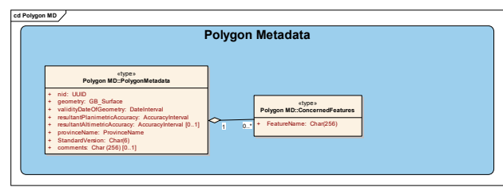

National Hydro Network, Canada, Level 1

Data Model Edition 1.0 2004-08 Gouvernement du Canada Ressources naturelles Canada Centre canadien de la cartographie et d'observation de la Terre Service à la clientèle de GéoGratis Téléphone : +01-819-564-4857 1-800-661-2638 (Canada et États-Unis)
Télécopieur : +01-819-564-5698 Courriel : geoginfo@RNCan.gc.ca URL : www.GeoGratis.gc.ca

# Copyright Notice

© Her Majesty the Queen in Right of Canada, Department of Natural Resources.

All rights reserved.

GeoBase®

| Date           | Version   | Description                                                                                                                                                                                                         |
|----------------|-----------|---------------------------------------------------------------------------------------------------------------------------------------------------------------------------------------------------------------------|
| September 2002 | Draft 01  | First draft for discussion with Nova Scotia                                                                                                                                                                         |
| January 2003   | Draft     | Second draft after discussion with Nova Scotia and major review of the  hydro network model through:   Proposal of options                                                                                         |
| March 2003     | Alpha     | Draft version after discussion and decisions made concerning NHNC1  scope and content with Nova Scotia and British Columbia                                                                                         |
| July 2003      | Draft 02  | Draft version after discussion and decisions made concerning the  detailed NHNC1 model and content with Nova Scotia, British  Columbia, and the Yukon. Meeting in Victoria, May 2003.                               |
| December 2003  | Draft     | Integration of UML model for both LRS and Segmented views of the  NHNC1.                                                                                                                                            |
| February 2004  | Draft     | English review; Remove the UML model for the Segmented view.                                                                                                                                                        |
| May 2004       | Draft     | Update from the March Workshop comments.                                                                                                                                                                            |
| August 2004    | 2004.1    | The object metadata attribute « date » is renamed « validity_date » in  section 3.1.6.2 and at all other parts referring to object metadata. A new Feature type value is added for inland water (see section 3.1.5) |

## Revision History

| Key word   | Description   |
|------------|---------------|

## Future Work Table Of Contents

| OVERVIEW   |                             |
|------------|-----------------------------|
| 1          |                             |
| 2          | LRS.                        |
| 2.1        | LRS MODEL…                  |
| 3          | MODEL                       |
| 3.1        | LRS MODEL.                  |
| 3.1.1      | Logical view .              |
| 3.1.2      | Hydro network.              |
| 3.1.3      | Hydro events                |
| 3.1.4      | Hydrographic .              |
| 3.1.5      | Toponymy (external package) |
| 3.1.6      | Metadata .                  |

## Abbreviations

| LRM   | Linear Reference Method                 |
|-------|-----------------------------------------|
| LRS   | Linear Reference System                 |
| NHNC1 | National Hydro Network, Canada, Level 1 |
| NID   | National Identifier                     |
| NRCan | Natural Resources Canada                |

TERMS AND DEFINITIONS

## 1 Overview

The data model can (and must) extend beyond the smallest common denominator obtained with the partners. The model must therefore contain two levels of information: mandatory data (black boxes) and optional data (grey boxes). Data homogeneity will thereby be ensured by a minimum set of data. Beyond the minimum level, the model serves as a target for all partners. Over the years, we will therefore work towards raising the minimum and redefining new targets. Minimum content will be defined for attributive and geometric data (see Figure 1 - Specifications expansion).

Figure 1 - Specifications **expansion**

## 2 Lrs

The Linear Reference System (LRS) is considered the most viable approach for managing and distributing geospatial information when several distinct organizations are involved (distributed approach). 

This method makes it possible to divide a standard spatial object into two parts: the geometric and attribute parts. The geometric part (Network Linear Component in the NHNC1) describes the position of the feature without describing its nature. The attribute part (or event) describes specific information observed along its linear geometric representation. Event information does not alter the geometric representation in any way. The event's position is given relatively from the beginning of the linear geometric representation. A Point Event is determined by a specific location, while a Linear Event is defined by a starting and ending measurement. Several Linear Methods (LRMs) can be used. (They are not discussed in this document). By using this approach we can share a common geometry while each application can add their set of attributes (events) in relationship with the Water Network geometry. 

## 2.1 Lrs Model

Four packages constitute the NHNC1 : Hydro Network, Hydrographic, *Hydro Events* and *Metadata*. The Hydro Network package contains the set of classes that form the linear network. The *Hydrographic* package contains the set of classes that form the graphical representation of features related to the linear network. The *Hydro Event* package contains attributive information that are referenced to *Hydro Network* geometry.The *Metadata* package contains information that describes the data themselves (date, accuracy, and so on). The portion of toponymy associated to Hydro feature data is part of the National Toponymy Model. This model associates geometries with official names and the classes used from the Toponymy Model are described in an external package called *Toponymy* for better understanding (issues involving text placement on paper or computer screen are excluded from consideration at this point).

Figure 2 - Packages in the NHNC1 LRS model

## 3 Model

The model presented below include descriptions of five packages, including the description of relationships between classes belonging to different packages and the toponymy external package.

3.1 **LRS model** 3.1.1 Logical view 

## 3.1.2 Hydro Network

 

3.1.3 Hydro events 

cd Hydro Ev ents

## 3.1.3.1 Point Events

cd PointEv ents

## 3.1.3.2 Line Events

cd LineEv ents

## 3.1.4 Hydrographic

There are implied associations with all hydrographic features and the Hydro Network could be defined 

 

3.1.4.1 *Hydrographic Water Areas*

## 3.1.4.2 Hydrographic Obstacle

3.1.4.3 *Manmade Hydrographic*

3.1.5 Toponymy (external package) 

3.1.6 Metadata 3.1.6.1 *Polygon Metadata*

## 3.1.6.2 Object Metadata

cd NHN LRS Profile Global Model

