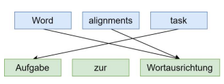
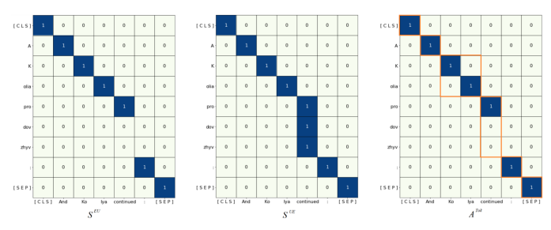

# Cross-Lingual Named Entity Recognition For The Ukrainian Language Based On Word Alignment

Artem Kramov Research Department One AI & Seven Pro Kharkiv, Ukraine artem@oneai.com Abstract- Processing of low-resource languages is one of the most challenging tasks in the area of natural language processing. The lack of datasets makes it complex to create and train corresponding models that are available for highresource languages. In this paper, the possibility of the usage of the word alignment mechanism for the performing of the cross-lingual tasks has been analyzed for the low-resource language by the example of the Ukrainian language for the solving of the named entity recognition task. Different state-ofthe-art word alignment methods have been analyzed. The advisability of the usage of the pre-trained multilingual models for the word alignment of low-resource languages has been shown. The experimental verification of the effectiveness of the chosen word alignment method for the solving of the named entity recognition for a Ukrainian corpus has been performed with different options. The results obtained may indicate the possibility of the usage of the considered word alignment method for the solving of different sequence labeling tasks for the Ukrainian language by performing the cross-lingual mapping of the results for the target English language.

Keywords-word alignment, cross-lingual named entity recognition, natural language processing, low-resource languages, multilingual models

## I. Introduction

The availability of the huge amount of data, and the possibility to process them according to computational power, led the recent advances in different domains [1, 2, 3]. However, the lack of data for the solving of AI-related tasks still should be considered a relevant problem, especially, in the area of natural language processing (NLP). Thus, despite the recent achievements in solving the different kinds of tasks for high-resource languages, the processing of lowresource languages still remains a relevant problem in the area of natural language processing. A high-resource language (e.g., English, Chinese) implies the availability of a huge amount of labeled/unlabeled corpora of the corresponding language that allow training models in a supervised or unsupervised manner for the solving of NLP
tasks. The NLP problems for these languages are mostly well-studied, and the corresponding different software tools are presented as well. In contrast, low-resource languages can be considered as less studied, less commonly taught, and less privileged [4]. Namely, the main problem consists in the lack of data for these languages, especially for tasks that require the previous labeling of a dataset by experts (e.g.,
named entity recognition, coreference resolution, etc.). In order to overcome this problem, different approaches can be used.

Multilingual training implies the usage of the training data of several languages simultaneously, thus, adjusting the model to share common knowledge between different languages while performing a corresponding bias to each of Sergiy Pogorilyy Computer Engineering Department Taras Shevchenko National University of Kyiv Kyiv, Ukraine sdp77@univ.net.ua them according to the features of the specific language. For instance, the multilingual BERT model [5] was pre-trained on a set of texts of different languages that allow utilizing this model for fine-tuning according to the corresponding task [6]. However, such an approach still requires the availability of the training data for the low-resource language or at least the availability of semantically and grammatically similar language among the languages that were used during the training process. In order to overcome this problem, the word alignment mechanism can be used.

Word alignment can be considered as "the task of finding the correspondence between source and target words in a pair of sentences that are translations of each other" [7]. Fig. 1 demonstrates the example of the word alignment for the English and German sentences: "Word alignments task" and
"Aufgabe zur Wortausrichtung" correspondingly.

The German-language sentence represents the translation of the English one.

Fig. 1. Example of the word alignment between English and German sentences. Each arrow represents the connection between English words
(blue background) and German words (green background).

As can be seen from Fig. 1., the word "task" is aligned with the word "Aufgabe", both words "Word" and single
"alignments" are connected with a word
"Wortausrichtung"; the German token "zur" isn't aligned with any English token at all. The availability of such connections allows providing an ability to transfer the results retrieved for the target language (e.g., the English language)
to the source-language text by mapping the corresponding words. In the case of low-resource languages, such a technique may help transfer the generated output markup of the high-resource language text to the low-resource language text according to the considered task without using any additional training data (zero-shot cross-lingual transferring
[8]).

The Ukrainian language falls into the category of lowresource languages. Namely, the lack of labeled corpora still remains the main issue for solving the variety of NLP tasks
[9, 10]. Taking into account the recent advances in performing the neural machine translation for low-resource languages [11], the usage of the word alignment looks like a promising direction for the Ukrainian language. The key problem consists in the absence of the dataset for the word alignment task itself: the number of available language pairs is limited due to the complexity of the labeling (experts should know both languages and mark all word pairs manually). Therefore, it is suggested to consider the word alignment for the Ukrainian language in terms of other NLP
tasks. Taking into account the availability of the labeled dataset for the Ukrainian-language Named Entity Recognition (NER) [12], this task was selected as the benchmark of the word alignment between Ukrainian and English sentences. Thus, the purposes of this work are the following:
.

Analysis of alignment.
state-of-the-art methods of word
●

Experimental verification of the effectiveness of the usage of a word alignment for performing the crosslingual named entity recognition for pairs of Ukrainian and English sentences.

Comparison of the retrieved results with the Ukrainian-language NER models, analysis of the type of errors of the considered cross-lingual NER
method.

## Ii. Word Alignment

Back to statistical machine translation models [13], word alignment was a crucial part of the translation performance.

The word alignment problem was first commonly introduced in the paper [14] that describes a sequence of increasingly complex IBM models: Model 1, Model 2, Model 3, Model 4, and Model 5 (Model 6 was proposed later). The main purpose of IBM models consists in the translation of sentences from one language to another by applying the Expectation-Maximization algorithm for the optimization of parameters. The word alignment was used as a separate intermediate step for the calculation of the conditional probability P(f |e) where f = {f1, ... , fm} is a sourcelanguage (French) sentence that consists of m words, e = {e1, ... , e1} is a target-language (English) sentence that consists of I words. In order to estimate the mentioned probability P(f |e), the authors suggested to add additional alignment variables
{a1,a2,...,am} (each variable corresponds to the word fi, i = 1, .. , m ) that may take values from the range {1, .. , } . In other words, the alignment variables define the aligned word from the target sentence e for the correspondent word fi . Thus, new following conditional probability distribution defined:
is P(f 1 ... , fm, a1, ... , a] e1 , ... , e1 )
that can pe calculated according to the alignment variables (how well the aligned words match each other). After that the desired conditional probability P(f |e) is calculated in the following manner:

$$P(f\,|\,s)=\sum_{a_{1}=0}^{l}\sum_{a_{2}=0}^{l}...\sum_{a_{m}=0}^{l}P(f_{1}...,f_{m},a_{1},...,a_{l}\,|\,e_{1},...,e_{l})\,\,\,\,(1)$$

The aforementioned IBM models were later refined into GIZA++ [15] and fast align [16] methods. GIZA++ still remains a strong baseline in the area of word alignment.

Moreover, in the paper [17] it was suggested to use the GIZA++ tool for the guided alignment during the training of the topic-aware neural machine translation model. Later this idea was extended in the paper [18] for the join learning of the word alignment and machine translation by the Transformer model. Namely, GIZA++ tool was used in order to calculate the objective function for the word alignment training part.

Current state-of-the-art models are based on the usage of neural network models. The end-to-end word alignment method was suggested in the paper [19]. The authors suggested extending the pre-trained neural translation model with an additional alignment layer which is trained separately. In contrast, the authors of the paper [20] claimed that the attention weights of the pre-trained Transformed models can interpret the word alignment by themselves; however, the best results were still obtained by extending the architecture of the vanilla Transformer with an additional alignment module. The fine-tuning of the multilingual BERT
model by taking into account multiple objectives was suggested in the paper [21] for further usage of the embedding of words for the finding of word alignments.

Moreover, even the usage of a pre-trained multilingual BERT itself allowed for outperforming other methods on different datasets.

Considered methods are mostly based on the usage of training data: both statistical and neural-based models require pairs of source-language and target-language sentences. The open-source Ukrainian-English dataset that was provided in the paper [22] contains a lot of noisy incorrect pairs that may lead to word alignment errors. Thus, it was decided to use the method [21] that is based on multilingual BERT for further analysis of the word alignment for the Ukrainian and English sentences. The details of the method are considered in the next section.

## Iii. Method Construction

Let's represent the word alignment problem formally.

Given a Ukrainian (source) sentence U = {u1, u2 , ... , un} (ui a word of the sentence, i = {1, ... , n} ) and the is corresponding translated English
(target)
sentence E = {e1,e2 , ... , en} ,
the expected word alignment is represented as a set of matched pairs of Ukrainian and English words:

$$A=\left\{\left\langle u_{i},e_{j}\right\rangle:u_{i}\in U,e_{j}\in E\right\}$$
$$(2)^{\frac{1}{2}}$$

At first, both source and target sentences are represented in terms of context-based vectors. Each sentence is passed through the encoder layers of the multilingual BERT model.

Then the hidden states of the i -th layer are extracted. The hidden states of the layer represent the contextualized tokens'

$$\begin{array}{c}{{h_{U}=\left\langle\mathbf{h}_{U}^{1},...,\mathbf{h}_{U}^{K}\right\rangle}}\\ {{h_{E}=\left\langle\mathbf{h}_{E}^{1},...,\mathbf{h}_{E}^{L}\right\rangle^{*}}}\end{array}$$

embedding; thus, both Ukrainian and English sentences can be represented as the lists of vectors hff and hE correspondingly:

$$({\mathfrak{I}})$$

where K and L are numbers of tokens for source and target sentences correspondingly. As far as the number of tokens shouldn't necessarily match the number of words, the rearrangement between tokens and words will be made during later steps.

The next step consists in the estimation of the similarity of source and target sentences due to their tokens similarity matrix representation.

Thus, the SK×L
is calculated as the dot product between each element of hy and hr :

## Skxl = Huht

Then the softmax function is applied across rows and columns separately providing two different source-to-target SUE
target-to-source matrices:
and correspondingly. Thus, each row of the matrix SUE and each column of the SEU form a probability simplex. Then both matrices are transformed in the following way: an element SHE and SEU
equals 1 if its value exceeds the pre-
; otherwise it equals (). The output defined threshold c alignment matrix AKxL
is formed as the element-wise and SEU
conjunction of the retrieved matrices

$\left(5\right)$. 

$$A_{K\times L}^{T o k}=(S^{U E}>c)\,\&\,(S^{E U}>c)$$
Thus, the matrix AkxL is a binary matrix which defines whether a source token is aligned with the target one. Then the matrix Akxt is transformed into the matrix Anxm that denotes the same relations but at the level of words. The final word alignment list A is formed from non-zero elements of the matrix  Anxm -
Fig. 2 demonstrates the intermediate steps, namely, the
, and AK×L
, SEU
generation of matrices 5UE
. The Ukrainian sentence is represented in its transliterated form Kolia prodovzhyv:"; the corresponding
"A
translated sentence is "And Kolya continued:". The last matrix AK%L
contains orange borders that correspond to the selection of Ukrainian words. Thus, the resulting alignment for this example is the following:

$$A=\left\{{\binom{\mathrm{A,And}}{\mathrm{A,Kolia,Kolya}}},\quad}\right\},$$
$$(6)$$

## That Is Actually Correct.

In addition, two actions can be performed to improve the accuracy of the method [21]. Firstly, the multilingual BERT
can be fine-tuned due to the pre-defined set of loss functions.

Moreover, the grow-diag-final heuristics [15] can be applied for better alignment of the matrix AKXL . However, it was decided to skip the performing of these actions in order to investigate the effectiveness of the raw usage of the multilingual BERT for the Ukrainian language.

## Iv. Experiments A. Experimental Setup

As it was mentioned, the NER task was selected for the estimation of the accuracy of the word alignment between Ukrainian and English sentences. The test part of the dataset
[12] that is provided by the lang-uk community was used for the evaluation. The statistics of the test dataset are provided in Table 1.

TABLE I.

 STATISTICS DATA OF THE TEST PART OF THE DATASET

## (4)

|                      | Number of samples   |
|----------------------|---------------------|
|                      | Label               |
| LOC (locations)      | 401                 |
| ORG (organizations)  | 261                 |
| PERS (persons)       | 1678                |
| MISC (miscellaneous) | 240                 |

The cross-lingual NER method that is based on word alignment consists of the following sequent steps:
Automatic translation of a Ukrainian sentence to 1.

the English language.

2.

Applying the given NER model (depending on the experiment configuration) to the English sentence for the extraction of named entities.

3.

Performing word alignment to transfer the labels from the English sentence to the Ukrainian one.

effectiveness In order to estimate the of the aforementioned method, the following method configurations were used for the dataset evaluation:
Multilingual NER model [23] that was trained the synthetically generated Wikineural on corpus for 9 languages. As far as this model was also trained to predict named entities for Slavic languages, it was decided to verify the effectiveness of this model itself on the Ukrainian corpus.

Word alignment + multilingual NER model.

.

This configuration consists in the usage of the investigated cross-lingual method based on the multilingual NER model. The key idea is to verify whether there is a gain in using the multilingual model for the English sentence together with the word alignment in comparison with the raw processing of a Ukrainian sentence.

Word alignment + English NER model [24].

●
This configuration consists in the usage of the investigated cross-lingual method based on the NER model that was trained on the English CONLL2003 dataset [25].

Ukrainian NER. The Ukrainian NER model was trained on the investigated corpus itself.

And Kolya continued :
Word alignment:
A Kolia prodovzhyv :
3 Fig. 2. An example of the generated matrices (4/2 , 5/1 , and AT for sentences "A Kolia prodovzhyv:" (Ukrainian transliterated sentence) and its translation "And Kolya continued.". The orange borders define words boundaries that then are used for the representation of the alignment at the level of words. The bottom part of the figure shows the word alignment: each target and source word are highlighted with the same color and index

## B. Implementation Details

Regarding the word alignment method implementation, the following configuration was used: the hidden states were extracted from the 8th layer of the multilingual BERT, the threshold value c = 0.001 . The test NER dataset was processed in the BIO format. The Google Translate API was used for the automatic translation of Ukrainian sentences into the English language. All software was written in Python 3.8.

## C. Results

Table 2 shows the evaluated results (precision P , recall R , and F1) for each configuration depending on the label of a named entity. Let's analyze the results for each label separately.

PERS (person) label results indicate the possibility of the usage of both the multilingual NER model and the word alignment approaches for the detection of persons: the precision and recall are balanced, and the corresponding Fl scores exceed 0.85 for all configurations while the best Ukrainian NER model achieves 0.89. Thus, the F1 scores of the configurations based on the word alignments may indicate the ability of the corresponding alignment method to reveal connections between English-language and Ukrainianlanguage first names and last names.

Regarding the LOC (location) label, the F1 score of the
"Word alignment + Multilingual NER" equals the F1 score of the "Multilingual NER" configuration itself; thus, there is no gain in using the word alignment method in comparison with its multilingual counterpart. However, there can be seen a 6% improvement in the F1 score while using the English NER model together with the word alignment in comparison with other cross-lingual approaches.

TABLE II.

 RESULTS OF THE NAMED ENTITY RECOGNITION EVALUATION OF DIFFERENT CONFIGURATIONS ON THE UKRAINIAN CORPUS DEPENDING ON

| THE TYPE OF A LABEL               |      |      |      |      |      |      |      |      |      |      |      |      |
|-----------------------------------|------|------|------|------|------|------|------|------|------|------|------|------|
| LOC                               | MISC | ORG  | PERS |      |      |      |      |      |      |      |      |      |
| Configuration                     | P    | FI   | P    | FI   | P    | FI   | P    | FI   |      |      |      |      |
| R                                 | R    | R    | R    |      |      |      |      |      |      |      |      |      |
| Multilingual NER                  | 0.51 | 0 85 | 0.64 | 0.03 | 0.20 | 0.06 | 0.27 | 0.21 | 0.24 | 0.84 | 0.88 | 0 86 |
| Word alignment + Multilingual NER | 0.54 | 0.14 | 0.37 |      |      |      |      |      |      |      |      |      |
| 0.78                              | 0.64 | 0.08 | 0.40 | 0.41 | 0.34 | 0 86 | 0.83 | 0 85 |      |      |      |      |
| Word alignment + English NER      | 0.62 | 0 80 | 0.70 | 0.19 | 0 40 | 0.26 | 0.35 | 0.38 | 0.36 | 0.86 | 0.84 | 0 85 |
| Ukrainian NER                     | 0.95 | 0 93 | 0.94 | 0 91 | 0 80 | 0.85 | 0.88 | 0.87 | 0 87 | 0.95 | 0.84 | 0 89 |

Such results can confirm the expected key advantage of the usage of the word alignment: the replacement of the model for the target high-resource language can lead to the improvement of the corresponding metrics for the sourcelanguage text. Regarding the metrics values for cross-lingual approaches, all configurations are recall-oriented. Low precision values can be explained by a wrong prediction of the labels of named entities that are most typical for the Ukrainian language. For example, let's consider the following sentence: "The event was held in the House of Culture'.

The borders of the named entity "House of Culture" (a common name for major club-houses in some countries) were classified by the English NER model correctly. However, this entity was labeled as a location
(maybe due to the presence of the word "House") when it should be classified as an organization.

In contrast to the LOC label, the usage of the word alignment for the ORG (organization) label in both configurations allows for significantly outperforming the multilingual NER model: there is at least a 12%
improvement in corresponding F1 scores. As has been previously mentioned for the LOC label, the errors may be connected with the recognition of this type of named entity due to the features of the Ukrainian language and culture.

However, in contrast to the LOC label, the recall values don't exceed 38% which shows the complexity of the detection of this kind of label by the analyzed method. A
more detailed analysis of errors will be considered later.

Finally, the results for the MISC (miscellaneous) label elaborate the statements from the previously considered labels: the usage of the word alignment allows for achieving the F1 score improvement of up to 20% while using the English NER model. As can be seen from the results, the metrics of all cross-lingual approaches are recall-oriented.

The precision values are much lower in comparison with other labels. Such results can be explained by the creation of a big number of extra MISC entities that actually are correct for the English language but aren't relevant for the Ukrainian language. For instance, let's consider the phrase "the Ukrainian language". In terms of the English NER, the word
"Ukrainian" should be treated as the named entity of a type
"MISC". However, the adjective "Ukrainian" shouldn't be considered a named entity in the Ukrainian language. Such cases can be created from a large number of adjectives. The analysis of the correspondence of these alignments should be performed in detail in future research.

Table 3 shows the metrics for an entire dataset: micro average F1, macro average F1, and weighted average F1. As far as the dataset is imbalanced, it is advisable to consider the mentioned options of the F1 score. The results obtained for all labels may confirm the advisability of the usage of the word alignment method for the Ukrainian and English languages for cross-lingual tasks: the replacement of the NER model that is expected to work better with English sentences allows retrieving higher scores. Moreover, even the usage of the word alignment together with the multilingual NER model allows for achieving better results in comparison with the multilingual model itself.

## D. Errors Analysis

In order to understand the main source of the NER errors
(whether it's connected with the word alignment, NER
models, translations, etc.), the error analysis was performed.

Namely, 143 sentences that contained errors were analyzed manually. The errors were classified into the following categories:
.

Word alignment error - the error is connected with the inappropriate alignment of Ukrainian and English words.

. .

NER error - the error consists in the incorrect prediction of the NER model.

NER extra error - the error consists in the detection of an extra named entity that is correct for the English language but is wrong for the Ukrainian one.

●
Translation error - the error is connected with an inappropriate translation of the Ukrainian sentence by Google Translate API.

TABLE III.

 Metrics for all configurations aggregated ACROSS ALL LABELS

|                | ACROSS ALL LABELS   |            |            |      |
|----------------|---------------------|------------|------------|------|
| Configuration  | Micro               | Macro      | Weighted   |      |
|                | average F1          | average F1 | average F1 |      |
| Multilingual   | 0.58                | 0 45       | 0.69       |      |
| NER            |                     |            |            |      |
| Word alignment |                     |            |            |      |
|                | Multilingual        | 0.62       | 0.50       | 0.70 |
| NER            |                     |            |            |      |
| Word alignment | 0.70                | 0.54       | 0.72       |      |
| + English NER  |                     |            |            |      |
| Ukrainian NER  | 0.90                | 0.89       | 0 90       |      |

Table 4 shows the error percentage for the described cases. As can be seen, 74.8% of errors are connected with the NER model. In contrast, just 11.2% of error cases correspond to the word alignment issue. The overall percentage of other errors that are connected with either the difference in source and target languages (NER extra error) or the translation error is 14%. As far as the key problem consists in the usage of the NER model itself for the analyzed domain, the word alignment should be considered as a promising direction for the performing of different cross-lingual NLP tasks for the Ukrainian and English languages.

TABLE IV.

RELATIVE PERCENTAGE OF THE TYPES OF ERRORS FOR THE

| Error type           | Percentage, %   |
|----------------------|-----------------|
| Word alignment error | 11.2            |
| NER crror            | 74.8            |
| NER extra crror      | 11.2            |
| Translation error    | 2.8             |

NER TASK

## V. Conclusions

In this paper, the word alignment problem for the Ukrainian and English languages was investigated for the performing of the cross-lingual named entity recognition. According to the analysis of the state-of-the-art methods and the results obtained, the following conclusions can be drawn:
●
●
It is advisable to use the pre-trained multilingual models, namely, multilingual BERT, for the creation of the word alignment method for the pair of lowresource (Ukrainian) and high-resource (English)
languages. Such an approach allows for avoiding additional training of the corresponding alignment model that is crucial for the low-resource languages due to the lack of datasets. The metrics obtained for the cross-lingual NER task may indicate that the considered word alignment method can be used for the pair of Ukrainian and English languages in order to solve contiguous sequence-labeling NLP tasks for the Ukrainian language. Moreover, the experiments with the usage of different NER models for the target language can confirm the key advantage of the usage of the word alignment for cross-lingual tasks: the replacement of the model for the target language that outperforms achieving increasing others allows in the corresponding metrics for the source language as well.

●
The error analysis may indicate the advisability of the usage of the word alignment method for a wider range of cross-lingual tasks for the Ukrainian language as far as just 11.2% of error cases were connected with the inappropriate matching of source and target words. However, despite the ability of the word alignment method to process a big amount of languages, it is necessary to take into account differences between source and target languages while performing the translation and alignment steps.

## References

[1]
[2] [3]
[4]
[5]
[୧] [7]
[8]
Y. Kravchenko, V. Bondarenko, M. Tyshchenko, K. Herasymenko, O. Trush, and O. Starkova, "Model of Information Protection System Database of the Mobile Terminals Information System on the Territory of Ukraine (ISPMTU)," in 2020 IEEE International Conference on Problems of Infocommunications. Science and Technology
(PIC
S&T),
2020, 785-790 doi:
pp 10.1109/PICST51311.2020.9468092.

Y. Kravchenko, O. Leshchenko, N. Dakhno, V. Deinega, H.

Shevchenko, and O. Trush, "Intellectual Fuzzy System Air Pollution Control," in 2020 IEEE 2nd International Conference on Advanced Trends in Information Theory (ATIT), 2020, pp. 186-191. doi:
10.1109/ATIT50783.2020.9349334.

K. Danylo, Y. Kravchenko, O. Starkova, K. Herasymenko, N.

Tarasenko, and V. Riabtsev, "Development of Recommendations for the Implementation of Virtualization Concepts in Modern Networks,"
International Conference on 2020 IEEE
Problems of in Infocommunications. Science and Technology (PIC S&T), 2020, pp.

797-802. doi: 10.1109/PICST51311.2020.9467918.

A. Magueresse, V. Carles, and E. Heetderks, "Low-resource Languages: A Review of Past Work and Future Challenges," ArXiv, vol. abs/2006.07264, 2020.

J. Devlin, M .- W. Chang, K. Lee, and K. Toutanova, "Bert: Pretraining of deep bidirectional transformers for language understanding," arXiv Prepr. arXiv1810.04805, 2018.

A. Baumann, "Multilingual Language Models for Named Entity
Recognition in German and English," in Proceedings of the Student Research Workshop Associated with RANLP 2019, Sep. 2019, pp. 2127. doi: 10.26615/issn.2603-2821.2019_004.

J. Legrand, M. Auli, and R. Collobert, "Neural Network-based Word Alignment through Score Aggregation," in Proceedings of the First Conference on Machine Translation: Volume 1, Research Papers, Aug. 2016, pp. 66-73. doi: 10.18653/v1/W16-2207.

S. Kulshreshtha, J. L. Redondo Garcia, and C .- Y. Chang, "Crosslingual Alignment Methods for Multilingual BERT: A Comparative Study," in Findings of the Association for Computational Linguistics:
EMNLP
2020, Nov 2020, 933-942.

doi:
pp 10.18653/v1/2020.findings-emnlp.83.

S. Kryvyi, N. Darchuk, and H. Hoherchak, "MATHEMATICAL
[9]
LOGIC PROBLEMS IN NATURAL LANGUAGE PROCESSING,
Int. J. "Information Theor. Appl., vol. 27, no. 2, pp. 121-151, 2020.

[10] H. Hoherchak, N. Darchuk, and S. Kryvyi, "Representation, Analysis, and Extraction of Knowledge from Unstructured Natural Language Texts," Cybern. Syst. Anal., vol. 57, no. 3, pp. 481-500, 2021, doi:
10.1007/s10559-021-00373-7.

[11] NLLB Team et al., "No Language Left Behind: Scaling Human-
Centered Machine Translation," Jul. 2022.

[12] V. Dyomkin, A. Garkavyi, and D. Chaplinsky, "NER annotation of a Ukrainian-language corpus," 2017. https://github.com/lang-uk/ner-uk
(accessed Nov. 05, 2022).

[13] C. Callison-Burch, D. Talbot, and M. Osborne, "Statistical Machine Translation with Word- and Sentence-Aligned Parallel Corpora," in Proceedings of the 42nd Annual Meeting of the Association for Computational Linguistics, 21-26 July, 2004, Barcelona, Spain, 2004, pp. 175-182. doi: 10.3115/1218955.1218978.

[14] P. F. Brown, S. A. Della Pietra, V. J. Della Pietra, and R. L. Mercer,
"The Mathematics of Statistical Machine Translation: Parameter Estimation," Comput. Linguist., vol. 19, no. 2, pp. 263-311, 1993, [Online]. Available: https://aclanthology.org/J93-2003
[15] F. J. Och and H. Ney, "Improved Statistical Alignment Models," in Proceedings of the 38th Annual Meeting of the Association for Oct. 2000, pp.

Linguistics, 440-447.

Computational doi:
10.3115/1075218.1075274.

[16] C. Dyer, V. Chahuneau, and N. A. Smith, "A Simple, Fast, and Effective Reparameterization of IBM Model 2," in Proceedings of the 2013 Conference of the North American Chapter of the Association for Computational Linguistics: Human Language Technologies, Jun.

2013, pp. 644-648. [Online]. Available: https://aclanthology.org/N131073
[17] W. Chen, E. Matusov, S. Khadivi, and J .- T. Peter, "Guided Alignment Training for Topic-Aware Neural Machine Translation,"
arXiv Prepr. arXiv1607.01628, 2016
[18] S. Garg, S. Peitz, U. Nallasamy, and M. Paulik, "Jointly Learning to Align and Translate with Transformer Models," in Proceedings of the 2019 Conference on Empirical Methods in Natural Language Processing and the 9th International Joint Conference on Natural Language Processing (EMNLP-IJCNLP), Nov. 2019, pp. 4453-4462. doi: 10.18653/v1/D19-1453.

[19] T. Zenkel, J. Wuebker, and J. DeNero, "End-to-End Neural Word Alignment Outperforms GIZA++," ArXiv, vol. abs/2004.14675, 2020.

[20] Y. Chen, Y. Liu, G. Chen, X. Jiang, and Q. Liu, "Accurate Word Alignment Induction from Neural Machine Translation,"
in Proceedings of the 2020 Conference on Empirical Methods in Natural Language Processing (EMNLP), Nov. 2020, pp. 566-576.

doi: 10.18653/v1/2020.cmnlp-main.42.

[21] Z .- Y. Dou and G. Neubig, "Word Alignment by Fine-tuning Embeddings on Parallel Corpora," ArXiv, vol. abs/2101.08231, 2021.

[22] J. Tiedemann, "Parallel Data, Tools and Interfaces in OPUS," in Proceedings of the Eighth International Conference on Language Resources and Evaluation (LREC'12), May 2012, pp. 2214-2218.

Available:
http://www.lrec-
[Online]
conf.org/proceedings/lrec2012/pdf/463_Paper.pdf
[23] S. Tedeschi, V. Maiorca, N. Campolungo, F. Cecconi, and R. Navigli,
"WikiNEuRal: Combined Neural and Knowledge-based Silver Data Creation for Multilingual NER," in Findings of the Association for Computational Linguistics: EMNLP 2021, Nov. 2021, pp. 25212533. doi: 10.18653/v1/2021.findings-emnlp.215.

[24] J. Baptiste, "roberta-large-ner-english: model finc-tuned from roberta-
NER
task,"
2021.

https://huggingface.co/Jeanfor large Baptiste/roberta-large-ner-english (accessed Nov. 06, 2022).

[25] E. F. Tjong Kim Sang and F. De Meulder, "Introduction to the CoNLL-2003 Shared Task: Language-Independent Named Entity Recognition," in Proceedings of the Seventh Conference on Natural Language Learning at HLT-NAACL 2003, 2003, pp. 142-147.

[Online]. Available: https://aclanthology.org/W03-0419