Keeping American Industry Moving

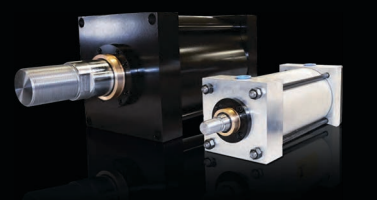

One Cylinder at a Time

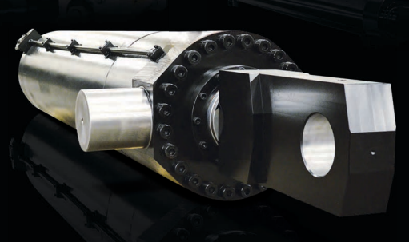

Your Cylinder Source®
Quality Cylinders: Pneumatic & Hydraulic

## Made In Usa

# History Of Yates Industries

## History Of Yates Industries

Since our modest beginnings in 1972 as a fluid power products distributor founded by William H. Yates II, Yates Industries has built a reputation for excellence and economy in comprehensive cylinder manufacturing. When William H. Yates III took over the business in 1993, his innovative vision of becoming the leading cylinder manufacturer and repair facility in the U.S. was soon realized. By 1998 the growing demand for Yates quality products and services moved Yates Industries into a state of the art 100,000+ sq. ft. manufacturing facility in St. Clair Shores, Michigan.

In 2007, further demand prompted Yates Industries to open an additional 45,000 sq. ft. facility in Decatur Alabama, known as the Yates Alabama Division.

With a growing reputation for superior service and support, Yates recently opened our newest operations in 2014 in Austell, Georgia. Adding Georgia to our Michigan and Alabama facilities enables greater capacity for our welded cylinder lines, provides faster turnaround times and increases our service area throughout the Southern US, nationally and internationally. Yates is now one of the largest and most complete cylinder manufacturing companies in the country with three facilities manufacturing pneumatic and hydraulic cylinders, as well as a variety of other fluid power related components.

## Customer Service

Yates Industries began with the goal of providing exceptional products with superior customer service. 42+ years later, we have exceeded those goals and have earned the reputation for delivering a superior product that not only lasts, but also surpasses its expectations. At Yates Industries, we strive to utilize our reliable fleet of local service vehicles to deliver and pick up your product on time, every time. Yates combines efficient manufacturing with an engaging staff who is devoted to service your request 24 hours a day, 7 days a week. Through our dependable and affordable products and a passionate service staff, we guarantee that when you think quality hydraulic cylinders, you think Yates Industries.

## Value-Added Quality

Yates Industries is an ISO 9001:2008 certified company. With quality control as a main priority, we proudly offer one of the industry's leading warranties at three full years for JIC/NFPA cylinders. We can do this because we use only the finest materials and the most experienced production staff. Yates has the resources to interchange any competitors cylinder, and Yates cylinders have proven to be the most reliable and cost effective cylinders available today.

## Machining For All Applications

Yates Industries' extensive machining department includes boring mills, CNC
machines, manual lathes, OD grinders, radial arm drills and so much more. We have the means to handle your largest cylinder applications - with the in-house capabilities to turn parts up to 65 inches in diameter, 27 feet in length.

## In-House Welding

Our certified welders are highly trained in both MIG and TIG welding. We have designed and built custom welding fixtures that assure the highest quality and consistency of weld. We also specialize in the process of bronze overlaying.

## Full Service Facilities

With our state-of-the-art manufacturing facility, we build your cylinders faster and with better quality than our competition. With over 100,000 square feet of production area, we are capable of handling small jobs on a rush basis up to your largest production runs.

## Engineering Expertise

Our engineering department uses the very latest in CAD technology. In their hands, this sophisticated software allows Yates Industries to customize cylinder components to your most demanding specifications.

## Inventory On Demand

Yates Industries maintains a huge inventory of both raw and finished goods. By maintaining such a large inventory, we can guarantee that your cylinder will be manufactured and delivered to you under the most demanding deadlines.

## Testing: Above And Beyond

As an integral part of our quality process, all cylinders are cycle-tested to their rated working pressure before being delivered to the customer. Our test stands are rated for applications up to 10,000 PSI. In addition, we have designed and built custom load cells capable of handling 250,000 pounds of force.

## Competitive Pricing

Yates Industries manufactures a full line of NFPA/JIC approved cylinders with some of the most competitive pricing in the industry. If you need a specialty cylinder, look no further than Yates Industries - we can manufacture any and all cylinders to your specifications.

| TABLE OF CONTENTS:                                                                            |
|-----------------------------------------------------------------------------------------------|
| Series "HG" hydraulic heavy duty …                                                            |
| H6 features                                                                                   |
| H6 mounting styles .                                                                          |
| H6 pressure rating, retainer information, and large bore tie rod information                  |
| H6 how to order information                                                                   |
| H6 mounting dimensions                                                                        |
| H6 optional rod end styles .                                                                  |
| H6 mounting accessories                                                                       |
| Series "A4/H4/L4" pneumatic heavy duty/hydraulic medium duty/pneumatic permanently lubricated |
| A4/H4/L4 features                                                                             |
| A4/H4/L4 mounting styles .                                                                    |
| A4/H4/L4 pressure rating, retainer information, and large bore tie rod information .          |
| A4/H4/L4 how to order information                                                             |
| A4/H4/L4 mounting dimensions .                                                                |
| A4/H4/L4 optional rod end styles .                                                            |
| A4/H4/L4 mounting accessories                                                                 |
| Series "A2/H2" aluminum air service/ light duty hydraulic                                     |
| A2/H2 features .                                                                              |
| A2/H2 mounting styles                                                                         |
| A2/H2 pressure rating, retainer information, and large bore tie rod information.              |
| A2/H2 how to order information .                                                              |
| A2/H2 mounting dimensions                                                                     |
| A2/H2 optional rod end styles                                                                 |
| A2/H2 mounting accessories                                                                    |
| Series "МН/МР" heavy duty hydraulic / pneumatic heavy duty                                    |
| MH/MP features .                                                                              |
| MH/MP how to order information .                                                              |
| MH/MP mounting dimensions                                                                     |
| MH/MP optional rod end styles                                                                 |
| MH/MP mounting accessories .                                                                  |
| Mill duty custom order form.                                                                  |
| Series "WS/WH/WMWP" severe duty hyd/heavy duty hyd/medium duty hyd/pneumatic heavy duty.      |
| WS/WH/WM/WP features .                                                                        |
| WS/WH/WM/WP how to order information .                                                        |
| WS/WH/WM/WP mounting dimensions                                                               |
| WS/WH/WM/WP optional rod end styles                                                           |
| WS/WH/WM/WP mounting accessories .                                                            |
| Welded style custom order form .                                                              |
| Specials/Engineering Data                                                                     |
| Selecting the cylinder .                                                                      |
| Stop tube and rod diameter selection .                                                        |
| Mounting considerations and types of cylinders .                                              |
| Adjustable stroke cylinders                                                                   |
| Proximity switch information .                                                                |
| Reed and hall effect switch information                                                       |
| Linear displacement transducer information                                                    |
| Yates air oil tanks                                                                           |
| Oylinder rod boot and ordering information .                                                  |
| Common rod gland configurations                                                               |
| Oylinder sealing options/ piston configuration .                                              |
| Corrosive resistant cylinder options .                                                        |
| Yates YRL series rod locks                                                                    |
| Yates Industries repair and maintenance information                                           |
| Yates Industries terms and conditions                                                         |

YOUR CYLINDER SOURCE™

Geries HI
Series A2/H
4 HYDRAULIC HEAVY DUTY

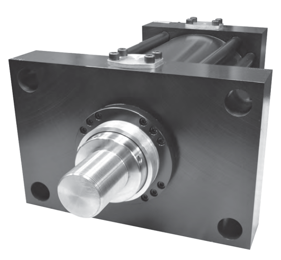

Series H6 3000 PSI RATED
WARNING IMPROPER SELECTION, IMPROPER USE OR FAILURE OF THE PRODUCTS AND/OR SYSTEMS
DESCRIBED HEREIN CAN CAUSE PROPERTY DAMAGE, PERSONAL INJURY AND/OR DEATH.

The information contained herein and other information from Yates Inc. provides product and/or system information for further investigation by users having expertise.  It is the sole responsibility of the end user to analyze all aspects of your application and any consequences of any failure and to review the information about the product or system in the current catalog.  Based on the vast amount of applications and operating conditions it is the sole responsibility of the end user, through its own testing and analysis, for making the final decision as to product selection and assuring all performance, safety and warning requirements of the application are met. Based on our continued effort to improve our products we reserve the right to make engineering changes without advance notice.

ah seinsc

1. HEAD/CAP- Precision machined steel head and cap provide close concentricity and accurate alignment between piston, tube, piston rod and rod bearing.

2. CYLINDER BARREL- Damage resistant, heavy wall steel tubing, honed to an 8 to 16 micro finish for low frictional drag and maximum seal and piston bearing life.

3. ROD CARTRIDGE- Extra long, high strength bronze gland provides maximum bearing support and wear resistance. With certain exceptions, a removable retainer allows for gland removal without cylinder disassembly.

4. PISTON- One piece fine grained cast iron piston provides maximum strength and protection against shock loads. Anaerobic adhesive is used to permanently lock and seal the piston to the rod.

5. PISTON ROD- High strength damage resistant piston rod provides 100,000 PSI minimum yield material in 5/8" through 4 1/2" diameters. Larger diameters vary between 50,000 and 75,000 PSI minimum yield material. All rods are case hardened to 50-55 RC and hard chrome plated to provide maximum wear life.

Stainless steel is also available.

6. TIE RODS- 100,000 to 125,000 PSI minimum yield steel, pre-stressed for fatigue resistance, and roll threaded for added strength.

7. CUSHIONS- Head cushion sleeve and rear cushion spear are machined to close tolerances to provide a gradual deceleration and reduced shock at end of stroke.

## 8.  Cushion Needle Adjustment And Ball Check-

Flush mounted captive cushion adjustment allows for safe cushion adjustment under pressure. Special tip design and fine threads allow for precise adjustment over a broad range of operations. Cushion ball check allows for fast break-away under full power.

9.  TUBE END SEALS- Extrusion resistant Teflon®
material is compatible with virtually all fluids and can operate in temperatures to 500°F.

10. PORTS- SAE ports are standard and can be rotated to any 90 degree position in relation to each other and the mounting. NPTF ports are optional at no extra charge.

11. ROD SEAL- Twin lip urethane rod seal is pressure energized and wear-compensating for long, leak-free service. Viton® seals are optional.

12. PISTON SEALS- Pressure energized nitrile U-cups with back-up rings are standard. Step cut cast iron rings and Viton® seals are optional.

13. ROD WIPER- Nitrile double lip rod wiper acts as a secondary seal while keeping out dirt, dust and other contaminants. Optional Viton® wiper is available for fluid compatibility or temperatures to 400°F. Metallic scrapers and low friction wipers are also available.

eries HE
SIDE MOUNTS

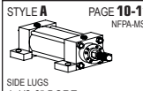

| PAGE 10-11    | STYLE B       | PAGE 10-11   | STYLE E   |
|---------------|---------------|--------------|-----------|
| NFPA-MS2      | NFPA-MS4      |              |           |
| SIDE TAPPED   | SIDE END LUGS |              |           |
| 1 1/2-8" BORE | 1 1/2-8" BORE |              |           |

PAGE 12-13

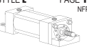

| STYLE H          | PAGE 10-11   |
|------------------|--------------|
|                  | NFPA-MS3     |
| CENTER-LINE LUGS |              |
| 1 1/2-8" BORE    |              |

NFPA-MS7
aH zeine2

| STYLE F                                           | PAGE 24-25                   | STYLE R                     | PAGE 24-25                  | STYLE G    | PAGE 26-27   | STYLE P    | PAGE 26-27   |
|---------------------------------------------------|------------------------------|-----------------------------|-----------------------------|------------|--------------|------------|--------------|
| NFPA-MF1                                          | NFPA-MF2                     | NFPA-ME5                    | NFPA-ME6                    |            |              |            |              |
| 30                                                | HEAD                         | CAP                         |                             |            |              |            |              |
| HEAD RECTANGULAR FLANGE                           | CAP RECTANGULAR FLANGE       | RECTANGULAR INTEGRAL FLANGE | RECTANGULAR INTEGRAL FLANGE |            |              |            |              |
| 1 1/2-8" BORE                                     | 1 1/2-8" BORE                | 1 1/2-14" BORE              | 1 1/2-14" BORE              |            |              |            |              |
| STYLE J                                           | PAGE 24-25                   | STYLE S                     | PAGE 24-25                  | STYLE Ж    | PAGE 28-29   | STYLE Z    | PAGE 28-29   |
| NFPA-MF5                                          | NFPA-MF6                     | NFPA-ME3                    | NFPA-ME4                    |            |              |            |              |
|                                                   | HEAD                         | CAP                         |                             |            |              |            |              |
| HEAD SQUARE FLANGE                                | CAP SQUARE FLANGE            | SQUARE INTEGRAL FLANGE      | SQUARE INTEGRAL FLANGE      |            |              |            |              |
| 1 1/2-8" BORE                                     | 1 1/2-8" BORE                | 10-24" BORE                 | 10-24" BORE                 |            |              |            |              |
| STYLE K                                           | 30-33                        | PAGE 30-31                  | STYLE M                     | PAGE 30-31 | STYLE N      | PAGE 30-31 |              |
| NFPA-MX0                                          | NFPA-MX1                     | NFPA-MX3                    | NFPA-MX2                    |            |              |            |              |
| no tie rods extended                              | both ends tie Rods extended  | head tie rods extended      | CAP TIE RODS EXTENDED       |            |              |            |              |
| 1 1/2-24" BORE                                    | 1 1/2-8" BORE                | 1 1/2-8" BORE               | 1 1/2-8" BORE               |            |              |            |              |
| PIVOT MOUNTS - CLEVIS AND TRUNNION                |                              |                             |                             |            |              |            |              |
| STYLE C                                           | PAGE 16-19                   | STYLE U                     | PAGE 20-23                  | STYLE W    | PAGE 20-23   | STYLE T    | PAGE 20-21   |
| NFPA-MP1                                          | NFPA-MT1                     | NFPA-MT2                    | NFPA-MT4                    |            |              |            |              |
| FIXED CLEVIS                                      | HEAD TRUNNION                | CAP TRUNNION                | INTERMEDIATE FIXED TRUNNION |            |              |            |              |
| 1 1/2-24" BORE                                    | 1 1/2-24" BORE               | 1 1/2-24" BORE              | 1 1/2-8" BORE               |            |              |            |              |
| STYLE V                                           | PAGE 16-19                   | STYLE Q                     | PAGE 14-15                  |            |              |            |              |
| NFPA-MP3                                          | NFPA-MPU3                    | EXTENDED KEY PLATE          | DOUBLE ROD                  |            |              |            |              |
|                                                   | (ADD "S" IN PART # AND STATE | (ADD "D" AFTER MOUNT STYLE) |                             |            |              |            |              |
|                                                   | EXTENDED KEY PLATE IN        |                             |                             |            |              |            |              |
|                                                   | DESCRIPTION)                 |                             |                             |            |              |            |              |
| CAP FIXED EYE                                     | SPHERICAL BEARING            |                             |                             |            |              |            |              |
| 1 1/2-14" BORE                                    | 1 1/2-6" BORE                | I                           |                             |            |              |            |              |
| YATES HEAVY DUTY HYDRAULIC CYLINDERS ARE DESIGNED |                              |                             |                             |            |              |            |              |
| TO ACCEPT YATES STANDARD MOUNTING ACCESSORIES.    | 1 1/2-8" BORE                | PAGE 34                     | 1 1/2-20" BORE PAGE 34-35   |            |              |            |              |
| SEE PAGES 37-39                                   |                              |                             |                             |            |              |            |              |

1 1/2-8" BORE

## End Mounts

SEE PAGES 37-39

MOUNTING STYLES - SERIES H6 7

# Pressure Ratings

Series H6

| PISTON ROD DIAMETER (INCHES)   | PRESSURE RATINGS (PSI)                    |                 |         |                                      |                                             |           |
|--------------------------------|-------------------------------------------|-----------------|---------|--------------------------------------|---------------------------------------------|-----------|
| CYLINDER BORE                  |                                           |                 |         |                                      |                                             |           |
| (INCHES)                       | HEAVY-DUTY                                | 4:1 SAFETY      |         |                                      |                                             |           |
| STANDARD                       | OVERSIZE                                  | 2:1             | SERVICE | FACTOR                               |                                             |           |
| 1 1/2                          | 5/8                                       | 1               | 3000 *  | 2000                                 |                                             |           |
| 2                              | 1                                         | 1 3/8           | 3000 *  | 2000                                 | FOR HIGHER                                  |           |
| 2 1/2                          | 1                                         | 1 3/8           | 1 3/4   | 3000 *                               | 1950                                        | PRESSURES |
| 3 1/4                          | 1 3/8                                     | 1 3/4           | 2       | 3000 *                               | 2100                                        | CONSULT   |
| 4                              | 1 3/4                                     | 2               | 2 1/2   | 3000 *                               | 1900                                        | FACTORY   |
| 5                              | 2                                         | 2 1/2, 3        | 3 1/2   | 3000 *                               | 1900                                        |           |
| ნ                              | 2 1/2                                     | 3, 3 1/2        | 4       | 3000 *                               | 2000                                        |           |
| 7                              | 3                                         | 3 1/2, 4, 4 1/2 | 5       | 3000 *                               | 1850                                        |           |
| 8                              | 3 1/2                                     | 4, 4 1/2, 5     | 5 1/2   | 3000 *                               | 1900                                        |           |
| 10                             | 4 1/2                                     | 5, 5 1/2        | 7       | 3000                                 |                                             |           |
| 12                             | 5 1/2                                     | 7               | 8       | 3000                                 | * PRESSURE FOR "F" AND "R" MOUNTS (SEE PAGE |           |
|                                | 25) AND "Q" MOUNTS (SEE PAGE 14) IS LOWER |                 |         |                                      |                                             |           |
| 14                             | 7                                         | 8, 9            | 10      | 3000                                 |                                             |           |
| 16                             | 8                                         | 9, 10           | 3000    | @ 4:1 SAFETY FACTOR BASED ON FAILURE |                                             |           |
| 18                             | ம                                         | 10              | 3000    | PRESSURES OF WEAKEST COMPONENT AND   |                                             |           |
|                                | STANDARD ROD SIZE                         |                 |         |                                      |                                             |           |
| 20                             | 10                                        | 3000            |         |                                      |                                             |           |
| 24                             | 11                                        | 3000            |         |                                      |                                             |           |

## H6 Retainer Information

H6 cylinders with the following bore and rod combinations use circular retainers which permit removal of rod cartridge without disassembling cylinder: 2 ½" bore with 1" rod 3 ¼" bore with 1 3/8" rod 4" thru 20" bores with all rod diameters H6 cylinders with the following bore and rod combinations use full plate retainer construction: 1 1/2" bore with 5/8" and 1" rods 2" bore with 1" and 1 3/8" rods 2 1/2" bore with 1 3/8" and 1 3/4" rods

| ROD DIA.   | RB   | RR   | RM     |
|------------|------|------|--------|
| 5/8        | -    | 3/8  | 2 3/8  |
| 1          | 1/4  | 3/8  | 2 1/2  |
| 1 3/8      | 5/16 | 5/16 | 3 7/32 |
| 1 3/4      | 5/16 | 5/16 | 3 7/8  |
| 2          | 5/16 | 5/16 | 4      |

3 1/4" bore with 1 3/4" and 2" rods Note: Certain small bore cylinders have full plate retainers which means the RR is not applicable. Use "F" dimension instead of "RR"
Note: 2 1/2" and larger rod retainer rings are counter-bored so the socket head cap screws are not exposed.

## Large Bore Tie Rod Information

On large bore cylinders, two or three tie rods are used at each corner of the 10, 12, 14, 16, 18, 20 and 24 inch bore sizes. This reduces flexing of head and cap under pressure.

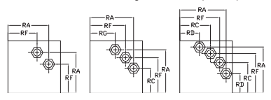

| BORE   | RA     | RF     | RC    | RD    | TIE ROD   |
|--------|--------|--------|-------|-------|-----------|
| 10     | 5.291  | 3.775  | NA    | NA    | 1 1/8-12  |
| 12     | 6.27   | 4 555  | NA    | NA    | 1 1/4-12  |
| 14     | 7.485  | 6.143  | 4.409 | NA    | 1 1/4-12  |
| 16     | 8.086  | 6.093  | NA    | NA    | 1 1/2-12  |
| 18     | 9.589  | 7.910  | 5.761 | NA    | 1 1/2-12  |
| 20     | 10.437 | 8.750  | 6.649 | NA    | 1 1/2-12  |
| 24     | 13.589 | 11.722 | 9.158 | 6.050 | 2-12      |

SERIES H6 · PRESSURE RATINGS
8

# How To Order H6 Cylinders

|                                              | ุย ดูเพีย เพื่อเพลเขต เอ เขต อุด อย อย อง อง    |         |        |    |
|----------------------------------------------|-------------------------------------------|---------|--------|----|
| FEATURE                                      | DESCRIPTION                               | PAGE #  | SYMBOL |    |
| SERIES                                       | Hydraulic heavy duty                      | 5       | H6     | 4  |
| MOUNTING STYLE                               | Side lugs (MS2)                           | 7       | A      |    |
| Side tapped (MS4)                            | B                                         |         |        |    |
| Side end lugs (MS7)                          | E                                         |         |        |    |
| Center-line lugs (MS3)                       | H                                         |         |        |    |
| Head rectangular flange (MF1)                | רד                                        |         |        |    |
| Cap rectangular flange (MF2)                 | R                                         |         |        |    |
| Head square flange (MF5)                     | ل                                         |         |        |    |
| Cap square flange (MF6)                      | S                                         |         |        |    |
| Head rectangular integral flange (ME5)       | G                                         |         |        |    |
| Cap rectangular integral flange (ME6)        | P                                         |         |        |    |
| Head square integral flange (ME3)            | X                                         |         |        |    |
| Cap square integral flange (ME4)             | Z                                         |         |        |    |
| No tie rods extended (MX0)                   | K                                         |         |        |    |
| Both ends tie rods extended (MX1)            | L                                         |         |        |    |
| Head tie rods extended (MX3)                 | M                                         |         |        |    |
| Cap tie rods extended (MX2)                  | N                                         |         |        |    |
| Cap clevis (MP1)                             | C                                         |         |        |    |
| Cap eye (MP3)                                | V                                         |         |        |    |
| Spherical bearing (MPU3)                     | Q                                         |         |        |    |
| Head trunnion (MT1)                          | U                                         |         |        |    |
| Cap trunnion (MT2)                           | W                                         |         |        |    |
| Intermediate fixed trunnion (MT4)            | T                                         |         |        |    |
| DOUBLE ROD                                   | Double rod design if needed               | 34-35   | D      |    |
| CUSHIONS                                     | No cushions                               | N       |        |    |
| Cushion head end only                        | R                                         |         |        |    |
| Cushion cap end only                         | C                                         |         |        |    |
| Cushioned both ends                          | B                                         |         |        |    |
| BORE SIZE                                    | Specify in inches                         | 148-149 |        |    |
| PISTON SEALS                                 | Nitrile u-cups (standard)                 | 163     | N      |    |
| Cast iron rings                              | C                                         |         |        |    |
|                                              | P                                         |         |        |    |
| Urethane loaded U-cup                        |                                           |         |        |    |
| Viton® seals                                 | V                                         |         |        |    |
| Viton® loaded U-cup                          | F                                         |         |        |    |
| Nitrile high load seals                      | H                                         |         |        |    |
| Viton high load seals                        | D                                         |         |        |    |
| Other (specify)                              | X                                         |         |        |    |
| STROKE                                       | Specify in inches with 2 place decimal    | 149     |        |    |
| PORTS                                        | SAE (standard)                            | ഗ       |        |    |
| NPTF                                         | N                                         |         |        |    |
| Welded coupler                               | W                                         |         |        |    |
| If over or under sized ports / special ports | X                                         |         |        |    |
| ROD DIA.                                     | Specify in inches                         | 148-149 |        |    |
| ROD SEALS                                    | Twin lip hydraulic seal (standard)        | 162     | T      |    |
| Urethane loaded U-cup                        | P                                         |         |        |    |
| Viton® seals                                 | V                                         |         |        |    |
| Viton® loaded U-cup                          | F                                         |         |        |    |
| Other (specify)                              | X                                         |         |        |    |
| ROD END                                      | Standard male                             | 36      | 2      |    |
| Standard female                              | 4                                         |         |        |    |
| Intermediate male                            | 1                                         |         |        |    |
| Long female                                  | 3                                         |         |        |    |
| Extended standard male                       | 5                                         |         |        |    |
| Extended intermediate male                   | ნ                                         |         |        |    |
| Plain rod end                                | 7                                         |         |        |    |
| Male rod coupling                            | 9                                         |         |        |    |
| Special male (specify)                       | M                                         |         |        |    |
| Special female (specify)                     | F                                         |         |        |    |
|                                              | S                                         |         |        |    |
| Special stud (specify)                       |                                           |         |        |    |
| Special other (specify)                      | X                                         |         |        |    |
| SPECIALS AND                                 | Stop tube                                 | 149     | S      |    |
| ENGINEERING DATA                             | Proximity switches                        |         |        |    |
| Non-standard mount                           |                                           |         |        |    |
| Stainless steel rod                          |                                           |         |        |    |
| Extra rod extension                          |                                           |         |        |    |
| Many more options available                  |                                           |         |        |    |
| HEAD PORT                                    | Specify location 1-4                      | 1-4     |        |    |
| If cylinder requires multiple ports          | X                                         |         |        |    |
| CAP PORT                                     | Specify location 1-5                      | 1-5     |        |    |
| If cylinder requires multiple ports          | ×                                         |         |        |    |
| NOTE:  SEE PAGE 178 FOR PORT LOCATION        |                                           |         |        |    |

Series HOW TO ORDER - SERIES H6

9 Series H6

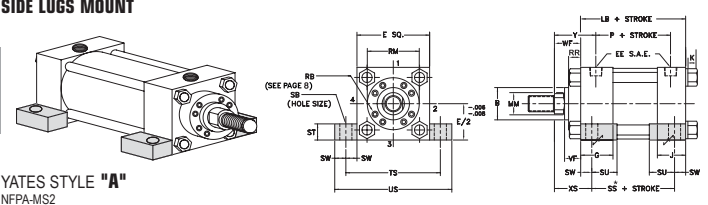

SIDE TAPPED MOUNT

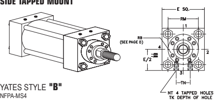

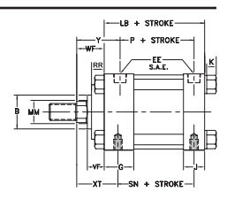

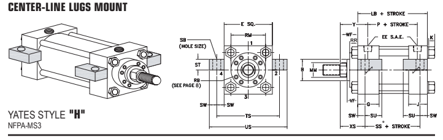

t HEAD END PORTS SHALLOW TAPPED
এ
 (2) SPANNER HOLES USED INSTEAD OF FLATS ON 3 1/2" DIA. AND LARGER RODS
 THESE CYLINDERS HAVE FULL PLATE RETAINERS. USE "E' DIMENSIONS INSTEAD OF "RM." USE "F" DIMENSIONS INSTEAD OF "RR" - SEE PAGE 8 રે
B DIMENSION TOLERANCE  -.. 001/ -. 003 SS DIMENSION CHANGES ON DOUBLE ROD CYLINDERS - SEE PAGE 35 FOR DETAILS
 NOTE: SUGGESTED THAT THESE MOUNTS BE KEYED OR PINNED TO PREVENT SHIFTING - SEE PAGE 34
�
CONSULT FACTORY FOR DIMENSIONS. NOTE: CUSHION LOCATION IS FACTORY'S DISCRETION UNLESS OTHERWISE SPECIFIED BY THE CUSTOMER NOTE:  SEE PAGE 34 FOR KEY PLATE INFORMATION
MI 586,778,7680

STANDARD ROD ENDS

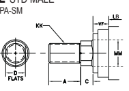

| BORE   | E     | EE    | SAE OPT.   | F   | G     | J     |
|--------|-------|-------|------------|-----|-------|-------|
| 1 1/2  | 2 1/2 | 1/2   | 10         | 3/8 | 1 3/4 | 1 1/2 |
| 2      | 3     | 1/2   | 10         | ମାଃ   | 1 3/4 | 1 1/2 |
| 2 1/2  | 3 1/2 | 1/2   | 10         | 5/8 | 1 3/4 | 1 1/2 |
|        |       | 3/4   | 3/4        |     | 1 3/4 |       |
| 3 1/4  | 4 1/2 |       | 12         | 2   |       |       |
|        | 5     | 3/4   | 12         | 718 | 2     | 1 3/4 |
| 4      |       |       |            |     |       |       |
| 5      | 6 1/2 | 3/4   | 12         | 718 | 2     | 1 3/4 |
| 6      | 7 1/2 | 1     | 16         | 1   | 2 1/4 | 2 1/4 |
| 7      | 8 1/2 | 1 1/4 | 20         | 1   | 2 3/4 | 2 3/4 |
| 8      | 9 1/2 | 1 1/2 | 24         | 1   | 3     | 3     |

|        |         |        |       |        |       |         |        | ADD STROKE   |       |       |       |       |
|--------|---------|--------|-------|--------|-------|---------|--------|--------------|-------|-------|-------|-------|
| K      | NT      | SB     | ST    | SU     | SW    | TN      | TS     | US           | LB    | P     | SN    | SS*   |
| 3/8    | 3/8-16  | 7/16   | 1/2   | 15/16  | 3/8   | 3/4     | 3 1/4  | 4            | 4 5/8 | 3     | 2 7/8 | 3 7/8 |
| 7/16   | 1/2-13  | 9/16   | 3/4   | 1 1/4  | 1/2   | 15/16   | 4      | 5            | 4 5/8 | 3     | 2 7/8 | 3 5/8 |
| 7/16   | 5/8-11  | 13/16  | 1     | 1 9/16 | 11/16 | 1 5/16  | 4 7/8  | 6 1/4        | 4 3/4 | 3 1/8 | 3     | 3 3/8 |
| 9/16   | 3/4-10  | 13/16  |       | 11/16  |       | 5 7/8   | 7 1/4  | 3 5/8        | 3 1/2 |       |       |       |
|        |         |        | 1     | 1 9/16 | 1 1/2 |         | 5 1/2  |              | 4 1/8 |       |       |       |
| 9/16   | 1-8     | 1 1/16 | 1 1/4 | 2      | 718   | 2 1/16  | 6 3/4  | 8 1/2        | 5 3/4 | 3 7/8 | 3 3/4 | 4     |
| 3/4    | 1-8     | 1 1/16 | 1 1/4 | 2      | 718   | 2 15/16 | 8 1/4  | 10           | 6 1/4 | 4 3/8 | 4 1/4 | 4 1/2 |
| 718    | 1 1/4-7 | 1 5/16 | 1 1/2 | 2 1/2  | 1 1/8 | 3 5/16  | 9 3/4  | 12           | 7 3/8 | 5     | 5 1/8 | 5 1/8 |
| 1      | 1 1/2-6 | 1 9/16 | 1 3/4 | 2 7/8  | 1 3/8 | 3 3/4   | 11 1/4 | 14           | 8 1/2 | 5 1/2 | 5 7/8 | 5 3/4 |
| 1 1/16 | 1 1/2-6 | 1 9/16 | 1 3/4 | 2 7/8  | 1 3/8 | 4 1/4   | 12 1/4 | 15           | 9 1/2 | 6 1/4 | 6 5/8 | 6 3/4 |

|          | ENVELOPE AND   |                                     |                      |        |       |       |       |         |         |        |        |         |         |         |         |
|----------|----------------|-------------------------------------|----------------------|--------|-------|-------|-------|---------|---------|--------|--------|---------|---------|---------|---------|
| ROD DIA. | THREAD         | ROD EXTENSIONS AND PILOT DIMENSIONS | |MOUNTING DIMENSIONS |        |       |       |       |         |         |        |        |         |         |         |         |
| BORE     | MM             | KK                                  | сс                   | A      | B ‡   | C     | D     | VF      | TK      | WF     | RR     | RM      | Y       | xs      | XT      |
| 1 1/2    | 5/8            | 7/16-20                             | 1/2-20               | 3/4    | 1 1/8 | 3/8   | 17/32 | 5/8     | 9/16    | 1      | .      | פ       | 1 15/16 | 1 3/8   | 2       |
| 1 t      | 3/4-16         | 7/8-14                              | 1 1/8                | 1 1/2  | 1/2   | 718   | 7/8   | Ф       | 1 3/8   | .      | S      | 2 5/16  | 1 3/4   | 2 3/8   |         |
| 2        | 1              | 3/4-16                              | 7/8-14               | 1 1/8  | 1 1/2 | 1/2   | 718   | 7/8     | 1/2     | 1 3/8  | .      | S       | 2 5/16  | 1 7/8   | 2 3/8   |
| 1 3/8 †  | 1-14           | 1 1/4-12                            | 1 5/8                | 2      | 5/8   | 1 1/8 | 1     | Ф       | 1 5/8   | .      | S      | 2 9/16  | 2 1/8   | 2 5/8   |         |
| 2 1/2    | 1              | 3/4-16                              | 7/8-14               | 1 1/8  | 1 1/2 | 1/2   | 718   | 7/8     | 11/16   | 1 3/8  | 3/8    | 2 1/2   | 2 5/16  | 2 1/16  | 2 3/8   |
| 1 3/8 t  | 1-14           | 1 1/4-12                            | 1 5/8                | 2      | 1 1/8 | 1     | Ф     | 1 5/8   | 2 9/16  | 2 5/16 | 2 5/8  |         |         |         |         |
| 5/8      | .              | S                                   |                      |        |       |       |       |         |         |        |        |         |         |         |         |
| 1 3/4 t  | 1 1/4-12       | 2 3/8                               | 1 1/2                | 1 1/8  | ө     | 1 7/8 | .     | 2 13/16 | 2 7/8   |        |        |         |         |         |         |
| 1 1/2-12 | 2              | 3/4                                 | S                    | 2 9/16 |       |       |       |         |         |        |        |         |         |         |         |
| 3 1/4    | 1 3/8          | 1-14                                | 1 1/4-12             | 1 5/8  | 2     | 5/8   | 1 1/8 | 1       | 3/4     | 1 5/8  | 5/16   | 3 7/32  | 2 11/16 | 2 5/16  | 2 3/4   |
| 1 1/4-12 | 3/4            | 1 1/8                               |                      |        |       |       |       |         |         |        |        |         |         |         |         |
| 1 3/4    | 1 1/2-12       | 2                                   | 2 3/8                | 1 1/2  | 3/4   | 1 7/8 | .     | S       | 2 15/16 | 2 9/16 | 3      |         |         |         |         |
| 2 t      | 1 1/2-12       | 1 3/4-12                            | 2 1/4                | 2 5/8  | 718   | 1 3/4 | 1 1/8 | Ф       | 2       | .      | S      | 3 1/16  | 2 11/16 | 3 1/8   |         |
| 4        | 1 3/4          | 1 1/4-12                            | 1 1/2-12             | 2      | 2 3/8 | 3/4   | 1 1/2 | 1 1/8   | 1       | 1 7/8  | 5/16   | 3 7/8   | 2 15/16 | 2 3/4   | 3       |
| 2        | 1 1/2-12       | 1 3/4-12                            | 2 1/4                | 2 5/8  | 718   | 1 3/4 | 1 1/8 | Ф       | 2       | 5/16   | 4      | 3 1/16  | 2 7/8   | 3 1/8   |         |
| 2 1/2    | 1 7/8-12       | 2 1/4-12                            | 3                    | 3 1/8  | 1     | 2 1/8 | 1 1/4 | ө       | 2 1/4   | 5/8    | 4 7/16 | 3 5/16  | 3 1/8   | 3 3/8   |         |
| 5        | 2              | 1 1/2-12                            | 1 3/4-12             | 2 1/4  | 2 5/8 | 7/8   | 1 3/4 | 1 1/8   | 1 1/8   | 2      | 5/16   | 4       | 3 1/16  | 2 7/8   | 3 1/8   |
| 2 1/2    | 1 7/8-12       | 2 1/4-12                            | 3                    | 3 1/8  | 1     | 2 1/8 | 1 1/4 | 1 1/8   | 2 1/4   | 5/8    | 4 7/16 | 3 5/16  | 3 1/8   | 3 3/8   |         |
| 3        | 2 1/4-12       | 2 3/4-12                            | 3 1/2                | 3 3/4  | 1     | 2 5/8 | 1 1/4 | 1 1/8   | 2 1/4   | 3/4    | 5 1/4  | 3 5/16  | 3 1/8   | 3 3/8   |         |
| 3 1/2    | 2 1/2-12       | 3 1/4-12                            | 3 1/2                | 4 1/4  | 1     | Δ     | 1 1/4 | Ф       | 2 1/4   | 3/4    | 5 5/8  | 3 5/16  | 3 1/8   | 3 3/8   |         |
| 6        | 2 1/2          | 1 7/8-12                            | 2 1/4-12             | 3      | 3 1/8 | 1     | 2 1/8 | 1 1/4   | 1 5/16  | 2 1/4  | 5/8    | 4 7/16  | 3 7/16  | 3 3/8   | 3 1/2   |
| 3        | 2 1/4-12       | 2 3/4-12                            | 3 1/2                | 3 3/4  | 1     | 2 5/8 | 1 1/4 | 1 5/16  | 2 1/4   | 3/4    | 5 1/4  | 3 7/16  | 3 3/8   | 3 1/2   |         |
| 3 1/2    | 2 1/2-12       | 3 1/4-12                            | 3 1/2                | 4 1/4  | 1     | י     | 1 1/4 | 1 5/16  | 2 1/4   | 3/4    | 5 5/8  | 3 7/16  | 3 3/8   | 3 1/2   |         |
| 4        | 3-12           | 3 3/4-12                            | 4                    | 4 3/4  | 1     | Δ     | 1 1/4 | Ф       | 2 1/4   | 7/8    | 6 7/16 | 3 7/16  | 3 3/8   | 3 1/2   |         |
| 7        | 3              | 2 1/4-12                            | 2 3/4-12             | 3 1/2  | 3 3/4 | 1     | 2 5/8 | 1 1/4   | 1 1/8   | 2 1/4  | 3/4    | 5 1/4   | 3 3/4   | 3 5/8   | 3 13/16 |
| 3 1/2    | 2 1/2-12       | 3 1/4-12                            | 3 1/2                | 4 1/4  | 1     | 1 1/4 | 1 1/8 | 2 1/4   | 3/4     | 5 5/8  | 3 3/4  | 3 5/8   | 3 13/16 |         |         |
| Δ        |                |                                     |                      |        |       |       |       |         |         |        |        |         |         |         |         |
| 4        | 3-12           | 3 3/4-12                            | 4                    | 4 3/4  | 1 1/4 | 1 1/8 | 2 1/4 | 7/8     | 6 7/16  | 3 3/4  | 3 5/8  | 3 13/16 |         |         |         |
| 1        | Δ              |                                     |                      |        |       |       |       |         |         |        |        |         |         |         |         |
| 4 1/2    | 3 1/4-12       | 4 1/4-12                            | 4 1/2                | 5 1/4  | 1     | ▷     | 1 1/4 | ө       | 2 1/4   | 7/8    | 7 1/8  | 3 3/4   | 3 5/8   | 3 13/16 |         |
| 5        | 3 1/2-12       | 4 3/4-12                            | 5                    | 5 3/4  | 1 1/4 | Ф     | 2 1/4 | 7/8     | 7 5/8   | 3 3/4  | 3 5/8  | 3 13/16 |         |         |         |
| 1        | Δ              |                                     |                      |        |       |       |       |         |         |        |        |         |         |         |         |
| 8        | 3 1/2          | 2 1/2-12                            | 3 1/4-12             | 3 1/2  | 4 1/4 | 1     | 4     | 1 1/4   | 1 9/16  | 2 1/4  | 3/4    | 5 5/8   | 3 718   | 3 5/8   | 3 15/16 |
| 4        | 3-12           | 3 3/4-12                            | 4                    | 4 3/4  | 1     | 4     | 1 1/4 | 1 9/16  | 2 1/4   | 7/8    | 6 7/16 | 3 718   | 3 5/8   | 3 15/16 |         |
| 4 1/2    | 3 1/4-12       | 4 1/4-12                            | 4 1/2                | 5 1/4  | 1     | 4     | 1 1/4 | 1 9/16  | 2 1/4   | 7/8    | 7 1/8  | 3 718   | 3 5/8   | 3 15/16 |         |
| 5        | 3 1/2-12       | 4 3/4-12                            | 5                    | 5 3/4  | 1     | Δ     | 1 1/4 | 1 9/16  | 2 1/4   | 7/8    | 7 5/8  | 3 718   | 3 5/8   | 3 15/16 |         |
| 5 1/2    | 4-12           | 5 1/4-12                            | 5 1/2                | 6 1/4  | 1     | ব     | 1 1/4 | Ф       | 2 1/4   | 7/8    | 8 318  | 3 718   | 3 5/8   | 3 15/16 |         |

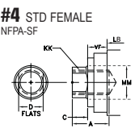

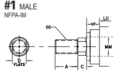

ƏH səins 1 1/2 THRU 8 BORE - SERI

Series H6

SIDE END LUGS MOUNT

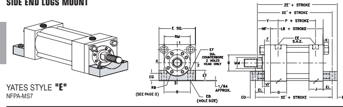

- ΣΟ
†      HEAD END PORTS SHALLOW TAPPED 
മ     (2) SPANNER HOLES USED INSTEAD OF FLATS ON 3 1/2" DIA. AND LARGER RODS
   
SE, XE & ZE DIMENSION CHANGES ON DOUBLE ROD CYLINDERS -- SEE PAGE 35 FOR DETAILS.

.

કુ
 THESE CYLINDERS HAVE FULL PLATE RETAINERS. USE "E" DIMENSIONS INSTEAD OF "RM." USE "F"
DIMENSIONS INSTEAD OF "RR" = SEE PAGE 8 NOTE:  SUGGESTED THAT THESE MOUNTS BE KEYED OR PINNED TO PREVENT SHIFTING - SEE PAGE 34 NOTE: BOTTOMS OF HEAD AND CAP ARE MOUNTING SURFACES. LUGS HOLD CYLINDER AGAINST MOUNTING SURFACE. NOTE:  CHECK FOR CLEARANCE BETWEEN FRONT MOUNTING LUG AND ROD END ATTACHMENT.

SPECIFY LONGER THAN STANDARD "WF" DIMENSION IF NECESSARY.

NOTE: CUSHION LOCATION IS FACTORY'S DISCRETION UNLESS OTHERWISE SPECIFIED BY THE CUSTOMER NOTE: 11/2" - 6" BORES HAVE FULL PLATE RETAINERS
NOTE:  SEE PAGE 34 FOR KEY PLATE INFORMATION
MI 586.778.

| ADD STROKE   |         |
|--------------|---------|
| XE*          | ZE*     |
| 6 1/2        | 6 7/8   |
| 6 7/8        | 7 1/4   |
| 6 15/16      | 7 7/16  |
| 7 3/16       | 7 11/16 |
| 7 1/16       | 7 9/16  |
| 7 5/16       | 7 13/16 |
| 7 9/16       | 8 1/16  |
| 8 1/4        | 8 7/8   |
| 8 1/2        | 9 1/8   |
| 8 5/8        | 9 1/4   |
| 8 3/4        | 9 3/8   |
| 8 7/8        | 9 1/2   |
| 9 1/8        | 9 3/4   |
| ਰੇ 3/4        | 10 1/2  |
| 10           | 10 3/4  |
| 10           | 10 3/4  |
| 10           | 10 3/4  |
| 11 5/16      | 12 3/16 |
| 11 5/16      | 12 3/16 |
| 11 5/16      | 12 3/16 |
| 11 5/16      | 12 3/16 |
| 12 9/16      | 13 9/16 |
| 12 9/16      | 13 9/16 |
| 12 9/16      | 13 9/16 |
| 12 9/16      | 13 9/16 |
| 12 9/16      | 13 9/16 |
| 13 3/4       | 14 7/8  |
| 13 3/4       | 14 7/8  |
| 13 3/4       | 14 7/8  |
| 13 3/4       | 14 7/8  |
| 13 3/4       | 14 7/8  |

| VF    | WF    | RR     | RM     |  Y      |
|-------|-------|--------|--------|---------|
| 5/8   | 1     | .      | S      | 1 15/16 |
| 7/8   | 1 3/8 | .      | S      | 2 5/16  |
| 7/8   | 1 3/8 | -      | ട്ട്     | 2 5/16  |
| 1     | 1 5/8 | -      | ડુ      | 2 9/16  |
| 7/8   | 1 3/8 | .      | 2 1/2  | 2 5/16  |
| 1     | 1 5/8 | .      | ട്      | 2 9/16  |
| 1 1/8 | 1 7/8 | .      | S      | 2 13/16 |
| 1     | 1 5/8 | -      | 3 7/32 | 2 11/16 |
| 1 1/8 | 1 7/8 | -      | કે      | 2 15/16 |
| 1 1/8 | 2     | ·      | ડુ      | 3 1/16  |
| 1 1/8 | 1 7/8 | .      | 3 7/8  | 2 15/16 |
| 1 1/8 | 2     | .      | 4      | 3 1/16  |
| 1 1/4 | 2 1/4 | .      | 4 7/16 | 3 5/16  |
| 1 1/8 | 2     | .      | 4      | 3 1/16  |
| 1 1/4 | 2 1/4 | .      | 4 7/16 | 3 5/16  |
| 1 1/4 | 2 1/4 | ·      | 5 1/4  | 3 5/16  |
| 1 1/4 | 2 1/4 | -      | 5 5/8  | 3 5/16  |
| 1 1/4 | 2 1/4 | .      | 4 7/16 | 3 7/16  |
| 1 1/4 | 2 1/4 | .      | 5 1/4  | 3 7/16  |
| 1 1/4 | 2 1/4 | .      | 5 5/8  | 3 7/16  |
| 1 1/4 | 2 1/4 | .      | 6 7/16 | 3 7/16  |
| 1 1/4 | 2 1/4 | ·      | 5 1/4  | 3 3/4   |
| 1 1/4 | 2 1/4 | .      | 5 5/8  | 3 3/4   |
| 1 1/4 | 2 1/4 | .      | 6 7/16 | 3 3/4   |
| 1 1/4 | 2 1/4 | .      | 7 1/8  | 3 3/4   |
| 1 1/4 | 2 1/4 | .      | 7 5/8  | 3 3/4   |
| 1 1/4 | 2 1/4 | 3/4    | 5 5/8  | 3 7/8   |
| 2 1/4 |       |        |        |         |
| 1 1/4 | 718   | 6 7/16 | 3 718  |         |
| 1 1/4 | 2 1/4 | 718    | 7 1/8  | 3 7/8   |
| 1 1/4 | 2 1/4 | 7/8    | 7 5/8  | 3 7/8   |
| 1 1/4 | 2 1/4 | 7/8    | 8 3/8  | 3 7/8   |

|  BORE   |  E    | EE    | SAE OPT.   |  F    |  G    | J     | K      | EB     | EF     | EG     | EL      |
|---------|-------|-------|------------|-------|-------|-------|--------|--------|--------|--------|---------|
| 1 1/2   | 2 1/2 | 1/2   | 10         | 3/8   | 1 3/4 | 1 1/2 | 7/16   | 7/16   | 5/8    | 11/16  | 7/8     |
|         |       | 10    | 5/8        | 9/16  |       | 3/4   | 15/16  |        |        |        |         |
| 2       | 3     | 1/2   | 1 3/4      | 1 1/2 | 7/16  | 13/16 |        |        |        |        |         |
| 2 1/2   | 3 1/2 | 1/2   | 10         | 5/8   | 1 3/4 | 1 1/2 | 7/16   | 9/16   | 13/16  | 3/4    | 15/16   |
|         | 4 1/2 | 3/4   | 12         | 3/4   | 2     | 1 3/4 | 9/16   | 11/16  | 1 1/16 | 1 1/8  |         |
| 3 1/4   |       |       |            |       | 1     |       |        |        |        |        |         |
|         |       | 3/4   |            |       | 1     |       |        |        |        |        |         |
| 4       | 5     | 12    | 718        | 2     | 1 3/4 | 9/16  | 11/16  | 15/16  | 1 1/8  |        |         |
| 5       | 6 1/2 | 3/4   | 12         | 7/8   | 2     | 1 3/4 | 3/4    | 15/16  | 1 3/8  | 1 1/4  | 1 1/2   |
| ნ       | 7 1/2 | 1     | 16         | 1     | 2 1/4 | 2 1/4 | 718    | 1 1/16 | 1 5/8  | 1 1/2  | 1 11/16 |
| 7       | 8 1/2 | 1 1/4 | 20         | 1     | 2 3/4 | 2 3/4 | 1      | 1 3/16 | 1 3/4  | 1 9/16 | 1 13/16 |
| 8       | 9 1/2 | 1 1/2 | 24         | 1     | 3     | 3     | 1 1/16 | 1 5/16 | .      | 2      |         |
|         |       |       |            |       | .     |       |        |        |        |        |         |

STANDARD ROD ENDS

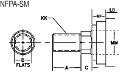

ƏH səins EO
ET
3/8 718 1/2 1 1/2 ട്യു
1 1 1/4 5/8 1 1/4 3/4 1 1/2 718 1 1 3/4 2 2 1 1/8 ROD EXTENSIONS AND PILOT DIMENSIONS
RR
3/4 718 718 7/8 7/8 1 1/2 THRU 8 BORE - SERI

|      |       | ADD STROKE   |        |
|------|-------|--------------|--------|
| R    | LB    | P            | SE *   |
| 1.63 | 4 5/8 | 3            | 6 3/4  |
| 2.05 | 4 5/8 | 3            | 7 1/8  |
| 2.55 | 4 3/4 | 3 1/8        | 7 1/4  |
| 3.25 | 5 1/2 | 3 5/8        | 8 1/2  |
| 3.82 | 5 3/4 | 3 7/8        | 8 7/8  |
| 4 95 | 6 1/4 | 4 3/8        | 10 1/8 |
| 5.73 | 7 3/8 | 5            | 11 3/4 |
| 6.58 | 8 1/2 | 5 1/2        | 12 1/8 |
| 7.50 | 9 1/2 | 6 1/4        | 13 1/2 |

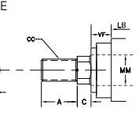

| ROD DIA.   |  THREAD   |          |          |       |       |       |       |
|------------|-----------|----------|----------|-------|-------|-------|-------|
| BORE       | MM        | KK       | сс       | A     | Bt    | C     | D     |
| 1 1/2      | 5/8       | 7/16-20  | 1/2-20   | 3/4   | 1 1/8 | 3/8   | 17/32 |
| 1 t        | 3/4-16    | 7/8-14   | 1 1/8    | 1 1/2 | 1/2   | 7/8   |       |
| 2          | 1         | 3/4-16   | 7/8-14   | 1 1/8 | 1 1/2 | 1/2   | 718   |
| 1 3/8 †    | 1-14      | 1 1/4-12 | 1 5/8    | 2     | 5/8   | 1 1/8 |       |
| 2 1/2      | 1         | 3/4-16   | 7/8-14   | 1 1/8 | 1 1/2 | 1/2   | 7/8   |
| 1 3/8 t    | 1-14      | 1 1/4-12 | 1 5/8    | 2     | ରାଷ    | 1 1/8 |       |
| 1 3/4 t    | 1 1/4-12  | 1 1/2-12 | 2        | 2 3/8 | 3/4   | 1 1/2 |       |
| 3 1/4      | 1 3/8     | 1-14     | 1 1/4-12 | 1 5/8 | 2     | 5/8   | 1 1/8 |
| 1 3/4      | 1 1/4-12  | 1 1/2-12 | 2        | 2 3/8 | 3/4   | 1 1/2 |       |
| 2 t        | 1 1/2-12  | 1 3/4-12 | 2 1/4    | 2 5/8 | 7/8   | 1 3/4 |       |
| 4          | 1 3/4     | 1 1/4-12 | 1 1/2-12 | 2     | 2 3/8 | 3/4   | 1 1/2 |
| 2          | 2 1/4     | 7/8      | 1 3/4    |       |       |       |       |
| 1 1/2-12   | 1 3/4-12  | 2 5/8    | 1        |       |       |       |       |
| 2 1/2      | 1 7/8-12  | 2 1/4-12 | 3        | 3 1/8 | 2 1/8 |       |       |
| 2          | 1 1/2-12  | 1 3/4-12 | 2 1/4    | 2 5/8 | 7/8   | 1 3/4 |       |
| 5          | 2 1/2     | 1 7/8-12 | 2 1/4-12 | 3     | 3 1/8 | 1     | 2 1/8 |
| 3          | 2 1/4-12  | 2 3/4-12 | 3 1/2    | 3 3/4 | 1     | 2 5/8 |       |
| 3 1/2      | 2 1/2-12  | 3 1/4-12 | 3 1/2    | 4 1/4 | 1     | v     |       |
| ნ          | 2 1/2     | 1 7/8-12 | 2 1/4-12 | 3     | 3 1/8 | 1     | 2 1/8 |
| 3          | 2 1/4-12  | 2 3/4-12 | 3 1/2    | 3 3/4 | 1     | 2 5/8 |       |
| 3 1/2      | 2 1/2-12  | 3 1/4-12 | 3 1/2    | 4 1/4 | 1     | এ     |       |
| 4          | 3-12      | 3 3/4-12 | র্ব       | 4 3/4 | 1     | ע     |       |
| 7          | 3         | 2 1/4-12 | 2 3/4-12 | 3 1/2 | 3 3/4 | 1     | 2 5/8 |
| 3 1/2      | 2 1/2-12  | 3 1/4-12 | 3 1/2    | 4 1/4 | 1     | V     |       |
| 4          | 3-12      | 3 3/4-12 | 4        | 4 3/4 | 1     | v     |       |
| 4 1/2      | 3 1/4-12  | 4 1/4-12 | 4 1/2    | 5 1/4 | 1     | v     |       |
| 5          | 3 1/2-12  | 4 3/4-12 | 5        | 5 3/4 | 1     | V     |       |
| 8          | 3 1/2     | 2 1/2-12 | 3 1/4-12 | 3 1/2 | 4 1/4 | 1     | Δ     |
| 4          | 3-12      | 3 3/4-12 | 4        | 4 3/4 | 1     | Δ     |       |
| 4 1/2      | 3 1/4-12  | 4 1/2    | 1        |       |       |       |       |
| 4 1/4-12   | 5 1/4     | ▷        |          |       |       |       |       |
| 5          | 4 3/4-12  | 5        | 5 3/4    | 1     |       |       |       |
| 3 1/2-12   | ▷         |          |          |       |       |       |       |
| 5 1/2      | 4-12      | 5 1/4-12 | 5 1/2    | 6 1/4 | 1     | V     |       |

SPHERICAL BEARING MOUNT

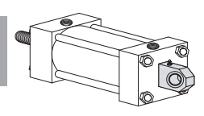

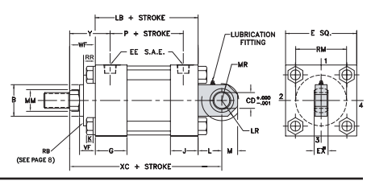

YATES STYLE "Q"
NFPA-MPU3 t HEAD END PORTS SHALLOW TAPPED
Δ
 (2) SPANNER HOLES USED INSTEAD OF FLATS ON 3 1/2" DIA. AND LARGER RODS
THESE CYLINDERS HAVE FULL PLATE RETAINERS. USE "E" DIMENSIONS INSTEAD OF "RM" USE "F" DIMENSIONS INSTEAD OF "RR" - SEE PAGE 8 રે
 +
B DIMENSION TOLERANCE  -..001/ -..003 EYE DESIGNED TO FIT YATES STD SPHERICAL CLEVIS BRACKET - SEE PAGE 39 NOTE:  Q MOUNT MAX OPERATING PSI BASED ON STANDARD COMMERCIAL BEARING RATINGS NOTE: MPU3 MOUNT DOES NOT INCLUDE PIVOT PIN NOTE: CUSHION LOCATION IS FACTORY'S DISCRETION UNLESS OTHERWISE SPECIFIED BY THE CUSTOMER
MI 586,778,76

Series H6

|  BORE   | CD    | EX■     | E     |  EE   | SAE OPT.   |  F   |
|---------|-------|---------|-------|-------|------------|------|
|         | 1/2   | 7/16    |       | 1/2   |            | 3/8  |
| 1 1/2   |       |         | 2 1/2 |       | 10         |      |
| 2       | 3/4   | 21/32   | 3     | 1/2   | 10         | 5/8  |
| 2 1/2   | 3/4   | 21/32   | 3 1/2 | 1/2   | 10         | 5/8  |
| 3 1/4   | 1     | 718     | 4 1/2 | 3/4   | 12         | 3/4  |
| 4       | 1 3/8 | 1 3/16  | 5     | 3/4   | 12         | 7/8  |
| 5       | 1 3/4 | 1 17/32 | 6 1/2 | 3/4   | 12         | 7/8  |
| 6       | 2     | 1 3/4   | 7 1/2 | 1     | 16         | 1    |

STANDARD ROD ENDS
NFPA-SM

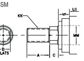

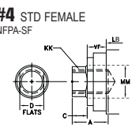

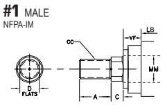

|          |          | ADD                                 |          |       |       |       |       |         |        |        |         |         |        |           |
|----------|----------|-------------------------------------|----------|-------|-------|-------|-------|---------|--------|--------|---------|---------|--------|-----------|
| ROD DIA. | THREAD   | ROD EXTENSIONS AND PILOT DIMENSIONS | STROKE   |       |       |       |       |         |        |        |         |         |        |           |
| BORE     | MM       | KK                                  | сс       | A     | Bț    | C     | D     | VF      | WF     | RR     | RM      | Y       | XC     | OPER. PSI |
| 1 1/2    | 5/8      | 7/16-20                             | 1/2-20   | 3/4   | 1 1/8 | 3/8   | 17/32 | 5/8     | 1      | .      | S       | 1 15/16 | 6 3/8  | 1675      |
| 1 t      | 3/4-16   | 7/8-14                              | 1 1/8    | 1 1/2 | 1/2   | 718   | 718   | 1 3/8   | .      | ഗ്ഗം     | 2 5/16  | 6 3/4   |        |           |
| 2        | 1        | 3/4-16                              | 7/8-14   | 1 1/8 | 1 1/2 | 1/2   | 7/8   | 7/8     | 1 3/8  | -      | ട്ട്      | 2 5/16  | 7 1/4  | 2185      |
| 1 3/8 †  | 1-14     | 1 1/4-12                            | 1 5/8    | 2     | 5/8   | 1 1/8 | 1     | 1 5/8   | -      | Ş      | 2 9/16  | 7 1/2   |        |           |
| 2 1/2    | 1        | 3/4-16                              | 7/8-14   | 1 1/8 | 1 1/2 | 1/2   | 718   | 7/8     | 1 3/8  | 3/8    | 2 1/2   | 2 5/16  | 7 3/8  |           |
| 1 3/8 †  | 1-14     | 1 1/4-12                            | 1 5/8    | 2     | 5/8   | 1 1/8 | 1     | 1 5/8   | ·      | S      | 2 9/16  | 7 5/8   | 1410   |           |
| 1 3/4 †  | 1 1/4-12 | 1 1/2-12                            | 2        | 2 3/8 | 3/4   | 1 1/2 | 1 1/8 | 1 7/8   | .      | $      | 2 13/16 | 7 718   |        |           |
| 3 1/4    | 1 3/8    | 1-14                                | 1 1/4-12 | 1 5/8 | 2     | 5/8   | 1 1/8 | 1       | 1 5/8  | 5/16   | 3 7/32  | 2 11/16 | 8 રાજ   |           |
|          | 2 3/8    | 3/4                                 | 1 1/8    | 1490  |       |       |       |         |        |        |         |         |        |           |
| 1 3/4    | 1 1/4-12 | 1 1/2-12                            | 2        | 1 1/2 | 1 7/8 | ·     | ട്ട്    | 2 15/16 | 8 7/8  |        |         |         |        |           |
| 2 t      | 1 1/2-12 | 1 3/4-12                            | 2 1/4    | 2 5/8 | 718   | 1 3/4 | 1 1/8 | 2       | Ş      | 3 1/16 | 9       |         |        |           |
|          |          | -                                   |          |       |       |       |       |         |        |        |         |         |        |           |
| 4        | 1 3/4    | 1 1/4-12                            | 1 1/2-12 | 2     | 2 3/8 | 3/4   | 1 1/2 | 1 1/8   | 1 7/8  | 5/16   | 3 718   | 2 15/16 | 9 3/4  |           |
| 2        | 1 1/2-12 | 1 3/4-12                            | 2 1/4    | 2 5/8 | 718   | 1 3/4 | 1 1/8 | 2       | 5/16   | 4      | 3 1/16  | 9 7/8   | 1800   |           |
| 2 1/2    | 1 7/8-12 | 2 1/4-12                            | 3        | 3 1/8 | 1     | 2 1/8 | 1 1/4 | 2 1/4   | 5/8    | 4 7/16 | 3 5/16  | 10 1/8  |        |           |
| 5        | 2        | 1 1/2-12                            | 1 3/4-12 | 2 1/4 | 2 5/8 | 7/8   | 1 3/4 | 1 1/8   | 2      | 5/16   | 4       | 3 1/16  | 10 1/2 |           |
| 2 1/2    | 1 7/8-12 | 2 1/4-12                            | 3        | 3 1/8 | 1     | 2 1/8 | 1 1/4 | 2 1/4   | 5/8    | 4 7/16 | 3 5/16  | 10 3/4  | 1925   |           |
| 3        | 2 1/4-12 | 2 3/4-12                            | 3 1/2    | 3 3/4 | 1     | 2 5/8 | 1 1/4 | 2 1/4   | 3/4    | 5 1/4  | 3 5/16  | 10 3/4  |        |           |
| 3 1/2    | 2 1/2-12 | 3 1/4-12                            | 3 1/2    | 4 1/4 | 1     | v     | 1 1/4 | 2 1/4   | 3/4    | ર રાજ   | 3 5/16  | 10 3/4  |        |           |
| ნ        | 2 1/2    | 1 7/8-12                            | 2 1/4-12 | లు     | 3 1/8 | 1     | 2 1/8 | 1 1/4   | 2 1/4  | 5/8    | 4 7/16  | 3 7/16  | 12 1/8 |           |
| 3        | 2 1/4-12 | 2 3/4-12                            | 3 1/2    | 3 3/4 | 1     | 2 5/8 | 1 1/4 | 2 1/4   | 3/4    | 5 1/4  | 3 7/16  | 12 1/8  | 1765   |           |
| 3 1/2    | 2 1/2-12 | 3 1/4-12                            | 3 1/2    | 4 1/4 | 1     | Δ     | 1 1/4 | 2 1/4   | 3/4    | 5 5/8  | 3 7/16  | 12 1/8  |        |           |
|          | 4 3/4    | 1 1/4                               |          |       |       |       |       |         |        |        |         |         |        |           |
| 4        | 3-12     | 3 3/4-12                            | 4        | 1     | Δ     | 2 1/4 | 7/8   | 6 7/16  | 3 7/16 | 12 1/8 |         |         |        |           |

ah sana 1 1/2 THRU 6 BORE - SERIES H6

|       |       |       |        |       |        |      | ADD STROKE   |       |
|-------|-------|-------|--------|-------|--------|------|--------------|-------|
| ଦ     | J     | L     | LR     | M     | MR     | K    | LB           | P     |
| 1 3/4 | 1 1/2 | 3/4   |        | 3/4   | 13/16  | 3/8  | 4 5/8        | 3     |
|       |       |       | 5/8    |       |        |      |              |       |
| 1 3/4 | 1 1/2 | 1 1/4 | 1      | 1     | 1 1/8  | 7/16 | 4 5/8        | 3     |
| 1 3/4 | 1 1/2 | 1 1/4 | 1      | 1     | 1 1/8  | 7/16 | 4 3/4        | 3 1/8 |
| 2     | 1 3/4 | 1 1/2 | 1 1/4  | 1 1/4 | 1 3/8  | 9/16 | 5 1/2        | 3 5/8 |
| 2     | 1 3/4 | 2 1/8 | 1 5/8  | 1 7/8 | 2 1/16 | 9/16 | 5 3/4        | 3 7/8 |
| 2     | 1 3/4 | 2 1/4 | 2 1/16 | 2 1/2 | 2 3/4  | 3/4  | 6 1/4        | 4 3/8 |
| 2 1/4 | 2 1/4 | 2 1/2 | 2 3/8  | 2 1/2 | 2 3/4  | 718  | 7 3/8        | 5     |

CAP FIXED CLEVIS MOUNT

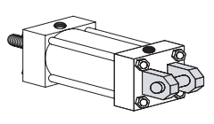

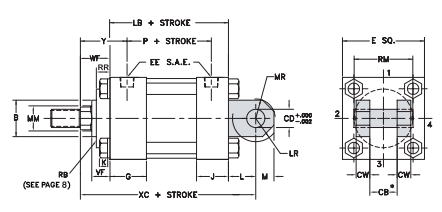

YATES STYLE "C"
NFPA-MP1 CAP FIXED EYE MOUNT

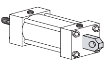

YATES STYLE "V"
NFPA-MP3
†      HEAD END PORTS SHALLOW TAPPED
Δ      (2) SPANNER HOLES USED INSTEAD OF FLATS ON 3 1/2" DIA. AND LARGER RODS
રે
 THESE CYLINDERS HAVE FULL PLATE RETAINERS. USE "E' DIMENSIONS INSTEAD OF "RM" USE "F" DIMENSIONS INSTEAD OF "RR" - SEE PAGE 8 B DIMENSION TOLERANCE  -. 001/ -. 003
+
CLEVIS DESIGNED TO FIT YATES STD EYE BRACKET - SEE PAGE 38
.

 Ф    "EYE" DESIGNED TO FIT YATES STD CLEVIS BRACKET - SEE PAGE 37 NOTE: MP3 MOUNT DOES NOT INCLUDE PIWOT PIN
 NOTE: CUSHION LOCATION IS FACTORY'S DISCRETION UNLESS OTHERWISE SPECIFIED BY THE CUSTOMER
MI 586.778.7680

Series H6

| BORE   |
|--------|
| 1 1/2  |
| 2      |
| 2 1/2  |
| 3 1/4  |
| 4      |
| 5      |
| 6      |
| 7      |
| 8      |
| 10     |

STANDARD ROD ENDS

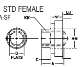

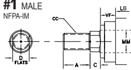

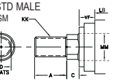

|          | ADD STROKE   |                                     |            |        |        |       |          |         |         |         |         |         |         |         |        |        |       |
|----------|--------------|-------------------------------------|------------|--------|--------|-------|----------|---------|---------|---------|---------|---------|---------|---------|--------|--------|-------|
| BORE     | CB*          | CD                                  | CW         | EWФ    | E      | EE    | SAE OPT. | F       | G       | J       | L       | LR      | M       | MR      | ズ     | LB     | P     |
| 3/4      | 1/2          | 3/4                                 | 2 1/2      | 1/2    | 10     | 3/8   | 1 3/4    | 3/4     | 9/16    | 4 5/8   |         |         |         |         |        |        |       |
| 1 1/2    | 1/2          | 1 1/2                               | 9/16       | 1/2    | 3/8    | 3     |          |         |         |         |         |         |         |         |        |        |       |
| 2        | 1 1/4        | 3/4                                 | 5/8        | 1 1/4  | 3      | 1/2   | 10       | 5/8     | 1 3/4   | 1 1/2   | 1 1/4   | 1 1/16  | 3/4     | 7/8     | 7/16   | 4 5/8  | 3     |
| 2 1/2    | 1 1/4        | 3/4                                 | 5/8        | 1 1/4  | 3 1/2  | 1/2   | 10       | 5/8     | 1 3/4   | 1 1/2   | 1 1/4   | 1 1/16  | 3/4     | 7/8     | 7/16   | 4 3/4  | 3 1/8 |
| 3 1/4    | 1 1/2        | 1                                   | 3/4        | 1 1/2  | 4 1/2  | 3/4   | 12       | 3/4     | 2       | 1 3/4   | 1 1/2   | 1 1/4   | 1       | 1 1/8   | 9/16   | 5 1/2  | 3 5/8 |
| 4        | 2            | 1 3/8                               | 1          | 2      | 5      | 3/4   | 12       | 7/8     | 2       | 1 3/4   | 2 1/8   | 1 7/8   | 1 3/8   | 1 1/2   | 9/16   | 5 3/4  | 3 7/8 |
| 5        | 2 1/2        | 1 3/4                               | 1 1/4      | 2 1/2  | 6 1/2  | 3/4   | 12       | 7/8     | 2       | 1 3/4   | 2 1/4   | 1 15/16 | 1 3/4   | 1 7/8   | 3/4    | 6 1/4  | 4 3/8 |
| 6        | 2 1/2        | 2                                   | 1 1/4      | 2 1/2  | 7 1/2  | 1     | 16       | 1       | 2 1/4   | 2 1/4   | 2 1/2   | 2 1/16  | 2       | 2 3/16  | 7/8    | 7 3/8  | 5     |
| 7        | 3            | 2 1/2                               | 1 1/2      | 3      | 8 1/2  | 1 1/4 | 20       | 1       | 2 3/4   | 2 3/4   | లు       | 2 9/16  | 2 1/2   | 2 3/4   | 1      | 8 1/2  | 5 1/2 |
| 8        | 3            | 3                                   | 1 1/2      | 3      | 9 1/2  | 1 1/2 | 24       | 1       | 3       | 3       | 3 1/4   | 2 11/16 | 2 3/4   | 3       | 1 1/16 | 9 1/2  | 6 1/4 |
| 10       | 4            | 3 1/2                               | 2          | 4      | 12 5/8 | 2     | 32       | 7/8     | 3 11/16 | 3 11/16 | 4       | 3 3/8   | 3 1/2   | 3 13/16 | 1      | 12 1/8 | 8 1/8 |
| ROD DIA. | THREAD       | ROD EXTENSIONS AND PILOT DIMENSIONS | add stroke |        |        |       |          |         |         |         |         |         |         |         |        |        |       |
| сс       | Y            |                                     |            |        |        |       |          |         |         |         |         |         |         |         |        |        |       |
| BORE     | MM           | КК                                  | A          | Bț     | C      | D     | VF       | WF      | RR      | RM      | XC      |         |         |         |        |        |       |
| 1 1/2    | 5/8          | 7/16-20                             | 1/2-20     | 3/4    | 1 1/8  | 3/8   | 17/32    | 5/8     | 1       | .       | S       | 1 15/16 | 6 3/8   |         |        |        |       |
| 1†       | 3/4-16       | 7/8-14                              | 1 1/8      | 1 1/2  | 1/2    | 718   | 718      | 1 3/8   | .       | S       | 2 5/16  | 6 3/4   |         |         |        |        |       |
| 2        | 1            | 3/4-16                              | 7/8-14     | 1 1/8  | 1 1/2  | 1/2   | 718      | 7/8     | 1 3/8   | -       | S       | 2 5/16  | 7 1/4   |         |        |        |       |
| 1 3/8†   | 1-14         | 1 1/4-12                            | 1 5/8      | 2      | 5/8    | 1 1/8 | 1        | 1 5/8   | Ş       | 2 9/16  | 7 1/2   |         |         |         |        |        |       |
|          | -            |                                     |            |        |        |       |          |         |         |         |         |         |         |         |        |        |       |
| 2 1/2    | 1            | 3/4-16                              | 7/8-14     | 1 1/8  | 1 1/2  | 1/2   | 718      | 718     | 1 3/8   | 318     | 2 1/2   | 2 5/16  | 7 3/8   |         |        |        |       |
| 1 3/8t   | 1-14         | 1 1/4-12                            | 1 5/8      | 2      | 5/8    | 1 1/8 | 1        | 1 5/8   | .       | S       | 2 9/16  | 7 5/8   |         |         |        |        |       |
| 1 3/4t   | 1 1/4-12     | 1 1/2-12                            | 2          | 2 3/8  | 3/4    | 1 1/2 | 1 1/8    | 1 7/8   | .       | s       | 2 13/16 | 7 7/8   |         |         |        |        |       |
| 3 1/4    | 1 3/8        | 1-14                                | 1 1/4-12   | 1 5/8  | 2      | 5/8   | 1 1/8    | 1       | 1 5/8   | 5/16    | 3 7/32  | 2 11/16 | 8 5/8   |         |        |        |       |
| 1 3/4    | 1 1/4-12     | 1 1/2-12                            | 2          | 2 3/8  | 3/4    | 1 1/2 | 1 1/8    | 1 7/8   | -       | Ş       | 2 15/16 | 8 7/8   |         |         |        |        |       |
| 2        | 1 1/2-12     | 1 3/4-12                            | 2 1/4      | 2 5/8  | 718    | 1 3/4 | 1 1/8    | 2       | -       | Ş       | 3 1/16  | 9       |         |         |        |        |       |
| 4        | 1 3/4        | 1 1/4-12                            | 1 1/2-12   | 2      | 2 3/8  | 3/4   | 1 1/2    | 1 1/8   | 1 7/8   | 5/16    | 3 7/8   | 2 15/16 | 9 3/4   |         |        |        |       |
| 2 1/4    | 4            |                                     |            |        |        |       |          |         |         |         |         |         |         |         |        |        |       |
| 2        | 1 1/2-12     | 1 3/4-12                            | 2 5/8      | 718    | 1 3/4  | 1 1/8 | 2        | 5/16    | 3 1/16  | 9 7/8   |         |         |         |         |        |        |       |
| 2 1/2    | 1 7/8-12     | 2 1/4-12                            | 3          | 3 1/8  | 1      | 2 1/8 | 1 1/4    | 2 1/4   | 5/8     | 4 7/16  | 3 5/16  | 10 1/8  |         |         |        |        |       |
| 5        | 2            | 1 1/2-12                            | 1 3/4-12   | 2 1/4  | 2 5/8  | 7/8   | 1 3/4    | 1 1/8   | 2       | 5/16    | 4       | 3 1/16  | 10 1/2  |         |        |        |       |
| 2 1/2    | 1 7/8-12     | 2 1/4-12                            | 3          | 3 1/8  | 1      | 2 1/8 | 1 1/4    | 2 1/4   | ട്യു      | 4 7/16  | 3 5/16  | 10 3/4  |         |         |        |        |       |
| 3        | 2 1/4-12     | 2 3/4-12                            | 3 1/2      | 3 3/4  | 1      | 2 5/8 | 1 1/4    | 2 1/4   | 3/4     | 5 1/4   | 3 5/16  | 10 3/4  |         |         |        |        |       |
| 3 1/2    | 2 1/2-12     | 3 1/4-12                            | 3 1/2      | 4 1/4  | 1      | v     | 1 1/4    | 2 1/4   | 3/4     | 5 5/8   | 3 5/16  | 10 3/4  |         |         |        |        |       |
| ნ        | 2 1/2        | 1 7/8-12                            | 2 1/4-12   | 3      | 3 1/8  | 1     | 2 1/8    | 1 1/4   | 2 1/4   | 5/8     | 4 7/16  | 3 7/16  | 12 1/8  |         |        |        |       |
| 3        | 2 1/4-12     | 2 3/4-12                            | 3 1/2      | 3 3/4  | 1      | 2 5/8 | 1 1/4    | 2 1/4   | 3/4     | 5 1/4   | 3 7/16  | 12 1/8  |         |         |        |        |       |
| 3 1/2    | 2 1/2-12     | 3 1/4-12                            | 3 1/2      | 4 1/4  | 1      | ব     | 1 1/4    | 2 1/4   | 3/4     | 5 5/8   | 3 7/16  | 12 1/8  |         |         |        |        |       |
| 4        | 3-12         | 3 3/4-12                            | 4          | 4 3/4  | 1      | এ     | 1 1/4    | 2 1/4   | 718     | 6 7/16  | 3 7/16  | 12 1/8  |         |         |        |        |       |
| 7        | 3            | 2 1/4-12                            | 2 3/4-12   | 3 1/2  | 3 3/4  | 1     | 2 5/8    | 1 1/4   | 2 1/4   | 3/4     | 5 1/4   | 3 3/4   | 13 3/4  |         |        |        |       |
| 3 1/2    | 2 1/2-12     | 3 1/4-12                            | 3 1/2      | 4 1/4  | 1      | Δ     | 1 1/4    | 2 1/4   | 3/4     | 5 5/8   | 3 3/4   | 13 3/4  |         |         |        |        |       |
| पं        | ব            | 4 3/4                               | 1          | 1 1/4  | 7/8    | 3 3/4 | 13 3/4   |         |         |         |         |         |         |         |        |        |       |
| 3-12     | 3 3/4-12     | ▷                                   | 2 1/4      | 6 7/16 |        |       |          |         |         |         |         |         |         |         |        |        |       |
| 4 1/2    | 3 1/4-12     | 4 1/4-12                            | 4 1/2      | 5 1/4  | 1      | 1 1/4 | 718      | 7 1/8   | 3 3/4   | 13 3/4  |         |         |         |         |        |        |       |
|          | ▷            | 2 1/4                               |            |        |        |       |          |         |         |         |         |         |         |         |        |        |       |
| 5 3/4    |              |                                     |            |        |        |       |          |         |         |         |         |         |         |         |        |        |       |
| 5        | 3 1/2-12     | 4 3/4-12                            | 5          | 1      | ▷      | 1 1/4 | 2 1/4    | 7/8     | 7 5/8   | 3 3/4   | 13 3/4  |         |         |         |        |        |       |
| 8        | 3 1/2        | 2 1/2-12                            | 3 1/4-12   | 3 1/2  | 4 1/4  | 1     | Δ        | 1 1/4   | 2 1/4   | 3/4     | 5 5/8   | 3 7/8   | 15      |         |        |        |       |
| 4        | 3-12         | 3 3/4-12                            | 4          | 4 3/4  | 1      | 4     | 1 1/4    | 2 1/4   | 718     | 6 7/16  | 3 7/8   | 15      |         |         |        |        |       |
| 4 1/2    | 3 1/4-12     | 4 1/4-12                            | 4 1/2      | 5 1/4  | 1      | 4     | 1 1/4    | 2 1/4   | 7/8     | 7 1/8   | 3 7/8   | 15      |         |         |        |        |       |
| 5        | 3 1/2-12     | 4 3/4-12                            | 5          | 5 3/4  | 1      | Δ     | 1 1/4    | 2 1/4   | 718     | 7 5/8   | 3 718   | 15      |         |         |        |        |       |
| 5 1/2    | 4-12         | 5 1/4-12                            | 5 1/2      | 6 1/4  | 1      | Δ     | 1 1/4    | 2 1/4   | 718     | 8 3/8   | 3 718   | 15      |         |         |        |        |       |
| 10       | 4 1/2        | 3 1/4-12                            | 4 1/4-12   | 4 1/2  | 5 1/4  | 1     | v        | 1 15/16 | 2 15/16 | 718     | 7 1/8   | 4 15/16 | 19 1/16 |         |        |        |       |
| 5        | 3 1/2-12     | 4 3/4-12                            | 5          | 5 3/4  | 1      | ▷     | 2 3/16   | 3 3/16  | 7/8     | 7 5/8   | 5 3/16  | 19 5/16 |         |         |        |        |       |
| 5 1/2    | 4-12         | 5 1/4-12                            | 5 1/2      | 6 1/4  | 1      | ▷     | 2 3/16   | 3 3/16  | 7/8     | 8 3/8   | 5 3/16  | 19 5/16 |         |         |        |        |       |
| 7        | 5-12         | 6 1/2-12                            | 7          | ు       | 1      | ਪ     | 2 1/2    | 3 1/2   | 718     | 10 7/8  | 5 1/2   | 19 5/8  |         |         |        |        |       |

1 1/2 THRU 10 

CAP FIXED CLEVIS MOUNT

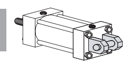

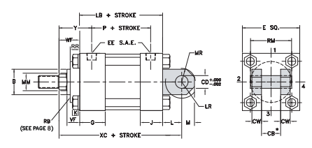

YATES STYLE "C"
NFPA-MP1 CAP FIXED EYE MOUNT

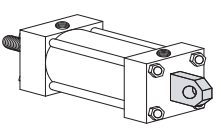

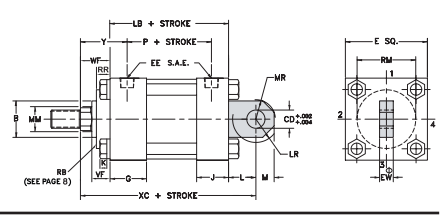

YATES STYLE "V"
NFPA-MP3

GA 678.355.2240 Series H6 18

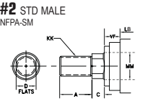

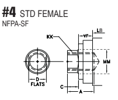

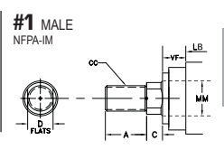

AH гэтээ

|          | ADD STROKE   |                                     |            |       |        |       |          |          |        |         |         |         |        |        |        |        |        |
|----------|--------------|-------------------------------------|------------|-------|--------|-------|----------|----------|--------|---------|---------|---------|--------|--------|--------|--------|--------|
| BORE     | CB*          | CD                                  | CW         | EWФ   | E      | EE    | SAE OPT. | F        | G      | J       | L       | LR      | M      | MR     | K      | LB     | P      |
| 12       | 4 1/2        | 4                                   | 2 1/4      | 4 1/2 | 14 7/8 | 2 1/2 | 32       | 1 3/8    | 4 7/16 | 4 7/16  | 4 1/2   | 4       | 4      | 4 3/8  | 1 1/16 | 14 1/2 | 9 1/2  |
| 14       | 6            | రా                                   | 3          | 6     | 17 1/8 | 2 1/2 | 32       | 1 5/8    | 4 7/8  | 4 7/8   | 5 3/4   | 5       | 5      | 5 7/16 | 1 1/16 | 15 5/8 | 9 7/8  |
| 16       | 7            | ഗ                                   | 3 1/2      | ·     | 19 1/4 | 3     | 32       | 1 7/8    | 5 7/8  | 5 718   | 7       | ნ       | ნ      | 6 1/2  | 1 9/32 | 18 1/8 | 11     |
| 18       | 8            | 6 1/2                               | 4          | .     | 22     | 3     | 32       | 2 3/16   | 6 7/8  | 6 7/8   | 7 5/8   | 6 1/2   | 6 1/2  | 7 1/16 | 1 9/32 | 21 1/8 | 12     |
| 20       | 9            | 7 1/2                               | 4 1/2      | .     | 23 5/8 | 3     | 32       | 2 11/16  | 7 7/8  | 7 718   | 8 3/4   | 7 1/2   | 7 1/2  | 8 1/8  | 1 9/32 | 23 5/8 | 12 1/2 |
| 24       | 11           | 9                                   | 5          | .     | 31     | 3     | 32       | 2 11/16  | 10     | 10      | 17      | ·       | .      | 9      | 3      | 29 1/2 | 18     |
| ROD DIA. | THREAD       | ROD EXTENSIONS AND PILOT DIMENSIONS | ADD STROKE |       |        |       |          |          |        |         |         |         |        |        |        |        |        |
| BORE     | MM           | KK                                  | сс         | A     | Bț     | C     | D        | VF       | WF     | RR      | RM      | Y       | XC     |        |        |        |        |
| 12       | 5 1/2        | 4-12                                | 5 1/4-12   | 5 1/2 | 6 1/4  | 1     | 2 3/16   | 3 3/16   | 1 3/8  | 8 3/8   | 5 11/16 | 22 3/16 |        |        |        |        |        |
| Δ        |              |                                     |            |       |        |       |          |          |        |         |         |         |        |        |        |        |        |
| 6 1/2-12 | 1 3/8        |                                     |            |       |        |       |          |          |        |         |         |         |        |        |        |        |        |
| 7        | 5-12         | 7                                   | రు          | 1     | Δ      | 2 1/2 | 3 1/2    | 10 13/16 | ნ      | 22 1/2  |         |         |        |        |        |        |        |
| 8        | 5 3/4-12     | 7 1/2-12                            | 8          | 9     | 3      | 1 3/8 | 12 3/8   | 6 1/2    | 23     |         |         |         |        |        |        |        |        |
| 1        | V            | 4                                   |            |       |        |       |          |          |        |         |         |         |        |        |        |        |        |
| 14       | 7            | 7                                   | တ          | 1     | 2 1/2  | 3 1/2 | 1 5/8    | 10 13/16 | 6 3/8  | 24 7/8  |         |         |        |        |        |        |        |
| 5-12     | 6 1/2-12     | v                                   |            |       |        |       |          |          |        |         |         |         |        |        |        |        |        |
| 8        | 5 3/4-12     | 7 1/2-12                            | 8          | ഗ്ര    | 1      | v     | 3        | 4        | 1 5/8  | 12 3/8  | 6 7/8   | 25 3/8  |        |        |        |        |        |
| 9        | 6 1/2-12     | 8 1/2-12                            | 9          | 10    | 1      | Δ     | 3 1/4    | 4 1/4    | 1 5/8  | 13 1/8  | 7 1/8   | 25 5/8  |        |        |        |        |        |
| 10       | 7 1/4-12     | 9 1/2-12                            | 10         | 11    | 1      | Δ     | 3 1/2    | 4 1/2    | 1 5/8  | 14 5/8  | 7 3/8   | 25 7/8  |        |        |        |        |        |
| 16       | 8            | 5 3/4-12                            | 7 1/2-12   | 8     | 9      | 1     | Δ        | 3        | 4      | 1 7/8   | 12 3/8  | 7 9/16  | 29 1/8 |        |        |        |        |
| 9        | 6 1/2-12     | 8 1/2-12                            | 9          | 10    | 1      | V     | 3 1/4    | 4 1/4    | 1 7/8  | 13 1/8  | 7 13/16 | 29 3/8  |        |        |        |        |        |
| 10       | 7 1/4-12     | 9 1/2-12                            | 10         | 11    | 1      | ব     | 3 1/2    | 4 1/2    | 1 7/8  | 14 5/8  | 8 1/16  | 29 5/8  |        |        |        |        |        |
| 18       | 9            | 6 1/2-12                            | 8 1/2-12   | 9     | 10     | 1     | v        | 3 1/4    | 4 1/4  | 2 3/16  | 13 1/8  | 8 13/16 | 33     |        |        |        |        |
| 10       | 7 1/4-12     | 9 1/2-12                            | 10         | 11    | 1      | Δ     | 3 1/2    | 4 1/2    | 2 3/16 | 14 5/8  | 9 1/16  | 33 1/4  |        |        |        |        |        |
| 20       | 10           | 7 1/4-12                            | 9 1/2-12   | 10    | 11     | 1     | Δ        | 3 1/2    | 4 1/2  | 2 11/16 | 14 5/8  | 10 1/16 | 36 7/8 |        |        |        |        |
| 24       | 11           | 8-8                                 | -          | 11    | 12     | 1     | Δ        | 3 1/2    | 4 1/2  | 2 11/16 | 16      | 10 1/4  | 51     |        |        |        |        |

ROD EXTENSIONS AND PILOT DIMENSIONS
দ
(2) SPANNER HOLES USED INSTEAD OF FLATS ON 3 1/2" DIA. AND LARGER RODS
B DIMENSION TOLERANCE -.001/ -.003 Ф   DESIGNED TO FIT YATES STD CLEVIS BRACKET - SEE PAGE 37 CLEVIS DESIGNED TO FIT YATES STD EYE BRACKET - SEE PAGE 38
.

 NOTE: MP3 MOUNT DOES NOT INCLUDE PIVOT PIN
NOTE: CUSHION LOCATION IS FACTORY'S DISCRETION UNLESS OTHERWISE SPECIFIED BY THE CUSTOMER
 NOTE: YATES V (MP3) MOUNT AVAILABLE 1 1/2" -14" BORE

# Intermediate Fixed Trunnion Mount

Series H6 YATES STYLE "T"
NFPA-MT4

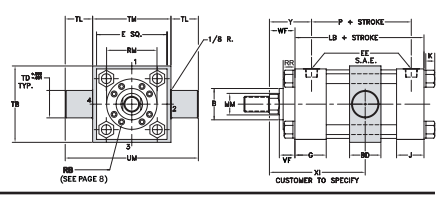

HEAD TRUNNION MOUNT

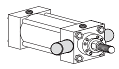

YATES STYLE "U"
NFPA-MT1 CAP TRUNNION MOUNT

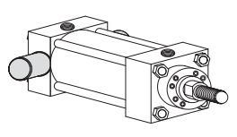

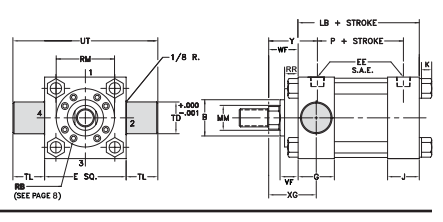

YATES STYLE "W"
NFPA-MT2

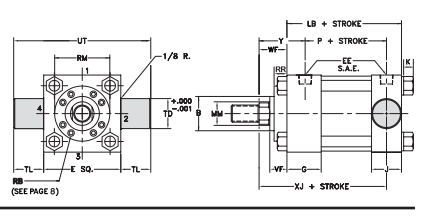

STANDARD ROD ENDS

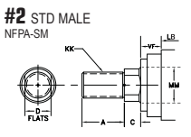

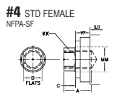

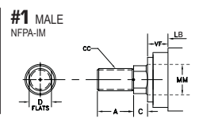

MI 586.778.7680 AL 256.351.8081 20

|                               | ADD STROKE   |                                     |            |       |         |         |        |         |         |        |        |                                              |                                      |             |        |       |    |
|-------------------------------|--------------|-------------------------------------|------------|-------|---------|---------|--------|---------|---------|--------|--------|----------------------------------------------|--------------------------------------|-------------|--------|-------|----|
| BORE                          | m            | EE                                  | SAE OPT.   | F     | ଦ       | J       | κ      | TD      | TL      | TB     | TM     | UM                                           | UT                                   | BD          | XI     | LB    | P  |
| 1 1/2                         | 2 1/2        | 1/2                                 | 10         | 3/8   | 1 3/4   | 1 1/2   | 3/8    | 1       | 1       | 2 3/4  | 3      | 5                                            | 4 1/2                                | 1 1/4       | 4 5/8  | 3     |    |
| 2                             | 3            | 1/2                                 | 10         | 5/8   | 1 3/4   | 1 1/2   | 7/16   | 1 3/8   | 1 3/8   | 3 3/8  | 3 1/2  | 6 1/4                                        | 5 3/4                                | 1 3/4       | 4 5/8  | 3     |    |
| 1 3/4                         | 6 1/4        |                                     |            |       |         |         |        |         |         |        |        |                                              |                                      |             |        |       |    |
| 2 1/2                         | 3 1/2        | 1/2                                 | 10         | 5/8   | 1 1/2   | 7/16    | 1 3/8  | 1 3/8   | 3 7/8   | 4      | 6 3/4  | 2                                            | 4 3/4                                | 3 1/8       |        |       |    |
| 3 1/4                         | 4 1/2        | 3/4                                 | 12         | 3/4   | 2       | 1 3/4   | 9/16   | 1 3/4   | 1 3/4   | 4 7/8  | 5      | 8 1/2                                        | 8                                    | 2 1/4       | 5 1/2  | 3 5/8 |    |
| 7/8                           |              |                                     |            |       |         |         |        |         |         |        |        |                                              |                                      |             |        |       |    |
| 4                             | 5            | 3/4                                 | 12         | 2     | 1 3/4   | 9/16    | 1 3/4  | 1 3/4   | 5 1/2   | 5 1/2  | 9      | 8 1/2                                        | 2 1/4                                | TOMER TO SP | 5 3/4  | 3 7/8 |    |
|                               | 7            |                                     |            |       |         |         |        |         |         |        |        |                                              |                                      |             |        |       |    |
| 5                             | 6 1/2        | 3/4                                 | 12         | 7/8   | 2       | 1 3/4   | 3/4    | 1 3/4   | 1 3/4   | 7 1/4  | 10 1/2 | 10                                           | 3                                    | 6 1/4       | 4 3/8  |       |    |
| 6                             | 7 1/2        | 1                                   | 16         | 1     | 2 1/4   | 2 1/4   | 7/8    | 2       | 2       | 8 1/2  | 8 1/2  | 12 1/2                                       | 11 1/2                               | 3 1/2       | 7 3/8  | 5     |    |
| 7                             | 1 1/4        | 20                                  | 1          | 2 3/4 | 1       | 2 1/2   | 9 3/4  | 9 3/4   | 14 3/4  | 13 1/2 | 4      | 5 1/2                                        |                                      |             |        |       |    |
| 8 1/2                         | 2 3/4        | 2 1/2                               | 8 1/2      |       |         |         |        |         |         |        |        |                                              |                                      |             |        |       |    |
| 8                             | 9 1/2        | 1 1/2                               | 24         | 1     | 3       | లు       | 1 1/16 | 3       | 3       | 11     | 11     | 17                                           | 15 1/2                               | 4 1/4       | 9 1/2  | 6 1/4 |    |
| 10                            | 12 5/8       | 2                                   | 32         | 7/8   | 3 11/16 | 3 11/16 | 3 1/2  | 3 1/2   | N/A     | N/A    | N/A    | 19 5/8                                       | N/A                                  | N/A         | 12 1/8 | 8 1/8 |    |
| 1                             |              |                                     |            |       |         |         |        |         |         |        |        |                                              |                                      |             |        |       |    |
| ROD DIA.                      | THREAD       | ROD EXTENSIONS AND PILOT DIMENSIONS | ADD STROKE |       |         |         |        |         |         |        |        |                                              |                                      |             |        |       |    |
| BORE                          | MM           | KK                                  | сс         | A     | Bt      | C       | D      | VF      | WF      | RR     | RM     | Y                                            | XG                                   | XJ          |        |       |    |
| 1 1/2                         | 5/8          | 7/16-20                             | 1/2-20     | 3/4   | 1 1/8   | 3/8     | 17/32  | 5/8     | 1       | .      | S      | 1 15/16                                      | 1 7/8                                | 4 7/8       |        |       |    |
| 11                            | 3/4-16       | 7/8-14                              | 1 1/8      | 1 1/2 | 1/2     | 718     | 718    | 1 3/8   | .       | s      | 2 5/16 | 2 1/4                                        | 5 1/4                                |             |        |       |    |
| 2                             | 1            | 3/4-16                              | 7/8-14     | 1 1/8 | 1 1/2   | 1/2     | 718    | 718     | 1 3/8   | -      | ร์      | 2 5/16                                       | 2 1/4                                | 5 1/4       |        |       |    |
| 1 3/8 †                       | 1-14         | 1 1/4-12                            | 1 5/8      | 2     | 5/8     | 1 1/8   | 1      | 1 5/8   | -       | S      | 2 9/16 | 2 1/2                                        | 5 1/2                                |             |        |       |    |
| 2 1/2                         | 1            | 3/4-16                              | 7/8-14     | 1 1/8 | 1 1/2   | 1/2     | 718    | 7/8     | 1 3/8   | 3/8    | 2 1/2  | 2 5/16                                       | 2 1/4                                | 5 3/8       |        |       |    |
| 1 3/8 t                       | 1-14         | 1 1/4-12                            | 1 5/8      | 2     | 5/8     | 1 1/8   | 1      | 1 5/8   | .       | S      | 2 9/16 | 2 1/2                                        | 5 5/8                                |             |        |       |    |
| 1 1/2-12                      | 2            | 3/4                                 | 1 1/2      | 1 7/8 | 2 13/16 | 2 3/4   |        |         |         |        |        |                                              |                                      |             |        |       |    |
| 1 3/4 t                       | 1 1/4-12     | 2 3/8                               | 1 1/8      | .     | S       | 5 7/8   |        |         |         |        |        |                                              |                                      |             |        |       |    |
| 1 3/8                         | 1 5/8        | 1 1/8                               | 1 5/8      |       |         |         |        |         |         |        |        |                                              |                                      |             |        |       |    |
| 3 1/4                         | 1-14         | 1 1/4-12                            | 2          | ୧/৪   | 1       | 5/16    | 3 7/32 | 2 11/16 | 2 5/8   | 6 1/4  |        |                                              |                                      |             |        |       |    |
| 1 3/4                         | 1 1/4-12     | 2                                   | 2 3/8      | 3/4   | 1 1/2   | 1 1/8   | 1 7/8  | 2 15/16 | 2 7/8   |        |        |                                              |                                      |             |        |       |    |
| 1 1/2-12                      | .            | s                                   | 6 1/2      |       |         |         |        |         |         |        |        |                                              |                                      |             |        |       |    |
| 2 5/8                         | 7/8          | 1 3/4                               | 1 1/8      |       |         |         |        |         |         |        |        |                                              |                                      |             |        |       |    |
| 2 t                           | 1 1/2-12     | 1 3/4-12                            | 2 1/4      | 2     | .       | s       | 3 1/16 | 3       | 6 5/8   |        |        |                                              |                                      |             |        |       |    |
| 4                             | 1 3/4        | 1 1/4-12                            | 1 1/2-12   | 2     | 2 3/8   | 3/4     | 1 1/2  | 1 1/8   | 1 7/8   | 5/16   | 3 7/8  | 2 15/16                                      | 2 7/8                                | 6 3/4       |        |       |    |
| 2                             | 1 1/2-12     | 1 3/4-12                            | 2 1/4      | 2 5/8 | 718     | 1 3/4   | 1 1/8  | 2       | 5/16    | 4      | 3 1/16 | 3                                            | 6 7/8                                |             |        |       |    |
| 2 1/2                         | 1 7/8-12     | 2 1/4-12                            | 3          | 3 1/8 | 1       | 2 1/8   | 1 1/4  | 2 1/4   | 5/8     | 4 7/16 | 3 5/16 | 3 1/4                                        | 7 1/8                                |             |        |       |    |
| וץ                            | 2            | 1 1/2-12                            | 1 3/4-12   | 2 1/4 | 2 5/8   | 718     | 1 3/4  | 1 1/8   | 2       | 5/16   | 4      | 3 1/16                                       | 3                                    | 7 3/8       |        |       |    |
| 2 1/2                         | 1 7/8-12     | 2 1/4-12                            | 3          | 3 1/8 | 1       | 2 1/8   | 1 1/4  | 2 1/4   | 5/8     | 4 7/16 | 3 5/16 | 3 1/4                                        | 7 5/8                                |             |        |       |    |
| 3                             | 2 1/4-12     | 2 3/4-12                            | 3 1/2      | 3 3/4 | 1       | 2 5/8   | 1 1/4  | 2 1/4   | 3/4     | 5 1/4  | 3 5/16 | 3 1/4                                        | 7 5/8                                |             |        |       |    |
| 3 1/2                         | 2 1/2-12     | 3 1/4-12                            | 3 1/2      | 4 1/4 | 1       | V       | 1 1/4  | 2 1/4   | 3/4     | 5 5/8  | 3 5/16 | 3 1/4                                        | 7 5/8                                |             |        |       |    |
| 6                             | 2 1/2        | 1 7/8-12                            | 2 1/4-12   | 3     | 3 1/8   | 1       | 2 1/8  | 1 1/4   | 2 1/4   | 5/8    | 4 7/16 | 3 7/16                                       | 3 3/8                                | 8 3/8       |        |       |    |
| 3                             | 2 1/4-12     | 2 3/4-12                            | 3 1/2      | 3 3/4 | 1       | 2 5/8   | 1 1/4  | 2 1/4   | 3/4     | 5 1/4  | 3 7/16 | 3 3/8                                        | 8 3/8                                |             |        |       |    |
| 3 1/2                         | 2 1/2-12     | 3 1/4-12                            | 3 1/2      | 4 1/4 | 1       | Δ       | 1 1/4  | 2 1/4   | 3/4     | 5 5/8  | 3 7/16 | 3 3/8                                        | 8 3/8                                |             |        |       |    |
| 4                             | 3-12         | 3 3/4-12                            | 4          | 4 3/4 | 1       | 4       | 1 1/4  | 2 1/4   | 7/8     | 6 7/16 | 3 7/16 | 3 3/8                                        | 8 3/8                                |             |        |       |    |
| 7                             | 3            | 2 1/4-12                            | 2 3/4-12   | 3 1/2 | 3 3/4   | 1       | 2 5/8  | 1 1/4   | 2 1/4   | 3/4    | 5 1/4  | 3 3/4                                        | 3 5/8                                | ə 3/8       |        |       |    |
| 4 1/4                         |              |                                     |            |       |         |         |        |         |         |        |        |                                              |                                      |             |        |       |    |
| 3 1/2                         | 2 1/2-12     | 3 1/4-12                            | 3 1/2      | 1     | V       | 1 1/4   | 2 1/4  | 3/4     | 5 5/8   | 3 3/4  | 3 5/8  | ə səs olunan mənasını qalınmışdır. Bu mənist |                                      |             |        |       |    |
| 4                             | 3-12         | 3 3/4-12                            | 4          | 4 3/4 | 1       | 1 1/4   | 2 1/4  | 7/8     | 6 7/16  | 3 3/4  | 3 5/8  | 9 3/8                                        |                                      |             |        |       |    |
|                               | Δ            |                                     |            |       |         |         |        |         |         |        |        |                                              |                                      |             |        |       |    |
| 4 1/2                         | 3 1/4-12     | 4 1/4-12                            | 4 1/2      | 5 1/4 | 1       | 1 1/4   | 2 1/4  | 7/8     | 7 1/8   | 3 3/4  | 3 5/8  | 9 3/8                                        |                                      |             |        |       |    |
|                               | Δ            |                                     |            |       |         |         |        |         |         |        |        |                                              |                                      |             |        |       |    |
| 5                             | 3 1/2-12     | 4 3/4-12                            | 5          | 5 3/4 | 1       | △       | 1 1/4  | 2 1/4   | 718     | 7 5/8  | 3 3/4  | 3 5/8                                        | ə sinfinə aid bitki növü. İstinadlar |             |        |       |    |
| 8                             | 3 1/2        | 2 1/2-12                            | 3 1/4-12   | 3 1/2 | 4 1/4   | 1       | Δ      | 1 1/4   | 2 1/4   | 3/4    | 5 5/8  | 3 7/8                                        | 3 3/4                                | 10 1/4      |        |       |    |
| 4                             | 3-12         | 3 3/4-12                            | 4          | 4 3/4 | 1       | △       | 1 1/4  | 2 1/4   | 7/8     | 6 7/16 | 3 7/8  | 3 3/4                                        | 10 1/4                               |             |        |       |    |
| 4 1/2                         | 3 1/4-12     | 4 1/4-12                            | 4 1/2      | 5 1/4 | 1       | △       | 1 1/4  | 2 1/4   | 7/8     | 7 1/8  | 3 7/8  | 3 3/4                                        | 10 1/4                               |             |        |       |    |
| 5                             | 3 1/2-12     | 4 3/4-12                            | 5          | 5 3/4 | 1       | Δ       | 1 1/4  | 2 1/4   | 7/8     | 7 5/8  | 3 7/8  | 3 3/4                                        | 10 1/4                               |             |        |       |    |
| 5 1/2                         | 4-12         | 5 1/4-12                            | 5 1/2      | 6 1/4 | 1       | Δ       | 1 1/4  | 2 1/4   | 7/8     | 8 3/8  | 3 7/8  | 3 3/4                                        | 10 1/4                               |             |        |       |    |
| 10                            | 4 1/2        | 3 1/4-12                            | 4 1/4-12   | 4 1/2 | 5 1/4   | 1       | ▷      | 1 15/16 | 2 15/16 | 7/8    | 7 1/8  | 4 15/16                                      | 4 3/4                                | 13 1/4      |        |       |    |
| 5                             | 3 1/2-12     | 4 3/4-12                            | 5          | 5 3/4 | 1       | ▷       | 2 3/16 | 3 3/16  | 7/8     | 7 5/8  | 5 3/16 | 5                                            | 13 1/2                               |             |        |       |    |
| 5 1/2                         | 4-12         | 5 1/4-12                            | 5 1/2      | 6 1/4 | 1       | Δ       | 2 3/16 | 3 3/16  | 7/8     | 8 3/8  | 5 3/16 | 5                                            | 13 1/2                               |             |        |       |    |
| 7                             | 5-12         | 6 1/2-12                            | 7          | ၀၁    | 1       | Δ       | 2 1/2  | 3 1/2   | 7/8     | 10 7/8 | 5 1/2  | 5 5/16                                       | 13 13/16                             |             |        |       |    |
| HEAD END PORTS SHALLOW TAPPED |              |                                     |            |       |         |         |        |         |         |        |        |                                              |                                      |             |        |       |    |

(2) SPANNER HOLES USED INSTEAD OF FLATS ON 3 1/2" DIA. AND LARGER RODS
এ THESE CYLINDERS HAVE FULL PLATE RETAINERS. USE "E" DIMENSIONS INSTEAD OF "RM." USE "F" DIMENSIONS INSTEAD OF "RR" - SEE PAGE 8 క్ర B DIMENSION TOLERANCE  -.001/ -.003 NOTE: CUSHION LOCATION IS FACTORY'S DISCRETION UNLESS OTHERWISE SPECIFIED BY THE CUSTOMER

1 1/2 THRU 10 BO

a marka marka mene mene met die met die met de meer de met de HEAD TRUNNION MOUNT

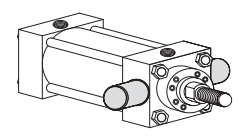

YATES STYLE "U"
NFPA-MT1

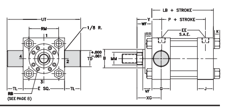

CAP TRUNNION MOUNT

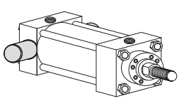

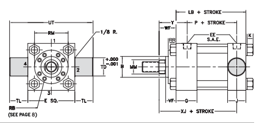

YATES STYLE "W"
NFPA-MT2

Series H6 22

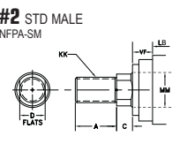

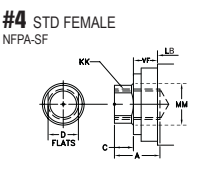

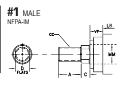

ан гэйлэд

|          | ADD STROKE   |                                     |            |         |         |        |        |         |        |          |          |         |          |          |
|----------|--------------|-------------------------------------|------------|---------|---------|--------|--------|---------|--------|----------|----------|---------|----------|----------|
|          | P            |                                     |            |         |         |        |        |         |        |          |          |         |          |          |
| BORE     | E            | EE                                  | SAE OPT.   | F       | ଦ       | J      | K      | TD      | TL     | UT       | LB       |         |          |          |
| 14 7/8   | 2 1/2        | 32                                  | 1 3/8      | 4 7/16  | 4 7/16  | 1 1/16 | 4      | 4       | 22 7/8 | 14 1/2   | 9 1/2    |         |          |          |
| 12       |              |                                     |            |         |         |        |        |         |        |          |          |         |          |          |
| 14       | 17 1/8       | 2 1/2                               | 32         | 1 5/8   | 4 7/8   | 4 7/8  | 1 1/16 | 4 1/2   | 4 1/2  | 26 1/8   | 15 5/8   | 9 7/8   |          |          |
| 16       | 19 1/4       | 3                                   | 32         | 1 7/8   | 5 7/8   | 5 7/8  | 1 9/32 | 5       | 5      | 29 1/4   | 18 1/8   | 11      |          |          |
| 18       | 22           | లు                                   | 32         | 2 3/16  | 6 7/8   | 6 7/8  | 1 9/32 | 5 3/4   | 5 3/4  | 33 1/2   | 21 1/8   | 12      |          |          |
| 20       | 23 5/8       | 3                                   | 32         | 2 11/16 | 7 7/8   | 7 718  | 1 9/32 | 6 1/4   | 6 1/4  | 36 1/8   | 23 5/8   | 12 1/2  |          |          |
| 24       | 31           | 3                                   | 32         | 2 11/16 | 10      | 10     | 3      | 7 1/2   | 7 1/2  | 46       | 29 1/2   | 18      |          |          |
| ROD DIA. | THREAD       | ROD EXTENSIONS AND PILOT DIMENSIONS | ADD STROKE |         |         |        |        |         |        |          |          |         |          |          |
| BORE     | MM           | КК                                  | сс         | A       | Bt      | C      | D      | VF      | WF     | RR       | RM       | Y       | XG       | XJ       |
| 5 1/4-12 | 6 1/4        | 1                                   | 1 3/8      | 8 3/8   | 5 11/16 | 5 3/8  |        |         |        |          |          |         |          |          |
| 12       | 5 1/2        | 4-12                                | 5 1/2      | Δ       | 2 3/16  | 3 3/16 | 15 1/2 |         |        |          |          |         |          |          |
| 7        | 5-12         | 6 1/2-12                            | 7          | 8       | 1       | Δ      | 2 1/2  | 3 1/2   | 1 3/8  | 10 13/16 | 6        | 5 11/16 | 15 13/16 |          |
| 8        | 5 3/4-12     | 7 1/2-12                            | 8          | 9       | 1       | Δ      | 3      | 4       | 1 3/8  | 12 3/8   | 6 1/2    | 6 3/16  | 16 5/16  |          |
| 14       | 7            | 5-12                                | 6 1/2-12   | 7       | 8       | 1      | Δ      | 2 1/2   | 3 1/2  | 1 5/8    | 10 13/16 | 6 3/8   | 5 15/16  | 16 11/16 |
| 8        | 5 3/4-12     | 7 1/2-12                            | 8          | 9       | 1       | Δ      | 3      | 4       | 1 5/8  | 12 3/8   | 6 7/8    | 6 7/16  | 17 3/16  |          |
| 9        | 6 1/2-12     | 8 1/2-12                            | 9          | 10      | 1       | ▷      | 3 1/4  | 4 1/4   | 1 5/8  | 13 1/8   | 7 1/8    | 6 11/16 | 17 7/16  |          |
| 10       | 7 1/4-12     | 9 1/2-12                            | 10         | 11      | 1       | ▷      | 3 1/2  | 4 1/2   | 1 5/8  | 14 5/8   | 7 3/8    | 6 15/16 | 17 11/16 |          |
| 16       | 8            | 5 3/4-12                            | 7 1/2-12   | 8       | 9       | 1      | Δ      | 3       | 4      | 1 7/8    | 12 3/8   | 7 9/16  | 6 15/16  | 19 3/16  |
| 9        | 6 1/2-12     | 8 1/2-12                            | 9          | 10      | 1       | Δ      | 3 1/4  | 4 1/4   | 1 7/8  | 13 1/8   | 7 13/16  | 7 3/16  | 19 7/16  |          |
| 10       | 7 1/4-12     | 9 1/2-12                            | 10         | 11      | 1       | Δ      | 3 1/2  | 4 1/2   | 1 7/8  | 14 5/8   | 8 1/16   | 7 7/16  | 19 11/16 |          |
| 18       | 9            | 6 1/2-12                            | 8 1/2-12   | 9       | 10      | 1      | Δ      | 3 1/4   | 4 1/4  | 2 3/16   | 13 1/8   | 8 13/16 | 7 15/16  | 21 15/16 |
| 10       | 7 1/4-12     | 9 1/2-12                            | 10         | 11      | 1       | ▷      | 3 1/2  | 4 1/2   | 2 3/16 | 14 5/8   | 9 1/16   | 7 11/16 | 22 3/16  |          |
| 11       | 1            |                                     |            |         |         |        |        |         |        |          |          |         |          |          |
| 20       | 10           | 7 1/4-12                            | 9 1/2-12   | 10      | Δ       | 3 1/2  | 4 1/2  | 2 11/16 | 14 5/8 | 10 1/16  | 8 7/16   | 24 3/16 |          |          |
| 24       | 11           | 8-8                                 | -          | 11      | 12      | 1      | Δ      | 3 1/2   | 4 1/2  | 2 11/16  | 16       | 10 1/4  | તે ર      | 29       |

HEAD END PORTS SHALLOW TAPPED
(2) SPANNER HOLES USED INSTEAD OF FLATS ON 3 1/2" DIA. AND LARGER RODS
▷
 B DIMENSION TOLERANCE -.001/ -.003
*
 NOTE: CUSHION LOCATION IS FACTORY'S DISCRETION UNLESS OTHERWISE SPECIFIED BY THE CUSTOMER

HEAD RECTANGULAR FLANGE MOUNT

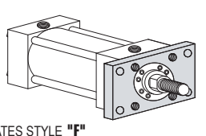

+ STROKE-

UF
NFPA-MF1 HEAD SQUARE FLANGE MOUNT

CAP RECTANGULAR FLANGE MOUNT

YATES STYLE "R"
NFPA-MF2 CAP SQUARE FLANGE MOUNT

MI 586.778.7680 AL 256.351.8081 355.

Series H6

| BORE     | E        | EE       | SAE OPT.   |       |
|----------|----------|----------|------------|-------|
| 1 1/2    | 2 1/2    | 1/2      | 10         |       |
| 2        | లు        | 1/2      | 10         |       |
| 2 1/2    | 3 1/2    | 1/2      | 10         |       |
| 3 1/4    | 4 1/2    | 3/4      | 12         |       |
| 4        | 5        | 3/4      | 12         |       |
| 5        | 6 1/2    | 3/4      | 12         |       |
|          | 16       |          |            |       |
| ഗ        | 7 1/2    | 1        |            |       |
| 7        | 8 1/2    | 1 1/4    | 20         |       |
| 8        | 9 1/2    | 1 1/2    | 24         |       |
| ROD DIA. | THREAD   |          |            |       |
| BORE     | MM       | KK       | сс         | A     |
| 1 1/2    | 5/8      | 7/16-20  | 1/2-20     | 3/4   |
| 1 t      | 3/4-16   | 7/8-14   | 1 1/8      |       |
| 2        | 1        | 3/4-16   | 7/8-14     | 1 1/8 |
| 1 3/8 †  | 1-14     | 1 1/4-12 | 1 5/8      |       |
| 2 1/2    | 1        | 3/4-16   | 7/8-14     | 1 1/8 |
| 1 3/8 t  | 1-14     | 1 1/4-12 | 1 5/8      |       |
| 1 3/4 t  | 1 1/4-12 | 1 1/2-12 | 2          |       |
| 3 1/4    | 1 3/8    | 1-14     | 1 1/4-12   | 1 5/8 |
| 1 3/4    | 1 1/4-12 | 1 1/2-12 | 2          |       |
| 1 1/2-12 |          |          |            |       |
| 2 t      | 1 3/4-12 | 2 1/4    |            |       |
| 4        | 1 3/4    | 1 1/4-12 | 1 1/2-12   | 2     |
| 2        | 1 1/2-12 | 1 3/4-12 | 2 1/4      |       |
| 2 1/2    | 1 7/8-12 | 2 1/4-12 | 3          |       |
| 5        | 2        | 1 1/2-12 | 1 3/4-12   | 2 1/4 |
| 2 1/2    | 1 7/8-12 | 2 1/4-12 | 3          |       |
| 3        | 2 1/4-12 | 2 3/4-12 | 3 1/2      |       |
| 3 1/2    | 2 1/2-12 | 3 1/4-12 | 3 1/2      |       |
| ഗ        | 2 1/2    | 1 7/8-12 | 2 1/4-12   | 3     |
| 3        | 2 1/4-12 | 2 3/4-12 | 3 1/2      |       |
| 3 1/2    | 2 1/2-12 | 3 1/4-12 | 3 1/2      |       |
| 4        | 3-12     | 3 3/4-12 | 4          |       |
| 7        | ﺩﺭ       | 2 1/4-12 | 2 3/4-12   | 3 1/2 |
| 3 1/2    | 2 1/2-12 | 3 1/4-12 | 3 1/2      |       |
| 4        | 3-12     | 3 3/4-12 | 4          |       |
| 4 1/2    | 3 1/4-12 | 4 1/4-12 | 4 1/2      |       |
| 5        | 3 1/2-12 | 4 3/4-12 | 5          |       |
| 8        | 3 1/2    | 2 1/2-12 | 3 1/4-12   | 3 1/2 |
| 4        | 3-12     | 3 3/4-12 | 4          |       |
| 4 1/2    | 3 1/4-12 | 4 1/4-12 | 4 1/2      |       |
| 5        | 3 1/2-12 | 4 3/4-12 | 5          |       |
| 5 1/2    | 4-12     | 5 1/4-12 | 5 1/2      |       |

| FB     | ଦ     |       |
|--------|-------|-------|
| 7/16   | 1 3/4 |       |
| 9/16   | 1 3/4 |       |
| 9/16   | 1 3/4 |       |
| 11/16  | 2     |       |
| 11/16  | 2     |       |
| 15/16  | 2     |       |
|        | 2 1/4 |       |
| 1 1/16 |       |       |
| 1 3/16 | 2 3/4 |       |
| 1 5/16 | 3     |       |
| Bt     | C     | D     |
| 1 1/8  | 3/8   | 17/32 |
| 1 1/2  | 1/2   | 7/8   |
| 1 1/2  | 1/2   | 7/8   |
| 2      | 5/8   | 1 1/8 |
| 1 1/2  | 1/2   | 7/8   |
| 2      | 5/8   | 1 1/8 |
| 2 3/8  | 3/4   | 1 1/2 |
| 2      | 5/8   | 1 1/8 |
| 2 3/8  | 3/4   | 1 1/2 |
| 2 5/8  | 7/8   | 1 3/4 |
| 2 3/8  | 3/4   | 1 1/2 |
| 2 5/8  | 7/8   | 1 3/4 |
| 3 1/8  | 1     | 2 1/8 |
| 2 5/8  | 7/8   | 1 3/4 |
| 3 1/8  | 1     | 2 1/8 |
| 3 3/4  | 1     | 2 5/8 |
| 4 1/4  | 1     | V     |
| 3 1/8  | 1     | 2 1/8 |
| 3 3/4  | 1     | 2 5/8 |
| 4 1/4  | 1     | Δ     |
| 4 3/4  | 1     | Δ     |
| 1      |       |       |
| 3 3/4  | 2 5/8 |       |
| 4 1/4  | 1     | V     |
| 4 3/4  | 1     | v     |
| 5 1/4  | 1     | Δ     |
| 5 3/4  | 1     | Δ     |
| 4 1/4  | 1     | Δ     |
| 4 3/4  | 1     | Δ     |
| 5 1/4  | 1     | 4     |
| 5 3/4  | 1     | Δ     |
| 6 1/4  | 1     | Δ     |

# Standard Rod Ends

H seins F
3/8 5/8 5/8 314 718 7/8 1 1 1 NOTE:
 "F" AND "R" MOUNTS HAVE DERATED PRESSURE RATINGS, FOR HIGHER
PRESSURE  USE "G" AND "P" MOUNTS
CUSHION LOCATION IS FACTORY'S DISCRETION UNLESS OTHERWISE
SPECIFIED BY THE CUSTOMER
HEAD END PORTS SHALLOW TAPPED (2) SPANNER HOLES USED INSTEAD OF FLATS ON 3 1/2" DIA. AND LARGER RODS B DIMENSION TOLERANCE  -. 001/ -. 003 THESE CYLINDERS HAVE FULL PLATE RETAINERS. USE "E" DIMENSIONS INSTEAD OF "RM." USE "F"
DIMENSIONS INSTEAD OF "RR" = SEE PAGE 8

NOTE:
1 1/2 THRU 8 BORE - SERIES H6 ROD EXTENSIONS AND PILOT DIMENSIONS

|       | ADD STROKE   |              |           |         |        |       |      |
|-------|--------------|--------------|-----------|---------|--------|-------|------|
| J     | K            | R            | TF        | UF      | LB     | P     |      |
| 1 1/2 | 3/8          | 1.63         | 3 7/16    | 4 1/4   | 4 5/8  | 3     |      |
| 1 1/2 | 7/16         | 2.05         | 4 1/8     | 5 1/8   | 4 5/8  | 3     |      |
| 1 1/2 | 7/16         | 2.55         | 4 5/8     | 5 5/8   | 4 3/4  | 3 1/8 |      |
| 1 3/4 | 9/16         | 3.25         | 5 7/8     | 7 1/8   | 5 1/2  | 3 5/8 |      |
| 1 3/4 | 9/16         | 3.82         | 6 3/8     | 7 5/8   | 5 3/4  | 3 7/8 |      |
| 1 3/4 | 3/4          | 4 95         | 8 3/16    | 9 3/4   | 6 1/4  | 4 3/8 |      |
| 2 1/4 | 7/8          | 5.73         | 9 7/16    | 11 1/4  | 7 3/8  | 5     |      |
| 2 3/4 | 1            | 6.58         | 10 5/8    | 12 5/8  | 8 1/2  | 5 1/2 |      |
| 3     | 1 1/16       | 7.50         | 11 13/16  | 14      | 9 1/2  | 6 1/4 |      |
|       | ADD          | "F" MOUNT    | "R" MOUNT |         |        |       |      |
|       | MAX PSI PUSH | MAX PSI PULL |           |         |        |       |      |
|       | STROKE       |              |           |         |        |       |      |
| VF    | WF           | RR           | RM        | Y       | ZF     |       |      |
| 5/8   | 1            | .            | Ş         | 1 15/16 | ნ      | 2500  | 3000 |
| 718   | 1 3/8        | .            | Ş         | 2 5/16  | 6 3/8  | 1500  | 3000 |
| 718   | 1 3/8        | ·            | Ş         | 2 5/16  | 6 5/8  | 2500  | 3000 |
| 1     | 1 5/8        | -            | Ş         | 2 9/16  | 6 7/8  | 1500  | 3000 |
| 718   | 1 3/8        | 3/8          | 2 1/2     | 2 5/16  | 6 3/4  | 2500  | 3000 |
| 1     | 1 5/8        | -            | S         | 2 9/16  | 7      | 1900  | 3000 |
| 1 1/8 | 1 7/8        | .            | ş         | 2 13/16 | 7 1/4  | 1500  | 3000 |
| 1     | 1 5/8        | 5/16         | 3 7/32    | 2 11/16 | 7 7/8  | 2500  | 3000 |
| 1 1/8 | 1 7/8        | 2 15/16      | 8 1/8     | 2100    | 3000   |       |      |
| -     | S            |              |           |         |        |       |      |
| 2     | .            | 3 1/16       | 8 1/4     | 1500    | 3000   |       |      |
| 1 1/8 | S            |              |           |         |        |       |      |
| 1 1/8 | 1 7/8        | 5/16         | 3 7/8     | 2 15/16 | 8 1/2  | 2500  | 3000 |
| 1 1/8 | 2            | 5/16         | 4         | 3 1/16  | 8 5/8  | 1800  | 3000 |
| 1 1/4 | 2 1/4        | 5/8          | ş         | 3 5/16  | 8 7/8  | 1500  | 3000 |
| 1 1/8 | 2            | 5/16         | 4         | 3 1/16  | 9 1/8  | 2200  | 2000 |
| 1 1/4 | 2 1/4        | 5/8          | 4 7/16    | 3 5/16  | 9 3/8  | 1650  | 2500 |
| 1 1/4 | 2 1/4        | 3/4          | 5 1/4     | 3 5/16  | 9 3/8  | 1200  | 2800 |
| 1 1/4 | 2 1/4        | 3/4          | ş         | 3 5/16  | 9 3/8  | 750   | 3000 |
| 1 1/4 | 2 1/4        | 5/8          | 4 7/16    | 3 7/16  | 10 5/8 | 1800  | 2000 |
| 1 1/4 | 2 1/4        | 3/4          | 5 1/4     | 3 7/16  | 10 5/8 | 1450  | 2500 |
| 1 1/4 | 2 1/4        | 3/4          | 5 5/8     | 3 7/16  | 10 5/8 | 1100  | 2800 |
| 1 1/4 | 2 1/4        | 718          | S         | 3 7/16  | 10 5/8 | 750   | 3000 |
| 1 1/4 | 2 1/4        | 3/4          | 5 1/4     | 3 3/4   | 11 3/4 | 740   | 1500 |
| 1 1/4 | 2 1/4        | 3/4          | 5 5/8     | 3 3/4   | 11 3/4 | 650   | 1700 |
| 1 1/4 | 2 1/4        | 718          | 6 7/16    | 11 3/4  | 450    |       |      |
|       | 3 3/4        | 1800         |           |         |        |       |      |
|       | 360          | 1900         |           |         |        |       |      |
| 1 1/4 | 2 1/4        | 7/8          | 7 1/8     | 3 3/4   | 11 3/4 |       |      |
| 1 1/4 | 2 1/4        | 7/8          | S         | 3 3/4   | 11 3/4 | 270   | 2000 |
| 1 1/4 | 2 1/4        | 3/4          | 5 5/8     | 3 7/8   | 12 3/4 | 620   | 1500 |
| 1 1/4 | 2 1/4        | 718          | 6 7/16    | 3 7/8   | 12 3/4 | 470   | 1700 |
| 1 1/4 | 2 1/4        | 718          | 7 1/8     | 3 7/8   | 12 3/4 | 410   | 1800 |
| 1 1/4 | 2 1/4        | 718          | 7 5/8     | 3 7/8   | 12 3/4 | 340   | 1900 |
| 1 1/4 | 2 1/4        | 718          | Ş         | 3 7/8   | 12 3/4 | 280   | 2000 |

# Head Rectangular Integral Flange Mount

-LB + STROKE

-UF
NFPA-ME5 CAP RECTANGULAR INTEGRAL FLANGE MOUNT

STANDARD ROD ENDS

HEAD END PORTS SHALLOW TAPPED
+
 (2) SPANNER HOLES USED INSTEAD OF FLATS ON 3 1/2" DIA. AND LARGER RODS
Δ
 P MOUNT CYLINDERS HAVE FULL PLATE RETAINERS. USE "E" DIMENSIONS INSTEAD OF "RM" USE "F" DIMENSIONS INSTEAD OF "RR" - SEE PAGE 8 રે
B DIMENSION TOLERANCE   -. 001/ -. 003
 \#
 BORE AND ROD COMBINATION IS NOT AVAILABLE
 NOTE: CUSHION LOCATION IS FACTORY'S DISCRETION UNLESS OTHERWISE SPECIFIED BY THE CUSTOMER
Series H6 MI 586.778.7680

|          | ADD STROKE   |                                     |            |       |         |         |         |         |         |          |         |         |          |
|----------|--------------|-------------------------------------|------------|-------|---------|---------|---------|---------|---------|----------|---------|---------|----------|
| BORE     | E            | EE                                  | SAE OPT.   | F     | FB      | G       | J       | K       | R       | TF       | UF      | LB      | P        |
| 1 1/2    | 2 1/2        | 1/2                                 | 10         | 3/8   | 7/16    | 1 3/4   | 1 1/2   | 3/8     | 1.63    | 3 7/16   | 4 1/4   | 4 5/8   | 3        |
| 2        | 3            | 1/2                                 | 10         | 5/8   | 9/16    | 1 3/4   | 1 1/2   | 7/16    | 2.05    | 4 1/8    | 5 1/8   | 4 5/8   | 3        |
|          | 7/16         |                                     |            |       |         |         |         |         |         |          |         |         |          |
| 2 1/2    | 3 1/2        | 1/2                                 | 10         | 5/8   | 9/16    | 1 3/4   | 1 1/2   | 2.55    | 4 5/8   | 5 5/8    | 4 3/4   | 3 1/8   |          |
| 3 1/4    | 4 1/2        | 3/4                                 | 12         | 3/4   | 11/16   | 2       | 1 3/4   | 9/16    | 3.25    | 5 7/8    | 7 1/8   | 5 1/2   | 3 5/8    |
| 3/4      | 718          | 2                                   | 9/16       |       |         |         |         |         |         |          |         |         |          |
| 4        | 5            | 12                                  | 11/16      | 1 3/4 | 3.82    | 6 3/8   | 7 5/8   | 5 3/4   | 3 7/8   |          |         |         |          |
| 5        | 6 1/2        | 3/4                                 | 12         | 718   | 15/16   | 2       | 1 3/4   | 3/4     | 4 95    | 8 3/16   | 9 3/4   | 6 1/4   | 4 3/8    |
| 6        | 7 1/2        | 1                                   | 16         | 1     | 1 1/16  | 2 1/4   | 2 1/4   | 718     | 5.73    | 9 7/16   | 11 1/4  | 7 3/8   | 5        |
| 7        | 8 1/2        | 1 1/4                               | 20         | 1     | 1 3/16  | 2 3/4   | 2 3/4   | 1       | 6.58    | 10 5/8   | 12 5/8  | 8 1/2   | 5 1/2    |
| 8        | 9 1/2        | 1 1/2                               | 24         | 1     | 1 5/16  | 3       | 3       | 1 1/16  | 7.50    | 11 13/16 | 14      | 9 1/2   | 6 1/4    |
| 10       | 12 5/8       | 2                                   | 32         | 7/8   | 1 13/16 | 3 11/16 | 3 11/16 | 1       | 9.62    | 15 7/8   | 19      | 12 1/8  | 8 1/8    |
| 12       | 14 7/8       | 2 1/2                               | 32         | 1 3/8 | 2 1/16  | 4 7/16  | 4 7/16  | 1 1/8   | 11.45   | 18 1/2   | 22      | 14 1/2  | 9 1/2    |
| 14       | 17 1/8       | 2 1/2                               | 32         | 1 5/8 | 2 5/16  | 4 7/8   | 4 7/8   | 1 1/8   | 13.26   | 21       | 25      | 15 5/8  | 9 7/8    |
| ROD DIA. | THREAD       | ROD EXTENSIONS AND PILOT DIMENSIONS | ADD STROKE |       |         |         |         |         |         |          |         |         |          |
| BORE     | MM           | KK                                  | сс         | A     | B ‡     | C       | D       | VF      | WF      | RR       | RM      | Y       | ZJ       |
| 1 1/2    | 5/8          | 7/16-20                             | 1/2-20     | 3/4   | 1 1/8   | 3/8     | 17/32   | 5/8     | 1       | 3/8      | 2 3/8 5 | 1 15/16 | 5 5/8    |
| 1 t*     | 3/4-16       | 7/8-14                              | 1 1/8      | 1 1/2 | 1/2     | 718     | 718     | 1 3/8   | 3/8     | 2 1/2 §  | 2 5/16  | ნ       |          |
| 2        | 1            | 3/4-16                              | 7/8-14     | 1 1/8 | 1 1/2   | 1/2     | 718     | 7/8     | 1 3/8   | 3/8      | 2 1/2 § | 2 5/16  | 6        |
| 1 3/8 †* | 1-14         | 1 1/4-12                            | 1 5/8      | 2     | 5/8     | 1 1/8   | 1       | 1 5/8   | 5/16    | 3 7/32 § | 2 9/16  | 6 1/4   |          |
| 2 1/2    | 1            | 3/4-16                              | 7/8-14     | 1 1/8 | 1 1/2   | 1/2     | 718     | 718     | 1 3/8   | 3/8      | 2 1/2   | 2 5/16  | 6 1/8    |
| 1 3/8 †  | 1-14         | 1 1/4-12                            | 1 5/8      | 2     | ୧/୫     | 1 1/8   | 1       | 1 5/8   | 5/16    | 3 7/32 § | 2 9/16  | 6 3/8   |          |
| 3/4      |              |                                     |            |       |         |         |         |         |         |          |         |         |          |
| 1 3/4 †* | 1 1/4-12     | 1 1/2-12                            | 2          | 2 3/8 | 1 1/2   | 1 1/8   | 1 7/8   | 5/16    | 3 718 § | 2 13/16  | 6 5/8   |         |          |
| 3 1/4    | 1 3/8        | 1-14                                | 1 1/4-12   | 1 5/8 | 2       | 5/8     | 1 1/8   | 1       | 1 5/8   | 5/16     | 3 7/32  | 2 11/16 | 7 1/8    |
| 1 3/4    | 1 1/4-12     | 1 1/2-12                            | 2          | 2 3/8 | 3/4     | 1 1/2   | 1 1/8   | 1 7/8   | 5/16    | 3 7/8 §  | 2 15/16 | 7 3/8   |          |
| 1 1/2-12 | 1 3/4-12     | 2 5/8                               | 7/8        | 1 3/4 | 1 1/8   | 2       | 5/16    | 4 કુ     | 3 1/16  | 7 1/2    |         |         |          |
| 2 t      | 2 1/4        |                                     |            |       |         |         |         |         |         |          |         |         |          |
| 4        | 1 3/4        | 1 1/4-12                            | 1 1/2-12   | 2     | 2 3/8   | 3/4     | 1 1/2   | 1 1/8   | 1 7/8   | 5/16     | 3 7/8   | 2 15/16 | 7 5/8    |
| 2        | 1 1/2-12     | 1 3/4-12                            | 2 1/4      | 2 5/8 | 718     | 1 3/4   | 1 1/8   | 2       | 5/16    | 4        | 3 1/16  | 7 3/4   |          |
| 2 1/2    | 1 7/8-12     | 2 1/4-12                            | 3          | 3 1/8 | 1       | 2 1/8   | 1 1/4   | 2 1/4   | 5/8     | 4 7/16   | 3 5/16  | 8       |          |
| 5        | 2            | 1 1/2-12                            | 1 3/4-12   | 2 1/4 | 2 5/8   | 7/8     | 1 3/4   | 1 1/8   | 2       | 5/16     | র্ব      | 3 1/16  | 8 1/4    |
| 2 1/2    | 1 7/8-12     | 2 1/4-12                            | 3          | 3 1/8 | 1       | 2 1/8   | 1 1/4   | 2 1/4   | 5/8     | 4 7/16   | 3 5/16  | 8 1/2   |          |
| 3        | 2 1/4-12     | 2 3/4-12                            | 3 1/2      | 3 3/4 | 1       | 2 5/8   | 1 1/4   | 2 1/4   | 3/4     | 5 1/4    | 3 5/16  | 8 1/2   |          |
| 3 1/2    | 2 1/2-12     | 3 1/4-12                            | 3 1/2      | 4 1/4 | 1       | V       | 1 1/4   | 2 1/4   | 3/4     | 5 5/8    | 3 5/16  | 8 1/2   |          |
| ნ        | 2 1/2        | 1 7/8-12                            | 2 1/4-12   | 3     | 3 1/8   | 1       | 2 1/8   | 1 1/4   | 2 1/4   | 5/8      | 4 7/16  | 3 7/16  | 9 5/8    |
| 3        | 2 1/4-12     | 2 3/4-12                            | 3 1/2      | 3 3/4 | 1       | 2 5/8   | 1 1/4   | 2 1/4   | 3/4     | 5 1/4    | 3 7/16  | 9 5/8   |          |
| 3 1/2    | 2 1/2-12     | 3 1/4-12                            | 3 1/2      | 4 1/4 | 1       | 4       | 1 1/4   | 2 1/4   | 3/4     | 5 5/8    | 3 7/16  | 9 5/8   |          |
| 4        | 3-12         | 3 3/4-12                            | 4          | 4 3/4 | 1       | Δ       | 1 1/4   | 2 1/4   | 718     | 6 7/16   | 3 7/16  | 9 5/8   |          |
| 7        | 3            | 2 1/4-12                            | 2 3/4-12   | 3 1/2 | 3 3/4   | 1       | 2 5/8   | 1 1/4   | 2 1/4   | 3/4      | 5 1/4   | 3 3/4   | 10 3/4   |
| 4 1/4    | 1            | 2 1/4                               | 3/4        | 3 3/4 | 10 3/4  |         |         |         |         |          |         |         |          |
| 3 1/2    | 2 1/2-12     | 3 1/4-12                            | 3 1/2      | Δ     | 1 1/4   | 5 5/8   |         |         |         |          |         |         |          |
| 3-12     | 3 3/4-12     | 4 3/4                               | 1          | 1 1/4 | 2 1/4   | 7/8     | 6 7/16  | 3 3/4   | 10 3/4  |          |         |         |          |
| বঁ        | বঁ            | Δ                                   | 1 1/4      | 2 1/4 |         |         |         |         |         |          |         |         |          |
| 4 1/2    | 3 1/4-12     | 4 1/4-12                            | 4 1/2      | 5 1/4 | 1       | Δ       | 7/8     | 7 1/8   | 3 3/4   | 10 3/4   |         |         |          |
| 5        | 3 1/2-12     | 4 3/4-12                            | 5          | 5 3/4 | 1       | Δ       | 1 1/4   | 2 1/4   | 7/8     | 7 5/8    | 3 3/4   | 10 3/4  |          |
| 8        | 3 1/2        | 2 1/2-12                            | 3 1/4-12   | 3 1/2 | 4 1/4   | 1       | Δ       | 1 1/4   | 2 1/4   | 3/4      | 5 5/8   | 3 7/8   | 11 3/4   |
| 4        | 3-12         | 3 3/4-12                            | 4          | 4 3/4 | 1       | Δ       | 1 1/4   | 2 1/4   | 718     | 6 7/16   | 3 7/8   | 11 3/4  |          |
| 4 1/2    | 3 1/4-12     | 4 1/4-12                            | 4 1/2      | 5 1/4 | 1       | Δ       | 1 1/4   | 2 1/4   | 718     | 7 1/8    | 3 7/8   | 11 3/4  |          |
| 5        | 3 1/2-12     | 4 3/4-12                            | 5          | 5 3/4 | 1       | Δ       | 1 1/4   | 2 1/4   | 718     | 7 5/8    | 3 7/8   | 11 3/4  |          |
| 5 1/2    | 4-12         | 5 1/4-12                            | 5 1/2      | 6 1/4 | 1       | Δ       | 1 1/4   | 2 1/4   | 7/8     | 8 3/8    | 3 7/8   | 11 3/4  |          |
| 10       | 4 1/2        | 3 1/4-12                            | 4 1/4-12   | 4 1/2 | 5 1/4   | 1       | Δ       | 1 15/16 | 2 15/16 | 7/8      | 7 1/8   | 4 15/16 | 15 1/16  |
| 5        | 3 1/2-12     | 4 3/4-12                            | 5          | 5 3/4 | 1       | Δ       | 2 3/16  | 3 3/16  | 7/8     | 7 5/8    | 5 3/16  | 15 5/16 |          |
| 5 1/2    | 4-12         | 5 1/4-12                            | 5 1/2      | 6 1/4 | 1       | Δ       | 2 3/16  | 3 3/16  | 7/8     | 8 3/8    | 5 3/16  | 15 5/16 |          |
| 7        | 5-12         | 6 1/2-12                            | 7          | 8     | 1       | Δ       | 2 1/2   | 3 1/2   | 7/8     | 10 13/16 | 5 1/2   | 15 રાજ   |          |
| 12       | 5 1/2        | 4-12                                | 5 1/4-12   | 5 1/2 | 6 1/4   | 1       | Δ       | 2 3/16  | 3 3/16  | 1 3/8    | 8 3/8   | 5 11/16 | 17 11/16 |
| 7        | 5-12         | 6 1/2-12                            | 7          | 8     | 1       | Δ       | 2 1/2   | 3 1/2   | 1 3/8   | 10 13/16 | ნ       | 18      |          |
| 8        | 9            |                                     |            |       |         |         |         |         |         |          |         |         |          |
| 8        | 5 3/4-12     | 7 1/2-12                            | 1          | Δ     | 3       | 4       | 1 3/8   | 12 3/8  | 6 1/2   | 18 1/2   |         |         |          |
| 14       | 7            | 5-12                                | 6 1/2-12   | 7     | 8       | 1       | 2 1/2   | 3 1/2   | 1 5/8   | 10 13/16 | 6 3/8   | 19 1/8  |          |
|          | Δ            |                                     |            |       |         |         |         |         |         |          |         |         |          |
| 9        | 1            | 4                                   | 19 5/8     |       |         |         |         |         |         |          |         |         |          |
| 8        | 5 3/4-12     | 7 1/2-12                            | 8          | Δ     | 3       | 1 5/8   | 12 3/8  | 6 7/8   |         |          |         |         |          |
| 9        | 6 1/2-12     | 8 1/2-12                            | ഥ          | 10    | 1       | Δ       | 3 1/4   | 4 1/4   | 1 5/8   | 13 1/8   | 7 1/8   | 19 7/8  |          |
| 10       | 7 1/4-12     | 9 1/2-12                            | 10         | 11    | 1       | 3 1/2   | 4 1/2   | 1 5/8   | 14 5/8  | 7 3/8    | 20 1/8  |         |          |
|          | Δ            |                                     |            |       |         |         |         |         |         |          |         |         |          |

1 1/2 THRU 14 BORE - SERIES H6

дн гэгээс

# Head Square Integral Flange Mount

Series H6

NFPA-ME3 CAP SQUARE INTEGRAL FLANGE MOUNT

YATES STYLE "Z"
NFPA-ME4

GA 678.355.2240

AH гэтээ

|         | ADD STROKE   |                                     |            |       |         |        |         |         |         |          |          |         |          |
|---------|--------------|-------------------------------------|------------|-------|---------|--------|---------|---------|---------|----------|----------|---------|----------|
| BORE    | E            | EB                                  | EE         | OPT   | F       | ES     | G       | J       | K       | RE       | TE       | LB      | P        |
| 10      | 12 5/8       | 1 5/16                              | 2          | 32    | 718     | 16 5/8 | 3 11/16 | 3 11/16 | 1       | 9 7/8    | 14 1/8   | 12 1/8  | 8 1/8    |
| 12      | 14 7/8       | 1 9/16                              | 2 1/2      | 32    | 1 3/8   | 19 3/4 | 4 7/16  | 4 7/16  | 1 1/16  | 11 3/4   | 16 3/4   | 14 1/2  | 9 1/2    |
| 14      | 17 1/8       | 1 13/16                             | 2 1/2      | 32    | 1 5/8   | 21 3/4 | 4 7/8   | 4 7/8   | 1 1/16  | 12 15/16 | 18 7/16  | 15 5/8  | 9 7/8    |
| 16      | 19 1/4       | 1 13/16                             | 3          | 32    | 1 7/8   | 24 1/2 | 5 7/8   | 5 7/8   | 1 9/32  | 15 1/4   | 21 1/16  | 18 1/8  | 11       |
| 18      | 22           | 2 1/16                              | 3          | 32    | 2 3/16  | 26 1/2 | 6 7/8   | 6 7/8   | 1 9/32  | 16 7/16  | 22 5/8   | 21 1/8  | 12       |
| 20      | 23 5/8       | 2 1/16                              | 3          | 32    | 2 11/16 | 29     | 7 7/8   | 7 7/8   | 1 9/32  | 18 1/16  | 24 7/8   | 23 5/8  | 12 1/2   |
| 24      | 31           | 2 9/16                              | 3          | 32    | 2 11/16 | 36     | 10      | 10      | 3       | 22 1/8   | 31 1/4   | 29 1/2  | 18       |
| ROD DIA | THREAD       | ROD EXTENSIONS AND PILOT DIMENSIONS | ADD STROKE |       |         |        |         |         |         |          |          |         |          |
| BORE    | MM           | KK                                  | сс         | A     | B t     | C      | D       | VF      | WF      | RR       | RM       | Y       | ZJ       |
| 10      | 4 1/2        | 3 1/4-12                            | 4 1/4-12   | 4 1/2 | 5 1/4   | 1      | Δ       | 1 15/16 | 2 15/16 | 7/8      | 7 1/8    | 4 15/16 | 15 1/16  |
| 5       | 3 1/2-12     | 4 3/4-12                            | 5          | 5 3/4 | 1       | Δ      | 2 3/16  | 3 3/16  | 7/8     | 7 5/8    | 5 3/16   | 15 5/16 |          |
| 5 1/2   | 4-12         | 5 1/4-12                            | 5 1/2      | 6 1/4 | 1       | Δ      | 2 3/16  | 3 3/16  | 7/8     | 8 3/8    | 5 3/16   | 15 5/16 |          |
| 7       | 5-12         | 6 1/2-12                            | 7          | 8     | 1       | Δ      | 2 1/2   | 3 1/2   | 718     | 10 13/16 | 5 1/2    | 15 5/8  |          |
| 12      | 5 1/2        | 4-12                                | 5 1/4-12   | 5 1/2 | 6 1/4   | 1      | Δ       | 2 3/16  | 3 3/16  | 1 3/8    | 8 3/8    | 5 11/16 | 17 11/16 |
| 7       | 5-12         | 6 1/2-12                            | 7          | 8     | 1       | Δ      | 2 1/2   | 3 1/2   | 1 3/8   | 10 13/16 | ნ        | 18      |          |
| ၀၁      | 5 3/4-12     | 7 1/2-12                            | တ          | ഗ     | 1       | Δ      | 3       | 4       | 1 3/8   | 12 3/8   | 6 1/2    | 18 1/2  |          |
| 14      | 7            | 5-12                                | 6 1/2-12   | 7     | 8       | 1      | Δ       | 2 1/2   | 3 1/2   | 1 5/8    | 10 13/16 | 6 3/8   | 19 1/8   |
| 8       | 5 3/4-12     | 7 1/2-12                            | 8          | 9     | 1       | Δ      | 3       | 4       | 1 5/8   | 12 3/8   | 6 7/8    | 19 5/8  |          |
| 1       | 4 1/4        |                                     |            |       |         |        |         |         |         |          |          |         |          |
| 9       | 6 1/2-12     | 8 1/2-12                            | 9          | 10    | Δ       | 3 1/4  | 1 5/8   | 13 1/8  | 7 1/8   | 19 7/8   |          |         |          |
| 10      | 7 1/4-12     | 9 1/2-12                            | 10         | 11    | 1       | Δ      | 3 1/2   | 4 1/2   | 1 5/8   | 14 5/8   | 7 3/8    | 20 1/8  |          |
| 16      | 8            | 5 3/4-12                            | 7 1/2-12   | 9     | 1       | 4      | 1 7/8   | 12 3/8  | 7 9/16  | 22 1/8   |          |         |          |
| 8       | Δ            | 3                                   |            |       |         |        |         |         |         |          |          |         |          |
| 9       | 6 1/2-12     | 8 1/2-12                            | 9          | 10    | 1       | Δ      | 3 1/4   | 4 1/4   | 1 7/8   | 13 1/8   | 7 13/16  | 22 3/8  |          |
| 10      | 7 1/4-12     | 9 1/2-12                            | 10         | 11    | 1       | 3 1/2  | 4 1/2   | 1 7/8   | 14 5/8  | 8 1/16   | 22 5/8   |         |          |
|         | Δ            |                                     |            |       |         |        |         |         |         |          |          |         |          |
| 18      | 9            | 6 1/2-12                            | 8 1/2-12   | 9     | 10      | 1      | Δ       | 3 1/4   | 4 1/4   | 2 3/16   | 13 1/8   | 8 13/16 | 25 3/8   |
| 10      | 7 1/4-12     | 9 1/2-12                            | 10         | 11    | 1       | Δ      | 3 1/2   | 4 1/2   | 2 3/16  | 14 5/8   | 9 1/16   | 25 5/8  |          |
| 20      | 10           | 7 1/4-12                            | 9 1/2-12   | 10    | 11      | 1      | Δ       | 3 1/2   | 4 1/2   | 2 11/16  | 14 5/8   | 10 1/16 | 28 1/8   |
| 24      | 11           | 8-8                                 | .          | 11    | 12      | 1      | Δ       | 3 1/2   | 4 1/2   | 2 11/16  | 16       | 10 1/4  | 34       |

(2) SPANNER HOLES USED INSTEAD OF FLATS ON 3 1/2" DIA. AND LARGER RODS
ਧ B DIMENSION TOLERANCE -. 001/ -. 003
 \#
NOTE: SEE PAGE 8 FOR TIE ROD INFORMATION ON 10" THRU 24" BORES
 NOTE: CUSHION LOCATION IS FACTORY'S DISCRETION UNLESS OTHERWISE SPECIFIED BY THE CUSTOMER

NO TIE RODS EXTENDED MOUNT

YATES STYLE "K"

NFPA-MX0 BOTH ENDS TIE RODS EXTENDED MOUNT

YATES STYLE "L"
NFPA-MX1 HEAD TIE RODS EXTENDED MOUNT

YATES STYLE "M"
NFPA-MX3

CAP TIE RODS EXTENDED MOUNT

MI 586.778.7680 AL 256.351.8081 355.

SERIES H6 Series H6 30

| BORE     | AA       | BB       | DD       |
|----------|----------|----------|----------|
| 1 1/2    | 2.3      | 1 3/8    | 3/8-24   |
| 2        | 2.9      | 1 13/16  | 1/2-20   |
| 2 1/2    | 3.6      | 1 13/16  | 1/2-20   |
| 3 1/4    | 4 6      | 2 5/16   | 5/8-18   |
| 4        | 5 4      | 2 5/16   | 5/8-18   |
| 5        | 7.0      | 3 3/16   | 7/8-14   |
| ნ        | 8.1      | 3 5/8    | 1-14     |
| 7        | 9 3      | 4 1/8    | 1 1/8-12 |
| 8        | 10.6     | 4 1/2    | 1 1/4-12 |
| ROD DIA. | THREAD   |          |          |
| BORE     | MM       | сс       |          |
|          | КК       |          |          |
| 1 1/2    | 5/8      | 7/16-20  | 1/2-20   |
| 1 t      | 3/4-16   | 7/8-14   |          |
| 2        | 1        | 3/4-16   | 7/8-14   |
| 1 3/8 †  | 1-14     | 1 1/4-12 |          |
| 2 1/2    | 1        | 3/4-16   | 7/8-14   |
| 1 3/8 †  | 1-14     | 1 1/4-12 |          |
| 1 3/4 t  | 1 1/4-12 | 1 1/2-12 |          |
| 3 1/4    | 1 3/8    | 1-14     | 1 1/4-12 |
| 1 3/4    | 1 1/4-12 | 1 1/2-12 |          |
| 2 t      | 1 1/2-12 | 1 3/4-12 |          |
| 4        | 1 3/4    | 1 1/4-12 | 1 1/2-12 |
| 2        | 1 1/2-12 | 1 3/4-12 |          |
| 2 1/2    | 1 7/8-12 | 2 1/4-12 |          |
| 5        | 2        | 1 1/2-12 | 1 3/4-12 |
| 2 1/2    | 2 1/4-12 |          |          |
|          | 1 7/8-12 |          |          |
| 3        | 2 1/4-12 | 2 3/4-12 |          |
| 3 1/2    | 2 1/2-12 | 3 1/4-12 |          |
| ნ        | 2 1/2    | 1 7/8-12 | 2 1/4-12 |
| 3        | 2 1/4-12 | 2 3/4-12 |          |
| 3 1/2    | 2 1/2-12 | 3 1/4-12 |          |
| 4        | 3-12     | 3 3/4-12 |          |
| 7        | 3        | 2 1/4-12 | 2 3/4-12 |
| 3 1/2    | 2 1/2-12 | 3 1/4-12 |          |
| 4        | 3-12     | 3 3/4-12 |          |
| 4 1/2    | 3 1/4-12 | 4 1/4-12 |          |
| 5        | 3 1/2-12 | 4 3/4-12 |          |
| 8        | 3 1/2    | 2 1/2-12 | 3 1/4-12 |
| 4        | 3-12     | 3 3/4-12 |          |
| 4 1/2    | 3 1/4-12 | 4 1/4-12 |          |
| 5        | 3 1/2-12 | 4 3/4-12 |          |
| 5 1/2    | 4-12     | 5 1/4-12 |          |

# Standard Rod Ends

H seins ਧ *
HEAD END PORTS SHALLOW TAPPED
(2) SPANNER HOLES USED INSTEAD OF FLATS ON 3 1/2" DIA. AND LARGER RODS
B DIMENSION TOLERANCE  -.001/ -.003 ZT DIMENSION CHANGES ON DOUBLE ROD CYLINDERS = SEE PAGE 35 FOR DETAILS

క్ర THESE CYLINDERS HAVE FULL PLATE RETAINERS.  USE "E" DIMENSIONS INSTEAD OF "RM."  USE "F"
DIMENSIONS INSTEAD OF "RR" = SEE PAGE 8 NOTE:  1 1/2  THRU 8" BORE CYLINDERS ON L AND M MOUNTS HAVE FULL PLATE RETAINERS. USE "E" SQ.

DIMENSION INSTEAD OF RM
NOTE: CUSHION LOCATION IS FACTORY'S DISCRETION UNLESS OTHERWISE SPECIFIED BY THE CUSTOMER
1 1/2 THRU 8 BORE - SERII

|                                     | ADD STROKE   |          |       |       |       |        |          |          |          |
|-------------------------------------|--------------|----------|-------|-------|-------|--------|----------|----------|----------|
| E                                   | EE           | SAE OPT. | F     | ଦ     | J     | K      | R        | LB       | P        |
| 2 1/2                               | 1/2          | 10       | 3/8   | 1 3/4 | 1 1/2 | 3/8    | 1.63     | 4 5/8    | 3        |
| 3                                   | 1/2          | 10       | 5/8   | 1 3/4 | 1 1/2 | 7/16   | 2.05     | 4 5/8    | 3        |
| 3 1/2                               | 1/2          | 10       | 5/8   | 1 3/4 | 1 1/2 | 7/16   | 2.55     | 4 3/4    | 3 1/8    |
| 4 1/2                               | 3/4          | 12       | 3/4   | 2     | 1 3/4 | 9/16   | 3.25     | 5 1/2    | 3 5/8    |
| 5                                   | 3/4          | 12       | 718   | 2     | 1 3/4 | 9/16   | 3.82     | 5 3/4    | 3 7/8    |
| 6 1/2                               | 3/4          | 12       | 7/8   | 2     | 1 3/4 | 3/4    | 4.95     | 6 1/4    | 4 3/8    |
| 7 1/2                               | 1            | 16       | 1     | 2 1/4 | 2 1/4 | 718    | 5.73     | 7 3/8    | 5        |
| 8 1/2                               | 1 1/4        | 20       | 1     | 2 3/4 | 2 3/4 | 1      | 6.58     | 8 1/2    | 5 1/2    |
| 9 1/2                               | 1 1/2        | 24       | 1     | 3     | 3     | 1 1/16 | 7.50     | 9 1/2    | 6 1/4    |
| ROD EXTENSIONS AND PILOT DIMENSIONS | ADD STROKE   |          |       |       |       |        |          |          |          |
| VF                                  | WF           | Y        |       |       |       |        |          |          |          |
| A                                   | B ‡          | C        | D     | RR    | RM    | ZT*    |          |          |          |
| 3/4                                 | 1 1/8        | 3/8      | 17/32 | 5/8   | 1     | .      | 1 15/16  | 7        |          |
|                                     | S            |          |       |       |       |        |          |          |          |
| 1 1/8                               | 1 1/2        | 1/2      | 718   | 7/8   | 1 3/8 | .      | S        | 2 5/16   | 7 3/8    |
| 1 1/8                               | 1 1/2        | 1/2      | 718   | 7/8   | 1 3/8 | -      | S        | 2 5/16   | 7 13/16  |
| 1 5/8                               | 2            | ରାଃ        | 1 1/8 | 1     | 1 5/8 | -      | S        | 2 9/16   | 8 1/16   |
| 1 1/8                               | 1 1/2        | 1/2      | 718   | 718   | 1 3/8 | 3/8    | 2 1/2    | 2 5/16   | 7 15/16  |
| 1 5/8                               | 2            | 5/8      | 1 1/8 | 1     | 1 5/8 | .      | S        | 2 9/16   | 8 3/16   |
| 2                                   | 2 3/8        | 3/4      | 1 1/2 | 1 1/8 | 1 7/8 | .      | S        | 2 13/16  | 8 7/16   |
| 1 5/8                               | 2            | ട്യു       | 1 1/8 | 1     | 1 5/8 | 5/16   | 3 7/32   | 2 11/16  | 9 7/16   |
| 2                                   | 2 3/8        | 3/4      | 1 1/2 | 1 1/8 | 1 7/8 | .      | S        | 2 15/16  | 9 11/16  |
| 2 1/4                               | 2 5/8        | 718      | 1 3/4 | 1 1/8 | 2     | -      | s        | 3 1/16   | 9 13/16  |
| 2                                   | 2 3/8        | 3/4      | 1 1/2 | 1 1/8 | 1 7/8 | 5/16   | 3 7/8    | 2 15/16  | 9 15/16  |
| 2 1/4                               | 2 5/8        | 718      | 1 3/4 | 1 1/8 | 2     | 5/16   | 4        | 3 1/16   | 10 1/16  |
| 3                                   | 3 1/8        | 1        | 2 1/8 | 1 1/4 | 2 1/4 | 5/8    | 4 7/16   | 3 5/16   | 10 5/16  |
| 2 1/4                               | 2 5/8        | 718      | 1 3/4 | 1 1/8 | 2     | 5/16   | 4        | 3 1/16   | 11 7/16  |
| 3                                   | 3 1/8        | 2 1/8    | 1 1/4 | 2 1/4 | 5/8   | 4 7/16 | 11 11/16 |          |          |
| 1                                   | 3 5/16       |          |       |       |       |        |          |          |          |
| 3 1/2                               | 3 3/4        | 1        | 2 5/8 | 1 1/4 | 2 1/4 | 3/4    | 5 1/4    | 3 5/16   | 11 11/16 |
| 3 1/2                               | 4 1/4        | 1        | 1 1/4 | 2 1/4 | 3/4   | ર રાજ   | 3 5/16   | 11 11/16 |          |
| v                                   |              |          |       |       |       |        |          |          |          |
| 3                                   | 3 1/8        | 1        | 2 1/8 | 1 1/4 | 2 1/4 | 5/8    | 4 7/16   | 3 7/16   | 13 1/4   |
| 3 1/2                               | 3 3/4        | 1        | 2 5/8 | 1 1/4 | 2 1/4 | 3/4    | 5 1/4    | 3 7/16   | 13 1/4   |
| 3 1/2                               | 4 1/4        | 1        | Δ     | 1 1/4 | 2 1/4 | 3/4    | 5 5/8    | 3 7/16   | 13 1/4   |
| 4                                   | 4 3/4        | 1        | Δ     | 1 1/4 | 2 1/4 | 7/8    | 6 7/16   | 3 7/16   | 13 1/4   |
| 3 1/2                               | 3 3/4        | 1        | 2 5/8 | 1 1/4 | 2 1/4 | 3/4    | 5 1/4    | 3 3/4    | 14 7/8   |
| 3 1/2                               | 4 1/4        | 1        | Δ     | 1 1/4 | 2 1/4 | 3/4    | ર રાજ     | 3 3/4    | 14 7/8   |
| 4                                   | 4 3/4        | 1        | Δ     | 1 1/4 | 2 1/4 | 7/8    | 6 7/16   | 3 3/4    | 14 7/8   |
| 4 1/2                               | 5 1/4        | 1        | Δ     | 1 1/4 | 2 1/4 | 7/8    | 7 1/8    | 3 3/4    | 14 7/8   |
| 5                                   | 5 3/4        | 1        | Δ     | 1 1/4 | 2 1/4 | 7/8    | 7 5/8    | 3 3/4    | 14 7/8   |
| 3 1/2                               | 4 1/4        | 1        | Δ     | 1 1/4 | 2 1/4 | 3/4    | 5 5/8    | 3 7/8    | 16 1/4   |
| 4                                   | 4 3/4        | 1        | Δ     | 1 1/4 | 2 1/4 | 7/8    | 6 7/16   | 3 7/8    | 16 1/4   |
| 4 1/2                               | 5 1/4        | 1        | Δ     | 1 1/4 | 2 1/4 | 7/8    | 7 1/8    | 3 718    | 16 1/4   |
| 5                                   | 5 3/4        | 1        | Δ     | 1 1/4 | 2 1/4 | 7/8    | 7 5/8    | 3 7/8    | 16 1/4   |
| 5 1/2                               | 6 1/4        | 1        | Δ     | 1 1/4 | 2 1/4 | 7/8    | 8 3/8    | 3 7/8    | 16 1/4   |

NFPA-MX0

32

aH гэгтэй

|          | ADD STROKE   |                                     |          |         |         |         |        |         |         |          |          |         |
|----------|--------------|-------------------------------------|----------|---------|---------|---------|--------|---------|---------|----------|----------|---------|
| BORE     | E            | EE                                  | SAE OPT. | F       | ତ       | J       | K      | LB      | P       |          |          |         |
| 10       | 12 5/8       | 2                                   | 32       | 718     | 3 11/16 | 3 11/16 | 1      | 12 1/8  | 8 1/8   |          |          |         |
| 12       | 14 7/8       | 2 1/2                               | 32       | 1 3/8   | 4 7/16  | 4 7/16  | 1 1/16 | 14 1/2  | 9 1/2   |          |          |         |
| 14       | 17 1/8       | 2 1/2                               | 32       | 1 5/8   | 4 7/8   | 4 7/8   | 1 1/16 | 15 5/8  | 9 7/8   |          |          |         |
| 16       | 19 1/4       | 3                                   | 32       | 1 7/8   | 5 7/8   | 5 7/8   | 1 9/32 | 18 1/8  | 11      |          |          |         |
| 18       | 22           | 3                                   | 32       | 2 3/16  | 6 7/8   | 6 7/8   | 1 9/32 | 21 1/8  | 12      |          |          |         |
| 20       | 23 5/8       | 3                                   | 32       | 2 11/16 | 7 7/8   | 7 7/8   | 1 9/32 | 23 5/8  | 12 1/2  |          |          |         |
| 24       | 31           | 3                                   | 32       | 2 11/16 | 10      | 10      | 29 1/2 | 18      |         |          |          |         |
|          | 3            |                                     |          |         |         |         |        |         |         |          |          |         |
| ROD DIA. | THREAD       | ROD EXTENSIONS AND PILOT DIMENSIONS |          |         |         |         |        |         |         |          |          |         |
| BORE     | MM           | KK                                  | сс       | A       | B t     | റ       | D      | VF      | WF      | RR       | RM       | Y       |
| 10       | 4 1/2        | 3 1/4-12                            | 4 1/4-12 | 4 1/2   | 5 1/4   | 1       | Δ      | 1 15/16 | 2 15/16 | 7/8      | 7 1/8    | 4 15/16 |
| 5        | 3 1/2-12     | 4 3/4-12                            | 5        | 5 3/4   | 1       | Δ       | 2 3/16 | 3 3/16  | 7/8     | 7 5/8    | 5 3/16   |         |
| 5 1/2    | 4-12         | 5 1/4-12                            | 5 1/2    | 6 1/4   | 1       | Δ       | 2 3/16 | 3 3/16  | 7/8     | 8 3/8    | 5 3/16   |         |
| 7        | 5-12         | 6 1/2-12                            | 7        | 8       | 1       | Δ       | 2 1/2  | 3 1/2   | 7/8     | 10 13/16 | 5 1/2    |         |
| 12       | 5 1/2        | 4-12                                | 5 1/4-12 | 5 1/2   | 6 1/4   | 1       | Δ      | 2 3/16  | 3 3/16  | 1 3/8    | 8 3/8    | 5 11/16 |
| 7        | 5-12         | 6 1/2-12                            | 7        | ၀၁      | 1       | Δ       | 2 1/2  | 3 1/2   | 1 3/8   | 10 13/16 | თ        |         |
| 00       | 9            |                                     |          |         |         |         |        |         |         |          |          |         |
| ၀၁       | 5 3/4-12     | 7 1/2-12                            | 1        | Δ       | 3       | 4       | 1 3/8  | 12 3/8  | 6 1/2   |          |          |         |
| 14       | 7            | 5-12                                | 6 1/2-12 | 7       | 8       | 1       | Δ      | 2 1/2   | 3 1/2   | 1 5/8    | 10 13/16 | 6 3/8   |
| 8        | 5 3/4-12     | 7 1/2-12                            | 8        | 9       | 1       | Δ       | 3      | 4       | 1 5/8   | 12 3/8   | 6 7/8    |         |
| 9        | 6 1/2-12     | 8 1/2-12                            | 9        | 10      | 1       | Δ       | 3 1/4  | 4 1/4   | 1 5/8   | 13 1/8   | 7 1/8    |         |
| 10       | 7 1/4-12     | 9 1/2-12                            | 10       | 11      | 1       | Δ       | 3 1/2  | 4 1/2   | 1 5/8   | 14 5/8   | 7 3/8    |         |
| 16       | တ            | 5 3/4-12                            | 7 1/2-12 | 00      | ഥ       | 1       | Δ      | 3       | 4       | 1 7/8    | 12 3/8   | 7 9/16  |
| 9        | 6 1/2-12     | 8 1/2-12                            | 9        | 10      | 1       | Δ       | 3 1/4  | 4 1/4   | 1 7/8   | 13 1/8   | 7 13/16  |         |
| 10       | 7 1/4-12     | 9 1/2-12                            | 10       | 11      | 1       | Δ       | 3 1/2  | 4 1/2   | 1 7/8   | 14 5/8   | 8 1/16   |         |
| 18       | 9            | 6 1/2-12                            | 8 1/2-12 | 9       | 10      | 1       | Δ      | 3 1/4   | 4 1/4   | 2 3/16   | 13 1/8   | 8 13/16 |
| 10       | 7 1/4-12     | 9 1/2-12                            | 10       | 11      | 1       | Δ       | 3 1/2  | 4 1/2   | 2 3/16  | 14 5/8   | 9 1/16   |         |
| 20       | 10           | 7 1/4-12                            | 9 1/2-12 | 10      | 11      | 1       | Δ      | 3 1/2   | 4 1/2   | 2 11/16  | 14 5/8   | 10 1/16 |
| 24       | 11           | 8-8                                 | 11       | 12      | 1       | Δ       | 3/12   | 4 1/2   | 2 11/16 | 16       | 10 1/4   |         |

দ
(2) SPANNER HOLES USED INSTEAD OF FLATS ON 3 1/2" DIA. AND LARGER RODS
 +
B DIMENSION TOLERANCE  -. 001/ -. 003 NOTE: SEE PAGE 8 FOR TIE ROD INFORMATION ON 10" THRU 24" BORES
 NOTE: CUSHION LOCATION IS FACTORY'S DISCRETION UNLESS OTHERWISE SPECIFIED BY THE CUSTOMER

# Double Rod Cylinders

Series H6

AVAILABLE IN MOUNTING STYLES A, B, E, E, G, H, J, K, L, M, T, U, AND X

## For Ordering Double Rod End Cylinders Add "D" After Style

Example: Style "A" side lug mount with double rod end is style "H6AD"
Where the two rod ends will be different, state which rod end is to go at which end of cylinder.

If only one end of double rod cylinder is to be cushioned, clearly specify which end.

*LD = Replaces "LB" Dimension on all styles with double rod ends

## Extended Key Plate Mountings

| FE   | F   |
|------|-----|
| 3/16 | 3/8 |
| 5/16 | 5/8 |
| 5/16 | 5/8 |
| 3/8  | 3/4 |
| 7/16 | 718 |
| 7/16 | 718 |
| 1/2  | 1   |
| 1/2  | 1   |
|      | 1   |
| 1/2  |     |

| FA   |
|------|
| .362 |
| .612 |
| .612 |
| .737 |
| .862 |
| .862 |
| .987 |
| .987 |
| .987 |

| BORE   |
|--------|
| 1 1/2  |
| 2      |
| 2 1/2  |
| 3 1/4  |
| 4      |
| రా      |
| 6      |
| 7      |
| 8      |

FOR ORDERING EXTENDED KEY PLATE add "S" in part \#
& state extended key plate in description.

RECOMMENDED FOR MOUNTING STYLES
"A", "B", AND "E"

DOUBLE ROD CYLINDERS

|  ROD DIA.   | ROD EXTENSIONS AND PILOT DIMENSIONS   | ADD 2X STROKE   |        |         |         |          |         |        |
|-------------|---------------------------------------|-----------------|--------|---------|---------|----------|---------|--------|
| BORE        | MM                                    | LD*             | SE     | ડક      | XE      | ZE       | ZT      | ZM     |
| 1 1/2       | 5/8                                   | 4 7/8           | 7 3/8  | 4 1/8   | 7 1/8   | 7 1/2    | 7 5/8   | 6 7/8  |
| 1           | 4 7/8                                 | 7 3/8           | 4 1/8  | 7 1/2   | 7 718   | 8        | 7 5/8   |        |
| 2           | 1                                     | 4 7/8           | 8      | 3 7/8   | 7 13/16 | 8 5/16   | 8 11/16 | 7 5/8  |
| 1 3/8       | 4 7/8                                 | 8               | 3 7/8  | 8 1/16  | 8 9/16  | 8 15/16  | 8 1/8   |        |
| 2 1/2       | 1                                     | 5               | 8 1/8  | 3 5/8   | 7 15/16 | 8 7/16   | 8 13/16 | 7 3/4  |
| 1 3/8       | 5                                     | 8 1/8           | 3 5/8  | 8 3/16  | 8 11/16 | 9 1/16   | 8 1/4   |        |
| 1 3/4       | 5                                     | 8 1/8           | 3 5/8  | 8 7/16  | 8 15/16 | 9 5/16   | 8 3/4   |        |
| 3 1/4       | 1 3/8                                 | 5 3/4           | 9 1/2  | 4 3/8   | 9 1/4   | 9 7/8    | 10 7/16 | 9      |
| 1 3/4       | 5 3/4                                 | 9 1/2           | 4 3/8  | 9 1/2   | 10 1/8  | 10 11/16 | 9 1/2   |        |
| 2 t         | 5 3/4                                 | 9 1/2           | 4 3/8  |         | 10 1/4  | 10 13/16 | 9 3/4   |        |
| 4           | 1 3/4                                 | 4 1/4           | 9 7/8  | 10 1/2  | 11 1/16 | 9 3/4    |         |        |
| б           | 10                                    |                 |        |         |         |          |         |        |
| 2           | б                                     | 10              | 4 1/4  | 10      | 10 5/8  | 11 3/16  | 10      |        |
| 2 1/2       | 6                                     | 10              | 4 1/4  | 10 1/4  | 10 7/8  | 11 7/16  | 10 1/2  |        |
| 5           | 2                                     | 6 1/2           | 11 1/4 | 4 3/4   | 10 7/8  | 11 5/8   | 12 9/16 | 10 1/2 |
| 2 1/2       | 6 1/2                                 | 11 1/4          | 4 3/4  | 11 1/8  | 11 7/8  | 12 13/16 | 11      |        |
| 3           | 6 1/2                                 | 11 1/4          | 4 3/4  | 11 1/8  | 11 7/8  | 12 13/16 | 11      |        |
| 3 1/2       | 6 1/2                                 | 11 1/4          | 4 3/4  | 11 1/8  | 11 7/8  | 12 13/16 | 11      |        |
| ნ           | 2 1/2                                 | 7 3/8           | 12 3/4 | 5 1/8   | 12 5/16 | 13 3/16  | 14 1/4  | 11 7/8 |
| 3           | 7 3/8                                 | 12 3/4          | 5 1/8  | 12 5/16 | 13 3/16 | 14 1/4   | 11 7/8  |        |
| 3 1/2       | 7 3/8                                 | 12 3/4          | 5 1/8  | 12 5/16 | 13 3/16 | 14 1/4   | 11 7/8  |        |
| 4           | 7 3/8                                 | 12 3/4          | 5 1/8  | 12 5/16 | 13 3/16 | 14 1/4   | 11 7/8  |        |
| 7           | 3                                     | 8 1/2           | 14 1/8 | 5 3/4   | 13 9/16 | 14 9/16  | 15 7/8  | 13     |
| 3 1/2       | 8 1/2                                 | 14 1/8          | 5 3/4  | 13 9/16 | 14 9/16 | 15 7/8   | 13      |        |
| 4           | 8 1/2                                 | 14 1/8          | 5 3/4  | 13 9/16 | 14 9/16 | 15 7/8   | 13      |        |
| 4 1/2       | 8 1/2                                 | 14 1/8          | 5 3/4  | 13 9/16 | 14 9/16 | 15 7/8   | 13      |        |
| 8 1/2       | 14 1/8                                | 5 3/4           | 15 7/8 | 13      |         |          |         |        |
| 5           | 13 9/16                               | 14 9/16         |        |         |         |          |         |        |
| 8           | 3 1/2                                 | 9 1/2           | 15 1/2 | 6 3/4   | 14 3/4  | 15 7/8   | 17 1/4  | 14     |
| 4           | 9 1/2                                 | 15 1/2          | 6 3/4  | 14 3/4  | 15 7/8  | 17 1/4   | 14      |        |
| 4 1/2       | 9 1/2                                 | 15 1/2          | 6 3/4  | 14 3/4  | 15 7/8  | 17 1/4   | 14      |        |
| 5           | 9 1/2                                 | 15 1/2          | 6 3/4  | 14 3/4  | 15 7/8  | 17 1/4   | 14      |        |
| 5 1/2       | 9 1/2                                 | 15 1/2          | 6 3/4  | 14 3/4  | 15 7/8  | 17 1/4   | 14      |        |
| 10          | 4 1/2                                 | 12 1/8          | NA     | NA      | NA      | NA       | NA      | 18     |
| 5           | 12 1/8                                | NA              | NA     | NA      | NA      | NA       | 18 1/2  |        |
| 5 1/2       | 12 1/8                                | NA              | NA     | NA      | NA      | NA       | 18 1/2  |        |
| 7           | 12 1/8                                | NA              | NA     | NA      | NA      | NA       | 19 1/8  |        |
| 12          | 5 1/2                                 | 14 1/2          | NA     | NA      | NA      | NA       | NA      | 20 7/8 |
| 7           | 14 1/2                                | NA              | NA     | NA      | NA      | NA       | 21 1/2  |        |
| 8           | 14 1/2                                | NA              | NA     | NA      | NA      | NA       | 22 1/2  |        |
| 14          | 7                                     | 15 5/8          | NA     | NA      | NA      | NA       | NA      | 22 5/8 |
| တ           | 15 5/8                                | NA              | NA     | NA      | NA      | NA       | 23 5/8  |        |
|             | NA                                    | 24 1/8          |        |         |         |          |         |        |
| 9           | 15 5/8                                | NA              | NA     | NA      | NA      |          |         |        |
| 10          | 15 5/8                                | NA              | NA     | NA      | NA      | NA       | 24 5/8  |        |
| 16          | တ                                     | 18 1/8          | NA     | NA      | NA      | NA       | NA      | 26 1/8 |
| 9           | 18 1/8                                | NA              | NA     | NA      | NA      | NA       | 26 5/8  |        |
| 10          | 18 1/8                                | NA              | NA     | NA      | NA      | NA       | 27 1/8  |        |
| 18          | 9                                     | 21 1/8          | NA     | NA      | NA      | NA       | NA      | 29 5/8 |
| 10          | 21 1/8                                | NA              | NA     | NA      | NA      | NA       | 30 1/8  |        |
| 20          | 10                                    | 23 5/8          | NA     | NA      | NA      | NA       | NA      | 32 5/8 |

дн гэгээс 1 1/2 THRU 20 BORE - SERIES H6

STANDARD ROD END STYLES
Series H6

| ROD END                                                                | ROD END                                                           |            |            |              |            |
|------------------------------------------------------------------------|-------------------------------------------------------------------|------------|------------|--------------|------------|
| DIMENSIONS                                                             | DIMENSIONS                                                        |            |            |              |            |
| STYLE #                                                                | STYLE #                                                           | гв         |            |              |            |
| 1-r8                                                                   | KK-                                                               |            |            |              |            |
| KK-                                                                    |                                                                   |            |            |              |            |
| #2 **                                                                  | #4                                                                |            |            |              |            |
| STANDARD                                                               | STANDARD                                                          |            |            |              |            |
| MALE                                                                   | FEMALE                                                            | C          |            |              |            |
| (NFPA-SM)                                                              | (NFPA-SF)                                                         |            |            |              |            |
| _LB                                                                    | ADDITIONAL DIMENSIONS                                             |            |            |              |            |
| #1                                                                     | ROD                                                               | STYLE 9    |            |              |            |
| CC-                                                                    | MM                                                                | AC +/-.030 | AD +/-.010 | AE+.000/-010 | AF +/-.010 |
| 5/8                                                                    | 1 1/8                                                             | 5/8        | 1/4        | 319          |            |
|                                                                        | 15/16                                                             |            |            |              |            |
| 1                                                                      | 1 1/2                                                             | 3/8        | 11/16      |              |            |
| MM                                                                     | 1 3/8                                                             | 1 3/4      | 1 1/16     | 3/8          | 7/8        |
| 1 3/4                                                                  | 2                                                                 | 1 5/16     | 1/2        | 1 1/8        |            |
| 2                                                                      | 2 5/8                                                             | 1 11/16    | 5/8        | 13/8         |            |
| 2 1/2                                                                  | 3 1/4                                                             | 1 15/16    | રાત         | 1 3/4        |            |
| 3                                                                      | 3 5/8                                                             | 2 7/16     | 718        | 2 1/4        |            |
| (NFPA-IM)                                                              | 3 1/2                                                             | 4 3/8      | 2 11/16    | 1            | 2 1/2      |
| 4                                                                      | 4 1/2                                                             | 2 11/16    | 1          | ૩            |            |
| 4 1/2                                                                  | 5 1/4                                                             | 3 3/16     | 1 1/2      | 3 1/2        |            |
| 5                                                                      | 5 3/8                                                             | 3 3/16     | 1 1/2      | 3 7/8        |            |
| 5 1/2                                                                  | 6 1/4                                                             | 3 15/16    | 1 7/8      | 4 3/8        |            |
|                                                                        | 6 1/2                                                             | 4 1/16     | 2          | 5 314        |            |
| 8                                                                      | 6 1/2                                                             | 4 1/16     | 2          | 6 1/2        |            |
| ഥ                                                                      | 6 3/4                                                             | 4 1/8      | 238        | 7 1/4        |            |
| 10                                                                     | 7 1/4                                                             | 4 5/8      | 2 3/8      | පි            |            |
| OPTIONAL ROD END STYLES                                                | NOTE: MEASURE T-MOUNT (MT4) XI DIMENSION FROM THE END OF THE ROD. |            |            |              |            |
| ROD END                                                                | ROD END                                                           |            |            |              |            |
| DIMENSIONS                                                             | DIMENSIONS                                                        |            |            |              |            |
| STYLE #                                                                | STYLE #                                                           |            |            |              |            |
| -LB-                                                                   | -LB-                                                              |            |            |              |            |
| KK-                                                                    | -VF-                                                              | KK-        | -VF        |              |            |
| #3                                                                     |                                                                   |            |            |              |            |
| #5                                                                     | MM                                                                | MM         |            |              |            |
| (NFPA-LF)                                                              |                                                                   |            |            |              |            |
| -2 TIMES A-                                                            | C                                                                 | -LB-       | -LB-       |              |            |
| сс-                                                                    | -VF-                                                              |            |            |              |            |
| #G                                                                     | #7                                                                | 1/8–       |            |              |            |
| MM                                                                     | мм                                                                |            |            |              |            |
| (NFPA-PL)                                                              | C                                                                 |            |            |              |            |
| -2 TIMES A-                                                            | C                                                                 | -LB-       |            |              |            |
| VE                                                                     |                                                                   |            |            |              |            |
| #9                                                                     | DIA.                                                              | MM         |            |              |            |
| AD                                                                     | AC                                                                |            |            |              |            |
| **  MALE ROD END STYLE #2 WILL BE FURNISHED UNLESS OTHERWISE SPECIFIED |                                                                   |            |            |              |            |
| (2) SPANNER HOLES USED INSTEAD OF FLATS ON 3 1/2" DIA. AND LARGER.     |                                                                   |            |            |              |            |

 NOTE: CONSULT FACTORY FOR ROD END CONFIGURATIONS OTHER THAN THOSE SHOWN.

SERIES H6 · ROD END OPTIONS
36

# Female Clevis

|  PART NO.       | CB    |  CD     | CE    | CH    | CW       | ER       | KK       | ﺎ     |
|-----------------|-------|---------|-------|-------|----------|----------|----------|-------|
| 10-YFC-134-05-A | .765  | 1/2     | 1 1/2 | 1     | 1/2      | 1/2      | 7/16-20  | 34    |
| 10-YFC-134-08-A | 1.265 | 3/4     | 2 3/8 | 1 1/4 | 5/8      | 3/4      | 3/4-16   | 1 1/4 |
| 1.265           |       |         |       |       |          |          |          |       |
| 10-YFC-134-08-M | 3/4   | 2 1/8   | 1 3/8 | 5/8   | 34       | 3/4-16   | 1        |       |
| 10-YFC-134-11-A | 1.515 | 1       | 3 1/8 | 1 1/2 | 3/4      | 1        | 1-14     | 1 1/2 |
| 10-YFC-134-11-M | 1.515 | 2 15/16 | 1 1/2 | 314   | 1        | 1-14     | 1 5/16   |       |
| 10-YFC-134-14-A | 2.032 | 1 3/8   | 4 1/8 | 2     | 1        | 1 3/8    | 1 1/4-12 | 2 1/8 |
| 10-YFC-134-14-M | 2.032 | 1 3/8   | 3 314 | 2     | 1        | 1 3/8    | 1 1/4-12 | 1 3/4 |
|                 | 4 1/2 |         |       |       | 1 1/2-12 |          |          |       |
| 10-YFC-134-16-A | 2.531 | 1 3/4   | 2 3/8 | 1 1/4 | 1 3/4    | 2 1/4    |          |       |
|                 |       | 2 15/16 |       |       |          |          |          |       |
| 10-YFC-134-20-A | 2.531 | 2       | 5 1/2 | 1 1/4 | 2        | 1 7/8-12 | 2 1/2    |       |
| 10-YFC-134-24-A | 3.032 | 2 1/2   | 6 1/2 | 3 1/2 | 1 1/2    | 2 1/2    | 2 1/4-12 | 3     |
| 10-YFC-134-28-A | 3.032 | 3       | 6314  | 37/8  | 11/2     | 2 3/4    | 2 1/2-12 | 3 1/4 |
| 10-YFC-134-28-M | 3.032 | 3       | 6 314 | 3 7/8 | 1 1/2    | 3        | 2 1/2-12 | 3 1/4 |
| 10-YFC-134-36-A | 4.032 | 3 1/2   | 8 1/2 | 5     | 2        | 3 1/2    | 3 1/4-12 | ﺘﻬ    |
| 10-YFC-134-36-M | 4.032 | 3 1/2   | 7 3/4 | 5     | 2        | 3 1/2    | 3 1/4-12 | 4 1/4 |
| 10-YFC-134-44-A | 4.532 | ﺤ       | 10    | 6 1/8 | 2 1/4    | 4        | 4-12     | 4 1/2 |

ан гэлээ

## Rod Couplers

|        |       |       |  MAX      |
|--------|-------|-------|-----------|
| F      | ଦ     | H     | PULL      |
| 6/8    | 9/16  | 1 1/8 | 10,000    |
| 6/8    | 9/16  | 1 1/8 | 14,000    |
| 6/8    | 1/2   | 1 1/8 | 14,000    |
| 3 1/32 | 718   | 1 1/2 | 34,000    |
| 3 1/32 | 718   | 1 1/2 | 34,000    |
| 1 3/8  | 1 1/4 | 2 1/4 | 64,000    |
| 1 3/8  | 1 1/4 | 2 1/4 | 64,000    |
| 1 3/8  | 1 1/4 | 2 1/4 | 64,000    |
| 1 3/4  | 1 1/2 | 3     | 120,000   |
| 1 3/4  | 1 1/2 | 3     | 120,000   |
| 2 1/4  | 1 7/8 | 3 1/2 | 240,000   |
| 2 1/4  | 1 7/8 | 3 1/2 | 240,000   |
| 2 3/4  | 238   | 27/8  | 397,000   |
| 3 1/4  | 2 718 | 3 3/8 | 495,000   |
| 3 1/4  | 2 7/8 | 3 3/8 | 603,800   |
| এ      | 3 3/8 | 4 1/2 | 853,800   |
| 5 1/2  | 4 718 | 7     | 1,483,400 |

| ROD         |       |          |        |         |       |       |
|-------------|-------|----------|--------|---------|-------|-------|
| PART NUMBER | DIA   | A        | B      | C       | D     | E     |
| 11-YAC-2-05 | 5/8   | 7/16-20  | 1 1/4  | 2       | 1/2   | डाय    |
| 11-YAC-2-06 | 588   | 1/2-20   | 1 1/4  | N       | 1/2   | 3/4   |
| 11-YAC-2-07 | 58    | 5/8-18   | 1 1/4  | 2       | 112   | 3/4   |
| 11-YAC-2-08 | 1     | 3/4-16   | 1 3/4  | 2 5/16  | 5/16  | 1 1/8 |
| 11-YAC-2-09 | 1     | 7/8-14   | 134    | 2 5/16  | 5/16  | 1 1/8 |
| 11-YAC-2-11 | 1 3/8 | 1-14     | 2 1/2  | 2 15/16 | 1/2   | 1 5/8 |
| 11-YAC-2-14 | 1 3/8 | 1 1/4-12 | 2 1/2  | 2 15/16 | 1/2   | 1 5/8 |
| 11-YAC-2-15 | 1 3/8 | 1 3/8-12 | 2 1/2  | 2 15/16 | 1/2   | 1 5/8 |
| 11-YAC-2-16 | 2     | 1 1/2-12 | 3 1/4  | 4 3/8   | 13/16 | 2 1/4 |
| 11-YAC-2-17 | 2     | 1 3/4-12 | 3 1/4  | 4 3/8   | 13/16 | 2 1/4 |
| 11-YAC-2-20 | 2 1/2 | 1 7/8-12 | 3 3/4  | 5 7/16  | 11/16 | 3     |
| 11-YAC-2-21 | 2 1/2 | 2-12     | 3 3/4  | 5 7/16  | 11/16 | 3     |
| 11-YAC-2-24 | 3     | 2 1/4-12 | 6 3/4  | 63/8    | 1     | 3 1/2 |
|             |       |          | 7      | 1       |       |       |
| 11-YAC-2-28 | 3 1/2 | 2 1/2 12 | 6 1/2  | 3 1/2   |       |       |
| 11-YAC-2-29 | 3 1/2 | 2 3/4-12 | 7      | 6 1/2   | 1     | 3 1/2 |
| 11-YAC-2-36 | 4 1/2 | 3 1/4-12 | 9 1/4  | 8 1/2   | 4 1/2 |       |
| 11-YAC-2-37 | 4 1/2 | 4 1/4-12 | 12 7/8 | 11 1/4  | 1     | 4 1/2 |

## Clevis Bracket

|  PART NUMBER   |  AA   |  BA     | CB    | CD    | CW       | DD       | E       | F       | FL     | LR    | MR     |
|----------------|-------|---------|-------|-------|----------|----------|---------|---------|--------|-------|--------|
| 14-YCB-133-03  | 2.3   | 1 5/8   | .765  | 1/2   | 1/2      | 3/8-24   | 2 1/2   | 318     | 1 1/8  | 1/2   | 9/16   |
| 14-YCB-133-04  | 2.9   | 2 1/16  | 1.265 | 3/4   | ୧୩୫      | 1/2-20   | 3       | 58      | 1 7/8  | 1     | 1 1/16 |
|                |       |         | ડાંત    |       |          | 3 1/2    | 1 7/8   |         |        |       |        |
| 14-YCB-133-05  | 3.6   | 2 9/16  | 1.265 | ରାଞ    | 1/2-20   |          | ମାନ୍ତ     | 1 1/16  | 1 1/16 |       |        |
| 14-YCB-133-06  | 4 6   | 3 1/4   | 1.515 | 1     | 3/4      | 5/8-18   | 4 1/2   | ਤੀਕ      | 2 1/4  | 1 1/4 | 1 1/8  |
| 14-YCB-133-03  | 6.4   | 3 13/16 | 2.032 | 1 3/8 | 1        | 5/8-18   | ర్       | 7/8     | 3      | 1 7/8 | 1 3/4  |
| 14-YCB-133-10  | 7.0   | 4 15/16 | 2.531 | 1 3/4 | 1 1/4    | 7/8-14   | 6 1/2   | 7/8     | 3 1/8  | 2     | 1 7/8  |
| 14-YCB-133-12  | 8.1   | 5 3/4   | 2.531 | 2     | 1 1/4    | 1-14     | 7 1/2   | 1       | 3 1/2  | 2 1/8 | 2 1/8  |
| 14-YCB-133-14  | 9.3   | 6 19/32 | 3.032 | 2 1/2 | 1 1/2    | 1 1/8-12 | 8 1/2   | 1       | 4      | 2 5/8 | 2 1/2  |
| 14-YCB-133-16  | 10.6  | 7 1/2   | 3.032 | 3     | 1 1/2    | 1 1/4-12 | 9 1/2   | 4 1/4   | 2 7/8  | 2 3/4 |        |
|                |       |         |       |       |          |          | 1       |         |        |       |        |
|                |       |         | 4.032 |       |          |          |         |         |        |       |        |
| 14 YCB-133-20  | 13.6  | 9 5/8   | 3 1/2 | 2     | 1 3/4-12 | 12 5/8   | 1 11/16 | 5 11/16 | 3 5/8  | 3 1/2 |        |
| 14-YCB-133-24  | 16.2  | 11 1/2  | 4.532 | ﺔ     | 2 1/4    | 2-12     | 14 7/8  | 1 15/16 | 6 7/16 | 4     | 4      |

MOUNTING ACCESSORIES - SERIES H6 FEMALE EYE

| PART NUMBER   |  A    |  CA     |  СВ    |  CD      |  ER     |  KK      |
|---------------|-------|---------|--------|----------|---------|----------|
| 13-YE-9303    | 314   | 1 1/2   | 3/4    | 112      | 5/8     | 7/16-20  |
| 13-YE-9304    | 1 1/8 | 2 1/16  | 1 1/4  | 314      | 778     | 3/4-16   |
| 13-YE-9306    | 1 5/8 | 2 13/16 | 11/2   | 1        | 1 3/16  | 1-14     |
| 13-YE-9306-M  | 1 1/8 | 2 3/8   | 1 1/2  | 1        | 1 7/16  | 7/8-14   |
| 13-YE-9308    | 2     | 3 7/16  | 2      | 1 3/8    | 1 9/16  | 1 1/4-12 |
| 13-YE-9310    | 2 1/4 | 4       | 2 1/2  | 1 3/4    | 2       | 1 1/2-12 |
| 13-YE-9312    | 3     | 5       | 2 1/2  | 2        | 2 1/2   | 1 7/8-12 |
| 13-YE-9312-M  | 2 1/4 | 4 318   | 2 1/2  | 2        | 2 7/8   | 1 3/4-12 |
| 13-YE-9314    | 3 1/2 | 5 13/16 | 3      | 2 1/2    | 2 13/16 | 2 1/4-12 |
| 13-YE-9316    | 3 1/2 | 6 1/8   | 3      | 3        | 3 1/4   | 2 1/2 12 |
| 13-YE-9316-M  | 3 5/8 | 6 1/2   | 3 1/2  | 3        | 3 1/4   | 2 3/4-12 |
| 13-YE-9320    | 4 1/2 | 7 5/8   | ﺤﻬ     | 3 1/2    | 3 7/8   | 3 1/4-12 |
| 13-YE-9320-M  | 5     | 7 5/8   | 4      | 3 1/2    | 3 7/8   | 3 1/2-12 |
| 13-YE-9324    | 5 1/2 | 9 1/8   | 4 1/2  | 4        | 4 7/16  | 4-12     |
| 13-YE-9324-M  | 5 3/4 | 9 1/8   | 4 7/16 | 4 1/2-12 |         |          |
|               | ળ     | 4       |        |          |         |          |

PIVOT PIN

| PART NUMBER      | PIN SIZE   | A     | B     | C     | D    | E    |
|------------------|------------|-------|-------|-------|------|------|
| 12-YP-9003-3-G-A | .500       | .470  | 2.109 | 1.875 | .039 | .078 |
| 12-YP-9004-3-G-A | .750       | .707  | 2.901 | 2.625 | 046  | .092 |
| 12-YP-9006-3-G-A | 1,000      | 943   | 3.401 | 3.125 | .046 | .092 |
| 12-YP-9008-3-G-A | 1.375      | 1.295 | 4.461 | 4.125 | 066  | .112 |
| 12-YP-9010-3-G-A | 1.760      | 1.655 | 5.645 | 5.125 | .070 | .140 |
| 12-YP-9012-3-G-A | 2.000      | 1.891 | 5.645 | 5.125 | .070 | .140 |
| 12-YP-9014-3-G-A | 2.500      | 2 366 | 6.641 | 6.125 | .086 | .172 |
| 12-YP-9016-3-G-A | 3.000      | 2 844 | 6.792 | 6.125 | .103 | .206 |
| 12-YP-9020-3-G-A | 3.500      | 3.322 | 8.845 | 8.125 | .120 | .240 |
| 12›YP›9024-3-G·A | 4.000      | 3.792 | 9.845 | 9.125 | .120 | .240 |

## Eye Bracket

| PART NUMBER   | AA      |  BA     | BD      | CB    |  CD   | E      | F       |  FL     | LR    |  MR    |
|---------------|---------|---------|---------|-------|-------|--------|---------|---------|-------|--------|
| 15 YEB 8903   | 23      | 1 5/8   | 13/32   | 34    | 1/2   | 2 1/2  | 38      | 1 1/8   | उद्भ   | 9/16   |
| 15 YEB-8904   | 3.6     | 2 9/16  | 17/32   | 1 1/4 | 314   | 3 1/2  | 5/8     | 1 7/8   | 1 1/4 | 7/8    |
|               |         | 21/32   | 1 1/2   | 314   | 2 1/4 | 1 1/2  | 1 1/4   |         |       |        |
| 15-YEB-8906   | 4.6     | 3 1/4   | 1       | 4 1/2 |       |        |         |         |       |        |
| 15-YEB-8908   | 5.4     | 3 13/16 | 21/32   | 2     | 1 3/8 | 5      | 718     | 3       | 2 1/8 | 1 5/8  |
| 15 YEB 8910   | 7.0     | 4 15/16 | 29/32   | 2 1/2 | 1 3/4 | 6 1/2  | 718     | 3 1/8   | 2 1/4 | 2 1/8  |
| 15-YEB-8910-H | 7.0     | 4 15/16 | 29/32   | 2 1/2 | 1 3/4 | 6 1/2  | 1 1/8   | 3 3/8   | 2 1/4 | 2 1/8  |
| 15-YEB-8912   | 8.1     | ട 314   | 1 1/16  | 2 1/2 | 2     | 7 1/2  | 1       | 3 1/2   | 2 1/2 | 2 7/16 |
| 15-YEB-8912-H | 8.1     | 5 314   | 1 1/16  | 2 1/2 | 2     | 7 1/2  | 1 1/2   | 4       | 2 1/2 | 2 7/16 |
| 15 ·YEB ·8914 | 9.3     | 6 19/32 | 1 3/16  | 3     | 2 1/2 | 8 1/2  | 1       | 4       | 3     | 3      |
| 9.3           | 6 19/32 | 1 3/16  | 2 1/2   | 8 1/2 | 1 3/4 | 4 3/4  |         |         |       |        |
| 15-YEB-8914-H |         | 3       |         |       |       | 3      | 3       |         |       |        |
| 15-YEB-8916   | 10.6    | 7 1/2   | 1 5/16  | 3     | 3     | 9 1/2  | 1       | 4 1/4   | 3 1/4 | 3 1/4  |
| 15-YEB-8916-H | 10.6    | 7 1/2   | 1 5/16  | 3     | 3     | 9 1/2  | 2       | 5 1/4   | 3 1/4 | 3 1/4  |
| 15-YEB-8920   | 13.6    | 95/8    | 1 13/16 | 4     | 3 1/2 | 12 5/8 | 1 11/16 | 5 11/16 | 4     | 4 1/8  |
| 15-YEB-8924   | 16.2    | 11 1/2  | 2 1/16  | 4 1/2 | 4     | 14 7/8 | 1 15/16 | 6 7/16  | 4 1/2 | 5 1/4  |

## Swivel Eye Bracket

| PART NUMBER          |  AA   |  BA     |  BD    | CB    | CD    | E     |  F    | FL    |  LR    | MR     | DYNAMIC   | STATIC   |
|----------------------|-------|---------|--------|-------|-------|-------|-------|-------|--------|--------|-----------|----------|
| 15 · YSB · 219 · 3-1 | 23    | 1 5/8   | 13/32  | 1/2   | 1/2   | 2 1/2 | 3/8   | 1 1/8 | 3/4    | 11/16  | 3,150     | 9,338    |
|                      |       |         |        |       | 3 1/2 |       | 5/8   |       |        | 20,925 |           |          |
| 15 YSB -219-3-2      | 3.6   | 2 9/16  | 17/32  | 3/4   | 314   |       | 1 7/8 | 1 1/4 | 1 3/16 | 7,088  |           |          |
|                      |       |         | 1      |       |       |       |       |       |        |        |           |          |
| 15-YSB-219-3-3       | 4.6   | 3 1/4   | 21/32  | 1     | 4 1/2 |       | રાત    | 2 1/4 | 1 1/2  | 1 3/8  | 12,600    | 37,350   |
| 15 YSB -219-3-4      | 5.4   | 3 13/16 | 21/32  | 1 3/8 | 1 3/8 | 5     | 7/8   | 3     | 2 1/8  | 2      | 23,400    | 69,750   |
| 15 YSB -219-3-5      | 7.0   | 4 15/16 | 29/32  | 1 1/2 | 1 3/4 | 6 1/2 | 7/8   | 3 1/8 | 2 1/4  | 2 1/8  | 38,250    | 114,750  |
| 15-YSB-219-3-6       | 8.1   | 5 314   | 1 1/32 | 1 3/4 | 2     | 7 1/2 | 1     | 3 1/2 | 2 1/2  | 2 3/8  | 50,400    | 150,750  |

(Includes spacers to allow swivel action up to 7" and to make dimensions interchangeable with standard eye bracket.) NOTE: Swivel brackets that are odered with a "C" mount will include pin and spaces. Otherwise the pins are sold separately

SERIES H6 - MOUNTING ACCESSORIES
38 Geries H6

# Rod End Coupler And Weld Plate

aH zeinez

| H     | 1     | J     | K     | L   |  M      |
|-------|-------|-------|-------|-----|---------|
| 1.125 | .250  | .406  | 45°   | 90° | 10-24   |
| 1,600 | .250  | .750  | 30    | 60° | 1/4-20  |
| 2.000 | .250  | .938  | 30°   | 60° | 5/16-18 |
| 2.375 | .250  | 1,187 | 22.5° | 45° | 5/16-18 |
| 2.688 | .375  | 1.438 | 15°   | 30° | 3/8-16  |
| 3.188 | .375  | 1.875 | 15°   | 30° | 3/8-16  |
| 4.000 | .375  | 2.375 | 15°   | 30° | 1/2-13  |
| 4.688 | .375  | 2.625 | 15°   | 30  | 5/8-11  |
| 5.188 | .375  | 3.125 | 15°   | 30° | 5/8-11  |
| 5.688 | .375  | 3.625 | 15°   | 30° | 5/8-11  |
| 6.188 | .375  | 4.000 | 15°   | 30  | 5/8-11  |
| 6.875 | 4.600 |       | 15°   | 30° | 3/4-10  |
| .375  |       |       |       |     |         |
| 8.750 | .375  | 5.938 | 15°   | 30° | 1-8     |

| ROD END       | WELD PLATE    | WELD PLATE   |       |        |        |       |       |       |       |    |
|---------------|---------------|--------------|-------|--------|--------|-------|-------|-------|-------|----|
| COUPLER PART# | PART#         | MATERIAL     | MM    | A      | B      | C     | D     | E     | F     | G  |
| 18-FEC-062    | 18-FEC-062-WP | CD 1018      | 5/8   | 1.500  | 2000   | .562  | .500  | .656  | .218  | 4  |
| 18.FEC-100    | 18.FEC.100-WP | CD 1018      | 1     | 2.000  | 2.600  | .875  | .500  | 1.063 | .281  | 6  |
| 18-FEC-137    | 18-FEC-137-WP | CD 1018      | 1 3/8 | 2.500  | 3.000  | 1.000 | .625  | 1.438 | 343   | 6  |
| 18-FEC-175    | 18-FEC-175-WP | CD 1018      | 1 3/4 | 3.000  | 4.000  | 1.250 | .625  | 1.813 | .343  | 00 |
| 18·FEC·200    | 18·FEC·200-WP | CD 1018      | 3.500 | 4.000  | 1.625  | 2.063 | .406  |       |       |    |
|               | 2             |              |       | .750   | 12     |       |       |       |       |    |
| 18·FEC·250    | 18-FEC-250-WP | CD 1018      | 2 1/2 | 4.000  | 4.600  | 1.875 | .750  | 2.625 | .406  | ನ  |
| 18-FEC-30D    | 18-FEC-300-WP | CD 1018      | 3     | 5.000  | 5.500  | 2.375 | 1.000 | 3.125 | .531  | 12 |
| 18-FEC-350    | 18-FEC-350-WP | A 36 HRS     | 3 1/2 | 5.875  | 7.000  | 2.625 | 1.000 | 3.625 | .656  | ನ  |
| 18-FEC-400    | 18-FEC-400-WP | A 36 HRS     | ব     | 6.375  | 7.000  | 2.625 | 1.000 | 4.125 | .658  | 12 |
| 18-FEC-450    | 18-FEC-450-WF | A 36 HRS     | 4 1/2 | 6.875  | 8.000  | 3.125 | 1.000 | 4.625 | .656  | ನ  |
| 18-FEC-50D    | 18-FEC-500-WP | A 36 HRS     | 5     | 7.375  | 8.000  | 3.125 | 1.000 | 5.125 | .656  | 12 |
| 18-FEC-550-WP |               | 8.250        | 9.000 | 3.875  | 1.250  | 5.625 | .781  |       |       |    |
| 18-FEC-550    | A 36 HRS      | 5 1/2        |       | 12     |        |       |       |       |       |    |
| 18-FEC-700    | 18-FEC-700-WP | A 36 HRS     | 7     | 10.375 | 11.000 | 4.000 | 1.750 | 7.125 | 1.031 | 12 |

## Male Spherical Rod Eye

|              |        |          |       |       |        |         |  MAX    |        |        |
|--------------|--------|----------|-------|-------|--------|---------|---------|--------|--------|
| part number  | CD     | кк       | A     | B     | c      | ER      | EX      | LE     | LOAD   |
| 13-MSRE-0500 | .5000  | 7/16-20  | 11/16 | 7/8   | 7/8    | 7/16    | 3/4     | 2,600  |        |
|              |        |          | 7/8   |       |        |         |         |        |        |
| 13-MSRE-0750 | .7500  | 3/4-16   | 1     | 1 1/4 | 1 5/16 | 1 1/4   | 21/32   | 1 1/16 | 7,080  |
| 13-MSRE-1000 | 1.000  | 1-14     | 1 1/2 | 1 7/8 | 11/2   | 1 3/8   | 7/8     | 1 7/16 | 12,590 |
| 13-MSRE-1375 | 1.3750 | 1 1/4-12 | 2     | 2 1/8 | 2      | 1 13/16 | 1 3/16  | 1 7/8  | 22,930 |
| 13-MSRE-1750 | 1.7500 | 1 1/2-12 | 2 1/8 | 2 1/2 | 2 1/4  | 2 3/16  | 1 17/32 | 2 1/8  | 38,220 |
| 13-MSRE-2000 | 2.000  | 1 7/8-12 | 2 7/8 | 2 3/4 | 2 3/4  | 2 5/8   | 1 3/4   | 2 1/2  | 50,360 |

SPHERICAL CLEVIS BRACKET

| PART NUMBER       | CD    | CF   | CW   | D   | E     | F    | FL   |  V   | MR   | LR   | R    |
|-------------------|-------|------|------|-----|-------|------|------|------|------|------|------|
| 14-YCB-133-03-CBS | .500  | .44  | .50  | .41 | 3.00  | .50  | 1.50 | .50  | 超   | 94   | 2.05 |
| 14-YCB-133-05-CBS | .760  | .68  | .62  | .63 | 3.75  | .62  | 2.00 | .88  | 1.00 | 1.38 | 2.76 |
| 14 YCB-133-06-CBS | 1.000 | .88  | .75  | 53  | 5.50  | .75  | 2.50 | 1.00 | 1.19 | 1.69 | 4.10 |
| 14-YCB-133-08-CBS | 1.375 | 1.19 | 1.00 | .68 | 6.50  | .88  | 3.50 | 1.38 | 1.62 | 2.44 | 4.95 |
| 14-YCB-133-10-CBS | 1.750 | 1.53 | 125  | 91  | 8.50  | 1.25 | 4.50 | 1.75 | 2.06 | 2 88 | 6.58 |
| 14-YCB-133-12-CBS | 2.000 | 1.75 | 1.50 | 91  | 10.62 | 1.50 | 5.00 | 2.00 | 2.38 | 3.31 | 7.92 |

| PART NUMBER        | CD                       |  B      |
|--------------------|--------------------------|---------|
| 12-YP-9003-3-G-CBS | .4997 +.0000 / -. 0004   | 1 9/16  |
| 12-YP-9004-3-G-CBS | .7497 +.0000 / «.0006    | 2 1/32  |
| 12-YP-9006-3-G-CBS | .9997 +.0000 / -. 0000   | 2 1/2   |
| 12-YP-9008-3-G-CBS | 1.3746 +.0000 / «.0006   | 3 5/16  |
| 12-YP-9010-3-G-CBS | 1.7496 +. 0000 / -. 0006 | 4 7/32  |
| 12-YP-9012-3-G-CBS | 1.9996 +.0000 / «.0007   | 4 15/16 |

SPHERICAL PINS

B
MOUNTING ACCESSORIES - SERIES H6 NOTES:
Series H6

MI 586.778.7680

AL 256.351.8081

GA 678.355.2240 YOUR CYLINDER SOURCE™
40 PNEUMATIC HEAVY DUTY (STEEL)
Series A4 250 PSI
HYDRAULIC MEDIUM DUTY
14 Series  F
400-1500 PSI
PNEUMATIC PERMANENTLY LUBRICATED
Series L4

250 PSI
WARNING IMPROPER SELECTION, IMPROPER USE OR FAILURE OF THE PRODUCTS AND/OR SYSTEMS
DESCRIBED HEREIN CAN CAUSE PROPERTY DAMAGE, PERSONAL INJURY AND/OR DEATH.

The information contained herein and other information from Yates Industries Inc. provides product and/or system information for further investigation by users having expertise.  It is the sole responsibility of the end user to analyze all aspects of your application and any consequences of any failure and to review the information about the product or system in the current catalog.  Based on the vast amount of applications and operating conditions it is the sole responsibility of the end user, through its own testing and analysis, for making the final decision as to product selection and assuring all performance, safety and warning requirements of the application are met. Based on our continued effort to improve our products we reserve the right to make engineering changes without advance notice.

SERIES A4/H4/L4

1. HEAD/CAP- Precision machined steel head and cap provide close concentricity and accurate alignment between piston, tube, piston rod and rod bearing.

2. CYLINDER BARREL- Damage resistant tubing honed to an 8 to 16 micro finish for low frictional drag and maximum seal life. Hard chrome plated to resist corrosion and scoring.

3. ROD CARTRIDGE- Extra long, high strength bronze gland provides maximum bearing support and wear resistance. With certain exceptions, a removable retainer allows for gland removal without cylinder disassembly.

4. PISTON- One piece fine grained cast iron piston provides maximum strength and protection against shock loads. Anaerobic adhesive is used to permanently lock and seal the piston to the rod.

5. PISTON ROD- High strength, damage resistant piston rod provides 100,000 PSI minimum yield material in 5/8" through 4 1/2" diameters. Larger diameters vary between 50,000 and 75,000 PSI minimum yield material. All rods are case hardened to 50-55 RC and hard chrome plated to provide maximum wear life.

Stainless steel is also available.

6. TIE RODS- 100,000 to 125,000 PSI minimum yield steel, pre-stressed for fatigue resistance, and roll threaded for added strength.

7. HEAD CUSHIONS- Self centering head cushion design provides consistent cushioning performance.

8.   CAP CUSHIONS- Floating cap cushion insert design replaces ball check to provide greater flow area for fast break-away and provides consistent cushioning performance.

9. 

## Cushion Needle Adjustment And Ball Check-

Flush mounted captive cushion adjustment allows safe cushion adjustment under pressure. Special tip design and fine threads allow precise adjustment over a broad range of operations. Cushion ball check provided at head end allows for fast break-away under full power.

10. TUBE SEALS- Extrusion resistant Teflon® material is compatible with virtually all fluids and can operate in temperatures to 500°F.

11. PORTS- NPTF ports are standard and can be rotated to any 90 degree position in relation to each other and the mounting. SAE ports optional.

12. RODS AND PISTON SEALS- Pressure energized nitrile U-cups, with back-up rings are standard. Step cut cast iron rings and Viton® seals for temperatures to 400°F are optional. Special seals for low friction, high speed applications are also available.

13. ROD WIPER- Nitrile double lip rod wiper acts as secondary seal while keeping out dirt, dust and other contaminants. Optional Viton® wiper available for fluid compatibility or temperatures to 400°F. Metallic scrapers and low friction wipers also available.

SIDE MOUNTS

| STYLE A        | PAGE 46-49     | STYLE B        | PAGE 46-49       | STYLE E   | PAGE 50-51   | STYLE H   | PAGE 46-49   |
|----------------|----------------|----------------|------------------|-----------|--------------|-----------|--------------|
| NFPA-MS2       | NFPA-MS4       | NFPA-MS7       | NFPA-MS3         |           |              |           |              |
| SIDE LUGS      | SIDE TAPPED    | SIDE END LUGS  | CENTER-LINE LUGS |           |              |           |              |
| 1 1/2-20" BORE | 1 1/2-20" BORE | 1 1/2-14" BORE | 1 1/2-20" BORE   |           |              |           |              |

| STYLE F                       | PAGE 64-65                   | STYLE R                      | PAGE 64-65                  | STYLE G   | PAGE 66-67   | STYLE P   | PAGE 66-67   |
|-------------------------------|------------------------------|------------------------------|-----------------------------|-----------|--------------|-----------|--------------|
| NFPA-MF1                      | NFPA-MF2                     | NFPA-ME5                     | NFPA-ME6                    |           |              |           |              |
|                               | HEAD                         | CAP                          |                             |           |              |           |              |
| HEAD RECTANGULAR FLANGE       | CAP RECTANGULAR FLANGE       | RECTANGULAR INTEGRAL FLANGE  | RECTANGULAR INTEGRAL FLANGE |           |              |           |              |
| 1 1/2-6" BORE                 | 1 1/2-6" BORE                | 1 1/2-6" BORE                | 1 1/2-6" BORE               |           |              |           |              |
| STYLE J                       | PAGE 64-65                   | STYLE S                      | PAGE 64-65                  | STYLE Ж   | PAGE 68-69   | STYLE Z   | 68-69        |
| NFPA-MF5                      | NFPA-MF6                     | NFPA-ME3                     | NFPA-ME4                    |           |              |           |              |
|                               | CAP                          |                              |                             |           |              |           |              |
| HEAD SQUARE FLANGE            | CAP SQUARE FLANGE            | SQUARE INTEGRAL FLANGE       | SQUARE INTEGRAL FLANGE      |           |              |           |              |
| 1 1/2-6" BORE                 | 1 1/2-6" BORE                | 8-20" BORE                   | 8-20" BORE                  |           |              |           |              |
| STYLE K                       | PAGE 70-73                   | STYLE L                      | PAGE 70-73                  | STYLE M   | PAGE 70-73   | STYLE N   | PAGE 70-73   |
| NFPA-MX0                      | NFPA-MX1                     | NFPA-MX3                     | NFPA-MX2                    |           |              |           |              |
| no tie rods extended          | BOTH ENDS TIE RODS EXTENDED  | head tie rods extended       | CAP TIE RODS EXTENDED       |           |              |           |              |
| 1 1/2-20" BORE                | 1 1/2-20" BORE               | 1 1/2-20" BORE               | 1 1/2-20" BORE              |           |              |           |              |
| PIVOT MOUNTS - CLEVIS AND EYE | PIVOT MOUNTS - TRUNNION      |                              |                             |           |              |           |              |
| STYLE C                       | PAGE 54-57                   | STYLE DC                     | 58-59                       | STYLE U   | PAGE 60-63   |           |              |
| NFPA-MP1                      | NFPA-MP2                     | NFPA-MT1                     | EXTENDED KEY PLATE          |           |              |           |              |
|                               | (ADD "S" IN PART # AND STATE |                              |                             |           |              |           |              |
|                               | EXTENDED KEY PLATE IN        |                              |                             |           |              |           |              |
|                               | DESCRIPTION)                 |                              |                             |           |              |           |              |
| CAP CLEVIS                    | CAP DETACHABLE CLEVIS        | HEAD TRUNNION                |                             |           |              |           |              |
| 1 1/2-20" BORE                | 1 1/2-6" BORE                | 1 1/2-20" BORE               | B                           |           |              |           |              |
| STYLE V                       | PAGE 54-57                   | STYLE DV                     | PAGE 58-59                  | STYLE W   | PAGE 60-63   |           |              |
| NFPA-MP3                      | NFPA-MP4                     | NFPA-MT2                     |                             |           |              |           |              |
| 0                             | 1 1/2-6" BORE                | PAGE 75                      |                             |           |              |           |              |
| CAP FIXED EYE                 | CAP DETACHABLE EYE           | CAP TRUNNION                 | DOUBLE ROD END              |           |              |           |              |
| 1 1/2-20" BORE                | 1 1/2-6" BORE                | 1 1/2-20" BORE               | (ADD "D" AFTER MOUNT STYLE) |           |              |           |              |
| STYLE Q                       | PAGE 52-53                   | STYLE T                      | PAGE 60-63                  |           |              |           |              |
| NFPA-MPU3                     | NFPA-MT4                     |                              |                             |           |              |           |              |
| SPHERICAL BEARING             | INTERMEDIATE FIXED TRUNNION  |                              |                             |           |              |           |              |
| 1 1/2-14" BORE                | 1 1/2-14" BORE               | 1 1/2-20" BORE    PAGE 74-75 |                             |           |              |           |              |

## End Mounts

MOUNTING STYLES - SERIES A4/H4/L4

| BORE   |  RA   | RF    | TIE ROD THREAD   |
|--------|-------|-------|------------------|
| 16     | 7.745 | 5.234 | 1-14             |
| 18     | 8.396 | 5.879 | 1 1/8-12         |
| 20     | 9.266 | 6.488 | 1 1/4-12         |

# Pressure Ratings

| AIR SERVICE: USE PRESSURES UP TO 250 PSI   |                                |                                        |        |                                      |            |           |
|--------------------------------------------|--------------------------------|----------------------------------------|--------|--------------------------------------|------------|-----------|
| PISTON ROD DIAMETER (INCHES)               | PRESSURE RATINGS (PSI)         |                                        |        |                                      |            |           |
| CYLINDER BORE                              | HEAVY-DUTY                     | 4:1 SAFETY                             |        |                                      |            |           |
| (INCHES)                                   | STANDARD                       | OVERSIZE                               | 2:1    | SERVICE                              | FACTOR     |           |
| 1 1/2                                      | 5/8                            | 1                                      | 1500 * | 1800                                 | FOR HIGHER |           |
| 2                                          | 5/8                            | 1                                      | 1 3/8  | 1400 *                               | 950        | PRESSURES |
| 2 1/2                                      | 5/8                            | 1, 1 3/8                               | 1 3/4  | 1100 *                               | 600        | CONSULT   |
| 3 1/4                                      | 1                              | 1 3/8, 1 3/4                           | 2      | 1300 *                               | 900        | FACTORY   |
|                                            | 2 1/2                          | 900 *                                  |        |                                      |            |           |
| 4                                          | 1                              | 1 3/8, 1 3/4, 2                        | 650    |                                      |            |           |
| 5                                          | 1                              | 1 3/8, 1 3/4,  2, 2 1/2, 3             | 3 1/2  | 750 *                                | 650        |           |
| ნ                                          | 1 3/8                          | 1 3/4, 2, 2 1/2, 3, 3 1/2              | 4      | 700 *                                | 450        |           |
| 8                                          | 1 3/8                          | 1 3/4, 2, 2 1/2, 3, 3 1/2, 4, 4 1/2, 5 | 500 *  | 550                                  |            |           |
| 10                                         | 1 3/4                          | 2, 2 1/2, 3, 3 1/2, 4, 4 1/2, 5, 5 1/2 | 400 *  | 350                                  |            |           |
| 12                                         | 2                              | 2 1/2, 3, 3 1/2, 4, 4 1/2, 5, 5 1/2    | 400 *  | PRESSURE FOR "F" MOUNT (SEE PAGE 65) |            |           |
|                                            | AND "Q" (SEE PAGE 52) IS LOWER |                                        |        |                                      |            |           |
| 14                                         | 2 1/2                          | 3, 3 1/2, 4, 4 1/2, 5, 5 1/2           | 400 *  |                                      |            |           |
| 16                                         | 3 1/2                          | 4, 4 1/2, 5, 5 1/2                     | 450 *  | @ 4:1 SAFETY FACTOR BASED ON FAILURE |            |           |
| 18                                         | 4                              | 4 1/2, 5, 5 1/2                        | 400 *  | PRESSURES OF WEAKEST COMPONENT AND   |            |           |
|                                            | STANDARD ROD SIZE              |                                        |        |                                      |            |           |
| 20                                         | 4                              | 4 1/2, 5, 5 1/2                        | 400 *  |                                      |            |           |

## Retainer Information

 Tie Rod Information

On large bore cylinders, two tie rods are used at each corner of the 16, 18 and 20 inch bore sizes. This reduces flexing of head and cap under pressure.

A4, H4 and L4 cylinders with the following bore and rod combinations use circular retainers which permit removal of rod cartridge without disassembling cylinder.

2 ½" bore with 5/8"and 1" rods 3 ¼" bore with 1" and 1 3/8" rods 4" bore with 1", 1 3/8", 1 3/4", and 2" rods 5" bore with 1", 1 3/8", 1 3/4", 2", and 2 1/2" rods 6" bore with 1 3/8", 1 3/4", 2", 2 1/2", 3", and 3 1/2" rods 8″ thru 20″ bores with all rod diameters A4, H4 and L4 cylinders with the following bore and rod combinations use full plate retainer construction. 1 1/2" bore with 5/8 and 1" rods 2" bore with 5/8", 1", and 1 3/8" rods 2 1/2" bore with 1 3/8" and 1 3/4" rods 3 1/4" bore with 1 3/4" and 2" rods 4" bore with 2 1/2" rod 5" bore with 3" and 3 1/2" rods 6" bore with 4" rod note: certain small bore cylinders have full plate retainers which means the RR IS NOT APPLICABLE
NOTE: 2 1/2" AND LARGER ROD RETAINER RINGS ARE COUNTER-BORED SO THE SOCKET
HEAD CAP SCREWS ARE NOT EXPOSED 
NOTE: 2 1/2" BORE WITH 1" ROD THE RM DIMENSION IS 2 9/16

SERIES A4/H4/L4 - PRESSURE RA
44

| Rod Dia.   | RB   | RR   | RM     |
|------------|------|------|--------|
| રાક         |      | 3/8  | 2 3/8  |
|            | -    |      |        |
| 1          | 1/4  | 3/8  | 2 1/2  |
| 1 3/8      | 5/16 | 5/16 | 3 7/32 |
| 1 3/4      | 5/16 | 5/16 | 3 7/8  |
| 2          | 5/16 | 5/16 | ব      |

HOW TO ORDER A4/H4/L4 CYLINDERS

| HOW TO ORDER A4/H4/L4 CYLINDERS              |                                         |         |        |    |
|----------------------------------------------|-----------------------------------------|---------|--------|----|
| FEATURE                                      | DESCRIPTION                             | PAGE #  | SYMBOL | ่ A |
| SERIES                                       | Pneumatic heavy duty (steel)            | 41      | A4     | ←  |
| Hydraulic medium duty                        | H4                                      |         |        |    |
| Pneumatic permanently lubricated             | L4                                      |         |        |    |
| MOUNTING STYLE                               | 43                                      |         |        |    |
| Side lugs (MS2)                              | A                                       |         |        |    |
| Side tapped (MS4)                            | B                                       |         |        |    |
| Side end lugs (MS7)                          | E                                       |         |        |    |
| Center-line lugs (MS3)                       | H                                       |         |        |    |
| Head rectangular flange (MF1)                | F                                       |         |        |    |
| Cap rectangular flange (MF2)                 | R                                       |         |        |    |
| Head square flange (MF5)                     | ا                                       |         |        |    |
| Cap square flange (MF6)                      | S                                       |         |        |    |
| Head rectangular integral flange (ME5)       | G                                       |         |        |    |
|                                              | P                                       |         |        |    |
| Cap rectangular integral flange (ME6)        |                                         |         |        |    |
| Head square integral flange (ME3)            | X                                       |         |        |    |
| Cap square integral flange (ME4)             | Z                                       |         |        |    |
| No tie rods extended (MX0)                   | K                                       |         |        |    |
| Both ends tie rods extended (MX1)            | L                                       |         |        |    |
| Head tie rods extended (MX3)                 | M                                       |         |        |    |
| Cap tie rods extended (MX2)                  | N                                       |         |        |    |
| Cap clevis (MP1)                             | C                                       |         |        |    |
| Cap detachable clevis (MP2)                  | DC                                      |         |        |    |
| Cap eye (MP3)                                | V                                       |         |        |    |
|                                              | DV                                      |         |        |    |
| Cap detachable eye (MP4)                     |                                         |         |        |    |
| Spherical bearing (MPU3)                     | Q                                       |         |        |    |
| Head trunnion (MT1)                          | U                                       |         |        |    |
| Cap trunnion (MT2)                           | W                                       |         |        |    |
| Intermediate fixed trunnion (MT4)            | T                                       |         |        |    |
| DOUBLE ROD                                   | Double rod design if needed             | 74      | D      |    |
| CUSHIONS                                     | No cushions                             | N       |        |    |
| Cushion head end only                        | R                                       |         |        |    |
| Cushion cap end only                         | C                                       |         |        |    |
| Cushioned both ends                          | B                                       |         |        |    |
| BORE SIZE                                    | Specify in inches                       | 148-149 |        |    |
| PISTON SEALS                                 | Nitrile U-cups (standard)               | 163     | N      |    |
| Cast iron rings                              | C                                       |         |        |    |
| Urethane loaded U-cup                        | P                                       |         |        |    |
|                                              | V                                       |         |        |    |
| Viton® seals                                 |                                         |         |        |    |
| Viton® loaded U-cup                          | F                                       |         |        |    |
| Nitrile high load seals                      | H                                       |         |        |    |
| Viton® high load seals                       | D                                       |         |        |    |
| Other (specify)                              | x                                       |         |        |    |
| STROKE                                       | 149                                     |         |        |    |
| Specify in inches with 2 place decimal       |                                         |         |        |    |
| PORTS                                        | NPTF (standard)                         | N       |        |    |
| SAF                                          | ഗ                                       |         |        |    |
| Welded coupler                               | W                                       |         |        |    |
| If over or under sized ports / special ports | x                                       |         |        |    |
| ROD DIA.                                     | Specify in inches                       | 148-149 |        |    |
| ROD SEALS                                    | Twin lip hydraulic seal (H4) (standard) | 162     | T      |    |
| Nitrile U-cups (A4/L4) (standard)            | N                                       |         |        |    |
| Urethane loaded U-cup                        | P                                       |         |        |    |
|                                              | V                                       |         |        |    |
| Viton® seals                                 | F                                       |         |        |    |
| Viton® loaded U-cup                          |                                         |         |        |    |
| Nitrile high load seals                      | H                                       |         |        |    |
| Viton high load seals                        | D                                       |         |        |    |
| Other (Specify)                              | x                                       |         |        |    |
| ROD END                                      | Standard male                           | 76      | 2      |    |
| Standard female                              | 4                                       |         |        |    |
| Intermediate male                            |                                         |         |        |    |
| Long female                                  | 3                                       |         |        |    |
| Extended standard male                       | 5                                       |         |        |    |
| Extended intermediate male                   | ნ                                       |         |        |    |
| Plain rod end                                |                                         |         |        |    |
| Male rod coupling                            | ਰੇ                                       |         |        |    |
| Special male (specify).                      | M                                       |         |        |    |
|                                              | E                                       |         |        |    |
| Special female (specify)                     |                                         |         |        |    |
| Special stud (specify)                       | ട                                       |         |        |    |
| Special other (specify)                      | X                                       |         |        |    |
| SPECIALS AND                                 | Stop tube                               | 149     | ഗ      |    |
| ENGINEERING DATA                             | Proximity switches                      |         |        |    |
| Non-standard mount                           |                                         |         |        |    |
| Stainless steel rod                          |                                         |         |        |    |
| Extra rod extension                          |                                         |         |        |    |
| Many more options available                  |                                         |         |        |    |
| HEAD PORT                                    | Specify location 1-4                    | 1-4     |        |    |
| If cylinder requires multiple ports          | X                                       |         |        |    |
| CAP PORT                                     | Specify location 1-5                    | 1-5     |        |    |
| If cylinder requires multiple ports          | ×                                       |         |        |    |
| NOTE: SEE PAGE 178 FOR PORT LOCATION         |                                         |         |        |    |

HOW TO ORDER - SERIES A4/H4/L4

SIDE LUGS MOUNT

STROKE

CENTER-LINE LUGS MOUNT

STANDARD ROD ENDS

MI 586.778.7680 AL 256.351.8081 GA 678.

355.

SERIES A4/H4/L4 46

| SAE      | ADD STROKE   |          |                                     |                     |       |       |       |       |         |         |         |         |         |         |         |       |        |       |       |
|----------|--------------|----------|-------------------------------------|---------------------|-------|-------|-------|-------|---------|---------|---------|---------|---------|---------|---------|-------|--------|-------|-------|
| BORE     | E            | EE       | OPT                                 | F                   | G     | J     | K     | SB    | ST      | SU      | SW      | TS      | US      | NT      | TN      | LB    | P      | SS *  | SN    |
| 1 1/2    | 2            | 3/8      | ნ                                   | 3/8                 | 1 1/2 | 1     | 1/4   | 7/16  | 1/2     | 15/16   | 3/8     | 2 3/4   | 3 1/2   | 1/4-20  | 5/8     | 3 5/8 | 2 3/16 | 27/8  | 2 1/4 |
| 2        | 2 1/2        | 3/8      | ნ                                   | 3/8                 | 1 1/2 | 1     | 5/16  | 7/16  | 1/2     | 15/16   | 3/8     | 3 1/4   | 4       | 5/16-18 | 7/8     | 3 5/8 | 2 3/16 | 2 7/8 | 2 1/4 |
| 3/8      | 6            | 3/8      | 1 1/2                               | 5/16                | 7/16  | 1/2   | 15/16 | 3/8   | 3 3/4   | 4 1/2   | 3/8-16  | 1 1/4   | 3 3/4   | 2 5/16  | 2 3/8   |       |        |       |       |
| 2 1/2    | 3            | 1        | 3                                   |                     |       |       |       |       |         |         |         |         |         |         |         |       |        |       |       |
| 3 1/4    | 3 3/4        | 1/2      | 10                                  | 5/8                 | 1 3/4 | 1 1/4 | 3/8   | 9/16  | 3/4     | 1 1/4   | 1/2     | 4 3/4   | 5 3/4   | 1/2-13  | 1 1/2   | 4 1/4 | 2 5/8  | 3 1/4 | 2 5/8 |
| 1/2      | 1 3/4        | 1 1/4    | 5 1/2                               | 2 1/16              | 4 1/4 | 3 1/4 | 25/8  |       |         |         |         |         |         |         |         |       |        |       |       |
| 4        | 4 1/2        | 10       | 2/8                                 | 3/8                 | 9/16  | 3/4   | 1 1/4 | 1/2   | 6 1/2   | 1/2-13  | 2 5/8   |         |         |         |         |       |        |       |       |
| 5/8      | 8 1/4        | 5/8-11   | 4 1/2                               | 2 7/8               |       |       |       |       |         |         |         |         |         |         |         |       |        |       |       |
| 5        | 5 1/2        | 1/2      | 10                                  | 1 3/4               | 1 1/4 | 7/16  | 13/16 | 1     | 1 9/16  | 11/16   | 6 7/8   | 2 11/16 | 3 1/8   | 2 7/8   |         |       |        |       |       |
| 6        | 6 1/2        | 3/4      | 12                                  | 3/4                 | 2     | 1 1/2 | 7/16  | 13/16 | 1       | 1 9/16  | 11/16   | 7 7/8   | 9 1/4   | 3/4-10  | 3 1/4   | 5     | 3 1/8  | 3 5/8 | 3 1/8 |
| 8        | 8 1/2        | 3/4      | 12                                  | 3/4                 | 2     | 1 1/2 | 9/16  | 13/16 | 1       | 1 9/16  | 11/16   | 9 7/8   | 11 1/4  | 3/4-10  | 4 1/2   | 5 1/8 | 3 1/4  | 3 3/4 | 3 1/4 |
|          | ENVELOPE AND |          |                                     |                     |       |       |       |       |         |         |         |         |         |         |         |       |        |       |       |
| BORE     | ROD DIA.     | THREAD   | ROD EXTENSIONS AND PILOT DIMENSIONS | MOUNTING DIMENSIONS |       |       |       |       |         |         |         |         |         |         |         |       |        |       |       |
| MM       | KK           | A        | C                                   | D                   | VF    | TK    | WF    | RM    | Y       | xs      | XT      |         |         |         |         |       |        |       |       |
| сс       | B |          | RR       |                                     |                     |       |       |       |       |         |         |         |         |         |         |         |       |        |       |       |
| 1 1/2    | 5/8          | 7/16-20  | 1/2-20                              | 3/4                 | 1 1/8 | 3/8   | 17/32 | 5/8   | 3/8     | 1       | פ       | 1 31/32 | 1 3/8   | 1 15/16 |         |       |        |       |       |
|          | .            |          |                                     |                     |       |       |       |       |         |         |         |         |         |         |         |       |        |       |       |
| 112      | 3/4-16       | 7/8-14   | 1 1/8                               | 1 1/2               | 1/2   | 7/8   | 7/8   | Ф     | 1 3/8   | S       | 2 11/32 | 1 3/4   | 2 5/16  |         |         |       |        |       |       |
|          | ·            |          |                                     |                     |       |       |       |       |         |         |         |         |         |         |         |       |        |       |       |
| 2        | 5/8          | 7/16-20  | 1/2-20                              | 3/4                 | 1 1/8 | 3/8   | 17/32 | 5/8   | 1/2     | 1       | .       | S       | 1 31/32 | 1 3/8   | 1 15/16 |       |        |       |       |
| 1        | 3/4-16       | 7/8-14   | 1 1/8                               | 1 1/2               | 1/2   | 7/8   | 718   | 1/2   | 1 3/8   | .       | Ş       | 2 11/32 | 1 3/4   | 2 5/16  |         |       |        |       |       |
| 1 3/8†Ω  | 1-14         | 1 1/4-12 | 1 5/8                               | 2                   | 5/8   | 1 1/8 | 1     | Ф     | 1 5/8   | .       | ું        | 2 19/32 | 2       | 2 9/16  |         |       |        |       |       |
| 2 1/2    | 5/8          | 7/16-20  | 1/2-20                              | 3/4                 | 1 1/8 | 3/8   | 17/32 | 5/8   | ରାଃ       | 1       | 3/8     | 2 3/8   | 1 31/32 | 1 3/8   | 1 15/16 |       |        |       |       |
| 1        | 3/4-16       | 7/8-14   | 1 1/8                               | 1 1/2               | 1/2   | 718   | 718   | 5/8   | 1 3/8   | 3/8     | 2 9/16  | 1 3/4   | 2 5/16  | 2 11/32 |         |       |        |       |       |
| 1 3/8    | 1-14         | 1 1/4-12 | 1 5/8                               | 2                   | 5/8   | 1 1/8 | 1     | ୧/୫   | 1 5/8   | .       | Ş       | 2 19/32 | 2       | 2 9/16  |         |       |        |       |       |
| 13/4 12  | 1 1/4-12     | 1 1/2-12 | 2                                   | 2 3/8               | 3/4   | 1 1/2 | 1 1/8 | Ф     | 1 7/8   | .       | S       | 2 27/32 | 2 1/4   | 2 13/16 |         |       |        |       |       |
| 3 1/4    | 1            | 3/4-16   | 7/8-14                              | 1 1/8               | 1 1/2 | 1/2   | 7/8   | 7/8   | 3/4     | 1 3/8   | 3/8     | 2 1/2   | 2 7/16  | 1 7/8   | 2 7/16  |       |        |       |       |
| 1 3/8    | 1-14         | 1 1/4-12 | 1 5/8                               | 2                   | 5/8   | 1 1/8 | 1     | 3/4   | 1 5/8   | 5/16    | 3 7/32  | 2 11/16 | 2 1/8   | 2 11/16 |         |       |        |       |       |
| 3/4      | 1 1/8        | ө        |                                     |                     |       |       |       |       |         |         |         |         |         |         |         |       |        |       |       |
| 1 3/4    | 1 1/4-12     | 1 1/2-12 | 2                                   | 2 3/8               | 1 1/2 | 1 7/8 | ·     | S     | 2 15/16 | 2 3/8   | 2 15/16 |         |         |         |         |       |        |       |       |
| 2 1/4    | 2 5/8        |          |                                     |                     |       |       |       |       |         |         |         |         |         |         |         |       |        |       |       |
| 2t       | 1 1/2-12     | 1 3/4-12 | 7/8                                 | 1 3/4               | 1 1/8 | ө     | 2     | ·     | S       | 3 1/16  | 2 1/2   | 3 1/16  |         |         |         |       |        |       |       |
| 3/4-16   | 1 1/8        | 1 1/2    | 1/2                                 | 7/8                 | 3/4   | 1 3/8 | 3/8   | 2 1/2 | 2 7/16  | 1 7/8   | 2 7/16  |         |         |         |         |       |        |       |       |
| 4        | 1            | 7/8-14   | 7/8                                 |                     |       |       |       |       |         |         |         |         |         |         |         |       |        |       |       |
| 1 3/8    | 1-14         | 1 5/8    | 2                                   | 5/8                 | 1 1/8 | 1     | 3/4   | 5/16  | 2 1/8   |         |         |         |         |         |         |       |        |       |       |
| 1 1/4-12 | 1 5/8        | 3 7/32   | 2 11/16                             | 2 11/16             |       |       |       |       |         |         |         |         |         |         |         |       |        |       |       |
| 1 3/4    | 1 1/4-12     | 1 1/2-12 | 2                                   | 2 3/8               | 3/4   | 1 1/2 | 1 1/8 | 3/4   | 1 7/8   | 5/16    | 3 7/8   | 2 15/16 | 2 3/8   | 2 15/16 |         |       |        |       |       |
| 2        | 1 1/2-12     | 1 3/4-12 | 2 1/4                               | 2 5/8               | 7/8   | 1 3/4 | 1 1/8 | Ф     | 2       | 5/16    | 4       | 3 1/16  | 2 1/2   | 3 1/16  |         |       |        |       |       |
| 2 1/2t   | 1 7/8-12     | 2 1/4-12 | 3                                   | 3 1/8               | 1     | 2 1/8 | 1 1/4 | Ф     | 2 1/4   | .       | Ş       | 3 5/16  | 2 3/4   | 3 5/16  |         |       |        |       |       |
| 5        | 1            | 3/4-16   | 7/8-14                              | 1 1/8               | 1 1/2 | 1/2   | 7/8   | 7/8   | 1       | 1 3/8   | 3/8     | 2 1/2   | 2 7/16  | 2 1/16  | 2 7/16  |       |        |       |       |
| 1 3/8    | 1-14         | 1 1/4-12 | 1 5/8                               | 2                   | 5/8   | 1 1/8 | 1     | 1     | 1 5/8   | 5/16    | 3 7/32  | 2 11/16 | 2 5/16  | 2 11/16 |         |       |        |       |       |
| 1 3/4    | 1 1/4-12     | 1 1/2-12 | 2                                   | 2 3/8               | 3/4   | 1 1/2 | 1 1/8 | 1     | 1 7/8   | 5/16    | 3 7/8   | 2 15/16 | 2 9/16  | 2 15/16 |         |       |        |       |       |
| 2        | 1 1/2-12     | 1 3/4-12 | 2 1/4                               | 2 5/8               | 7/8   | 1 3/4 | 1 1/8 | 1     | 2       | 5/16    | पं       | 3 1/16  | 2 11/16 | 3 1/16  |         |       |        |       |       |
| 2 1/2    | 1 7/8-12     | 2 1/4-12 | 3                                   | 3 1/8               | 1     | 2 1/8 | 1 1/4 | 1     | 2 1/4   | 5/8     | 4 7/16  | 3 5/16  | 2 15/16 | 3 5/16  |         |       |        |       |       |
| 3        | 2 1/4-12     | 2 3/4-12 | 3 1/2                               | 3 3/4               | 1     | 2 5/8 | 1 1/4 | ө     | 2 1/4   | ·       | S       | 3 5/16  | 2 15/16 | 3 5/16  |         |       |        |       |       |
| 4 1/4    |              |          |                                     |                     |       |       |       |       |         |         |         |         |         |         |         |       |        |       |       |
| 3 1/2†   | 2 1/2-12     | 3 1/4-12 | 3 1/2                               | 1                   | प     | 1 1/4 | Ф     | 2 1/4 | -       | S       | 3 5/16  | 2 15/16 | 3 5/16  |         |         |       |        |       |       |
| ნ        | 1 3/8        | 1-14     | 1 1/4-12                            | 1 5/8               | 2     | 5/8   | 1 1/8 | 1     | 1 1/8   | 1 5/8   | 5/16    | 3 7/32  | 2 13/16 | 2 5/16  | 2 13/16 |       |        |       |       |
| 1 3/4    | 1 1/4-12     | 1 1/2-12 | 2                                   | 2 3/8               | 3/4   | 1 1/2 | 1 1/8 | 1 1/8 | 1 7/8   | 5/16    | 3 7/8   | 3 1/16  | 2 9/16  | 3 1/16  |         |       |        |       |       |
| 2        | 1 1/2-12     | 1 3/4-12 | 2 1/4                               | 2 5/8               | 7/8   | 1 3/4 | 1 1/8 | 1 1/8 | 2       | 5/16    | র্ব      | 3 3/16  | 2 11/16 | 3 3/16  |         |       |        |       |       |
| 2 1/2    | 1 7/8-12     | 2 1/4-12 | 3                                   | 3 1/8               | 1     | 2 1/8 | 1 1/4 | 1 1/8 | 2 1/4   | 5/8     | 4 7/16  | 3 7/16  | 2 15/16 | 3 7/16  |         |       |        |       |       |
| 3        | 2 3/4-12     | 3 1/2    | 3 3/4                               | 1                   | 1 1/4 | 1 1/8 | 2 1/4 | 3/4   | 5 1/4   | 2 15/16 | 3 7/16  |         |         |         |         |       |        |       |       |
| 2 1/4-12 | 2 5/8        | 3 7/16   |                                     |                     |       |       |       |       |         |         |         |         |         |         |         |       |        |       |       |
| 3 1/2    | 2 1/2-12     | 3 1/4-12 | 3 1/2                               | 4 1/4               | 1     | D     | 1 1/4 | 1 1/8 | 2 1/4   | 3/4     | 5 5/8   | 3 7/16  | 2 15/16 | 3 7/16  |         |       |        |       |       |
| 4        | 3-12         | 3 3/4-12 | 4                                   | 4 3/4               | 1     | D     | 1 1/4 | Ф     | 2 1/4   | .       | S       | 3 7/16  | 2 15/16 | 3 7/16  |         |       |        |       |       |
| හි        | 1 3/8        | 1-14     | 1 1/4-12                            | 1 5/8               | 2     | 5/8   | 1 1/8 | 1     | 1 1/8   | 1 5/8   | 5/16    | 3 7/32  | 2 13/16 | 2 5/16  | 2 13/16 |       |        |       |       |
| 1 3/4    | 1 1/4-12     | 1 1/2-12 | 2                                   | 2 3/8               | 3/4   | 1 1/2 | 1 1/8 | 1 1/8 | 1 7/8   | 5/16    | 3 7/8   | 3 1/16  | 2 9/16  | 3 1/16  |         |       |        |       |       |
| 2        | 1 1/2-12     | 1 3/4-12 | 2 1/4                               | 2 5/8               | 7/8   | 1 3/4 | 1 1/8 | 1 1/8 | 2       | 5/16    | 4       | 3 3/16  | 2 11/16 | 3 3/16  |         |       |        |       |       |
| 2 1/2    | 1 7/8-12     | 2 1/4-12 | 3                                   | 3 1/8               | 1     | 2 1/8 | 1 1/4 | 1 1/8 | 2 1/4   | 5/8     | 4 7/16  | 3 7/16  | 2 15/16 | 3 7/16  |         |       |        |       |       |
| 3        | 2 1/4-12     | 2 3/4-12 | 3 1/2                               | 3 3/4               | 1     | 2 5/8 | 1 1/4 | 1 1/8 | 2 1/4   | 3/4     | 5 1/4   | 3 7/16  | 2 15/16 | 3 7/16  |         |       |        |       |       |
| 3 1/2    | 2 1/2-12     | 3 1/4-12 | 3 1/2                               | 4 1/4               | 1     | D     | 1 1/4 | 1 1/8 | 2 1/4   | 3/4     | ર રાજ    | 3 7/16  | 2 15/16 | 3 7/16  |         |       |        |       |       |
| 4        | 3-12         | 3 3/4-12 | র্ব                                  | 4 3/4               | 1     | Δ     | 1 1/4 | 1 1/8 | 2 1/4   | 7/8     | 6 7/16  | 3 7/16  | 2 15/16 | 3 7/16  |         |       |        |       |       |
| 4 1/2    | 3 1/4-12     | 4 1/4-12 | 4 1/2                               | 5 1/4               | 1     | Δ     | 1 1/4 | 1 1/8 | 2 1/4   | 7/8     | 7 1/8   | 3 7/16  | 2 15/16 | 3 7/16  |         |       |        |       |       |
| రా        | 3 1/2-12     | 4 3/4-12 | 5                                   | 5 3/4               | 1     | D     | 1 1/4 | 1 1/8 | 2 1/4   | 718     | 7 5/8   | 3 7/16  | 2 15/16 | 3 7/16  |         |       |        |       |       |

HEAD END PORTS SHALLOW TAPPED
 FIXED CUSHIONS FURNISHED AT THE HEAD END IN THESE SIZES
0 A
(2) SPANNER HOLES USED INSTEAD OF FLATS ON 3 1/2" DIA. AND LARGER RODS
THESE CYLINDERS HAVE FULL PLATE RETAINERS. USE "E" DIMENSIONS INSTEAD OF "RM."
క్
USE "F" DIMENSIONS INSTEAD OF "R8" = SEE PAGE 44 B DIMENSION TOLERANCE  -. 001/ -. 003

SS DIMENSION CHANGES ON DOUBLE ROD CYLINDERS = SEE PAGE 74 FOR DETAILS
NOTE: CUSHION LOCATION IS FACTORY'S DISCRETION UNLESS OTHERWISE SPECIFIED BY THE CUSTOMER
NOTE: SUGGESTED THAT THESE MOUNTS BE KEYED OR PINNED TO PREVENT SHIFTING - SEE PAGE 75 NOTE: IF SAE PORT OPTION IS SELECTED THE "P" AND "Y" DIMENSIONS MAY VERY. CONTACT FACTORY FOR DETAILS.

NOTE: SEE PAGE 75 FOR KEY PLATE INFORMATION
@ CONSULT FACTORY FOR THREAD DEPTH

SIDE LUGS MOUNT
STROKE

CENTER-LINE LUGS MOUNT

YATES STYLE "H"
NFPA-MS3 STANDARD ROD ENDS

MI 586.778.7680 AL 256.351.8081 SERIES A4/H4/L4 48

| SAE                           | ADD STROKE   |          |                                     |                     |         |         |         |         |       |        |         |         |         |          |         |        |       |       |       |
|-------------------------------|--------------|----------|-------------------------------------|---------------------|---------|---------|---------|---------|-------|--------|---------|---------|---------|----------|---------|--------|-------|-------|-------|
| BORE                          | E            | EE       | OPT                                 | F                   | G       | J       | K       | SB      | ST    | SU     | SW      | TS      | US      | NT       | TN      | LB     | P     | SS *  | SN    |
| 10                            | 10 5/8       | 1        | 16                                  | 34                  | 2 1/4   | 2       | 11/16   | 1 1/16  | 1 1/4 | 2      | 718     | 12 3/8  | 14 1/8  | 1-8      | 5 1/2   | 63/8   | 4 1/8 | 4 5/8 | 4 1/8 |
| 12                            | 12 3/4       | 1        | 16                                  | 34                  | 2 1/4   | 2       | 11/16   | 1 1/16  | 1 1/4 | 2      | 718     | 14 1/2  | 16 1/4  | 1-8      | 7 1/4   | 6 7/8  | 4 5/8 | 5 1/8 | 4 5/8 |
| 14                            | 14 3/4       | 1 1/4    | 20                                  | રૂધ                  | 2 3/4   | 2 1/4   | 13/16   | 1 5/16  | 1 1/2 | 2 1/2  | 1 1/8   | 17      | 19 1/4  | 1 1/4-7  | 838     | 8 1/8  | 5 1/2 | 5 7/8 | 5 1/2 |
| 16                            | 17 1/2       | 1 1/2    | 24                                  | રૂધ                  | 2 15/16 | 2 15/16 | 15/16   | 1 13/16 | 2     | 3 1/2  | 1 34    | 21      | 24 1/4  | 1 3/4-12 | 7       | 9 1/4  | 6 1/2 | 5 34  | 6 1/2 |
| 18                            | 19 1/2       | 1 1/2    | 24                                  | 718                 | 3 7/16  | 3 7/16  | 1       | 2 1/16  | 2 1/2 | 3 1/2  | 2       | 23 1/2  | 27 1/2  | 2-12     | 8       | 10 1/4 | 6 1/2 | 6 1/4 | 7     |
| 20                            | 21 3/4       | 2        | 32                                  | 718                 | 3 15/16 | 3 15/16 | 1 1/8   | 2 5/16  | 3     | 3 58   | 2 3/8   | 26 1/2  | 31 1/4  | 2 1/4-12 | 8 1/2   | 11 3/4 | 7 3/8 | 7     | 7 3/4 |
|                               | ENVELOPE AND |          |                                     |                     |         |         |         |         |       |        |         |         |         |          |         |        |       |       |       |
| BORE                          | ROD DIA.     | THREAD   | ROD EXTENSIONS AND PILOT DIMENSIONS | MOUNTING DIMENSIONS |         |         |         |         |       |        |         |         |         |          |         |        |       |       |       |
| MM                            | KK           | сс       | A                                   | Bt                  | C       | D       | VF      | WF      | TK    | RR     | RM      | Y       | xs      | XT       |         |        |       |       |       |
| 10                            | 1 3/4        | 1 1/4-12 | 1 1/2-12                            | 2                   | 23/8    | રૂધ      | 11/2    | 1 1/8   | 1 7/8 | 11/2   | 5/16    | 3 7/8   | 3 1/8   | 234      | 3 1/8   |        |       |       |       |
| 2                             | 1 1/2-12     | 1 3/4-12 | 2 1/4                               | 25/8                | 718     | 134     | 1 1/8   | 2       | 11/2  | 5/16   | 4       | 3 1/4   | 2718    | 3 1/4    |         |        |       |       |       |
| 2 1/2                         | 1 7/8-12     | 2 1/4-12 | 3                                   | 3 1/8               | 1       | 2 1/8   | 1 1/4   | 2 1/4   | 11/2  | 58     | 4 7/16  | 31/2    | 3 1/8   | 3 1/2    |         |        |       |       |       |
| 3                             | 2 1/4-12     | 2 3/4-12 | 3 1/2                               | 334                 | 1       | 25/8    | 1 1/4   | 2 1/4   | 11/2  | 34     | 5 1/4   | 31/2    | 3 1/8   | 3 1/2    |         |        |       |       |       |
| 3 1/2                         | 2 1/2-12     | 3 1/4-12 | 3 1/2                               | 4 1/4               | 1       | A       | 1 1/4   | 2 1/4   | 11/2  | 34     | 55/8    | 31/2    | 3 1/8   | 3 1/2    |         |        |       |       |       |
| 4                             | 3-12         | 3 3/4-12 | 4                                   | 4 3/4               | 1       | 1 1/4   | 2 1/4   | 1 1/2   | 718   | 6 7/16 | 3 1/2   | 3 1/8   | 3 1/2   |          |         |        |       |       |       |
| Δ                             |              |          |                                     |                     |         |         |         |         |       |        |         |         |         |          |         |        |       |       |       |
| 4 1/2                         | 3 1/4-12     | 4 1/4-12 | 4 1/2                               | 5 1/4               | 1       | 1 1/4   | 2 1/4   | 1 1/2   | 718   | 7 1/8  | 3 1/2   | 3 1/8   | 3 1/2   |          |         |        |       |       |       |
| D                             |              |          |                                     |                     |         |         |         |         |       |        |         |         |         |          |         |        |       |       |       |
| 5                             | 3 1/2-12     | 4 3/4-12 | 5                                   | 534                 | 1       | 1 1/4   | 2 1/4   | 1 1/2   | 718   | 7 5/8  | 3 1/2   | 3 1/8   | 3 1/2   |          |         |        |       |       |       |
| Δ                             |              |          |                                     |                     |         |         |         |         |       |        |         |         |         |          |         |        |       |       |       |
| 5 1/2                         | 4-12         | 5 1/4-12 | 5 1/2                               | 6 1/4               | 1       | 1 1/4   | 2 1/4   | 1 1/2   | 718   | 83/8   | 3 1/2   | 3 1/8   | 3 1/2   |          |         |        |       |       |       |
| A                             |              |          |                                     |                     |         |         |         |         |       |        |         |         |         |          |         |        |       |       |       |
| 12                            | 2            | 1 1/2-12 | 1 3/4-12                            | 2 1/4               | 2 5/8   | 718     | 1 34    | 1 1/8   | 2     | 1 1/2  | 5/16    | 4       | 3 1/4   | 2 7/8    | 3 1/4   |        |       |       |       |
| 2 1/2                         | 1 7/8-12     | 2 1/4-12 | 3                                   | 3 1/8               | 1       | 2 1/8   | 1 1/4   | 2 1/4   | 1 1/2 | 58     | 4 7/16  | 3 1/2   | 3 1/8   | 3 1/2    |         |        |       |       |       |
| 3                             | 2 1/4-12     | 2 3/4-12 | 3 1/2                               | 3 34                | 1       | 2 5/8   | 1 1/4   | 2 1/4   | 1 1/2 | 34     | 5 1/4   | 3 1/2   | 3 1/8   | 3 1/2    |         |        |       |       |       |
| 3 1/2                         | 2 1/2-12     | 3 1/4-12 | 3 1/2                               | 4 1/4               | 1       | D       | 1 1/4   | 2 1/4   | 1 1/2 | 3/4    | 5 5/8   | 3 1/2   | 3 1/8   | 3 1/2    |         |        |       |       |       |
| 4                             | 3-12         | 3 3/4-12 | 4                                   | 4 34                | 1       | Δ       | 1 1/4   | 2 1/4   | 11/2  | 718    | 6 7/16  | 3 1/2   | 3 1/8   | 3 1/2    |         |        |       |       |       |
| 4 1/2                         | 3 1/4-12     | 4 1/4-12 | 4 1/2                               | 5 1/4               | 1       | Δ       | 1 1/4   | 2 1/4   | 1 1/2 | 718    | 7 1/8   | 3 1/2   | 3 1/8   | 3 1/2    |         |        |       |       |       |
| 5                             | 3 1/2-12     | 4 3/4-12 | 5                                   | 5 34                | 1       | Δ       | 1 1/4   | 2 1/4   | 1 1/2 | 718    | 7 5/8   | 3 1/2   | 3 1/8   | 3 1/2    |         |        |       |       |       |
| 5 1/2                         | 4-12         | 5 1/4-12 | 5 1/2                               | 6 1/4               | 1       | Δ       | 1 1/4   | 2 1/4   | 1 1/2 | 718    | 8 3/8   | 3 1/2   | 3 1/8   | 3 1/2    |         |        |       |       |       |
| 14                            | 2 1/2        | 1 7/8-12 | 2 1/4-12                            | 3                   | 3 1/8   | 1       | 2 1.08  | 1 1/4   | 2 1/4 | 1 7/8  | રાજ      | 4 7/16  | 3 13/16 | 338      | 3 13/16 |        |       |       |       |
| 3 34                          | 1            | 1 1/4    | 34                                  | 3 13/16             |         |         |         |         |       |        |         |         |         |          |         |        |       |       |       |
| 3                             | 2 1/4-12     | 2 3/4-12 | 3 1/2                               | 25/8                | 2 1/4   | 1 7/8   | 5 1/4   | 3 13/16 | 338   |        |         |         |         |          |         |        |       |       |       |
| 3 1/2                         | 2 1/2-12     | 3 1/4-12 | 3 1/2                               | 4 1/4               | 1       | Δ       | 1 1/4   | 2 1/4   | 1 7/8 | 34     | 558     | 3 13/16 | 338     | 3 13/16  |         |        |       |       |       |
| 4                             | 3-12         | 3 3/4-12 | 4                                   | 4 3/4               | 1       | A       | 1 1/4   | 2 1/4   | 1 7/8 | 718    | 6 7/16  | 3 13/16 | 3 3/8   | 3 13/16  |         |        |       |       |       |
| 4 1/2                         | 4 1/2        | 5 1/4    | 1                                   | 1 1/4               | 2 1/4   | 718     |         |         |       |        |         |         |         |          |         |        |       |       |       |
| 3 1/4-12                      | 4 1/4-12     | A        | 1 7/8                               | 7 1/8               | 3 13/16 | 3 3/8   | 3 13/16 |         |       |        |         |         |         |          |         |        |       |       |       |
| 5                             | 3 1/2-12     | 4 3/4-12 | 5                                   | 5 3/4               | 1       | A       | 1 1/4   | 2 1/4   | 1 7/8 | 718    | 7 5/8   | 3 13/16 | 33/8    | 3 13/16  |         |        |       |       |       |
| 5 1/2                         | 4-12         | 5 1/4-12 | 5 1/2                               | 6 1/4               | 1       | 1 1/4   | 2 1/4   | 1 7/8   | 718   | 8 3/8  | 3 13/16 | 3 3/8   | 3 13/16 |          |         |        |       |       |       |
| Δ                             |              |          |                                     |                     |         |         |         |         |       |        |         |         |         |          |         |        |       |       |       |
| 16                            | 3 1/2        | 2 1/2-12 | 3 1/4-12                            | 3 1/2               | 4 1/4   | 1       | D       | 1 1/4   | 2 1/4 | 3      | 3/4     | 5 5/8   | 3 5/8   | 4        | 3 11/16 |        |       |       |       |
| 4                             | 3-12         | 3 3/4-12 | 4                                   | 4 3/4               | 1       | Δ       | 1 1/4   | 2 1/4   | 3     | 718    | 6 7/16  | 3 5/8   | 4       | 3 11/16  |         |        |       |       |       |
| 4 1/2                         | 3 1/4-12     | 4 1/4-12 | 4 1/2                               | 5 1/4               | 1       | Δ       | 1 1/4   | 2 1/4   | 3     | 718    | 7 1/8   | 3 5/8   | 4       | 3 11/16  |         |        |       |       |       |
| 5                             | 3 1/2-12     | 4 3/4-12 | 5                                   | 5 3/4               | 1       | Δ       | 1 1/4   | 2 1/4   | 3     | 718    | 7 5/8   | 3 5/8   | 4       | 3 11/16  |         |        |       |       |       |
| 5 1/2                         | 4-12         | 5 1/4-12 | 5 1/2                               | 6 1/4               | 1       | Δ       | 1 1/4   | 2 1/4   | 3     | 718    | 8 3/8   | 3 5/8   | 4       | 3 11/16  |         |        |       |       |       |
| 18                            | 4            | 3-12     | 3 3/4-12                            | 4                   | 4 3/4   | 1       | Δ       | 1 1/4   | 2 1/4 | 3 1/4  | 718     | 6 7/16  | 4 1/8   | 4 1/4    | 3 15/16 |        |       |       |       |
| 4 1/2                         | 3 1/4-12     | 4 1/4-12 | 4 1/2                               | 5 1/4               | 1       | D       | 1 1/4   | 2 1/4   | 3 1/4 | 718    | 7 1/8   | 4 1/8   | 4 1/4   | 3 15/16  |         |        |       |       |       |
| 5                             | 3 1/2-12     | 4 3/4-12 | 5                                   | 5 3/4               | 1       | A       | 1 1/4   | 2 1/4   | 3 1/4 | 718    | 7 5/8   | 4 1/8   | 4 1/4   | 3 15/16  |         |        |       |       |       |
| 5 1/2                         | 4-12         | 5 1/4-12 | 5 1/2                               | 6 1/4               | 1       | A       | 1 1/4   | 2 1/4   | 3 1/4 | 718    | 8 3/8   | 4 1/8   | 4 1/4   | 3 15/16  |         |        |       |       |       |
| 20                            | 4            | 3-12     | 3 3/4-12                            | 4                   | 4 3/4   | 1       | Δ       | 1 1/4   | 2 1/4 | 3 3/4  | 718     | 6 7/16  | 4 7/16  | 4 5/8    | 4 3/16  |        |       |       |       |
| 4 1/2                         | 3 1/4-12     | 4 1/4-12 | 4 1/2                               | 5 1/4               | 1       | Δ       | 1 1/4   | 2 1/4   | 3 3/4 | 718    | 7 1/8   | 4 7/16  | 4 5/8   | 4 3/16   |         |        |       |       |       |
| 3 1/2-12                      | 4 3/4-12     | 5 3/4    | 2 1/4                               | 7 5/8               | 4 7/16  | 4 3/16  |         |         |       |        |         |         |         |          |         |        |       |       |       |
| 5                             | 5            | 1        | Δ                                   | 1 1/4               | 3 3/4   | 718     | 4 5/8   |         |       |        |         |         |         |          |         |        |       |       |       |
| 5 1/4-12                      | 5 1/2        | 6 1/4    | 1 1/4                               | 2 1/4               | 3 3/4   | 718     | 8 3/8   | 4 7/16  | 4 5/8 | 4 3/16 |         |         |         |          |         |        |       |       |       |
| 5 1/2                         | 4-12         | 1        | D                                   |                     |         |         |         |         |       |        |         |         |         |          |         |        |       |       |       |
| HEAD END PORTS SHALLOW TAPPED |              |          |                                     |                     |         |         |         |         |       |        |         |         |         |          |         |        |       |       |       |

 FIXED CUSHIONS FURNISHED AT THE HEAD END IN THESE SIZES
ਨ A
(2) SPANNER HOLES USED INSTEAD OF FLATS ON 3 1/2" DIA. AND LARGER RODS
 THESE CYLINDERS HAWE FULL PLATE RETAINERS. USE "E" DIMENSIONS INSTEAD OF "RM." USE "F" DIMENSIONS INSTEAD OF "RR" - SEE PAGE 44 క్
B DIMENSION TOLERANCE -. 001/ -. 003 SS DIMENSION CHANGES ON DOUBLE ROD CYLINDERS = SEE PAGE 74 FOR DETAILS
NOTE: SUGGESTED THAT THESE MOUNTS BE KEYED OR PINNED TO PREVENT SHIFTING - SEE PAGE 75 NOTE: CUSHION LOCATION IS FACTORY'S DISCRETION UNLESS OTHERMISE SPECIFIED BY THE CUSTOMER NOTE: IF SAE PORT OPTION IS SELECTED THE "P" AND "Y" DIMENSIONS MAY VERY. CONTACT FACTORY FOR DETAILS.

NOTE: SEE PAGE 75 FOR KEY PLATE INFORMATION

10 THRU 20 BORE - SERIES A4/H4/L4

# Side End Lugs Mount

YATES STYLE "E"

| SAE       | ADD STROKE                          |            |          |       |       |        |       |        |         |         |         |         |         |        |       |       |        |
|-----------|-------------------------------------|------------|----------|-------|-------|--------|-------|--------|---------|---------|---------|---------|---------|--------|-------|-------|--------|
| BORE      | E                                   | EE         | OPT      | F     | G     | J      | K     | EB     | EF      | EG      | EL      | EO      | ET      | R      | LB    | SE    | P      |
| 1 1/2     | 2                                   | 3/8        | 6        | 3/8   | 1 1/2 | 1      | 1/4   | 5/16   | 1/2     | 7/16    | 3/4     | 1/4     | 9/16    | 1.43   | 3 5/8 | 5 1/2 | 2 3/16 |
| 2         | 2 1/2                               | 3/8        | ნ        | 3/8   | 1 1/2 | 1      | 5/16  | 3/8    | 1/2     | 15/32   | 15/16   | 5/16    | 3/4     | 1.84   | 3 5/8 | 5 7/8 | 2 3/16 |
| 2 1/2     | 3                                   | 3/8        | ნ        | 3/8   | 1 1/2 | 1      | 5/16  | 3/8    | 1/2     | 5/8     | 1 1/16  | 5/16    | 7/8     | 219    | 3 3/4 | 6 1/4 | 2 5/16 |
| 3 1/4     | 3 3/4                               | 1/2        | 10       | 5/8   | 1 3/4 | 1 1/4  | 3/8   | 7/16   | 19/32   | 11/16   | 7/8     | 3/8     | 1       | 276    | 4 1/4 | 6 5/8 | 2 5/8  |
| 4         | 4 1/2                               | 1/2        | 10       | 5/8   | 1 3/4 | 1 1/4  | 3/8   | 7/16   | NA      | NA      | 1       | 3/8     | 1 1/4   | 3.32   | 4 1/4 | 6 7/8 | 2 5/8  |
| 5         | 5 1/2                               | 1/2        | 10       | 5/8   | 1 3/4 | 1 1/4  | 7/16  | 9/16   | 7/8     | 1 1/4   | 1 1/16  | 1/2     | 1 1/2   | 4.10   | 4 1/2 | 7 1/4 | 2 7/8  |
| 6         | 6 1/2                               | 3/4        | 12       | 3/4   | 2     | 1 1/2  | 7/16  | 9/16   | 7/8     | 1 1/4   | 1       | 1/2     | 1 5/8   | 4.88   | 5     | 7 3/4 | 3 1/8  |
| ROD DIA.  | ROD EXTENSIONS AND PILOT DIMENSIONS | ADD STROKE |          |       |       |        |       |        |         |         |         |         |         |        |       |       |        |
| BORE      | MM                                  | KK         | сс       | A     | B ‡   | C      | D     | VF     | WF      | RR      | RM      | Y       | XE *    | ZE     |       |       |        |
| 1 1/2     | 5/8                                 | 7/16-20    | 1/2-20   | 3/4   | 1 1/8 | 3/8    | 17/32 | 5/8    | 1       | S       | 1 31/32 | 5 3/8   | 5 5/8   |        |       |       |        |
| 112       | 3/4-16                              | 7/8-14     | 1 1/8    | 1 1/2 | 1/2   | 718    | 7/8   | 1 3/8  | .       | ഗ്ഗം      | 2 11/32 | 5 3/4   | 6       |        |       |       |        |
| 2         |                                     | 7/16-20    | 1/2-20   | 3/4   | 1 1/8 | 3/8    | 17/32 | રાજ     | 1       | .       | פ       | 1 31/32 | 5 9/16  | 5 7/8  |       |       |        |
| 1         | 3/4-16                              | 7/8-14     | 1 1/8    | 1 1/2 | 1/2   | 7/8    | 718   | 1 3/8  | -       | S       | 2 11/32 | 5 15/16 | 6 1/4   |        |       |       |        |
| 1 3/8 | 2 | 1-14                                | 1 1/4-12   | 1 5/8    | 2     | 5/8   | 1 1/8  | 1     | 1 5/8  | ·       | S       | 2 19/32 | 6 3/16  | 6 1/2   |        |       |       |        |
| 2 1/2     | 5/8                                 | 7/16-20    | 1/2-20   | 3/4   | 1 1/8 | 3/8    | 17/32 | 58     | 1       | .       | 2 3/8   | 1 31/32 | 5 13/16 | 6 1/8  |       |       |        |
| 1         | 3/4-16                              | 7/8-14     | 1 1/8    | 1 1/2 | 1/2   | 7/8    | 7/8   | 1 3/8  | .       | 2 9/16  | 2 11/32 | 6 3/16  | 6 1/2   |        |       |       |        |
| 1 3/8     | 1-14                                | 1 1/4-12   | 1 5/8    | 2     | 58    | 1 1/8  | 1     | 1 5/8  | .       | ട്ട്      | 2 19/32 | 6 7/16  | 6 3/4   |        |       |       |        |
| 1 3/4 12  | 1 1/4-12                            | 1 1/2-12   | 2        | 2 3/8 | 3/4   | 1 1/2  | 1 1/8 | 1 7/8  | .       | S       | 2 27/32 | 6 11/16 | 7       |        |       |       |        |
| 3 1/4     | 1                                   | 3/4-16     | 7/8-14   | 1 1/8 | 1 1/2 | 1/2    | 7/8   | 7/8    | 1 3/8   | .       | 2 1/2   | 2 7/16  | 6 1/2   | 6 7/8  |       |       |        |
| 1 3/8     | 1-14                                | 1 1/4-12   | 1 5/8    | 2     | 5/8   | 1 1/8  | 1     | 1 5/8  | ·       | 3 7/32  | 2 11/16 | 6 3/4   | 7 1/8   |        |       |       |        |
| 1 3/4     | 1 1/4-12                            | 1 1/2-12   | 2        | 2 3/8 | 3/4   | 1 1/2  | 1 1/8 | 1 7/8  | .       | 2 15/16 | 7       | 7 3/8   |         |        |       |       |        |
|           | פ                                   |            |          |       |       |        |       |        |         |         |         |         |         |        |       |       |        |
| 1 1/2-12  | 1 3/4-12                            | 2 1/4      | 2 5/8    | 7/8   | 1 3/4 | 1 1/8  | 2     | .      | 3 1/16  | 7 1/8   | 7 1/2   |         |         |        |       |       |        |
| 2†        | S                                   |            |          |       |       |        |       |        |         |         |         |         |         |        |       |       |        |
| 4         | 1                                   | 3/4-16     | 7/8-14   | 1 1/8 | 1 1/2 | 1/2    | 718   | 7/8    | 1 3/8   | .       | 2 1/2   | 2 7/16  | 6 5/8   | 7      |       |       |        |
| 1 3/8     | 1-14                                | 1 1/4-12   | 1 5/8    | 2     | ରାଷ    | 1 1/8  | 1     | 1 5/8  | .       | 3 7/32  | 2 11/16 | 6 7/8   | 7 1/4   |        |       |       |        |
| 1 3/4     | 1 1/4-12                            | 1 1/2-12   | 2        | 2 3/8 | 3/4   | 1 1/2  | 1 1/8 | 1 7/8  | .       | 3 7/8   | 2 15/16 | 7 1/8   | 7 1/2   |        |       |       |        |
| 2         | 1 1/2-12                            | 1 3/4-12   | 2 1/4    | 2 5/8 | 7/8   | 1 3/4  | 1 1/8 | 2      | .       | 4       | 3 1/16  | 7 1/4   | 7 5/8   |        |       |       |        |
| 2 1/2t    | 1 7/8-12                            | 2 1/4-12   | 3        | 3 1/8 | 1     | 2 1/8  | 1 1/4 | 2 1/4  | .       | S       | 3 5/16  | 7 1/2   | 7 7/8   |        |       |       |        |
| 5         | 1                                   | 3/4-16     | 7/8-14   | 1 1/8 | 1 1/2 | 1/2    | 7/8   | 7/8    | 1 3/8   | -       | 2 1/2   | 2 7/16  | 6 15/16 | 7 7/16 |       |       |        |
| 1 3/8     | 1-14                                | 1 1/4-12   | 1 5/8    | 2     | 5/8   | 1 1/8  | 1     | 1 5/8  | ·       | 3 7/32  | 2 11/16 | 7 3/16  | 7 11/16 |        |       |       |        |
| 1 3/4     | 1 1/4-12                            | 1 1/2-12   | 2        | 2 3/8 | 3/4   | 1 1/2  | 1 1/8 | 1 7/8  | ·       | 3 7/8   | 2 15/16 | 7 7/16  | 7 15/16 |        |       |       |        |
| 2         | 1 1/2-12                            | 1 3/4-12   | 2 1/4    | 2 5/8 | 718   | 1 3/4  | 1 1/8 | 2      | -       | 4       | 3 1/16  | 7 9/16  | 8 1/16  |        |       |       |        |
| 2 1/2     | 1 7/8-12                            | 2 1/4-12   | 3        | 3 1/8 | 1     | 2 1/8  | 1 1/4 | 2 1/4  | ·       | 4 7/16  | 3 5/16  | 7 13/16 | 8 5/16  |        |       |       |        |
| 3         | 2 1/4-12                            | 2 3/4-12   | 3 1/2    | 3 3/4 | 1     | 2 5/8  | 1 1/4 | 2 1/4  | .       | S       | 3 5/16  | 7 13/16 | 8 5/16  |        |       |       |        |
| 1         | 1 1/4                               | 2 1/4      |          |       |       |        |       |        |         |         |         |         |         |        |       |       |        |
| 3 1/2†    | 2 1/2-12                            | 3 1/4-12   | 3 1/2    | 4 1/4 | Δ     | .      | S     | 3 5/16 | 7 13/16 | 8 5/16  |         |         |         |        |       |       |        |
| 2         | 1                                   |            |          |       |       |        |       |        |         |         |         |         |         |        |       |       |        |
| ნ         | 1 3/8                               | 1-14       | 1 1/4-12 | 1 5/8 | 58    | 1 1/8  | 1 5/8 | .      | 3 7/32  | 2 13/16 | 7 5/8   | 8 1/8   |         |        |       |       |        |
| 2         | 2 3/8                               | 3/4        | 1 1/8    | .     |       |        |       |        |         |         |         |         |         |        |       |       |        |
| 1 3/4     | 1 1/4-12                            | 1 1/2-12   | 1 1/2    | 1 7/8 | 3 7/8 | 3 1/16 | 7 7/8 | 8 3/8  |         |         |         |         |         |        |       |       |        |
| 2         | 1 1/2-12                            | 1 3/4-12   | 2 1/4    | 2 5/8 | 7/8   | 1 3/4  | 1 1/8 | 2      | 3 3/16  | 8       | 8 1/2   |         |         |        |       |       |        |
|           | .                                   | 4          |          |       |       |        |       |        |         |         |         |         |         |        |       |       |        |
| 2 1/2     | 1 7/8-12                            | 2 1/4-12   | 3        | 3 1/8 | 1     | 2 1/8  | 1 1/4 | 2 1/4  | .       | 4 7/16  | 3 7/16  | 8 1/4   | 8 3/4   |        |       |       |        |
| 3         | 2 1/4-12                            | 2 3/4-12   | 3 1/2    | 3 3/4 | 1     | 2 5/8  | 1 1/4 | 2 1/4  | .       | 5 1/4   | 3 7/16  | 8 1/4   | 8 3/4   |        |       |       |        |
| 3 1/2     | 2 1/2-12                            | 3 1/4-12   | 3 1/2    | 4 1/4 | 1     | Δ      | 1 1/4 | 2 1/4  | -       | 5 5/8   | 3 7/16  | 8 1/4   | 8 3/4   |        |       |       |        |
| 4         | 3-12                                | 3 3/4-12   | 4        | 4 3/4 | 1     | Δ      | 1 1/4 | 2 1/4  | .       | ട്ട്      | 3 7/16  | 8 1/4   | 8 3/4   |        |       |       |        |

SERIES A4/H4/L4 - 1 1/2 THRU 6 BO

50

# Standard Rod Ends

| SAE      | ADD STROKE                          |            |          |       |       |       |       |       |       |         |         |         |         |          |       |        |       |
|----------|-------------------------------------|------------|----------|-------|-------|-------|-------|-------|-------|---------|---------|---------|---------|----------|-------|--------|-------|
| BORE     | E                                   | EE         | OPT      | F     | G     | J     | K     | EB    | EF    | EG      | EL      | EO      | ET      | R        | LB    | SE*    | P     |
| 8        | 8 1/2                               | 3/4        | 12       | 3/4   | 2     | 1 1/2 | 9/16  | 5/8   | NA    | NA      | 1 1/8   | 5/8     | 2       | 6.44     | 5 1/8 | 7 3/8  | 3 1/4 |
| 10       | 10 5/8                              | 1          | 16       | 34    | 2 1/4 | 2     | 11/16 | 3/4   | NA    | NA      | 1 5/16  | 5/8     | 2 3/4   | 7.92     | 6 3/8 | 9      | 4 1/8 |
| 12       | 12 3/4                              | 1          | 16       | 3/4   | 2 1/4 | 2     | 11/16 | 3/4   | NA    | NA      | 1 5/16  | 5/8     | 3 7/16  | 9.40     | 6 7/8 | 9 1/2  | 4 5/8 |
| 14       | 14 3/4                              | 1 1/4      | 20       | 3/4   | 2 3/4 | 2 1/4 | 13/16 | 7/8   | NA    | NA      | 1 1/2   | 3/4     | 3 7/8   | 10.90    | 8 1/8 | 11 1/8 | 5 1/2 |
| ROD DIA. | ROD EXTENSIONS AND PILOT DIMENSIONS | ADD STROKE |          |       |       |       |       |       |       |         |         |         |         |          |       |        |       |
| BORE     | MM                                  | KK         | CC       | A     | B     | C     | D     | VF    | WF    | RR      | RM      | Y       | XE*     | ZE*      |       |        |       |
| 8        | 1 3/8                               | 1-14       | 1 1/4-12 | 1 5/8 | 2     | ୧/୫   | 1 1/8 | 1     | 1 5/8 | 5/16    | 3 7/32  | 2 13/16 | 7 7/8   | 8 1/2    |       |        |       |
| 1 3/4    | 1 1/4-12                            | 1 1/2-12   | 2        | 2 3/8 | 3/4   | 1 1/2 | 1 1/8 | 1 7/8 | 5/16  | 3 7/8   | 3 1/16  | 8 1/8   | 8 3/4   |          |       |        |       |
| 2        | 1 1/2-12                            | 1 3/4-12   | 2 1/4    | 2 5/8 | 718   | 1 3/4 | 1 1/8 | 2     | 5/16  | 4       | 3 3/16  | 8 1/4   | 8 718   |          |       |        |       |
| 2 1/2    | 1 7/8-12                            | 2 1/4-12   | 3        | 3 1/8 | 1     | 2 1/8 | 1 1/4 | 2 1/4 | 5/8   | 4 7/16  | 3 7/16  | 8 1/2   | 9 1/8   |          |       |        |       |
| 3        | 2 1/4-12                            | 2 3/4-12   | 3 1/2    | 3 3/4 | 1     | 2 5/8 | 1 1/4 | 2 1/4 | 3/4   | 5 1/4   | 3 7/16  | 8 1/2   | 9 1/8   |          |       |        |       |
| 3 1/2    | 2 1/2-12                            | 3 1/4-12   | 3 1/2    | 4 1/4 | 1     | Δ     | 1 1/4 | 2 1/4 | 3/4   | 5 5/8   | 3 7/16  | 8 1/2   | 9 1/8   |          |       |        |       |
| 4        | 3-12                                | 3 3/4-12   | 4        | 4 3/4 | 1     | Δ     | 1 1/4 | 2 1/4 | 7/8   | 6 7/16  | 3 7/16  | 8 1/2   | 9 1/8   |          |       |        |       |
| 4 1/2    | 3 1/4-12                            | 4 1/4-12   | 4 1/2    | 5 1/4 | 1     | Δ     | 1 1/4 | 2 1/4 | 7/8   | 7 1/8   | 3 7/16  | 8 1/2   | 9 1/8   |          |       |        |       |
| 5 -      | 3 1/2-12                            | 4 3/4-12   | 5        | 5 3/4 | 1     | 1 1/4 | 2 1/4 | 718   | 7 5/8 | 8 1/2   | 9 1/8   |         |         |          |       |        |       |
| Δ        | 3 7/16                              |            |          |       |       |       |       |       |       |         |         |         |         |          |       |        |       |
| 3/4      |                                     |            |          |       |       |       |       |       |       |         |         |         |         |          |       |        |       |
| 10       | 1 3/4                               | 1 1/4-12   | 1 1/2-12 | 2     | 2 3/8 | 1 1/2 | 1 1/8 | 1 7/8 | 5/16  | 3 7/8   | 3 1/8   | 9 9/16  | 10 3/16 |          |       |        |       |
| 2        | 1 3/4-12                            | 2 1/4      | 2 5/8    | 7/8   | 1 3/4 | 1 1/8 | 2     | 5/16  | 4     | 3 1/4   | 9 11/16 | 10 5/16 |         |          |       |        |       |
| 1 1/2-12 |                                     |            |          |       |       |       |       |       |       |         |         |         |         |          |       |        |       |
| 2 1/2    | 1 7/8-12                            | 2 1/4-12   | 3        | 3 1/8 | 1     | 2 1/8 | 1 1/4 | 2 1/4 | 5/8   | 4 7/16  | 3 1/2   | 9 15/16 | 10 9/16 |          |       |        |       |
| 3        | 2 1/4-12                            | 2 3/4-12   | 3 1/2    | 3 3/4 | 1     | 2 5/8 | 1 1/4 | 2 1/4 | 3/4   | 5 1/4   | 3 1/2   | 9 15/16 | 10 9/16 |          |       |        |       |
| 3 1/2    | 2 1/2-12                            | 3 1/4-12   | 3 1/2    | 4 1/4 | 1     | Δ     | 1 1/4 | 2 1/4 | 3/4   | 5 5/8   | 3 1/2   | 9 15/16 | 10 9/16 |          |       |        |       |
| 4        | 3-12                                | 3 3/4-12   | 4        | 4 3/4 | 1     | Δ     | 1 1/4 | 2 1/4 | 7/8   | 6 7/16  | 3 1/2   | 9 15/16 | 10 9/16 |          |       |        |       |
| 4 1/2    | 3 1/4-12                            | 4 1/4-12   | 4 1/2    | 5 1/4 | 1     | Δ     | 1 1/4 | 2 1/4 | 7/8   | 7 1/8   | 3 1/2   | 9 15/16 | 10 9/16 |          |       |        |       |
| 5        | 3 1/2-12                            | 4 3/4-12   | 5        | 5 3/4 | 1     | Δ     | 1 1/4 | 2 1/4 | 7/8   | 7 5/8   | 3 1/2   | 9 15/16 | 10 9/16 |          |       |        |       |
| 5 1/2    | 4-12                                | 5 1/4-12   | 5 1/2    | 6 1/4 | 1     | Δ     | 1 1/4 | 2 1/4 | 7/8   | 8 3/8   | 3 1/2   | 9 15/16 | 10 9/16 |          |       |        |       |
| 12       | 2                                   | 1 1/2-12   | 1 3/4-12 | 2 1/4 | 2 5/8 | 718   | 1 3/4 | 1 1/8 | 2     | 5/16    | 4       | 3 1/4   | 10 3/16 | 10 13/16 |       |        |       |
| 2 1/2    | 1 7/8-12                            | 2 1/4-12   | 3        | 3 1/8 | 1     | 2 1/8 | 1 1/4 | 2 1/4 | 5/8   | 4 7/16  | 3 1/2   | 10 7/16 | 11 1/16 |          |       |        |       |
| 3        | 2 1/4-12                            | 2 3/4-12   | 3 1/2    | 3 3/4 | 1     | 2 5/8 | 1 1/4 | 2 1/4 | 3/4   | 5 1/4   | 3 1/2   | 10 7/16 | 11 1/16 |          |       |        |       |
| 3 1/2    | 2 1/2-12                            | 3 1/4-12   | 3 1/2    | 4 1/4 | 1     | Δ     | 1 1/4 | 2 1/4 | 3/4   | 5 5/8   | 3 1/2   | 10 7/16 | 11 1/16 |          |       |        |       |
| 4        | 3-12                                | 3 3/4-12   | 4        | 4 3/4 | 1     | Δ     | 1 1/4 | 2 1/4 | 7/8   | 6 7/16  | 3 1/2   | 10 7/16 | 11 1/16 |          |       |        |       |
| 4 1/2    | 3 1/4-12                            | 4 1/4-12   | 4 1/2    | 5 1/4 | 1     | 1 1/4 | 2 1/4 | 7/8   | 7 1/8 | 11 1/16 |         |         |         |          |       |        |       |
| Δ        | 3 1/2                               | 10 7/16    |          |       |       |       |       |       |       |         |         |         |         |          |       |        |       |
| 5        | 3 1/2-12                            | 4 3/4-12   | 5        | 5 3/4 | 1     | Δ     | 1 1/4 | 2 1/4 | 7/8   | 7 5/8   | 3 1/2   | 10 7/16 | 11 1/16 |          |       |        |       |
| 5 1/2    | 4-12                                | 5 1/4-12   | 5 1/2    | 6 1/4 | 1     | Δ     | 1 1/4 | 2 1/4 | 7/8   | 8 3/8   | 3 1/2   | 10 7/16 | 11 1/16 |          |       |        |       |
| 14       | 2 1/2                               | 1 7/8-12   | 2 1/4-12 | 3     | 3 1/8 | 1     | 2 1/8 | 1 1/4 | 2 1/4 | 5/8     | 4 7/16  | 3 13/16 | 11 7/8  | 12 5/8   |       |        |       |
| 3        | 2 1/4-12                            | 2 3/4-12   | 3 1/2    | 3 3/4 | 1     | 2 5/8 | 1 1/4 | 2 1/4 | 3/4   | 5 1/4   | 3 13/16 | 11 7/8  | 12 5/8  |          |       |        |       |
| 3 1/2    | 2 1/2-12                            | 3 1/4-12   | 3 1/2    | 4 1/4 | 1     | Δ     | 1 1/4 | 2 1/4 | 3/4   | 5 5/8   | 3 13/16 | 11 7/8  | 12 5/8  |          |       |        |       |
| 4        | 3-12                                | 3 3/4-12   | 4        | 4 3/4 | 1     | Δ     | 1 1/4 | 2 1/4 | 7/8   | 6 7/16  | 3 13/16 | 11 7/8  | 12 5/8  |          |       |        |       |
| 4 1/2    | 3 1/4-12                            | 4 1/4-12   | 4 1/2    | 5 1/4 | 1     | Δ     | 1 1/4 | 2 1/4 | 7/8   | 7 1/8   | 3 13/16 | 11 7/8  | 12 5/8  |          |       |        |       |
| 5        | 3 1/2-12                            | 4 3/4-12   | 5        | 5 3/4 | 1     | Δ     | 1 1/4 | 2 1/4 | 7/8   | 7 5/8   | 3 13/16 | 11 7/8  | 12 5/8  |          |       |        |       |
| 5 1/2    | 4-12                                | 5 1/4-12   | 5 1/2    | 6 1/4 | 1     | Δ     | 1 1/4 | 2 1/4 | 7/8   | 8 3/8   | 3 13/16 | 11 7/8  | 12 5/8  |          |       |        |       |

HEAD END PORTS SHALLOW TAPPED
 FIXED CUSHIONS FURNISHED AT THE HEAD END IN THESE SIZES
0
(2) SPANNER HOLES USED INSTEAD OF FLATS ON 3 1/2" DIA. AND LARGER RODS
MOUNT "E" NOT AVAILABLE WITH STD DIMENSIONS.

THESE CYLINDERS HAVE FULL PLATE RETAINERS. USE "E" DIMENSIONS INSTEAD OF "RM."
કુ
USE "F" DIMENSIONS INSTEAD OF "RR" -- SEE PAGE 44 B DIMENSION TOLERANCE  -. 001/ -. 003 キ SE, XE & ZE DIMENSION CHANGES ON DOUBLE ROD CYLINDERS -- SEE PAGE 74 FOR DETAILS

NOTE: SUGGESTED THAT THESE MOUNTS BE KEYED OR PINNEDTO PREVENT SHIFTING - SEE PAGE 75 note:  Bottoms of head and cap are mounting surfaces. Lugs hold cylinder AGAINST MOUNTING SURFACE
 NOTE: CHECK FOR CLEARANCE BETWEEN FRONT MOUNTING LUG AND ROD END ATTACHMENT.

SPECIFY LONGER THAN STANDARD "W" DIMENSION IF NECESSARY.

NOTE: CUSHION LOCATION IS FACTORY'S DISCRETION UNLESS OTHERWISE SPECIFIED BY THE CUSTOMER
NOTE:  IF SAE PORT OPTION IS SELECTED THE "P" AND "Y" DIMENSIONS MAY VERY. CONTACT FACTORY FOR DETAILS.

NOTE: SEE PAGE 75 FOR KEY PLATE INFORMATION

# Spherical Bearing Mount

YATES STYLE "Q"
NFPA-MPU3

| SAE      |          |          |          |       |       |       |       |     |       |
|----------|----------|----------|----------|-------|-------|-------|-------|-----|-------|
| BORE     | E        | EE       | OPT      | F     | ଦ     | J     | K     | CD  | EX    |
| 1 1/2    | 2        | 3/8      | б        | 3/8   | 1 1/2 | 1     | 1/4   | 1/2 | 7/16  |
| 2        | 2 1/2    | 3/8      | 6        | 3%8   | 11/2  | 1     | 5/16  | 1/2 | 7/16  |
| 2 1/2    | 3        | 3/8      | ნ        | 3/8   | 1 1/2 | 1     | 5/16  | 1/2 | 7/16  |
| 3 1/4    | 3 3/4    | 1/2      | 10       | રજ    | 1 3/4 | 1 1/4 | 3/8   | 3/4 | 21/32 |
| 4        | 4 1/2    | 1/2      | 10       | 5/8   | 1 3/4 | 1 1/4 | 3/8   | 3/4 | 21/32 |
| 5        | 5 1/2    | 1/2      | 10       | ରାଃ     | 1 3/4 | 1 1/4 | 7/16  | 314 | 21/32 |
| ნ        | 6 1/2    | 3/4      | 12       | 3/4   | 2     | 1 1/2 | 7/16  | 1   | 7/8   |
| BORE     | ROD DIA. |          |          |       |       |       |       |     |       |
| MM       | KK       | сс       | A        | Bt    | C     | D     | VF    |     |       |
| 1 1/2    | 5/8      | 7/16-20  | 1/2-20   | 3/4   | 1 1/8 | 3/8   | 17/32 | 5/8 |       |
| 112      | 3/4-16   | 7/8-14   | 1 1/8    | 1 1/2 | 1/2   | 7/8   | 7/8   |     |       |
| 2        | ରାଃ        | 7/16-20  | 1/2-20   | 3/4   | 1 1/8 | 3/8   | 17/32 | 5/8 |       |
| 1        | 3/4-16   | 7/8-14   | 1 1/8    | 1 1/2 | 1/2   | 7/8   | 7/8   |     |       |
| 1 3/8†Ω  | 1-14     | 1 1/4-12 | 1 5/8    | 2     | 5/8   | 1 1/8 | 1     |     |       |
|          | 3/4      | 17/32    | 5/8      |       |       |       |       |     |       |
| 2 1/2    | ରାଃ        | 7/16-20  | 1/2-20   | 1 1/8 | 3/8   |       |       |     |       |
| 3/4-16   | 7/8-14   | 1 1/8    | 1 1/2    | 7/8   | 7/8   |       |       |     |       |
| 1        | 1/2      |          |          |       |       |       |       |     |       |
| 1 3/8    | 1-14     | 1 1/4-12 | 1 5/8    | 2     | 5/8   | 1 1/8 | 1     |     |       |
| 1 3/4 tΩ | 1 1/4-12 | 1 1/2-12 | 2        | 2 3/8 | 3/4   | 1 1/2 | 1 1/8 |     |       |
| 3 1/4    | 1        | 3/4-16   | 7/8-14   | 1 1/8 | 1 1/2 | 1/2   | 7/8   | 7/8 |       |
| 1 3/8    | 1-14     | 1 1/4-12 | 1 5/8    | 2     | 5/8   | 1 1/8 | 1     |     |       |
| 1 3/4    | 1 1/4-12 | 1 1/2-12 | 2        | 2 3/8 | 3/4   | 1 1/2 | 1 1/8 |     |       |
| 2t       | 1 1/2-12 | 1 3/4-12 | 2 1/4    | 2 5/8 | 7/8   | 1 3/4 | 1 1/8 |     |       |
| 4        | 1        | 3/4-16   | 7/8-14   | 1 1/8 | 1 1/2 | 1/2   | 7/8   | 718 |       |
| 1 3/8    | 1-14     | 1 1/4-12 | 1 5/8    | 2     | 5/8   | 1 1/8 | 1     |     |       |
| 1 3/4    | 1 1/4-12 | 1 1/2-12 | 2        | 2 3/8 | 3/4   | 1 1/2 | 1 1/8 |     |       |
| 2        | 1 1/2-12 | 1 3/4-12 | 2 1/4    | 2 5/8 | 7/8   | 1 3/4 | 1 1/8 |     |       |
| 2 1/2 t  | 1 7/8-12 | 2 1/4-12 | 3        | 3 1/8 | 1     | 2 1/8 | 1 1/4 |     |       |
| 5        | 1        | 3/4-16   | 7/8-14   | 1 1/8 | 1 1/2 | 1/2   | 7/8   | 7/8 |       |
| 1 3/8    | 1-14     | 1 1/4-12 | 1 5/8    | 2     | 5/8   | 1 1/8 | 1     |     |       |
| 1 3/4    | 1 1/4-12 | 1 1/2-12 | 2        | 2 3/8 | 3/4   | 1 1/2 | 1 1/8 |     |       |
| 2        | 1 1/2-12 | 1 3/4-12 | 2 1/4    | 1 3/4 |       |       |       |     |       |
|          | 2 5/8    | 7/8      | 1 1/8    |       |       |       |       |     |       |
| 2 1/2    | 1 7/8-12 | 2 1/4-12 | 3        | 3 1/8 | 1     | 2 1/8 | 1 1/4 |     |       |
| 3        | 2 1/4-12 | 2 3/4-12 | 3 1/2    | 3 3/4 | 1     | 2 5/8 | 1 1/4 |     |       |
| 3 1/2 t  | 2 1/2-12 | 3 1/4-12 | 3 1/2    | 4 1/4 | 1     | Δ     | 1 1/4 |     |       |
| б        | 1 3/8    | 1-14     | 1 1/4-12 | 1 5/8 | 2     | 5/8   | 1 1/8 | 1   |       |
| 1 3/4    | 1 1/4-12 | 1 1/2-12 | 2        | 2 3/8 | 3/4   | 1 1/2 | 1 1/8 |     |       |
| 2        | 1 1/2-12 | 1 3/4-12 | 2 1/4    | 2 5/8 | 7/8   | 1 3/4 | 1 1/8 |     |       |
| 2 1/2    | 1 7/8-12 | 2 1/4-12 | 3        | 3 1/8 | 1     | 2 1/8 | 1 1/4 |     |       |
| 3        | 2 1/4-12 | 2 3/4-12 | 3 1/2    | 3 3/4 | 1     | 2 5/8 | 1 1/4 |     |       |
| 3 1/2    | 2 1/2-12 | 3 1/4-12 | 3 1/2    | 4 1/4 | 1     | Δ     | 1 1/4 |     |       |
| 4        | 3-12     | 3 3/4-12 | 4        | 4 3/4 | 1     | Δ     | 1 1/4 |     |       |

|       | ADD STROKE   |          |         |       |        |
|-------|--------------|----------|---------|-------|--------|
| L     | LR           | M        | MR      | LB    | P      |
| 3/4   | ରଃ            | 3/4      | 13/16   | 3 5/8 | 2 3/16 |
| 3/4   | રાજ           | 3/4      | 13/16   | 3 5/8 | 2 3/16 |
| 3/4   | ରାଷ           | 3/4      | 13/16   | 3 3/4 | 2 5/16 |
| 1 1/4 | 1            | 1        | 1 1/8   | 4 1/4 | 2 5/8  |
| 1 1/4 | 1            | 1        | 1 1/8   | 4 1/4 | 2 5/8  |
| 1 1/4 | 1            | 1        | 1 1/8   | 4 1/2 | 2 7/8  |
| 1 1/2 | 1 1/4        | 1 1/4    | 1 3/8   | 5     | 3 1/8  |
|       | ADD          |          |         |       |        |
|       | STROKE       | MAX. PSI |         |       |        |
| WF    | RR           | RM       | Y       | xc    |        |
| 1     | .            | S        | 1 31/32 | 5 3/8 | 1675   |
| 1 3/8 | .            | S        | 2 11/32 | 5 3/4 |        |
| 1     | -            | S        | 1 31/32 | 5 3/8 |        |
| 1 3/8 | .            | s        | 2 11/32 | 5 3/4 | 950    |
| 1 5/8 | .            | S        | 2 19/32 | 6     |        |
| 1     | 3/8          | 2 3/8    | 1 31/32 | 5 1/2 |        |
| 1 3/8 | 3/8          | 2 9/16   | 5 7/8   |       |        |
|       | 2 11/32      | 610      |         |       |        |
| 1 5/8 | S            | 2 19/32  | 6 1/8   |       |        |
| .     |              |          |         |       |        |
| 1 7/8 | 2 27/32      | 6 3/8    |         |       |        |
| .     | S            |          |         |       |        |
| 1 3/8 | 3/8          | 2 1/2    | 2 7/116 | 6 7/8 |        |
| 1 5/8 | 5/16         | 3 7/32   | 2 11/16 | 7 1/8 | 840    |
| 1 7/8 | .            | S        | 2 15/16 | 7 3/8 |        |
| 2     | ·            | S        | 3 1/16  | 7 1/2 |        |
| 1 3/8 | 3/8          | 2 1/2    | 2 7/16  | 6 7/8 |        |
| 1 5/8 | 5/16         | 3 7/32   | 2 11/16 | 7 1/8 |        |
| 1 7/8 | 5/16         | 3 7/8    | 2 15/16 | 7 3/8 | 555    |
| 2     | 5/16         | 4        | 3 1/16  | 7 1/2 |        |
| 2 1/4 | ·            | S        | 3 5/16  | 7 3/4 |        |
| 1 3/8 | 3/8          | 2 1/2    | 2 7/16  | 7 1/8 |        |
| 1 5/8 | 5/16         | 3 7/32   | 2 11/16 | 7 3/8 |        |
| 1 7/8 | 5/16         | 3 7/8    | 2 15/16 | 7 5/8 |        |
| 5/16  | 7 3/4        | 360      |         |       |        |
| 2     | 4            | 3 1/16   |         |       |        |
| 2 1/4 | 5/8          | 4 7/16   | 3 5/16  | 8     |        |
| 2 1/4 | S            | 3 5/16   | 8       |       |        |
| .     |              |          |         |       |        |
| 2 1/4 | .            | S        | 3 5/16  | 8     |        |
| 1 5/8 | 5/16         | 3 7/32   | 2 13/16 | 8 1/8 |        |
| 1 7/8 | 5/16         | 3 7/8    | 3 1/16  | 8 3/8 |        |
| 2     | 5/16         | 4        | 3 3/16  | 8 1/2 |        |
| 2 1/4 | 5/8          | 4 7/16   | 3 7/16  | 8 3/4 | 440    |
| 2 1/4 | 3/4          | 5 1/4    | 3 7/16  | 8 3/4 |        |
| 2 1/4 | 3/4          | 5 5/8    | 3 7/16  | 8 3/4 |        |
| 2 1/4 | ·            | S        | 3 7/16  | 8 3/4 |        |

 ROD EXTENSIONS AND PILOT DIMENSIONS
SERIES A4/H4/L4 - 1 1/2 THRU 6 BO

52

# Standard Rod Ends

| SAE                                 | ADD STROKE   |          |          |        |       |       |       |       |         |        |         |         |        |       |       |
|-------------------------------------|--------------|----------|----------|--------|-------|-------|-------|-------|---------|--------|---------|---------|--------|-------|-------|
| BORE                                | E            | EE       | OPT      | F      | G     | K     | CD    | EX"   | L       | LR     | M       | MR      | LB     | P     |       |
| ڪ                                   |              |          |          |        |       |       |       |       |         |        |         |         |        |       |       |
| 8                                   | 8 1/2        | 3/4      | 12       | 3/4    | 2     | 1 1/2 | 9/16  | 1     | 7/8     | 1 1/2  | 1 5/16  | 1 1/4   | 1 3/8  | 5 1/8 | 3 1/4 |
| 10                                  | 10 5/8       | 1        | 16       | 3/4    | 2 1/4 | 2     | 11/16 | 1 3/8 | 1 3/16  | 2 1/8  | 1 13/16 | 1 7/8   | 2 1/16 | 6 3/8 | 4 1/8 |
| 12                                  | 12 3/4       | 1        | 16       | 3/4    | 2 1/4 | 2     | 11/16 | 1 3/4 | 1 17/32 | 2 1/4  | 1 15/16 | 2 1/2   | 2 3/4  | 6 7/8 | 4 5/8 |
| 14                                  | 14 3/4       | 1 1/4    | 20       | 3/4    | 2 3/4 | 2 1/4 | 13/16 | 2     | 1 3/4   | 2 1/2  | 2 3/16  | 2 1/2   | 2 3/4  | 8 1/8 | 5 1/2 |
|                                     | ADD          |          |          |        |       |       |       |       |         |        |         |         |        |       |       |
| ROD EXTENSIONS AND PILOT DIMENSIONS | STROKE       | MAX. PSI |          |        |       |       |       |       |         |        |         |         |        |       |       |
| BORE                                | ROD DIA.     |          |          |        |       |       |       |       |         |        |         |         |        |       |       |
| MM                                  | KK           | сс       | A        | VF     | WF    | RM    | Y     |       |         |        |         |         |        |       |       |
| Bt                                  | C            | D        | RR       | XC     |       |       |       |       |         |        |         |         |        |       |       |
| 8                                   | 1 3/8        | 1-14     | 1 1/4-12 | 1 5/8  | 2     | 5/8   | 1 1/8 | 1     | 1 5/8   | 5/16   | 3 7/32  | 2 13/16 | 8 1/4  |       |       |
| 1 3/4                               | 1 1/4-12     | 1 1/2-12 | 2        | 2 3/8  | 3/4   | 1 1/2 | 1 1/8 | 1 7/8 | 5/16    | 3 7/8  | 3 1/16  | 8 1/2   |        |       |       |
| 2                                   | 1 1/2-12     | 1 3/4-12 | 2 1/4    | 2 5/8  | 718   | 1 3/4 | 1 1/8 | 2     | 5/16    | 4      | 3 3/16  | 8 5/8   |        |       |       |
| 2 1/2                               | 1 7/8-12     | 2 1/4-12 | 3        | 3 1/8  | 1     | 2 1/8 | 1 1/4 | 2 1/4 | 5/8     | 4 7/16 | 3 7/16  | 8 7/8   |        |       |       |
| 3                                   | 2 1/4-12     | 2 3/4-12 | 3 1/2    | 3 3/4  | 1     | 2 5/8 | 1 1/4 | 2 1/4 | 3/4     | 5 1/4  | 3 7/16  | 8 7/8   | 250    |       |       |
| 3 1/2                               | 2 1/2-12     | 3 1/4-12 | 3 1/2    | 4 1/4  | 1     | 4     | 1 1/4 | 2 1/4 | 3/4     | 5 5/8  | 3 7/16  | 8 7/8   |        |       |       |
| 4                                   | 3-12         | 3 3/4-12 | 4        | 4 3/4  | 1     | Δ     | 1 1/4 | 2 1/4 | 7/8     | 6 7/16 | 3 7/16  | 8 7/8   |        |       |       |
| 4 1/2                               | 3 1/4-12     | 4 1/4-12 | 4 1/2    | 5 1/4  | 1     | A     | 1 1/4 | 2 1/4 | 7/8     | 7 1/8  | 3 7/16  | 8 7/8   |        |       |       |
| 5                                   | 3 1/2-12     | 4 3/4-12 | 5        | 5 3/4  | 1     | Δ     | 1 1/4 | 2 1/4 | 718     | 7 5/8  | 3 7/16  | 8 7/8   |        |       |       |
| 10                                  | 1 3/4        | 1 1/4-12 | 1 1/2-12 | 2      | 2 3/8 | 3/4   | 1 1/2 | 1 1/8 | 1 7/8   | 5/16   | 3 7/8   | 3 1/8   | 10 3/8 |       |       |
| 2                                   | 1 1/2-12     | 1 3/4-12 | 2 1/4    | 2 5/8  | 7/8   | 1 3/4 | 1 1/8 | 2     | 5/16    | 4      | 3 1/4   | 10 1/2  |        |       |       |
| 2 1/2                               | 1 7/8-12     | 2 1/4-12 | 3        | 3 1/8  | 1     | 2 1/8 | 1 1/4 | 2 1/4 | 5/8     | 4 7/16 | 3 1/2   | 10 3/4  |        |       |       |
| 3                                   | 2 1/4-12     | 2 3/4-12 | 3 1/2    | 3 3/4  | 1     | 2 5/8 | 1 1/4 | 2 1/4 | 3/4     | 5 1/4  | 3 1/2   | 10 3/4  |        |       |       |
| 3 1/2                               | 2 1/2-12     | 3 1/4-12 | 4 1/4    | 1 1/4  | 2 1/4 | 3/4   | 5 5/8 | 3 1/2 | 10 3/4  | 250    |         |         |        |       |       |
| 3 1/2                               | 1            | Δ        |          |        |       |       |       |       |         |        |         |         |        |       |       |
| 3 3/4-12                            | 4 3/4        | 2 1/4    | 6 7/16   | 10 3/4 |       |       |       |       |         |        |         |         |        |       |       |
| 4                                   | 3-12         | 4        | 1        | Δ      | 1 1/4 | 718   | 3 1/2 |       |         |        |         |         |        |       |       |
| 4 1/2                               | 3 1/4-12     | 4 1/4-12 | 4 1/2    | 5 1/4  | 1     | 1 1/4 | 2 1/4 | 7/8   | 7 1/8   | 3 1/2  | 10 3/4  |         |        |       |       |
| Δ                                   |              |          |          |        |       |       |       |       |         |        |         |         |        |       |       |
| 5                                   | 3 1/2-12     | 4 3/4-12 | 5        | 5 3/4  | 1     | 1 1/4 | 2 1/4 | 7/8   | 7 5/8   | 3 1/2  | 10 3/4  |         |        |       |       |
| Δ                                   |              |          |          |        |       |       |       |       |         |        |         |         |        |       |       |
| 5 1/2                               | 4-12         | 5 1/4-12 | 5 1/2    | 6 1/4  | 1     | Δ     | 1 1/4 | 2 1/4 | 718     | 8 3/8  | 3 1/2   | 10 3/4  |        |       |       |
| 12                                  | 2            | 1 1/2-12 | 1 3/4-12 | 2 1/4  | 2 5/8 | 7/8   | 1 3/4 | 1 1/8 | 2       | 5/16   | 4       | 3 1/4   | 11 1/8 |       |       |
| 2 1/2                               | 1 7/8-12     | 2 1/4-12 | 3        | 3 1/8  | 1     | 2 1/8 | 1 1/4 | 2 1/4 | 5/8     | 4 7/16 | 3 1/2   | 11 3/8  |        |       |       |
| 3                                   | 2 1/4-12     | 2 3/4-12 | 3 1/2    | 3 3/4  | 1     | 2 5/8 | 1 1/4 | 2 1/4 | 3/4     | 5 1/4  | 3 1/2   | 11 3/8  |        |       |       |
| 3 1/2                               | 2 1/2-12     | 3 1/4-12 | 3 1/2    | 4 1/4  | 1     | Δ     | 1 1/4 | 2 1/4 | 3/4     | 5 5/8  | 3 1/2   | 11 3/8  | 250    |       |       |
| 4                                   | 3-12         | 3 3/4-12 | 4        | 4 3/4  | 1     | Δ     | 1 1/4 | 2 1/4 | 7/8     | 6 7/16 | 3 1/2   | 11 3/8  |        |       |       |
| 4 1/2                               | 3 1/4-12     | 4 1/4-12 | 4 1/2    | 5 1/4  | 1     | A     | 1 1/4 | 2 1/4 | 718     | 7 1/8  | 3 1/2   | 11 3/8  |        |       |       |
| 5                                   | 3 1/2-12     | 4 3/4-12 | 5        | 5 3/4  | 1     | Δ     | 1 1/4 | 2 1/4 | 7/8     | 7 5/8  | 3 1/2   | 11 3/8  |        |       |       |
| 5 1/2                               | 4-12         | 5 1/4-12 | 5 1/2    | 6 1/4  | 1     | Δ     | 1 1/4 | 2 1/4 | 7/8     | 8 3/8  | 3 1/2   | 11 3/8  |        |       |       |
| 14                                  | 2 1/2        | 1 7/8-12 | 2 1/4-12 | 3      | 3 1/8 | 1     | 2 1/8 | 1 1/4 | 2 1/4   | 5/8    | 4 7/16  | 3 13/16 | 12 7/8 |       |       |
| 3                                   | 2 1/4-12     | 2 3/4-12 | 3 1/2    | 3 3/4  | 1     | 2 5/8 | 1 1/4 | 2 1/4 | 3/4     | 5 1/4  | 3 13/16 | 12 7/8  |        |       |       |
| 3 1/2                               | 2 1/2-12     | 3 1/4-12 | 3 1/2    | 4 1/4  | 1     | Δ     | 1 1/4 | 2 1/4 | 3/4     | 5 5/8  | 3 13/16 | 12 7/8  | 250    |       |       |
| 4                                   | 3-12         | 3 3/4-12 | 4        | 4 3/4  | 1     | A     | 1 1/4 | 2 1/4 | 7/8     | 6 7/16 | 3 13/16 | 12 7/8  |        |       |       |
| 4 1/2                               | 3 1/4-12     | 4 1/4-12 | 4 1/2    | 5 1/4  | 1     | Δ     | 1 1/4 | 2 1/4 | 7/8     | 7 1/8  | 3 13/16 | 12 7/8  |        |       |       |
| 5                                   | 3 1/2-12     | 4 3/4-12 | 5        | 5 3/4  | 1     | A     | 1 1/4 | 2 1/4 | 7/8     | 7 5/8  | 3 13/16 | 12 7/8  |        |       |       |
| 5 1/2                               | 4-12         | 5 1/4-12 | 5 1/2    | 6 1/4  | 1     | Δ     | 1 1/4 | 2 1/4 | 718     | 8 3/8  | 3 13/16 | 12 7/8  |        |       |       |

HEAD END PORTS SHALLOW TAPPED
Ω    FIXED CUSHIONS FURNISHED AT THE HEAD END IN THESE SIZES
(2) SPANNER HOLES USED INSTEAD OF FLATS ON 3 1/2" DIA. AND LARGER RODS
A
THESE CYLINDERS HAVE FULL PLATE RETAINERS. USE "E" DIMENSIONS INSTEAD OF "RM." USE "F"
క్
DIMENSIONS INSTEAD OF "RR" = SEE PAGE 44 B DIMENSION TOLERANCE -. 001/ -. 003 EYE DESIGNED TO FIT YATES STD SPHERICAL CLEVIS BRACKET - SEE PAGE 79

NOTE:  MPU3 MOUNT DOES NOT INCLUDE PIVOT PIN
NOTE: CUSHION LOCATION IS FACTORY'S DISCRETION UNLESS OTHERWISE SPECIFIED BY THE
CUSTOMER
note: IF sae port option is selected the "P" and "Y" Dimensions may very. contact factory FOR DETAILS.

8 THRU 14 BORE · SERIES A4/H4/L4 CAP FIXED CLEVIS MOUNT

YATES STYLE "C"
NFPA-MP1 CAP FIXED EYE MOUNT

YATES STYLE "V"
NFPA-MP3 STANDARD ROD ENDS

MI 586.778.7680 AL 256.351.8081

GA 678.355.2240 ਦੇਖ

|         | ADD STROKE   |        |
|---------|--------------|--------|
| MR      | LB           | P      |
| 9/16    | 3 5/8        | 2 3/16 |
| 9/16    | 3 5/8        | 2 3/16 |
| 9/16    | 3 3/4        | 2 5/16 |
| 7/8     | 4 1/4        | 2 5/8  |
| 7/8     | 4 1/4        | 2 5/8  |
| 7/8     | 4 1/2        | 2 7/8  |
| 1 1/8   | 5            | 3 1/8  |
| 1 1/8   | 5 1/8        | 3 1/4  |
|         | ADD STROKE   |        |
| Y       | XC           |        |
| 1 31/32 | 5 3/8        |        |
| 2 11/32 | 5 3/4        |        |
| 1 31/32 | 5 318        |        |
| 2 11/32 | 5 3/4        |        |
| 2 19/32 | ნ            |        |
| 1 31/32 | 5 1/2        |        |
| 2 11/32 | 5 7/8        |        |
| 2 19/32 | 6 1/8        |        |
| 2 27/32 | 6 3/8        |        |
| 2 7/16  | 6 7/8        |        |
| 2 11/16 | 7 1/8        |        |
| 2 15/16 | 7 3/8        |        |
| 3 1/16  | 7 1/2        |        |
| 2 7/16  | 6 7/8        |        |
| 2 11/16 | 7 1/8        |        |
| 2 15/16 | 7 3/8        |        |
| 3 1/16  | 7 1/2        |        |
| 3 5/16  | 7 3/4        |        |
| 2 7/16  | 7 1/8        |        |
| 2 11/16 | 7 3/8        |        |
| 2 15/16 | 7 5/8        |        |
| 3 1/16  | 7 3/4        |        |
| 3 5/16  | 8            |        |
| 3 5/16  | 8            |        |
| 3 5/16  | 8            |        |
|         | 8 1/8        |        |
| 2 13/16 | 8 3/8        |        |
| 3 1/16  |              |        |
| 3 3/16  | 8 1/2        |        |
|         | 8 3/4        |        |
| 3 7/16  |              |        |
| 3 7/16  | 8 3/4        |        |
| 3 7/16  | 8 3/4        |        |
| 3 7/16  | 8 3/4        |        |
| 2 13/16 | 8 1/4        |        |
| 3 1/16  | 8 1/2        |        |
| 3 3/16  | 8 5/8        |        |
| 3 7/16  | 8 7/8        |        |
| 3 7/16  | 8 7/8        |        |
| 3 7/16  | 8 7/8        |        |
| 3 7/16  | 8 7/8        |        |
| 3 7/16  | 8 7/8        |        |
| 3 7/16  | 8 7/8        |        |

| SAE                           |                                            |                                     |          |       |        |       |       |       |       |        |        |       |        |     |
|-------------------------------|--------------------------------------------|-------------------------------------|----------|-------|--------|-------|-------|-------|-------|--------|--------|-------|--------|-----|
| BORE                          | E                                          | EE                                  | OPT      | F     | G      | J     | K     | CB *  | CD    | CW     | EW @   | L     | LR     | M   |
| 1 1/2                         | 2                                          | 3/8                                 | 6        | 3/8   | 1 1/2  | 1     | 1/4   | 3/4   | 1/2   | 1/2    | 3/4    | 3/4   | 9/16   | 1/2 |
| 2                             | 2 1/2                                      | 3/8                                 | 6        | 3/8   | 1 1/2  | 1     | 5/16  | 3/4   | 1/2   | 1/2    | 3/4    | 3/4   | 9/16   | 1/2 |
| 3/8                           | 1 1/2                                      | 3/4                                 | 3/4      | 3/4   | 9/16   | 1/2   |       |       |       |        |        |       |        |     |
| 2 1/2                         | లు                                          | ნ                                   | 3/8      | 1     | 5/16   | 1/2   | 1/2   |       |       |        |        |       |        |     |
| 3 1/4                         | 3 3/4                                      | 1/2                                 | 10       | 5/8   | 1 3/4  | 1 1/4 | 3/8   | 1 1/4 | 3/4   | 5/8    | 1 1/4  | 1 1/4 | 1 1/16 | 3/4 |
| 4                             | 4 1/2                                      | 1/2                                 | 10       | 5/8   | 1 3/4  | 1 1/4 | 3/8   | 1 1/4 | 3/4   | 5/8    | 1 1/4  | 1 1/4 | 1 1/16 | 3/4 |
|                               | 1 1/4                                      | 1 1/4                               | 3/4      |       |        |       |       |       |       |        |        |       |        |     |
| 5                             | 5 1/2                                      | 1/2                                 | 10       | 5/8   | 1 3/4  | 1 1/4 | 7/16  | 1 1/4 | 3/4   | 5/8    | 1 1/16 |       |        |     |
| ნ                             | 6 1/2                                      | 3/4                                 | 12       | 3/4   | 2      | 1 1/2 | 7/16  | 1 1/2 | 1     | 3/4    | 1 1/2  | 1 1/2 | 1 5/16 | 1   |
| 3/4                           | 3/4                                        | 3/4                                 | 1        |       |        |       |       |       |       |        |        |       |        |     |
| 8                             | 8 1/2                                      | 12                                  | 2        | 1 1/2 | 9/16   | 1 1/2 | 1     | 1 1/2 | 1 1/2 | 1 5/16 |        |       |        |     |
| BORE                          | ROD DIA.                                   | ROD EXTENSIONS AND PILOT DIMENSIONS |          |       |        |       |       |       |       |        |        |       |        |     |
| MM                            | KK                                         | сс                                  | A        | B #   | C      | D     | VF    | WF    | RR    | RM     |        |       |        |     |
| 1 1/2                         | 5/8                                        | 7/16-20                             | 1/2-20   | 3/4   | 1 1/8  | 3/8   | 17/32 | 5/8   | 1     | un     |        |       |        |     |
|                               | .                                          |                                     |          |       |        |       |       |       |       |        |        |       |        |     |
| 112                           | 3/4-16                                     | 7/8-14                              | 1 1/8    | 1 1/2 | 1/2    | 718   | 718   | 1 3/8 | .     | פ      |        |       |        |     |
| 2                             | 5/8                                        | 7/16-20                             | 1/2-20   | 3/4   | 1 1/8  | 3/8   | 17/32 | 5/8   | 1     | -      | . S    |       |        |     |
| 1                             | 3/4-16                                     | 7/8-14                              | 1 1/8    | 1 1/2 | 1/2    | 7/8   | 7/8   | 1 3/8 | -     | S      |        |       |        |     |
| 1 3/8|Ω                       | 1-14                                       | 1 1/4-12                            | 1 5/8    | 2     | 5/8    | 1 1/8 | 1     | 1 5/8 | .     | S      |        |       |        |     |
| 2 1/2                         | ରାଃ                                          | 7/16-20                             | 1/2-20   | 3/4   | 1 1/8  | 3/8   | 17/32 | ୧/୫   | 1     | 3/8    | 2 3/8  |       |        |     |
| 1                             | 3/4-16                                     | 7/8-14                              | 1 1/8    | 1 1/2 | 1/2    | 718   | 7/8   | 1 3/8 | 3/8   | 2 9/16 |        |       |        |     |
| 1 3/8                         | 1-14                                       | 1 1/4-12                            | 1 5/8    | 2     | 5/8    | 1 1/8 | 1     | 1 5/8 | .     | S      |        |       |        |     |
| 1 3/4 tΩ                      | 1 1/4-12                                   | 1 1/2-12                            | 2        | 2 3/8 | 3/4    | 1 1/2 | 1 1/8 | 1 7/8 | .     | S      |        |       |        |     |
| 3 1/4                         | 1                                          | 3/4-16                              | 7/8-14   | 1 1/8 | 1 1/2  | 1/2   | 7/8   | 7/8   | 1 3/8 | 3/8    | 2 1/2  |       |        |     |
| 1 3/8                         | 1-14                                       | 1 1/4-12                            | 1 5/8    | 2     | 5/8    | 1 1/8 | 1     | 1 5/8 | 5/16  | 3 7/32 |        |       |        |     |
| 1 3/4                         | 1 1/4-12                                   | 1 1/2-12                            | 2        | 2 3/8 | 3/4    | 1 1/2 | 1 1/8 | 1 7/8 | .     | ഗം      |        |       |        |     |
| 1 1/2-12                      | 1 3/4-12                                   | 2 1/4                               | 2 5/8    | 718   | 1 3/4  | 1 1/8 | 2     |       |       |        |        |       |        |     |
| 2t                            | .                                          | કે                                   |          |       |        |       |       |       |       |        |        |       |        |     |
| 1                             | 3/4-16                                     | 7/8-14                              | 1 1/8    | 1 1/2 | 1/2    | 7/8   | 718   | 1 3/8 | 3/8   | 2 1/2  |        |       |        |     |
| 4                             | 1 3/8                                      | 1-14                                | 1 1/4-12 | 1 5/8 | 2      | 5/8   | 1 1/8 | 1     | 1 5/8 | 5/16   | 3 7/32 |       |        |     |
| 1 3/4                         | 1 1/4-12                                   | 1 1/2-12                            | 2        | 2 3/8 | 3/4    | 1 1/2 | 1 1/8 | 1 7/8 | 5/16  | 3 7/8  |        |       |        |     |
| 2                             | 1 1/2-12                                   | 1 3/4-12                            | 2 1/4    | 2 5/8 | 7/8    | 1 3/4 | 1 1/8 | 2     | 5/16  | 4      |        |       |        |     |
| 2 1/2 t                       | 1 7/8-12                                   | 2 1/4-12                            | 3        | 3 1/8 | 1      | 2 1/8 | 1 1/4 | 2 1/4 | .     | S      |        |       |        |     |
| 5                             | 1                                          | 3/4-16                              | 7/8-14   | 1 1/8 | 1 1/2  | 1/2   | 7/8   | 7/8   | 1 3/8 | 3/8    | 2 1/2  |       |        |     |
| 1 3/8                         | 1-14                                       | 1 1/4-12                            | 1 5/8    | 2     | 5/8    | 1 1/8 | 1     | 1 5/8 | 5/16  | 3 7/32 |        |       |        |     |
| 1 3/4                         | 1 1/4-12                                   | 1 1/2-12                            | 2        | 2 3/8 | 3/4    | 1 1/2 | 1 1/8 | 1 7/8 | 5/16  | 3 7/8  |        |       |        |     |
| 2                             | 1 1/2-12                                   | 1 3/4-12                            | 2 1/4    | 2 5/8 | 7/8    | 1 3/4 | 1 1/8 | 2     | 5/16  | 4      |        |       |        |     |
| 2 1/2                         | 1 7/8-12                                   | 2 1/4-12                            | 3        | 3 1/8 | 1      | 2 1/8 | 1 1/4 | 2 1/4 | 5/8   | 4 7/16 |        |       |        |     |
| లు                             | 2 1/4-12                                   | 2 3/4-12                            | 3 1/2    | 3 3/4 | 1      | 2 5/8 | 1 1/4 | 2 1/4 | .     | S      |        |       |        |     |
| 3 1/2†                        | 2 1/2-12                                   | 3 1/4-12                            | 3 1/2    | 4 1/4 | 1      | ﻟﻠ    | 1 1/4 | 2 1/4 | -     | S      |        |       |        |     |
| 1 3/8                         | 1 1/4-12                                   | 2                                   | 5/8      | 1     | 1 5/8  |       |       |       |       |        |        |       |        |     |
| б                             | 1-14                                       | 1 5/8                               | 1 1/8    | 5/16  | 3 7/32 |       |       |       |       |        |        |       |        |     |
| 1 3/4                         | 2 3/8                                      | 3/4                                 | 1 1/2    | 1 1/8 | 1 7/8  |       |       |       |       |        |        |       |        |     |
| 1 1/4-12                      | 1 1/2-12                                   | 2                                   | 5/16     | 3 7/8 |        |       |       |       |       |        |        |       |        |     |
| 2                             | 1 1/2-12                                   | 1 3/4-12                            | 2 1/4    | 2 5/8 | 7/8    | 1 3/4 | 1 1/8 | 2     | 5/16  | 4      |        |       |        |     |
| 3                             | 3 1/8                                      | 1                                   | 1 1/4    | 2 1/4 |        |       |       |       |       |        |        |       |        |     |
| 2 1/2                         | 1 7/8-12                                   | 2 1/4-12                            | 2 1/8    | 5/8   | 4 7/16 |       |       |       |       |        |        |       |        |     |
| 3                             | 2 1/4-12                                   | 2 3/4-12                            | 3 1/2    | 3 3/4 | 1      | 2 5/8 | 1 1/4 | 2 1/4 | 3/4   | 5 1/4  |        |       |        |     |
| 3 1/2                         | 2 1/2-12                                   | 3 1/4-12                            | 3 1/2    | 4 1/4 | 1      | Δ     | 1 1/4 | 2 1/4 | 3/4   | 5 5/8  |        |       |        |     |
| 4                             | 3-12                                       | 3 3/4-12                            | 4        | 4 3/4 | 1      | Δ     | 1 1/4 | 2 1/4 | Ş     |        |        |       |        |     |
| රි                             | 1 3/8                                      | 1-14                                | 1 1/4-12 | 1 5/8 | 2      | 5/8   | 1 1/8 | 1     | 1 5/8 | 5/16   | 3 7/32 |       |        |     |
| 1 3/4                         | 1 1/4-12                                   | 1 1/2-12                            | 2        | 2 3/8 | 3/4    | 1 1/2 | 1 1/8 | 1 7/8 | 5/16  | 3 7/8  |        |       |        |     |
| 2                             | 1 1/2-12                                   | 1 3/4-12                            | 2 1/4    | 2 5/8 | 7/8    | 1 3/4 | 1 1/8 | 2     | 5/16  | 4      |        |       |        |     |
| 2 1/2                         | 1 7/8-12                                   | 2 1/4-12                            | 3        | 3 1/8 | 1      | 2 1/8 | 1 1/4 | 2 1/4 | 5/8   | 4 7/16 |        |       |        |     |
| 3                             | 2 1/4-12                                   | 2 3/4-12                            | 3 1/2    | 3 3/4 | 1      | 2 5/8 | 1 1/4 | 2 1/4 | 3/4   | 5 1/4  |        |       |        |     |
| 3 1/2                         | 2 1/2-12                                   | 3 1/4-12                            | 3 1/2    | 4 1/4 | 1      | Δ     | 1 1/4 | 2 1/4 | 3/4   | 5 5/8  |        |       |        |     |
| 4                             | 3-12                                       | 3 3/4-12                            | বঁ        | 4 3/4 | 1      | D     | 1 1/4 | 2 1/4 | 718   | 6 7/16 |        |       |        |     |
| 4 1/2                         | 3 1/4-12                                   | 4 1/4-12                            | 4 1/2    | 5 1/4 | 1      | দ     | 1 1/4 | 2 1/4 | 7/8   | 7 1/8  |        |       |        |     |
| 5                             | 3 1/2-12                                   | 4 3/4-12                            | 5        | 5 3/4 | 1      | দ     | 1 1/4 | 2 1/4 | 7/8   | 7 5/8  |        |       |        |     |
| HEAD END PORTS SHALLOW TAPPED | NOTE: MP3 MOUNT DOES NOT INCLUDE PIVOT PIN |                                     |          |       |        |       |       |       |       |        |        |       |        |     |

Ω FIXED CUSHIONS FURNISHED AT THE HEAD END IN THESE SIZES
(2) SPANNER HOLES USED INSTEAD OF FLATS ON 3 1/2" DIA. AND LARGER RODS
THESE CYLINDERS HAVE FULL PLATE RETAINERS. USE "E" DIMENSIONS INSTEAD OF "RM." USE "F" DIMEN-
SIONS INSTEAD OF "RR" -- SEE PAGE 44 B DIMENSION TOLERANCE -. 001/ -. 003 CLEVIS DESIGNED TO FIT YATES STD EYE BRACKET - SEE PAGE 78
© EYE DESIGNED TO FIT YATES STD CLEVIS BRACKET - SEE PAGE 77

NOTE: MP3 MOUNT DOES NOT INCLUDE PIVOT PIN
NOTE: CUSHION LOCATION IS FACTORY'S DISCRETION UNLESS OTHERWISE SPECIFIED BY THE
CUSTOMER
NOTE:    IF SAE PORT OPTION IS SELECTED THE "P" AND "Y"  DIMENSKONS MAY VERY CONTACT FACTORY
FOR DETAILS.

1 1/2 THRU 8 BO
CAP FIXED CLEVIS MOUNT

YATES STYLE "C"
NFPA-MP1 CAP FIXED EYE MOUNT

YATES STYLE "V"
NFPA-MP3

AL 256.351.8081

GA 678.355.2240 56

|  SAE                                | ADD STROKE   |          |          |         |        |        |        |       |        |        |         |         |         |        |       |       |       |
|-------------------------------------|--------------|----------|----------|---------|--------|--------|--------|-------|--------|--------|---------|---------|---------|--------|-------|-------|-------|
| BORE                                | E            | EE       | OPT      | F       | G      | J      | K      | CB *  | CD     | CW     | EW Ф    | L       | LR      | M      | MR    | LB    | P     |
| 10                                  | 10 5/8       | 1        | 16       | 3/4     | 2 1/4  | 2      | 11/16  | 2     | 1 3/8  | 1      | 2       | 2 1/8   | 1 13/16 | 1 3/8  | 1 1/2 | 6 3/8 | 4 1/8 |
| 12                                  | 12 3/4       | 1        | 16       | 3/4     | 2 1/4  | 2      | 11/16  | 2 1/2 | 1 3/4  | 1 1/4  | 2 1/2   | 2 1/4   | 1 15/16 | 1 3/4  | 1 7/8 | 6 7/8 | 4 5/8 |
| 14 3/4                              | 1 1/4        | 3/4      | 2 3/4    | 13/16   | 1 1/4  | 2 1/2  | 2 3/16 | 2     | 8 1/8  |        |         |         |         |        |       |       |       |
| 14                                  | 20           | 2 1/4    | 2 1/2    | 2       | 2 1/2  | 2 3/16 | 5 1/2  |       |        |        |         |         |         |        |       |       |       |
| 17 1/2                              | 24           | 3/4      | 2 15/16  | 2 15/16 | 15/16  | 2 1/2  | 2      | 1 3/4 | 2 1/2  | 3 1/2  | 2 3/4   | 9 1/4   | 6 1/2   |        |       |       |       |
| 16                                  | 1 1/2        | 3        | 3        |         |        |        |        |       |        |        |         |         |         |        |       |       |       |
| 19 1/2                              | 1 1/2        | 24       | 7/8      | 3 7/16  | 3 7/16 | 3      | 2 1/2  | 2     | 3      | 4 1/4  | 3 3/4   | 3 1/4   | 3 1/2   | 10 1/4 | 6 1/2 |       |       |
| 18                                  | 1            |          |          |         |        |        |        |       |        |        |         |         |         |        |       |       |       |
| 2                                   | 32           | 7/8      | 1 1/8    | 3       | 2      | 3      | 4 3/4  | 4 1/4 | 3 3/4  | 11 3/4 |         |         |         |        |       |       |       |
| 20                                  | 21 3/4       | 3 15/16  | 3 15/16  | 2 1/2   | 4 1/16 | 7 3/8  |        |       |        |        |         |         |         |        |       |       |       |
| ROD EXTENSIONS AND PILOT DIMENSIONS | ADD STROKE   |          |          |         |        |        |        |       |        |        |         |         |         |        |       |       |       |
| BORE                                | ROD DIA.     |          |          |         |        |        |        |       |        |        |         |         |         |        |       |       |       |
| MM                                  | KK           | сс       | A        | B       | C      | D      | VF     | WF    | RR     | RM     | Y       | XC      |         |        |       |       |       |
| 10                                  | 1 3/4        | 1 1/4-12 | 1 1/2-12 | 2       | 2 3/8  | 3/4    | 1 1/2  | 1 1/8 | 1 7/8  | 5/16   | 3 7/8   | 3 1/8   | 10 3/8  |        |       |       |       |
| 2                                   | 1 1/2-12     | 1 3/4-12 | 2 1/4    | 2 5/8   | 718    | 1 3/4  | 1 1/8  | 2     | 5/16   | 4      | 3 1/4   | 10 1/2  |         |        |       |       |       |
| 2 1/2                               | 1 7/8-12     | 2 1/4-12 | 3        | 3 1/8   | 1      | 2 1/8  | 1 1/4  | 2 1/4 | 5/8    | 4 7/16 | 3 1/2   | 10 3/4  |         |        |       |       |       |
| 3                                   | 2 1/4-12     | 2 3/4-12 | 3 1/2    | 3 3/4   | 1      | 2 5/8  | 1 1/4  | 2 1/4 | 3/4    | 5 1/4  | 3 1/2   | 10 3/4  |         |        |       |       |       |
| 3 1/2                               | 2 1/2-12     | 3 1/4-12 | 3 1/2    | 4 1/4   | 1      | Δ      | 1 1/4  | 2 1/4 | 3/4    | 5 5/8  | 3 1/2   | 10 3/4  |         |        |       |       |       |
| 4                                   | 3-12         | 3 3/4-12 | 4        | 4 3/4   | 1      | Δ      | 1 1/4  | 2 1/4 | 7/8    | 6 7/16 | 3 1/2   | 10 3/4  |         |        |       |       |       |
| 4 1/2                               | 3 1/4-12     | 4 1/4-12 | 4 1/2    | 5 1/4   | 1      | Δ      | 1 1/4  | 2 1/4 | 7/8    | 7 1/8  | 3 1/2   | 10 3/4  |         |        |       |       |       |
| 5                                   | 3 1/2-12     | 4 3/4-12 | 5        | 5 3/4   | 1      | Δ      | 1 1/4  | 2 1/4 | 7/8    | 7 5/8  | 3 1/2   | 10 3/4  |         |        |       |       |       |
| 5 1/2                               | 4-12         | 5 1/4-12 | 5 1/2    | 6 1/4   | 1      | এ      | 1 1/4  | 2 1/4 | 7/8    | 8 3/8  | 3 1/2   | 10 3/4  |         |        |       |       |       |
| 12                                  | 2            | 1 1/2-12 | 1 3/4-12 | 2 1/4   | 2 5/8  | 718    | 1 3/4  | 1 1/8 | 2      | 5/16   | 4       | 3 1/4   | 11 1/8  |        |       |       |       |
| 1 7/8-12                            | 2 1/4-12     | 3        | 11 3/8   |         |        |        |        |       |        |        |         |         |         |        |       |       |       |
| 2 1/2                               | 3 1/8        | 1        | 2 1/8    | 1 1/4   | 2 1/4  | 5/8    | 4 7/16 | 3 1/2 |        |        |         |         |         |        |       |       |       |
| 3                                   | 3 1/2        | 3 3/4    | 1 1/4    | 2 1/4   | 3/4    | 5 1/4  | 11 3/8 |       |        |        |         |         |         |        |       |       |       |
| 2 1/4-12                            | 2 3/4-12     | 1        | 2 5/8    | 3 1/2   |        |        |        |       |        |        |         |         |         |        |       |       |       |
| 3 1/2                               | 2 1/2-12     | 3 1/4-12 | 3 1/2    | 4 1/4   | 1      | 1 1/4  | 2 1/4  | 3/4   | 5 5/8  | 3 1/2  | 11 3/8  |         |         |        |       |       |       |
|                                     | D            |          |          |         |        |        |        |       |        |        |         |         |         |        |       |       |       |
| 4 3/4                               | 1 1/4        | 2 1/4    |          |         |        |        |        |       |        |        |         |         |         |        |       |       |       |
| 4                                   | 3-12         | 3 3/4-12 | 4        | 1       | Δ      | 7/8    | 6 7/16 | 3 1/2 | 11 3/8 |        |         |         |         |        |       |       |       |
| 4 1/2                               | 3 1/4-12     | 4 1/4-12 | 4 1/2    | 5 1/4   | 1      | D      | 1 1/4  | 2 1/4 | 7/8    | 7 1/8  | 3 1/2   | 11 3/8  |         |        |       |       |       |
| 5                                   | 3 1/2-12     | 4 3/4-12 | 5        | 5 3/4   | 1      | Δ      | 1 1/4  | 2 1/4 | 7/8    | 7 5/8  | 3 1/2   | 11 3/8  |         |        |       |       |       |
| 5 1/2                               | 4-12         | 5 1/4-12 | 5 1/2    | 6 1/4   | 1      | Δ      | 1 1/4  | 2 1/4 | 7/8    | 8 3/8  | 3 1/2   | 11 3/8  |         |        |       |       |       |
| 14                                  | 2 1/2        | 1 7/8-12 | 2 1/4-12 | 3       | 3 1/8  | 1      | 2 1/8  | 1 1/4 | 2 1/4  | 5/8    | 4 7/16  | 3 13/16 | 12 7/8  |        |       |       |       |
| 3                                   | 2 1/4-12     | 2 3/4-12 | 3 1/2    | 3 3/4   | 1      | 2 5/8  | 1 1/4  | 2 1/4 | 3/4    | 5 1/4  | 3 13/16 | 12 7/8  |         |        |       |       |       |
| 3 1/2                               | 2 1/2-12     | 3 1/4-12 | 3 1/2    | 4 1/4   | 1      | এ      | 1 1/4  | 2 1/4 | 3/4    | 5 5/8  | 3 13/16 | 12 7/8  |         |        |       |       |       |
| 4                                   | 3-12         | 3 3/4-12 | 4        | 4 3/4   | 1      | Δ      | 1 1/4  | 2 1/4 | 7/8    | 6 7H6  | 3 13/16 | 12 7/8  |         |        |       |       |       |
| 4 1/2                               | 3 1/4-12     | 4 1/4-12 | 4 1/2    | 5 1/4   | 1      | Δ      | 1 1/4  | 2 1/4 | 7/8    | 7 1/8  | 3 13/16 | 12 7/8  |         |        |       |       |       |
| 5                                   | 3 1/2-12     | 4 3/4-12 | 5        | 5 3/4   | 1      | Δ      | 1 1/4  | 2 1/4 | 7/8    | 7 5/8  | 3 13/16 | 12 7/8  |         |        |       |       |       |
| 5 1/2                               | 4-12         | 5 1/4-12 | 5 1/2    | 6 1/4   | 1      | Δ      | 1 1/4  | 2 1/4 | 7/8    | 8 3/8  | 3 13/16 | 12 7/8  |         |        |       |       |       |
| 16                                  | 3 1/2        | 2 1/2-12 | 3 1/4-12 | 3 1/2   | 4 1/4  | 1      | Δ      | 1 1/4 | 2 1/4  | 3/4    | 5 5/8   | 3 5/8   | 15      |        |       |       |       |
| 4                                   | 3-12         | 3 3/4-12 | 4        | 4 3/4   | 1      | Δ      | 1 1/4  | 2 1/4 | 7/8    | 6 7/16 | 3 5/8   | 15      |         |        |       |       |       |
| 4 1/2                               | 3 1/4-12     | 4 1/4-12 | 4 1/2    | 5 1/4   | 1      | D      | 1 1/4  | 2 1/4 | 7/8    | 7 1/8  | 3 5/8   | 15      |         |        |       |       |       |
| 5                                   | 3 1/2-12     | 4 3/4-12 | 5        | 5 3/4   | 1      | Δ      | 1 1/4  | 2 1/4 | 7/8    | 7 5/8  | 3 5/8   | 15      |         |        |       |       |       |
| 5 1/2                               | 4-12         | 5 1/4-12 | 5 1/2    | 6 1/4   | 1      | 1 1/4  | 2 1/4  | 7/8   | 8 3/8  | 3 5/8  | 15      |         |         |        |       |       |       |
|                                     | Δ            |          |          |         |        |        |        |       |        |        |         |         |         |        |       |       |       |
| 18                                  | 4            | 3-12     | 3 3/4-12 | 4       | 4 3/4  | 1      | Δ      | 1 1/4 | 2 1/4  | 7/8    | 6 7/16  | 4 1/8   | 16 3/4  |        |       |       |       |
| 4 1/2                               | 3 1/4-12     | 4 1/4-12 | 4 1/2    | 5 1/4   | 1      | Δ      | 1 1/4  | 2 1/4 | 7/8    | 7 1/8  | 4 1/8   | 16 3/4  |         |        |       |       |       |
| 5                                   | 3 1/2-12     | 4 3/4-12 | 5        | 5 3/4   | 1      | D      | 1 1/4  | 2 1/4 | 7/8    | 7 5/8  | 4 1/8   | 16 3/4  |         |        |       |       |       |
| 5 1/2                               | 4-12         | 5 1/4-12 | 5 1/2    | 6 1/4   | 1      | Δ      | 1 1/4  | 2 1/4 | 7/8    | 8 3/8  | 4 1/8   | 16 3/4  |         |        |       |       |       |
| 20                                  | 4            | 3-12     | 3 3/4-12 | 4       | 4 3/4  | 1      | Δ      | 1 1/4 | 2 1/4  | 7/8    | 6 7/16  | 4 7/16  | 18 3/4  |        |       |       |       |
| 4 1/2                               | 3 1/4-12     | 4 1/4-12 | 4 1/2    | 5 1/4   | 1      | Δ      | 1 1/4  | 2 1/4 | 7/8    | 7 1/8  | 4 7/16  | 18 3/4  |         |        |       |       |       |
| 5                                   | 3 1/2-12     | 4 3/4-12 | 5        | 5 3/4   | 1      | Δ      | 1 1/4  | 2 1/4 | 7/8    | 7 5/8  | 4 7/16  | 18 3/4  |         |        |       |       |       |
| 5 1/2                               | 4-12         | 5 1/4-12 | 5 1/2    | 6 1/4   | 1      | D      | 1 1/4  | 2 1/4 | 7/8    | 8 318  | 4 7/16  | 18 3/4  |         |        |       |       |       |

HEAD END PORTS SHALLOW TAPPED
FIXED CUSHIONS FURNISHED AT THE HEAD END IN THESE SIZES
0
 (2) SPANNER HOLES USED INSTEAD OF FLATS ON 3 1/2" DIA. AND LARGER RODS
 THESE CYLINDERS HAVE FULL PLATE RETAINERS.  USE "E"DIMENSION INSTEAD OF "RM."  USE 'F" DIMENSIONS INSTEAD OF "RR" - SEE PIGE 44 B DIMENSION TOLERANCE  -.001/ -.003 CLEVIS DESIGNED TO FIT YATES STD EYE BRACKET - SEE PAGE 78
@
EYE DESIGNED TO FIT YATES STD CLEVIS BRACKET - SEE PAGE 77 NOTE: MP3 MOUNT DOES NOT INCLUDE PIVOT PIN
 NOTE:  CUSHION LOCATION IS FACTORY'S DISCRETION UNLESS OTHERWISE SPECIFIED BY THE CUSTOMER
 NOTE:   IF SAE PORT OPTION IS SELECTED THE "P" AND"Y" DIMENSIONS MAY VERY. CONTACT FACTORY FOR DETAILS

10 THRU 20 BORE - SERIES A4/H4/L4 57 CAP DETACHABLE CLEVIS MOUNT

YATES STYLE "DC"

NFPA-MP2 CAP DETACHABLE EYE MOUNT

YATES STYLE "DV"
NFPA-MP4 HEAD END PORTS SHALLOW TAPPED
t FIXED CUSHIONS FURNISHED AT THE HEAD END IN THESE SIZES
, C
മ     (2) SPANNER HOLES USED INSTEAD OF FLATS ON 3 1/2" DIA. AND LARGER RODS
 THESE CYLINDERS HAVE FULL PLATE RETAINERS.  USE "E"DIMENSION INSTEAD OF "RM."  USE 'F" DIMENSIONS INSTEAD OF "RR" - SEE PAGE 44 રે
B DIMENSION TOLERANCE  -. 001/ -. 003
\#
CLEVIS DESIGNED TO FIT YATES STD EYE BRACKET - SEE PAGE 78
© | EYE DESIGNED TO FIT YATES STD CLEVIS BRACKET - SEE PAGE 77 NOTE: MP4 MOUNT DOES NOT INCLUDE PIWOT PIN
NOTE: CUSHION LOCATION IS FACTORY'S DISCRETION UNLESS OTHERWISE SPECIFIED BY THE CUSTOMER
 NOTE:   IF SAE PORT OPTION IS SELECTED THE "P" AND "1" DIMENSIONS MAY VERY. CONTACT FACTORY FOR DETAILS.

MI 586,778,7680

STANDARD ROD ENDS

| SAE       | ADD STROKE   |          |                                     |            |       |         |         |         |       |         |         |         |        |      |       |        |        |
|-----------|--------------|----------|-------------------------------------|------------|-------|---------|---------|---------|-------|---------|---------|---------|--------|------|-------|--------|--------|
| BORE      | E            | EE       | OPT                                 | F          | ଦ     | ﮯ       | K       | CB*     | CD    | CW      | EW Ф    | L       | LR     | M    | MR    | LB     | P      |
|           | 3/4          |          |                                     |            |       |         |         |         |       |         |         |         |        |      |       |        |        |
| 1 1/2     | 2            | 3/8      | ნ                                   | 3/8        | 1 1/2 | 1       | 1/4     | 3/4     | 1/2   | 1/2     | 3/4     | 9/16    | 1/2    | 9/16 | 3 5/8 | 2 3/16 |        |
|           | 3/4          |          |                                     |            |       |         |         |         |       |         |         |         |        |      |       |        |        |
| 2         | 2 1/2        | 3/8      | ნ                                   | 3/8        | 1 1/2 | 1       | 5/16    | 3/4     | 1/2   | 1/2     | 3/4     | 9/16    | 1/2    | 9/16 | 3 5/8 | 2 3/16 |        |
| 2 1/2     | 3            | 3/8      | 6                                   | 3/8        | 1 1/2 | 1       | 5/16    | 3/4     | 1/2   | 1/2     | 3/4     | 3/4     | 9/16   | 1/2  | 9/16  | 3 3/4  | 2 5/16 |
| 3 1/4     | 3 3/4        | 1/2      | 10                                  | 5/8        | 1 3/4 | 1 1/4   | 3/8     | 1 1/4   | 3/4   | 5/8     | 1 1/4   | 1 1/4   | 1 1/16 | 3/4  | 7/8   | 4 1/4  | 2 5/8  |
| 4         | 4 1/2        | 1/2      | 10                                  | 5/8        | 1 3/4 | 1 1/4   | 3/8     | 1 1/4   | 3/4   | 5/8     | 1 1/4   | 1 1/4   | 1 1/16 | 3/4  | 718   | 4 1/4  | 2 5/8  |
| 5         | 5 1/2        | 1/2      | 10                                  | 5/8        | 1 3/4 | 1 1/4   | 7/16    | 1 1/4   | 3/4   | 5/8     | 1 1/4   | 1 1/4   | 1 1/16 | 3/4  | 7/8   | 4 1/2  | 2 718  |
| ნ         | 6 1/2        | 3/4      | 12                                  | 3/4        | 2     | 1 1/2   | 7/16    | 1 1/2   | 1     | 3/4     | 1 1/2   | 1 1/2   | 1 5/16 | 1    | 1 1/8 | 5      | 3 1/8  |
| BORE      | ROD DIA.     | THREAD   | ROD EXTENSIONS AND PILOT DIMENSIONS | ADD STROKE |       |         |         |         |       |         |         |         |        |      |       |        |        |
| MM        | кк           | сс       | A                                   | Bt         | C     | D       | VF      | WF      | RR    | RM      | Y       | XD      |        |      |       |        |        |
| 1 1/2     | 5/8          | 7/16-20  | 1/2-20                              | 3/4        | 1 1/8 | 3/8     | 17/32   | 5/8     | 1     | -       | ഗ്ഗം      | 1 31/32 | 5 3/4  |      |       |        |        |
| 112       | 3/4-16       | 7/8-14   | 1 1/8                               | 1 1/2      | 1/2   | 718     | 7/8     | 1 3/8   | .     | s       | 2 11/32 | 6 1/8   |        |      |       |        |        |
| 2         | 5/8          | 7/16-20  | 1/2-20                              | 3/4        | 1 1/8 | 3/8     | 17/32   | 5/8     | 1     | .       | S       | 1 31/32 | 5 3/4  |      |       |        |        |
| 1         | 3/4-16       | 7/8-14   | 1 1/8                               | 1 1/2      | 1/2   | 7/8     | 7/8     | 1 3/8   | .     | s       | 2 11/32 | 6 1/8   |        |      |       |        |        |
| 1 3/8 /2  | 1-14         | 1 1/4-12 | 1 5/8                               | 2          | 5/8   | 1 1/8   | 1       | 1 5/8   | .     | S       | 2 19/32 | 6 3/8   |        |      |       |        |        |
| 3/4       | 5/8          | 3/8      | 2 3/8                               |            |       |         |         |         |       |         |         |         |        |      |       |        |        |
| 2 1/2     | 5/8          | 7/16-20  | 1/2-20                              | 1 1/8      | 3/8   | 17/32   | 1       | 1 31/32 | 5 7/8 |         |         |         |        |      |       |        |        |
| 1         | 1 1/8        | 1/2      | 1 3/8                               | 6 1/4      |       |         |         |         |       |         |         |         |        |      |       |        |        |
| 3/4-16    | 7/8-14       | 1 1/2    | 718                                 | 718        | 3/8   | 2 9/16  | 2 11/32 |         |       |         |         |         |        |      |       |        |        |
| 1 3/8     | 1-14         | 1 1/4-12 | 1 5/8                               | 2          | 5/8   | 1 1/8   | 1       | 1 5/8   | Ş     | 2 19/32 | 6 1/2   |         |        |      |       |        |        |
|           | .            |          |                                     |            |       |         |         |         |       |         |         |         |        |      |       |        |        |
| 1 1/4-12  | 2            | 2 3/8    | 1 1/8                               | .          | Ş     | 2 27/32 | 6 3/4   |         |       |         |         |         |        |      |       |        |        |
| 1 3/4 t/2 | 1 1/2-12     | 3/4      | 1 1/2                               | 1 7/8      |       |         |         |         |       |         |         |         |        |      |       |        |        |
| 3 1/4     | 1            | 3/4-16   | 7/8-14                              | 1 1/8      | 1 1/2 | 1/2     | 7/8     | 7/8     | 1 3/8 | 3/8     | 2 1/2   | 2 7/16  | 7 1/2  |      |       |        |        |
| 1 3/8     | 1-14         | 1 1/4-12 | 1 5/8                               | 2          | 5/8   | 1 1/8   | 1       | 1 5/8   | 5/16  | 3 7/32  | 2 11/16 | 7 3/4   |        |      |       |        |        |
| 1 3/4     | 1 1/4-12     | 1 1/2-12 | 2                                   | 2 3/8      | 3/4   | 1 1/2   | 1 1/8   | 1 7/8   | ·     | ş       | 2 15/16 | 8       |        |      |       |        |        |
| 21        | 1 1/2-12     | 1 3/4-12 | 2 1/4                               | 2 5/8      | 7/8   | 1 3/4   | 1 1/8   | 2       | .     | Ş       | 3 1/16  | 8 1/8   |        |      |       |        |        |
| 4         | 1            | 3/4-16   | 7/8-14                              | 1 1/8      | 1 1/2 | 1/2     | 718     | 7/8     | 1 3/8 | 3/8     | 2 1/2   | 2 7/16  | 7 1/2  |      |       |        |        |
| 1 3/8     | 1-14         | 1 1/4-12 | 1 5/8                               | 2          | 5/8   | 1 1/8   | 1       | 1 5/8   | 5/16  | 3 7/32  | 2 11/16 | 7 3/4   |        |      |       |        |        |
| 1 3/4     | 1 1/4-12     | 1 1/2-12 | 2                                   | 2 3/8      | 3/4   | 1 1/2   | 1 1/8   | 1 7/8   | 5/16  | 3 7/8   | 2 15/16 | 8       |        |      |       |        |        |
| 2         | 1 1/2-12     | 1 3/4-12 | 2 1/4                               | 2 5/8      | 7/8   | 1 3/4   | 1 1/8   | 2       | 5/16  | 4       | 3 1/16  | 8 1/8   |        |      |       |        |        |
| 2 1/2t    | 1 7/8-12     | 2 1/4-12 | 3                                   | 3 1/8      | 1     | 2 1/8   | 1 1/4   | 2 1/4   | .     | $       | 3 5/16  | 8 3/8   |        |      |       |        |        |
|           | 3/8          |          |                                     |            |       |         |         |         |       |         |         |         |        |      |       |        |        |
| 5         | 1            | 3/4-16   | 7/8-14                              | 1 1/8      | 1 1/2 | 1/2     | 718     | 7/8     | 1 3/8 | 2 1/2   | 2 7/16  | 7 3/4   |        |      |       |        |        |
| 1 3/8     | 1-14         | 1 1/4-12 | 1 5/8                               | 2          | 5/8   | 1 1/8   | 1       | 1 5/8   | 5/16  | 3 7/32  | 2 11/16 | 8       |        |      |       |        |        |
| 1 3/4     | 1 1/4-12     | 1 1/2-12 | 2                                   | 2 3/8      | 3/4   | 1 1/2   | 1 1/8   | 1 7/8   | 5/16  | 3 7/8   | 2 15/16 | 8 1/4   |        |      |       |        |        |
| 2         | 1 1/2-12     | 1 3/4-12 | 2 1/4                               | 2 5/8      | 7/8   | 1 3/4   | 1 1/8   | 2       | 5/16  | 4       | 3 1/16  | 8 3/8   |        |      |       |        |        |
| 2 1/2     | 1 7/8-12     | 2 1/4-12 | 3                                   | 3 1/8      | 1     | 2 1/8   | 1 1/4   | 2 1/4   | 5/8   | 4 7/16  | 3 5/16  | 8 5/8   |        |      |       |        |        |
| 2 1/4-12  | 2 3/4-12     | 3 1/2    | 3 3/4                               | 1          | 1 1/4 | 2 1/4   | 3 5/16  | 8 5/8   |       |         |         |         |        |      |       |        |        |
| 3         | 2 5/8        | ·        | פ                                   |            |       |         |         |         |       |         |         |         |        |      |       |        |        |
| 3 1/2†    | 2 1/2-12     | 3 1/4-12 | 3 1/2                               | 4 1/4      | 1     | ਪ       | 1 1/4   | 2 1/4   | -     | S       | 3 5/16  | 8 5/8   |        |      |       |        |        |
| б         | 1 3/8        | 1-14     | 1 1/4-12                            | 1 5/8      | 2     | 5/8     | 1 1/8   | 1       | 1 5/8 | 5/16    | 3 7/32  | 2 13/16 | 8 7/8  |      |       |        |        |
| 1 3/4     | 1 1/4-12     | 1 1/2-12 | 2                                   | 2 3/8      | 3/4   | 1 1/2   | 1 1/8   | 1 7/8   | 5/16  | 3 7/8   | 3 1/16  | 9 1/8   |        |      |       |        |        |
| 2         | 1 1/2-12     | 1 3/4-12 | 2 1/4                               | 2 5/8      | 718   | 1 3/4   | 1 1/8   | 2       | 5/16  | 4       | 3 3/16  | 9 1/4   |        |      |       |        |        |
| 2 1/2     | 1 7/8-12     | 2 1/4-12 | 3                                   | 3 1/8      | 1     | 2 1/8   | 1 1/4   | 2 1/4   | ୧/୫   | 4 7/16  | 3 7/16  | 9 1/2   |        |      |       |        |        |
| 3         | 2 1/4-12     | 2 3/4-12 | 3 1/2                               | 3 3/4      | 1     | 2 5/8   | 1 1/4   | 2 1/4   | 3/4   | 5 1/4   | 3 7/16  | 9 1/2   |        |      |       |        |        |
| 3 1/2     | 2 1/2-12     | 3 1/4-12 | 3 1/2                               | 4 1/4      | 1     | D       | 1 1/4   | 2 1/4   | 3/4   | 5 5/8   | 3 7/16  | 9 1/2   |        |      |       |        |        |
| 4         | 3-12         | 3 3/4-12 | 4                                   | 4 3/4      | 1     | Δ       | 1 1/4   | 2 1/4   | .     | Ş       | 3 7/16  | 9 1/2   |        |      |       |        |        |

1 1/2 THRU 6 BORE - SERIES A4/H4/L4

# Intermediate Fixed Trunnion Mount

YATES STYLE "T"
NFPA-MT4

HEAD TRUNNION MOUNT

YATES STYLE "U"
NFPA-MT1 CAP TRUNNION MOUNT

YATES STYLE "W"
NFPA-MT2 STANDARD ROD ENDS

MI 586.778.7680 AL 256.351.8081 GA 678.355.2240

SERIES A4/H4/L4 60

|         | ADD STROKE   |        |        |
|---------|--------------|--------|--------|
| BD      | XI           | LB     | P      |
| 1 1/4   | 3 5/8        | 2 3/16 |        |
| 1 1/2   | ഗ            | 3 5/8  | 2 3/16 |
| P       |              |        |        |
| 1 1/2   | 3 3/4        | 2 5/16 |        |
| E       |              |        |        |
| 2       | 4 1/4        | 2 5/8  |        |
| C       |              |        |        |
| 2       | 4 1/4        | 2 5/8  |        |
| רו      |              |        |        |
| 2       | 4 1/2        | 2 7/8  |        |
| Y       |              |        |        |
| 2 1/2   | 5            | 3 1/8  |        |
| 2 1/2   | 5 1/8        | 3 1/4  |        |
|         | ADD STROKE   |        |        |
| Y       | XG           | XJ     |        |
| 1 31/32 | 1 3/4        | 4 1/8  |        |
| 2 11/32 | 2 1/8        | 4 1/2  |        |
| 1 31/32 | 1 3/4        | 4 1/8  |        |
| 2 11/32 | 2 1/8        | 4 1/2  |        |
|         | 4 3/4        |        |        |
| 2 19/32 | 2 3/8        |        |        |
| 1 31/32 | 1 3/4        | 4 1/4  |        |
| 2 11/32 | 2 1/8        | 4 5/8  |        |
| 2 19/32 | 2 3/8        | 4 7/8  |        |
| 2 27/32 | 2 5/8        | 5 1/8  |        |
| 2 7/16  | 2 1/4        | 5      |        |
| 2 11/16 | 2 1/2        | 5 1/4  |        |
| 2 15/16 | 2 3/4        | 5 1/2  |        |
| 3 1/16  | 2 718        | 5 5/8  |        |
| 2 7/16  | 2 1/4        | 5      |        |
| 2 11/16 | 2 1/2        | 5 1/4  |        |
| 2 15/16 | 2 3/4        | 5 1/2  |        |
| 3 1/16  | 2 718        | 5 5/8  |        |
| 3 5/16  | 3 1/8        | 5 7/8  |        |
| 2 7/16  | 5 1/4        |        |        |
| 2 1/4   |              |        |        |
| 2 11/16 | 2 1/2        | 5 1/2  |        |
| 2 15/16 | 2 3/4        | 5 3/4  |        |
| 3 1/16  | 2 718        | 5 7/8  |        |
| 3 5/16  | 3 1/8        | 6 1/8  |        |
| 3 5/16  | 3 1/8        | 6 1/8  |        |
| 3 5/16  | 3 1/8        | 6 1/8  |        |
| 2 13/16 | 2 5/8        | 5 7/8  |        |
| 3 1/16  | 2 7/8        | 6 1/8  |        |
| 3 3/16  | 3            | 6 1/4  |        |
| 3 7/16  | 3 1/4        | 6 1/2  |        |
| 3 7/16  | 3 1/4        | 6 1/2  |        |
| 3 7/16  | 3 1/4        | 6 1/2  |        |
| 3 7/16  | 3 1/4        | 6 1/2  |        |
| 2 13/16 | 2 5/8        | 6      |        |
| 3 1/16  | 27/8         | 6 1/4  |        |
| 3 3/16  | 6 3/8        |        |        |
| 3       |              |        |        |
| 3 7/16  | 3 1/4        | 6 5/8  |        |
| 3 7/16  | 3 1/4        | 6 5/8  |        |
| 3 7/16  | 3 1/4        | 6 5/8  |        |
| 3 7/16  | 3 1/4        | 6 5/8  |        |
| 3 7/16  | 3 1/4        | 6 5/8  |        |
| 3 7/16  | 3 1/4        | 6 5/8  |        |

| SAE       |          |                                     |          |       |        |        |       |       |       |        |        |       |        |
|-----------|----------|-------------------------------------|----------|-------|--------|--------|-------|-------|-------|--------|--------|-------|--------|
| BORE      | E        | EE                                  | OPT      | F     | G      | J      | K     | TD    | TL    | UT     | TB     | TM    | UM     |
| 1 1/2     | 2        | 3/8                                 | 6        | 3/8   | 1 1/2  | 1      | 1/4   | 1     | 1     | 4      | 2 1/2  | 2 1/2 | 4 1/2  |
| 2         | 2 1/2    | 3/8                                 | б        | 3/8   | 1 1/2  | 1      | 5/16  | 1     | 1     | 4 1/2  | 3      | 3     | 5      |
| 2 1/2     | 3        | 3/8                                 | 6        | 3/8   | 1 1/2  | 1      | 5/16  | 1     | 1     | 5      | 3 1/2  | 3 1/2 | 5 1/2  |
| 3 1/4     | 3 3/4    | 1/2                                 | 10       | ମାଃ     | 1 3/4  | 1 1/4  | 3/8   | 1     | 1     | 5 3/4  | 4 1/4  | 4 1/2 | 6 1/2  |
| 4         | 4 1/2    | 1/2                                 | 10       | 5/8   | 1 3/4  | 1 1/4  | 3/8   | 1     | 1     | 6 1/2  | 5      | 5 1/4 | 7 1/4  |
| 5         | 5 1/2    | 1/2                                 | 10       | 5/8   | 1 3/4  | 1 1/4  | 7/16  | 1     | 1     | 7 1/2  | 6      | 6 1/4 | 8 1/4  |
| 6         | 6 1/2    | 3/4                                 | 12       | 3/4   | 2      | 1 1/2  | 7/16  | 1 3/8 | 1 3/8 | 9 1/4  | 7      | 7 5/8 | 10 3/8 |
| 8 1/2     | 3/4      | 3/4                                 | 9/16     | 1 3/8 | 9 3/4  | 12 1/2 |       |       |       |        |        |       |        |
| 8         | ನ        | 2                                   | 1 1/2    | 1 3/8 | 11 1/4 | 9 1/2  |       |       |       |        |        |       |        |
| ROD DIA.  | THREAD   | ROD EXTENSIONS AND PILOT DIMENSIONS |          |       |        |        |       |       |       |        |        |       |        |
| BORE      | MM       | KK                                  | сс       | A     | B #    | ଠ      | D     | VF    | WF    | RR     | RM     |       |        |
| 1 1/2     | ୧/୫      | 7/16-20                             | 1/2-20   | 3/4   | 1 1/8  | 3/8    | 17/32 | 5/8   | 1     | .      | S      |       |        |
| 112       | 3/4-16   | 7/8-14                              | 1 1/8    | 1 1/2 | 1/2    | 7/8    | 7/8   | 1 3/8 | .     | S      |        |       |        |
| 2         | ରାଃ        | 7/16-20                             | 1/2-20   | 3/4   | 1 1/8  | 3/8    | 17/32 | 5/8   | 1     | .      | S      |       |        |
| 1         | 3/4-16   | 7/8-14                              | 1 1/8    | 1 1/2 | 7/8    | 7/8    | 1 3/8 |       |       |        |        |       |        |
|           | 1/2      | -                                   | S        |       |        |        |       |       |       |        |        |       |        |
| 1-14      | 1 1/4-12 | 1 1/8                               | 1        | .     |        |        |       |       |       |        |        |       |        |
| 1 3/8†Ω   | 1 5/8    | 2                                   | 5/8      | 1 5/8 | Ş      |        |       |       |       |        |        |       |        |
| 2 1/2     | ୧/୫      | 7/16-20                             | 1/2-20   | 3/4   | 1 1/8  | 3/8    | 17/32 | 5/8   | 1     | 3/8    | 2 3/8  |       |        |
| 1         | 3/4-16   | 7/8-14                              | 1 1/8    | 1 1/2 | 1/2    | 718    | 7/8   | 1 3/8 | 3/8   | 2 9/16 |        |       |        |
| 1 3/8     | 1-14     | 1 1/4-12                            | 1 5/8    | 2     | 5/8    | 1 1/8  | 1     | 1 5/8 | .     | S      |        |       |        |
| 1 3/4 t/2 | 1 1/4-12 | 1 1/2-12                            | 2        | 2 3/8 | 3/4    | 1 1/2  | 1 1/8 | 1 7/8 | .     | S      |        |       |        |
| 3 1/4     | 1        | 3/4-16                              | 7/8-14   | 1 1/8 | 1 1/2  | 1/2    | 718   | 7/8   | 1 3/8 | 3/8    | 2 1/2  |       |        |
| 1 3/8     | 1-14     | 1 1/4-12                            | 1 5/8    | 2     | 5/8    | 1 1/8  | 1     | 1 5/8 | 5/16  | 3 7/32 |        |       |        |
| 1 3/4     | 1 1/4-12 | 1 1/2-12                            | 2        | 2 3/8 | 3/4    | 1 1/2  | 1 1/8 | 1 7/8 | .     | S      |        |       |        |
| 2†        | 1 1/2-12 | 1 3/4-12                            | 2 1/4    | 2 5/8 | 7/8    | 1 3/4  | 1 1/8 | 2     | -     | S      |        |       |        |
| 4         | 1        | 3/4-16                              | 7/8-14   | 1 1/8 | 1 1/2  | 1/2    | 7/8   | 7/8   | 1 3/8 | 3/8    | 2 1/2  |       |        |
| 1 3/8     | 1-14     | 1 1/4-12                            | 1 5/8    | 2     | 5/8    | 1 1/8  | 1     | 1 5/8 | 5/16  | 3 7/32 |        |       |        |
| 1 3/4     | 1 1/4-12 | 1 1/2-12                            | 2        | 2 3/8 | 3/4    | 1 1/2  | 1 1/8 | 1 7/8 | 5/16  | 3 7/8  |        |       |        |
| 2         | 1 1/2-12 | 1 3/4-12                            | 2 1/4    | 2 5/8 | 7/8    | 1 3/4  | 1 1/8 | 2     | 5/16  | 4      |        |       |        |
| 2 1/2†    | 1 7/8-12 | 2 1/4-12                            | 3        | 3 1/8 | 1      | 2 1/8  | 1 1/4 | 2 1/4 | .     | S      |        |       |        |
| 5         | 1        | 3/4-16                              | 7/8-14   | 1 1/8 | 1 1/2  | 1/2    | 7/8   | 7/8   | 1 3/8 | 3/8    | 2 1/2  |       |        |
| 1 3/8     | 1-14     | 1 1/4-12                            | 1 5/8    | 2     | 5/8    | 1 1/8  | 1     | 1 5/8 | 5/16  | 3 7/32 |        |       |        |
| 1 3/4     | 1 1/4-12 | 1 1/2-12                            | 2        | 2 3/8 | 3/4    | 1 1/2  | 1 1/8 | 1 7/8 | 5/16  | 3 7/8  |        |       |        |
| 2         | 1 1/2-12 | 1 3/4-12                            | 2 1/4    | 2 5/8 | 7/8    | 1 3/4  | 1 1/8 | 2     | 5/16  | 4      |        |       |        |
| 2 1/2     | 1 7/8-12 | 2 1/4-12                            | 3        | 3 1/8 | 1      | 2 1/8  | 1 1/4 | 2 1/4 | 5/8   | 4 7/16 |        |       |        |
| 3         | 2 1/4-12 | 2 3/4-12                            | 3 1/2    | 3 3/4 | 1      | 2 5/8  | 1 1/4 | 2 1/4 | .     | S      |        |       |        |
| 3 1/2†    | 2 1/2-12 | 3 1/4-12                            | 3 1/2    | 4 1/4 | 1      | Δ      | 1 1/4 | 2 1/4 | -     | S      |        |       |        |
| б         | 1 3/8    | 1-14                                | 1 1/4-12 | 1 5/8 | 2      | 5/8    | 1 1/8 | 1     | 1 5/8 | 5/16   | 3 7/32 |       |        |
| 1 3/4     | 1 1/4-12 | 1 1/2-12                            | 2        | 2 3/8 | 3/4    | 1 1/2  | 1 1/8 | 1 7/8 | 5/16  | 3 7/8  |        |       |        |
| 2         | 1 1/2-12 | 1 3/4-12                            | 2 1/4    | 2 5/8 | 7/8    | 1 3/4  | 1 1/8 | 2     | 5/16  | 4      |        |       |        |
| 2 1/2     | 1 7/8-12 | 2 1/4-12                            | 3        | 3 1/8 | 1      | 2 1/8  | 1 1/4 | 2 1/4 | ରାଃ     | 4 7/16 |        |       |        |
| 3         | 2 1/4-12 | 2 3/4-12                            | 3 1/2    | 3 3/4 | 1      | 2 5/8  | 1 1/4 | 2 1/4 | 3/4   | 5 1/4  |        |       |        |
| 3 1/2     | 2 1/2-12 | 3 1/4-12                            | 3 1/2    | 4 1/4 | 1      | Δ      | 1 1/4 | 2 1/4 | 3/4   | 5 5/8  |        |       |        |
|           | 1        |                                     |          |       |        |        |       |       |       |        |        |       |        |
| 4         | 3-12     | 3 3/4-12                            | 4        | 4 3/4 | Δ      | 1 1/4  | 2 1/4 | S     |       |        |        |       |        |
| 8         | 1 3/8    | 1-14                                | 1 1/4-12 | 1 5/8 | 2      | 5/8    | 1 1/8 | 1     | 1 5/8 | 5/16   | 3 7/32 |       |        |
| 1 3/4     | 1 1/4-12 | 1 1/2-12                            | 2        | 2 3/8 | 3/4    | 1 1/2  | 1 1/8 | 1 7/8 | 5/16  | 3 7/8  |        |       |        |
| 1 3/4-12  | 2 1/4    | 2 5/8                               | 1 3/4    | 1 1/8 | 4      |        |       |       |       |        |        |       |        |
| 2         | 1 1/2-12 | 7/8                                 | 2        | 5/16  |        |        |       |       |       |        |        |       |        |
| 2 1/2     | 1 7/8-12 | 2 1/4-12                            | 3        | 3 1/8 | 1      | 2 1/8  | 1 1/4 | 2 1/4 |       | 4 7/16 |        |       |        |
| 3         | 2 1/4-12 | 2 3/4-12                            | 3 1/2    | 3 3/4 | 1      | 2 5/8  | 1 1/4 | 2 1/4 | 3/4   | 5 1/4  |        |       |        |
| 3 1/2     | 2 1/2-12 | 3 1/4-12                            | 3 1/2    | 4 1/4 | 1      | Δ      | 1 1/4 | 2 1/4 | 3/4   | 5 5/8  |        |       |        |
| 4         | 3-12     | 3 3/4-12                            | 4        | 4 3/4 | 1      | Δ      | 1 1/4 | 2 1/4 | 7/8   | 6 7/16 |        |       |        |
| 4 1/2     | 3 1/4-12 | 3 3/4-12                            | 4 1/2    | 5 1/4 | 1      | Δ      | 1 1/4 | 2 1/4 | 7/8   | 7 1/8  |        |       |        |
| 5         | 3 1/2-12 | 4 3/4-12                            | 5        | 5 3/4 | 1      | Δ      | 1 1/4 | 2 1/4 | 7/8   | 7 5/8  |        |       |        |

HEAD END PORTS SHALLOW TAPPED
FIXED CUSHIONS FURNISHED AT THE HEAD END IN THESE SIZES
(2) SPANNER HOLES USED INSTEAD OF FLATS ON 3 1/2" DIA. AND LARGER RODS
ৎ THESE CYLINDERS HAVE FULL PLATE RETAINERS. USE "E"DIMENSION INSTEAD OF "RM." USE "F" DIMENSIONS INSTEAD OF "RR" - SEE PIGE 44 ર્ફ B DIMENSION TOLERANCE -. 001/ -. 003 NOTE: IF SAE PORT OPTION IS SELECTED THE "P" AND "Y" DIMENSIONS MAY VERY CONTACT FACTORY FOR DETAILS.

1 1/2 THRU 8 BORE - SE

# Intermediate Fixed Trunnion Mount

YATES STYLE "T"
NFPA-MT4

HEAD TRUNNION MOUNT

YATES STYLE "U"
NFPA-MT1 CAP TRUNNION MOUNT

YATES STYLE "W"
NFPA-MT2 STANDARD ROD ENDS

MI 586.778.7680 AL 256.351.8081 GA 678.355.2240 SERIES A4/H4/L4 62

| BORE     | E        | EE       | SAE OPT   | F       | ଦ       |
|----------|----------|----------|-----------|---------|---------|
| 10       | 10 5/8   | 1        | 16        | 3/4     | 2 1/4   |
| 12       | 12 3/4   | 1        | 16        | 3/4     | 2 1/4   |
| 1 1/4    | 3/4      |          |           |         |         |
| 14       | 14 3/4   | 20       | 2 3/4     |         |         |
| 16       | 17 1/2   | 1 1/2    | 24        | 3/4     | 2 15/16 |
|          | 24       |          |           |         |         |
| 18       | 19 1/2   | 1 1/2    | 718       | 3 7/16  |         |
|          | 32       |          |           |         |         |
| 20       | 21 3/4   | 2        | 7/8       | 3 15/16 |         |
| ROD DIA. | THREAD   |          |           |         |         |
| BORE     | MM       | KK       | сс        | A       |         |
| 10       | 1 3/4    | 1 1/4-12 | 1 1/2-12  | 2       |         |
| 2        | 1 1/2-12 | 1 3/4-12 | 2 1/4     |         |         |
| 2 1/2    | 1 7/8-12 | 2 1/4-12 | 3         |         |         |
| 3        | 2 1/4-12 | 2 3/4-12 | 3 1/2     |         |         |
| 3 1/2    | 2 1/2-12 | 3 1/4-12 | 3 1/2     |         |         |
| 4        | 3-12     | 3 3/4-12 | 4         |         |         |
| 4 1/2    | 3 1/4-12 | 4 1/4-12 | 4 1/2     |         |         |
| 5        | 3 1/2-12 | 4 3/4-12 | 5         |         |         |
| 5 1/2    | 4-12     | 5 1/4-12 | 5 1/2     |         |         |
| 12       | 2        | 1 1/2-12 | 1 3/4-12  | 2 1/4   |         |
| 2 1/2    | 1 7/8-12 | 2 1/4-12 | 3         |         |         |
| 2 1/4-12 | 3 1/2    |          |           |         |         |
| 3        | 2 3/4-12 |          |           |         |         |
| 3 1/2    | 2 1/2-12 | 3 1/4-12 | 3 1/2     |         |         |
| বঁ        | 3-12     | 3 3/4-12 | 4         |         |         |
| 4 1/2    | 3 1/4-12 | 4 1/4-12 | 4 1/2     |         |         |
| 5        | 3 1/2-12 | 4 3/4-12 | 5         |         |         |
| 5 1/2    | 4-12     | 5 1/4-12 | 5 1/2     |         |         |
| 14       | 2 1/2    | 1 7/8-12 | 2 1/4-12  | 3       |         |
| 3        | 2 1/4-12 | 2 3/4-12 | 3 1/2     |         |         |
| 3 1/2    | 2 1/2-12 | 3 1/4-12 | 3 1/2     |         |         |
| 4        | 3-12     | 3 3/4-12 | 4         |         |         |
| 4 1/2    | 3 1/4-12 | 4 1/4-12 | 4 1/2     |         |         |
| 5        | 3 1/2-12 | 4 3/4-12 | 5         |         |         |
| 5 1/2    | 4-12     | 5 1/4-12 | 5 1/2     |         |         |
| 16       | 3 1/2    | 2 1/2-12 | 3 1/4-12  | 3 1/2   |         |
| বঁ        | 3-12     | 3 3/4-12 | 4         |         |         |
| 4 1/2    | 3 1/4-12 | 4 1/4-12 | 4 1/2     |         |         |
| 5        | 3 1/2-12 | 4 3/4-12 | 5         |         |         |
| 5 1/2    | 4-12     | 5 1/4-12 | 5 1/2     |         |         |
| 18       | 4        | 3-12     | 3 3/4-12  | 4       |         |
| 4 1/2    | 3 1/4-12 | 4 1/4-12 | 4 1/2     |         |         |
| 5        | 3 1/2-12 | 4 3/4-12 | 5         |         |         |
| 5 1/2    | 4-12     | 5 1/4-12 | 5 1/2     |         |         |
| 20       | ব        | 3-12     | 3 3/4-12  | 4       |         |
| 4 1/2    | 3 1/4-12 | 4 1/4-12 | 4 1/2     |         |         |
| 5        | 3 1/2-12 | 4 3/4-12 | 5         |         |         |
| 5 1/2    | 4-12     | 5 1/4-12 | 5 1/2     |         |         |

HEAD END PORTS SHALLOW TAPPED
FIXED CUSHIONS FURNISHED AT THE HEAD END IN THESE SIZES
ਹ এ
(2) SPANNER HOLES USED INSTEAD OF FLATS ON 3 1/2" DIA. AND LARGER RODS
THESE CYLINDERS HAVE FULL PLATE RETAINERS. USE "E"DIMENSION INSTEAD OF "RM." USE "F" DIMENSIONS INSTEAD OF "RR" - SEE PIGE 44 રે ++ 
B DIMENSION TOLERANCE -. 001/ -. 003 NOTE: CUSHION LOCATION IS FACTORY'S DISCRETION UNLESS OTHERWISE SPECIFIED BY THE CUSTOMER
NOTE: IF SAE PORT OPTION IS SELECTED THE "P" AND "Y" DIMENSIONS MAY VERY. CONTACT FACTIORY FOR DETAILS.

10 THRU 20 BORE - SERIES A4/H4/L4

|                                     | ADD STROKE   |         |         |         |        |        |         |         |          |        |       |
|-------------------------------------|--------------|---------|---------|---------|--------|--------|---------|---------|----------|--------|-------|
| J                                   | K            | TD      | TL      | UT      | TB     | TM     | UM      | BD      | XI       | LB     | P     |
| 2                                   | 11/16        | 1 3/4   | 1 3/4   | 14 1/8  | 11 3/4 | 12     | 15 1/2  | 3       | 6 3/8    | 4 1/8  |       |
| 2                                   | 11/16        | 1 3/4   | 1 3/4   | 16 1/4  | 13 3/4 | 14     | 17 1/2  | 3       | ҮНЭЭЧЭ   | 6 7/8  | 4 5/8 |
| 2 1/4                               | 13/16        | 2       | 2       | 18 3/4  | 16     | 16 1/4 | 20 1/4  | 3 1/2   | 8 1/8    | 5 1/2  |       |
| 2 15/16                             | 15/16        | 2 3/4   | 2 3/4   | 23      | NA     | NA     | NA      | NA      | NA       | 9 1/4  | 6 1/2 |
| 3 7/16                              | 1            | 3       | 3       | 25 1/2  | NA     | NA     | NA      | NA      | NA       | 10 1/4 | 6 1/2 |
| 1 1/8                               | NA           | NA      |         |         |        |        |         |         |          |        |       |
| 3 15/16                             | 3 1/2        | 3 1/2   | 28 3/4  | NA      | NA     | NA     | 11 3/4  | 7 3/8   |          |        |       |
| ROD EXTENSIONS AND PILOT DIMENSIONS | ADD STROKE   |         |         |         |        |        |         |         |          |        |       |
| B t                                 | C            | D       | VF      | WF      | RR     | RM     | Y       | XG      | XJ       |        |       |
| 2 3/8                               | 3/4          | 1 1/2   | 1 1/8   | 1 7/8   | 5/16   | 3 7/8  | 3 1/8   | 3       | 7 1/4    |        |       |
| 2 5/8                               | 718          | 1 3/4   | 1 1/8   | 2       | 5/16   | 4      | 3 1/4   | 3 1/8   | 7 3/8    |        |       |
| 3 1/8                               | 1            | 2 1/8   | 1 1/4   | 2 1/4   | 5/8    | 4 7/16 | 3 1/2   | 3 3/8   | 7 5/8    |        |       |
| 3 3/4                               | 1            | 2 5/8   | 1 1/4   | 2 1/4   | 3/4    | 5 1/4  | 3 1/2   | 3 3/8   | 7 5/8    |        |       |
| 4 1/4                               | 1            | Δ       | 1 1/4   | 2 1/4   | 3/4    | 5 5/8  | 3 1/2   | 3 3/8   | 7 5/8    |        |       |
| 4 3/4                               | 1            | Δ       | 1 1/4   | 2 1/4   | 7/8    | 6 7/16 | 3 1/2   | 3 3/8   | 7 5/8    |        |       |
| 5 1/4                               | 1            | △       | 1 1/4   | 2 1/4   | 7/8    | 7 1/8  | 3 1/2   | 3 3/8   | 7 5/8    |        |       |
| 5 3/4                               | 1            | △       | 1 1/4   | 2 1/4   | 7/8    | 7 5/8  | 3 1/2   | 3 3/8   | 7 5/8    |        |       |
| 6 1/4                               | 1            | △       | 1 1/4   | 2 1/4   | 7/8    | 8 3/8  | 3 1/2   | 3 3/8   | 7 5/8    |        |       |
| 2 5/8                               | 718          | 1 3/4   | 1 1/8   | 2       | 5/16   | 4      | 3 1/4   | 3 1/8   | 7 7/8    |        |       |
| 3 1/8                               | 1            | 2 1/8   | 1 1/4   | 2 1/4   | 5/8    | 4 7/16 | 3 1/2   | 3 3/8   | 8 1/8    |        |       |
| 3 3/4                               | 1            | 1 1/4   | 2 1/4   | 3/4     | 5 1/4  | 3 3/8  |         |         |          |        |       |
| 2 5/8                               | 3 1/2        | 8 1/8   |         |         |        |        |         |         |          |        |       |
| 4 1/4                               | 1            | 1 1/4   | 2 1/4   | 3/4     | 5 5/8  | 3 1/2  | 3 3/8   | 8 1/8   |          |        |       |
| ▷                                   |              |         |         |         |        |        |         |         |          |        |       |
| 4 3/4                               | 1            | 1 1/4   | 2 1/4   | 7/8     | 6 7/16 | 3 1/2  | 3 3/8   | 8 1/8   |          |        |       |
| ▷                                   |              |         |         |         |        |        |         |         |          |        |       |
| 5 1/4                               | 1            | Δ       | 1 1/4   | 2 1/4   | 7/8    | 7 1/8  | 3 1/2   | 3 3/8   | 8 1/8    |        |       |
| 5 3/4                               | 1            | Δ       | 1 1/4   | 2 1/4   | 7/8    | 7 5/8  | 3 1/2   | 3 3/8   | 8 1/8    |        |       |
| 6 1/4                               | 1            | Δ       | 1 1/4   | 2 1/4   | 7/8    | 8 3/8  | 3 1/2   | 3 3/8   | 8 1/8    |        |       |
| 3 1/8                               | 1            | 2 1/8   | 1 1/4   | 2 1/4   | 5/8    | 4 7/16 | 3 13/16 | 3 5/8   | 9 1/4    |        |       |
| 3 3/4                               | 1            | 2 5/8   | 1 1/4   | 2 1/4   | 3/4    | 5 1/4  | 3 13/16 | 3 5/8   | 9 1/4    |        |       |
| 4 1/4                               | 1            | 4       | 1 1/4   | 2 1/4   | 3/4    | 5 5/8  | 3 13/16 | 3 5/8   | 9 1/4    |        |       |
| 4 3/4                               | 1            | 4       | 1 1/4   | 2 1/4   | 7/8    | 6 7/16 | 3 13/16 | 3 5/8   | 9 1/4    |        |       |
| 5 1/4                               | 1            | Δ       | 1 1/4   | 2 1/4   | 7/8    | 7 1/8  | 3 13/16 | 3 5/8   | 9 1/4    |        |       |
| 5 3/4                               | 1            | Δ       | 1 1/4   | 2 1/4   | 7/8    | 7 5/8  | 3 13/16 | 3 5/8   | 9 1/4    |        |       |
| 6 1/4                               | 1 1/4        | 2 1/4   |         |         |        |        |         |         |          |        |       |
| 1                                   | Δ            | 7/8     | 8 3/8   | 3 13/16 | 3 5/8  | 9 1/4  |         |         |          |        |       |
| 4 1/4                               | 1            | Δ       | 1 1/4   | 2 1/4   | 3/4    | 5 5/8  | 3 5/8   | 3 11/16 | 10 1/16  |        |       |
| 4 3/4                               | 1            | 2 1/4   | 7/8     | 6 7/16  |        |        |         |         |          |        |       |
| △                                   | 1 1/4        | 3 5/8   | 3 11/16 | 10 1/16 |        |        |         |         |          |        |       |
| 5 1/4                               | 1 1/4        | 2 1/4   | 7/8     | 7 1/8   | 3 5/8  |        |         |         |          |        |       |
| 1                                   | Δ            | 3 11/16 | 10 1/16 |         |        |        |         |         |          |        |       |
| 5 3/4                               | 1            | ਪ       | 1 1/4   | 2 1/4   | 7/8    | 7 5/8  | 3 5/8   | 3 11/16 | 10 1/16  |        |       |
| 6 1/4                               | 1            | ▷       | 1 1/4   | 2 1/4   | 7/8    | 8 3/8  | 3 5/8   | 3 11/16 | 10 1/16  |        |       |
| 4 3/4                               | 1            | Δ       | 1 1/4   | 2 1/4   | 7/8    | 6 7/16 | 4 1/8   | 3 15/16 | 10 13/16 |        |       |
| 5 1/4                               | 1            | ム      | 1 1/4   | 2 1/4   | 7/8    | 7 1/8  | 4 1/8   | 3 15/16 | 10 13/16 |        |       |
| 5 3/4                               | 1            | △       | 1 1/4   | 2 1/4   | 7/8    | 7 5/8  | 4 1/8   | 3 15/16 | 10 13/16 |        |       |
| 6 1/4                               | 1            | △       | 1 1/4   | 2 1/4   | 7/8    | 8 3/8  | 4 1/8   | 3 15/16 | 10 13/16 |        |       |
| 4 3/4                               | 1            | ਪ       | 1 1/4   | 2 1/4   | 7/8    | 6 7/16 | 4 7/16  | 4 3/16  | 12 1/16  |        |       |
| 5 1/4                               | 1            | △       | 1 1/4   | 2 1/4   | 7/8    | 7 1/8  | 4 7/16  | 4 3/16  | 12 1/16  |        |       |
| 5 3/4                               | 1            | Δ       | 1 1/4   | 2 1/4   | 7/8    | 7 5/8  | 4 7/16  | 4 3/16  | 12 1/16  |        |       |
| 6 1/4                               | 1            | △       | 1 1/4   | 2 1/4   | 7/8    | 8 3/8  | 4 7/16  | 4 3/16  | 12 1/16  |        |       |

HEAD RECTANGULAR FLANGE MOUNT

YATES STYLE "F"
+ STROKE-

UF
NFPA-MF1 HEAD SQUARE FLANGE MOUNT

CAP RECTANGULAR FLANGE MOUNT

YATES STYLE "R"

NFPA-MF2 CAP SQUARE FLANGE MOUNT

NFPA-MF6

MI 586.778.7680 AL 256.351.8081 GA 678.355.2240 SERIES A4/H4/L4

| SAE                           | ADD STROKE   |                                       |          |         |       |        |       |        |        |         |         |         |        |     |
|-------------------------------|--------------|---------------------------------------|----------|---------|-------|--------|-------|--------|--------|---------|---------|---------|--------|-----|
| BORE                          | E            | EE                                    | OPT      | F       | G     | J      | K     | FB     | R      | TF      | UF      | LB      | P      |     |
| 1 1/2                         | 2            | 3/8                                   | 6        | 3/8     | 1 1/2 | 1      | 1/4   | 5/16   | 1.43   | 2 3/4   | 3 3/8   | 3 5/8   | 2 3/16 |     |
| 2                             | 2 1/2        | 3/8                                   | 6        | 3/8     | 1 1/2 | 1      | 5/16  | 3/8    | 1.84   | 3 3/8   | 4 1/8   | 3 5/8   | 2 3/16 |     |
| 2 1/2                         | 3            | 3/8                                   | 6        | 3/8     | 1 1/2 | 1      | 5/16  | 3/8    | 219    | 3 7/8   | 4 5/8   | 3 3/4   | 2 5/16 |     |
| 3 1/4                         | 3 3/4        | 1/2                                   | 10       | 5/8     | 1 3/4 | 1 1/4  | 3/8   | 7/16   | 2.76   | 4 11/16 | 5 1/2   | 4 1/4   | 2 5/8  |     |
| 4                             | 4 1/2        | 1/2                                   | 10       | ୧/୫     | 1 3/4 | 1 1/4  | 3/8   | 7/16   | 3.32   | 5 7/16  | 6 1/4   | 4 1/4   | 2 5/8  |     |
| 5                             | 5 1/2        | 1/2                                   | 10       | 5/8     | 1 3/4 | 1 1/4  | 7/16  | 9/16   | 4.10   | ୧ ମାଃ     | 7 5/8   | 4 1/2   | 2 7/8  |     |
| 6                             | 6 1/2        | 3/4                                   | 12       | 3/4     | 2     | 1 1/2  | 7/16  | 9/16   | 4.88   | 7 5/8   | 8 5/8   | 5       | 3 1/8  |     |
|                               | ADD          | F MOUNT                               |          |         |       |        |       |        |        |         |         |         |        |     |
| BORE                          | THREAD       | ROD EXTENSIONS AND PILOT DIMENSIONS   | STROKE   | MAX PSI |       |        |       |        |        |         |         |         |        |     |
| ROD DIA.                      | Y            |                                       |          |         |       |        |       |        |        |         |         |         |        |     |
| MM                            | KK           | сс                                    | A        | B       | C     | D      | VF    | WF     | RR     | RM      | ZF      | PUSH    |        |     |
| 1 1/2                         | ରାଃ            | 7/16-20                               | 1/2-20   | 3/4     | 1 1/8 | 3/8    | 17/32 | ରାଃ      | 1      | .       | S       | 1 31/32 | 5      | 650 |
| 112                           | 3/4-16       | 7/8-14                                | 1 1/8    | 1 1/2   | 1/2   | 718    | 718   | 1 3/8  | .      | કે       | 2 11/32 | 5 3/8   | 375    |     |
| 2                             | 5/8          | 7/16-20                               | 1/2-20   | 3/4     | 1 1/8 | 3/8    | 17/32 | ୧୮୫    | 1      | Ş       | 1 31/32 | 5       | 500    |     |
|                               | -            |                                       |          |         |       |        |       |        |        |         |         |         |        |     |
| 1                             | 3/4-16       | 7/8-14                                | 1 1/8    | 1 1/2   | 1/2   | 718    | 7/8   | 1 3/8  | ·      | S       | 2 11/32 | 5 3/8   | 350    |     |
| 1 3/8|Ω                       | 1-14         | 1 1/4-12                              | 1 5/8    | 2       | ରାଃ     | 1 1/8  | 1     | 1 5/8  | .      | s       | 2 19/32 | ର ରାଃ     | 200    |     |
| 2 1/2                         | ରାଃ            | 7/16-20                               | 1/2-20   | 3/4     | 1 1/8 | 3/8    | 17/32 | 5/8    | 1      | 3/8     | 23/8    | 1 31/32 | 5 1/8  | 300 |
| 1                             | 3/4-16       | 7/8-14                                | 1 1/8    | 1 1/2   | 1/2   | 7/8    | 718   | 1 3/8  | 3/8    | 2 9/16  | 2 11/32 | 5 1/2   | 300    |     |
| 1 3/8                         | 1-14         | 1 1/4-12                              | 1 5/8    | 2       | 5/8   | 1 1/8  | 1     | 1 5/8  | .      | S       | 2 19/32 | 5 3/4   | 200    |     |
| 1 3/4 |Ω                      | 1 1/4-12     | 1 1/2-12                              | 2        | 2 3/8   | 3/4   | 1 1/2  | 1 1/8 | 1 7/8  | .      | Ş       | 2 27/32 | ნ       | 150    |     |
| 3 1/4                         | 1            | 3/4-16                                | 7/8-14   | 1 1/8   | 1 1/2 | 1/2    | 718   | 718    | 1 3/8  | 3/8     | 2 1/2   | 2 7/16  | 6 1/4  | 650 |
| 1 3/8                         | 1-14         | 1 1/4-12                              | 1 5/8    | 2       | રાજ    | 1 1/8  | 1     | 1 5/8  | 5/16   | 3 7/32  | 2 11/16 | 6 1/2   | 650    |     |
| 1 3/4                         | 1 1/4-12     | 1 1/2-12                              | 2        | 2 3/8   | 3/4   | 1 1/2  | 1 1/8 | 1 7/8  | .      | S       | 2 15/16 | 6 3/4   | 400    |     |
| 2t                            | 1 1/2-12     | 1 3/4-12                              | 2 1/4    | 2 5/8   | 718   | 1 3/4  | 1 1/8 | 2      | .      | S       | 3 1/16  | 6 7/8   | 350    |     |
| 4                             | 1            | 3/4-16                                | 7/8-14   | 1 1/8   | 1 1/2 | 1/2    | 7/8   | 718    | 1 3/8  | 3/8     | 2 1/2   | 2 7/16  | 6 1/4  | 450 |
| 1 3/8                         | 1-14         | 1 1/4-12                              | 1 5/8    | 2       | ରାଷ    | 1 1/8  | 1     | 1 5/8  | 5/16   | 3 7/32  | 2 11/16 | 6 1/2   | 450    |     |
| 1 3/4                         | 1 1/4-12     | 1 1/2-12                              | 2        | 2 3/8   | 34    | 1 1/2  | 1 1/8 | 1 7/8  | 5/16   | 3 7/8   | 2 15/16 | 6 3/4   | 325    |     |
| 2                             | 1 1/2-12     | 1 3/4-12                              | 2 1/4    | 2 5/8   | 7/8   | 1 3/4  | 1 1/8 | 2      | 5/16   | 4       | 3 1/16  | 6 7/8   | 325    |     |
| 2 1/2 t                       | 1 7/8-12     | 2 1/4-12                              | 3        | 3 1/8   | 1     | 2 1/8  | 1 1/4 | 2 1/4  | .      | S       | 3 5/16  | 7 1/8   | 225    |     |
| 5                             | 1            | 3/4-16                                | 7/8-14   | 1 1/8   | 1 1/2 | 1/2    | 7/8   | 7/8    | 1 3/8  | 3/8     | 2 1/2   | 2 7/16  | 6 1/2  | 300 |
| 1 3/8                         | 1-14         | 1 1/4-12                              | 1 5/8    | 2       | રાજ    | 1 1/8  | 1     | 1 5/8  | 5/16   | 3 7/32  | 2 11/16 | 6 3/4   | 300    |     |
| 1 3/4                         | 1 1/4-12     | 1 1/2-12                              | 2        | 2 3/8   | 3/4   | 1 1/2  | 1 1/8 | 1 7/8  | 5/16   | 3 7/8   | 2 15/16 | 7       | 300    |     |
| 2                             | 1 1/2-12     | 1 3/4-12                              | 2 1/4    | 2 5/8   | 7/8   | 1 3/4  | 1 1/8 | 2      | 5/16   | 4       | 3 1/16  | 7 1/8   | 225    |     |
| 2 1/2                         | 1 7/8-12     | 2 1/4-12                              | 3        | 3 1/8   | 1     | 2 1/8  | 1 1/4 | 2 1/4  | રાજ     | 4 7/16  | 3 5/16  | 7 3/8   | 225    |     |
| 3                             | 2 1/4-12     | 2 3/4-12                              | 3 1/2    | 3 3/4   | 1     | 2 5/8  | 1 1/4 | 2 1/4  | .      | S       | 3 5/16  | 7 3/8   | 175    |     |
| 3 1/2†                        | 2 1/2-12     | 3 1/4-12                              | 3 1/2    | 4 1/4   | 1     | Δ      | 1 1/4 | 2 1/4  | .      | Ş       | 3 5/16  | 7 3/8   | 125    |     |
| 6                             | 1 3/8        | 1-14                                  | 1 1/4-12 | 1 5/8   | 2     | 5/8    | 1 1/8 | 1      | 1 5/8  | 5/16    | 3 7/32  | 2 13/16 | 7 3/8  | 350 |
| 1 1/4-12                      | 2            | 3/4                                   | 350      |         |       |        |       |        |        |         |         |         |        |     |
| 1 3/4                         | 1 1/2-12     | 2 3/8                                 | 1 1/2    | 1 1/8   | 1 7/8 | 5/16   | 3 7/8 | 3 1/16 | 7 5/8  |         |         |         |        |     |
| 1 3/4-12                      | 2 1/4        | 2 5/8                                 | 7/8      | 1 3/4   | 5/16  | 3 3/16 | 7 3/4 | 300    |        |         |         |         |        |     |
| 2                             | 1 1/2-12     | 1 1/8                                 | 2        | 4       |       |        |       |        |        |         |         |         |        |     |
| 2 1/2                         | 1 7/8-12     | 2 1/4-12                              | 3        | 3 1/8   | 1 1/4 | 2 1/4  | 58    | 4 7/16 | 3 7/16 | 8       | 300     |         |        |     |
| 1                             | 2 1/8        |                                       |          |         |       |        |       |        |        |         |         |         |        |     |
| 1                             |              |                                       |          |         |       |        |       |        |        |         |         |         |        |     |
| 3                             | 2 1/4-12     | 2 3/4-12                              | 3 1/2    | 3 3/4   | 2 5/8 | 1 1/4  | 2 1/4 | 3/4    | 5 1/4  | 3 7/16  | 8       | 200     |        |     |
| 3 1/2                         | 2 1/2-12     | 3 1/4-12                              | 3 1/2    | 4 1/4   | 1     | 4      | 1 1/4 | 2 1/4  | 3/4    | 5 5/8   | 3 7/16  | 8       | 200    |     |
| 4                             | 3-12         | 3 3/4-12                              | 4        | 4 3/4   | 1     | Δ      | 1 1/4 | 2 1/4  | .      | S       | 3 7/16  | 8       | 200    |     |
| HEAD END PORTS SHALLOW TAPPED | ++           | B DIMENSION TOLERANCE  -. 001/ -. 003 |          |         |       |        |       |        |        |         |         |         |        |     |

FIXED CUSHIONS FURNISHED AT THE HEAD END IN THESE SIZES
Q
△ (2) SPANNER HOLES USED INSTEAD OF FLATS ON 3 1/2" DIA. AND LARGER RODS
THESE CYLINDERS HAVE FULL PLATE RETAINERS. USE "E"DIMENSION INSTEAD OF "RM." USE "F" DIMEN-
ર્ફ SIONS INSTEAD OF "RR" = SEE PAGE 44

NOTE: CUSHION LOCATION IS FACTORY'S DISCRETION UNLESS OTHERWISE SPECIFIED BY THE
CUSTOMER
NOTE:   IF SAE PORT OPTION IS SELECTED THE "P" AND "Y" DIMENSKONS MAY VERY. CONTACT FACTORY
FOR DETAILS.

1 1/2 THRU 6 BORE - SERIES A4/H4/L4

# Head Rectangular Integral Flange Mount

-LB + STROKE

NFPA-ME5
 CAP RECTANGULAR INTEGRAL FLANGE MOUNT

YATES STYLE "P"
NFPA-ME6 STANDARD ROD ENDS

AL 256.351.8081

GA 678.355.2240

| SAE      | ADD STROKE   |                                     |            |       |       |       |        |       |          |          |         |         |        |
|----------|--------------|-------------------------------------|------------|-------|-------|-------|--------|-------|----------|----------|---------|---------|--------|
| BORE     | E            | EE                                  | OPT        | F     | ଦ     | J     | K      | FB    | R        | TF       | UF      | LB      | P      |
| 1 1/2    | 2            | 3/8                                 | 6          | 3/8   | 1 1/2 | 1     | 1/4    | 5/16  | 1.43     | 2 3/4    | 3 3/8   | 3 5/8   | 2 3/16 |
| 2        | 2 1/2        | 3/8                                 | 6          | 3/8   | 1 1/2 | 1     | 5/16   | 3/8   | 1.84     | 3 3/8    | 4 1/8   | 3 5/8   | 2 3/16 |
| 2 1/2    | 3            | 3/8                                 | 6          | 3/8   | 1 1/2 | 1     | 5/16   | 3/8   | 2.19     | 3 7/8    | 4 5/8   | 3 3/4   | 2 5/16 |
| 3 1/4    | 3 3/4        | 1/2                                 | 10         | 5/8   | 1 3/4 | 1 1/4 | 3/8    | 7/16  | 2.76     | 4 11/16  | 5 1/2   | 4 1/4   | 2 5/8  |
| 4        | 4 1/2        | 1/2                                 | 10         | 5/8   | 1 3/4 | 1 1/4 | 3/8    | 7/16  | 3.32     | 5 7/16   | 6 1/4   | 4 1/4   | 2 5/8  |
| 5        | 5 1/2        | 1/2                                 | 10         |       | 1 3/4 | 1 1/4 | 7/16   | 9/16  | 4.10     | 6 5/8    | 7 5/8   | 4 1/2   | 2 7/8  |
| б        | 6 1/2        | 34                                  | 12         | 34    | 2     | 1 1/2 | 7/16   | 9/16  | 4.88     | 7 5/8    | 8 5/8   | 5       | 3 1/8  |
| ROD DIA. | THREAD       | ROD EXTENSIONS AND PILOT DIMENSIONS | ADD STROKE |       |       |       |        |       |          |          |         |         |        |
| A        | Y            |                                     |            |       |       |       |        |       |          |          |         |         |        |
| BORE     | MM           | KK                                  | сс         | B |   | C     | D     | VF     | WF    | RR       | RM       | ZJ      |         |        |
| 1 1/2    | 5/8          | 7/16-20                             | 1/2-20     | 3/4   | 1 1/8 | 3/8   | 17/32  | 5/8   | 1        | 3/8      | 2 3/8 § | 1 31/32 | 4 5/8  |
| 11Ω      | 3/4-16       | 7/8-14                              | 1 1/8      | 1 1/2 | 1/2   | 718   | 718    | 1 3/8 | 3/8      | 2 1/2 §  | 2 11/32 | 5       |        |
| 2        | 5/8          | 7/16-20                             | 1/2-20     | 3/4   | 1 1/8 | 3/8   | 17/32  | 5/8   | 1        | 3/8      | 2 3/8 ද | 1 31/32 | 4 5/8  |
| 1        | 3/4-16       | 7/8-14                              | 1 1/8      | 1 1/2 | 1/2   | 718   | 7/8    | 1 3/8 | 3/8      | 2 9/16 § | 2 11/32 | 5       |        |
| 1 3/81Ω  | 1-14         | 1 1/4-12                            | 1 5/8      | 2     | 5/8   | 1 1/8 | 1      | 1 5/8 | 5/16     | 3 7/32 § | 2 19/32 | 5 1/4   |        |
| 2 1/2    | 5/8          | 7/16-20                             | 1/2-20     | 3/4   | 1 1/8 | 3/8   | 17/32  | 5/8   | 1        | 3/8      | 2 3/8   | 1 31/32 | 4 3/4  |
| 1        | 3/4-16       | 7/8-14                              | 1 1/8      | 1 1/2 | 1/2   | 718   | 7/8    | 1 3/8 | 3/8      | 2 1/2    | 2 11/32 | 5 1/8   |        |
| 1 3/8    | 1-14         | 1 1/4-12                            | 1 5/8      | 2     | 5/8   | 1 1/8 | 1      | 1 5/8 | 5/16     | 3 7/32 § | 2 19/32 | 5 3/8   |        |
| 1 3/4 |Ω | 1 1/4-12     | 1 1/2-12                            | 2          | 2 3/8 | 3/4   | 1 1/2 | 1 1/8  | 1 7/8 | 5/16     | 3 718 §  | 2 27/32 | 5 5/8   |        |
| 3 1/4    | 1            | 3/4-16                              | 7/8-14     | 1 1/8 | 1 1/2 | 1/2   | 7/8    | 7/8   | 1 3/8    | 3/8      | 2 1/2   | 2 7/16  | 5 5/8  |
| 1 3/8    | 1-14         | 1 1/4-12                            | 1 5/8      | 2     | 5/8   | 1 1/8 | 1      | 1 5/8 | 5/16     | 3 7/32   | 2 11/16 | 5 7/8   |        |
| 1 3/4    | 1 1/4-12     | 1 1/2-12                            | 2          | 2 3/8 | 3/4   | 1 1/2 | 1 1/8  | 1 7/8 | 5/16     | 3 7/8    | 2 15/16 | 6 1/8   |        |
| 2†       | 1 1/2-12     | 1 3/4-12                            | 2 1/4      | 2 5/8 | 7/8   | 1 3/4 | 1 1/8  | 2     | 5/16     | 4 5      | 3 1/16  | 6 1/4   |        |
| 4        | 3/4-16       | 7/8-14                              | 1 1/8      | 1 1/2 | 1/2   | 718   | 718    | 1 3/8 | 3/8      | 2 1/2    | 2 7/16  | 5 5/8   |        |
| 1        |              |                                     |            |       |       |       |        |       |          |          |         |         |        |
| 1 3/8    | 1-14         | 1 1/4-12                            | 1 5/8      | 5/8   | 1 1/8 | 1     | 1 5/8  | 5/16  | 3 7/32   | 2 11/16  | 5 7/8   |         |        |
| 2        |              |                                     |            |       |       |       |        |       |          |          |         |         |        |
| 1 3/4    | 1 1/4-12     | 1 1/2-12                            | 2          | 2 3/8 | 3/4   | 1 1/2 | 1 1/8  | 1 7/8 | 5/16     | 3 7/8    | 2 15/16 | 6 1/8   |        |
| 2        | 1 1/2-12     | 1 3/4-12                            | 2 1/4      | 2 5/8 | 718   | 1 3/4 | 1 1/8  | 2     | 5/16     | 3 1/16   | 6 1/4   |         |        |
|          | 4 રે          |                                     |            |       |       |       |        |       |          |          |         |         |        |
| 2 1/2†   | 1 7/8-12     | 2 1/4-12                            | 3          | 3 1/8 | 1     | 2 1/8 | 1 1/4  | 2 1/4 | 5/8      | 2 1/2 §  | 3 5/16  | 6 1/2   |        |
| 5        | 1            | 3/4-16                              | 7/8-14     | 1 1/8 | 1 1/2 | 1/2   | 7/8    | 7/8   | 1 3/8    | 3/8      | 2 5/8   | 2 7/16  | 5 7/8  |
| 1 3/8    | 1-14         | 1 1/4-12                            | 1 5/8      | 2     | 5/8   | 1 1/8 | 1      | 1 5/8 | 5/16     | 3 7/32   | 2 11/16 | 6 1/8   |        |
| 1 3/4    | 1 1/4-12     | 1 1/2-12                            | 2          | 2 3/8 | 3/4   | 1 1/2 | 1 1/8  | 1 7/8 | 5/16     | 3 7/8    | 2 15/16 | 6 3/8   |        |
| 2        | 1 1/2-12     | 1 3/4-12                            | 2 1/4      | 2 5/8 | 7/8   | 1 3/4 | 1 1/8  | 2     | 5/16     | 4        | 3 1/16  | 6 1/2   |        |
| 2 1/2    | 1 7/8-12     | 2 1/4-12                            | 3          | 3 1/8 | 1     | 2 1/8 | 1 1/4  | 2 1/4 | 2/8      | 4 7/16   | 3 5/16  | 6 3/4   |        |
| 3        | 2 1/4-12     | 2 3/4-12                            | 3 1/2      | 3 3/4 | 1     | 2 5/8 | 1 1/4  | 2 1/4 | 3/4      | 5 1/4 §  | 3 5/16  | 6 3/4   |        |
| 3 1/2 t  | 2 1/2-12     | 3 1/4-12                            | 3 1/2      | 4 1/4 | 1     | ਪ     | 1 1/4  | 2 1/4 | 3/4      | 5 5/8 હુ  | 3 5/16  | 6 3/4   |        |
| б        | 1 3/8        | 1-14                                | 1 1/4-12   | 1 5/8 | 2     | 5/8   | 1 1/8  | 1     | 1 5/8    | 5/16     | 3 7/32  | 2 13/16 | 6 5/8  |
| 1 3/4    | 1 1/4-12     | 1 1/2-12                            | 2          | 2 3/8 | 3/4   | 1 1/2 | 1 1/8  | 1 7/8 | 5/16     | 3 7/8    | 3 1/16  | 6 7/8   |        |
| 2        | 1 1/2-12     | 1 3/4-12                            | 2 1/4      | 2 5/8 | 718   | 1 3/4 | 1 1/8  | 2     | 5/16     | 4        | 3 3/16  | 7       |        |
| 2 1/2    | 3            | 3 1/8                               | 2 1/8      | 1 1/4 | 2 1/4 | 5/8   | 4 7/16 | 7 1/4 |          |          |         |         |        |
| 1 7/8-12 | 2 1/4-12     | 1                                   | 3 7/16     |       |       |       |        |       |          |          |         |         |        |
| 3        | 2 1/4-12     | 2 3/4-12                            | 3 1/2      | 3 3/4 | 1     | 2 5/8 | 1 1/4  | 2 1/4 | 3/4      | 5 1/4    | 3 7/16  | 7 1/4   |        |
| 3 1/2    | 2 1/2-12     | 3 1/4-12                            | 3 1/2      | 4 1/4 | 1     | Δ     | 1 1/4  | 2 1/4 | 3/4      | 5 5/8    | 3 7/16  | 7 1/4   |        |
| 4        | 3-12         | 3 3/4-12                            | 4          | 4 3/4 | 1     | 1 1/4 | 2 1/4  | 3/4   | 6 7/16 § | 3 7/16   | 7 1/4   |         |        |
|          | Δ            |                                     |            |       |       |       |        |       |          |          |         |         |        |

HEAD END PORTS SHALLOW TAPPED
FIXED CUSHIONS FURNISHED AT THE HEAD END IN THESE SIZES
0
△ (2) SPANNER HOLES USED INSTEAD OF FLATS ON 3 1/2" DIA. AND LARGER RODS
 P-MOUNT CYLINDERS HAVE FULL PLATE RETAINERS. USE "E' DIMENSION INSTEAD OF "RM." USE "F" DIMENSIONS INSTEAD OF "RR" - SEE PAGE 44
++
B DIMENSION TOLERANCE -. 001/ -. 003 NOTE: CUSHION LOCATION IS FACTORY'S DISCRETION UNLESS OTHERWISE SPECIFIED BY THE CUSTOMER
NOTE:   IF SAE PORT OPTION IS SELECTED THE "P" AND "Y" DIMENSIONS MAY VERY CONTACT FACTORY FOR DETAILS.

# Head Square Integral Flange Mount

CAP SQUARE INTEGRAL FLANGE MOUNT

YATES STYLE "Z"
NFPA-ME4 STANDARD ROD ENDS

|          | SAE      |                                     |          |       | ADD STROKE   |       |       |       |       |        |        |         |       |
|----------|----------|-------------------------------------|----------|-------|--------------|-------|-------|-------|-------|--------|--------|---------|-------|
|          | F        |                                     |          |       |              |       |       |       |       |        |        |         |       |
| BORE     | E        | EE                                  | OPT      | ଦ     | ﮯ            | K     | EB    | TE    | LB    | P      |        |         |       |
| හි        | 8 1/2    | 3/4                                 | 12       | 3/4   | 2            | 1 1/2 | 9/16  | 11/16 | 7.57  | 5 1/8  | 3 1/4  |         |       |
| ROD DIA. | THREAD   | ROD EXTENSIONS AND PILOT DIMENSIONS |          |       | ADD STROKE   |       |       |       |       |        |        |         |       |
| BORE     | MM       | KK                                  | сс       | A     | B ‡          | C     | D     | VF    | WF    | RR     | RM     | Y       | ZJ    |
| 8        | 1 3/8    | 1-14                                | 1 1/4-12 | 1 5/8 | 2            | 5/8   | 1 1/8 | 1     | 1 5/8 | 5/16   | 3 7/32 | 2 13/16 | 6 3/4 |
| 1 3/4    | 1 1/4-12 | 1 1/2-12                            | 2        | 2 3/8 | 3/4          | 1 1/2 | 1 1/8 | 1 7/8 | 5/16  | 3 7/8  | 3 1/16 | 7       |       |
| 2        | 1 1/2-12 | 1 3/4-12                            | 2 1/4    | 2 5/8 | 718          | 1 3/4 | 1 1/8 | 2     | 5/16  | 4      | 3 3/16 | 7 1/8   |       |
| 2 1/2    | 1 7/8-12 | 2 1/4-12                            | 3        | 3 1/8 | 1            | 2 1/8 | 1 1/4 | 2 1/4 | 5/8   | 4 7/16 | 3 7/16 | 7 3/8   |       |
| 3        | 2 1/4-12 | 2 3/4-12                            | 3 1/2    | 3 3/4 | 1            | 2 5/8 | 1 1/4 | 2 1/4 | 3/4   | 5 1/4  | 3 7/16 | 7 3/8   |       |
| 3 1/2    | 2 1/2-12 | 3 1/4-12                            | 3 1/2    | 4 1/4 | 1            | Δ     | 1 1/4 | 2 1/4 | 3/4   | 5 5/8  | 3 7/16 | 7 3/8   |       |
| 4        | 3-12     | 3 3/4-12                            | 4        | 4 3/4 | 1            | Δ     | 1 1/4 | 2 1/4 | 7/8   | 6 7/16 | 3 7/16 | 7 3/8   |       |
| 4 1/2    | 3 1/4-12 | 4 1/4-12                            | 4 1/2    | 5 1/4 | 1            | Δ     | 1 1/4 | 2 1/4 | 718   | 7 1/8  | 3 7/16 | 7 3/8   |       |
| 5        | 3 1/2-12 | 4 3/4-12                            | ഗ        | 5 3/4 | 1            | Δ     | 1 1/4 | 2 1/4 | 7/8   | 7 5/8  | 3 7/16 | 7 3/8   |       |

68

|          |  ADD STROKE                                                            |                                     |            |         |         |         |       |         |       |        |         |         |        |
|----------|------------------------------------------------------------------------|-------------------------------------|------------|---------|---------|---------|-------|---------|-------|--------|---------|---------|--------|
| BORE     | E                                                                      | EE                                  | OPT        | F       | G       | J       | K     | EB      | TE    | LB     | P       |         |        |
| 10       | 10 5/8                                                                 | 1                                   | 16         | 3/4     | 2 1/4   | 2       | 11/16 | 13/16   | 9.40  | 6 3/8  | 4 1/8   |         |        |
| 3/4      | 2 1/4                                                                  |                                     |            |         |         |         |       |         |       |        |         |         |        |
| 12       | 12 3/4                                                                 | 1                                   | 16         | 2       | 11/16   | 13/16   | 11.10 | 6 7/8   | 4 5/8 |        |         |         |        |
| 14       | 14 3/4                                                                 | 1 1/4                               | 20         | 3/4     | 2 3/4   | 2 1/4   | 13/16 | 15/16   | 12.87 | 8 1/8  | 5 1/2   |         |        |
| 24       | 3/4                                                                    | 14.75                               |            |         |         |         |       |         |       |        |         |         |        |
| 16       | 17 1/2                                                                 | 1 1/2                               | 2 15/16    | 2 15/16 | 15/16   | 1 5/16  | 9 1/4 | 6 1/2   |       |        |         |         |        |
| 1 1/2    | 24                                                                     | 718                                 | 3 7/16     | 16.50   | 6 1/2   |         |       |         |       |        |         |         |        |
| 18       | 19 1/2                                                                 | 3 7/16                              | 1          | 1 9/16  | 10 1/4  |         |       |         |       |        |         |         |        |
| 20       | 21 3/4                                                                 | 2                                   | 32         | 7/8     | 3 15/16 | 3 15/16 | 1 1/8 | 1 13/16 | 18.25 | 11 3/4 | 7 3/8   |         |        |
| ROD DIA. | THREAD                                                                 | ROD EXTENSIONS AND PILOT DIMENSIONS | ADD STROKE |         |         |         |       |         |       |        |         |         |        |
| BORE     | MM                                                                     | KK                                  | сс         | A       | Bț      | C       | D     | VF      | WF    | RR     | RM      | Y       | ZJ     |
| 10       | 1 3/4                                                                  | 1 1/4-12                            | 1 1/2-12   | 2       | 2 3/8   | 3/4     | 1 1/2 | 1 1/8   | 1 7/8 | 5/16   | 3 7/8   | 3 1/8   | 8 1/4  |
| 2        | 1 1/2-12                                                               | 1 3/4-12                            | 2 1/4      | 2 5/8   | 718     | 1 3/4   | 1 1/8 | 2       | 5/16  | 4      | 3 1/4   | 8 3/8   |        |
| 2 1/2    | 1 7/8-12                                                               | 2 1/4-12                            | 3          | 3 1/8   | 1       | 2 1/8   | 1 1/4 | 2 1/4   | 5/8   | 4 7/16 | 3 1/2   | 8 5/8   |        |
| 3        | 2 1/4-12                                                               | 2 3/4-12                            | 3 1/2      | 3 3/4   | 1       | 2 5/8   | 1 1/4 | 2 1/4   | 3/4   | 5 1/4  | 3 1/2   | 8 5/8   |        |
| 3 1/2    | 2 1/2-12                                                               | 3 1/4-12                            | 3 1/2      | 4 1/4   | 1       | Δ       | 1 1/4 | 2 1/4   | 3/4   | 5 5/8  | 3 1/2   | 8 5/8   |        |
| 4        | 3-12                                                                   | 3 3/4-12                            | 4          | 4 3/4   | 1       | Δ       | 1 1/4 | 2 1/4   | 718   | 6 7/16 | 3 1/2   | 8 5/8   |        |
| 4 1/2    | 3 1/4-12                                                               | 4 1/4-12                            | 4 1/2      | 5 1/4   | 1       | Δ       | 1 1/4 | 2 1/4   | 718   | 7 1/8  | 3 1/2   | 8 5/8   |        |
| 5        | 3 1/2-12                                                               | 4 3/4-12                            | 5          | 5 3/4   | 1       | Δ       | 1 1/4 | 2 1/4   | 718   | 7 5/8  | 3 1/2   | 8 5/8   |        |
| 5 1/2    | 4-12                                                                   | 5 1/4-12                            | 5 1/2      | 6 1/4   | 1       | Δ       | 1 1/4 | 2 1/4   | 3/4   | 8 3/8  | 3 1/2   | 8 5/8   |        |
| 1 1/2-12 | 1 3/4-12                                                               | 2 1/4                               | 2 5/8      | 7/8     | 1 3/4   | 1 1/8   | 2     | 5/16    | 3 1/4 | 8 7/8  |         |         |        |
| 12       | 2                                                                      | 4                                   |            |         |         |         |       |         |       |        |         |         |        |
| 2 1/2    | 1 7/8-12                                                               | 2 1/4-12                            | 3          | 3 1/8   | 1       | 2 1/8   | 1 1/4 | 2 1/4   | 5/8   | 4 7/16 | 3 1/2   | 9 1/8   |        |
| 3        | 2 1/4-12                                                               | 2 3/4-12                            | 3 1/2      | 3 3/4   | 1       | 2 5/8   | 1 1/4 | 2 1/4   | 3/4   | 5 1/4  | 3 1/2   | 9 1/8   |        |
| 3 1/2    | 2 1/2-12                                                               | 3 1/2                               | 4 1/4      | 1       | 1 1/4   | 2 1/4   | 3/4   | 5 5/8   | 3 1/2 | 9 1/8  |         |         |        |
| 3 1/4-12 | Δ                                                                      |                                     |            |         |         |         |       |         |       |        |         |         |        |
| 4        | 3-12                                                                   | 3 3/4-12                            | 4          | 4 3/4   | 1       | Δ       | 1 1/4 | 2 1/4   | 7/8   | 6 7/16 | 3 1/2   | 9 1/8   |        |
| 4 1/2    | 3 1/4-12                                                               | 4 1/4-12                            | 4 1/2      | 5 1/4   | 1       | Δ       | 1 1/4 | 2 1/4   | 7/8   | 7 1/8  | 3 1/2   | 9 1/8   |        |
| 5        | 3 1/2-12                                                               | 4 3/4-12                            | 5          | 5 3/4   | 1       | Δ       | 1 1/4 | 2 1/4   | 7/8   | 7 5/8  | 3 1/2   | 9 1/8   |        |
| 5 1/2    | 4-12                                                                   | 5 1/4-12                            | 5 1/2      | 6 1/4   | 1       | Δ       | 1 1/4 | 2 1/4   | 3/4   | 8 3/8  | 3 1/2   | 9 1/8   |        |
| 14       | 2 1/2                                                                  | 1 7/8-12                            | 2 1/4-12   | 3       | 3 1/8   | 1       | 2 1/8 | 1 1/4   | 2 1/4 | 5/8    | 4 7/16  | 3 13/16 | 10 3/8 |
| 3        | 2 1/4-12                                                               | 2 3/4-12                            | 3 1/2      | 3 3/4   | 1       | 2 5/8   | 1 1/4 | 2 1/4   | 3/4   | 5 1/4  | 3 13/16 | 10 3/8  |        |
| 3 1/2    | 2 1/2-12                                                               | 3 1/4-12                            | 3 1/2      | 4 1/4   | 1       | Δ       | 1 1/4 | 2 1/4   | 3/4   | 5 5/8  | 3 13/16 | 10 3/8  |        |
| 4        | 3-12                                                                   | 3 3/4-12                            | 4          | 4 3/4   | 1       | Δ       | 1 1/4 | 2 1/4   | 718   | 6 7/16 | 3 13/16 | 10 3/8  |        |
| 4 1/2    | 3 1/4-12                                                               | 4 1/4-12                            | 4 1/2      | 5 1/4   | 1       | Δ       | 1 1/4 | 2 1/4   | 7/8   | 7 1/8  | 3 13/16 | 10 3/8  |        |
| 5        | 3 1/2-12                                                               | 4 3/4-12                            | 5          | 5 3/4   | 1       | Δ       | 1 1/4 | 2 1/4   | 7/8   | 7 5/8  | 3 13/16 | 10 3/8  |        |
| 5 1/2    | 4-12                                                                   | 5 1/4-12                            | 5 1/2      | 6 1/4   | 1       | Δ       | 1 1/4 | 2 1/4   | 3/4   | 8 3/8  | 3 13/16 | 10 3/8  |        |
| 4 1/4    | 3/4                                                                    |                                     |            |         |         |         |       |         |       |        |         |         |        |
| 16       | 3 1/2                                                                  | 2 1/2-12                            | 3 1/4-12   | 3 1/2   | 1       | Δ       | 1 1/4 | 2 1/4   | 5 5/8 | 3 5/8  | 11 1/2  |         |        |
| 4        | 3-12                                                                   | 3 3/4-12                            | 4          | 4 3/4   | 1       | Δ       | 1 1/4 | 2 1/4   | 7/8   | 6 7/16 | 3 5/8   | 11 1/2  |        |
| 4 1/2    | 3 1/4-12                                                               | 4 1/4-12                            | 4 1/2      | 5 1/4   | 1       | 1 1/4   | 2 1/4 | 7/8     | 7 1/8 | 3 5/8  | 11 1/2  |         |        |
|          | Δ                                                                      |                                     |            |         |         |         |       |         |       |        |         |         |        |
| 5        | 3 1/2-12                                                               | 4 3/4-12                            | 5          | 5 3/4   | 1       | 1 1/4   | 2 1/4 | 7/8     | 7 5/8 | 3 5/8  | 11 1/2  |         |        |
|          | Δ                                                                      |                                     |            |         |         |         |       |         |       |        |         |         |        |
| 5 1/2    | 4-12                                                                   | 5 1/4-12                            | 5 1/2      | 6 1/4   | 1       | 1 1/4   | 2 1/4 | 3/4     | 8 3/8 | 3 5/8  | 11 1/2  |         |        |
|          | Δ                                                                      |                                     |            |         |         |         |       |         |       |        |         |         |        |
| 18       | 4                                                                      | 3-12                                | 3 3/4-12   | 4       | 4 3/4   | 1       | Δ     | 1 1/4   | 2 1/4 | 718    | 6 7/16  | 4 1/8   | 12 1/2 |
| 4 1/2    | 3 1/4-12                                                               | 4 1/4-12                            | 4 1/2      | 5 1/4   | 1       | Δ       | 1 1/4 | 2 1/4   | 718   | 7 1/8  | 4 1/8   | 12 1/2  |        |
| 5        | 3 1/2-12                                                               | 4 3/4-12                            | 5          | 5 3/4   | 1       | Δ       | 1 1/4 | 2 1/4   | 718   | 7 5/8  | 4 1/8   | 12 1/2  |        |
| 5 1/2    | 4-12                                                                   | 5 1/4-12                            | 5 1/2      | 6 1/4   | 1       | Δ       | 1 1/4 | 2 1/4   | 718   | 8 3/8  | 4 1/8   | 12 1/2  |        |
| 20       | 4                                                                      | 3-12                                | 3 3/4-12   | 4       | 4 3/4   | 1       | Δ     | 1 1/4   | 2 1/4 | 718    | 6 7/16  | 4 7/16  | 14     |
| 4 1/2    | 3 1/4-12                                                               | 4 1/4-12                            | 4 1/2      | 5 1/4   | 1       | Δ       | 1 1/4 | 2 1/4   | 718   | 7 1/8  | 4 7/16  | 14      |        |
| 5        | 3 1/2-12                                                               | 4 3/4-12                            | 5          | 5 3/4   | 1       | Δ       | 1 1/4 | 2 1/4   | 718   | 7 5/8  | 4 7/16  | 14      |        |
| 5 1/2    | 4-12                                                                   | 5 1/4-12                            | 5 1/2      | 6 1/4   | 1       | Δ       | 1 1/4 | 2 1/4   | 718   | 8 3/8  | 4 7/16  | 14      |        |
| দ        | (2) SPANNER HOLES USED INSTEAD OF FLATS ON 3 1/2" DIA. AND LARGER RODS |                                     |            |         |         |         |       |         |       |        |         |         |        |

দ B DIMENSION TOLERANCE -. 001/ -. 003 NOTE:  IF SAE PORT OPTION IS SELECTED THE "P" AND "Y" DIMENSIONS MAY VERY. CONTACT FACTIORY FOR DETAILS.

10 THRU 20 BORE - SERIES A4/H4/L4 NO TIE RODS EXTENDED MOUNT

YATES STYLE "K"

NFPA-MX0 BOTH ENDS TIE RODS EXTENDED MOUNT

YATES STYLE "L"
NFPA-MX1 HEAD TIE RODS EXTENDED MOUNT

YATES STYLE "M"
NFPA-MX3 CAP TIE RODS EXTENDED MOUNT

NFPA-MX2

MI 586.778.7680 AL 256.351.8081 SERIES A4/H4/L4 STANDARD ROD ENDS

|  SAE                          | ADD STROKE                                                                      |                                    |            |       |       |       |       |        |         |        |         |         |         |
|-------------------------------|---------------------------------------------------------------------------------|------------------------------------|------------|-------|-------|-------|-------|--------|---------|--------|---------|---------|---------|
| F                             | P                                                                               |                                    |            |       |       |       |       |        |         |        |         |         |         |
| BORE                          | E                                                                               | EE                                 | OPT        | G     | J     | K     | AA    | BB     | DD      | R      | LB      |         |         |
| 1 1/2                         | 2                                                                               | 3/8                                | 6          | 3/8   | 1 1/2 | 1     | 1/4   | 2.02   | 1       | 1/4-28 | 1.43    | 3 5/8   | 2 3/16  |
| 2                             | 2 1/2                                                                           | 3/8                                | ნ          | 3/8   | 1 1/2 | 1     | 2.60  | 1 1/8  | 5/16-24 | 1.84   | 3 5/8   |         |         |
|                               | 5/16                                                                            | 2 3/16                             |            |       |       |       |       |        |         |        |         |         |         |
| 1                             |                                                                                 |                                    |            |       |       |       |       |        |         |        |         |         |         |
| 2 1/2                         | 3                                                                               | 3/8                                | ნ          | 3/8   | 1 1/2 | 5/16  | 3.10  | 1 1/8  | 5/16-24 | 2.19   | 3 3/4   | 2 5/16  |         |
| 3 3/4                         | 1/2                                                                             | 10                                 | 5/8        | 1 3/4 | 1 1/4 | 3/8   | 3.90  | 1 3/8  | 3/8-24  | 4 1/4  |         |         |         |
| 3 1/4                         | 2.76                                                                            | 2 5/8                              |            |       |       |       |       |        |         |        |         |         |         |
| 4                             | 4 1/2                                                                           | 1/2                                | 10         | 5/8   | 1 3/4 | 1 1/4 | 3/8   | 4.70   | 1 3/8   | 3/8-24 | 3.32    | 4 1/4   | 2 5/8   |
| 5                             | 5 1/2                                                                           | 1/2                                | 10         | 5/8   | 1 3/4 | 1 1/4 | 7/16  | 5.80   | 1 13/16 | 1/2-20 | 4.10    | 4 1/2   | 2 7/8   |
| 6                             | 6 1/2                                                                           | 3/4                                | 12         | 3/4   | 2     | 1 1/2 | 7/16  | 6.90   | 1 13/16 | 1/2-20 | 4.88    | 5       | 3 1/8   |
| ROD DIA.                      | THREAD                                                                          | ROD EXTENSIONS AND PILOT DIMENSION | ADD STROKE |       |       |       |       |        |         |        |         |         |         |
| BORE                          | MM                                                                              | KK                                 | сс         | A     | B |   | C     | D     | VF     | WF      | RR     | RM      | Y       | ZT*     |
| 1 1/2                         | 5/8                                                                             | 7/16-20                            | 1/2-20     | 3/4   | 1 1/8 | 3/8   | 17/32 | 5/8    | 1       | .      | פ       | 1 31/32 | 5 5/8   |
| 112                           | 3/4-16                                                                          | 7/8-14                             | 1 1/8      | 1 1/2 | 1/2   | 718   | 7/8   | 1 3/8  | .       | S      | 2 11/32 | ნ       |         |
| 2                             | રાજ                                                                              | 7/16-20                            | 1/2-20     | 3/4   | 1 1/8 | 3/8   | 17/32 | 5/8    | 1       | .      | s       | 1 31/32 | 5 3/4   |
| 1                             | 3/4-16                                                                          | 7/8-14                             | 1 1/8      | 1 1/2 | 1/2   | 7/8   | 7/8   | 1 3/8  | -       | S      | 2 11/32 | 6 1/8   |         |
| 1 3/8 ±2                      | 1-14                                                                            | 1 1/4-12                           | 1 5/8      | 2     | 5/8   | 1 1/8 | 1     | 1 5/8  | .       | S      | 2 19/32 | 6 3/8   |         |
| 2 1/2                         | 5/8                                                                             | 7/16-20                            | 1/2-20     | 3/4   | 1 1/8 | 3/8   | 17/32 | 5/8    | 1       | 3/8    | 2 3/8   | 1 31/32 | 5 7/8   |
| 1                             | 3/4-16                                                                          | 7/8-14                             | 1 1/8      | 1 1/2 | 1/2   | 7/8   | 718   | 1 3/8  | 3/8     | 2 9/16 | 2 11/32 | 6 1/4   |         |
| 1 3/8                         | 1-14                                                                            | 1 1/4-12                           | 1 5/8      | 2     | 5/8   | 1 1/8 | 1     | 1 5/8  | .       | Ş      | 2 19/32 | 6 1/2   |         |
| 1 3/4 t/2                     | 1 1/4-12                                                                        | 1 1/2-12                           | 2          | 2 3/8 | 3/4   | 1 1/2 | 1 1/8 | 1 7/8  | .       | S      | 2 27/32 | 6 3/4   |         |
| 3 1/4                         | 1                                                                               | 3/4-16                             | 7/8-14     | 1 1/8 | 1 1/2 | 1/2   | 7/8   | 7/8    | 1 3/8   | 3/8    | 2 1/2   | 2 7/16  | 7       |
| 1 3/8                         | 1 1/4-12                                                                        | 1 5/8                              | 2          | 5/8   | 1 1/8 | 1     | 1 5/8 | 3 7/32 | 7 1/4   |        |         |         |         |
| 1-14                          | 5/16                                                                            | 2 11/16                            |            |       |       |       |       |        |         |        |         |         |         |
| 2 3/8                         | 3/4                                                                             |                                    |            |       |       |       |       |        |         |        |         |         |         |
| 1 3/4                         | 1 1/4-12                                                                        | 1 1/2-12                           | 2          | 1 1/2 | 1 1/8 | 1 7/8 | -     | Ş      | 2 15/16 | 7 1/2  |         |         |         |
| 1 1/2-12                      | 1 3/4-12                                                                        | 2 1/4                              | 2 5/8      | 7/8   | 1 3/4 | 1 1/8 | 2     | .      | Ş       | 3 1/16 | 7 5/8   |         |         |
| 2†                            | 1 1/8                                                                           | 1 1/2                              | 1/2        | 7/8   | 1 3/8 | 3/8   | 2 1/2 | 2 7/16 | 7       |        |         |         |         |
| 4                             | 1                                                                               | 3/4-16                             | 7/8-14     | 7/8   |       |       |       |        |         |        |         |         |         |
| 1 3/8                         | 1-14                                                                            | 1 1/4-12                           | 1 5/8      | 2     | 5/8   | 1 1/8 | 1     | 1 5/8  | 5/16    | 3 7/32 | 2 11/16 | 7 1/4   |         |
| 1 3/4                         | 1 1/4-12                                                                        | 1 1/2-12                           | 2          | 2 3/8 | 3/4   | 1 1/2 | 1 1/8 | 1 7/8  | 5/16    | 3 7/8  | 2 15/16 | 7 1/2   |         |
| 2                             | 1 1/2-12                                                                        | 1 3/4-12                           | 2 1/4      | 2 5/8 | 7/8   | 1 3/4 | 1 1/8 | 2      | 5/16    | 4      | 3 1/16  | 7 5/8   |         |
| 2 1/2 t                       | 1 7/8-12                                                                        | 2 1/4-12                           | 3          | 3 1/8 | 1     | 2 1/8 | 1 1/4 | 2 1/4  | .       | Ş      | 3 5/16  | 7 718   |         |
| 5                             | 1                                                                               | 3/4-16                             | 7/8-14     | 1 1/8 | 1 1/2 | 1/2   | 7/8   | 7/8    | 1 3/8   | 3/8    | 2 1/2   | 2 7/16  | 7 11/16 |
| 1 3/8                         | 1-14                                                                            | 1 1/4-12                           | 1 5/8      | 2     | 5/8   | 1 1/8 | 1     | 1 5/8  | 5/16    | 3 7/32 | 2 11/16 | 7 15/16 |         |
| 1 3/4                         | 1 1/4-12                                                                        | 1 1/2-12                           | 2          | 2 3/8 | 3/4   | 1 1/2 | 1 1/8 | 1 7/8  | 5/16    | 3 7/8  | 2 15/16 | 8 3/16  |         |
| 2                             | 1 1/2-12                                                                        | 1 3/4-12                           | 2 1/4      | 2 5/8 | 7/8   | 1 3/4 | 1 1/8 | 2      | 5/16    | 4      | 3 1/16  | 8 5/16  |         |
| 2 1/2                         | 1 7/8-12                                                                        | 2 1/4-12                           | 3          | 3 1/8 | 1     | 2 1/8 | 1 1/4 | 2 1/4  | 5/8     | 4 7/16 | 3 5/16  | 8 9/16  |         |
| 3                             | 2 1/4-12                                                                        | 2 3/4-12                           | 3 1/2      | 3 3/4 | 1     | 2 5/8 | 1 1/4 | 2 1/4  | .       | S      | 3 5/16  | 8 9/16  |         |
| 3 1/2†                        | 2 1/2-12                                                                        | 3 1/4-12                           | 3 1/2      | 4 1/4 | 1     | Δ     | 1 1/4 | 2 1/4  | .       | Ş      | 3 5/16  | 8 9/16  |         |
| 2                             |                                                                                 |                                    |            |       |       |       |       |        |         |        |         |         |         |
| ნ                             | 1 3/8                                                                           | 1-14                               | 1 1/4-12   | 1 5/8 | 5/8   | 1 1/8 | 1     | 1 5/8  | 5/16    | 3 7/32 | 2 13/16 | 8 7/16  |         |
| 2 3/8                         | 3/4                                                                             | 1 1/8                              |            |       |       |       |       |        |         |        |         |         |         |
| 1 3/4                         | 1 1/4-12                                                                        | 1 1/2-12                           | 2          | 1 1/2 | 1 7/8 | 5/16  | 3 7/8 | 3 1/16 | 8 11/16 |        |         |         |         |
| 2                             | 1 1/2-12                                                                        | 1 3/4-12                           | 2 1/4      | 2 5/8 | 7/8   | 1 3/4 | 1 1/8 | 2      | 5/16    | 4      | 3 3/16  | 8 13/16 |         |
| 2 1/2                         | 1 7/8-12                                                                        | 2 1/4-12                           | 3          | 3 1/8 | 1     | 2 1/8 | 1 1/4 | 2 1/4  | 5/8     | 4 7/16 | 3 7/16  | 9 1/16  |         |
| 3                             | 2 1/4-12                                                                        | 2 3/4-12                           | 3 1/2      | 3 3/4 | 1     | 2 5/8 | 1 1/4 | 2 1/4  | 3/4     | 5 1/4  | 3 7/16  | 9 1/16  |         |
| 3 1/2                         | 2 1/2-12                                                                        | 3 1/4-12                           | 3 1/2      | 4 1/4 | 1     | Δ     | 1 1/4 | 2 1/4  | 3/4     | 5 5/8  | 3 7/16  | 9 1/16  |         |
| 4                             | 3-12                                                                            | 3 3/4-12                           | 4          | 4 3/4 | 1     | Δ     | 1 1/4 | 2 1/4  | S       | 3 7/16 | 9 1/16  |         |         |
|                               | .                                                                               |                                    |            |       |       |       |       |        |         |        |         |         |         |
| HEAD END PORTS SHALLOW TAPPED | NOTE: 1 1/2"THRU 6" BORE CYLINDERS ON L AND M MOUNTS HAVE FULL PLATE RETAINERS. |                                    |            |       |       |       |       |        |         |        |         |         |         |

ROD EXTENSIONS AND PILOT DIMENSION
FIXED CUSHIONS FURNISHED AT THE HEAD END IN THESE SIZES
THESE CYLINDERS HAVE FULL PLATE RETAINERS. USE "E" DIMENSIONS INSTEAD OF "RM."
USE "F" DIMENSIONS INSTEAD OF "RR" -- SEE PAGE 44 ZT DIMENSION CHANGES ON DOUBLE ROD CYLINDERS = SEE PAGE 74 FOR DETAILS

NOTE: 1 1/2"THRU 6" BORE CYLINDERS ON L AND M MOUNTS HAVE FULL PLATE RETAINERS.

 NOTE:  CUSHION LOCATION IS FACTORY'S DISCRETION UNLESS OTHERWISE SPECIFIED BY
THE CUSTOMER
 NOTE: IIF SAE PORT OPTION IS SELECTED THE "P" AND "\" DIMENSIONS MAY VERY. CONTACT FACTORY FOR DETALS.

Q
క్ర NO TIE RODS EXTENDED MOUNT

YATES STYLE "K"

NFPA-MX0 BOTH ENDS TIE RODS EXTENDED MOUNT

YATES STYLE "L"
NFPA-MX1 HEAD TIE RODS EXTENDED MOUNT

YATES STYLE "M"
NFPA-MX3 CAP TIE RODS EXTENDED MOUNT

NFPA-MX2

MI 586.778.7680 AL 256.351.8081 355.

SERIES A4/H4/L4 72

|  SAE     | ADD STROKE   |                                     |            |        |         |         |         |         |         |          |         |          |          |
|----------|--------------|-------------------------------------|------------|--------|---------|---------|---------|---------|---------|----------|---------|----------|----------|
| BORE     | E            | EE                                  | OPT        | F      | G       | J       | K       | AA      | BB      | DD       | R       | LB       | P        |
| 3/4      |              |                                     |            |        |         |         |         |         |         |          |         |          |          |
| 00       | 8 1/2        | 3/4                                 | 12         | 2      | 1 1/2   | 9/16    | 9.11    | 2 5/16  | 5/8-18  | 6.44     | 5 1/8   | 3 1/4    |          |
| 10       | 10 5/8       | 1                                   | 16         | 3/4    | 2 1/4   | 2       | 11/16   | 11.20   | 2 11/16 | 3/4-16   | 7.92    | 6 3/8    | 4 1/8    |
| 12 3/4   | 1            | 16                                  | 34         | 2 1/4  | 2       | 11/16   | 13.29   | 2 11/16 | 3/4-16  | 9.40     | 6 7/8   | 4 5/8    |          |
| 12       |              |                                     |            |        |         |         |         |         |         |          |         |          |          |
| 14       | 14 3/4       | 1 1/4                               | 20         | 3/4    | 2 3/4   | 2 1/4   | 13/16   | 15.41   | 3 3/16  | 7/8-14   | 10.90   | 5 1/2    |          |
|          | 8 1/8        |                                     |            |        |         |         |         |         |         |          |         |          |          |
| 16       | 17 1/2       | 1 1/2                               | 24         | 3/4    | 2 15/16 | 2 15/16 | 15/16   | 18.25   | 3 5/8   | 1-14     | 9 1/4   | 6 1/2    |          |
|          | Ф            |                                     |            |        |         |         |         |         |         |          |         |          |          |
| 19 1/2   | 1 1/2        | 24                                  | 718        | 3 7/16 | 20.50   | 4 1/8   | 10 1/4  | 6 1/2   |         |          |         |          |          |
| 18       | 3 7/16       | 1                                   | 1 1/8-12   | Ф      |         |         |         |         |         |          |         |          |          |
| 20       | 21 3/4       | 2                                   | 32         | 7/8    | 3 15/16 | 3 15/16 | 1 1/8   | 22.62   | 4 1/2   | 1 1/4-12 | Ф       | 11 3/4   | 7 3/8    |
| ROD DIA. | THREAD       | ROD EXTENSIONS AND PILOT DIMENSIONS | ADD STROKE |        |         |         |         |         |         |          |         |          |          |
| BORE     | MM           | KK                                  | сс         | D      | VF      | WF      | RR      | RM      | Y       |          |         |          |          |
| A        | Bț           | റ                                   | ZT*        |        |         |         |         |         |         |          |         |          |          |
| 1 3/8    | 1-14         | 1 5/8                               | 2          | 5/8    | 1 1/8   | 1 5/8   | 5/16    | 3 7/32  | 2 13/16 | 9 1/16   |         |          |          |
| 8        | 1 1/4-12     | 1                                   |            |        |         |         |         |         |         |          |         |          |          |
| 1 3/4    | 1 1/4-12     | 1 1/2-12                            | 2          | 2 3/8  | 3/4     | 1 1/2   | 1 1/8   | 1 7/8   | 5/16    | 3 7/8    | 3 1/16  | 9 5/16   |          |
| 2        | 1 1/2-12     | 1 3/4-12                            | 2 1/4      | 2 5/8  | 7/8     | 1 3/4   | 1 1/8   | 2       | 5/16    | 4        | 3 3/16  | 9 7/16   |          |
| 2 1/2    | 1 7/8-12     | 2 1/4-12                            | 3          | 3 1/8  | 1       | 2 1/8   | 1 1/4   | 2 1/4   | 5/8     | 4 7/16   | 3 7/16  | 9 11/16  |          |
| 3        | 2 1/4-12     | 2 3/4-12                            | 3 1/2      | 3 3/4  | 1       | 2 5/8   | 1 1/4   | 2 1/4   | 3/4     | 5 1/4    | 3 7/16  | 9 11/16  |          |
| 3 1/2    | 2 1/2-12     | 3 1/4-12                            | 3 1/2      | 4 1/4  | 1       | Δ       | 1 1/4   | 2 1/4   | 3/4     | 5 5/8    | 3 7/16  | 9 11/16  |          |
| 4        | 3-12         | 3 3/4-12                            | 4          | 4 3/4  | 1       | Δ       | 1 1/4   | 2 1/4   | 7/8     | 6 7/16   | 3 7/16  | 9 11/16  |          |
| 4 1/2    | 3 3/4-12     | 4 1/4-12                            | 4 1/2      | 5 1/4  | 1       | Δ       | 1 1/4   | 2 1/4   | 7/8     | 7 1/8    | 3 7/16  | 9 11/16  |          |
| 5        | 3 1/2-12     | 4 3/4-12                            | 5          | 5 3/4  | 1       | Δ       | 1 1/4   | 2 1/4   | 7/8     | 7 5/8    | 3 7/16  | 9 11/16  |          |
| 10       | 1 3/4        | 1 1/4-12                            | 1 1/2-12   | 2      | 2 3/8   | 3/4     | 1 1/2   | 1 1/8   | 1 7/8   | 5/16     | 3 7/8   | 3 1/8    | 10 15/16 |
| 2        | 1 1/2-12     | 1 3/4-12                            | 2 1/4      | 2 5/8  | 7/8     | 1 3/4   | 1 1/8   | 2       | 5/16    | 4        | 3 1/4   | 11 1/16  |          |
| 2 1/2    | 1 7/8-12     | 2 1/4-12                            | 3          | 3 1/8  | 1       | 2 1/8   | 1 1/4   | 2 1/4   | ମାଃ       | 4 7/16   | 3 1/2   | 11 5/16  |          |
| 3        | 2 1/4-12     | 2 3/4-12                            | 3 1/2      | 3 3/4  | 1       | 2 5/8   | 1 1/4   | 2 1/4   | 3/4     | 5 1/4    | 3 1/2   | 11 5/16  |          |
| 3 1/2    | 2 1/2-12     | 3 1/4-12                            | 3 1/2      | 4 1/4  | 1       | Δ       | 1 1/4   | 2 1/4   | 3/4     | ર રાજ     | 3 1/2   | 11 5/16  |          |
| 4        | 3-12         | 3 3/4-12                            | 4          | 4 3/4  | Δ       | 1 1/4   | 2 1/4   | 7/8     | 6 7/16  | 3 1/2    | 11 5/16 |          |          |
| 1        |              |                                     |            |        |         |         |         |         |         |          |         |          |          |
| 4 1/2    | 3 1/4-12     | 4 1/4-12                            | 4 1/2      | 5 1/4  | 1       | 1 1/4   | 2 1/4   | 7/8     | 7 1/8   | 3 1/2    | 11 5/16 |          |          |
| Δ        |              |                                     |            |        |         |         |         |         |         |          |         |          |          |
| 5        | 3 1/2-12     | 4 3/4-12                            | 5          | 5 3/4  | 1       | Δ       | 1 1/4   | 2 1/4   | 7/8     | 7 5/8    | 3 1/2   | 11 5/16  |          |
| 5 1/2    | 4-12         | 5 1/4-12                            | 5 1/2      | 6 1/4  | 1       | 1 1/4   | 2 1/4   | 7/8     | 8 3/8   | 3 1/2    | 11 5/16 |          |          |
| Δ        |              |                                     |            |        |         |         |         |         |         |          |         |          |          |
| 12       | 2            | 1 1/2-12                            | 1 3/4-12   | 2 1/4  | 2 5/8   | 7/8     | 1 3/4   | 1 1/8   | 2       | 5/16     | 4       | 3 1/4    | 11 9/16  |
| 2 1/2    | 1 7/8-12     | 2 1/4-12                            | 3          | 3 1/8  | 1       | 2 1/8   | 1 1/4   | 2 1/4   | 5/8     | 4 7/16   | 3 1/2   | 11 13/16 |          |
| 3        | 2 1/4-12     | 2 3/4-12                            | 3 1/2      | 3 3/4  | 1       | 2 5/8   | 1 1/4   | 2 1/4   | 3/4     | 5 1/4    | 3 1/2   | 11 13/16 |          |
| 3 1/2    | 2 1/2-12     | 3 1/4-12                            | 3 1/2      | 4 1/4  | 1       | Δ       | 1 1/4   | 2 1/4   | 3/4     | 5 5/8    | 3 1/2   | 11 13/16 |          |
| 4        | 3-12         | 3 3/4-12                            | 4          | 4 3/4  | 1       | Δ       | 1 1/4   | 2 1/4   | 7/8     | 6 7/16   | 3 1/2   | 11 13/16 |          |
| 4 1/2    | 3 1/4-12     | 4 1/4-12                            | 4 1/2      | 5 1/4  | 1       | Δ       | 1 1/4   | 2 1/4   | 7/8     | 7 1/8    | 3 1/2   | 11 13/16 |          |
| 5        | 3 1/2-12     | 4 3/4-12                            | 5          | 5 3/4  | 1       | Δ       | 1 1/4   | 2 1/4   | 7/8     | 7 5/8    | 3 1/2   | 11 13/16 |          |
| 5 1/2    | 4-12         | 5 1/4-12                            | 5 1/2      | 6 1/4  | 1       | Δ       | 1 1/4   | 2 1/4   | 7/8     | 8 3/8    | 3 1/2   | 11 13/16 |          |
| 14       | 2 1/2        | 1 7/8-12                            | 2 1/4-12   | 3      | 3 1/8   | 1       | 2 1/8   | 1 1/4   | 2 1/4   | 5/8      | 4 7/16  | 3 13/16  | 13 9/16  |
| 3 3/4    | 1            | 3/4                                 |            |        |         |         |         |         |         |          |         |          |          |
| 3        | 2 1/4-12     | 2 3/4-12                            | 3 1/2      | 2 5/8  | 1 1/4   | 2 1/4   | 5 1/4   | 3 13/16 | 13 9/16 |          |         |          |          |
| 3 1/2    | 2 1/2-12     | 3 1/4-12                            | 3 1/2      | 4 1/4  | 1       | Δ       | 1 1/4   | 2 1/4   | 3/4     | 5 5/8    | 3 13/16 | 13 9/16  |          |
| 3 3/4-12 | 4 3/4        | 1                                   | 1 1/4      | 7/8    |         |         |         |         |         |          |         |          |          |
| 4        | 3-12         | 4                                   | Δ          | 2 1/4  | 6 7/16  | 3 13/16 | 13 9/16 |         |         |          |         |          |          |
| 4 1/2    | 1            | 7/8                                 | 7 1/8      |        |         |         |         |         |         |          |         |          |          |
| 3 1/4-12 | 4 1/4-12     | 4 1/2                               | 5 1/4      | Δ      | 1 1/4   | 2 1/4   | 3 13/16 | 13 9/16 |         |          |         |          |          |
| 5        | 3 1/2-12     | 4 3/4-12                            | 5          | 5 3/4  | 1       | Δ       | 1 1/4   | 2 1/4   | 7/8     | 7 5/8    | 3 13/16 | 13 9/16  |          |
| 5 1/2    | 4-12         | 5 1/4-12                            | 5 1/2      | 6 1/4  | 1       | Δ       | 1 1/4   | 2 1/4   | 7/8     | 8 3/8    | 3 13/16 | 13 9/16  |          |
| 16       | 3 1/2        | 2 1/2-12                            | 3 1/4-12   | 3 1/2  | 4 1/4   | 1       | Δ       | 1 1/4   | 2 1/4   | 3/4      | 5 5/8   | 3 5/8    | 15 1/8   |
| 4        | 3-12         | 3 3/4-12                            | 4          | 4 3/4  | 1       | Δ       | 1 1/4   | 2 1/4   | 7/8     | 6 7/16   | 3 5/8   | 15 1/8   |          |
| 4 1/2    | 3 1/4-12     | 4 1/4-12                            | 4 1/2      | 5 1/4  | 1       | Δ       | 1 1/4   | 2 1/4   | 7/8     | 7 1/8    | 3 5/8   | 15 1/8   |          |
| 5        | 3 1/2-12     | 4 3/4-12                            | 5          | 5 3/4  | 1       | Δ       | 1 1/4   | 2 1/4   | 7/8     | 7 5/8    | 3 5/8   | 15 1/8   |          |
| 5 1/2    | 4-12         | 5 1/4-12                            | 5 1/2      | 6 1/4  | 1       | Δ       | 1 1/4   | 2 1/4   | 7/8     | 8 3/8    | 3 5/8   | 15 1/8   |          |
| 18       | 4            | 3-12                                | 3 3/4-12   | 4      | 4 3/4   | 1       | Δ       | 1 1/4   | 2 1/4   | 7/8      | 6 7/16  | 4 1/8    | 16 5/8   |
| 4 1/2    | 3 1/4-12     | 4 1/4-12                            | 4 1/2      | 5 1/4  | 1       | Δ       | 1 1/4   | 2 1/4   | 7/8     | 7 1/8    | 4 1/8   | 16 5/8   |          |
| 5        | 3 1/2-12     | 4 3/4-12                            | 5          | 5 3/4  | 1       | Δ       | 1 1/4   | 2 1/4   | 7/8     | 7 5/8    | 4 1/8   | 16 5/8   |          |
| 5 1/2    | 4-12         | 5 1/4-12                            | 5 1/2      | 6 1/4  | 1       | Δ       | 1 1/4   | 2 1/4   | 7/8     | 8 318    | 4 1/8   | 16 5/8   |          |
| 20       | 4            | 3-12                                | 3 3/4-12   | 4      | 4 3/4   | 1       | Δ       | 1 1/4   | 2 1/4   | 7/8      | 6 7/16  | 4 7/16   | 18 1/2   |
| 4 1/2    | 3 1/4-12     | 4 1/4-12                            | 4 1/2      | 5 1/4  | 1       | Δ       | 1 1/4   | 2 1/4   | 7/8     | 7 1/8    | 4 7/16  | 18 1/2   |          |
| 5        | 3 1/2-12     | 4 3/4-12                            | 5          | 5 3/4  | 1       | Δ       | 1 1/4   | 2 1/4   | 7/8     | 7 5/8    | 4 7/16  | 18 1/2   |          |
| 5 1/2    | 4-12         | 6 1/4                               | 1          | 1 1/4  | 2 1/4   | 8 3/8   |         |         |         |          |         |          |          |
| 5 1/4-12 | 5 1/2        | Δ                                   | 7/8        | 4 7/16 | 18 1/2  |         |         |         |         |          |         |          |          |

 (2) SPANNER HOLES USED INSTEAD OF FLATS ON 3 1/2" DIA. AND LARGER RODS
Δ
B DIMENSION TOLERANCE  -.001/ -.003 FOR 16-20" BORES, SEE PAGE 44 FOR TIE ROD INFORMATION
0 ZT DIMENSION CHANGES ON DOUBLE ROD CYLINDERS = SEE PAGE 74 FOR DETAILS

NOTE:  CUSHION LOCATION IS FACTORY'S DISCRETION UNLESS OTHERWISE SPECIFIED BY THE
CUSTOMER
 NOTE: IF SAE PORT OPTION IS SELECTED THE "P" AND "Y" DIMENSIONS MAY VERY. CONTACT FACTORY
FOR DETAILS.

8 THRU 20 BORE - SERIES A4/H4/L4

# Double Rod End Cylinders

(SEE PAGE 44)

|  ROD DIA   | ADD STROKE   | ADD 2X STROKE   |       |         |         |         |         |       |
|------------|--------------|-----------------|-------|---------|---------|---------|---------|-------|
| BORE       | MM           | LD*             | SE    | SS      | XE      | ZE      | ZT      | ZM    |
| ରାଃ          | 4 1/8        | 6 3/8           | 3 3/8 | 6 1/4   | 6 1/2   | 6 1/2   | 6 1/8   |       |
| 1 1/2      | 1            | 4 1/8           | 6 3/8 | 3 3/8   | 6 5/8   | 6 7/8   | 6 7/8   | 6 7/8 |
| 2          | ରାଃ            | 4 1/8           | 6 3/4 | 3 3/8   | 6 7/16  | 6 3/4   | 6 5/8   | 6 1/8 |
| 1          | 4 1/8        | 6 3/4           | 3 3/8 | 6 13/16 | 7 1/8   | 7       | 6 7/8   |       |
| 1 3/8      | 4 1/8        | 6 3/4           | 3 3/8 | 7 1/16  | 7 3/8   | 7 1/4   | 7 3/8   |       |
| 2 1/2      | 5/8          | 4 1/4           | 7 1/8 | 3 1/2   | 6 11/16 | 7       | 6 3/4   | 6 1/4 |
| 1          | 4 1/4        | 7 1/8           | 3 1/2 | 7 1/16  | 7 3/8   | 7 1/8   | 7       |       |
| 1 3/8      | 4 1/4        | 7 1/8           | 3 1/2 | 7 5/16  | 7 5/8   | 7 3/8   | 7 1/2   |       |
| 1 3/4      | 4 1/4        | 7 1/8           | 3 1/2 | 7 9/16  | 7 7/8   | 7 5/8   | 8       |       |
| 3 1/4      | 1            | 4 3/4           | 7 3/4 | 3 3/4   | 7 5/8   | 8       | 8 1/8   | 7 1/2 |
| 1 3/8      | 4 3/4        | 7 3/4           | 3 3/4 | 7 7/8   | 8 1/4   | 8 3/8   | 8       |       |
| 1 3/4      | 4 3/4        | 7 3/4           | 3 3/4 | 8 1/8   | 8 1/2   | 8 5/8   | 8 1/2   |       |
| 2          | 4 3/4        | 7 3/4           | 3 3/4 | 8 1/4   | 8 5/8   | 8 3/4   | 8 3/4   |       |
| 4          | 1            | 4 3/4           | 8     | 3 3/4   | 7 3/4   | 8 1/8   | 8 1/8   | 7 1/2 |
| 1 3/8      | 4 3/4        | 8               | 3 3/4 | 8       | 8 3/8   | 8 3/8   | 8       |       |
| 1 3/4      | 4 3/4        | 8               | 3 3/4 | 8 1/4   | 8 5/8   | 8 5/8   | 8 1/2   |       |
| 2          | 4 3/4        | 8               | 3 3/4 | 8 3/8   | 8 3/4   | 8 3/4   |         |       |
|            | 8 3/4        |                 |       |         |         |         |         |       |
| 2 1/2      | 4 3/4        | 8               | 3 3/4 | 8 5/8   | 9       | 9       | 9 1/4   |       |
| 5          | 5            | 8 3/8           | 3 5/8 | 8 1/16  | 8 9/16  | 8 13/16 | 7 3/4   |       |
| 1          |              |                 |       |         |         |         |         |       |
| 1 3/8      | 5            | 8 3/8           | 3 5/8 | 8 5/16  | 8 13/16 | 9 1/16  | 8 1/4   |       |
| 1 3/4      | 5            | 8 3/8           | 3 5/8 | 8 9/16  | 9 1/16  | 9 5/16  | 8 3/4   |       |
| 2          | 5            | 8 3/8           | 3 5/8 | 8 11/16 | 9 3/16  | 9 7/16  | 9       |       |
| 2 1/2      | 5            | 8 3/8           | 3 5/8 | 8 15/16 | 9 7/16  | 9 11/16 | 9 1/2   |       |
| 3          | 5            | 8 3/8           | 3 5/8 | 8 15/16 | 9 7/16  | 9 11/16 | 9 1/2   |       |
| 3 1/2      | 5            | 8 3/8           | 3 5/8 | 8 15/16 | 9 7/16  | 9 11/16 | 9 1/2   |       |
| ნ          | 1 3/8        | 5 1/2           | 9     | 4 1/8   | 8 7/8   | 9 3/8   | 9 11/16 | 8 3/4 |
| 1 3/4      | 5 1/2        | 9               | 4 1/8 | 9 1/8   | 9 5/8   | 9 15/16 | 9 1/4   |       |
| 2          | 5 1/2        | 9               | 4 1/8 | 9 1/4   | 9 3/4   | 10 1/16 | 9 1/2   |       |
| 2 1/2      | 5 1/2        | 9               | 4 1/8 | 9 1/2   | 10      | 10 5/16 | 10      |       |
| 3          | 5 1/2        | 9               | 4 1/8 | 9 1/2   | 10      | 10 5/16 | 10      |       |
| 3 1/2      | 5 1/2        | 9               | 4 1/8 | 9 1/2   | 10      |         |         |       |
|            | 10           | 10 5/16         |       |         |         |         |         |       |
| 9          |              |                 |       |         |         |         |         |       |
| 4          | 5 1/2        | 4 1/8           | 9 1/2 | 10      | 10 5/16 | 10      |         |       |
| 8          | 1 3/8        | 5 5/8           | 7 7/8 | 4 1/4   | 8 3/8   | 9       | 9 9/16  | 8 7/8 |
| 1 3/4      | 5 5/8        | 7 7/8           | 4 1/4 | 8 5/8   | 9 1/4   | 9 13/16 | 9 3/8   |       |
| 2          | 5 5/8        | 7 7/8           | 4 1/4 | 8 3/4   | ବି 318   | 9 15/16 | ବି ୧୮୫   |       |
| 2 1/2      | 5 5/8        | 7 718           | 4 1/4 | 9       | 9 5/8   | 10 3/16 | 10 1/8  |       |
| 3          | 5 5/8        | 7 718           | 4 1/4 | 9       | ବି ୧୮୫   | 10 3/16 | 10 1/8  |       |
| 3 1/2      | ર રાજ         | 7 718           | 4 1/4 | ഗ       |         | 10 3/16 | 10 1/8  |       |
| 4          | 5 5/8        | 7 7/8           | 4 1/4 | 9       | ବି ୧୮୫   | 10 3/16 | 10 1/8  |       |
| 4 1/2      | 5 5/8        | 7 7/8           | 4 1/4 | 9       | ବି ୧୮୫   | 10 3/16 | 10 1/8  |       |
| 5          | 5 5/8        | 7 718           | 4 1/4 | 9       | ବି ୧୮୫   | 10 3/16 | 10 1/8  |       |

SERIES A4/H4/L4 - 1 1/2 THRU 8 B

74

|  ROD DIA.   | ADD STROKE   | ADD 2X STROKE   |         |          |          |          |         |        |
|-------------|--------------|-----------------|---------|----------|----------|----------|---------|--------|
| BORE        | MM           | LD*             | SE      | રૂટ       | XE       | ZE       | ZT      | ZM     |
| 10          | 1 3/4        | 6 5/8           | 9 1/4   | 4 7/8    | 9 13/16  | 10 7/16  | 11 3/16 | 10 3/8 |
| 2           | 6 5/8        | 9 1/4           | 4 7/8   | 9 15/16  | 10 9/16  | 11 5/16  | 10 5/8  |        |
| 2 1/2       | 6 5/8        | 9 1/4           | 4 7/8   | 10 3/16  | 10 13/16 | 11 9/16  | 11 1/8  |        |
| 3           | 6 5/8        | 9 1/4           | 4 7/8   | 10 3/16  | 10 13/16 | 11 9/16  | 11 1/8  |        |
| 3 1/2       | 6 5/8        | 9 1/4           | 4 7/8   | 10 3/16  | 10 13/16 | 11 9/16  | 11 1/8  |        |
| 4           | 6 5/8        | 9 1/4           | 4 7/8   | 10 3/16  | 10 13/16 | 11 9/16  | 11 1/8  |        |
| 4 1/2       | 6 5/8        | 9 1/4           | 4 7/8   | 10 3/16  | 10 13/16 | 11 9/16  | 11 1/8  |        |
| 5           | 6 5/8        | 9 1/4           | 4 7/8   | 10 3/16  | 10 13/16 | 11 9/16  | 11 1/8  |        |
| 5 1/2       | 6 5/8        | 9 1/4           | 10 3/16 | 10 13/16 | 11 9/16  | 11 1/8   |         |        |
| 4 7/8       |              |                 |         |          |          |          |         |        |
| 2           | 7 1/8        | 9 3/4           | 5 3/8   | 10 7/16  | 11 1/16  | 11 13/16 | 11 1/8  |        |
| 12          | 2 1/2        | 7 1/8           | 9 3/4   | 5 3/8    | 10 11/16 | 11 5/16  | 12 1/16 | 11 5/8 |
| 3           | 7 1/8        | 9 3/4           | 5 3/8   | 10 11/16 | 11 5/16  | 12 1/16  | 11 5/8  |        |
| 3 1/2       | 7 1/8        | 9 3/4           | 5 3/8   | 10 11/16 | 11 5/16  | 12 1/16  | 11 5/8  |        |
| 4           | 7 1/8        | 9 3/4           | 5 318   | 10 11/16 | 11 5/16  | 12 1/16  | 11 5/8  |        |
| 4 1/2       | 7 1/8        | 9 3/4           | 5 3/8   | 10 11/16 | 11 5/16  | 12 1/16  | 11 5/8  |        |
| 5           | 7 1/8        | 9 3/4           | 5 3/8   | 10 11/16 | 11 5/16  | 12 1/16  | 11 5/8  |        |
| 5 1/2       | 7 1/8        | 9 3/4           | 5 3/8   | 10 11/16 | 11 5/16  | 12 1/16  | 11 5/8  |        |
| 14          | 2 1/2        | 8 5/8           | 11 5/8  | 6 3/8    | 12 3/8   | 13 1/8   | 14 1/16 | 13 1/8 |
| 3           | 8 5/8        | 11 5/8          | 6 3/8   | 12 3/8   | 13 1/8   | 14 1/16  | 13 1/8  |        |
| 3 1/2       | 8 5/8        | 11 5/8          | 6 3/8   | 12 3/8   | 13 1/8   | 14 1/16  | 13 1/8  |        |
|             | 12 3/8       |                 |         |          |          |          |         |        |
| 4           | 8 5/8        | 11 5/8          | 6 3/8   | 13 1/8   | 14 1/16  | 13 1/8   |         |        |
| 4 1/2       | 8 5/8        | 11 5/8          | 6 3/8   | 12 3/8   | 13 1/8   | 14 1/16  | 13 1/8  |        |
| 8 5/8       | 11 5/8       | 6 3/8           | 12 3/8  | 13 1/8   | 14 1/16  | 13 1/8   |         |        |
| 5           |              |                 |         |          |          |          |         |        |
| 5 1/2       | 8 5/8        | 11 5/8          | 6 3/8   | 12 3/8   | 13 1/8   | 14 1/16  | 13 1/8  |        |
| 16          | 3 1/2        | 9 1/4           | NA      | 5 3/4    | NA       | NA       | 15 1/8  | 13 3/4 |
| 4           | 9 1/4        | NA              | 5 3/4   | NA       | NA       | 15 1/8   | 13 3/4  |        |
| 4 1/2       | 9 1/4        | NA              | 5 3/4   | NA       | NA       | 15 1/8   | 13 3/4  |        |
| 5           | 9 1/4        | NA              | 5 3/4   | NA       | NA       | 15 1/8   | 13 3/4  |        |
| 5 1/2       | 9 1/4        | NA              | 5 3/4   | NA       | NA       | 15 1/8   | 13 3/4  |        |
| 18          | 4            | 10 1/4          | NA      | 6 1/4    | NA       | NA       | 16 5/8  | 14 3/4 |
| 4 1/2       | 10 1/4       | NA              | 6 1/4   | NA       | NA       | 16 5/8   | 14 3/4  |        |
| 5           | 10 1/4       | NA              | 6 1/4   | NA       | NA       | 16 5/8   | 14 3/4  |        |
| 5 1/2       | 10 1/4       | NA              | 6 1/4   | NA       | NA       | 16 5/8   | 14 3/4  |        |
| 20          | 4            | 11 3/4          | NA      | 7        | NA       | NA       | 18 1/2  | 16 1/4 |
| 4 1/2       | 11 3/4       | NA              | 7       | NA       | NA       | 18 1/2   | 16 1/4  |        |
| 5           | 11 3/4       | NA              | 7       | NA       | NA       | 18 1/2   | 16 1/4  |        |
| 5 1/2       | 11 3/4       | NA              | 7       | NA       | NA       | 18 1/2   | 16 1/4  |        |

# Double Rod Cylinders

AVAILABLE IN MOUNTING STYLES A, B, E, F, G, H, J, K, L, M, T, U, AND X
ALL DIMENSIONS APPLY TO STANDARD ROD SIZES
* "LD" replaces "LB" dimensions on all styles with double rod ends.

## For Ordering Double Rod End Cylinders Add "D" After Style

Example: Style "A" side lug mount with double rod end is style "A4AD". Where the two rod ends will be different, state which rod end is to go at which end of cylinder.

If only one end of double rod cylinder is to be cushioned, clearly specify which end.

# Extended Key Plate Mountings

FOR ORDERING EXTENDED KEY PLATE add "S" in part \# & state extended key plate in description.

RECOMMENDED FOR MOUNTING STYLES "A", "B", AND "E"

10 THRU 20 BORE - SERIES A4/H4/L4

| BORE   | FA   | FE   | F   |
|--------|------|------|-----|
| 1 1/2  | .362 | 3/16 | 3/8 |
| 2      | .362 | 3/16 | 3/8 |
| 2 1/2  | .362 | 3/16 | 3/8 |
| 3 1/4  | .612 | 5/16 | 5/8 |
| 4      | .612 | 5/16 | 5/8 |
| 5      | .612 | 5/16 | 5/8 |
| ნ      | .737 | 3/8  | 3/4 |

# Standard Rod End Styles

| ROD END                 | ROD END                                                           |            |            |               |            |
|-------------------------|-------------------------------------------------------------------|------------|------------|---------------|------------|
| DIMENSIONS              | DIMENSIONS                                                        |            |            |               |            |
| STYLE #                 | STYLE #                                                           | _LB        |            |               |            |
| TB                      | KK-                                                               |            |            |               |            |
| KK-                     |                                                                   |            |            |               |            |
| #2 **                   | #4                                                                |            |            |               |            |
| STANDARD                | STANDARD                                                          |            |            |               |            |
| MALE                    | FEMALE                                                            | FLATS      | C          |               |            |
| (NFPA-SM)               | (NFPA-SF)                                                         |            |            |               |            |
| _LB                     | ADDITIONAL DIMENSIONS                                             |            |            |               |            |
| #1                      | ROD                                                               | STYLE 9    |            |               |            |
| сс-                     | NM                                                                | AC +J-.030 | AD +/-.010 | AE+.000/-.010 | AF 4/-.010 |
| 5/8                     | 1 1/8                                                             | 5/8        | 1/4        | 318           |            |
| 1                       | 1 1/2                                                             | 15/16      | 3/8        | 11/16         |            |
| MM                      | 1 3/8                                                             | 1 3/4      | 1 1/16     | 3/8           | 7/8        |
| 1 3/4                   | 2                                                                 | 1 5/16     | 1/2        | 1 1/8         |            |
| 2                       | 2 5/8                                                             | 1 11/16    | 5/8        | 1 3/8         |            |
| 2 1/2                   | 3 1/4                                                             | 1 15/16    | 3/4        | 1 3/4         |            |
| C                       |                                                                   |            |            |               |            |
| (NFPA-IM)               | 3                                                                 | 3 5/8      | 2 7/16     | 7/8           | 2 1/4      |
| 3 1/2                   | 4 3/8                                                             | 2 11/16    | 1          | 2 1/2         |            |
| 4                       | 4 1/2                                                             | 2 11/16    | 1          | 3             |            |
| 4 1/2                   | 5 1/4                                                             | 3 3/16     | 1 1/2      | 3 1/2         |            |
| 5                       | 53/8                                                              | 3 3/16     | 1 1/2      | 3 7/8         |            |
| 5 1/2                   | 6 1/4                                                             | 3 15/16    | 1 7/8      | 4 3/8         |            |
| OPTIONAL ROD END STYLES | NOTE: MEASURE T-MOUNT (MT4) XI DIMENSION FROM THE END OF THE ROD. |            |            |               |            |
| ROD END                 | ROD END                                                           |            |            |               |            |
| DIMENSIONS              | DIMENSIONS                                                        |            |            |               |            |
| STYLE #                 | STYLE #                                                           |            |            |               |            |
| -LB-                    | -LB-                                                              |            |            |               |            |
|                         | -VF-                                                              |            |            |               |            |
| KK-                     | -VF-                                                              | KK         |            |               |            |
| #3                      |                                                                   |            |            |               |            |
| #5                      | MM                                                                | MM         |            |               |            |
| (NFPA-LF)               | C                                                                 |            |            |               |            |
| -2 TIMES A-             | C                                                                 | -LB-       | -LB-       |               |            |
| CC-                     | -VF-                                                              |            |            |               |            |
| #6                      | #7                                                                | 1/8-       |            |               |            |
| MM                      | MM                                                                |            |            |               |            |
| (NFPA-PL)               | C                                                                 |            |            |               |            |
| -2 TIMES A- C           | -LB-                                                              |            |            |               |            |
| VF                      |                                                                   |            |            |               |            |
| #9                      | AF DIA.                                                           | мм         |            |               |            |
| AD                      | AC                                                                |            |            |               |            |

** MALE ROD END STYLE \#2 WILL BE FURNISHED UNLESS OTHERWISE SPECIFIED
(2) SPANNER HOLES USED INSTEAD OF FLATS ON 3 1/2" DIA. AND LARGER. NOTE: CONSULT FACTORY FOR ROD END CONFIGURATIONS OTHER THAN THOSE SHOWN.

SERIES A4/H4/L4 · ROD END OPTIONS
76

# Female Clevis

| PART NO.        | CB    | CD    | CE      | сн       | CW    | ER       | KK       | L      |
|-----------------|-------|-------|---------|----------|-------|----------|----------|--------|
| 10-YFC-134-05-A | .765  | 1/2   | 1 1/2   | 1        | 1/2   | 1/2      | 7/16-20  | उपय    |
| 10-YFC-134-08-A | 1.265 | ઉત્ત   | 2318    | 1 14     | 5/8   | 34       | 3/4-16   | 1 1/4  |
| 10-YFC-134-08-M | 1.265 | 34    | 2 1/8   | 138      | 58    | ত্তর      | 3/4-16   | 1      |
| 10-YFC-134-11-A | 1.515 | 1     | 3 1/8   | 1 1/2    | उप    | 1        | 1-14     | 1 1/2  |
| 10-YFC-134-11-M | 1.515 | 1     | 2 15/16 | 1 1/2    | ਤਕ    | 1        | 1-14     | 1 5/16 |
| 1 38            |       |       | 1 38    | 1 1/4-12 |       |          |          |        |
| 10-YFC-134-14-A | 2.032 | 4 1/8 | 2       | 1        | 2 1/8 |          |          |        |
| 10-YFC-134-14-M | 2032  | 138   | 33/4    | 2        | 1     | 13/8     | 1 1/4-12 | 13/4   |
| 10-YFC-134-16-A | 2 531 | 1 314 | 4 1/2   | 2 318    | 1 1/4 | 1 314    | 1 1/2-12 | 2 1/4  |
| 10-YFC-134-20-A | 251   | 2     | 512     | 2 15/16  | 1174  | 2        | 1 7/8-12 | 21/2   |
| 10-YFC-134-24-A | 3.032 | 2 1/2 | 6 1/2   | 3 1/2    | 1 1/2 | 2 1/2    | 2 1/4-12 | 3      |
| 10-YFC-134-28-A | 3.032 | 3     | 6 314   | 3 7/8    | 1 1/2 | 234      | 2 1/2-12 | 3 1/4  |
| 3022            | 3     | 6 314 | 3 7/8   | 1 1/2    | 3     | 2 1/2-12 | 3 1/4    |        |
| 10-YFC-134-28-M |       |       |         |          |       |          |          |        |
| 10-YFC-134-36-A | 4.032 | 3 1/2 | 8 1/2   | 5        | 2     | 3 1/2    | 3 1/4-12 | 4      |
| 10-YFC-134-36-M | 4.032 | 3 1/2 | 7 314   | ర్        | 2     | 3 1/2    | 3 1/4-12 | 4 1/4  |
| 10-YFC-134-44-A | 4.632 | ব     | 10      | 6 18     | 2 1/4 | 4        | 4512     | 4 1/2  |

## Rod Couplers

|        | MAX   |        |           |
|--------|-------|--------|-----------|
| F      | G     | H      | PULL      |
| 58     | 9/16  | 1 1/8  | 10,000    |
| ରାଷ     | 9/16  | 1 1/8  | 14.000    |
| ରାଷ     | 1/2   | 11/8   | 14,000    |
| 3 1/32 | 718   | 1 1/2  | 34,000    |
| 3 1/32 | 718   | 11/2   | 34,000    |
| 1 3/8  | 1 1/4 | 2 1/4  | 64,000    |
| 138    | 1 14  | 2 1/4  | 64,000    |
| 1 3/8  | 2 1/4 | 64,000 |           |
| 1 1/4  |       |        |           |
| 1 34   | 112   | 3      | 120,000   |
| 1 34   | 1 1/2 | 3      | 120,000   |
| 2 14   | 1 7/8 | 3 1/2  | 240,000   |
| 2 14   | 178   | 3 1/2  | 240,000   |
| 234    | 238   | 2718   | 387,000   |
| 3 1/4  | 2 7/8 | 338    | 495,000   |
| 3 1/4  | 278   | 338    | 603.800   |
| ব      | 338   | 4 1/2  | 853,800   |
| 51/2   | 4 7/8 | 7      | 1/483/400 |

| ROD         |       |          |         |         |       |       |
|-------------|-------|----------|---------|---------|-------|-------|
| PART NUMBER | DIA   | B        | C       | D       | E     |       |
|             | A     |          |         |         |       |       |
| 11-YAC-2-05 | 58    | 7/16-20  | 1 1/4   | 1/2     | उप    |       |
|             |       | 2        |         |         |       |       |
| 11-YAC-2-06 | 58    | 1/2-20   | 1 1/4   | 2       | 12    | उप    |
| 11-YAC-2-07 | 58    | 5/8-18   | 1 1/4   | 2       | 12    | 34    |
| 11-YAC-2-08 | 1     | 3/4-16   | 1 34    | 2 6/16  | 6/16  | 1 1/8 |
| 11-YAC-2-09 | 1     | 7/8-14   | 1 34    | 2 5/16  | 5/16  | 11/8  |
| 11-YAC-2-11 | 138   | 1-14     | 2 1/2   | 2 15/16 | 1/2   | 168   |
| 11-YAC-2-14 | 138   | 1 1/4 12 | 2 1/2   | 2 15/16 | 12    | 158   |
| 11-YAC-2-15 | 138   | 1 3/8-12 | 1/2     | 168     |       |       |
|             |       | 2 1/2    | 2 15/16 |         |       |       |
| 11-YAC-2-16 | 2     | 11/212   | 3 1/4   | 438     | 13/16 | 2 1/4 |
| 11-YAC-2-17 | 2     | 1 3/4-12 | 3 16    | 4 38    | 13/16 | 2 1/4 |
| 11-YAC-2-20 | 210   | 1 7/8 12 | 3 34    | 57M6    | 11/16 | 3     |
| 11-YAC-2-21 | 2 1/2 | 2-12     | 3 34    | 57/16   | 11/16 | 3     |
| 11-YAC-2-24 | 3     | 2 1/4 12 | 8 3:4   | 638     | 1     | 31/2  |
| 11-YAC-2-28 | 31/2  | 2 1/2 12 | 7       | 61/2    | 1     | 3 1/2 |
| 11-YAC-2-29 | 310   | 2 3/4-12 | 7       | 610     | 31/2  |       |
|             |       | 9 1/4    |         |         |       |       |
| 11-YAC-2-36 | 4 1/2 | 3 1/4-12 | 81/2    | 4 1/2   |       |       |
| 11-YAC-2-37 | 410   | 4 1/4-12 | 127/8   | 1114    | 4 1/2 |       |

## Clevis Bracket

|               |      |         |        |        |        | F       |        |         |         |        |        |
|---------------|------|---------|--------|--------|--------|---------|--------|---------|---------|--------|--------|
| PART NUMBER   | AA   | BA      | CB     | CD     | CW     | DD      | E      | FL      | LR      | M      |        |
| 23            | 158  | 0.766   | 1/2    | 3/8-24 |        | 38      | 118    |         | 9/16    |        |        |
| 14-YCB-133-03 |      |         | 1/2    |        | 2 10   |         |        | 1/2     |         |        |        |
| 14-YCB-133-04 | 29   | 2 1/16  | 1.265  | 34     | ରିଛ     | 1/2-20  | 3      | 58      | 1 7/8   | 1      | 1 1/16 |
| 14-YCB-133-05 | 3.6  | 2 9/16  | 1.265  | 34     | 58     | 1/2-20  | 310    | 58      | 17/8    | 1 1/16 | 1 1/16 |
| 14-YCB-133-06 | 4.6  | 3 1/4   | 1.515  | રૂપ્ય    | 518-18 | 4 1/2   | ਤੋਵ     | 2 114   | 1 14    | 1 1/8  |        |
| 14-YCB-133-08 | 5.4  | 3 13/16 | 2.032  | 138    | 1      | 518-18  | 5      | 718     | 3       | 178    | 134    |
| 14-YCB-133-10 | 70   | 4 15/16 | 2 .531 | 1 3/4  | 1 14   | 7/8-14  | 6 1/2  | 7/8     | 3 1/8   | 2      | 1 7/8  |
| 14-YCB-133-12 | 8.1  | 534     | 2.531  | 2      | 1 14   | 1-14    | 7 1/2  | 1       | 3 1/2   | 2 1/8  | 2 1/8  |
| 14-YCB-133-14 | 93   | 6 1932  | 3.032  | 2 1/2  | 112    | 11/8-12 | 8 1/2  | ﺤﻘ      | 258     | 2 1/2  |        |
|               |      |         |        |        |        | ﻔﺴ      |        |         |         |        |        |
| 14-YCB-133-16 | 10.6 | 7 1/2   | 3.032  | 3      | 11/2   | 1114-12 | 9 1/2  | 4 1/4   | 27/8    | 2 34   |        |
| 14-YCB-133-20 | 13.6 | 9 58    | 4.032  | 3 1/2  | 2      | 1 34-12 | 12 5/8 | 1 11/16 | 5 11/16 | 358    | 3 1/2  |
| 14-YCB-133-24 | 162  | 11 1/2  | 4.532  | 4      | 2 1/4  | 2-12    | 14 7/8 | 1 15/16 | 6 7/16  | 4      | 4      |

MOUNTING ACCESSORIES - SERIES A4/H4/L4

# Female Eye

| PART NUMBER   |
|---------------|
| 13-YE-9303    |
| 13-YE-9304    |
| 13-YE-9306    |
| 13-YE-9306-M  |
| 13-YE-9308    |
| 13-YE-9310    |
| 13-YE-9312    |
| 13-YE-9312-M  |
| 13-YE-9314    |
| 13-YE-9316    |
| 13-YE-9316-M  |
| 13-YE-9320    |
| 13 YE-9320-M  |
| 13-YE-9324    |
| 13-YE-9324-M  |

 A
34 1 18 1 58 1 1/8 2 2 1/4 3 2 14 31/2 3 1/2 358 4 1/2 ნ 6 1/2

| CA      | св    | CD      | ER       | KK       |
|---------|-------|---------|----------|----------|
| 11/2    | 34    | 12      | 58       | 7/16-20  |
| 2 1/16  | 1 14  | 7/8     | 34-16    |          |
|         | 34    |         |          |          |
| 2 13 16 | 1 1/2 | 1       | 1 3/16   | 1-14     |
| 2 38    | 1 1/2 | 1       | 1 7/16   | 7/8-14   |
| 3 7/16  | 2     | 138     | 1 9/16   | 1 14-12  |
| ﺔ       | 2 1/2 | 1 34    | 2        | 1 1/2 12 |
| 5       | 2 1/2 | 2       | 2 1/2    | 1 7/8-12 |
| 4 3/8   | 2 1/2 | 2       | 27/8     | 1 34-12  |
| 5 13/16 | 2 1/2 | 2 13/16 | 2 1/4 12 |          |
|         | 3     |         |          |          |
| ୧ । ଓ   | 3     | 3       | 3 16     | 2 1/2-12 |
| 61/2    | 312   | 3       | 314      | 2 3/4-12 |
| 7 58    | 4     | 3 1/2   | 3718     | 3 1/4-12 |
| 758     | 4     | 3 1/2   | 378      | 3 1/2-12 |
| 91/8    | 4 1/2 | ব       | 4 7/16   | 4-12     |
| 918     | 5     | 4       | 4 7/16   | 4 1/2-12 |

534

## Pivot Pin

| PART NUMBER      |  PIN SIZE   |  A    |  B    |  C    |  D   | m    |
|------------------|-------------|-------|-------|-------|------|------|
| 12-YP-9003-3-G-A | .500        | 470   | 2.109 | 1.875 | .038 | .078 |
| 12·YP·9004-3-G·A | .750        | קטל.  | 2.901 | 2.625 | .046 | .082 |
| 12-YP-9006-3-G-A | 1,000       | ਰੇ43   | 3.401 | 3.125 | .046 | .092 |
| 12·YP·9008-3-G·A | 1.375       | 1.295 | 4.451 | 4 125 | .058 | .112 |
| 12·YP·9010·3-G·A | 1.750       | 1.655 | 6.545 | 5.125 | .070 | .140 |
| 12-YP-9012-3-G-A | 2.000       | 1.891 | 5545  | 5.125 | .070 | .140 |
| 12-YP-9014-3-G-A | 2.500       | 2.366 | 6.641 | 6.125 | .086 | .172 |
| 12-YP-9016-3-G-A | 3,000       | 2.844 | 6.743 | 6.125 | .103 | 206  |
| 12-YP-9020-3-G-A | 3.500       | 3 322 | 8.845 | 8.125 | .120 | 240  |
| 12·YP·9024-3-G·A | 4.000       | 3.792 | 9845  | 9.125 | .120 | 240  |

| PART NUMBER   |  AA   | BA      |  BD     | CB    | CD    |  E      | F       | FL     |  LR   | MR     |
|---------------|-------|---------|---------|-------|-------|---------|---------|--------|-------|--------|
| 15 YEB 8903   | 23    | 158     | 13/32   | ડવ    | 1/2   | 21/2    | 38      | 11/8   | 34    | 9/16   |
| 15-YEB-8904   | 36    | 2 9/16  | 17/32   | 1 1/4 | રૂધ    | 31/2    | 58      | 1 7/8  | 1 1/4 | 7/8    |
| 15-YEB-8906   | 4.6   | 31/4    | 21/32   | 11/2  | 1     | 4 1/2   | 34      | 2 1/4  | 11/2  | 114    |
| 15-YEB-8908   | 54    | 3 13/16 | 21/32   | 2     | 1 38  | ნ       | 7/8     | 3      | 2 1/8 | 158    |
|               | 7.0   | 4 15/16 | 21/2    | 61/2  | 7/8   | 3 1/8   | 2 1/8   |        |       |        |
| 15-YEB-8910   |       | 29/32   | 134     |       |       |         | 214     |        |       |        |
| 15-YEB-8910-H | 7.0   | 4 15/16 | 29/32   | 2 1/2 | 134   | 6 1/2   | 1 1/8   | 338    | 2 144 | 2 1/8  |
| 15-YEB-8912   | 8.1   | 534     | 1 1/16  | 21/2  | 2     | 71/2    | 1       | 31/2   | 21/2  | 2 7/16 |
| 15-YEB-8912-H | 8.1   | 534     | 1 1/16  | 2 1/2 | 2     | 7 1/2   | 11/2    | ﻄ      | 2 1/2 | 2 7/16 |
| 15-YEB-8914   | 93    | 6 19/32 | 1 3 16  | 3     | 21/2  | 81/2    | 1       | 4      | 3     | 3      |
| 15 YEB-8914-H | 93    | 6 19/32 | 1 3/16  | ﻧﺖ    | 2 1/2 | 8 1/2   | 1 34    | 4 34   | ﺑﻨﺖ   | 3      |
| 15-YEB-8916   | 10.6  | 71/2    | 1 5/16  | ﺩ     | 3     | 91/2    | 1       | 4 1/4  | 314   | 3 1/4  |
| 15-YEB-8916-H | 10.6  | 7 1/2   |         | 9 1/2 |       | 5 1/4   | 3 1/4   | 3 1/4  |       |        |
|               |       | 1 5/16  | 3       | 3     | 2     |         |         |        |       |        |
| 15-YEB-8920   | 13.6  | 958     | 1 13/16 | 310   | 1258  | 1 11/16 | 511/16  | 4 1/8  |       |        |
|               |       | ব       |         |       |       |         | ব       |        |       |        |
| 15-YEB-8924   | 16.2  | 11 1/2  | 2 1/16  | 4 1/2 | ﺔ     | 14 7/8  | 1 15/16 | 6 7/16 | 4 1/2 | 5 1/4  |

## Eye Bracket

| PART NUMBER    | AA   | BA      |        |       |     |       | F   |       |       | MR    |  DYNAMIC   | STATIC   |
|----------------|------|---------|--------|-------|-----|-------|-----|-------|-------|-------|------------|----------|
|                |      |         | BD     | СВ    | CD  | m     |     | FL    | LR    |       |            |          |
| 15-YSB-219-3-1 | 23   | 158     | 1332   | 10    | 1/2 | 21/2  | 38  | 11/8  | 3/4   | 11/16 | 3.150      | 9,338    |
| 15-YSB-219-3-2 | 36   | 2 9/16  | 17/32  | 34    | 314 | 31/2  | 58  | 17/8  | 114   | 13/16 | 7.088      | 20.925   |
| 15.YSB-219-3-3 | 46   | 3 1/4   | 21/32  | 1     | 1   | 4 1/2 | ਤੇ ਤੋ | 214   | 112   | 138   | 12,600     | 37,350   |
| 15 YSB-219-3-4 | 54   | 3 13/16 | 2102   | 1 3/8 | 138 | 5     | 7/8 | 3     | 2 1/8 | 2     | 23,400     | 89,750   |
| 15.YSB-219-3-5 | 7.0  | 4 15/16 | 2932   | 2     | 134 | 61/2  | 7/8 | 31/8  | 2 1/4 | 218   | 38.250     | 114,750  |
|                |      |         |        |       |     |       | 1   |       |       |       | 50,400     |          |
| 15 YSB-219-3-6 | 8.1  | 534     | 1 1/32 | 1 34  | 2   | 7 1/2 |     | 3 1/2 | 2 1/2 | 238   |            | 150,750  |

 (Includes spacers to allow swivel action up to 7" and to make dimensions interchangeable with standard eye bracket.)
NOTE: Swivel brackets that are ordered with a "C" mount will include pin and spacers. Otherwise the pins are sold separately.

78 SERIES A4/H4/L4 - MOUNTING ACCESSORIES
SWIVEL EYE BRACKET

# Rod End Coupler And Weld Plate

|  C     |  ER     |
|--------|---------|
| 7/8    | 7/8     |
| 1 6/16 | 1 1/4   |
| 1 1/2  | 138     |
|        | 1 13/16 |
| 2      |         |
| 2 1/4  | 2 3/16  |
| 234    | 2 5/8   |

| ROD END       | WELD PLATE    | WELD PLATE   |       |        |        |       |       |       |       |      |
|---------------|---------------|--------------|-------|--------|--------|-------|-------|-------|-------|------|
| COUPLER PARTI | PART#         | MATERIAL     | MM    | A      | B      | C     | D     | E     | F     | ଦ  ତ |
| 18-FEC-062    | 18-FEC-062-WP | CD 1018      | 5/8   | 1.500  | 2.000  | .562  | .500  | .656  | .218  | 4    |
| 18-FEC-100    | 18-FEC-100-WP | CD 1018      | 1     | 2.000  | 2.500  | .875  | .500  | 1.063 | .281  | 6    |
| 18-FEC-137    | 1 3/8         | 2.500        | 3.000 | .625   | 1.438  | .343  |       |       |       |      |
| 18-FEC-137-WP | CD 1018       | 1.000        |       |        |        |       |       |       |       |      |
| 18-FEC-175    | 18-FEC-175-WP | CD 1018      | 1 3/4 | 3.000  | 4.000  | 1.250 | .625  | 1.813 | .343  | 8    |
| 18-FEC-200    | 18-FEC-200-WP | CD 1018      | 2     | 3.500  | 4,000  | 1.625 | .750  | 2.063 | .406  | 12   |
| 18-FEC-250    | 18-FEC-250-WP | CD 1018      | 2 1/2 | 4.000  | 4.500  | 1.875 | .750  | 2.625 | 406   | 12   |
| 18-FEC-300    | 18-FEC-300-WP | CD 1018      | 3     | 5.000  | 5.500  | 2.375 | 1.000 | 3.125 | .531  | 12   |
| 18-FEC-350    | 18-FEC-350 WP | A 36 HRS     | 3 1/2 | 5.875  | 7,000  | 2.625 | 1,000 | 3.625 | .656  | 12   |
| 18-FEC-400    | 18-FEC-400-WP | A 36 HRS     | 4     | 6.375  | 7,000  | 2.625 | 1.000 | 4.125 | .656  | 12   |
|               |               | 8.000        | 1,000 | 4.625  | .656   |       |       |       |       |      |
| 18-FEC-450    | 18-FEC-450 WP | A 36 HRS     | 4 1/2 | 6.875  | 3.125  | 12    |       |       |       |      |
| 18-FEC-500    | 18-FEC-500-WP | A 36 HRS     | 5     | 7.375  | 8.000  | 3.125 | 1.000 | 5.125 | .656  | 12   |
| 18-FEC-550    | 18-FEC-550-WP | A 36 HRS     | 5 1/2 | 8.250  | 9.000  | 3.875 | 1.250 | 5.625 | .781  | 12   |
| 18-FEC-700    | 18-FEC-700-WP | A 36 HRS     | 7     | 10.375 | 11.000 | 4.000 | 1.750 | 7.125 | 1.031 | 12   |

н 1.125 1.500 2.000 2.375 2,688 3.188 4,000 4,688

| ﮯ     |  K     | L   |  M      |         |
|-------|--------|-----|---------|---------|
| .250  | .406   | 45° | 90°     | 10-24   |
| .250  | .750   | 30° | 60°     | 1/4-20  |
| .250  | 938    | 30° | 60°     | 5/16-18 |
| 1.187 |        |     |         |         |
| .250  | 22.5°  | 45° | 5/16-18 |         |
| .375  | 1.438  | 15° | 30°     | 3/8-16  |
| 375   | 1.875  | 15° | 30°     | 3/8-16  |
| .375  | 2 375  | 15° | 30°     | 1/2-13  |
| .375  | 2.625  | 15° | 30°     | 5/8-11  |
| .375  | 3.125  | 15° | 30      | 5/8-11  |
| 4.625 | 15°    | 30° |         |         |
| .375  | 5/8-11 |     |         |         |
| .375  | 4.000  | 15° | 30°     | 5/8-11  |
| .375  | 4.500  | 15° | 30°     | 3/4-10  |
| .375  | 5.938  | 15° | 30°     | 1-8     |

5.188

## Male Spherical Rod Eye

|  PART NUMBER   | CD     | KK       |  A    |
|----------------|--------|----------|-------|
| 13-MSRE-0500   | .5000  | 7/16-20  | 11/16 |
| 13-MSRE-0750   | .7500  | 3/4-16   | 1     |
| 13-MSRE-1000   | 1.000  | 1-14     | 1 1/2 |
|                | 1.3750 | 1 1/4-12 |       |
| 13-MSRE-1375   |        |          | 2     |
| 13-MSRE-1750   | 1.7500 | 1 1/2-12 | 2 1/8 |
| 13-MSRE-2000   | 2000   | 1 7/8-12 | 2 7/8 |

 B
7/8 1 1/4 178

## Spherical Clevis Bracket

|  PART NUMBER      | CD    | ୟ    |  CW   |
|-------------------|-------|------|-------|
| 14-YCB-133-03-CBS | 500   | 44   | ജ     |
| 14-YCB-133-05-CBS | 750   | 66   | ରିଷ    |
| 14-YCB-133-06-CBS | 1,000 | 88   | 75    |
| 14-YCB-133-08-CBS | 1.375 | 1.19 | 100   |
| 14-YCB-133-10-CBS | 1.750 | 153  | 125   |
| 14-YCB-133-12-CBS | 2000  | 175  | 150   |

SPHERICAL PINS

|                    | PART NUMBER             | CD      |  B   |
|--------------------|-------------------------|---------|------|
| 12-YP-9003-3-G-CBS | 4997 +.0000 / =. 0004   | 1 9/16  |      |
| 12-YP-9004-3-G-CBS | .7497   +.0000 / -.0005 | 2 1/32  |      |
| 12-YP-9006-3-G-CBS | .9997 +.0000 / -. 0005  | 2 1/2   |      |
| 12-YP-9008-3-G-CBS | 1.3746 +.0000 / -. 0006 | 3 5/16  |      |
| 12-YP-9010-3-G-CBS | 1.7496 +.0000 / -. 0006 | 4 7/32  |      |
| 12-YP-9012-3-G-CBS | 1.9996 +.0000 / ٠.0007  | 4 15/16 |      |

|      | F   |      |  M   | MR   | LR   |  R   |
|------|-----|------|------|------|------|------|
| E    |     | દા    |      |      |      |      |
| 3.00 | 50  | 150  | ର    | ಟ    | ਰੇਡ   | 205  |
| 375  | ରିଷ  | 200  | 28   | 100  | 138  | 276  |
| 6.50 | ת   | 250  | 1.00 | 1.19 | 189  | 4.10 |
| 650  | 88  | 350  | 138  | 162  | 244  | 496  |
| 850  | 125 | 4.50 | 1.75 | 206  | 288  | 658  |
| 1082 | 150 | 500  | 200  | 238  | 331  | 792  |

MOUNTING ACCESSORIES - SERIES A4/H4/L4 D
41 ങ 53

|         |        |  MAX   |
|---------|--------|--------|
| EX      | LE     | LOAD   |
| 7/16    | રૂપ     | 2,600  |
| 21/32   | 1 1/16 | 7,080  |
| 7/8     | 1 7/16 | 12,590 |
| 1 3/16  | 1 7/8  | 22,930 |
| 1 17/32 | 2 1/8  | 38,220 |
| 1 अप    | 2 1/2  | 50,380 |

6.875 6.188 12 8.750 5,688 2 1/8 2 1/2 2 34 සි
ਕ প্রা

MI 586.778.7680

AL 256.351.8081 GA 678.355.2240 PNEUMATIC LIGHT DUTY (ALUMINUM)
Series A2 250 PSI
HYDRAULIC LIGHT DUTY (ALUMINUM)

Series H2 250 - 400 PSI
WARNING IMPROPER SELECTION, IMPROPER USE OR FAILURE OF THE PRODUCTS AND/OR SYSTEMS
DESCRIBED HEREIN CAN CAUSE PROPERTY DAMAGE, PERSONAL INJURY AND/OR DEATH.

The information contained herein and other information from Yates Industries Inc. provides product and/or system information for further investigation by users having expertise.  It is the sole responsibility of the end user to analyze all aspects of your application and any consequences of any failure and to review the information about the product or system in the current catalog.  Based on the vast amount of applications and operating conditions it is the sole responsibility of the end user, through its own testing and analysis, for making the final decision as to product selection and assuring all performance, safety and warning requirements of the application are met. Based on our continued effort to improve our products we reserve the right to make engineering changes without advance notice.

SH\SA гейтяў

Series A2/H2 1. HEAD/CAP- Precision machined from solid aluminum alloy bar stock (6061-T6).

2. CYLINDER BARREL- Clear anodized aluminum alloy tubing with file hard coat I.D. provides superior seal life and excellent abrasion resistance.  Tube ends are piloted into head and cap for positive cylinder alignment and concentricity.

3. ROD CARTRIDGE- Extra long high strength bronze gland provides maximum bearing support and wear resistance.  With certain exceptions, a removable retainer allows for gland removal without cylinder disassembly.

4. PISTON- Lightweight, high strength, precision machined from solid aluminum alloy (6061-T6).

5. PISTON ROD- High strength steel piston rod has a ground, polished and hard chrome plated surface for extended bearing and seal life.

6. TIE RODS- High strength steel, roll threaded for added strength and engagement.

7. CUSHION SEALS- State of the art self-aligning, self-checking elastomeric cushion seals ensure quick break-away. Eliminates the need for ball checks and provides optimum cushioning.

8. CUSHIONS- Cap cushion spear and floating head cushion bushing provide consistent cushioning performance.

9. CUSHION ADJUSTMENTS- Flush mounted captive cushion adjustment allows safe cushion adjustment under pressure. Cushion needle design provides a wide range of cushion adjustment.

10. TUBE END SEALS- (O-ring) compression type seals available in many different compounds. Seals are re-usable if performing maintenance or repair.

11. PORTS- NPTF ports are standard. SAE ports are optional.

12. PISTON AND ROD SEALS- The Carboxylated nitrile "U" cups with Teflon® compound ensures long seal life and low friction in lubricated and non-lubricated applications.

13. ROD WIPER- Double lip Carboxylated nitrile with Teflon® compound acts as secondary seal while keeping out dirt, dust and other contaminants.

14. Magnetic Ring for switch actuation. (Optional)

# A2/H2 Mounting Styles

SIDE MOUNTS

| STYLE B       | PAGE 86-87    | STYLE E          | PAGE 88-89   | STYLE Y   |
|---------------|---------------|------------------|--------------|-----------|
| NFPA-MS4      | NFPA-MS7      |                  |              |           |
| SIDE TAPPED   | SIDE END LUGS | SIDE ANGLE MOUNT |              |           |
| 1 1/2-8" BORE | 1 1/2-8" BORE | 1 1/2-8" BORE    |              |           |

PAGE 90-91

| STYLE F                 | PAGE 96-97                  | STYLE R                | PAGE 96-97             | STYLE Ж   | PAGE 98-99   | STYLE Z   | PAGE 98-99   |
|-------------------------|-----------------------------|------------------------|------------------------|-----------|--------------|-----------|--------------|
| NFPA-MF1                | NFPA-MF2                    | NFPA-ME3               | NFPA-ME4               |           |              |           |              |
|                         | HEAD                        | CAP                    |                        |           |              |           |              |
| Head Rectangular Flange | CAP RECTANGULAR FLANGE      | SQUARE INTEGRAL FLANGE | SQUARE INTEGRAL FLANGE |           |              |           |              |
| 1 1/2-6" BORE           | 1 1/2-6" BORE               | 8" BORE                | 8" BORE                |           |              |           |              |
| STYLE J                 | PAGE 96-97                  | STYLE S                | PAGE 96-97             | STYLE N   | PAGE 100-101 | STYLE YAT | PAGE         |
| NFPA-MF5                | NFPA-MF6                    | NFPA-MX2               | 158-159                |           |              |           |              |
|                         | AIR/OIL TANKS               |                        |                        |           |              |           |              |
| head square flange      | CAP SQUARE FLANGE           | cap tie Rods extended  |                        |           |              |           |              |
| 1 1/2-6" BORE           | 1 1/2-6" BORE               | 1 1/2-8" BORE          |                        |           |              |           |              |
| STYLE K                 | PAGE 100-101                | STYLE L                | PAGE 100-101           | STYLE M   | PAGE 100-101 |           |              |
| NFPA-MX0                | NFPA-MX1                    | NFPA-MX3               | 3 1/4-8" BORES         |           |              |           |              |
|                         | YATES "Y" MOUNT STD.        |                        |                        |           |              |           |              |
|                         | (OTHER MOUNTINGS AVAILABLE  |                        |                        |           |              |           |              |
| no tie Rods Extended    | both ends tie Rods extended | HEAD TIE RODS EXTENDED | UPON REQUEST)          |           |              |           |              |
| 1 1/2-8" BORE           | 1 1/2-8" BORE               | 1 1/2-8" BORE          |                        |           |              |           |              |

## End Mounts Pivot Mounts - Clevis And Eye

PAGE 92-93

| PAGE 92-93    | STYLE DV           |
|---------------|--------------------|
| NFPA-MP2      | CAP DETACHABLE EYE |
| 1 1/2-6" BORE |                    |

 NFPA-MP1 STYLE DC

PAGE 92-93 NFPA-MP4 PAGE
102 DOUBLE ROD END
(ADD "D" AFTER STYLE)

AVAILABLE IN
MOUNTING STYLES
A, B, E, F, J, K, L, M, T,
U, X, AND Y
1 1/2-8" BORE
:H\SA гэтэ

1 1/2-6" BORE

| STYLE W       | PAGE 94-95                  | STYLE T   | PAGE 94-95   |
|---------------|-----------------------------|-----------|--------------|
|               | NFPA-MT2                    | NFPA-MT4  |              |
| CAP TRUNNION  | INTERMEDIATE FIXED TRUNNION |           |              |
| 1 1/2-8" BORE | 1 1/2-8" BORE               |           |              |

PIVOT MOUNTS - TRUNNION
PAGE 94-95 NFPA-MT1 1 1/2-8" BORE
YATES AIR AND HYDRAULIC CYLINDERS ARE DESIGNED TO ACCEPT YATES STANDARD MOUNTING ACCESSORIES. SEE PAGE 104 FOR ACCESSORY INFORMATION.

MOUNTING STYLES - SERIES A2/H2 1 1/2-6" BORE
 CAP DETACHABLE CLEVIS

# Yates A2/H2 Specifications

| BORE SIZES:   |
|---------------|

| TEMPERATURE:   |
|----------------|

| MOUNTING STYLES:            | 20 different styles   |
|-----------------------------|-----------------------|
| All N.F.P.A interchangeable |                       |

| A2 - Air Service to 250 PSI           |
|---------------------------------------|
| H2 - Non-cushioned, 400 PSI Hydraulic |
| H2 - Cushioned, 250 PSI Hydraulic     |

| PRESSURE RATING:   |
|--------------------|

1 1/2" bore through 8" bore
-40°F to 200°F standard Series A2/H2 RETAINER INFORMATION

Cylinders with the following bore and rod combinations use circular retainers which permit removal of rod cartridge without disassembling cylinder:
 2 ½ bore with 5/8 and 1" rods 3 ¼ bore with 1" and 1 3/8 rods 4 bore with 1, 1 3/8 rods 5 bore with 1, 1 3/8 rods 6 bore with 1 3/8, 1 3/4 rods 8 bore with 1 3/8 and 1 3/4 rods

| Rod Dia.   | RB   | RR   | RM     |
|------------|------|------|--------|
| 5/8        | -    | 3/8  | 2 3/8  |
| 1          | 1/4  | 3/8  | 2 9/16 |
| 1 3/8      | 5/16 | 5/16 | 3 7/32 |
| 1 3/4      | 5/16 | 5/16 | 3 718  |

Cylinders with the following bore and rod combinations use full plate retainer construction:
 1 1/2 bore with 5/8 and 1 rods 2 bore with 5/8 and 1 rods

NOTE: 1" RODS - THE RM DIMENSION IS 2 9/16

SERIES A2/H2 - PRESSURE RATING

# How To Order A2/H2 Cylinders

|                                              | ආආල්ම ආගමන් ඔහු මග් ඔහු ආශ්‍ර ලා ආශ්‍ර ලංකා ග        |           |        |
|----------------------------------------------|----------------------------------------|-----------|--------|
| FEATURE                                      | DESCRIPTION                            | PAGE #    | SYMBOL |
| SERIES                                       | Pneumatic (aluminum)                   | 81        | A2     |
| Hydraulic light duty (aluminum)              | H2                                     |           |        |
| MOUNTING STYLE                               | Side lugs (MS2)                        | 83        | A      |
| Side tapped (MS4)                            | B                                      |           |        |
| Side end lugs (MS7)                          | E                                      |           |        |
| Side angle mount (MS1)                       | Y                                      |           |        |
| Head rectangular flange (MF1)                | F                                      |           |        |
| Cap rectangular flange (MF2)                 | R                                      |           |        |
| Head square flange (MF5)                     | ﻝ                                      |           |        |
| Cap square flange (MF6)                      | S                                      |           |        |
| Head square integral flange (ME3)            | X                                      |           |        |
| Cap square integral flange (ME4)             | Z                                      |           |        |
| No tie rods extended (MX0)                   | K                                      |           |        |
| Both ends tie rods extended (MX1)            | L                                      |           |        |
| Head tie rods extended (MX3)                 | M                                      |           |        |
| Cap tie rods extended (MX2)                  | N                                      |           |        |
| Cap clevis (MP1)                             | C                                      |           |        |
| Cap detachable clevis (MP2)                  | DC                                     |           |        |
| Cap detachable eye (MP4)                     | DV                                     |           |        |
| Head trunnion (MT1)                          | U                                      |           |        |
| Cap trunnion (MT2)                           | W                                      |           |        |
| Intermediate fixed trunnion (MT4)            | T                                      |           |        |
| DOUBLE ROD                                   | Double rod design if needed            | 102       | D      |
| CUSHIONS                                     | No cushions                            | N         |        |
| (A2 Series Only)                             | Cushion head end only                  | R         |        |
| Cushion cap end only                         | C                                      |           |        |
| Cushioned both ends                          | B                                      |           |        |
| BORE SIZE                                    | Specify in inches                      | 148 - 149 |        |
| PISTON SEALS                                 | Carboxilated Nitrile (standard)        | 163       | B      |
| Nitrille U-cups                              | N                                      |           |        |
| Urethane loaded U-cup                        | P                                      |           |        |
| Viton® seals                                 | V                                      |           |        |
| Viton® loaded U-cup                          | F                                      |           |        |
| Other (specify)                              | X                                      |           |        |
| STROKE                                       | Specify in inches with 2 place decimal | 149       |        |
| PORTS                                        | NPTF (standard)                        | N         |        |
| SAE                                          | S                                      |           |        |
| If over or under sized ports / special ports | X                                      |           |        |
| ROD DIA.                                     | 148 - 149                              |           |        |
| Specify in inches                            |                                        |           |        |
| ROD SEALS                                    | Carboxilated Nitrile (standard)        | 162       | B      |
| Nitrille                                     | N                                      |           |        |
| Urethane loaded U-cup                        | P                                      |           |        |
| Viton® seals                                 | V                                      |           |        |
| Viton® loaded U-cup                          | רד                                     |           |        |
| ROD END                                      | Standard male                          | 103       | 2      |
| Standard female                              | 4                                      |           |        |
| Intermediate male                            | 1                                      |           |        |
| Long female                                  | 3                                      |           |        |
| Extended standard male                       | 5                                      |           |        |
| Extended intermediate male                   | ნ                                      |           |        |
|                                              | 7                                      |           |        |
| Plain rod end                                |                                        |           |        |
| Male full thread                             | 8                                      |           |        |
| Male rod coupling                            | 9                                      |           |        |
| Special male (specify)                       | M                                      |           |        |
| Special female (specify)                     | E                                      |           |        |
| Special stud (specify)                       | S                                      |           |        |
| Special other (specify)                      |                                        |           |        |
| SPECIALS AND                                 | Magnetic piston                        | 149       | ഗ      |
| ENGINEERING DATA                             | Stop tube                              |           |        |
| Reed/ Hall effect switches                   |                                        |           |        |
| Non-standard mount                           |                                        |           |        |
| Stainless steel rod                          |                                        |           |        |
| Extra rod extension                          |                                        |           |        |
| Many more options available                  |                                        |           |        |
| HEAD PORT                                    | Specify location 1-4                   | 1-4       |        |
| If cylinder requires multiple ports          | X                                      |           |        |
| CAP PORT                                     | Specify location 1-5                   | 1-5       |        |
| If cylinder requires multiple ports          | ×                                      |           |        |

NOTE: SEE PAGE 178 FOR PORT LOCATION

HOW TO ORDER - SERIES A2/H2 SH\SA гэг196 SIDE LUGS MOUNT

STROKE

SIDE TAPPED MOUNT

Series A2/H2

GA 678.355.2240 86

|  BORE   | E        | EE       |  F       | G     | ﮯ     |  K   | SB    | ST   |
|---------|----------|----------|----------|-------|-------|------|-------|------|
| 1 1/2   | 2        | 3/8      | 3/8      | 1 1/2 | 1     | 1/4  | 7/16  | 1/2  |
| 2       | 2 1/2    | 3/8      | 3/8      | 1 1/2 | 1     | 5/16 | 7/16  | 1/2  |
| 2 1/2   | 3        | 3/8      | 3/8      | 1 1/2 | 1     | 5/16 | 7/16  | 1/2  |
| 3 1/4   | 3 3/4    | 1/2      | 5/8      | 1 3/4 | 1 1/4 | 3/8  | 9/16  | 3/4  |
| 4       | 4 1/2    | 1/2      | 5/8      | 1 3/4 | 1 1/4 | 3/8  | 9/16  | 3/4  |
| 5       | 5 1/2    | 1/2      | 5/8      | 1 3/4 | 1 1/4 | 7/16 | 13/16 | 1    |
| ნ       | 6 1/2    | 3/4      | 3/4      | 2     | 1 1/2 | 7/16 | 13/16 | 1    |
| හ       | 8 1/2    | 3/4      | 3/4      | 2     | 1 1/2 | 9/16 | 13/16 | 1    |
| BORE    | ROD DIA. | THREAD   |          |       |       |      |       |      |
| MM      | KK       | сс       | A        | B t   |       |      |       |      |
| 5/8 Ω   | 7/16-20  | 1/2-20   | 3/4      |       |       |      |       |      |
| 1 1/2   |          | 1 1/8    |          |       |       |      |       |      |
| 3/4-16  | 7/8-14   | 1 1/8    | 1 1/2    |       |       |      |       |      |
| 11.0    |          |          |          |       |       |      |       |      |
| 2       | 5/8      | 7/16-20  | 1/2-20   | 3/4   | 1 1/8 |      |       |      |
| 1       | 3/4-16   | 7/8-14   | 1 1/8    | 1 1/2 |       |      |       |      |
| 2 1/2   | 5/8      | 7/16-20  | 1/2-20   | 3/4   | 1 1/8 |      |       |      |
| 1       | 3/4-16   | 7/8-14   | 1 1/8    | 1 1/2 |       |      |       |      |
| 3 1/4   | 1        | 3/4-16   | 7/8-14   | 1 1/8 | 1 1/2 |      |       |      |
| 1 3/8   | 1-14     | 1 1/4-12 | 1 5/8    | 2     |       |      |       |      |
| 4       | 1        | 3/4-16   | 7/8-14   | 1 1/8 | 1 1/2 |      |       |      |
| 1 3/8   | 1-14     | 1 1/4-12 | 1 5/8    | 2     |       |      |       |      |
| 5       | 1        | 3/4-16   | 7/8-14   | 1 1/8 | 1 1/2 |      |       |      |
| 1 3/8   | 1-14     | 1 1/4-12 | 1 5/8    | 2     |       |      |       |      |
| ნ       | 1 3/8    | 1-14     | 1 1/4-12 | 1 5/8 | 2     |      |       |      |
| 1 3/4   | 1 1/4-12 | 2 3/8    |          |       |       |      |       |      |
|         | 1 1/2-12 | 2        |          |       |       |      |       |      |
| య       | 1 3/8    | 1-14     | 1 1/4-12 | 1 5/8 | 2     |      |       |      |
| 1 3/4   | 1 1/4-12 | 1 1/2-12 | 2        | 2 3/8 |       |      |       |      |

 ROD EXTENSIONS AND PILOT DIMENSIONS
HEAD END PORT SHALLOW TAPPED
FIXED CUSHIONS FURNISHED AT THE HEAD END IN THESE SIZES
ದ cushion not available on head end B DIMENSION TOLERANCE  -.001/ -.003 THESE CYLINDERS HAVE FULL PLATE RETAINERS. USE "E"DIMENSION INSTEAD OF "RM." USE 'F" DIMENSIONS INSTEAD OF "RR" - SEE PIGE B4 ON DOUBLE ROD CYLINDERS "SS" DIMENSION CHANGES, SEE PAGE 102
 "B" MOUNT NOT AVAILABLE WITH STANDARD MOUNTING DIMENSIONS, CONSULT FACTORY
�
NOTE: SUGGESTED THAT THESE MOUNTS BE KEYED OR PINNED TO PREVENT SHIFTING - SEE PAGE 75 NOTE: CUSHION LOCATION IS FACTORY'S DISCRETION UNLESS OTHERWISE SPECIFIED BY THE CUSTOMER.

:H/SA seins

|                                     | ADD STROKE          |        |         |         |         |         |        |         |       |       |
|-------------------------------------|---------------------|--------|---------|---------|---------|---------|--------|---------|-------|-------|
| SU                                  | SW                  | TS     | US      | NT      | TK      | TN      | LB     | P       | SS *  | SN    |
| 15/16                               | 3/8                 | 2 3/4  | 3 1/2   | 1/4-20  | 3/8     | 5/8     | 3 5/8  | 2 1/4   | 2 7/8 | 2 1/4 |
| 15/16                               | 3/8                 | 3 1/4  | 4       | 5/16-18 | 1/2     | 7/8     | 3 5/8  | 2 1/4   | 2 7/8 | 2 1/4 |
| 15/16                               | 3/8                 | 3 3/4  | 4 1/2   | 3/8-16  | 5/8     | 1 1/4   | 3 3/4  | 2 3/8   | 3     | 2 3/8 |
| 1 1/4                               | 1/2                 | 4 3/4  | 5 3/4   | 1/2-13  | 3/4     | 1 1/2   | 4 1/4  | 2 5/8   | 3 1/4 | 2 5/8 |
| 1 1/4                               | 1/2                 | 5 1/2  | 6 1/2   | 1/2-13  | 3/4     | 2 1/16  | 4 1/4  | 2 5/8   | 3 1/4 | 2 5/8 |
| 1 9/16                              | 11/16               | 6 7/8  | 8 1/4   | 5/8-11  | 1       | 2 11/16 | 4 1/2  | 2 7/8   | 3 1/8 | 2 7/8 |
| 1 9/16                              | 11/16               | 7 7/8  | 9 1/4   | 3/4-10  | 1 1/8   | 3 1/4   | 5      | 3 1/8   | 3 5/8 | 3 1/8 |
| 1 9/16                              | 11/16               | 9 7/8  | 11 1/4  | 3/4-10  | 1 1/8   | 4 1/2   | 5 1/8  | 3 1/4   | 3 3/4 | 3 1/4 |
|                                     | ENVELOPE AND        |        |         |         |         |         |        |         |       |       |
| ROD EXTENSIONS AND PILOT DIMENSIONS | MOUNTING DIMENSIONS |        |         |         |         |         |        |         |       |       |
| VF                                  | RM                  | Y      | XS      |         |         |         |        |         |       |       |
| C                                   | D                   | WF     | RR      | XT      |         |         |        |         |       |       |
| 3/8                                 | 17/32               | 5/8    | 1 29/32 | 1 3/8   | 1 15/16 |         |        |         |       |       |
| 1                                   | .                   | S      |         |         |         |         |        |         |       |       |
| 1/2                                 | 7/8                 | 718    | 1 3/8   | 2 9/32  | 1 3/4   |         |        |         |       |       |
| .                                   | ഗ്ഗം                  | 2 5/16 |         |         |         |         |        |         |       |       |
| 3/8                                 | 17/32               | 5/8    | 1       | -       | S       | 1 29/32 | 1 3/8  | 1 15/16 |       |       |
| 1/2                                 | 7/8                 | 7/8    | 1 3/8   | .       | s       | 2 9/32  | 1 3/4  | 2 5/16  |       |       |
| 3/8                                 | 17/32               | 5/8    | 1       | 3/8     | 2 3/8   | 1 29/32 | 1 3/8  | 1 15/16 |       |       |
| 1/2                                 | 7/8                 | 7/8    | 1 3/8   | 3/8     | 2 9/16  | 2 9/32  | 1 3/4  | 2 5/16  |       |       |
| 1/2                                 | 7/8                 | 7/8    | 1 3/8   | 3/8     | 2 9/16  | 2 7/16  | 1 7/8  | 2 7/16  |       |       |
| ୧ୀଃ                                   | 1 1/8               | ﻠ      | 1 5/8   | 5/16    | 3 7/32  | 2 11/16 | 2 1/8  | 2 11/16 |       |       |
| 1/2                                 | 7/8                 | 7/8    | 1 3/8   | 3/8     | 2 9/16  | 2 7/16  | 1 7/8  | 2 7/16  |       |       |
| 5/8                                 | 1 1/8               | 1      | 1 5/8   | 5/16    | 3 7/32  | 2 11/16 | 2 1/8  | 2 11/16 |       |       |
| 1/2                                 | 7/8                 | 7/8    | 1 3/8   | 3/8     | 2 9/16  | 2 7/16  | 2 1/16 | 2 7/16  |       |       |
| ରାଃ                                   | 1 1/8               | 1      | 1 5/8   | 5/16    | 3 7/32  | 2 11/16 | 2 5/16 | 2 11/16 |       |       |
| ରାଃ                                   | 1 1/8               | 1      | 1 5/8   | 5/16    | 3 7/32  | 2 13/16 | 2 5/16 | 2 13/16 |       |       |
| 1 1/8                               |                     |        |         |         |         |         |        |         |       |       |
| 3/4                                 | 1 1/2               | 1 7/8  | 5/16    | 3 7/8   | 3 1/16  | 2 9/16  | 3 1/16 |         |       |       |
| 5/8                                 | 1 1/8               | 1      | 1 5/8   | 5/16    | 3 7/32  | 2 13/16 | 2 5/16 | 2 13/16 |       |       |
| 3/4                                 | 1 1/2               | 1 1/8  | 1 7/8   | 5/16    | 3 7/8   | 3 1/16  | 2 9/16 | 3 1/16  |       |       |

SIDE END LUGS MOUNT

Series A2/H2 AL 256.351.8081

GA 678.355.2240 88

|  BORE    | E                                   | EE       |  F       | ଦ     | J     | K     | EB    | EF   | EG    |
|----------|-------------------------------------|----------|----------|-------|-------|-------|-------|------|-------|
| 1 1/2    | 2                                   | 3/8      | 3/8      | 1 1/2 | 1     | 1/4   | 5/16  | 1/2  | 7/16  |
| 2        | 2 1/2                               | 3/8      | 3/8      | 1 1/2 | 1     | 5/16  | 3/8   | 1/2  | 15/32 |
| 2 1/2    | 3                                   | 3/8      | 3/8      | 1 1/2 | 1     | 5/16  | 3/8   | 1/2  | 5/8   |
| 3 1/4    | 3 3/4                               | 1/2      | ମାଃ        | 1 3/4 | 1 1/4 | 3/8   | 7/16  | NA   | NA    |
| 4        | 4 1/2                               | 1/2      | ମାଛ       | 1 3/4 | 1 1/4 | 3/8   | 7/16  | NA   | NA    |
| 5        | 5 1/2                               | 1/2      | 5/8      | 1 3/4 | 1 1/4 | 7/16  | 9/16  | 7/8  | 1 1/4 |
| 3/4      | 3/4                                 |          |          |       |       |       |       |      |       |
| 6        | 6 1/2                               | 2        | 1 1/2    | 7/16  | 9/16  | 7/8   | 1 1/4 |      |       |
| రు        | 8 1/2                               | 3/4      | 3/4      | 2     | 1 1/2 | 9/16  | 11/16 | NA   | NA    |
| ROD DIA. | ROD EXTENSIONS AND PILOT DIMENSIONS |          |          |       |       |       |       |      |       |
| MM       | B #                                 | D        |          |       |       |       |       |      |       |
| BORE     | KK                                  | сс       | A        | C     | VF    |       |       |      |       |
| 1 1/2    | 5/80                                | 7/16-20  | 1/2-20   | 3/4   | 1 1/8 | 3/8   | 17/32 | 5/8  |       |
| 1 t ·    | 3/4-16                              | 7/8-14   | 1 1/8    | 1 1/2 | 1/2   | 7/8   | 7/8   |      |       |
|          | 3/4                                 | 3/8      |          |       |       |       |       |      |       |
| 2        | 5/8                                 | 7/16-20  | 1/2-20   | 1 1/8 | 17/32 | 5/8   |       |      |       |
| 1        | 3/4-16                              | 7/8-14   | 1 1/8    | 1 1/2 | 1/2   | 7/8   | 718   |      |       |
| 2 1/2    | 5/8                                 | 7/16-20  | 1/2-20   | 3/4   | 1 1/8 | 3/8   | 17/32 | 5/8  |       |
| 1        | 3/4-16                              | 7/8-14   | 1 1/8    | 1 1/2 | 1/2   | 7/8   | 718   |      |       |
| 3 1/4    | 1                                   | 3/4-16   | 7/8-14   | 1 1/8 | 1 1/2 | 1/2   | 7/8   | 718  |       |
| 1 3/8    | 1-14                                | 1 1/4-12 | 1 5/8    | 2     | 5/8   | 1 1/8 | 1     |      |       |
| 4        | 1                                   | 3/4-16   | 7/8-14   | 1 1/8 | 1 1/2 | 1/2   | 7/8   | 718  |       |
| 1 3/8    | 1-14                                | 1 1/4-12 | 1 5/8    | 2     | ମାଃ     | 1 1/8 | 1     |      |       |
| 5        | 1                                   | 3/4-16   | 7/8-14   | 1 1/8 | 1 1/2 | 1/2   | 7/8   | 7/8  |       |
| 1 3/8    | 1-14                                | 1 1/4-12 | 1 5/8    | 2     | ରାଃ     | 1 1/8 | 1     |      |       |
| 6        | 1 3/8                               | 1-14     | 1 1/4-12 | 1 5/8 | 2     | ମାଃ     | 1 1/8 | 1    |       |
| 1 3/4    | 1 1/4-12                            | 1 1/2-12 | 2        | 2 3/8 | 3/4   | 1 1/2 | 1 1/8 |      |       |
| 8        | 1 3/8                               | 1-14     | 1 1/4-12 | 1 5/8 | 2     | 5/8   | 1 1/8 | 1    |       |
|          | 3/4                                 |          |          |       |       |       |       |      |       |
| 1 3/4    | 1 1/4-12                            | 1 1/2-12 | 2        | 2 3/8 | 1 1/2 | 1 1/8 |       |      |       |

NFPA-SM

:H\SA sənə ROD EXTENSIONS AND PILOT DIMENSIONS
 HEAD END PORTS SHALLOW TAPPED
 FIXED CUSHIONS FURNISHED AT THE HEAD END IN THESE SIZES
ロ cushion not available on head end THESE CYLINDERS HAVE FULL PLATE RETAINERS.  USE "E"DIMENSION INSTEAD OF "RM."  USE 'F" DIMENSIONS INSTEAD OF "RR" - SEE PIGE B4 રે
B DIMENSION TOLERANCE -.001/ -.003 SE, XE & ZE DIMENSION CHANGES ON DOUBLE ROD CYLINDERS, SEE PAGE 102 FOR DETAILS
NOTE: SUGGESTED THAT THESE MOUNTS BE KEYED OR PINNED TO PREVENT SHIFTING - SEE PAGE 7S
NOTE: CUSHION LOCATION IS FACTORY'S DISCRETION UNLESS OTHERWISE SPECIFIED BY THE CUSTOMER.

|        |          | ADD STROKE   |         |         |        |       |
|--------|----------|--------------|---------|---------|--------|-------|
| EL     | EO       | ET           | R       | LB      | SE*    | P     |
| 3/4    | 1/4      | 9/16         | 1.43    | 35/8    | 5 1/2  | 2 1/4 |
| 15/16  | 5/16     | 3/4          | 1.84    | 3 5/8   | 5 7/8  | 2 1/4 |
| 1 1/16 | 5/16     | 7/8          | 2.19    | 3 3/4   | 6 1/4  | 2 3/8 |
| 718    | 3/8      | 1            | 2.76    | 4 1/4   | 6 5/8  | 2 5/8 |
| 1      | 3/8      | 1 1/4        | 3.32    | 4 1/4   | 6 7/8  | 2 5/8 |
| 1 1/16 | 1/2      | 1 1/2        | 4.10    | 4 1/2   | 7 1/4  | 2 7/8 |
| 1      | 1/2      | 1 5/8        | 4.88    | 5       | 7 3/4  | 3 1/8 |
| 1 1/8  |          | 2            | 6.44    | 5 1/8   | 7 3/8  | 3 1/4 |
|        |          | ADD STROKE   |         |         |        |       |
|        | Y        |              |         |         |        |       |
| WF     | RR       | RM           | XE*     | ZE*     |        |       |
| 1      | 1 29/32  | 5 3/8        | 5 5/8   |         |        |       |
|        | .        | Ş            |         |         |        |       |
| 1 3/8  | S        | 2 9/32       | 5 3/4   | 6       |        |       |
|        | .        | S            |         |         |        |       |
| 1      | -        | 1 29/32      | 5 9/16  | 5 7/8   |        |       |
| 1 3/8  | .        | Ş            | 2 9/32  | 5 15/16 | 6 1/4  |       |
| 1      | .        | 2 3/8 §      | 1 29/32 | 5 13/16 | 6 1/8  |       |
| 1 3/8  | .        | 2 9/16 §     | 2 9/32  | 6 3/16  | 6 1/2  |       |
| 1 3/8  | .        | 2 9/16 §     | 2 7/16  | 6 1/2   | 6 7/8  |       |
| 1 5/8  | .        | 3 7/32 §     | 2 11/16 | 6 3/4   | 7 1/8  |       |
| 1 3/8  | .        | 2 9/16 §     | 2 7/16  | 6 5/8   | 7      |       |
| 1 5/8  | .        | 3 7/32 §     | 2 11/16 | 6 7/8   | 7 1/4  |       |
| 1 3/8  | .        | 2 9/16 §     | 2 7/16  | 6 15/16 | 7 7/16 |       |
| 1 5/8  | 3 7/32 § | 2 11/16      | 7 3/16  | 7 11/16 |        |       |
| 1 5/8  | .        | 3 7/32 §     | 2 13/16 | 7 5/8   | 8 1/8  |       |
| 1 7/8  | .        | 3 7/8 §      | 3 1/16  | 7 718   | 8 3/8  |       |
| 1 5/8  | 5/16     | 3 7/32       | 2 13/16 | 7 718   | 8 1/2  |       |
| 1 7/8  | 5/16     | 3 7/8        | 3 1/16  | 8 1/8   | 8 3/4  |       |

SIDE END ANGLE MOUNT

YATES STYLE "Y"
NFPA-MS1 Series A2/H2 MI 586.778.7680

AL 256.351.8081 GA 678.355.2240 90

|  F       | ଦ        |
|----------|----------|
| 3/8      | 1 1/2    |
| 3/8      | 1 1/2    |
| 3/8      | 1 1/2    |
| 5/8      | 1 3/4    |
| 5/8      | 1 3/4    |
| 5/8      | 1 3/4    |
| 3/4      | 2        |
| 3/4      | 2        |
| KK       | сс       |
| 7/16-20  | 1/2-20   |
| 3/4-16   | 7/8-14   |
| 7/16-20  | 1/2-20   |
| 3/4-16   | 7/8-14   |
| 7/16-20  | 1/2-20   |
| 3/4-16   | 7/8-14   |
| 3/4-16   | 7/8-14   |
| 1-14     | 1 1/4-12 |
| 3/4-16   | 7/8-14   |
| 1-14     | 1 1/4-12 |
| 3/4-16   | 7/8-14   |
| 1-14     | 1 1/4-12 |
| 1-14     | 1 1/4-12 |
| 1 1/4-12 | 1 1/2-12 |
| 1-14     | 1 1/4-12 |
| 1 1/4-12 | 1 1/2-12 |

| BORE   | E        |
|--------|----------|
| 1 1/2  | 2        |
| 2      | 2 1/2    |
| 2 1/2  | 3        |
| 3 1/4  | 3 3/4    |
| 4      | 4 1/2    |
| 5      | 5 1/2    |
| б      | 6 1/2    |
| 8      | 8 1/2    |
|        | ROD DIA. |
| BORE   | MM       |
| 1 1/2  | 5/8Q     |
|        | 1 t .    |
| 2      | 5/8      |
|        | 1        |
| 2 1/2  | 5/8      |
|        | 1        |
| 3 1/4  | 1        |
|        | 1 3/8    |
| 4      | 1        |
|        | 1 3/8    |
| 5      | 1        |
|        | 1 3/8    |
| ნ      | 1 3/8    |
|        | 1 3/4    |
| 8      | 1 3/8    |
|        | 1 3/4    |

EE
3/8 3/8 3/8 1/2 1/2 1/2 3/4 3/4

HEAD END PORTS SHALLOW TAPPED
FIXED CUSHIONS FURNISHED AT THE HEAD END IN THESE SIZES
ದ CUSHION NOT AVAILABLE ON HEAD END
 THESE CYLINDERS HAVE FULL PLATE RETAINERS.  USE "E"DIMENSION INSTEAD OF "RM."  USE "F" DIMENSIONS INSTEAD OF "RR" - SEE PIGE 84 క్త B DIMENSION TOLERANCE - 001/ -. 003
.

 SA, XA, DIMENSION CHANGES ON DOUBLE ROD CYLINDERS, SEE PAGE 102 FOR DETAILS
note:  Suggested That These Mounts be Keyed or Pinned To Prevent Shifting - See Page 75 NOTE: CUSHION LOCATION IS FACTORY'S DISCRETION UNLESS OTHERWISE SPECIFIED BY THE CUSTOMER.

ROD EXTENSIONS AND PILOT DIMENSIONS
91

|                                     | ADD STROKE   |       |       |         |          |          |          |         |         |       |
|-------------------------------------|--------------|-------|-------|---------|----------|----------|----------|---------|---------|-------|
| J                                   | K            | S     | AB    | AH      | AL       | AO       | AT       | LB      | SA      | P     |
| 1                                   | 1/4          | 1 1/4 | 7/16  | 1 3/16  | 1        | 3/8      | 1/8      | 3 5/8   | 6       | 2 1/4 |
| 1                                   | 5/16         | 1 3/4 | 7/16  | 1 7/16  | 1        | 3/8      | 1/8      | 3 5/8   | 6       | 2 1/4 |
| 1                                   | 5/16         | 2 1/4 | 7/16  | 1 5/8   | 1        | 3/8      | 1/8      | 3 3/4   | 6 1/8   | 2 3/8 |
| 1 1/4                               | 3/8          | 2 3/4 | 9/16  | 1 15/16 | 1 1/4    | 1/2      | 1/8      | 4 1/4   | 7 3/8   | 2 3/8 |
| 1 1/4                               | 3/8          | 3 1/2 | 9/16  | 2 1/4   | 1 1/4    | 1/2      | 1/8      | 4 1/4   | 7 3/8   | 2 5/8 |
| 1 1/4                               | 7/16         | 4 1/4 | 11/16 | 2 3/4   | 1 3/8    | 5/8      | 3/16     | 4 1/2   | 7 7/8   | 2 7/8 |
| 1 1/2                               | 7/16         | 5 1/4 | 13/16 | 3 1/4   | 1 3/8    | 5/8      | 1/4      | 5       | 8 1/2   | 3 1/8 |
| 1 1/2                               | 1 13/16      | 8 3/4 |       |         |          |          |          |         |         |       |
| 9/16                                | 7 1/8        | 13/16 | 4 1/4 | 11/16   | 1/4      | 5 1/8    | 3 1/4    |         |         |       |
| ROD EXTENSIONS AND PILOT DIMENSIONS | ADD STROKE   |       |       |         |          |          |          |         |         |       |
| A                                   | B ‡          | C     | D     | VF      | WF       | RR       | RM       | Y       | XA      |       |
| 3/4                                 | 1 1/8        | 3/8   | 17/32 | 5/8     | 1        | .        | S        | 1 29/32 | 5 5/8   |       |
| 1 1/8                               | 1 1/2        | 1/2   | 718   | 7/8     | 1 3/8    | .        | S        | 2 9/32  | 6       |       |
| 3/4                                 | 1 1/8        | 3/8   | 17/32 | 5/8     | 1        | -        | S        | 1 29/32 | 5 5/8   |       |
| 1 1/8                               | 1 1/2        | 1/2   | 718   | 7/8     | 1 3/8    | -        | S        | 2 9/32  | 6       |       |
| 3/4                                 | 1 1/8        | 3/8   | 17/32 | 5/8     | 1        | .        | 2 3/8 §  | 1 29/32 | 5 3/4   |       |
| 7/8                                 | 1 3/8        |       |       |         |          |          |          |         |         |       |
| 1 1/8                               | 1 1/2        | 1/2   | 718   | .       | 2 9/16 § | 2 9/32   | 6 1/8    |         |         |       |
| 1 1/8                               | 1 1/2        | 1/2   | 7/8   | 7/8     | 1 3/8    | 2 9/16 § | 2 7/16   | 6 7/8   |         |       |
|                                     | .            |       |       |         |          |          |          |         |         |       |
| 1 5/8                               | 2            | 5/8   | 1 1/8 | 1       | 1 5/8    | 2 9/16 § | 2 11/16  | 7 1/8   |         |       |
|                                     | ·            |       |       |         |          |          |          |         |         |       |
| 1 1/8                               | 1 1/2        | 1/2   | 718   | 7/8     | 1 3/8    | 2 9/16 § | 2 7/16   | 6 7/8   |         |       |
|                                     | .            |       |       |         |          |          |          |         |         |       |
| 1 5/8                               | 2            | 5/8   | 1 1/8 | 1       | 1 5/8    | .        | 3 7/32 § | 2 11/16 | 7 1/8   |       |
| 1 1/8                               | 1 1/2        | 1/2   | 7/8   | 718     | 1 3/8    | 2 9/16 § | 2 7/16   | 7 1/4   |         |       |
|                                     | ·            |       |       |         |          |          |          |         |         |       |
| 1 5/8                               | 2            | 5/8   | 1 1/8 | 1       | 1 5/8    | -        | 3 7/32 § | 2 11/16 | 7 1/2   |       |
| 1 5/8                               | 2            | 5/8   | 1 1/8 | 1       | 1 5/8    | .        | 3 7/32 § | 2 13/16 | 8       |       |
| 2                                   | 2 3/8        | 3/4   | 1 1/2 | 1 1/8   | 1 7/8    | .        | 3 7/8 5  | 3 1/16  | 8 1/4   |       |
| 1 5/8                               | 2            | 5/8   | 1 1/8 | 1       | 1 5/8    | 5/16     | 3 7/32   | 2 13/16 | 8 9/16  |       |
| 2                                   | 2 3/8        | 3/4   | 1 1/2 | 1 1/8   | 1 7/8    | 5/16     | 3 7/8    | 3 1/16  | 8 13/16 |       |

CAP CLEVIS MOUNT (DETACHABLE)

YATES STYLE "C"
NFPA-MP1 CAP DETACHABLE CLEVIS MOUNT

NFPA-MP2 CAP DETACHABLE EYE MOUNT

YATES STYLE "DV"
NFPA-MP4 AL 256.351.8081

GA 678.355.2240 92

|        | ADD STROKE   |          |                                     |            |       |         |         |        |         |         |        |        |       |       |       |
|--------|--------------|----------|-------------------------------------|------------|-------|---------|---------|--------|---------|---------|--------|--------|-------|-------|-------|
| BORE   | E            | EE       | F                                   | G          | K     | CB*     | CD      | CW     | EW      | LR      | MR     | LB     | P     |       |       |
| J      | L            |          |                                     |            |       |         |         |        |         |         |        |        |       |       |       |
| 1 1/2  | 2            | 3/8      | 3/8                                 | 1 1/2      | 1     | 1/4     | 3/4     | 1/2    | 1/2     | 3/4     | 3/4    | 9/16   | 5/8   | 3 5/8 | 2 1/4 |
| 2      | 2 1/2        | 3/8      | 3/8                                 | 1 1/2      | 1     | 5/16    | 3/4     | 1/2    | 1/2     | 3/4     | 3/4    | 9/16   | 5/8   | 3 5/8 | 2 1/4 |
| 2 1/2  | 3            | 3/8      | 3/8                                 | 1 1/2      | 1     | 5/16    | 3/4     | 1/2    | 1/2     | 3/4     | 3/4    | 9/16   | 5/8   | 3 3/4 | 2 3/8 |
| 3 1/4  | 3 3/4        | 1/2      | 5/8                                 | 1 3/4      | 1 1/4 | 318     | 1 1/4   | 3/4    | 5/8     | 1 1/4   | 1 1/4  | 1 1/16 | 718   | 4 1/4 | 2 5/8 |
| 4      | 4 1/2        | 1/2      | 5/8                                 | 1 3/4      | 1 1/4 | 3/8     | 1 1/4   | 3/4    | 5/8     | 1 1/4   | 1 1/4  | 1 1/16 | 7/8   | 4 1/4 | 2 5/8 |
| 5      | 5 1/2        | 1/2      | 5,8                                 | 1 3/4      | 1 1/4 | 7/16    | 1 1/4   | 3/4    | 5,8     | 1 1/4   | 1 1/4  | 1 1/16 | 7/8   | 4 1/2 | 2 7/8 |
| 6      | 6 1/2        | 3/4      | 3/4                                 | 2          | 1 1/2 | 7/16    | 1 1/2   | 1      | 3/4     | 1 1/2   | 1 1/2  | 1 5/16 | 1 1/4 | 5     | 3 1/8 |
| BORE   | ROD DIA.     | THREAD   | ROD EXTENSIONS AND PILOT DIMENSIONS | ADD STROKE |       |         |         |        |         |         |        |        |       |       |       |
| MM     | КК           | сс       | A                                   | B ‡        | C     | D       | VF      | WF     | Y       | RR      | RM     | XD     | XC    |       |       |
| 1 1/2  | 5/8 Ω        | 7/16-20  | 1/2-20                              | 3/4        | 1 1/8 | 3/8     | 17/32   | ୧/୫    | 1       | 1 29/32 | .      | S      | 5 3/4 | 5 3/8 |       |
| 3/4-16 | 7/8-14       | 1 1/8    | 1 1/2                               | 1/2        | 718   | 718     | 1 3/8   | 2 9/32 | 6 1/8   | 5 3/4   |        |        |       |       |       |
| 1t.    | .            | Ş        |                                     |            |       |         |         |        |         |         |        |        |       |       |       |
| 1/2-20 | 3/4          | 1 1/8    | 1                                   |            |       |         |         |        |         |         |        |        |       |       |       |
| 2      | 5/8          | 7/16-20  | 3/8                                 | 17/32      | 5/8   | 1 29/32 | .       | Ş      | 5 3/4   | 5 3/8   |        |        |       |       |       |
| 1      | 3/4-16       | 7/8-14   | 1 1/8                               | 1 1/2      | 1/2   | 7/8     | 7/8     | 1 3/8  | 2 9/32  | Ş       | 6 1/8  | 5 3/4  |       |       |       |
|        | .            |          |                                     |            |       |         |         |        |         |         |        |        |       |       |       |
| 5/8    | 1/2-20       | 3/4      | 1 1/8                               | 3/8        | 17/32 | 5/8     | 1 29/32 | 3/8    | 5 1/2   |         |        |        |       |       |       |
| 2 1/2  | 7/16-20      | 1        | 2 3/8                               | 5 7/8      |       |         |         |        |         |         |        |        |       |       |       |
| 1      | 3/4-16       | 7/8-14   | 1 1/8                               | 1 1/2      | 1/2   | 718     | 718     | 1 3/8  | 2 9/32  | 3/8     | 2 9/16 | 6 1/4  | 5 7/8 |       |       |
| 3 1/4  | 1            | 3/4-16   | 7/8-14                              | 1 1/8      | 1 1/2 | 1/2     | 7/8     | 7/8    | 1 3/8   | 2 7/16  | 3/8    | 2 9/16 | 7 1/2 | 6 7/8 |       |
| 1 3/8  | 1-14         | 1 1/4-12 | 1 5/8                               | 2          | 5/8   | 1 1/8   | 1       | 1 5/8  | 2 11/16 | 5/16    | 3 7/32 | 7 3/4  | 7 1/8 |       |       |
| 4      | 1            | 3/4-16   | 7/8-14                              | 1 1/8      | 1 1/2 | 1/2     | 718     | 7/8    | 1 3/8   | 2 7/16  | 3/8    | 2 9/16 | 7 1/2 | 6 7/8 |       |
| 1 3/8  | 1-14         | 1 1/4-12 | 1 5/8                               | 2          | 5/8   | 1 1/8   | 1       | 1 5/8  | 2 11/16 | 5/16    | 3 7/32 | 7 3/4  | 7 1/8 |       |       |
| 5      | 1            | 3/4-16   | 7/8-14                              | 1 1/8      | 1 1/2 | 1/2     | 718     | 7/8    | 1 3/8   | 2 7/16  | 3/8    | 2 9/16 | 7 3/4 | 7 1/8 |       |
| 1 3/8  | 1-14         | 1 1/4-12 | 1 5/8                               | 2          | 5/8   | 1 1/8   | 1       | 1 5/8  | 2 11/16 | 5/16    | 3 7/32 | య      | 7 3/8 |       |       |
| б      | 1 3/8        | 1-14     | 1 1/4-12                            | 1 5/8      | 2     | 5/8     | 1 1/8   | 1      | 1 5/8   | 2 13/16 | 5/16   | 3 7/32 | 8 7/8 | 8 1/8 |       |
| 1 3/4  | 1 1/4-12     | 1 1/2-12 | 2                                   | 2 3/8      | 3/4   | 1 1/2   | 1 1/8   | 1 7/8  | 3 1/16  | 5/16    | 3 7/8  | 9 1/8  | 8 3/8 |       |       |

:H\SA seins HEAD END PORTS SHALLOW TAPPED FIXED CUSHIONS FURNISHED AT THE HEAD END IN THESE SIZES
ਨ cushion not available on head end THESE CYLINDERS HAVE FULL PLATE RETAINERS.  USE "E"DIMENSION INSTEAD OF "RM."  USE 'F" DIMENSIONS INSTEAD OF 'RR" - SEE PIGE B4 క్
B DIMENSION TOLERANCE  -. 001/ -. 003
++
 CLEVIS DESIGNED TO FIT YATES STD EYE BRACKET - SEE PAGE 105 EYE DESIGNED TO FIT YATES STD CLEVIS BRACKET - SEE PAGE 104 프 NOTE: MP4 MOUNT DOES NOT IINCLUDE PIVOT PIN
 NOTE: CUSHION LOCATION IS FACTORY'S DISCRETION UNLESS OTHERWISE SPECIFIED BY THE CUSTOMER.

# Intermediate Fixed Trunnion Mount

YATES STYLE "T"
NFPA-MT4 HEAD TRUNNION MOUNT

YATES STYLE "U"
NFPA-MT1 CAP TRUNNION MOUNT

YATES STYLE "W"
NFPA-MT2

Series A2/H2

ਰੇਖ

| BORE     | E        | EE       |  F       | G     | J     | κ     | TD    | TL    | UT     |
|----------|----------|----------|----------|-------|-------|-------|-------|-------|--------|
| 1 1/2    | 2        | 3/8      | 3/8      | 1 1/2 | 1     | 1/4   | 1     | 1     | 4      |
| 2        | 2 1/2    | 3/8      | 3/8      | 1 1/2 | 1     | 5/16  | 1     | 1     | 4 1/2  |
| 2 1/2    | 3        | 3/8      | 3/8      | 1 1/2 | 1     | 5/16  | 1     | 1     | 5      |
| 3 1/4    | 3 3/4    | 1/2      | 5/8      | 1 3/4 | 1 1/4 | 3/8   | 1     | 1     | 5 3/4  |
| 4        | 4 1/2    | 1/2      | 5/8      | 1 3/4 | 1 1/4 | 3/8   | 1     | 1     | 6 1/2  |
| 5        | 5 1/2    | 1/2      | 5/8      | 1 3/4 | 1 1/4 | 7/16  | 1     | 1     | 7 1/2  |
| 6        | 6 1/2    | 3/4      | 3/4      | 2     | 1 1/2 | 7/16  | 1 3/8 | 1 3/8 | 9 1/4  |
| 8        | 8 1/2    | 3/4      | 3/4      | 2     | 1 1/2 | 9/16  | 1 3/8 | 1 3/8 | 11 1/4 |
| ROD DIA. | THREAD   |          |          |       |       |       |       |       |        |
| BORE     | MM       | КК       | сс       | A     | B |   | C     | D     | VF    |        |
| 1 1/2    | 5/8 Ω    | 7/16-20  | 1/2-20   | 3/4   | 1 1/8 | 3/8   | 17/32 | 5/8   |        |
| 11."     | 3/4-16   | 7/8-14   | 1 1/8    | 1 1/2 | 1/2   | 7/8   | 7/8   |       |        |
| 2        | 5/8      | 7/16-20  | 1/2-20   | 3/4   | 1 1/8 | 3/8   | 17/32 | 5/8   |        |
| 1        | 3/4-16   | 7/8-14   | 1 1/8    | 1 1/2 | 1/2   | 7/8   | 7/8   |       |        |
| 2 1/2    | 5/8      | 7/16-20  | 1/2-20   | 3/4   | 1 1/8 | 3/8   | 17/32 | 5/8   |        |
| 1        | 3/4-16   | 7/8-14   | 1 1/8    | 1 1/2 | 1/2   | 7/8   | 7/8   |       |        |
| 1        | 1 1/2    |          |          |       |       |       |       |       |        |
| 3 1/4    | 3/4-16   | 7/8-14   | 1 1/8    | 1/2   | 718   | 718   |       |       |        |
| 1 3/8    | 1-14     | 1 1/4-12 | 1 5/8    | 2     | 5/8   | 1 1/8 | 1     |       |        |
| 4        | 3/4-16   | 7/8-14   | 1 1/8    | 1 1/2 | 1/2   | 7/8   | 7/8   |       |        |
| 1        |          |          |          |       |       |       |       |       |        |
| 1 3/8    | 1-14     | 1 1/4-12 | 1 5/8    | 2     | ୧/୫   | 1 1/8 | 1     |       |        |
| 5        | 1        | 3/4-16   | 7/8-14   | 1 1/8 | 1 1/2 | 1/2   | 7/8   | 7/8   |        |
| 1 3/8    | 1-14     | 1 1/4-12 | 1 5/8    | 2     | 5/8   | 1 1/8 | 1     |       |        |
| ნ        | 1 3/8    | 1-14     | 1 1/4-12 | 1 5/8 | 2     | ରାଃ     | 1 1/8 | 1     |        |
| 1 3/4    | 1 1/4-12 | 1 1/2-12 | 2        | 2 3/8 | 3/4   | 1 1/2 | 1 1/8 |       |        |
| හි        | 1 3/8    | 1-14     | 1 1/4-12 | 1 5/8 | 2     | 5/8   | 1 1/8 | 1     |        |
| 1 3/4    | 1 1/4-12 | 1 1/2-12 | 2        | 2 3/8 | 3/4   | 1 1/2 | 1 1/8 |       |        |

ROD EXTENSIONS AND PILOT DIMENSIONS
HEAD END PORTS SHALLOW TAPPED
 FIXED CUSHIONS FURNISHED AT THE HEAD END IN THESE SIZES
ロ cushion not available on head end THESE CYLINDERS HAVE FULL PLATE RETAINERS.  USE "E"DIMENSION INSTEAD OF "RM."  USE 'F" DIMENSIONS INSTEAD OF "RR" - SEE PIGE B4 క్త B DIMENSION TOLERANCE  -.001/ -.003
++
 THIS MOUNT NOT AVAILABLE 1 1/2" BORE WITH 1" ROD
 NOTE:  CUSHION LOCATION IS FACTORY'S DISCRETION UNLESS OTHERWISE SPECIFIED BY THE CUSTOMER.

|       | ADD STROKE   |       |        |       |       |       |
|-------|--------------|-------|--------|-------|-------|-------|
| TB    | BD           | TM    | UM     | XI    | LB    | P     |
| 2 1/2 | 1 1/4        | 2 1/2 | 4 1/2  | 3 5/8 | 2 1/4 |       |
| 3     | 1 1/2        | 3     | 5      | 3 5/8 | 2 1/4 |       |
|       | S            |       |        |       |       |       |
| 3 1/2 | 1 1/2        | 3 1/2 | 5 1/2  | ס     | 3 3/4 | 2 3/8 |
|       | E            |       |        |       |       |       |
| 4 1/4 | 2            | 4 1/2 | 6 1/2  | 4 1/4 | 2 5/8 |       |
|       | C            |       |        |       |       |       |
| 5     | 2            | 5 1/4 | 7 1/4  | 4 1/4 | 2 5/8 |       |
|       | न ।          |       |        |       |       |       |
| 6     | 2            | 6 1/4 | 8 1/4  | 4 1/2 | 2 7/8 |       |
|       | Y            |       |        |       |       |       |
| 7     | 2 1/2        | 7 5/8 | 10 3/8 | 5     | 3 1/8 |       |
| 9 1/2 | 2 1/2        | 9 3/4 | 12 1/2 | 5 1/8 | 3 1/4 |       |
|       | ADD STROKE   |       |        |       |       |       |
| WF    | Y            | RR    | RM     | XG    | XJ    |       |
| 1     | 1 29/32      | .     | S      | 1 3/4 | 4 1/8 |       |
| 1 3/8 | 2 9/32       | .     | S      | *     | 4 1/2 |       |
| 1     | 1 29/32      | -     | S      | 1 3/4 | 4 1/8 |       |
| 1 3/8 | 2 9/32       | .     | S      | 2 1/8 | 4 1/2 |       |
| 1     | 1 29/32      | 3/8   | 2 3/8  | 1 3/4 | 4 1/4 |       |
| 1 3/8 | 2 9/32       | 3/8   | 2 9/16 | 2 1/8 | 4 5/8 |       |
|       | 2 1/4        |       |        |       |       |       |
| 1 3/8 | 2 7/16       | 3/8   | 2 9/16 | 5     |       |       |
| 1 5/8 | 2 11/16      | 5/16  | 3 7/32 | 2 1/2 | 5 1/4 |       |
| 1 3/8 | 2 7/16       | 3/8   | 2 9/16 | 2 1/4 | 5     |       |
| 1 5/8 | 2 11/16      | 5/16  | 3 7/32 | 2 1/2 | 5 1/4 |       |
| 1 3/8 | 2 7/16       | 3/8   | 2 9/16 | 2 1/4 | 5 1/4 |       |
| 1 5/8 | 2 11/16      | 5/16  | 3 7/32 | 2 1/2 | 5 1/2 |       |
| 1 5/8 | 2 13/16      | 5/16  | 3 7/32 | 2 5/8 | 5 7/8 |       |
| 1 7/8 | 3 1/16       | 5/16  | 3 7/8  | 27/8  | 6 1/8 |       |
| 1 5/8 | 2 13/16      | 5/16  | 3 7/32 | 2 5/8 | 6     |       |
| 1 7/8 | 3 1/16       | 5/16  | 3 7/8  | 2 7/8 | 6 1/4 |       |

HEAD RECTANGULAR FLANGE MOUNT

YATES STYLE "F"
+ STROKE

UF
NFPA-MF1 HEAD SQUARE FLANGE MOUNT

CAP RECTANGULAR FLANGE MOUNT

YATES STYLE "R"

NFPA-MF2 CAP SQUARE FLANGE MOUNT

MI 586.778.7680 AL 256.351.8081 GA 678.355.2240 Series A2/H2 SERIES A2/H2

| BORE   |
|--------|
| 1 1/2  |
| 2      |
| 2 1/2  |
| 3 1/4  |
| 4      |
| 5      |
| б      |

|          |          | ADD STROKE                          |            |        |       |       |       |         |         |       |        |        |       |
|----------|----------|-------------------------------------|------------|--------|-------|-------|-------|---------|---------|-------|--------|--------|-------|
| BORE     | E        | EE                                  | F          | ଦ      | J     | K     | FB    | R       | TF      | UF    | LB     | P      |       |
| 1 1/2    | 2        | 3/8                                 | 3/8        | 1 1/2  | 1     | 1/4   | 5/16  | 1.43    | 2 3/4   | 3 3/8 | 3 5/8  | 2 1/4  |       |
| 2        | 2 1/2    | 3/8                                 | 3/8        | 1 1/2  | 1     | 5/16  | 3/8   | 1.84    | 3 3/8   | 4 1/8 | 3 5/8  | 2 1/4  |       |
| 2 1/2    | 3        | 3/8                                 | 3/8        | 1 1/2  | 1     | 5/16  | 3/8   | 2.19    | 3 7/8   | 4 5/8 | 3 3/4  | 2 3/8  |       |
| 3 1/4    | 3 3/4    | 1/2                                 | 5/8        | 1 3/4  | 1 1/4 | 3/8   | 7/16  | 2.76    | 4 11/16 | 5 1/2 | 4 1/4  | 2 5/8  |       |
| 4        | 4 1/2    | 1/2                                 | 5/8        | 1 3/4  | 1 1/4 | 3/8   | 7/16  | 3.32    | 5 7/16  | 6 1/4 | 4 1/4  | 2 5/8  |       |
| 5        | 5 1/2    | 1/2                                 | 5/8        | 1 3/4  | 1 1/4 | 7/16  | 9/16  | 4.10    | 6 5/8   | 7 5/8 | 4 1/2  | 2 7/8  |       |
| 3/4      | 3/4      | 1 1/2                               | 4.88       | 3 1/8  |       |       |       |         |         |       |        |        |       |
| б        | 6 1/2    | 2                                   | 7/16       | 9/16   | 7 5/8 | 8 5/8 | 5     |         |         |       |        |        |       |
| ROD DIA. | THREAD   | ROD EXTENSIONS AND PILOT DIMENSIONS | ADD STROKE |        |       |       |       |         |         |       |        |        |       |
| BORE     | MM       | KK                                  | CC         | A      | B ‡   | റ     | D     | VF      | Y       | WF    | RR     | RM     | ZF    |
| 1 1/2    | 5/8 Ω    | 7/16-20                             | 1/2-20     | 3/4    | 1 1/8 | 3/8   | 17/32 | ୧/୫     | 1 29/32 | 1     | .      | S      | 5     |
| 1 t.     | 3/4-16   | 7/8-14                              | 1 1/8      | 1 1/2  | 1/2   | 718   | 7/8   | 2 9/32  | 1 3/8   | .     | $      | 5 3/8  |       |
| 2        | 5/8      | 7/16-20                             | 1/2-20     | 3/4    | 1 1/8 | 3/8   | 17/32 | 5/8     | 1 29/32 | 1     | .      | S      | 5     |
| 1        | 3/4-16   | 7/8-14                              | 7/8        | 2 9/32 | 1 3/8 | .     |       |         |         |       |        |        |       |
| 1 1/8    | 1 1/2    | 1/2                                 | 7/8        | S      | 5 3/8 |       |       |         |         |       |        |        |       |
| 3/4      | 1 29/32  | 1                                   | 3/8        |        |       |       |       |         |         |       |        |        |       |
| 2 1/2    | 5/8      | 7/16-20                             | 1/2-20     | 1 1/8  | 3/8   | 17/32 | 5/8   | 2 3/8   | 5 1/8   |       |        |        |       |
| 1        | 3/4-16   | 7/8-14                              | 1 1/8      | 1 1/2  | 1/2   | 718   | 718   | 2 9/32  | 1 3/8   | 3/8   | 2 9/16 | 5 1/2  |       |
| 3 1/4    | 1        | 3/4-16                              | 7/8-14     | 1 1/8  | 1 1/2 | 1/2   | 718   | 7/8     | 2 7/16  | 1 3/8 | 3/8    | 2 9/16 | 6 1/4 |
| 1 3/8    | 1-14     | 1 1/4-12                            | 1 5/8      | 2      | 5/8   | 1 1/8 | 1     | 2 11/16 | 1 5/8   | 5/16  | 3 7/32 | 6 1/2  |       |
| 4        | 1        | 3/4-16                              | 7/8-14     | 1 1/8  | 1 1/2 | 1/2   | 718   | 718     | 2 7/16  | 1 3/8 | 3/8    | 2 9/16 | 6 1/4 |
| 1 3/8    | 1-14     | 1 1/4-12                            | 1 5/8      | 2      | ୧/୫   | 1 1/8 | 1     | 2 11/16 | 1 5/8   | 5/16  | 3 7/32 | 6 1/2  |       |
| 5        | 1        | 3/4-16                              | 7/8-14     | 1 1/8  | 1 1/2 | 1/2   | 7/8   | 7/8     | 2 7/16  | 1 3/8 | 3/8    | 2 9/16 | 6 1/2 |
| 1 3/8    | 1-14     | 1 1/4-12                            | 1 5/8      | 2      | 5/8   | 1 1/8 | 1     | 2 11/16 | 1 5/8   | 5/16  | 3 7/32 | 6 3/4  |       |
| б        | 1 3/8    | 1-14                                | 1 1/4-12   | 1 5/8  | 2     | ୧/୫   | 1 1/8 | 1       | 2 13/16 | 1 5/8 | 5/16   | 3 7/32 | 7 3/8 |
| 1 3/4    | 1 1/4-12 | 1 1/2-12                            | 2          | 2 3/8  | 3/4   | 1 1/2 | 1 1/8 | 3 1/16  | 1 7/8   | 5/16  | 3 7/8  | 7 5/8  |       |

:H\SA гейә HEAD END PORTS SHALLOW TAPPED
t FIXED CUSHIONS FURNISHED AT THE HEAD END IN THESE SIZES
ਹ CUSHION NOT AVAILABLE ON HEAD END
 THESE CYLINDERS HAVE FULL PLATE RETAINERS.  USE "E"DIMENSION INSTEAD OF "RM."  USE 'F" DIMENSIONS INSTEAD OF 'RR" - SEE PIGE B4 క్త B DIMENSION TOLERANCE -.001/ -.003 手 NOTE:  CUSHION LOCATION IS FACTORY'S DISCRETION UNLESS OTHERWISE SPECIFIED BY THE CUSTOMER.

HEAD SQUARE INTEGRAL FLANGE MOUNT
-LB + STROKE-

STANDARD ROD ENDS

|          |          |                                     | ADD STROKE   |       |       |       |       |       |        |         |       |        |       |
|----------|----------|-------------------------------------|--------------|-------|-------|-------|-------|-------|--------|---------|-------|--------|-------|
| BORE     | E        | EE                                  | F            | ଦ     | ل     | K     | EB    | TE    | LB     | P       |       |        |       |
| 8        | 8 1/2    | 3/4                                 | 3/4          | 2     | 1 1/2 | 9/16  | 11/16 | 7.57  | 5 1/8  | 3 1/4   |       |        |       |
| ROD DIA. | THREAD   | ROD EXTENSIONS AND PILOT DIMENSIONS | ADD STROKE   |       |       |       |       |       |        |         |       |        |       |
| BORE     | MM       | KK                                  | сс           | A     | B ‡   | C     | D     | VF    | WF     | Y       | RR    | RM     | ZJ    |
| 8        | 1 3/8    | 1-14                                | 1 1/4-12     | 1 5/8 | 2     | 5/8   | 1 1/8 | 1     | 1 5/8  | 2 13/16 | 5/16  | 3 7/32 | 6 3/4 |
| 1 3/4    | 1 1/4-12 | 1 1/2-12                            | 2            | 2 3/8 | 3/4   | 1 1/2 | 1 1/8 | 1 7/8 | 3 1/16 | 5/16    | 3 7/8 | 7      |       |

  
NOTE: CUSHION LOCATION IS FACTORY'S DISCRETION UNLESS OTHERWISE SPECIFIED BY THE CUSTOMER.

NO TIE RODS EXTENDED MOUNT

YATES STYLE "K"

NFPA-MX0 BOTH ENDS TIE RODS EXTENDED MOUNT

YATES STYLE "L"
NFPA-MX1 HEAD TIE RODS EXTENDED MOUNT

YATES STYLE "M"
NFPA-MX3

CAP TIE RODS EXTENDED MOUNT

MI 586.778.7680 AL 256.351.8081 355.2240 Series A2/H2 SERIES A2/H2 100

|          | ADD STROKE   |                    |                 |            |         |       |       |         |         |         |          |          |         |
|----------|--------------|--------------------|-----------------|------------|---------|-------|-------|---------|---------|---------|----------|----------|---------|
| BORE     | E            | EE                 | F               | G          | J       | K     | AA    | BB      | DD      | R       | LB       | P        |         |
|          | 1            |                    |                 |            |         |       |       |         |         |         |          |          |         |
| 1 1/2    | 2            | 3/8                | 3/8             | 1 1/2      | 1       | 1/4   | 2.02  | 1/4-28  | 1.43    | 3 5/8   | 2 1/4    |          |         |
| 2        | 2 1/2        | 3/8                | 3/8             | 1 1/2      | 1       | 5/16  | 2.60  | 1 1/8   | 5/16-24 | 1.84    | 3 5/8    | 2 1/4    |         |
| 2 1/2    | 3/8          | 3/8                | 1 1/2           | 1          | 5/16    | 3.10  | 1 1/8 | 5/16-24 | 2.19    | 3 3/4   | 2 3/8    |          |         |
| 3        |              |                    |                 |            |         |       |       |         |         |         |          |          |         |
| 3 1/4    | 3 3/4        | 1/2                | 5/8             | 1 3/4      | 1 1/4   | 3/8   | 3.90  | 1 3/8   | 3/8-24  | 2.76    | 4 1/4    | 2 5/8    |         |
| 4        | 4 1/2        | 1/2                | ରାଃ               | 1 3/4      | 1 1/4   | 3/8   | 4.70  | 1 3/8   | 3/8-24  | 3.32    | 4 1/4    | 2 5/8    |         |
| 5        | 5 1/2        | 1/2                | ମୃତ୍ୟୁ             | 1 3/4      | 1 1/4   | 7/16  | 5.80  | 1 13/16 | 1/2-20  | 4.10    | 4 1/2    | 2 7/8    |         |
| 6        | 6 1/2        | 3/4                | 3/4             | 2          | 1 1/2   | 7/16  | 6.90  | 1 13/16 | 1/2-20  | 4.88    | 5        | 3 1/8    |         |
| 8        | 8 1/2        | 3/4                | 3/4             | 2          | 1 1/2   | 9/16  | 9 11  | 2 5/16  | 5/8-18  | 6.44    | 5 1/8    | 3 1/4    |         |
| ROD DIA. | THREAD       | ROD EXTENSIONS AND | PILOT DIMENSION | ADD STROKE |         |       |       |         |         |         |          |          |         |
| BORE     | MM           | KK                 | D               | VF         | WF      | Y     | RM    |         |         |         |          |          |         |
| сс       | A            | B |                | C               | RR         | ZT*     |       |       |         |         |         |          |          |         |
| 3/4      | 1 1/8        | 17/32              | 5/8             | 1          | 1 29/32 |       |       |         |         |         |          |          |         |
| 1 1/2    | 5/8          | 7/16-20            | 1/2-20          | 3/8        | .       | S     | 5 5/8 |         |         |         |          |          |         |
| 1 t.     | 3/4-16       | 7/8-14             | 1 1/8           | 1 1/2      | 1/2     | 7/8   | 718   | 1 3/8   | 2 9/32  | S       | 6        |          |         |
|          | .            |                    |                 |            |         |       |       |         |         |         |          |          |         |
| 5/8      | 7/16-20      | 1/2-20             | 3/4             | 1 1/8      | 3/8     | 17/32 | 5/8   | 1 29/32 | 5 3/4   |         |          |          |         |
| 2        | 1            | -                  | S               |            |         |       |       |         |         |         |          |          |         |
| 1        | 3/4-16       | 7/8-14             | 1 1/8           | 1 1/2      | 1/2     | 7/8   | 7/8   | 1 3/8   | 2 9/32  | -       | S        | 6 1/8    |         |
| 2 1/2    | ୧/୫          | 7/16-20            | 1/2-20          | 3/4        | 1 1/8   | 3/8   | 17/32 | ୧/୫     | 1       | 1 29/32 | .        | 2 3/8 5  | 5 7/8   |
| 1        | 3/4-16       | 7/8-14             | 1 1/8           | 1 1/2      | 1/2     | 718   | 718   | 1 3/8   | 2 9/32  | .       | 2 9/16 § | 6 1/4    |         |
| 3 1/4    | 1            | 3/4-16             | 7/8-14          | 1 1/8      | 1 1/2   | 1/2   | 7/8   | 7/8     | 1 3/8   | 2 7/16  | .        | 2 9/16 § | 7       |
| 1 3/8    | 1-14         | 1 1/4-12           | 1 5/8           | 2          | 5/8     | 1 1/8 | 1     | 1 5/8   | 2 11/16 | -       | 3 7/32 § | 7 1/4    |         |
| 4        | 1            | 3/4-16             | 7/8-14          | 1 1/8      | 1 1/2   | 1/2   | 7/8   | 7/8     | 1 3/8   | 2 7/16  | .        | 2 9/16 § | 7       |
| 1 3/8    | 1-14         | 1 1/4-12           | 1 5/8           | 2          | ରାଃ       | 1 1/8 | 1     | 1 5/8   | 2 11/16 | .       | 3 7/32 § | 7 1/4    |         |
| 5        | 1            | 3/4-16             | 7/8-14          | 1 1/8      | 1 1/2   | 1/2   | 7/8   | 7/8     | 1 3/8   | 2 7/16  | .        | 2 9/16 § | 7 11/16 |
| 1 3/8    | 1-14         | 1 1/4-12           | 1 5/8           | 2          | 5/8     | 1 1/8 | 1     | 1 5/8   | 2 11/16 | -       | 3 7/32 § | 7 15/16  |         |
| ნ        | 1 3/8        | 1-14               | 1 1/4-12        | 1 5/8      | 2       | 5/8   | 1 1/8 | 1       | 1 5/8   | 2 13/16 | .        | 3 7/32 § | 8 7/16  |
| 1 3/4    | 1 1/4-12     | 1 1/2-12           | 2               | 2 3/8      | 3/4     | 1 1/2 | 1 1/8 | 1 7/8   | 3 1/16  | .       | 3 718 5  | 8 11/16  |         |
| 8        | 1 3/8        | 1-14               | 1 1/4-12        | 1 5/8      | 2       | 5/8   | 1 1/8 | 1       | 1 5/8   | 2 13/16 | 5/16     | 3 7/32   | 9 1/16  |
| 2 3/8    |              |                    |                 |            |         |       |       |         |         |         |          |          |         |
| 1 3/4    | 1 1/4-12     | 1 1/2-12           | 2               | 3/4        | 1 1/2   | 1 1/8 | 1 7/8 | 3 1/16  | 5/16    | 3 7/8   | 9 5/16   |          |         |

SH/SA гөйө HEAD END PORTS SHALLOW TAPPED
FIXED CUSHIONS FURNISHED AT THE HEAD END IN THESE SIZES
ਹ CUSHION NOT AVAILABLE ON HEAD END
 THESE CYLINDERS HAVE FULL PLATE RETAINERS.  USE "E"DIMENSION INSTEAD OF "RM."  USE "F" DIMENSIONS INSTEAD OF "RR" - SEE PIGE 84 B DIMENSION TOLERANCE  -.001/ -.003
+
ZT CHANGES ON DOUBLE ROD CYLINDERS. SEE PAGE 102 FOR DETAILS
NOTE: 1 1/2 AND 2" BORE CYLINDERS ON "K" AND "N" MOUNTS AND 1 1/2" THRU 6" BORE CYLINDERS
 ON "L" AND "M" MOUNTS HAVE FULL PLATE RETAINERS.  USE "E" SQ DIMENSION INSTEAD OF "RM"
 NOTE: CUSHION LOCATION IS FACTORY'S DISCRETION UNLESS OTHERWISE SPECIFIED BY THE CUSTOMER.

| ROD DIA.   |       |       |       |       |
|------------|-------|-------|-------|-------|
| BORE       | MM    | LD*   | RR    | SA    |
| 1 1/2      | 5/8   | 4 1/8 | .     | 6 7/8 |
| 1          | 4 1/8 | .     | 6 7/8 |       |
| 2          | 5/8   | 4 1/8 | ·     | 6 7/8 |
| 1          | 4 1/8 | -     | 6 7/8 |       |
| 2 1/2      | 5/8   | 4 1/4 | 3/8   | 7     |
| 1          | 4 1/4 | 3/8   | 7     |       |
| 3 1/4      | 1     | 4 3/4 | 3/8   | 8 1/2 |
| 1 3/8      | 4 3/4 | 5/16  | 8 1/2 |       |
| 4          | 1     | 4 3/4 | 3/8   | 8 1/2 |
| 1 3/8      | 5/16  |       |       |       |
| 4 3/4      | 8 1/2 |       |       |       |
| 5          | 3/8   | 9     |       |       |
| 1          | 5     |       |       |       |
| 1 3/8      | 5     | 5/16  | 9     |       |
| ნ          | 1 3/8 | 5 1/2 | 5/16  | 9 3/4 |
| 1 3/4      | 5 1/2 | 5/16  | 9 3/4 |       |
| 8          | 1 3/8 | ર 5/8 | 5/16  | 9 1/4 |
| 1 3/4      | ર રાજ  | 5/16  | 9 1/4 |       |

# Double Rod Cylinders

AVAILABLE IN MOUNTING STYLES A, B, E, F, J, K, L, M, T, U, X AND Y
"U" mount not available 1 1/2" bore with 1" rod
"B" mount not available with standard dimensions 1 1/2" bore with 1" rod
* "LD" replaces "LB" dimensions on all styles with double rod ends.

## For Ordering Double Rod End Cylinders Add "D" After Mounting Style

(Example: Style "A" side lug' mount with double rod end is style "A2-AD")
lf the two rod ends are different, state which rod end is to go at which end of the cylinder.

lf only one end of the cylinder is to be cushioned, clearly specify which end.

Series A2/H:

| ADD STROKE   | ADD 2X STROKE   |        |         |         |         |       |
|--------------|-----------------|--------|---------|---------|---------|-------|
| WF           | SE              | ૬૬     | XE      | ZE      | ZT      | ZM    |
| 1            | 6 3/8           | 3 3/8  | 6 1/4   | 6 1/2   | 6 1/2   | 6 1/8 |
| 1 3/8        | 6 3/8           | 3 3/8  | 6 5/8   | 6 7/8   | 6 7/8   | 6 7/8 |
| 1            | 6 3/4           | 3 3/8  | 6 7/16  | 6 3/4   | 6 5/8   | 6 1/8 |
| 1 3/8        | 6 3/4           | 3 3/8  | 6 13/16 | 7 1/8   | 7       | 6 7/8 |
| 1            | 7 1/8           | 3 1/2  | 6 11/16 | 7       | 6 3/4   | 6 1/4 |
| 1 3/8        | 7 1/8           | 3 1/2  | 7 1/16  | 7 3/8   | 7 1/8   | 7     |
| 1 3/8        | 7 3/4           | 3 3/4  | 7 5/8   | 8       | 8 1/8   | 7 1/2 |
| 1 5/8        | 7 3/4           | 3 3/4  | 7 718   | 8 1/4   | 8 3/8   | 8     |
| 8            |                 |        |         |         |         |       |
| 1 3/8        | 3 3/4           | 7 3/4  | 8 1/8   | 8 1/8   | 7 1/2   |       |
| 1 5/8        | య               | 3 3/4  | හි       | 8 3/8   | 8 3/8   | 8     |
| 8 3/8        | 8 1/16          | 7 3/4  |         |         |         |       |
| 1 3/8        | 3 5/8           | 8 9/16 | 8 13/16 |         |         |       |
| 1 5/8        | 8 3/8           | 3 5/8  | 8 5/16  | 8 13/16 | 9 1/16  | 8 1/4 |
| 1 5/8        | 9               | 4 1/8  | 8 718   | 9 3/8   | 9 11/16 | 8 3/4 |
| 1 7/8        | 9               | 4 1/8  | 9 1/8   | 9 5/8   | 9 15/16 | 9 1/4 |
| 1 5/8        | 7 7/8           | 4 1/4  | 8 3/8   | 9       | 9 9/16  | 8 7/8 |
| 1 7/8        | 7 718           | 4 1/4  | 8 રાજ    | 9 1/4   | 9 13/16 | 9 3/8 |

# Standard Rod End Styles

| ROD END                                                           | ROD END               | DIMENSIONS   |               |            |     |
|-------------------------------------------------------------------|-----------------------|--------------|---------------|------------|-----|
| DIMENSIONS                                                        |                       |              |               |            |     |
| STYLE #                                                           | STYLE #               | TB           |               |            |     |
| TB                                                                | KK-                   |              |               |            |     |
| KK-                                                               | #4                    |              |               |            |     |
| #2 **                                                             |                       |              |               |            |     |
| STANDARD                                                          | STANDARD              |              |               |            |     |
| MM                                                                |                       |              |               |            |     |
| MALE                                                              | FEMALE                | FLATS        |               |            |     |
| (NFPA-SM)                                                         | C                     | (NFPA-SF)    |               |            |     |
| _LB                                                               | ADDITIONAL DIMENSIONS |              |               |            |     |
| #1                                                                | VF                    |              |               |            |     |
| ୦୯-                                                               | ROD                   | STYLE 9      |               |            |     |
| MM                                                                | AC 4J-030             | AD +J-.010   | AE+.000/٠.010 | AF +|-.010 |     |
| 5/8                                                               | 1 1/8                 | 5/8          | 1/4           | 3/8        |     |
| 1                                                                 | 1 1/2                 | 15/16        | 3/8           | 11/16      |     |
| мм                                                                | 1 3/8                 | 1 3/4        | 1 1/16        | 3/8        | 7/8 |
| 1 314                                                             | 2                     | 1 5/16       | 1/2           | 1 1/8      |     |
| NOTE: MEASURE T-MOUNT (MT4) XI DIMENSION FROM THE END OF THE ROD. |                       |              |               |            |     |
| C                                                                 |                       |              |               |            |     |
| (NFPA-IM)                                                         |                       |              |               |            |     |

| ROD END     | ROD END    |      |      |
|-------------|------------|------|------|
| DIMENSIONS  | DIMENSIONS |      |      |
| STYLE #     | STYLE #    |      |      |
|             | -LB-       | -LB- |      |
| KK-         | -VF-       | KK-  |      |
|             | #8         |      |      |
| #5          | мм         | MM   |      |
|             | (NFPA-LF)  | C    |      |
| -2 TIMES A- | C          | -LB- | -LB- |
| CC-         | -VF-       | -VF  |      |
| #6          | #7         | 1/8  |      |
|             | мм         | мы   |      |
|             | L          |      |      |
|             | (NFPA-PL)  | ೧    |      |
| -2 TIMES A- | C          | -LB- |      |
| -VF-        |            |      |      |
| #9          | af Dia.    | мы   |      |
| AD          | - AC       |      |      |

## Optional Rod End Styles

** MALE ROD END STYLE \#2 WILL BE FURNISHED UNLESS OTHERWISE SPECIFIED
NOTE: CONSULT FACTORY FOR ROD END CONFIGURATIONS OTHER THAN THOSE SHOWN.

SH\SA геітва

# Female Clevis

| PART NO.        | СВ    | CD    | ರ್       | ਨ     | Cw    | ER   | KK       | L      |
|-----------------|-------|-------|---------|-------|-------|------|----------|--------|
| 10-YFC-134-05-A | 0.765 | 1/2   | 110     | 1     | 1/2   | 1/2  | 7/16-20  | 34     |
| 10-YFC-134-08-A | 1 265 | রুধ    | 2 3/8   | 1 1/4 | 5/8   | 总   | 3'4-16   | 1 14   |
| 10-YFC-134-08-M | 1265  | ত্রব   | 2 1/8   | 13/8  | 5/8   | ত্রত্র | 3/4-16   | 1      |
| 10-YFC-134-11-A | 1.515 | ﻔﺴ    | 3 1/8   | 1 1/2 | ડાવ    | 1    | 1-14     | 1 1/2  |
| 10-YFC-134-11-M | 1.515 | 1     | 2 15/16 | 1 1/2 | রুধ    | 1    | 1-14     | 1 5/16 |
| 10-YFC-134-14-A | 2.032 | 1 3/8 | 4 1/8   | 2     | 1     | 13/8 | 1 1/4-12 | 2 1/8  |
| 10-YFC-134-14-M | 2.032 | 13/8  | 33/4    | 2     | 1     | 13/8 | 1 1/4-12 | TON    |
| 10-YFC-134-16-A | 2.531 | 1 3/4 | 4 1/2   | 2 3/8 | 1 1/4 | 134  | 1 1/2-12 | 2 1,4  |

## Rod Couplers

|             | ROD   |          |       |         |       |       |        |      |       | MAX     |
|-------------|-------|----------|-------|---------|-------|-------|--------|------|-------|---------|
| PART NUMBER | DIA   | A        | B     | C       | D     | E     | F      | ଦ    | H     | PULL    |
| 11-YAC-2-05 | 58    | 7/16-20  | 114   | 2       | 1/2   | 34    | 58     | 9/16 | 1 1/8 | 10,000  |
| 11-YAC-2-06 | ଚନ୍ତ   | 1/2-20   | 1 14  | 2       | 1/2   | 34    | 58     | 9/16 | 1 18  | 14.000  |
| 11-YAC-2-07 | 58    | 5/8-18   | 1 14  | 2       | 1/2   | 34    | 58     | 12   | 1 18  | 14,000  |
| 11-YAC-2-08 | 1     | 34-16    | 1 34  | 2 5/16  | 5/16  | 1 18  | 3 1/32 | 718  | 1 1/2 | 34,000  |
| 11-YAC-2-09 |       | 7/8-14   | 134   | 2 5/16  | 5/16  | 1 1/8 | 3 1/32 | 7/8  | 1 1/2 | 34,000  |
| 11-YAC-2-11 | 138   | 1-14     | 2 1/2 | 2 16/16 | 1/2   | 1 58  | 1 38   | 1 14 | 2 14  | 64,000  |
| 11-YAC-2-14 | 138   | 1 1/4-12 | 21/2  | 2 15/16 | 112   | 158   | 138    | 1 14 | 2 14  | 64,000  |
| 11-YAC-2-15 | 1 38  | 1 3/8-12 | 2 1/2 | 2 16/16 | 1/2   | 1 58  | 1 38   | 1 14 | 2 1/4 | 64,000  |
| 11-YAC-2-16 | 2     | 11/2-12  | 3 14  | 438     | 13/16 | 214   | 134    | 11/2 | 3     | 120,000 |

## Clevis Bracket

| PART NUMBER   |  AA   | BA      | CB     | CD   | CW    | DD     | E     | F   | FL    | LR     | MR     |
|---------------|-------|---------|--------|------|-------|--------|-------|-----|-------|--------|--------|
| 14-YCB-133-03 | 23    | 158     | 0.765  | 12   | 12    | 3/8-24 | 21/2  | 38  | 1 178 | 1/2    | 9/16   |
| 14-YCB-133-04 | 29    | 2 1/16  | 1.265  | 34   | 58    | 1/2-20 | 3     | 58  | 1 7/8 | 1      | 1 1/16 |
|               |       |         |        |      |       | 1/2-20 |       |     |       |        |        |
| 14-YCB-133-05 | 3.6   | 29/16   | 1.265  | ૩૫   | 58    |        | 3 10  | 58  | 178   | 1 1/16 | 1 1/16 |
| 14-YCB-133-06 | 4.6   | 3 1/4   | 1.516  | 1    | उप    | 5/8-18 | 4 1/2 | 34  | 2 1/4 | 1 1/4  | 1 1/8  |
| 14-YCB-133-08 | 5.4   | 3 13/16 | 2 .032 | 138  | 1     | 58:18  | 5     | 78  | 3     | 1 7/8  | 134    |
| 14-YCB-133-10 | 7.0   | 4 15/16 | 2 .631 | 1 34 | 1 1/4 | 7/8-14 | 6 1/2 | 718 | 3 1/8 | 2      | 1 7/8  |

Series A2/H2 SERIES A2/H2 - MOUNTING ACCESSORIES
104

# Female Eye

|  PART NUMBER   |  A    |  CA     | СВ    | CD   | ER     |  KK      |
|----------------|-------|---------|-------|------|--------|----------|
| 13-YE-9303     | उद्य   | 112     | उप    | 10   | ଗଞ     | 7/16-20  |
|                |       |         | 1 1/4 |      |        |          |
| 13-YE-9304     | 11/8  | 2 1/16  |       | उप   | 7/8    | 34-16    |
| 13-YE-9306     | 158   | 2 13/16 | 11/2  | 1    | 1 3/16 | 1-14     |
| 13-YE-9306-M   | 1 1/8 | 238     | 11/2  | 1    | 1 7/16 | 7/8-14   |
| 13-YE-9308     | 2     | 3 7/16  | 2     | 138  | 19/16  | 1 1/4-12 |
| 13-YE-9310     | 2 1/4 | 4       | 2 1/2 | 134  | 2      | 1 1/2-12 |

PIVOT PIN

|  PART NUMBER     | PIN SIZE   |  A    | B     | c     |  D   | E    |
|------------------|------------|-------|-------|-------|------|------|
|                  |            |       | 2.109 | 1.875 |      |      |
| 12-YP-9003-3-G-A | .500       | .470  |       |       | .039 | .078 |
| 12-YP-9004-3-G-A | .760       | 707.  | 2.901 | 2.625 | .046 | .082 |
| 12-YP-9006-3-G-A | 1.000      | 943   | 3.401 | 3.125 | .025 | 082  |
| 12-YP-9008-3-G-A | 1.375      | 1295  | 4.461 | 4.126 | .056 | .122 |
| 12-YP-9010-3-G-A | 1.750      | 1.655 | 5.545 | 5.125 | .070 | .140 |

|  PART NUMBER   | AA   | BA      | BD    |  СВ   | CD    | E     | F    | FL    | LR    | MR    |
|----------------|------|---------|-------|-------|-------|-------|------|-------|-------|-------|
| 15-YEB-8903    | 23   | 158     | 13/32 | 34    | 10    | 2 10  | 38   | 118   | उद्भ   | 9/16  |
| 15-YEB-8904    | 36   | 29/16   | 17/32 | 1 14  | उप    | 31/2  | 58   | 1 7/8 | 114   | 7/8   |
| 15.YEB-8906    | 46   | 3 16    | 21/32 | 11/2  | 1     | 412   | 34   | 2 114 | 11/2  | 1 14  |
| 15-YEB-8908    | 5.4  | 3 13/16 | 21/32 | 2     | 1 3/8 | 5     | 718  | 3     | 2 1/8 | 1 5/8 |
| 15-YEB-8910    | 7.0  | 4 15/16 | 29/32 | 21/2  | 134   | 610   | 718  | 3 1/8 | 21/4  | 2 1/8 |
| 15-YEB-8910H   | 70   | 4 15/16 | 29/32 | 2 1/2 | 1 34  | 6 1/2 | 1 18 | 338   | 2 1/4 | 2 1/8 |

## Eye Bracket

| PART NUMBER    | AA   |  BA     | BO    | CB   | CD    | E     | F   | FL    |  LR   | MR     | DYNAMIC | STATIC   |         |
|----------------|------|---------|-------|------|-------|-------|-----|-------|-------|--------|--------------------|---------|
|                |      | 13/32   |       |      |       |       |     |       |       | 9,338  |                    |         |
| 15-YSB-219-3-1 | 23   | 1 58    | 1/2   | 1/2  | 2 1/2 |       | 38  | 1 18  | ઉત્ત   | 11/16  | 3,150              |         |
| 15-YSB-219-3-2 | 36   | 2 9/16  | 17/32 | ਤੇਕ   | 34    | 3 1/2 | 58  | 1 7/8 | 1 1/4 | 1 3/16 | 7,088              | 20,925  |
| 15-YSB-219-3-3 | 46   | 3 1/4   | 21/32 | 1    | 1     | 4 1/2 | રહ્ય | 2 14  | 11/2  | 138    | 12,600             | 37,350  |
| 15-YSB-219-3-4 | 5.4  | 3 13/16 | 21/32 | 138  | 138   | δ     | 718 | లు     | 2 1/8 | 2      | 23,400             | 69,750  |
| 15-YSB-219-3-5 | 70   | 4 15/16 | 2932  | 11/2 | 1 34  | 6 1/2 | 778 | 318   | 2 1/4 | 218    | 38,250             | 114,750 |

## Swivel Eye Bracket

 (Includes spacers to allow swivel action up to 7" and to make dimensions interchangeable with standard eye bracket.)
NOTE: SWIVEL BRACKETS ORDERED WITH A "C" MOUNT WILL INCLUDE PINS AND SPACERS. OTHERWISE THE PINS ARE
SOLD SEPARATELY.

SH/SA seinst MOUNTING ACCESSORIES - SERIES A2/H2

# Rod End Coupler And Weld Plate

|  PART NUMBER   |  CD    | KK       |
|----------------|--------|----------|
| 13-MSRE-0500   | .5000  | 7/16-20  |
| 13-MSRE-0750   | .7500  | 3/4-16   |
| 13-MSRE-1000   | 1.000  | 1-14     |
|                |        | 1 1/4-12 |
| 13-MSRE-1375   | 1.3750 |          |
|                | 1.7500 | 1 1/2-12 |
| 13-MSRE-1750   |        |          |

| ROD END       | WELD PLATE    | WELD PLATE   |       |       |       |       |      |       |      |    |       |      |       |       |     |         |
|---------------|---------------|--------------|-------|-------|-------|-------|------|-------|------|----|-------|------|-------|-------|-----|---------|
| COUPLER PART# | PART#         | MATERIAL     | MM    | A     | B     | C     | D    | E     | F    | ଦ  | H     | -    | J     | K     | ﺎ   | M       |
| 18.FEC-062    | 18-FEC-062-WP | CD 1018      | 5/8   | 1.500 | 2.000 | .562  | .500 | .656  | .218 | 4  | 1.125 | .260 | .406  | 45°   | 90° | 10-24   |
| 18-FEC-100    | 18-FEC-100-WP | CD 1018      | 1     | 2.000 | 2.500 | .875  | .500 | 1.063 | .281 | ு   | 1.500 | .250 | .750  | 30°   | 80° | 1/4-20  |
| 18-FEC-137    | 18-FEC-137-WP | CD 1018      | 1 3/8 | 2 500 | 3.000 | 1.000 | .625 | 1.438 | .343 | ნ  | 2.000 | .260 | .938  | 30°   | 60° | 5/16-18 |
| 18-FEC-175    | 18-FEC-175-WP | CD 1018      | 1 3/4 | 3.000 | 4.000 | 1.250 | .625 | 1.813 | .343 | 8  | 2.375 | .250 | 1.187 | 22.6° | 45° | 5/16-18 |

Series A2/H2

## Male Spherical Rod Eye

## Spherical Clevis Bracket

| PART NUMBER        |                          | B      |
|--------------------|--------------------------|--------|
|                    |                          | CD     |
| 12-YP-9003-3-G-CBS | .4997 +.0000 / -. 0004   | 1 9/16 |
| 12-YP-9004-3-G-CBS | .7497   +.0000 / -. 0006 | 2 1/32 |
| 12-YP-9006-3-G-CBS | .9997 +.0000 / «.0006    | 2 1/2  |
| 12·YP·9008·3·G·CBS | 1.3746 +.0000 / +.0006   | 3 5/16 |
| 12-YP-9010-3-G-CBS | 1.7496 +.0000 / -. 0006  | 4 7/32 |

| PART NUMBER       | CD    | CF   |  CW   | D    |  E   | F    | FL   | M    | MR   | LR   | R    |
|-------------------|-------|------|-------|------|------|------|------|------|------|------|------|
| 14-YCB-133-03-CBS | .500  | .44  | .50   | .41  | 3.00 | .50  | 1.50 | 50   | .62  | ਰੋਜ   | 2.05 |
| 14-YCB-133-05-CBS | .750  | .66  | .62   | .53  | 3.75 | .62  | 2.00 | 88   | 1.00 | 1.38 | 2.76 |
| 14-YCB-133-06-CBS | 1.000 | 88   | .75   | .53  | 5.50 | .75  | 2.50 | 1.00 | 1.19 | 1.69 | 4.10 |
| 14-YCB-133-08-CBS | 1.375 | 1.19 | 1.00  | .68  | 6.60 | .88  | 3.50 | 1.38 | 1.62 | 2.44 | 4.96 |
|                   |       |      |       | 8.50 |      | 4.50 |      |      | 6.58 |      |      |
| 14-YCB-133-10-CBS | 1.750 | 1.53 | 1.25  | .91  |      | 1.25 | 1.76 | 2.06 | 2.88 |      |      |

SPHERICAL PINS

B
SERIES A2/H2 - MOUNTING ACCESSORIES
106

|       |       |         |       |         | MAX    |        |
|-------|-------|---------|-------|---------|--------|--------|
| A     | B     | C       | ER    | EX      | LE     | LOAD   |
| 11/16 | 7/8   | 7/8     | 718   | 7/16    | ઊંચ     | 2,600  |
| 1     | 1 1/4 | 1 5/16  | 1 1/4 | 21/32   | 1 1/16 | 7,080  |
| 1 1/2 | 1 7/8 | 1 1/2   | 1 3/8 | 7/8     | 1 7/16 | 12,590 |
|       |       | 1 13/16 |       | 1 3/16  | 22,930 |        |
| 2     | 2 1/8 | 2       |       | 1 7/8   |        |        |
| 2 1/8 | 2 1/4 |         |       |         | 38,220 |        |
|       | 2 1/2 | 2 3/16  |       | 1 17/32 | 2 1/8  |        |

and the same of
--
and the comments of the comments of the comments of the comments of the comments of the comments of the comments of the comments of the contraction of the consisted on the co

__

and the comments of the comments of the comments of the comments of the comments of the comments of the comments of the comments of th and the comments of the comments of the comments of the comments of the comments of the comments of the comments of the comments of the comments of the consisted on the consi and the comments of the comments of the comments of the comments of the comments of the comments of the comments of the comments of the comments of the consisted on the consi and the control of the comments of the comments of the comments of the comments of the comments of the controlled in the controlled in and the comments of the comments of the comments of the comments of the comments of the comments of the contribution of the contribution of the contribution of the consistenc

--
and the comments of the comments of the comments of the comments of the comments of the comments of the contractio

SH/SA seines NOTES:

Series A2/H2 and the same of the same of the same of the same of the same of the same of the same of the same of the same of the same of the same of the subsequence and the submit of the 

the successful and the same of the same of the same of the same of the same of the same of the same of the subsequence of the subsequence of the submit of the submit of the s

MI 586.778.7680

AL 256.351.808 GA 678.355.2240 YOUR CYLINDER SOURCE™
108 HEAVY DUTY HYDRAULIC MILL
Series MH
3000 PSI RATED
PNEUMATIC MILL DUTY

Series MP
250 PSI RATED

WARNING IMPROPER SELECTION, IMPROPER USE OR FAILURE OF THE PRODUCTS AND/OR SYSTEMS
DESCRIBED HEREIN CAN CAUSE PROPERTY DAMAGE, PERSONAL INJURY AND/OR DEATH.

The information contained herein and other information from Yates Industries Inc. provides product and/or system information for further investigation by users having expertise.  It is the sole responsibility of the end user to analyze all aspects of your application and any consequences of any failure and to review the information about the product or system in the current catalog.  Based on the vast amount of applications and operating conditions it is the sole responsibility of the end user, through its own testing and analysis, for making the final decision as to product selection and assuring all performance, safety and warning requirements of the application are met. Based on our continued effort to improve our products we reserve the right to make engineering changes without advance notice.

SERIES MH/MP
M/HM saua

1.   HEAD/CAP- Precision machined steel head and cap provides close concentricity and accurate alignment between piston, tube, piston rod and rod bearing.

CYLINDER BARREL- Damage resistant, heavy wall ด่
steel tubing, honed to 16-20 micro finish for low frictional drag and maximum seal and piston bearing life. Chrome plated ID is also available.

3.   ROD CARTRIDGE- Extra long, high strength bronze gland provides maximum bearing support and wear resistance. A removable retainer allows for gland removal without cylinder disassembly.

4.

PISTON- One piece ductile iron piston provides maximum strength and protection against shock loads. Anaerobic adhesive is used to permanently lock and seal piston to rod on 6" bore and smaller.

Piston is o-ring sealed and mechanically locked on bores over 6". Steel bronze overlay is also available.

5. 

PISTON ROD- High strength damage resistant piston rod provides 100,000 PSI minimum yield material in 1″ through 4 1/2″ diameters. Larger diameters vary between 50,000 and 75,000 PSI minimum yield material. All rods are case hardened to 50-55 RC
and hard chrome plated to provide maximum wear life. Stainless steel is also available.

6.   BODY FLANGES- Steel flanges threaded to OD of barrel. On trunnion mount cylinders, both flanges and trunnions are welded to tube.

7.   CUSHIONS- Available on all bore sizes. Head cushion sleeve and rear cushion spear are machined to close tolerances to provide gradual deceleration and reduced shock at end of stroke.

## 8.   Cushion Needle Adjustment And Ball Check-

Captive cushion adjustment allows for safe cushion adjustment under pressure. Special tip design and fine threads allow for precise adjustment over a broad range of operations. Ball check allows for fast break-away under full power.

9.   TUBE END SEAL- High durometer o-rings and backups insure leak-free service.

10. PORTS- SAE O-ring ports are standard and can be rotated to any 90° position. NPTF ports are available at no extra charge.

11. ROD SEAL- Twin lip urethane rod seal is pressure energized and wear compensated for long, leakfree service.

12. PISTON SEALS- Low friction, high load piston seals with outboard wear bands are standard. Loaded lip seals and cast iron rings are optional.

13. ROD WIPER- Double lip wiper acts as a secondary seal while keeping out dirt, dust and other contaminants. Metallic scrapers and low friction wipers are also available.

ries  MH/M

# How To Order A Mill Type Cylinder

|                                              | ආශ්‍ර ආශ්‍රභ ආශ්‍රභ ආශ්‍රි                          |        |    |
|----------------------------------------------|----------------------------------------|--------|----|
| FEATURE                                      | DESCRIPTION                            | SYMBOL |    |
| SERIES                                       | Hydraulic Heavy Duty                   | MH     | く |
| Pneumatic                                    | MP                                     |        |    |
| MOUNTING STYLE                               | No Mount                               | K      |    |
|                                              | C                                      |        |    |
| Cap clevis                                   |                                        |        |    |
| Cap eye                                      | <                                      |        |    |
| Head rectangular integral flange             | G                                      |        |    |
| Cap rectangular integral flange              | P                                      |        |    |
| Spherical bearing                            | Q                                      |        |    |
| Intermediate fixed trunnion                  | T                                      |        |    |
| Other mount                                  | 0                                      |        |    |
| DOUBLE ROD                                   | D                                      |        |    |
| CUSHIONS                                     | No cushions                            | N      |    |
| Cushion head end only                        | R                                      |        |    |
| Cushion cap end only                         | C                                      |        |    |
| Cushion both ends                            | B                                      |        |    |
|                                              | F                                      |        |    |
| Fixed non-adjustable cushion head end only   |                                        |        |    |
| Fixed non-adjustable cushion rear end only   | P                                      |        |    |
| Fixed non-adjustable cushion both ends       | E                                      |        |    |
| BORE                                         | Specify in inches                      |        |    |
| PISTON SEALS                                 | Nitrile high load - MH (standard)      | H      |    |
| Nitrile U-cups- MP (standard)                | N                                      |        |    |
| Viton®                                       | V                                      |        |    |
| Viton® high load                             | D                                      |        |    |
| Urethane loaded  U-cup                       | P                                      |        |    |
| Viton® loaded  U-cup                         | F                                      |        |    |
| Other (specify)                              | X                                      |        |    |
| STROKE                                       | Specify in inches with 2 place decimal |        |    |
| PORTS                                        | SAE - (standard)                       | ഗ      |    |
| NPTF                                         | N                                      |        |    |
| Code 61 - flange                             | F                                      |        |    |
| Welded coupler                               | W                                      |        |    |
| If over or under sized ports / special ports | x                                      |        |    |
| ROD DIA.                                     | Specify in inches                      |        |    |
| ROD SEALS                                    | Twin lip urethane seal - MH (standard) | T      |    |
| Nitrile U-cups - MP (standard)               | N                                      |        |    |
| Viton®                                       | <                                      |        |    |
| Urethane loaded U-cup                        | P                                      |        |    |
| Viton® loaded   U-cup                        | F                                      |        |    |
| Other (specify)                              | x                                      |        |    |
| ROD END                                      | Standard male                          | 2      |    |
| Standard female                              | 4                                      |        |    |
| Plain rod end                                | 7                                      |        |    |
| Male rod coupling                            | 9                                      |        |    |
| Special male (specify)                       | M                                      |        |    |
| Special female (specify)                     | F                                      |        |    |
| Special stud (specify)                       | ഗ                                      |        |    |
| Special other (specify)                      | x                                      |        |    |
| SPECIALS                                     | Stop tube                              | S      |    |
| Non-standard mount                           |                                        |        |    |
| Stainless steel rod                          |                                        |        |    |
| Prox switched                                |                                        |        |    |
| Extra rod extension                          |                                        |        |    |
| Many more options available                  |                                        |        |    |
| HEAD PORT                                    | Specify location 1-4                   | 1-4    |    |
| If cylinder requires multiple ports          | X                                      |        |    |
| CAP PORT                                     | Specify location 1-5                   | 1-5    |    |
| If cylinder requires multiple ports          | x                                      |        |    |
| NOTE: SEE PAGE 178 FOR PORT LOCATION         |                                        |        |    |

IM/HM гэгиэ?

HOW TO ORDER - SERIES MH/MP

PIVOT MOUNTS
CAP FIXED CLEVIS MOUNT

YATES STYLE "C"
2" - 8" BORE
CAP FIXED EYE MOUNT

YATES STYLE "V" 2" - 8" BORE
SPHERICAL BEARING MOUNT

YATES STYLE "Q"
2" - 8" BORE
Series MH/MP

GA 678.355.2240

| BORE   | св    |  CD   |  CW   |        | EE   | EW      |
|--------|-------|-------|-------|--------|------|---------|
|        |       |       |       | E      |      |         |
| 2      | 1 1/4 | 3/4   | 5/8   | 4 1/4  | #8   | 1 1/4   |
| 2 1/2  | 1 1/4 | 3/4   | 5/8   | 4 3/4  | #8   | 1   1/4 |
| 3      | 1 1/2 | 1     | 3/4   | 5 5/8  | #8   | 1 1/2   |
| 3 1/4  | 1 1/2 | 1     | 3/4   | ર રાજ   | #12  | 1 1/2   |
| 3 1/2  | 2     | 1 3/8 | 1     | 5 7/8  | #12  | 2       |
| 4      | 2     | 1 3/8 | 1     | 6 3/4  | #12  | 2       |
| 4 1/2  | 2 1/2 | 1 3/4 | 1 1/4 | 7 1/4  | #12  | 2 1/2   |
| 5      | 2 1/2 | 1 3/4 | 1 1/4 | 8      | #12  | 2 1/2   |
| 5 1/2  | 2 1/2 | 2     | 1 1/4 | 9      | #16  | 2 1/2   |
| 6      | 2 1/2 | 2     | 1 1/4 | 9 7/16 | #16  | 2 1/2   |
| 7      | 3     | 2 1/2 | 1 1/2 | 10 7/8 | #20  | 3       |
| 8      | 3     | 3     | 1 1/2 | 12 5/8 | #24  | 3       |

STANDARD ROD ENDS

#2 STD MALE

| ROD DIA.                                                                 | THREAD   | ROD EXTENSIONS AND PILOT DIMENSIONS   |          |       |       |        |        |         |        |
|--------------------------------------------------------------------------|----------|---------------------------------------|----------|-------|-------|--------|--------|---------|--------|
| BORE                                                                     | MM       | KK                                    | сс       | A     | D     | F      | V      | C       | W      |
| 3/4-16                                                                   | 7/8-14   | 1 1/8                                 | 7/8      | 5/8   | 1/4   | 1      | 1 1/4  |         |        |
| 2                                                                        | 1        |                                       |          |       |       |        |        |         |        |
| 1 3/8                                                                    | 1-14     | 1 1/4-12                              | 1 5/8    | 1 1/8 | 5/8   | 3/8    | 718    | 1 1/4   |        |
| 2 1/2                                                                    | 1 3/8    | 1-14                                  | 1 1/4-12 | 1 5/8 | 1 1/8 | 5/8    | 3/8    | 1       | 1 3/8  |
| 1 3/4                                                                    | 1 1/4-12 | 1 1/2-12                              | 2        | 1 1/2 | 5/8   | 1/2    | 718    | 1 3/8   |        |
| 3                                                                        | 1 3/8    | 1-14                                  | 1 1/4-12 | 1 5/8 | 1 1/8 | 5/8    | 3/8    | 1       | 1 3/8  |
| 2                                                                        | 1 1/2-12 | 1 3/4-12                              | 2 1/4    | 1 3/4 | 5/8   | 1/2    | 718    | 1 3/8   |        |
| 3 1/4                                                                    | 1 3/8    | 1-14                                  | 1 1/4-12 | 1 5/8 | 1 1/8 | 5/8    | 3/8    | 1       | 1 3/8  |
| 2                                                                        | 1 1/2-12 | 1 3/4-12                              | 2 1/4    | 1 3/4 | 5/8   | 1/2    | 718    | 1 3/8   |        |
| 3 1/2                                                                    | 1 3/4    | 1 1/4-12                              | 1 1/2-12 | 2     | 1 1/2 | 5/8    | 1/2    | 1       | 1 1/2  |
| 2 1/2                                                                    | 1 7/8-12 | 2 1/4-12                              | 3        | 2 1/8 | 5/8   | 5/8    | 718    | 1 1/2   |        |
| 4                                                                        | 1 3/4    | 1 1/4-12                              | 1 1/2-12 | 2     | 1 1/2 | 5/8    | 1/2    | 1       | 1 1/2  |
| 2 1/2                                                                    | 1 7/8-12 | 2 1/4-12                              | 3        | 2 1/8 | 5/8   | 5/8    | 7/8    | 1 1/2   |        |
| 2                                                                        | 1 1/2-12 | 1 3/4-12                              | 1 3/4    | 1     | 1 1/2 |        |        |         |        |
| 4 1/2                                                                    | 2 1/4    | 5/8                                   | 1/2      |       |       |        |        |         |        |
| 3                                                                        | 2 1/4-12 | 2 3/4-12                              | 3 1/2    | 2 5/8 | 3/4   | 1/2    | 718    | 1 3/8   |        |
| 5                                                                        | 2        | 1 1/2-12                              | 1 3/4-12 | 2 1/4 | 1 3/4 | 5/8    | 1/2    | 1       | 1 1/2  |
| 3 1/4-12                                                                 | 5/8      | 3/4                                   |          |       |       |        |        |         |        |
| 3 1/2                                                                    | 2 1/2-12 | 3 1/2                                 | Δ        | 5/8   | 1 3/8 |        |        |         |        |
| 5 1/2                                                                    | 2 1/2    | 1 7/8-12                              | 2 1/4-12 | 3     | 2 1/8 | 5/8    | 1/2    | 1       | 1 1/2  |
| 4                                                                        | 3-12     | 3 3/4-12                              | 4        | Δ     | 7/8   | 3/8    | 718    | 1 1/4   |        |
|                                                                          | 2 1/2    | 1 7/8-12                              | 2 1/4-12 | 3     | 2 1/8 | 5/8    | 1/2    | 1       | 1 1/2  |
| 4                                                                        | 3-12     | 3 3/4-12                              | 4        | Δ     | 7/8   | 3/8    | 718    | 1 1/4   |        |
| 7                                                                        | 3        | 2 1/4-12                              | 2 3/4-12 | 3 1/2 | 2 5/8 | 3/4    | 1/2    | 1 13/16 | 2 5/16 |
| 5                                                                        | 3 1/2-12 | 4 3/4-12                              | 5        | Δ     | 7/8   | 1 5/16 | 718    | 2 3/16  |        |
| రు                                                                        | 3 1/2    | 2 1/2-12                              | 3 1/4-12 | 3 1/2 | Δ     | 5/8    | 5/8    | 1 13/16 | 2 5/16 |
| 5 1/2                                                                    | 4-12     | 5 1/4-12                              | 5 1/2    | Δ     | 5/8   | 5/8    | 1 9/16 | 2 3/16  |        |
| Д (2) SPANNER HOLES USED INSTEAD OF FLATS ON RODS 3 1/2" DIA. AND LARGER |          |                                       |          |       |       |        |        |         |        |

M/HM seins 2 THRU 8 BORE - SERIES MH/MP

| EX    | K    | L     |  LR     |  M    | MR     |  Q     | QR      | S      | VR      |  XC      |
|-------|------|-------|---------|-------|--------|--------|---------|--------|---------|----------|
| 0.656 | 3/8  | 1 1/4 | 1 1/16  | 3/4   | 7/8    | 1      | 1 1/8   | 4 1/16 | 1       | 9 7/16   |
| 0.656 | 3/8  | 1 1/4 | 1 1/16  | 3/4   | 7/8    | 1      | 1 1/8   | 4 3/16 | 1       | 9 11/16  |
| 0.875 | 7/16 | 1 1/2 | 1 1/4   | 1     | 1 1/8  | 1 1/4  | 1 3/8   | 4 9/16 | 1 3/16  | 10 13/16 |
| 0.875 | 3/8  | 1 1/2 | 1 1/4   | 1     | 1 1/8  | 1 1/4  | 1 3/4   | 4 9/16 | 1 3/16  | 10 13/16 |
| 1.188 | 3/8  | 2 1/8 | 1 7/8   | 1 3/8 | 1 1/2  | 1 7/8  | 2 1/16  | 5 1/2  | 1 3/4   | 12 5/8   |
| 1.188 | 3/8  | 2 1/8 | 1 7/8   | 1 3/8 | 1 1/2  | 1 7/8  | 2 1/16  | 5 1/2  | 1 3/4   | 12 5/8   |
| 1.531 | 1/2  | 2 1/4 | 1 15/16 | 1 3/4 | 1 7/8  | 2 1/2  | 2 3/4   | 6 1/8  | 1 7/8   | 14 1/8   |
| 1.531 | 1/2  | 2 1/4 | 1 15/16 | 1 3/4 | 1 7/8  | 2 1/2  | 2 3/4   | 6 3/4  | 1 7/8   | 14   3/4 |
| 1.75  | 5/8  | 2 1/2 | 2 1/16  | 2     | 2 3/16 | 2 1/2  | 2 15/16 | 6 7/8  | 2       | 16 1/4   |
| 1.75  | 5/8  | 2 1/2 | 2 1/16  | 2     | 2 3/16 | 2 1/2  | 3 1/4   | 6 7/8  | 2       | 16 1/4   |
| 2.187 | 3/4  | 3     | 2 9/16  | 2 1/2 | 2 3/4  | 3 7/16 | 3 3/4   | 8 1/8  | 2 1/2   | 18 3/8   |
| 2.625 | 718  | 3 1/4 | 2 13/16 | 2 3/4 | 3      | 3 5/8  | 3 15/16 | 9 1/8  | 2 11/16 | 20 3/8   |

HEAD RECTANGULAR INTEGRAL FLANGE MOUNT

YATES STYLE "G"
2" - 8" BORE
CAP RECTANGULAR INTEGRAL FLANGE MOUNT

YATES STYLE "P"
2" - 8" BORE
INTERMEDIATE FIXED TRUNNION MOUNT

YATES STYLE "T"
2" - 8" BORE

Series MH/MF

| BORE   | E      | EE   | FB     |  G    | J     |  K   |  R     |
|--------|--------|------|--------|-------|-------|------|--------|
| 2      | 4 1/4  | #8   | 17/32  | 1 3/4 | 1 3/4 | 3/8  | 3 1/4  |
| 2 1/2  | 4 3/4  | #8   | 17/32  | 1 3/4 | 1 3/4 | 3/8  | 3 3/4  |
| 3      | 5 5/8  | #8   | 21/32  | 2     | 2     | 7/16 | 4 5/16 |
| 3 1/4  | ર      | #12  | 21/32  | 2     | 2     | 3/8  | 4 5/16 |
| 3 1/2  | 5 7/8  | #12  | 21/32  | 2     | 2     | 3/8  | 4 5/8  |
| 4      | 6 3/4  | #12  | 21/32  | 2     | 2     | 3/8  | 5 7/16 |
| 4 1/2  | 7 1/4  | #12  | 15/16  | 2 1/4 | 2 1/4 | 1/2  | 5 1/2  |
| 5      | 8      | #12  | 15/16  | 2 1/4 | 2 1/4 | 1/2  | 6 1/4  |
| 5 1/2  | 9      | #16  | 1 1/16 | 2 3/4 | 2 3/4 | 5/8  | 7      |
| 6      | 9 7/16 | #16  | 1 1/16 | 2 3/4 | 2 3/4 | 5/8  | 7 7/16 |
| 7      | 10 7/8 | #20  | 1 3/16 | 3     | 3     | 3/4  | 8 5/8  |
| 8      | 12 5/8 | #24  | 1 5/16 | 3 1/2 | 3 1/2 | 7/8  | 10 1/4 |

STANDARD ROD ENDS

#2 STD MALE

#4 STD FEMALE

| ROD EXTENSIONS AND PILOT DIMENSIONS   |       |        |         |        |
|---------------------------------------|-------|--------|---------|--------|
| D                                     | F     | V      | C       | W      |
| 718                                   | 5/8   | 1/4    | 1       | 1 1/4  |
| 1 1/8                                 | 5/8   | 3/8    | 718     | 1 1/4  |
| 1 1/8                                 | 5/8   | 3/8    | 1       | 1 3/8  |
| 1 1/2                                 | 5/8   | 1/2    | 7/8     | 1 3/8  |
| 1 1/8                                 | 5/8   | 3/8    | 1       | 1 3/8  |
| 1 3/4                                 | 5/8   | 1/2    | 718     | 1 3/8  |
| 1 1/8                                 | 5/8   | 3/8    | 1       | 1 3/8  |
| 1 3/4                                 | 5/8   | 1/2    | 7/8     | 1 3/8  |
| 1 1/2                                 | 5/8   | 1/2    | 1       | 1 1/2  |
| 2 1/8                                 | 5/8   | 5/8    | 7/8     | 1 1/2  |
| 1 1/2                                 | 5/8   | 1/2    | 1       | 1 1/2  |
| 2 1/8                                 | 5/8   | 5/8    | 7/8     | 1 1/2  |
| 1 3/4                                 | 5/8   | 1      | 1 1/2   |        |
| 1/2                                   |       |        |         |        |
| 2 5/8                                 | 3/4   | 1/2    | 718     | 1 3/8  |
| 1 3/4                                 | 5/8   | 1/2    | 1       | 1 1/2  |
|                                       | 1 3/8 |        |         |        |
| Δ                                     | 5/8   | 3/4    |         |        |
| 2 1/8                                 | 5/8   | 1/2    | 1       | 1 1/2  |
| Δ                                     | 7/8   | 3/8    | 718     | 1 1/4  |
| 2 1/8                                 | 5/8   | 1/2    | 1       | 1 1/2  |
| Δ                                     | 7/8   | 3/8    | 7/8     | 1 1/4  |
| 2 5/8                                 | 3/4   | 1/2    | 1 13/16 | 2 5/16 |
| Δ                                     | 7/8   | 1 5/16 | 7/8     | 2 3/16 |
| Δ                                     | 5/8   | 5/8    | 1 13/16 | 2 5/16 |
| Δ                                     | 5/8   | ମୃତ୍ୟୁ    | 1 9/16  | 2 3/16 |

|  ROD DIA.   | THREAD   |          |          |       |
|-------------|----------|----------|----------|-------|
| BORE        | ROD      | KK       | сс       | A     |
| 2           | 3/4-16   | 7/8-14   | 1 1/8    |       |
| 1           |          |          |          |       |
| 1 3/8       | 1-14     | 1 1/4-12 | 1 5/8    |       |
| 2 1/2       | 1 3/8    | 1-14     | 1 1/4-12 | 1 5/8 |
| 1 3/4       | 1 1/4-12 | 1 1/2-12 | 2        |       |
| 3           | 1 3/8    | 1-14     | 1 1/4-12 | 1 5/8 |
| 2           | 1 1/2-12 | 1 3/4-12 | 2 1/4    |       |
| 3 1/4       | 1 3/8    | 1-14     | 1 1/4-12 | 1 5/8 |
| 2           | 1 1/2-12 | 1 3/4-12 | 2 1/4    |       |
| 3 1/2       | 1 3/4    | 1 1/4-12 | 1 1/2-12 | 2     |
| 2 1/2       | 1 7/8-12 | 2 1/4-12 | ﺩﻥ       |       |
| 4           | 1 3/4    | 1 1/4-12 | 1 1/2-12 | 2     |
| 2 1/2       | 1 7/8-12 | 2 1/4-12 | 3        |       |
| 2           | 1 1/2-12 | 1 3/4-12 |          |       |
| 4 1/2       | 2 1/4    |          |          |       |
| 3           | 2 1/4-12 | 2 3/4-12 | 3 1/2    |       |
| 5           | 2        | 1 1/2-12 | 1 3/4-12 | 2 1/4 |
| 3 1/2       | 2 1/2-12 | 3 1/4-12 | 3 1/2    |       |
| 5 1/2       | 2 1/2    | 1 7/8-12 | 2 1/4-12 | ﺩﻥ    |
| 4           | 3-12     | 3 3/4-12 | 4        |       |
| ნ           | 2 1/2    | 1 7/8-12 | 2 1/4-12 | 3     |
| 4           | 3-12     | 3 3/4-12 | 4        |       |
| 7           | 3        | 2 1/4-12 | 2 3/4-12 | 3 1/2 |
| 5           | 3 1/2-12 | 4 3/4-12 | 5        |       |
| రు           | 3 1/2    | 2 1/2-12 | 3 1/4-12 | 3 1/2 |
| 5 1/2       | 4-12     | 5 1/4-12 | 5 1/2    |       |

ries MHVM
Д (2) SPANNER HOLES USED INSTEAD OF FLATS ON RODS 3 1/2" DIA. AND LARGER

2 THRU 8 BORE - SERIES MH/MP

| RM   | TF     |  UF      | ZJ     | BD    | TD    | TL    | TM      | UM       | WF             | XI      |         |
|------|--------|----------|--------|-------|-------|-------|---------|----------|----------------|---------|---------|
| 3.22 | 4 1/4  | 5 1/4    | 8 3/16 | 1 5/8 | 1 3/8 | 1 3/8 | 4 1/2   | 7 1/4    | 2 5/16 SPECIFY |         |         |
| 3.88 | 4 3/4  | 5 3/4    | 8 7/16 | 1 7/8 | 1 3/8 | 1 3/8 | 5       | 7 3/4    | 2              | 7/16    | SPECIFY |
| 4.00 | 5 1/2  | 6 3/4    | 9 5/16 | 2 1/4 | 1 3/4 | 1 3/4 | 5 13/16 | 9 5/16   | 2              | 9/16    | SPECIFY |
| 4.00 | 5 1/2  | 6 3/4    | 9 5/16 | 2 1/4 | 1 3/4 | 1 3/4 | 5 13/16 | 9 5/16   | 2              | 9/16    | SPECIFY |
| 4.44 | 5 7/8  | 7 1/8    | 10 1/2 | 2 1/4 | 1 3/4 | 1 3/4 | 6 1/8   | 9 5/8    | 3 1/2          | SPECIFY |         |
| 4 44 | 6 3/8  | 7 5/8    | 10 1/2 | 2 1/4 | 1 3/4 | 1 3/4 | 7       | 10 1/2   | 3 1/2          | SPECIFY |         |
| 5.25 | 8      | 9 3/4    | 11 7/8 | 2 1/4 | 1 3/4 | 1 3/4 | 7 1/2   | 11       | 3 7/8          | SPECIFY |         |
| 5.63 | 8      | 9 3/4    | 12 1/2 | 2 1/4 | 1 3/4 | 1 3/4 | 8 1/4   | 11 3/4   | 4 1/2          | SPECIFY |         |
| 6.44 | 9 1/4  | 11   1/4 | 13 3/4 | 3 1/2 | 2     | 2     | 9 3/16  | 13 3/16  | 4 1/8          | SPECIFY |         |
| 6.44 | 9 1/4  | 11   1/4 | 13 3/4 | 3 1/2 | 2     | 2     | 9 11/16 | 13 11/16 | 4 1/8          | SPECIFY |         |
| 7.63 | 10 3/8 | 12 5/8   | 15 3/8 |       | 4     | 2 1/2 | 2 1/2   | 11 3/8   | 16 3/8         | 5 1/8   | SPECIFY |
| 8.38 | 11 5/8 | 14       | 17 3/8 | 4 1/4 | 3     | 3     | 13 1/8  | 19   1/8 | ર   રાજ         | SPECIFY |         |

# Standard Rod End Styles

| ROD END                                                               | ROD END               | DIMENSIONS   |               |            |     |
|-----------------------------------------------------------------------|-----------------------|--------------|---------------|------------|-----|
| DIMENSIONS                                                            |                       |              |               |            |     |
| STYLE #                                                               | STYLE #               | KK-          |               |            |     |
| KK-                                                                   | #4                    |              |               |            |     |
| #2 **                                                                 | C                     |              |               |            |     |
| CC                                                                    |                       |              |               |            |     |
| #1                                                                    | ADDITIONAL DIMENSIONS |              |               |            |     |
| ROD                                                                   | STYLE 9               |              |               |            |     |
| MM                                                                    | AC +J 030             | AD +۶ 010    | AE+.000/-.010 | AF +J- 010 |     |
| 1                                                                     | 1 1/2                 | 15/16        | 3/8           | 11/16      |     |
| 1 3/8                                                                 | 1 3/4                 | 1 1/16       | 3/8           | 718        |     |
| 1 3/4                                                                 | 2                     | 1 5/16       | 1/2           | 1 1/8      |     |
| 2                                                                     | 2 5/8                 | 1 11/16      | ମଞ୍ଚ           | 1 318      |     |
| C                                                                     | 2 1/2                 | 3 114        | 1 15/16       | उद्य        | 134 |
| 3                                                                     | 3 518                 | 2 7/16       | 7/8           | 2 1/4      |     |
| 3 1/2                                                                 | 4 3/8                 | 2 11/16      | 1             | 2 1/2      |     |
| 4                                                                     | 4 1/2                 | 2 11/16      | 1             | 3          |     |
| 4 1/2                                                                 | 5 1/4                 | 3 3/16       | 1 1/2         | 3 1/2      |     |
| 5                                                                     | 5 3/8                 | 3 3/16       | 1 1/2         | 3 7/8      |     |
| 5 1/2                                                                 | 6 1/4                 | 3 15/16      | 1 7/8         | 4 3/8      |     |
| NOTE: MEASURE T-MOUNT (MT4) XI DIMENSION FROM THE END OF THE ROD.     |                       |              |               |            |     |
| OPTIONAL ROD END STYLES                                               |                       |              |               |            |     |
| ROD END                                                               | ROD END               |              |               |            |     |
| DIMENSIONS                                                            | DIMENSIONS            |              |               |            |     |
| STYLE #                                                               | STYLE #               |              |               |            |     |
| -VF-                                                                  |                       |              |               |            |     |
| KK-                                                                   | -VF-                  |              |               |            |     |
|                                                                       | KK                    |              |               |            |     |
| #5                                                                    | #3                    | мм           |               |            |     |
| MM                                                                    |                       |              |               |            |     |
| -2 TIMES A-                                                           | c                     | C            |               |            |     |
| CC-                                                                   | -VF-                  | #7           | 1/8           |            |     |
| #6                                                                    | мм                    | MM           |               |            |     |
| -2 TIMES A-                                                           | C                     | С            |               |            |     |
| -VF-                                                                  |                       |              |               |            |     |
| #9                                                                    | 是一                  |              |               |            |     |
| AF                                                                    | DIA                   | AD           | AC            |            |     |
| ** MALE ROD END STYLE #2 WILL BE FURNISHED UNLESS OTHERWISE SPECIFIED |                       |              |               |            |     |

(2) SPANNER HOLES USED INSTEAD OF FLATS ON 3 1/2" DIA. AND LARGER. NOTE: CONSULT FACTORY FOR ROD END CONFIGURATIONS OTHER THAN THOSE SHOWN.

NOTE: : ALL YATES MOUNTING ACCESSORIES ARE DESIGNED TO FIT EITHER \#2 ROD OR \#4 DEPENDING ON ACCESSORY TYPE.

Series MH/MI
116

# Female Clevis

|  PART NO.       | CB    |  CD     | CE    | CH      | CW       | ER     | KK       | ﺎ     |
|-----------------|-------|---------|-------|---------|----------|--------|----------|-------|
| 10-YFC-134-05-A | .765  | 1/2     | 1 1/2 | 1       | 1/2      | 1/2    | 7/16-20  | 34    |
| 10-YFC-134-08-A | 1.265 | 3/4     | 2 3/8 | 1 1/4   | 5/8      | 3/4    | 3/4-16   | 1 1/4 |
| 1.265           |       |         |       |         |          |        |          |       |
| 10-YFC-134-08-M | 3/4   | 2 1/8   | 1 3/8 | 5/8     | 34       | 3/4-16 | 1        |       |
| 10-YFC-134-11-A | 1.515 | 1       | 3 1/8 | 1 1/2   | 3/4      | 1      | 1-14     | 1 1/2 |
| 10-YFC-134-11-M | 1.515 | 2 15/16 | 1 1/2 | डाय      | 1        | 1-14   | 1 5/16   |       |
| 10-YFC-134-14-A | 2.032 | 1 3/8   | 4 1/8 | 2       | 1        | 1 3/8  | 1 1/4-12 | 2 1/8 |
| 10-YFC-134-14-M | 2.032 | 1 3/8   | 3 314 | 2       | 1        | 1 3/8  | 1 1/4-12 | 1 3/4 |
|                 | 4 1/2 |         |       |         | 1 1/2-12 |        |          |       |
| 10-YFC-134-16-A | 2.531 | 1 3/4   | 2 3/8 | 1 1/4   | 1 3/4    | 2 1/4  |          |       |
| 10-YFC-134-20-A | 2.531 | 2       | 5 1/2 | 2 15/16 | 1 1/4    | 2      | 1 7/8-12 | 2 1/2 |
| 10-YFC-134-24-A | 3.032 | 2 1/2   | 6 1/2 | 3 1/2   | 1 1/2    | 2 1/2  | 2 1/4-12 | 3     |
| 10-YFC-134-28-A | 3.032 | 3       | 6314  | 37/8    | 11/2     | 2 3/4  | 2 1/2-12 | 3 1/4 |
| 10-YFC-134-28-M | 3.032 | 3       | 6 314 | 3 7/8   | 1 1/2    | 3      | 2 1/2-12 | 3 1/4 |
| 10-YFC-134-36-A | 4.032 | 3 1/2   | 8 1/2 | 5       | 2        | 3 1/2  | 3 1/4-12 | 4     |
| 10-YFC-134-36-M | 4.032 | 3 1/2   | 7 3/4 | 5       | 2        | 3 1/2  | 3 1/4-12 | 4 1/4 |
| 10-YFC-134-44-A | 4.532 | ﺤ       | 10    | 6 1/8   | 2 1/4    | 4      | 4-12     | 4 1/2 |

## Rod Couplers

|        |       |       | MAX       |
|--------|-------|-------|-----------|
| F      | ଦ     | H     | PULL      |
| 6/8    | 9/16  | 1 1/8 | 10,000    |
| 6/8    | 9/16  | 1 1/8 | 14,000    |
| 6/8    | 1/2   | 1 1/8 | 14,000    |
| 3 1/32 | 718   | 1 1/2 | 34,000    |
| 3 1/32 | 718   | 1 1/2 | 34,000    |
| 1 3/8  | 1 1/4 | 2 1/4 | 64,000    |
| 1 3/8  | 1 1/4 | 2 1/4 | 64,000    |
| 1 3/8  | 1 1/4 | 2 1/4 | 64,000    |
| 1 3/4  | 1 1/2 | 3     | 120,000   |
| 1 3/4  | 1 1/2 | 3     | 120,000   |
| 2 1/4  | 1 7/8 | 3 1/2 | 240,000   |
| 2 1/4  | 1 7/8 | 3 1/2 | 240,000   |
| 2 3/4  | 238   | 27/8  | 397,000   |
| 3 1/4  | 2 718 | 3 3/8 | 495,000   |
| 3 1/4  | 2 7/8 | 3 3/8 | 603,800   |
| এ      | 3 3/8 | 4 1/2 | 853,800   |
| 5 1/2  | 4 718 | 7     | 1,483,400 |

| ROD         |       |          |        |         |       |       |
|-------------|-------|----------|--------|---------|-------|-------|
| PART NUMBER | DIA   | A        | B      | C       | D     | E     |
| 11-YAC-2-05 | 5/8   | 7/16-20  | 1 1/4  | 2       | 1/2   | डाय    |
| 11-YAC-2-06 | 588   | 1/2-20   | 1 1/4  | N       | 1/2   | 3/4   |
| 11-YAC-2-07 | 5/8   | 5/8-18   | 1 1/4  | 2       | 112   | 3/4   |
| 11-YAC-2-08 | 1     | 3/4-16   | 1 3/4  | 2 5/16  | 5/16  | 1 1/8 |
| 11-YAC-2-09 | 1     | 7/8-14   | 134    | 2 5/16  | 5/16  | 1 1/8 |
| 11-YAC-2-11 | 1 3/8 | 1-14     | 2 1/2  | 2 15/16 | 1/2   | 1 5/8 |
| 11-YAC-2-14 | 1 3/8 | 1 1/4-12 | 2 1/2  | 2 15/16 | 1/2   | 1 5/8 |
| 11-YAC-2-15 | 1 3/8 | 1 3/8-12 | 2 1/2  | 2 15/16 | 1/2   | 1 5/8 |
| 11-YAC-2-16 | 2     | 1 1/2-12 | 3 1/4  | 4 3/8   | 13/16 | 2 1/4 |
| 11-YAC-2-17 | 2     | 1 3/4-12 | 3 1/4  | 4 3/8   | 13/16 | 2 1/4 |
| 11-YAC-2-20 | 2 1/2 | 1 7/8-12 | 3 3/4  | 5 7/16  | 11/16 | 3     |
| 11-YAC-2-21 | 2 1/2 | 2-12     | 3 3/4  | 5 7/16  | 11/16 | 3     |
| 11-YAC-2-24 | 3     | 2 1/4-12 | 6 3/4  | 63/8    | 1     | 3 1/2 |
|             |       |          | 7      | 1       |       |       |
| 11-YAC-2-28 | 3 1/2 | 2 1/2 12 | 6 1/2  | 3 1/2   |       |       |
| 11-YAC-2-29 | 3 1/2 | 2 3/4-12 | 7      | 6 1/2   | 1     | 3 1/2 |
| 11-YAC-2-36 | 4 1/2 | 3 1/4-12 | 9 1/4  | 8 1/2   | 4 1/2 |       |
| 11-YAC-2-37 | 4 1/2 | 4 1/4-12 | 12 7/8 | 11 1/4  | 1     | 4 1/2 |

M/HM seir

## Clevis Bracket

| PART NUMBER   | AA     | BA      | CB    | CD    | CW    | DO       | E      | F       | FL      | LR     | MR     |
|---------------|--------|---------|-------|-------|-------|----------|--------|---------|---------|--------|--------|
| 14-YCB-133-03 | 23     | 1 5/8   | .765  | 1/2   | 1/2   | 3/8-24   | 2 1/2  | 3/8     | 1 1/8   | 1/2    | 9/16   |
| 14-YCB-133-04 | 2.9    | 2 1/16  | 1,265 | 34    | 5/8   | 1/2-20   | 3      | 5/8     | 1 7/8   | 1      | 1 1/16 |
|               | 2 9/16 | 1.265   | وين   | 5/8   |       | 1/2-20   |        | 1 7/8   | 1 1/16  |        |        |
| 14-YCB-133-06 | 3.6    |         |       |       |       |          | 3 1/2  | 578     |         | 1 1/16 |        |
| 14-YCB-133-06 | 4.6    | 3 1/4   | 1.515 | 1     | રૂાવ    | 5/8-18   | 4 1/2  | 3/4     | 2 1/4   | 1 1/4  | 1 1/8  |
| 14-YCB-133-08 | 5.4    | 3 13/16 | 2.032 | 1 3/8 | 1     | 5/8-18   | 5      | 7/8     | 3       | 1 7/8  | 1 3/4  |
| 14-YCB-133-10 | 7.0    | 4 15/16 | 2.631 | 1 3/4 | 1 1/4 | 7/8-14   | 6 1/2  | 7/8     | 3 1/8   | 2      | 1 7/8  |
| 14-YCB-133-12 | 8.1    | 5 314   | 2.531 | 2     | 1 1/4 | 1-14     | 7 1/2  | 1       | 3 1/2   | 2 1/8  | 2 1/8  |
| 14-YCB-133-14 | 9.3    | 6 19/32 | 3.032 | 2 1/2 | 1 1/2 | 1 1/8-12 | 8 1/2  | 1       | ﺔ       | 2 5/8  | 2 1/2  |
| 14-YCB-133-16 | 10.6   | 7 1/2   | 3.032 | 3     | 1 1/2 | 1 1/4-12 | 9 1/2  | 4 1/4   | 2 718   | 2 3/4  |        |
| 14 YCB-133-20 | 13.6   | 9 518   | 4.032 | 3 1/2 | 2     | 1 3/4-12 | 12 5/8 | 1 11/16 | 5 11/16 | 3 6/8  | 3 1/2  |
| 14-YCB-133-24 | 16.2   | 11 1/2  | 4.532 | 4     | 2 1/4 | 2-12     | 14 7/8 | 1 15/16 | 6 7/16  | 4      | 4      |

MOUNTING ACCESSORIES - SERIES MH/MP

## Female Eye

| PART NUMBER   |  A    |  CA     |  СВ    |  CD      |  ER     |  KK      |
|---------------|-------|---------|--------|----------|---------|----------|
| 13-YE-9303    | 314   | 1 1/2   | 3/4    | 112      | 5/8     | 7/16-20  |
| 13-YE-9304    | 1 1/8 | 2 1/16  | 1 1/4  | 314      | 778     | 3/4-16   |
| 13-YE-9306    | 1 5/8 | 2 13/16 | 11/2   | 1        | 1 3/16  | 1-14     |
| 13-YE-9306-M  | 1 1/8 | 2 3/8   | 1 1/2  | 1        | 1 7/16  | 7/8-14   |
| 13-YE-9308    | 2     | 3 7/16  | 2      | 1 3/8    | 1 9/16  | 1 1/4-12 |
| 13-YE-9310    | 2 1/4 | 4       | 2 1/2  | 1 3/4    | 2       | 1 1/2-12 |
| 13-YE-9312    | 3     | 5       | 21/2   | 2        | 2 1/2   | 1 7/8-12 |
| 13-YE-9312-M  | 2 1/4 | 4 318   | 2 1/2  | 2        | 2 7/8   | 1 3/4-12 |
| 13-YE-9314    | 3 1/2 | 5 13/16 | 3      | 2 1/2    | 2 13/16 | 2 1/4-12 |
| 13-YE-9316    | 3 1/2 | 6 1/8   | 3      | 3        | 3 1/4   | 2 1/2 12 |
| 13-YE-9316-M  | 3 5/8 | 6 1/2   | 3 1/2  | 3        | 3 1/4   | 2 3/4-12 |
| 13-YE-9320    | 4 1/2 | 7 5/8   | ﺤﻬ     | 3 1/2    | 3 7/8   | 3 1/4-12 |
| 13-YE-9320-M  | 5     | 7 5/8   | 4      | 3 1/2    | 3 7/8   | 3 1/2-12 |
| 13-YE-9324    | 5 1/2 | 9 1/8   | 4 1/2  | 4        | 4 7/16  | 4-12     |
| 13-YE-9324-M  | 5 3/4 | 9 1/8   | 4 7/16 | 4 1/2-12 |         |          |
|               | ળ     | 4       |        |          |         |          |

PIVOT PIN

| PART NUMBER      | PIN SIZE   | A     | B     | C     | D    | E    |
|------------------|------------|-------|-------|-------|------|------|
| 12-YP-9003-3-G-A | .500       | .470  | 2.109 | 1.875 | .039 | .078 |
| 12-YP-9004-3-G-A | .750       | .707  | 2.901 | 2.625 | 046  | .092 |
| 12-YP-9006-3-G-A | 1,000      | 943   | 3.401 | 3.125 | .046 | .092 |
| 12-YP-9008-3-G-A | 1.375      | 1.295 | 4.461 | 4.125 | 066  | .112 |
| 12-YP-9010-3-G-A | 1.760      | 1.655 | 5.645 | 5.125 | .070 | .140 |
| 12-YP-9012-3-G-A | 2.000      | 1.891 | 5.645 | 5.125 | .070 | .140 |
| 12-YP-9014-3-G-A | 2.500      | 2 366 | 6.641 | 6.125 | .086 | .172 |
| 12-YP-9016-3-G-A | 3.000      | 2 844 | 6.792 | 6.125 | .103 | .206 |
| 12-YP-9020-3-G-A | 3.500      | 3.322 | 8.845 | 8.125 | .120 | .240 |
| 12›YP›9024-3-G·A | 4.000      | 3.792 | 9.845 | 9.125 | .120 | .240 |

## Eye Bracket

| PART NUMBER   | AA      |  BA     | BD      | CB    |  CD   | E      | F       |  FL     | LR    |  MR    |
|---------------|---------|---------|---------|-------|-------|--------|---------|---------|-------|--------|
| 15 YEB 8903   | 23      | 1 5/8   | 13/32   | 34    | 1/2   | 2 1/2  | 38      | 1 1/8   | उद्भ   | 9/16   |
| 15 YEB-8904   | 3.6     | 2 9/16  | 17/32   | 1 1/4 | 314   | 3 1/2  | 5/8     | 1 7/8   | 1 1/4 | 7/8    |
|               |         | 21/32   | 1 1/2   | 314   | 2 1/4 | 1 1/2  | 1 1/4   |         |       |        |
| 15-YEB-8906   | 4.6     | 3 1/4   | 1       | 4 1/2 |       |        |         |         |       |        |
| 15-YEB-8908   | 5.4     | 3 13/16 | 21/32   | 2     | 1 3/8 | 5      | 718     | 3       | 2 1/8 | 1 5/8  |
| 15 YEB 8910   | 7.0     | 4 15/16 | 29/32   | 2 1/2 | 1 3/4 | 6 1/2  | 718     | 3 1/8   | 2 1/4 | 2 1/8  |
| 15-YEB-8910-H | 7.0     | 4 15/16 | 29/32   | 2 1/2 | 1 3/4 | 6 1/2  | 1 1/8   | 3 3/8   | 2 1/4 | 2 1/8  |
| 15-YEB-8912   | 8.1     | ട 314   | 1 1/16  | 2 1/2 | 2     | 7 1/2  | 1       | 3 1/2   | 2 1/2 | 2 7/16 |
| 15-YEB-8912-H | 8.1     | 5 314   | 1 1/16  | 2 1/2 | 2     | 7 1/2  | 1 1/2   | 4       | 2 1/2 | 2 7/16 |
| 15 ·YEB ·8914 | 9.3     | 6 19/32 | 1 3/16  | 3     | 2 1/2 | 8 1/2  | 1       | 4       | 3     | 3      |
| 9.3           | 6 19/32 | 1 3/16  | 2 1/2   | 8 1/2 | 1 3/4 | 4 3/4  |         |         |       |        |
| 15-YEB-8914-H |         | 3       |         |       |       | 3      | 3       |         |       |        |
| 15-YEB-8916   | 10.6    | 7 1/2   | 1 5/16  | 3     | 3     | 9 1/2  | 1       | 4 1/4   | 3 1/4 | 3 1/4  |
| 15-YEB-8916-H | 10.6    | 7 1/2   | 1 5/16  | 3     | 3     | 9 1/2  | 2       | 5 1/4   | 3 1/4 | 3 1/4  |
| 15-YEB-8920   | 13.6    | 95/8    | 1 13/16 | 4     | 3 1/2 | 12 5/8 | 1 11/16 | 5 11/16 | 4     | 4 1/8  |
| 15-YEB-8924   | 16.2    | 11 1/2  | 2 1/16  | 4 1/2 | 4     | 14 7/8 | 1 15/16 | 6 7/16  | 4 1/2 | 5 1/4  |

## Swivel Eye Bracket

| PART NUMBER          |  AA   |  BA     |  BD    | CB    | CD    | E     |  F   | FL    |  LR    | MR     | DYNAMIC   | STATIC   |
|----------------------|-------|---------|--------|-------|-------|-------|------|-------|--------|--------|-----------|----------|
| 15 · YSB · 219 · 3-1 | 23    | 1 5/8   | 13/32  | 1/2   | 1/2   | 2 1/2 | 3/8  | 1 1/8 | 3/4    | 11/16  | 3,150     | 9,338    |
|                      |       |         |        |       | 3 1/2 |       | 5/8  | 1 7/8 |        | 20,925 |           |          |
| 15 YSB -219-3-2      | 3.6   | 2 9/16  | 17/32  | ਤਾਪ    | 314   |       |      | 1 1/4 | 1 3/16 | 7,088  |           |          |
|                      |       |         | 1      |       |       |       |      |       |        |        |           |          |
| 15-YSB-219-3-3       | 4.6   | 3 1/4   | 21/32  | 1     | 4 1/2 |       | રાત   | 2 1/4 | 1 1/2  | 1 3/8  | 12,600    | 37,350   |
| 15 YSB -219-3-4      | 5.4   | 3 13/16 | 21/32  | 1 3/8 | 1 3/8 | 5     | 7/8  | 3     | 2 1/8  | 2      | 23,400    | 69,750   |
| 15 YSB -219-3-5      | 7.0   | 4 15/16 | 29/32  | 1 1/2 | 1 3/4 | 6 1/2 | 7/8  | 3 1/8 | 2 1/4  | 2 1/8  | 38,250    | 114,750  |
| 15-YSB-219-3-6       | 8.1   | 5 314   | 1 1/32 | 1 3/4 | 2     | 7 1/2 | 1    | 3 1/2 | 2 1/2  | 2 3/8  | 50,400    | 150,750  |

(Includes spacers to allow swivel action up to 7" and to make dimensions interchangeable with standard eye bracket.) NOTE: Swivel brackets that are odered with a "C" mount will include pin and spacers. Otherwise the pins are sold seperately.

SERIES MH/MP - MOUNTING ACCESSORIES
118 eries MH/M

# Rod End Coupler And Weld Plate

| H     | 1     | J     | K     | L      |  M      |
|-------|-------|-------|-------|--------|---------|
| 1.125 | .250  | .406  | 45°   | 90°    | 10-24   |
| 1,600 | .250  | .750  | 30    | 60°    | 1/4-20  |
| 2.000 | .250  | .938  | 30°   | 60°    | 5/16-18 |
| 2.375 | .250  | 1,187 | 22.5° | 45°    | 5/16-18 |
| 2.688 | .375  | 1.438 | 15°   | 30°    | 3/8-16  |
| 3.188 | .375  | 1.875 | 15°   | 30°    | 3/8-16  |
| 4.000 | .375  | 2.375 | 15°   | 30°    | 1/2-13  |
| 4.688 | .375  | 2.625 | 15°   | 30     | 5/8-11  |
| 5.188 | .375  | 3.125 | 15°   | 30°    | 5/8-11  |
| 5.688 | .375  | 3.625 | 15°   | 30°    | 5/8-11  |
| 6.188 | .375  | 4.000 | 15°   | 30     | 5/8-11  |
| 6.875 | 4.600 |       | 15°   | 30°    |         |
| .375  |       |       |       | 3/4-10 |         |
| 8.750 | .375  | 5.938 | 15°   | 30°    | 1-8     |

| ROD END       | WELD PLATE    | WELD PLATE   |       |        |        |       |       |       |       |    |
|---------------|---------------|--------------|-------|--------|--------|-------|-------|-------|-------|----|
| COUPLER PART# | PART#         | MATERIAL     | MM    | A      | B      | C     | D     | E     | F     | G  |
| 18-FEC-062    | 18-FEC-062-WP | CD 1018      | 5/8   | 1.500  | 2.000  | .562  | .500  | .656  | .218  | 4  |
| 18.FEC-100    | 18.FEC.100-WP | CD 1018      | 1     | 2.000  | 2.600  | .875  | .500  | 1.063 | .281  | 6  |
| 18-FEC-137    | 18-FEC-137-WP | CD 1018      | 1 3/8 | 2.500  | 3.000  | 1.000 | .625  | 1.438 | 343   | 6  |
| 18-FEC-175    | 18-FEC-175-WP | CD 1018      | 1 3/4 | 3.000  | 4.000  | 1.250 | .625  | 1.813 | .343  | 00 |
| 18·FEC·200    | 18·FEC·200-WP | CD 1018      | 3.500 | 4.000  | 1.625  | 2.063 | .406  |       |       |    |
|               | 2             |              |       | .750   | 12     |       |       |       |       |    |
| 18·FEC·250    | 18-FEC-250-WP | CD 1018      | 2 1/2 | 4.000  | 4.600  | 1.875 | .750  | 2.625 | .406  | ನ  |
| 18-FEC-30D    | 18-FEC-300-WP | CD 1018      | 3     | 5.000  | 5.500  | 2.375 | 1.000 | 3.125 | .531  | 12 |
| 18-FEC-350    | 18-FEC-350-WP | A 36 HRS     | 3 1/2 | 5.875  | 7.000  | 2.625 | 1,000 | 3.625 | .656  | ನ  |
| 18-FEC-400    | 18-FEC-400-WP | A 36 HRS     | ব     | 6.375  | 7.000  | 2.625 | 1.000 | 4.125 | .658  | 12 |
| 18-FEC-450    | 18-FEC-450-WF | A 36 HRS     | 4 1/2 | 6.875  | 8.000  | 3.125 | 1.000 | 4.625 | .656  | ನ  |
| 18-FEC-50D    | 18-FEC-500-WP | A 36 HRS     | 5     | 7.375  | 8.000  | 3.125 | 1.000 | 5.125 | .656  | 12 |
| 18-FEC-550-WP |               | 8.250        | 9.000 | 3.875  | 1.250  | 5.625 | .781  |       |       |    |
| 18-FEC-550    | A 36 HRS      | 5 1/2        |       | 12     |        |       |       |       |       |    |
| 18-FEC-700    | 18-FEC-700-WP | A 36 HRS     | 7     | 10.375 | 11.000 | 4.000 | 1.750 | 7.125 | 1.031 | 12 |

## Male Spherical Rod Eye

|              |        |          |       |       |        |         |  MAX    |        |        |
|--------------|--------|----------|-------|-------|--------|---------|---------|--------|--------|
| PART NUMBER  | CD     | кк       | A     | B     | c      | ER      | EX      | LE     | LOAD   |
| 13-MSRE-0500 | .5000  | 7/16-20  | 11/16 | 7/8   |        | 7/16    | 3/4     | 2,600  |        |
|              |        |          |       | 7/8   | 718    |         | 7,080   |        |        |
| 13-MSRE-0750 | .7500  | 3/4-16   | 1     | 1 1/4 | 1 5/16 | 1 1/4   | 21/32   | 1 1/16 |        |
| 13-MSRE-1000 | 1,000  | 1-14     | 1 1/2 | 1 7/8 | 11/2   | 1 3/8   | 7/8     | 1 7/16 | 12,590 |
| 13-MSRE-1375 | 1.3750 | 1 1/4-12 | 2     | 2 1/8 | 2      | 1 13/16 | 1 3/16  | 1 7/8  | 22,930 |
| 13-MSRE-1750 | 1.7500 | 1 1/2-12 | 2 1/8 | 2 1/2 | 2 1/4  | 2 3/16  | 1 17/32 | 2 1/8  | 38,220 |
| 13-MSRE-2000 | 2.000  | 1 7/8-12 | 2 7/8 | 2 3/4 | 2 3/4  | 2 5/8   | 1 3/4   | 2 1/2  | 50,360 |

ries MHM
SPHERICAL CLEVIS BRACKET

| PART NUMBER        |                         | CD      |  B   |
|--------------------|-------------------------|---------|------|
| 12-YP-9003-3-G-CBS | .4997 +.0000 / -. 0004  | 1 9/16  |      |
| 12-YP-9004-3-G-CBS | .7497 +.0000 / -. 0005  | 2 1/32  |      |
| 12-YP-9006-3-G-CBS | .9997 +.0000 / -. 0005  | 2 1/2   |      |
| 12-YP-9008-3-G-CBS | 1.3746 +.0000 / -. 0006 | 3 5/16  |      |
| 12-YP-9010-3-G-CBS | 1.7496 +.0000 / -. 0006 | 4 7/32  |      |
| 12-YP-9012-3-G-CBS | 1.9996 +.0000 / -. 0007 | 4 15/16 |      |

| PART NUMBER       | CD    | CF   | CW   | D   | E     | F    | FL   |  V   | MR   | LR   | R    |
|-------------------|-------|------|------|-----|-------|------|------|------|------|------|------|
| 14-YCB-133-03-CBS | .500  | .44  | .50  | .41 | 3.00  | .50  | 1.50 | .50  | .62  | 94   | 2.05 |
| 14-YCB-133-05-CBS | .760  | .68  | .62  | .63 | 3.75  | .62  | 2.00 | .88  | 1.00 | 1.38 | 2.76 |
|                   |       |      |      |     |       | 1.00 |      |      |      |      |      |
| 14 YCB-133-06-CBS | 1.000 | .88  | .75  | 53  | 5.50  | .75  | 2.50 | 1.19 | 1.69 | 4.10 |      |
| 14-YCB-133-08-CBS | 1.375 | 1.19 | 1.00 | .68 | 6.50  | .88  | 3.50 | 1.38 | 1.62 | 2.44 | 4.95 |
| 14-YCB-133-10-CBS | 1.750 | 1.53 | 125  | 91  | 8.50  | 1.25 | 4.50 | 1.75 | 2.06 | 2 88 | 6.58 |
| 14-YCB-133-12-CBS | 2.000 | 1.75 | 1.50 | 91  | 10.62 | 1.50 | 5.00 | 2.00 | 2.38 | 3.31 | 7.92 |

SPHERICAL PINS

MOUNTING ACCESSORIES - SERIES MH/MP

# Yates Industries Mh/Mp Mill Cylinders

PLEASE CHECK THE APPROPRIATE DESIGNATIONS OR FILL INFORMATION WHERE REQUIRED.

Air service Low pressure hydraulic _
High pressure hydraulic_ Max rated pressure Bore diameter Stroke length_
Rod diameter Mounting style _

Rod end style:  male _
Specify thread diameter, pitch and length (i.e. 1 1/4" - 14 male x 1 5/8" long) 
Cushion on rod end _

Cushion on cap end _
Location of adjustments  ____________________________
Type of port:  NPTF ________________________________________________________other (specify) 
Port size rod end_
Port size cap end_
Location of ports Operating fluid used _
Operating temp _
Special features required_
SUPPLY ALL PERTINENT INFORMATION FROM EXISTING CYLINDER TAGS OR DESCRIPTIONS AS WELL AS ANY DRAWINGS, SKETCHES OR PHOTOS AVAILABLE.

SERIES MH/MP - CUSTOM ORDE

leries  MH/N

--
__ and the comments of the comments of the comments of the comments of the comments of the comments of the comments of the comments of the comments of the contraction of the con and and the commend of the comments of the comments of the comments of the comments of the comments of the contribution of the comments of the contribution of the contributio

and the comments of the comments of the comments of the comments of the comments of the comments of the comments of the comments of the contraction of the consisted on the co and the comments of the comments of the comments of the comments of the comments of the comments of the comments of the comments of th

__

and the comments of the comments of the comments of the comments of the comments of the comments of the comments of the comments of the comments of the contraction of the con and the comments of the comments of the comments of the comments of the comments of the comments of the comments of the comments of th and and the commend of the comments of the comments of the comments of the comments of the comments of the contrib

--
and the comments of the comments of the comments of the comments of the comments of the comments of the contractio

M/HM гэгиэ?

and the control and the control of the control of the control of the control of the control of the control of the control of the contr

MI 586.778.7680

AL 256.351.808 GA 678.355.2240 YOUR CYLINDER SOURCE™
122 Geries MH/M
HYDRAULIC SEVERE DUTY
Series WS
3000 PSI RATED
HYDRAULIC HEAVY DUTY
Serie 3000 PSI RATED
HYDRAULIC MEDIUM DUTY
eries WM
1800 - 2500 PSI RATED
PNEUMATIC HEAVY DUTY

Serie 250 PSI RATED

WARNING IMPROPER SELECTION, IMPROPER USE OR FAILURE OF THE PRODUCTS AND/OR SYSTEMS
DESCRIBED HEREIN CAN CAUSE PROPERTY DAMAGE, PERSONAL INJURY AND/OR DEATH.

The information contained herein and other information from Yates Industries Inc. provides product and/or system information for further investigation by users having expertise.  It is the sole responsibility of the end user to analyze all aspects of your application and any consequences of any failure and to review the information about the product or system in the current catalog.  Based on the vast amount of applications and operating conditions it is the sole responsibility of the end user, through its own testing and analysis, for making the final decision as to product selection and assuring all performance, safety and warning requirements of the application are met.

Based on our continued effort to improve our products we reserve the right to make engineering changes without advance notice.

SERIES WS/WH/WM/WP

1. PORTS - Steel port bosses, welded to barrel. SAE
ports are standard and can be rotated to any position in relation to each other and the mounting. NPTF ports are available at no extra charge.

2. CYLINDER BARREL - Cold drawn 1026. Damage resistant, heavy wall steel tubing. Honed to 8 - 16 micro finish for low frictional drag, maximum seal and piston bearing life.

3. ROD GLAND - Ductile iron gland threaded into the tube provides maximum bearing support and wear resistance.

4. PISTON - One piece ductile iron piston provides maximum strength and protection against shock loads. Anaerobic adhesive is used to permanently lock and seal piston to rod on 6" bore and smaller.

Piston is o-ring sealed and mechanically locked on bores over 6".

5. PISTON ROD - High strength damage resistant piston rod provides 100,000 PSI minimum yield material in 5/8" through 4 1/2" diameters. Larger diameters vary between 50,000 and 75,000 PSI minimum yield material. All rods are case hardened to 50 -
55 RC and hard chrome plated to provide maximum wear life. Stainless steel also available.

6. GLAND O-ring SEAL - High durometer o-ring and back-up insures leak free service.

7. ROD SEAL - Twin lip urethane rod seal is pressure energized and wear compensating for long, leak free service. Viton® seals are optional.

8. PISTON SEALS - O-ring energized loaded lip with wear band is standard. Step cut cast iron rings, Viton® seals, and Hi Load seals are optional.

9. ROD WIPER - Urethane double lip wiper acts as a secondary seal while keeping out dirt, dust, and other contaminates. Viton® wiper is available for fluid compatibility or temperatures to 400°F.

Metallic scrapers and low friction wipers are also available.

1. PORTS - Steel port bosses, welded to barrel. NPTF
ports are standard and can be rotated to any position in relation to each other and the mounting.

SAE ports are available at no extra charge.

2. CYLINDER BARREL - Cold drawn 1026. Wall thickness engineered to reduce weight & cost.

Honed to 8 - 16 micro finish for low frictional drag, maximum seal and piston bearing life.

3. ROD GLAND - Ductile iron gland threaded into the tube provides maximum bearing support and wear resistance.

4.  PISTON - One piece ductile iron piston provides maximum strength and protection against shock loads. Self locking nut is used to permanently lock piston to rod. Piston is o-ring sealed.

5. PISTON ROD - Chrome plate C1045. 75,000psi yield material.

6. GLAND O-ring SEAL - High durometer o-ring and back-up insures leak free service.

7. ROD SEAL - Twin lip urethane rod seal is pressure energized and wear compensating for long, leak free service. Viton® seals are optional.

8. PISTON SEALS - O-ring energized loaded lip with wear band is standard. Step cut cast iron rings, Viton® seals, and Hi Load seals are optional.

9.  ROD WIPER - Urethane rod wiper to keep out dirt and dust. Viton® wiper is available for fluid compatibility or temperatures to 400°F. Metallic scrapers and low friction wipers are also available.

1. PORTS - Steel port bosses, welded to barrel. NPTF
ports are standard and can be rotated to any position in relation to each other and the mounting.

SAE ports are available at no extra charge.

2. CYLINDER BARREL - Cold drawn 1026. Wall thickness engineered to reduce weight & cost.

Honed to 8 - 16 micro finish for low frictional drag, maximum seal and piston bearing life.

3. ROD GLAND - Ductile iron gland, snap ring retained in tube provides maximum bearing support and wear resistance.

4. PISTON - One piece ductile iron piston provides maximum strength and protection against shock loads. Self locking nut is used to permanently lock piston to rod. Piston is o-ring sealed.

5. PISTON ROD - Chrome plate C1045. 75,000psi yield material.

6. GLAND O-ring SEAL - High durometer o-ring and back-up insures leak free service.

7. ROD SEAL - WM series, twin lip urethane rod seal is pressure energized and wear compensating for long, leak free service. Viton® seals are optional. WP series uses a nitrile u-cup with back up. Viton® seals are optional.

8. PISTON SEALS - WM series, o-ring energized loaded lip with wear band is standard. Step cut cast iron rings, Viton® seals, and Hi Load seals are optional. WP series uses a nitrile u-cup with back up. Viton®
seals are optional.

9.  ROD WIPER - Urethane rod wiper to keep out dirt and dust. Viton® wiper is available for fluid compatibility or temperatures to 400°F. Metallic scrapers and low friction wipers are also available.

# How To Order A Welded Style Cylinder

|                                                             | ආශ්‍රභලභල ආශ්‍රභ මගි ම ආශ්‍රි ලංකාව මග ආශ්‍රි ලංකාව ප               |        |
|-------------------------------------------------------------|--------------------------------------------------|--------|
| FEATURE                                                     | DESCRIPTION                                      | SYMBOL |
| SERIES                                                      | Hydraulic Severe Duty                            | ws     |
| Hydraulic Heavy Duty                                        | WH                                               |        |
| Hydraulic Medium Duty                                       | WM                                               |        |
| Pneumatic Heavy Duty                                        | WP                                               |        |
| Side lug mount (specify dimensions and location             |                                                  |        |
| MOUNTING STYLES                                             | A                                                |        |
| front, mid, rear)                                           |                                                  |        |
| No mount                                                    | K                                                |        |
| Cap fabricated clevis                                       | C                                                |        |
| Formed clevis (not available in WS series)                  | B                                                |        |
| Cap eye                                                     | V                                                |        |
| Spherical bearing                                           | Q                                                |        |
| Cross tube                                                  | T                                                |        |
| Trunnion (specify dimensions and location front, mid, rear) | U                                                |        |
| Flange (specify dimensions and location front, mid, rear)   | F                                                |        |
| Other mount                                                 | 0                                                |        |
| DOUBLE ROD                                                  | D                                                |        |
| BORE                                                        | Specify in inches                                |        |
| PISTON SEALS                                                | Nitrile high load - WS (standard)                | H      |
| Urethane loaded U-cup - WH & WM (standard)                  | P                                                |        |
| Nitrile U-cups - WP (standard)                              | N                                                |        |
| Viton®                                                      | V                                                |        |
| Cast iron rings                                             | C                                                |        |
| Viton® high load                                            | D                                                |        |
| Viton® loaded  U-cup                                        | F                                                |        |
| Other (specify)                                             | x                                                |        |
| STROKE                                                      | Specify in inches with 2 place decimal           |        |
| PORTS                                                       | NPTF - WH, WM & WP (standard)                    | N      |
|                                                             | S                                                |        |
| SAE - WS (standard)                                         |                                                  |        |
| If over or under sized ports / special ports                | ×                                                |        |
| ROD DIA                                                     | Specify in inches                                |        |
| ROD SEALS                                                   | Twin lip urethane seal - WS, WH & WM  (standard) | T      |
| Nitrile U-cups - WP (standard)                              | N                                                |        |
| Viton®                                                      | V                                                |        |
| Loaded urethane U-cup                                       | P                                                |        |
| Viton® loaded U-cup                                         | F                                                |        |
| Other (specify)                                             | x                                                |        |
| ROD END STYLE                                               | Standard male                                    | 2      |
| Standard female                                             | 4                                                |        |
| Plain rod end                                               | 7                                                |        |
| Hole in rod end                                             | H                                                |        |
| Spherical bearing                                           | Q                                                |        |
| Fabricated clevis                                           | C                                                |        |
| Cross tube (welded to rod end)                              | T                                                |        |
| Rod eye                                                     | V                                                |        |
| Formed clevis welded to rod (not available in WS series)    | B                                                |        |
| Male threaded rod end (specify)                             | M                                                |        |
| Female threaded rod end (specify)                           | F                                                |        |
| Other (specify)                                             | x                                                |        |
| SPECIALS                                                    | Stop tube                                        | S      |
| Chrome bore                                                 |                                                  |        |
| Non-standard mount                                          |                                                  |        |
| Stainless steel rod                                         |                                                  |        |
| Extra rod extension                                         |                                                  |        |
| Many more options available                                 |                                                  |        |
| HEAD PORT                                                   | Specify location 1-8                             | 1-8    |
| If cylinder requires multiple ports                         | ×                                                |        |
| CAP PORT                                                    | Specify location 1-9                             | 1-9    |
| If cylinder requires multiple ports                         | ×                                                |        |
| NOTE: SEE PAGE 178 FOR PORT LOCATION                        |                                                  |        |

HOW TO ORDER - SERIES WS/WH/WM/WP

CAP CLEVIS

YATES STYLE "C"
4" - 12" BORE
CAP CROSSTUBE

NS/WH/WM/
YATES STYLE "D" 4" - 12" BORE
MI 586.778.7680 AL 256.351.8081

GA 678.

128 STANDARD ROD ENDS

#2 std male

|  BORE   |  СВ      | CD                                  |  CW        | E      | ED     | EE       |  L       | LD     | LR      | MD     | M     | MR     |
|---------|----------|-------------------------------------|------------|--------|--------|----------|----------|--------|---------|--------|-------|--------|
| 4       | 2        | 1 3/8                               | 1          | 4 3/4  | 5      | #12      | 2 1/8    | 1 1/16 | 1 7/8   | 1 3/16 | 1 3/8 | 1 1/2  |
| 5       | 2 1/2    | 1 3/4                               | 1 1/4      | ნ      | 6 1/4  | #12      | 2 1/4    | 1 1/4  | 1 15/16 | 1 3/8  | 1 3/4 | 1 7/8  |
| 6       | 2 1/2    | 2                                   | 1 1/4      | 7      | 7 1/4  | #16      | 2 1//2   | 1 3/8  | 2 1/16  | 1 1/2  | 2     | 2 3/16 |
| 7       | 3        | 2 1/2                               | 1 1/2      | 8      | 8 1/4  | #20      | 3        | 1 3/4  | 2 9/16  | 1 7/8  | 2 1/2 | 2 3/4  |
| య       | 3        | 3                                   | 1 1/2      | 9 1/4  | 9 1/2  | #24      | 3 1/4    | 2 3/8  | 2 13/16 | 2 1/2  | 2 3/4 | 3      |
| 10      | 4        | 3 1/2                               | 2          | 11 3/4 | 12     | #32      | 4        | 2 7/8  | 3 3/8   | 3      | 3 1/2 | 3.3/16 |
| 12      | 4 1/2    | 4                                   | 2 1/4      | 14     | 14 1/4 | #32      | 4 1/2    | 3 5/8  | 4       | 3 3/4  | 4     | 4 3/8  |
| ROD     | THREAD   | ROD EXTENSIONS AND PILOT DIMENSIONS | ADD STROKE |        |        |          |          |        |         |        |       |        |
| BORE    | MM       | KK                                  | сс         | A      | റ      | D        | XC       | XD     |         |        |       |        |
| 4       | 1 3/4    | 1 1/4-12                            | 1 1/2-12   | 2      | 1      | 1 1/2    | 9 3/8    | 8 5/16 |         |        |       |        |
| 2 1/2   | 1 7/8-12 | 2 1/4-12                            | 3          | 1      | 2 1/8  | 9 3/8    | 8 5/16   |        |         |        |       |        |
| 5       | 1 3/4-12 | 2 1/4                               | 1          | 1 3/4  |        |          |          |        |         |        |       |        |
| 2       | 1 1/2-12 | 10 1/2                              | 9 1/2      |        |        |          |          |        |         |        |       |        |
| 3 1/2   | 2 1/2-12 | 3 1/4-12                            | 3 1/2      | 1      | Δ      | 10 1/2   | 9 1/2    |        |         |        |       |        |
| ნ       |          | 2 1/8                               |            |        |        |          |          |        |         |        |       |        |
| 2 1/2   | 1 7/8-12 | 2 1/4-12                            | 3          | 1      | 11 5/8 | 10 1/2   |          |        |         |        |       |        |
| 4       | 3-12     | 3 3/4-12                            | 4          | 1      | Δ      | 11 5/8   | 10 1/2   |        |         |        |       |        |
| 7       | 3        | 2 1/4-12                            | 2 3/4-12   | 3 1/2  | 1      | 2 5/8    | 13   1/4 | 12     |         |        |       |        |
| 5       | 3 1/2-12 | 4 3/4-12                            | 5          | 1      | Δ      | 13   1/4 | 12       |        |         |        |       |        |
| 8       | 3 1/2    | 2 1/2-12                            | 3 1/4-12   | 3 1/2  | 1      | Δ        | 14 3/4   | 12 7/8 |         |        |       |        |
| 5 1/2   | 4-12     | 5 1/4-12                            | 5 1/2      | 1      | Δ      | 14 3/4   | 12 7/8   |        |         |        |       |        |
| 10      | 4 1/2    | 3 1/4-12                            | 4 1/4-12   | 4 1/4  | 1      | Δ        | 18 1/2   | 17 3/8 |         |        |       |        |
| 7       | 5-12     | 6 1/2-12                            | 7          | 1      | Δ      | 18 1/2   | 17 3/8   |        |         |        |       |        |
| 12      | 5 1/2    | 4-12                                | 5 1/4-12   | 5 1/2  | 1      | Δ        | 21 7/8   | 21     |         |        |       |        |
| 8       | 5 3/4-12 | 7 1/2-12                            | 8          | 1      | Δ      | 21 7/8   | 21       |        |         |        |       |        |

 Δ (2) Spanner Holes USED INSTEAD OF Flats on Rods 3 1/2" DIA. and Larger

WS SERIES
NO MOUNT

YATES STYLE "K"
4" - 12" BORE

CAP SPHERICAL BEARING
Series
NH/WM/W
YATES STYLE "Q"
4" - 12" BORE
WS/
CAP EYE

YATES STYLE "W"
4" - 12" BORE
MI 586.778.7680 AL 2568 FT
SERIES WS
130 STANDARD ROD ENDS

#2 std male

| BORE   |  E       | EE                                  | EW         | EX     | M     |  MR      | L        | Q       |  QR     | VR      | CD    |
|--------|----------|-------------------------------------|------------|--------|-------|----------|----------|---------|---------|---------|-------|
| 4      | 4 3/4    | #12                                 | 2          | 1 1/5  | 1 3/8 | 1 1/2    | 2 1/8    | 1 7/8   | 2 1/16  | 1 3/4   | 1 3/8 |
| 5      | 6        | #12                                 | 2 1/2      | 1 1/2  | 1 3/4 | 1 7/8    | 2 1/4    | 2 1/2   | 2 3/4   | 1 7/8   | 1 3/4 |
| 6      | 7        | #16                                 | 2 1/2      | 1 3/4  | 2     | 2 3/16   | 2 1/2    | 2 1/2   | 3 1/4   | 2       | 2     |
| 7      | 8        | #20                                 | 3          | 2 1/5  | 2 1/2 | 2 3/4    | 3        | 3 7/16  | 3 3/4   | 2 1/2   | 2 1/2 |
| 8      | 9 1/4    | #24                                 | 3          | 2 5/8  | 2 3/4 | 3        | 3 1/4    | 3 5/8   | 3 15/16 | 2 11/16 | 3     |
| 10     | 11 3/4   | #32                                 | 4          | 3 1/16 | 3 1/2 | 3 3/16   | 4        | 4 1/2   | 5       | 3 1/4   | 3 1/2 |
| 12     | 14       | #32                                 | 4 1/2      | 3 1/2  | 4     | 4 3/8    | 4 1/2    | 5 1/4   | 5 7/8   | 3 3/4   | 4     |
| ROD    | THREAD   | ROD EXTENSIONS AND PILOT DIMENSIONS | ADD STROKE |        |       |          |          |         |         |         |       |
| BORE   | MM       | KK                                  | сс         | A      | C     | D        | ZJ       | XC      |         |         |       |
| 1 3/4  | 1 1/4-12 | 1 1/2-12                            | 2          | 1 1/2  | 7 1/4 | 9 3/8    |          |         |         |         |       |
| 4      |          | 1                                   |            |        |       |          |          |         |         |         |       |
| 2 1/2  | 1 7/8-12 | 2 1/4-12                            | 3          | 1      | 2 1/8 | 7 1/4    | 9 3/8    |         |         |         |       |
| 5      | 2        | 1 1/2-12                            | 1 3/4-12   | 2 1/4  | 1     | 1 3/4    | 8 1/4    | 10 1/2  |         |         |       |
| 3 1/2  | 2 1/2-12 | 3 1/4-12                            | 3 1/2      | 1      | v     | 8 1/4    | 10 1/2   |         |         |         |       |
| 6      | 2 1/2    | 1 7/8-12                            | 2 1/4-12   | 3      | 1     | 2 1/8    | 9 1/8    | 11 5/8  |         |         |       |
| 4      | 3-12     | 3 3/4-12                            | 4          | 1      | Δ     | 9 1/8    | 11 5/8   |         |         |         |       |
| 7      | 3        | 2 1/4-12                            | 2 3/4-12   | 3 1/2  | 1     | 2 5/8    | 10 1/4   | 13  1/4 |         |         |       |
| 5      | 3 1/2-12 | 4 3/4-12                            | 5          | 1      | Δ     | 10 1/4   | 13  1/4  |         |         |         |       |
| 8      | 3 1/2    | 2 1/2-12                            | 3 1/4-12   | 3 1/2  | 1     | 3        | 11 1/2   | 14 3/4  |         |         |       |
| 5 1/2  | 4-12     | 5 1/4-12                            | 5 1/2      | 1      | Δ     | 11 1/2   | 14 3/4   |         |         |         |       |
| 10     | 4 1/2    | 3 1/4-12                            | 4 1/4-12   | 4 1/4  | 1     | Δ        | 14   1/2 | 18 1/2  |         |         |       |
| 7      | 5-12     | 6 1/2-12                            | 7          | 1      | Δ     | 14   1/2 | 18  1/2  |         |         |         |       |
| 12     | 5 1/2    | 4-12                                | 5 1/4-12   | 5 1/2  | 1     | Δ        | 17 3/8   | 21 7/8  |         |         |       |
| 8      | 5 3/4-12 | 7 1/2-12                            | 8          | 1      | Δ     | 17 3/8   | 21 7/8   |         |         |         |       |

 Δ (2) Spanner Holes USED INSTEAD OF Flats on Rods 3 1/2" DIA. AND LARGER

WELDED CLEVIS EACH END

YATES STYLE "B"
1 1/2" - 4" BORE
CAP CLEVIS

Series
NH/WM/W
YATES STYLE "C" 1 1/2" - 8" BORE
WS/
CAP CROSSTUBE

 YATES STYLE "D"
1 1/2" - 8" BORE
MI 586.778.7680 SERIES WH
132 STANDARD ROD ENDS

#2 STD MALE

| C                                                                        | C        | C                                   |            |          |       |          |         |          |         |       |         |       |
|--------------------------------------------------------------------------|----------|-------------------------------------|------------|----------|-------|----------|---------|----------|---------|-------|---------|-------|
| BORE                                                                     | СВ       | CD                                  | CW         | E        | ED    | EE (NPT) | L       | M        | MR      | LD    | LR      | MD    |
| 1 1/2                                                                    | 3/4      | 1/2                                 | 1/4        | 1 7/8    | 2     | 1/4      | 1 3/8   | 1/2      | 9/16    | 3/4   | 1 1/8   | 3/4   |
| 2                                                                        | 1 1/4    | 1                                   | 3/8        | 2 3/8    | 2 1/2 | 318      | 2 1/4   | 1        | 1 1/8   | उत्पं   | 1 7/8   | 3/4   |
| 2 1/2                                                                    | 1 1/4    | 1                                   | 3/8        | 3        | 3     | 3/8      | 2 1/4   | 1        | 1 1/8   | 718   | 1 7/8   | 7/8   |
| 3                                                                        | 1 1/4    | 1                                   | 1/2        | 3 1/2    | 3 1/2 | 1/2      | 2 3/8   | 1        | 1 11/16 | 718   | 1 7/8   | 718   |
| 3 1/2                                                                    | 1 1/2    | 1 1/2                               | 3/4        | র্ব       | র্ব    | 1/2      | 2 1/2   | 1 1/2    | 1 11/16 | 1     | 2 1/2   | 1     |
| 3/4                                                                      | 4 1/2    | 1 1/4                               |            |          |       |          |         |          |         |       |         |       |
| 4                                                                        | 1 1/2    | 1 1/2                               | 4 1/2      | 1/2      | 2 1/2 | 1 1/2    | 1 11/16 | 2 1/2    | 1 1/4   |       |         |       |
| 5                                                                        | 2 1/2    | 1 3/4                               | 1 1/4      | 5 3/4    | 5 3/4 | 3/4      | 2 1/4   | 1 3/4    | 1 31/32 | 1 1/2 | 1 15/16 | 1 1/2 |
| ഗ                                                                        | 2 1/2    | 2                                   | 1 1/4      | 6 3/4    | 7     | 3/4      | 2 1/2   | 2        | 2 1/4   | 1 1/2 | 2 1/16  | 1 1/2 |
| 7                                                                        | 2 1/2    | 7 3/4                               | 8          | 1        | 2 1/2 | 2 25/32  | 1 3/4   | 2 9/16   |         |       |         |       |
| 3                                                                        | 1 1/2    | 3                                   | 1 7/8      |          |       |          |         |          |         |       |         |       |
| 8                                                                        | 3        | 3                                   | 1 1/2      | 9        | 9 1/4 | 1        | 3 1/4   | 3        | 3 3/8   | 2 3/8 | 3       | 2 1/2 |
| ROD DIA                                                                  | THREAD   | ROD EXTENSIONS AND PILOT DIMENSIONS | ADD STROKE |          |       |          |         |          |         |       |         |       |
| BORE                                                                     | MM       | KK                                  | CC         | A        | C     | D        | XD      | XB       | XC      |       |         |       |
| 1 1/2                                                                    | 3/4      | 5/8-18                              | NA         | 7/8      | 1/2   | 5/8      | 5 1/4   | 7 1/4    | 5 718   |       |         |       |
| 1                                                                        | 3/4-16   | 7/8-14                              | 1 1/8      | 1/2      | 7/8   | 5 5/8    | 7 5/8   | 6 1/4    |         |       |         |       |
| 2                                                                        | 1        | 3/4-16                              | 7/8-14     | 1 1/8    | 1/2   | 7/8      | 6 3/8   | 10 1/8   | 7 718   |       |         |       |
| 1 1/4                                                                    | 7/8-14   | 1-14                                | 1 5/8      | 1/2      | 1     | 6 3/8    | 10 1/8  | 7 7/8    |         |       |         |       |
| 1 3/8                                                                    | 1-14     | 1-14                                | 1 5/8      | 1/2      | 1 1/8 | 6 5/8    | 10 3/8  | 8 1/8    |         |       |         |       |
| 1 1/2                                                                    | 1-14     | 1 1/4-12                            | 1 3/4      | 1/2      | 1 1/4 | 6 5/8    | 10 3/8  | 8 1/8    |         |       |         |       |
| 2 1/2                                                                    | 1        | 3/4-16                              | 7/8-14     | 1 1/8    | 1/2   | 7/8      | 6 1/2   | 10 1/8   | 7 718   |       |         |       |
| 1 1/4                                                                    | 7/8-14   | 1-14                                | 1 5/8      | 1/2      | 1     | 6 1/2    | 10 1/8  | 7 718    |         |       |         |       |
| 1 1/2                                                                    | 1-14     | 1 1/4-12                            | 1 3/4      | 1/2      | 1 1/4 | 6 3/4    | 10 3/8  | 8 1/8    |         |       |         |       |
| 1 3/4                                                                    | 1 1/4-12 | 1 1/2-12                            | 2          | 1/2      | 1 1/2 | 7 1/4    | 10 7/8  | 8 5/8    |         |       |         |       |
| 3                                                                        | 1 1/4    | 7/8-14                              | 1-14       | 1 5/8    | 1/2   | 1 1/4    | 7       | 10 7/8   | 8 1/2   |       |         |       |
| 1 1/2                                                                    | 1-14     | 1 1/4-12                            | 1 3/4      | 1/2      | 1 1/4 | 7        | 10 7/8  | 8 1/2    |         |       |         |       |
| 1 3/4                                                                    | 1 1/4-12 | 1 1/2-12                            | 2          | 1/2      | 1 1/2 | 7 1/2    | 11 1/8  | 8 314    |         |       |         |       |
| 2                                                                        | 1 1/2-12 | 1 3/4-12                            | 2 1/4      | 1/2      | 1 3/4 | 7 1/2    | 11 1/8  | 8 3/4    |         |       |         |       |
| 1 1/2                                                                    | 1-14     | 1 1/4-12                            | 1 1/4      | 12       | 9 1/2 |          |         |          |         |       |         |       |
| 3 1/2                                                                    | 1 3/4    | 1/2                                 | 8          |          |       |          |         |          |         |       |         |       |
| 1 3/4                                                                    | 1 1/4-12 | 1 1/2-12                            | 2          | 1/2      | 1 1/2 | 8 1/8    | 12 1/8  | ଚି        |         |       |         |       |
| 2                                                                        | 1 1/2-12 | 1 3/4-12                            | 1 1/4      | 1/2      | 1 3/4 | 8 1/8    | 12 1/8  | 9 5/8    |         |       |         |       |
| 2 1/2                                                                    | 1 7/8-12 | 2 1/4-12                            | 3          | 1/2      | 2 1/4 | 8 1/4    | 12 1/4  | 9 3/4    |         |       |         |       |
| 4                                                                        | 1 3/4    | 1 1/4-12                            | 1 1/2-12   | 2        | 1/2   | 1 1/2    | 8       | 12 3/8   | 9 7/8   |       |         |       |
| 1 1/2-12                                                                 | 2 1/4    | 8 5/8                               | 9 7/8      |          |       |          |         |          |         |       |         |       |
| 2                                                                        | 1 3/4-12 | 1/2                                 | 1 3/4      | 12 3/8   |       |          |         |          |         |       |         |       |
| 2 1/2                                                                    | 1 7/8-12 | 2 1/4-12                            | 3          | 1/2      | 2 1/4 | 8 3/4    | 12 1/2  | 10       |         |       |         |       |
| 3                                                                        | 2 1/4-12 | 2 3/4-12                            | 3 1/2      | 1/2      | 2 3/4 | 8 3/4    | 12 1/2  | 10       |         |       |         |       |
| 5                                                                        | 2        | 1 1/2-12                            | 1 3/4-12   | 2 1/4    | 1     | 1 3/4    | 9 5/8   | NA       | 10 3/8  |       |         |       |
| 2 1/2                                                                    | 1 7/8-12 | 2 1/4-12                            | 3          | 1        | 2 1/4 | 9 3/4    | NA      | 10 1/2   |         |       |         |       |
| 3                                                                        | 2 1/4-12 | 2 3/4-12                            | 3 1/2      | 1        | 2 3/4 | 9 3/4    | NA      | 10 1/2   |         |       |         |       |
| 3 1/2                                                                    | 2 1/2-12 | 3 1/4-12                            | 3 1/2      | 1        | V     | 10 1/4   | NA      | 11       |         |       |         |       |
| 1 1/2-12                                                                 | 1 3/4-12 | 1                                   | 1 3/4      | 12   1/2 |       |          |         |          |         |       |         |       |
| ნ                                                                        | 2        | 2 1/4                               | 11 1/2     | NA       |       |          |         |          |         |       |         |       |
| 2 1/2                                                                    | 1 7/8-12 | 2 1/4-12                            | 3          | 1        | 2 1/4 | 11 1/2   | NA      | 12   1/2 |         |       |         |       |
| 3                                                                        | 2 1/4-12 | 2 3/4-12                            | 3 1/2      | 1        | 2 3/4 | 11 1/2   | NA      | 12 1/2   |         |       |         |       |
| 3 1/2                                                                    | 2 1/2-12 | 3 1/4-12                            | 3 1/2      | 1        | V     | 12       | NA      | 13       |         |       |         |       |
| ব                                                                        | 3-12     | 3 3/4-12                            | 4          | 1        | V     | 12       | NA      | 13       |         |       |         |       |
| 2 1/2                                                                    | 2 1/4    | 12 1/4                              | 13 1/2     |          |       |          |         |          |         |       |         |       |
| 7                                                                        | 1 7/8-12 | 2 1/4-12                            | 3          | 1        | NA    |          |         |          |         |       |         |       |
| 3                                                                        | 2 1/4-12 | 2 3/4-12                            | 3 1/2      | 1        | 2 3/4 | 12 1/4   | NA      | 13 1/2   |         |       |         |       |
| 3 1/2                                                                    | 2 1/2-12 | 3 1/4-12                            | 3 1/2      | 1        | V     | 12 3/4   | NA      | 14       |         |       |         |       |
| র্ব                                                                       | 3-12     | 3 3/4-12                            | 4          | 1        | V     | 12 3/4   | NA      | 14       |         |       |         |       |
| 4 1/2                                                                    | 3 1/4-12 | 4 1/4-12                            | 4 1/2      | 1        | V     | 12 3/4   | NA      | 14       |         |       |         |       |
| 8                                                                        | 3        | 2 1/4-12                            | 2 3/4-12   | 3 1/2    | 2 3/4 | 13  1/8  | NA      | 14       |         |       |         |       |
|                                                                          | 1        |                                     |            |          |       |          |         |          |         |       |         |       |
| 3 1/2                                                                    | 2 1/2-12 | 3 1/4-12                            | 3 1/2      | 1        | ▷     | 13       | NA      | 14 1/2   |         |       |         |       |
| ব                                                                        | 3-12     | 3 3/4-12                            | ব          | 1        | V     | 13 5/8   | NA      | 14 1/2   |         |       |         |       |
| 4 1/2                                                                    | 3 1/4-12 | 4 1/4-12                            | 4 1/2      | 1        | V     | 13 5/8   | NA      | 14 1/2   |         |       |         |       |
| 5                                                                        | 3 1/2-12 | 4 3/4-12                            | 5          | 1        | v     | 13 5/8   | NA      | 14 1/2   |         |       |         |       |
| △ (2) SPANNER HOLES USED INSTEAD OF FLATS ON RODS 3 1/2″ DIA. AND LARGER |          |                                     |            |          |       |          |         |          |         |       |         |       |

1 1/2 THRU 8 BORE - SERIES WH

WH SERIES
NO MOUNT

YATES STYLE "K"
1 1/2" - 8" BORE
CAP SPHERICAL BEARING

Series
NH/WM/W
YATES STYLE "Q"
1 1/2" - 8" BORE
NS/
CAP EYE

YATES STYLE "V"
1 1/2" - 8" BORE
MI 586.778.7680 FK - Y

SERIES WH
134 STANDARD ROD ENDS

| C                                                                        | C        | C                                   |            |         |        |        |        |        |        |       |       |
|--------------------------------------------------------------------------|----------|-------------------------------------|------------|---------|--------|--------|--------|--------|--------|-------|-------|
| BORE                                                                     | E        | EE (NPT)                            | EW         | EX      | M      | MR     | Q      | QR     | VR     | CD    | L     |
| 1 1/2                                                                    | 1 7/8    | 1/4                                 | 3/4        | 7/16    | 1/2    | 9/16   | 3/4    | 13/16  | 1/2    | 1/2   | 1 3/8 |
| 2                                                                        | 2 3/8    | 3/8                                 | 1 1/2      | 718     | 1      | 1 1/8  | 1 1/4  | 1 3/8  | 1 3/16 | 1     | 2 1/4 |
| 2 1/2                                                                    | 3        | 318                                 | 1 1/2      | 718     | 1      | 1 1/8  | 1 1/4  | 1 3/8  | 1 3/16 | 1     | 2 1/4 |
| 3                                                                        | 3 1/2    | 1/2                                 | 1 1/2      | 718     | 1      | 1 1/8  | 1 1/4  | 1 3/8  | 1 3/16 | 1     | 2 3/8 |
| 3 1/2                                                                    | 4        | 1/2                                 | 1 1/2      | 718     | 1      | 1 1/8  | 1 1/4  | 1 3/8  | 1 3/16 | 1 1/2 | 2 1/2 |
| 4 1/2                                                                    | 1 3/16   | 1 3/8                               |            |         |        |        |        |        |        |       |       |
| 4                                                                        | 1/2      | 2                                   | 1 1/2      | 1 7/8   | 2 1/16 | 1 3/16 | 1 1/2  | 2 1/2  |        |       |       |
| 5                                                                        | 5 3/4    | 3/4                                 | 2 1/2      | 1 17/32 | 1 3/4  | 1 7/8  | 2 1/2  | 2 3/4  | 1 3/4  | 1 3/4 | 2 1/4 |
| ഗ                                                                        | 6 3/4    | 3/4                                 | 2 1/2      | 1 3/4   | 2      | 2 3/16 | 2 1/2  | 2 3/4  | 2      | 2     | 2 1/2 |
| 7                                                                        | 1        | NA                                  | 2 1/2      | 2 3/4   | NA     | 2 1/2  |        |        |        |       |       |
| 7 3/4                                                                    | 3        | NA                                  | NA         | 3       |        |        |        |        |        |       |       |
| 8                                                                        |          | 1                                   | 3          | NA      | 2 3/4  | 3      | NA     | NA     | NA     | 3     | 3 1/4 |
| ROD DIA.                                                                 | THREAD   | ROD EXTENSIONS AND PILOT DIMENSIONS | ADD STROKE |         |        |        |        |        |        |       |       |
| BORE                                                                     | MM       | KK                                  | сс         | A       | C      | D      | ZJ     | XQ     | XC     |       |       |
| 1 1/2                                                                    | 3/4      | 5/8-18                              | NA         | 718     | 1/2    | 5/8    | 4 1/2  | 5 7/8  | 5 718  |       |       |
| 1                                                                        | 3/4-16   | 7/8-14                              | 1 1/8      | 1/2     | 718    | 4 7/8  | 6 1/4  | 6 1/4  |        |       |       |
| 2                                                                        | 1        | 3/4-16                              | 7/8-14     | 1 1/8   | 1/2    | 718    | 5 5/8  | 7 7/8  | 7 718  |       |       |
| 1 1/4                                                                    | 7/8-14   | 1-14                                | 1 5/8      | 1/2     | 1      | 5 5/8  | 7 7/8  | 7 718  |        |       |       |
| 1 3/8                                                                    | 1-14     | 1-14                                | 1 5/8      | 1/2     | 1 1/8  | 5 7/8  | 8 1/8  | 8 1/8  |        |       |       |
| 1 1/2                                                                    | 1-14     | 1 1/4-12                            | 1 3/4      | 1/2     | 1 1/4  | 5 718  | 8 1/8  | 8 1/8  |        |       |       |
| 3/4-16                                                                   |          |                                     |            |         |        |        |        |        |        |       |       |
| 2 1/2                                                                    | 1        | 7/8-14                              | 1 1/8      | 1/2     | 718    | 5 5/8  | 7 7/8  | 7 718  |        |       |       |
| 1 1/4                                                                    | 7/8-14   | 1-14                                | 1 5/8      | 1/2     | 1      | ર  રાજ  | 7 7/8  | 7 718  |        |       |       |
| 1 1/2                                                                    | 1-14     | 1 1/4-12                            | 1 3/4      | 1/2     | 1 1/4  | 5 718  | 8 1/8  | 8 1/8  |        |       |       |
| 1 3/4                                                                    | 1 1/4-12 | 1 1/2-12                            | 2          | 1/2     | 1 1/2  | 5 718  | 8 5/8  | 8 5/8  |        |       |       |
| 3                                                                        | 1 1/4    | 7/8-14                              | 1-14       | 1 5/8   | 1/2    | 1 1/4  | 6 3/4  | 8 1/2  | 8 1/2  |       |       |
| 1 1/2                                                                    | 1-14     | 1 1/4-12                            | 1 3/4      | 1/2     | 1 1/4  | 6 3/4  | 8 1/2  | 8 1/2  |        |       |       |
| 1 3/4                                                                    | 1 1/4-12 | 1 1/2-12                            | 2          | 1/2     | 1 1/2  | 6 7/8  | 8 3/4  | 8 3/4  |        |       |       |
| 2                                                                        | 1 1/2-12 | 1 3/4-12                            | 2 1/4      | 1/2     | 1 3/4  | 6 7/8  | 8 3/4  | 8 3/4  |        |       |       |
| 1 1/2                                                                    | 1-14     | 1 1/4-12                            | 1 3/4      | 1 1/4   | 9 1/2  | 9 1/2  |        |        |        |       |       |
| 3 1/2                                                                    | 1/2      | 7 1/4                               |            |         |        |        |        |        |        |       |       |
| 1 3/4                                                                    | 1 1/4-12 | 1 1/2-12                            | 2          | 1/2     | 1 1/2  | 7 3/8  | 9 5/8  | 9 5/8  |        |       |       |
| 2                                                                        | 1 1/2-12 | 1 3/4-12                            | 1 1/4      | 1/2     | 1 3/4  | 7 3/8  | 9 5/8  | 9 5/8  |        |       |       |
| 2 1/2                                                                    | 1 7/8-12 | 2 1/4-12                            | 3          | 1/2     | 2 1/4  | 7 1/2  | 9 3/4  | 9 3/4  |        |       |       |
| 4                                                                        | 1 3/4    | 1 1/4-12                            | 1 1/2-12   | 2       | 1/2    | 1 1/2  | 7      | 5/8    | 9 7/8  | 9 7/8 |       |
| 1 1/2-12                                                                 | 2 1/4    | 7 5/8                               | 9 7/8      |         |        |        |        |        |        |       |       |
| 2                                                                        | 1 3/4-12 | 1/2                                 | 1 3/4      | 9 7/8   |        |        |        |        |        |       |       |
| 2 1/2                                                                    | 1 7/8-12 | 2 1/4-12                            | 3          | 1/2     | 2 1/4  | 7 3/4  | 10     | 10     |        |       |       |
| 3                                                                        | 2 1/4-12 | 2 3/4-12                            | 3 1/2      | 1/2     | 2 3/4  | 7 3/4  | 10     | 10     |        |       |       |
| 5                                                                        | 2        | 1 1/2-12                            | 1 3/4-12   | 2 1/4   | 1      | 1 3/4  | 8 3/8  | 10 3/8 | 10 3/8 |       |       |
| 2 1/2                                                                    | 1 7/8-12 | 2 1/4-12                            | 3          | 1       | 2 1/4  | 8 1/2  | 10 1/2 | 10 1/2 |        |       |       |
| 3                                                                        | 2 1/4-12 | 2 3/4-12                            | 3 1/2      | 1       | 2 3/4  | 8 1/2  | 10 1/2 | 10 1/2 |        |       |       |
| 3 1/2                                                                    | 2 1/2-12 | 3 1/4-12                            | 3 1/2      | 1       | v      | თ      | 11     | 11     |        |       |       |
| 6                                                                        | 2        | 1 1/2-12                            | 1 3/4-12   | 2 1/4   | 1      | 1 3/4  | 10 1/4 | 12 1/2 | 12 1/2 |       |       |
| 2 1/2                                                                    | 1 7/8-12 | 2 1/4-12                            | 3          | 1       | 2 1/4  | 10 1/4 | 12 1/2 | 12 1/2 |        |       |       |
| 3                                                                        | 2 1/4-12 | 2 3/4-12                            | 3 1/2      | 1       | 2 3/4  | 10 1/4 | 12 1/2 | 12 1/2 |        |       |       |
| 3 1/2                                                                    | 2 1/2-12 | 3 1/4-12                            | 3 1/2      | 1       | v      | 10 3/4 | 13     | 13     |        |       |       |
| ব                                                                        | 3-12     | 3 3/4-12                            | ব          | 1       | v      | 10 3/4 | 13     | 13     |        |       |       |
| 2 1/2                                                                    | 2 1/4    | 13 1/2                              |            |         |        |        |        |        |        |       |       |
| 7                                                                        | 1 7/8-12 | 2 1/4-12                            | 3          | 1       | 10 3/4 | NA     |        |        |        |       |       |
| 3                                                                        | 2 1/4-12 | 2 3/4-12                            | 3 1/2      | 1       | 2 3/4  | 10 3/4 | NA     | 13 1/2 |        |       |       |
| 3 1/2                                                                    | 2 1/2-12 | 3 1/4-12                            | 3 1/2      | 1       | v      | 11 1/4 | NA     | 14     |        |       |       |
| র্ব                                                                       | 3-12     | 3 3/4-12                            | 4          | V       | 11 1/4 | NA     | 14     |        |        |       |       |
|                                                                          | 1        |                                     |            |         |        |        |        |        |        |       |       |
| 4 1/2                                                                    | 3 1/4-12 | 4 1/4-12                            | 4 1/2      | 1       | V      | 11 1/4 | NA     | 14     |        |       |       |
| 8                                                                        | 3        | 2 1/4-12                            | 2 3/4-12   | 3 1/2   | 2 3/4  | 11     | NA     | 14     |        |       |       |
|                                                                          | 1        |                                     |            |         |        |        |        |        |        |       |       |
| 3 1/2                                                                    | 2 1/2-12 | 3 1/4-12                            | 3 1/2      | 1       | ▷      | 11 1/2 | NA     | 14 1/2 |        |       |       |
| ব                                                                        | 3-12     | 3 3/4-12                            | ব          | 1       | v      | 11 1/2 | NA     | 14 1/2 |        |       |       |
| 4 1/2                                                                    | 3 1/4-12 | 4 1/4-12                            | 4 1/2      | 1       | v      | 11 1/2 | NA     | 14 1/2 |        |       |       |
| 5                                                                        | 3 1/2-12 | 4 3/4-12                            | 5          | 1       | V      | 11 1/2 | NA     | 14 1/2 |        |       |       |
| Δ (2) SPANNER HOLES USED INSTEAD OF FLATS ON RODS 3 1/2" DIA. AND LARGER |          |                                     |            |         |        |        |        |        |        |       |       |

1 1/2 THRU 8 BORE - SERIES WH

WM/WP SERIES
WELDED CLEVIS EACH END

YATES STYLE "B"
1 1/2" - 4" BORE
CAP CLEVIS

Series
NH/WM/W
YATES STYLE "C"
1 1/2" - 6" BORE
WS/
CAP CROSSTUBE

 YATES STYLE "D"
1 1/2" - 6" BORE
MI 586.778.7680 AL 25 First First SERIES WM/WP
136 STANDARD ROD ENDS

#2 STD MALE

| BORE   | СВ    | CD    | cw    | E     | ED    | EE (NPT)   | L       |  M      |  MR     | LD    | LR    | MD   |
|--------|-------|-------|-------|-------|-------|------------|---------|---------|---------|-------|-------|------|
| 1 1/2  | 3/4   | 1/2   | 1/4   | 1 7/8 | 2     | 1/4        | 1 3/8   | 1/2     | 9/16    | 3/4   | 1 1/8 | 3/4  |
| 2      | 1 1/4 | 1     | 3/8   | 2 3/8 | 2 1/2 | 3/8        | 2 1/4   | 1       | 1 1/8   | 3/4   | 1 7/8 | 3/4  |
| 2 1/2  | 1 1/4 | 1     | 3/8   | 3     | 3     | 3/8        | 2 1/4   | 1       | 1 1/8   | 718   | 1 7/8 | 718  |
| 3      | 1 1/4 | 1     | 3/8   | 3 1/2 | 3 1/2 | 1/2        | 2 3/8   | 1       | 1 11/16 | 718   | 1 7/8 | 718  |
| 3 1/2  | 1 1/2 | 1 1/2 | 3/4   | 4     | 4     | 1/2        | 2 1/2   | 1 1/2   | 1 11/16 | 1     | 2 1/2 | 1    |
|        | 3/4   |       |       |       |       |            |         |         |         |       |       |      |
| 4      | 1 1/2 | 1 1/2 | 4 1/2 | 4 1/2 | 1/2   | 2 1/2      | 1 1/2   | 1 11/16 | 1 1/4   | 2 1/2 | 1 1/4 |      |
|        | 1 1/4 | 3/4   |       |       |       |            |         |         |         |       |       |      |
| 5      | 2 1/2 | 1 3/4 | 5 3/4 | 5 3/4 | 2 1/4 | 1 3/4      | 1 31/32 | 1 1/2   | 2       | 1 1/2 |       |      |
| 2 1/2  | 1 1/4 | 7     | 3/4   | 2 1/2 | 2     | 2 1/4      | 1 1/2   | 2       | 1 1/2   |       |       |      |
| ნ      | 2     | 7     |       |       |       |            |         |         |         |       |       |      |

\#4 STD FEMALE

| ROD DIA.   | THREAD   | ROD EXTENSIONS AND PILOT DIMENSIONS   | ADD STROKE   |       |       |        |        |        |        |
|------------|----------|---------------------------------------|--------------|-------|-------|--------|--------|--------|--------|
| BORE       | MM       | KK                                    | сс           | A     | C     | D      | XD     | XB     | XC     |
| 1 1/2      | 3/4      | 5/8-18                                | N/A          | 718   | 1/2   | 5/8    | 4 3/4  | 6 3/4  | 5 3/8  |
| 1          | 3/4-16   | 7/8-14                                | 1 1/8        | 1/2   | 718   | 5 1/8  | 7 1/8  | 5 3/4  |        |
| 2          | 1        | 3/4-16                                | 7/8-14       | 1 1/8 | 1/2   | 7/8    | 5 5/8  | 9 3/8  | 7 1/8  |
| 2 1/2      | 1        | 3/4-16                                | 7/8-14       | 1 1/8 | 1/2   | 7/8    | 5 3/4  | 9 3/8  | 7 1/8  |
| 1 1/4      | 7/8-14   | 1-14                                  | 1 5/8        | 1/2   | 1     | 5 3/4  | ə 318  | 7 1/8  |        |
| 1 1/2      | 1-14     | 1 1/4-12                              | 1 3/4        | 1/2   | 1 1/4 | ნ      | 9 5/8  | 7 3/8  |        |
| ల్ల         | 3/4-16   | 7/8-14                                | 1 5/8        | 1/2   | 1     | 6 1/4  | 10 1/8 | 7 3/4  |        |
| 1          |          |                                       |              |       |       |        |        |        |        |
| 1 1/4      | 1-14     | 1 3/4                                 | 1 1/4        |       |       |        |        |        |        |
| 7/8-14     | 1/2      | 6 1/2                                 | 10 3/8       | တ     |       |        |        |        |        |
| 1 1/2      | 1-14     | 1 1/4-12                              | 1 3/4        | 1/2   | 1 1/4 | 6 1/2  | 10 3/8 | 8      |        |
| 3 1/2*     | 3/4-16   | 7/8-14                                | 1 1/8        | 1/2   | 718   | 6 7/8  | 10 7/8 | 8 3/8  |        |
| 1          |          |                                       |              |       |       |        |        |        |        |
| *          | 1 1/4    | 7/8-14                                | 1-14         | 1 5/8 | 1/2   | 1      | 7 1/8  | 11 1/8 | 8 5/8  |
| 1 1/2      | 1-14     | 1 1/4-12                              | 1 3/4        | 1/2   | 1 1/4 | 7 1/2  | 11 1/2 | 9      |        |
| 1 3/4      | 1 1/4-12 | 1 1/2-12                              | 2            | 1/2   | 1 1/2 | 7 5/8  | 11 5/8 | 9 1/8  |        |
| 2          | 1 1/2-12 | 1 3/4-12                              | 2 1/4        | 1/2   | 1 3/4 | 7 5/8  | 11 5/8 | 9 1/8  |        |
| 4          | 1        | 3/4-16                                | 7/8-14       | 1 1/8 | 1/2   | 7/8    | 7 1/8  | 10 7/8 | 8 3/8  |
| 1 1/4      | 7/8-14   | 1-14                                  | 1 5/8        | 1/2   | 1     | 7 3/8  | 11 1/8 | 8      |        |
| 1 1/2      | 1-14     | 1 1/4-12                              | 1 3/4        | 1/2   | 1 1/4 | 7 3/4  | 11 1/2 | 9      |        |
| 1 3/4      | 1 1/4-12 | 1 1/2-12                              | 2            | 1/2   | 1 1/2 | 7 7/8  | 11 5/8 | 9 1/8  |        |
| 2          | 1 1/2-12 | 1 3/4-12                              | 2 1/4        | 1/2   | 1 3/4 | 7 7/8  | 11 5/8 | 9 1/8  |        |
| 2 1/2      | 1 7/8-12 | 2 1/4-12                              | 3            | 1/2   | 2 1/4 | 8      | 11 3/4 | 9 1/4  |        |
| 5          | 1 1/2    | 1-14                                  | 1 1/4-12     | 1 3/4 | 1     | 1 1/4  | 8 3/4  | NA     | 9 1/2  |
| 1 1/4-12   | 8 7/8    | a 2/8                                 |              |       |       |        |        |        |        |
| 1 3/4      | 1 1/2-12 | 2                                     | 1            | 1 1/2 | NA    |        |        |        |        |
| 2          | 1 1/2-12 | 1 3/4-12                              | 2 1/4        | 1     | 1 3/4 | 8 718  | NA     | ଚି      |        |
| 2 1/2      | 1 7/8-12 | 2 1/4-12                              | 3            | 1     | 2 1/4 | 9      | NA     | 9 3/4  |        |
| ნ          | 2        | 1 1/2-12                              | 1 3/4-12     | 2 1/4 | 1     | 1 3/4  | 9 5/8  | NA     | 10 5/8 |
| 2 1/2      | 1 7/8-12 | 2 1/4-12                              | 3            | 1     | 2 1/4 | 9 3/4  | NA     | 10 3/4 |        |
| 3          | 2 1/4-12 | 2 3/4-12                              | 3 1/2        | 1     | 2 3/4 | 9 3/4  | NA     | 10 3/4 |        |
| 4          | 3-12     | 3 3/4-12                              | 4            | 1     | ▷     | 10 1/4 | NA     | 11 1/4 |        |

" AVAILABLE ONLY IN WP SERIES
NOTE: 6" BORES ARE DE-RATED TO 1,800 PSI.

\#1 MALE

1 1/2 THRU 6 BORE - SERIES WM/WP
WM/WP SERIES
NO MOUNT

YATES STYLE "K"
1 1/2" - 6" BORE
CAP SPHERICAL BEARING

YATES STYLE "Q"
1 1/2" - 6" BORE

CAP EYE

YATES STYLE "V"
1 1/2" - 6" BORE
MI 586.778.7680 AL 256.351.808 GA 678.

SERIES WM/WP
138 STANDARD ROD ENDS

#2 STD MALE

\#4 STD FEMALE

\#1 MALE

|  BORE    | E                                   | CD          | EE (NPT)   | EW    |  EX     |  M     | MR     | Q      | L      | QR     | VR     |
|----------|-------------------------------------|-------------|------------|-------|---------|--------|--------|--------|--------|--------|--------|
| 1 1/2    | 1 7/8                               | 1/2         | 1/4        | 3/4   | 7/16    | 1/2    | 9/16   | 3/4    | 1 3/8  | 13/16  | 1/2    |
| 2        | 2 3/8                               | 1           | 3/8        | 1 1/2 | 718     | 1      | 1 1/8  | 1 1/4  | 2 1/4  | 1 3/8  | 1 3/16 |
| 2 1/2    | 3                                   | 1           | 3/8        | 1 1/2 | 718     | 1      | 1 1/8  | 1 1/4  | 2 1/4  | 1 3/8  | 1 3/16 |
| 3        | 3 1/2                               | 1           | 1/2        | 1 1/2 | 718     | 1      | 1 1/8  | 1 1/4  | 2 3/8  | 1 3/8  | 1 3/16 |
| 3 1/2    | 4                                   | 1 1/2       | 1/2        | 1 1/2 | 718     | 1      | 1 1/8  | 1 1/4  | 2 1/2  | 1 3/8  | 1 3/16 |
| 4        | 4 1/2                               | 1 1/2       | 1/2        | 2     | 1 3/16  | 1 3/8  | 1 1/2  | 1 7/8  | 2 1/2  | 2 1/16 | 1 3/16 |
| 5        | 5 3/4                               | 1 3/4       | 3/4        | 2 1/2 | 1 17/32 | 1 3/4  | 1 7/8  | 2 1/2  | 2 1/4  | 2 3/4  | 1 3/4  |
| ഗ        | 6 3/4                               | 2           | 3/4        | 2 1/2 | 1 3/4   | 2      | 2 3/16 | 2 1/2  | 2 1/2  | 2 3/4  | 2      |
| ROD DIA. | ADD STROKE                          | Q Mount Max |            |       |         |        |        |        |        |        |        |
| THREAD   | ROD EXTENSIONS AND PILOT DIMENSIONS |             |            |       |         |        |        |        |        |        |        |
| BORE     | MM                                  | KK          | сс         | C     | ZJ      | XQ     | XC     |        |        |        |        |
| A        | D                                   | Oper. PSI   |            |       |         |        |        |        |        |        |        |
| 1 1/2    | 3/4                                 | 5/8-18      | NA         | 7/8   | 1/2     | 5/8    | 4      | 5 3/8  | 5 3/8  | 2390   |        |
| 3/4-16   | 7/8-14                              | 1 1/8       | 1/2        | 7/8   | 4 3/8   | 5 3/4  | 5 3/4  |        |        |        |        |
| 1        |                                     |             |            |       |         |        |        |        |        |        |        |
| 2        | 1                                   | 3/4-16      | 7/8-14     | 1 1/8 | 1/2     | 7/8    | 4 7/8  | 7 1/8  | 7 1/8  | 2500   |        |
| 2 1/2    | 1                                   | 3/4-16      | 7/8-14     | 1 1/8 | 1/2     | 7/8    | 4 718  | 7 1/8  | 7 1/8  |        |        |
| 1 1/4    | 7/8-14                              | 1-14        | 1 5/8      | 1/2   | 1       | 4 7/8  | 7 1/8  | 7 1/8  | 2400   |        |        |
| 1 1/2    | 1-14                                | 1 1/4-12    | 1 3/4      | 1/2   | 1 1/4   | 5 1/8  | 7 3/8  | 7 3/8  |        |        |        |
| ‌ల్లు       | 1                                   | 3/4-16      | 7/8-14     | 1 5/8 | 1/2     | 1      | 5 318  | 7 3/4  | 7 3/4  |        |        |
| 1 1/4    | 7/8-14                              | 1-14        | 1 3/4      | 1/2   | 1 1/4   | 5 3/4  | 8      | 8      | 1670   |        |        |
| 1 1/2    | 1-14                                | 1 1/4-12    | 1 3/4      | 1/2   | 1 1/4   | ર  314 | 8      | တ      |        |        |        |
| 3 1/2    | 1                                   | 3/4-16      | 7/8-14     | 1 1/8 | 1/2     | 718    | 6 1/8  | 8 3/8  | 8 3/8  |        |        |
| 1 1/4    | 7/8-14                              | 1-14        | 1 5/8      | 1/2   | 1       | 6 3/8  | 8 5/8  | 8 5/8  |        |        |        |
| 1 3/4    | 1 1/4                               | 2500        |            |       |         |        |        |        |        |        |        |
| 1 1/2    | 1-14                                | 1 1/4-12    | 1/2        | 6 3/4 | 9       | 9      |        |        |        |        |        |
| 1 3/4    | 1 1/4-12                            | 1 1/2-12    | 2          | 1/2   | 1 1/2   | 6 7/8  | 9 1/8  | 9 1/8  |        |        |        |
| 2 1/4    |                                     |             |            |       |         |        |        |        |        |        |        |
| 2        | 1 1/2-12                            | 1 3/4-12    | 1/2        | 1 3/4 | 6 7/8   | 9 1/8  | 9 1/8  |        |        |        |        |
| 4*       | 1                                   | 3/4-16      | 7/8-14     | 1 1/8 | 1/2     | 718    | 6 1/8  | 8 3/8  | 8 318  |        |        |
| +        | 1 1/4                               | 7/8-14      | 1-14       | 1 5/8 | 1/2     | 1      | 6 3/8  | 8      | 8      |        |        |
| 1 1/2    | 1-14                                | 1 1/4-12    | 1 3/4      | 1/2   | 1 1/4   | 6 3/4  | 9      | g      | 2350   |        |        |
| 1 3/4    | 1 1/4-12                            | 1 1/2-12    | 2          | 1/2   | 1 1/2   | 6 7/8  | 9 1/8  | 9 1/8  |        |        |        |
| 2        | 1 1/2-12                            | 1 3/4-12    | 2 1/4      | 1/2   | 1 3/4   | 6 7/8  | 9 1/8  | 9 1/8  |        |        |        |
| 2 1/2    | 1 7/8-12                            | 2 1/4-12    | 3          | 1/2   | 2 1/4   | 7      | 9 1/4  | 9 1/4  |        |        |        |
| 5        | 1 1/2                               | 1-14        | 1 1/4-12   | 1 3/4 | 1       | 1 1/4  | 7 1/2  | 9 1/2  | 9 1/2  |        |        |
| 1 3/4    | 1 1/4-12                            | 1 1/2-12    | 2          | 1     | 1 1/2   | 7 5/8  | 9 5/8  | 9 5/8  | 2500   |        |        |
| 2        | 1 1/2-12                            | 1 3/4-12    | 2 1/4      | 1     | 1 3/4   | 7 5/8  | 9 5/8  | 9 5/8  |        |        |        |
| 2 1/2    | 1 7/8-12                            | 2 1/4-12    | 3          | 1     | 2 1/4   | 7 3/4  | 9 3/4  | 9 3/4  |        |        |        |
| 6        | 2                                   | 1 1/2-12    | 1 3/4-12   | 2 1/4 | 1       | 1 3/4  | 8 318  | 10 5/8 | 10 5/8 |        |        |
| 2 1/2    | 1 7/8-12                            | 2 1/4-12    | 3          | 1     | 2 1/4   | 8 1/2  | 10 3/4 | 10 3/4 | 1730   |        |        |
| లు        | 2 1/4-12                            | 2 3/4-12    | 3 1/2      | 1     | 2 3/4   | 8 1/2  | 10 3/4 | 10 3/4 |        |        |        |
| 4        | 3-12                                | 3 3/4-12    | 4          | 1     | Δ       | 9      | 11 1/4 | 11 1/4 |        |        |        |

* AVAILABLE ONLY IN WP SERIES
NOTE: 6" BORES ARE DE-RATED TO 1,800 PSI.

1 1/2 THRU 6 BORE - SERIES WM/WP

## Optional Rod End Styles

| ROD END                                                            | ROD END               | DIMENSIONS   |            |               |            |
|--------------------------------------------------------------------|-----------------------|--------------|------------|---------------|------------|
| DIMENSIONS                                                         |                       |              |            |               |            |
| STYLE #                                                            | STYLE #               |              |            |               |            |
| кк-                                                                | KK-                   |              |            |               |            |
| #3                                                                 |                       |              |            |               |            |
| #2                                                                 | FLATS                 | -2 TIMES A+  | C          |               |            |
| CC-                                                                | 1/8                   |              |            |               |            |
| #6                                                                 | #7                    | C            |            |               |            |
| -2 TIMES A-                                                        | ADDITIONAL DIMENSIONS |              |            |               |            |
| ROD                                                                | STYLE 9               |              |            |               |            |
| #a                                                                 | MM                    | AC +/-.030   | AD +J-.010 | AE+.000/-.010 | AF +J-.010 |
| AF DIA.                                                            | 5/8                   | 1 1/8        | 5/8        | 3/8           |            |
|                                                                    | 1/4                   |              |            |               |            |
| 1                                                                  | 1 1/2                 | 15/16        | 3/8        | 11/16         |            |
| 1 3/8                                                              | 1 34                  | 1 1/16       | 3/8        | 7/8           |            |
| AD                                                                 | 1 3/4                 | 2            | 1 5/16     | 1/2           | 1 1/8      |
| 2                                                                  | 2 5/8                 | 1 11/16      | 5/8        | 1 3/8         |            |
| - AC                                                               | 2 1/2                 | 3 1/4        | 1 15/16    | 3/4           | 1 3/4      |
| 3                                                                  | 3 5/8                 | 2 7/16       | 718        | 2 1/4         |            |
| 3 1/2                                                              | 4 3/8                 | 2 11/16      | 2 1/2      |               |            |
|                                                                    | 1                     |              |            |               |            |
| 4                                                                  | 4 1/2                 | 2 11/16      | 1          | 3             |            |
| 4 1/2                                                              | 5 14                  | 3 3/16       | 1 1/2      | 3 1/2         |            |
| **  MALE ROD END STYLE #2 WILL BE FURNISHED UNLESS                 | 5                     | 53/8         | 3 3/16     | 11/2          | 37/8       |
| 5 1/2                                                              | 6 1/4                 | 3 15/16      | 1 7/8      | 4 3/8         |            |
| OTHERWISE SPECIFIED                                                |                       |              |            |               |            |
| (2) SPANNER HOLES USED INSTEAD OF FLATS ON 3 1/2" DIA. AND LARGER. |                       |              |            |               |            |

 NOTE: CONSULT FACTORY FOR ROD END CONFIGURATIONS OTHER THAN THOSE SHOWN.

140

| PART NUMBER   |
|---------------|
| 11-YAC-2-07   |
| 11-YAC-2-08   |
| 11-YAC-2-09   |
| 11-YAC-2-11   |
| 11-YAC-2-14   |
| 11-YAC-2-15   |
| 11-YAC-2-16   |
| 11-YAC-2-17   |
| 11-YAC-2-20   |
| 11-YAC-2-21   |
| 11-YAC-2-24   |
| 11-YAC-2-28   |
| 11-YAC-2-29   |
| 11-YAC-2-36   |
| 11-YAC-2-37   |

# Female Clevis

|  PART NO.       | CB    |  CD     | CE    | CH       | CW    | ER       | KK       |
|-----------------|-------|---------|-------|----------|-------|----------|----------|
| 10-YFC-134-05-A | .765  | 1/2     | 1 1/2 | 1        | 1/2   | 1/2      | 7/16-20  |
| 10-YFC-134-08-A | 1.265 | 3/4     | 2 3/8 | 1 1/4    | 5/8   | 3/4      | 3/4-16   |
| 10-YFC-134-08-M | 1.265 | 3/4     | 2 1/8 | 1 3/8    | 5/8   | 34       | 3/4-16   |
| 10-YFC-134-11-A | 1.515 | 1       | 3 1/8 | 1 1/2    | 3/4   | 1        | 1-14     |
| 10-YFC-134-11-M | 1.515 | 2 15/16 | 1 1/2 | डाय       | 1     | 1-14     |          |
| 10-YFC-134-14-A | 2.032 | 1 3/8   | 4 1/8 | 2        | 1     | 1 3/8    | 1 1/4-12 |
| 10-YFC-134-14-M | 2.032 | 1 3/8   | 3 314 | 2        | 1     | 1 3/8    | 1 1/4-12 |
|                 | 4 1/2 |         |       | 1 1/2-12 |       |          |          |
| 10-YFC-134-16-A | 2.531 | 1 3/4   | 2 3/8 | 1 1/4    | 1 3/4 |          |          |
|                 |       | 2 15/16 |       |          |       |          |          |
| 10-YFC-134-20-A | 2.531 | 2       | 5 1/2 | 1 1/4    | 2     | 1 7/8-12 |          |
| 10-YFC-134-24-A | 3.032 | 2 1/2   | 6 1/2 | 3 1/2    | 1 1/2 | 2 1/2    | 2 1/4-12 |
| 10-YFC-134-28-A | 3.032 | 3       | 6314  | 37/8     | 11/2  | 2 3/4    | 2 1/2-12 |
| 10-YFC-134-28-M | 3.032 | 3       | 6 314 | 3 7/8    | 1 1/2 | 3        | 2 1/2-12 |
| 10-YFC-134-36-A | 4.032 | 3 1/2   | 8 1/2 | 5        | 2     | 3 1/2    | 3 1/4-12 |
| 10-YFC-134-36-M | 4.032 | 3 1/2   | 7 3/4 | 5        | 2     | 3 1/2    | 3 1/4-12 |

ﺎ 34 1 1/4 1 1 1/2 1 5/16 2 1/8 1 3/4 2 1/4 2 1/2 3 3 1/4 3 1/4 4 4 1/4

## Rod Couplers

ROD
DIA
5/8 1 1 1 3/8 1 3/8 1 3/8 2 2 2 1/2 2 1/2 3 3 1/2 312

|        |       |       | MAX       |
|--------|-------|-------|-----------|
| F      | ଦ     | H     | PULL      |
| 6/8    | 1/2   | 1 1/8 | 14,000    |
| 3 1/32 | 718   | 1 1/2 | 34,000    |
| 3 1/32 | 718   | 1 1/2 | 34,000    |
| 1 3/8  | 1 1/4 | 2 1/4 | 64,000    |
| 1 3/8  | 1 1/4 | 2 1/4 | 64,000    |
| 1 3/8  | 1 1/4 | 2 1/4 | 64,000    |
| 1 3/4  | 1 1/2 | 3     | 120,000   |
| 1 3/4  | 1 1/2 | 3     | 120,000   |
| 2 1/4  | 1 7/8 | 3 1/2 | 240,000   |
| 2 1/4  | 1 7/8 | 3 1/2 | 240,000   |
| 234    | 23/8  | 27/8  | 397,000   |
| 3 1/4  | 2 7/8 | 3 3/8 | 495,000   |
| 3 1/4  | 2 7/8 | 3/3/8 | 603,800   |
| 4      |       |       | 853,800   |
|        | 3 318 | 4 1/2 |           |
| 5 1/2  | 4 718 | 7     | 1,483,400 |

| A        |  B     |  C      |  D    |  E    |
|----------|--------|---------|-------|-------|
| 5/8-18   | 1 1/4  | 2       | 1/2   | 314   |
| 3/4-16   | 1 3/4  | 2 5/16  | 5/16  | 1 1/8 |
| 7/8-14   | 1 3/4  | 2 5/16  | 5/16  | 1 1/8 |
| 1-14     | 2 1/2  | 2 15/16 | 1/2   | 1 5/8 |
| 1 1/4-12 | 2 1/2  | 2 15/16 | 1/2   | 1 5/8 |
| 1 3/8-12 | 2 1/2  | 2 15/16 | 1/2   | 1 5/8 |
| 1 1/2-12 | 3 1/4  | 4318    | 13/16 | 2 1/4 |
| 1 3/4-12 | 3 1/4  | 4 3/8   | 13/16 | 2 1/4 |
| 1 7/8-12 | 334    | 5 7/16  | 11/16 | 3     |
| 2-12     | 3 314  | 5 7/16  | 11/16 | ﺗﺮ    |
| 2 1/4-12 | 6 314  | 6318    | 1     | 3 1/2 |
| 2 1/2-12 | 7      | 6 1/2   | 1     | 3 1/2 |
| 2 3/4-12 | 7      | 6 1/2   | 1     | 3 1/2 |
| 3 1/4-12 |        | 1       |       |       |
| 9 1/4    | 8 1/2  |         | 4 1/2 |       |
| 4 1/4-12 | 12 7/8 | 11 1/4  | 1     | 4 1/2 |

 4 1/2 4 1/2

|  PART NUMBER   |  AA   |  BA     | CB    | CD    | CW    | DD       | E     | F      | FL     | LR    | MR     |
|----------------|-------|---------|-------|-------|-------|----------|-------|--------|--------|-------|--------|
| 14-YCB-133-03  | 2.3   | 1 5/8   | .765  | 1/2   | 1/2   | 3/8-24   | 2 1/2 | 318    | 1 1/8  | 1/2   | 9/16   |
| 14-YCB-133-04  | 2.9   | 2 1/16  | 1.265 | 3/4   | ୧୩୫   | 1/2-20   | 3     | 5/8    | 1 7/8  | 1     | 1 1/16 |
|                |       |         |       | 3 1/2 |       | 1 7/8    |       |        |        |       |        |
| 14-YCB-133-05  | 3.6   | 2 9/16  | 1.265 | રાત    | ରାଞ    | 1/2-20   | ମାନ୍ତ   | 1 1/16 | 1 1/16 |       |        |
| 14-YCB-133-06  | 4 6   | 3 1/4   | 1.515 | 1     | 3/4   | 5/8-18   | 4 1/2 | ਤੀਕ     | 2 1/4  | 1 1/4 | 1 1/8  |
| 14-YCB-133-03  | 6.4   | 3 13/16 | 2.032 | 1 3/8 | 1     | 5/8-18   | ర్     | 7/8    | 3      | 1 7/8 | 1 3/4  |
| 14-YCB-133-10  | 7.0   | 4 15/16 | 2.531 | 1 3/4 | 1 1/4 | 7/8-14   | 6 1/2 | 718    | 3 1/8  | 2     | 1 7/8  |
| 14-YCB-133-12  | 8.1   | 5 3/4   | 2.531 | 2     | 1 1/4 | 1-14     | 7 1/2 | 1      | 3 1/2  | 2 1/8 | 2 1/8  |
| 14-YCB-133-14  | 9.3   | 6 19/32 | 3.032 | 2 1/2 | 1 1/2 | 1 1/8-12 | 8 1/2 | 4      | 2 5/8  | 2 1/2 |        |
| 14-YCB-133-16  | 10.6  | 7 1/2   | 3.032 | 3     | 1 1/2 | 1 1/4-12 | 9 1/2 | 4 1/4  | 2 7/8  | 2 3/4 |        |
|                |       |         |       |       | 1     |          |       |        |        |       |        |

MOUNTING ACCESSORIES - SERIES WS/WH/WM/WP

## Clevis Bracket Female Eye

| PART NUMBER   | A     | CA      |  св   | CD    |  ER     |  KK      |
|---------------|-------|---------|-------|-------|---------|----------|
| 13-YE-9304    | 1 1/8 | 2 1/16  | 1 1/4 | 34    | 7/8     | 3/4-16   |
| 13-YE-9306    | 1 5/8 | 2 13/16 | 11/2  |       | 1 3/16  | 1-14     |
|               |       |         |       | 1     |         |          |
| 13-YE-9306-M  | 1 1/8 | 2 3/8   | 1 1/2 | 1     | 1 7/16  | 7/8-14   |
| 13-YE-9308    | 2     | 3 7/16  | 2     | 1 3/8 | 1 9/16  | 1 1/4-12 |
| 13-YE-9310    | 2 1/4 | 4       | 2 1/2 | 1 3/4 | 2       | 1 1/2 12 |
| 13-YE-9312    | 3     | 5       | 2 1/2 | 2     | 2 1/2   | 1 7/8-12 |
| 13-YE-9312-M  | 2 1/4 | 4 3/8   | 2 1/2 | 2     | 2 7/8   | 1 3/4-12 |
| 13-YE-9314    | 3 1/2 | 5 13/16 | 3     | 2 1/2 | 2 13/16 | 2 1/4-12 |
| 13-YE-9316    | 3 1/2 | 6 1/8   | 3     | 3     | 3 1/4   | 2 1/2-12 |
| 13-YE-9316-M  | 3 5/8 | 6 1/2   | 3 1/2 | 3     | 3 1/4   | 2 3/4-12 |
| 13-YE-9320    | 4 1/2 | 7 518   | ব     | 3 1/2 | 3 7/8   | 3 1/4-12 |
| 13-YE-9320-M  | 5     | 7 5/8   | 4     | 3 1/2 | 3 7/8   | 3 1/2-12 |

PIVOT PIN

|  PART NUMBER     | PIN SIZE   | A     | B     |  C    |  D   | E    |
|------------------|------------|-------|-------|-------|------|------|
| 12-YP-9003-3-G-A | .500       | .470  | 2.109 | 1.875 | .039 | .078 |
| 12-YP-9004-3-G-A | .750       | .707  | 2.901 | 2.625 | 046  | .082 |
| 12-YP-9006-3-G-A | 1,000      | 943   | 3.401 | 3.125 | .046 | .092 |
| 12-YP-9008-3-G-A | 1.375      | 1.295 | 4.461 | 4.125 | 066  | .112 |
| 12-YP-9010-3-G-A | 1.760      | 1.655 | 5.645 | 5.125 | .070 | .140 |
| 12•YP•9012-3•G•A | 2.000      | 1.891 | 5.645 | 5.125 | .070 | .140 |
| 12-YP-9014-3-G-A | 2.500      | 2.366 | 6.641 | 6.125 | .086 | .172 |
| 12-YP-9016-3-G-A | 3.000      | 2 844 | 6.792 | 6.125 | .103 | .206 |

## Eye Bracket

| PART NUMBER   | AA   |  BA     | BD     | CB    |  CD   | E     | F     |  FL   | LR    | MR     |
|---------------|------|---------|--------|-------|-------|-------|-------|-------|-------|--------|
| 15 YEB 8903   | 23   | 1 5/8   | 13/32  | उप    | 1/2   | 2 1/2 | 38    | 1 1/8 | उद्भ   | 9/16   |
| 15-YEB-8904   | 3.6  | 2 9/16  | 17/32  | 1 1/4 | 314   | 3 1/2 | 5/8   | 1 7/8 | 1 1/4 | 7/8    |
| 15 YEB -8906  | 4.8  |         | 21/32  | 1 1/2 |       | 4 1/2 | 314   | 2 1/4 | 1 1/2 | 1 1/4  |
|               |      | 3 1/4   |        |       | 1     |       |       |       |       |        |
| 15-YEB-8908   | 5.4  | 3 13/16 | 21/32  | 2     | 1 3/8 | 5     | 718   | 3     | 2 1/8 | 1 5/8  |
| 15 YEB 8910   | 7.0  | 4 15/16 | 29/32  | 2 1/2 | 1 3/4 | 6 1/2 | 718   | 3 1/8 | 2 1/4 | 2 1/8  |
| 15-YEB-8910-H | 7.0  | 4 15/16 | 29/32  | 2 1/2 | 1 3/4 | 6 1/2 | 1 1/8 | 3 318 | 2 1/4 | 2 1/8  |
| 15-YEB-8912   | 8.1  | 5 314   | 1 1/16 | 2 1/2 | 2     | 7 1/2 | 1     | 3 1/2 | 2 1/2 | 2 7/16 |
| 15-YEB-8912-H | 8.1  | 5 314   | 1 1/16 | 2 1/2 | 2     | 7 1/2 | 1 1/2 | 4     | 2 1/2 | 2 7/16 |
| 15 YEB ·8914  | 9.3  | 6 19/32 | 1 3/16 | 3     | 2 1/2 | 8 1/2 | 1     | 4     | 3     | 3      |
| 15-YEB-8914-H | 9.3  | 6 19/32 | 1 3/16 |       | 2 1/2 | 8 1/2 | 1 3/4 | 4 314 |       |        |
|               |      |         |        | 3     |       |       |       |       | 3     | 3      |
| 15-YEB-8916   | 10.6 | 7 1/2   | 1 5/16 | 3     | 3     | 9 1/2 | 1     | 4 1/4 | 3 1/4 | 3 1/4  |
| 15-YEB-8916-H | 10.6 | 7 1/2   | 1 5/16 | 3     | 3     | 9 1/2 | 2     | 5 1/4 | 3 1/4 | 3 1/4  |

## Swivel Eye Bracket

| PART NUMBER          |  AA   |  BA     |  BD    | CB    | CD    | E     |  F    | FL    | LR     | MR    | DYNAMIC   | STATIC   |
|----------------------|-------|---------|--------|-------|-------|-------|-------|-------|--------|-------|-----------|----------|
| 15 · YSB · 219 · 3-1 | 23    | 1 5/8   | 13/32  | 1/2   | 1/2   | 2 1/2 | 3/8   | 1 1/8 | 3/4    | 11/16 | 3,150     | 9,338    |
|                      |       |         |        |       | 5/8   |       |       |       | 20,925 |       |           |          |
| 15-YSB-219-3-2       | 3.6   | 2 9/16  | 17/32  | রাব    | 314   | 3 1/2 | 1 7/8 | 1 1/4 | 1 3/16 | 7,088 |           |          |
| 15-YSB-219-3-3       | 4.6   | 3 1/4   | 21/32  | 1     | 1     | 4 1/2 | उद्य   | 2 1/4 | 1 1/2  | 1 3/8 | 12,600    | 37,350   |
| 15 YSB -219-3-4      | 5.4   | 3 13/16 | 21/32  | 1 3/8 | 1 3/8 | 5     | 7/8   | 3     | 2 1/8  | 2     | 23,400    | 69,750   |
| 15 YSB -219-3-5      | 7.0   | 4 15/16 | 29/32  | 1 1/2 | 1 3/4 | 6 1/2 | 7/8   | 3 1/8 | 2 1/4  | 2 1/8 | 38,250    | 114,750  |
| 15 YSB -219-3-6      | 8.1   | 5 314   | 1 1/32 | 1 3/4 | 2     | 7 1/2 | 1     | 3 1/2 | 2 1/2  | 2 3/8 | 50,400    | 150,750  |

(Includes spacers to allow swivel action up to 7" and to make dimensions interchangeable with standard eye bracket.)
NOTE: Swivel brackets that are odered with a "C" mount will include pin and spacers. Otherwise the pins are sold separately

SERIES WS/WH/WM/I
142

# Rod End Coupler And Weld Plate

| F     |  G    | H      | 1     | J     | K     | L      |  M      |
|-------|-------|--------|-------|-------|-------|--------|---------|
| .218  | 4     | 1.125  | .250  | .406  | 45°   | 90°    | 10-24   |
| .281  | 6     | 1,600  | .250  | .750  | 30    | 60°    | 1/4-20  |
| 343   | 6     | 2.000  | .250  | .938  | 30°   | 60°    | 5/16-18 |
| .343  | 00    | 2.375  | .250  | 1,187 | 22.5° | 45°    | 5/16-18 |
| .406  | 2.688 | .375   | 1.438 | 15°   | 30°   | 3/8-16 |         |
| 12    |       |        |       |       |       |        |         |
| .406  | ನ     | 3.188  | .375  | 1.875 | 15°   | 30°    | 3/8-16  |
| .531  | 12    | 4.000  | .375  | 2.375 | 15°   | 30°    | 1/2-13  |
| .656  | ನ     | 4.688  | .375  | 2.625 | 15°   | 30     | 5/8-11  |
| .658  | 12    | 5.188  | .375  | 3.125 | 15°   | 30°    | 5/8-11  |
| .656  | ನ     | 5.688  | .375  | 3.625 | 15°   | 30°    | 5/8-11  |
| .656  | 12    | 6.188  | .375  | 4.000 | 15°   | 30     | 5/8-11  |
| .781  | 6.875 | 4.600  | 15°   | 30°   |       |        |         |
| 12    | .375  | 3/4-10 |       |       |       |        |         |
| 1.031 | 12    | 8.750  | .375  | 5.938 | 15°   | 30°    | 1-8     |

| ROD END       | WELD PLATE    | WELD PLATE   |       |        |        |       |       |       |
|---------------|---------------|--------------|-------|--------|--------|-------|-------|-------|
| COUPLER PART# | PART#         | MATERIAL     | MM    | A      | B      | C     | D     | E     |
| 18-FEC-062    | 18-FEC-062-WP | CD 1018      | 5/8   | 1.500  | 2.000  | .562  | .500  | .656  |
| 18-FEC-100    | 18.FEC.100-WP | CD 1018      | 1     | 2.000  | 2.600  | .875  | .500  | 1.063 |
| 18-FEC-137    | 18-FEC-137-WP | CD 1018      | 1 3/8 | 2.500  | 3.000  | 1.000 | .625  | 1.438 |
| 18-FEC-175    | 18-FEC-175-WP | CD 1018      | 1 3/4 | 3.000  | 4.000  | 1.250 | .625  | 1.813 |
| 18·FEC·200    | 18·FEC·200-WP | CD 1018      | 3.500 | 4.000  | 1.625  | 2.063 |       |       |
| 2             |               | .750         |       |        |        |       |       |       |
| 18·FEC·250    | 18-FEC-250-WP | CD 1018      | 2 1/2 | 4.000  | 4.600  | 1.875 | .750  | 2.625 |
| 18-FEC-30D    | 18-FEC-300-WP | CD 1018      | 3     | 5.000  | 5.500  | 2.375 | 1.000 | 3.125 |
| 18-FEC-350    | 18-FEC-350-WP | A 36 HRS     | 3 1/2 | 5.875  | 7.000  | 2.625 | 1.000 | 3.625 |
| 18-FEC-400    | 18·FEC·400-WP | A 36 HRS     | ব     | 6.375  | 7.000  | 2.625 | 1.000 | 4.125 |
| 18-FEC-450    | 18-FEC-450-WF | A 36 HRS     | 4 1/2 | 6.875  | 8.000  | 3.125 | 1.000 | 4.625 |
| 18-FEC-50D    | 18-FEC-500-WP | A 36 HRS     | 5     | 7.375  | 8.000  | 3.125 | 1.000 | 5.125 |
| 18-FEC-550-WP |               | 8.250        | 9.000 | 3.875  | 1.250  | 5.625 |       |       |
| 18-FEC-550    | A 36 HRS      | 5 1/2        |       |        |        |       |       |       |
| 18-FEC-700    | 18-FEC-700-WP | A 36 HRS     | 7     | 10.375 | 11.000 | 4.000 | 1.750 | 7.125 |

## Male Spherical Rod Eye

|              |        |          |       |       |        |         |         |        | MAX    |
|--------------|--------|----------|-------|-------|--------|---------|---------|--------|--------|
| PART NUMBER  | CD     | KK       | A     | B     | C      | ER      | EX      | LE     | LOAD   |
| 13-MSRE-0500 | .5000  | 7/16-20  | 11/16 |       | 718    | 718     | 7/16    | 3/4    | 2,600  |
|              |        |          |       | 718   |        |         |         |        |        |
|              | .7500  |          |       |       |        |         |         | 1 1/16 |        |
| 13-MSRE-0750 |        | 3/4-16   | 1     | 1 1/4 | 1 5/16 | 1 1/4   | 21/32   |        | 7,080  |
| 13-MSRE-1000 | 1.000  | 1-14     | 1 1/2 | 1 7/8 | 1 1/2  | 1 3/8   | 718     | 1 7/16 | 12,590 |
| 13-MSRE-1375 | 1.3750 | 1 1/4-12 | 2     | 2 1/8 | 2      | 1 13/16 | 1 3/16  | 1 7/8  | 22,930 |
| 13-MSRE-1750 | 1.7500 | 1 1/2-12 | 2 1/8 | 2 1/2 | 2 1/4  | 2 3/16  | 1 17/32 | 2 1/8  | 38,220 |
| 13-MSRE-2000 | 2.000  | 1 7/8-12 | 2 7/8 | 2 3/4 | 2 3/4  | 2 5/8   | 1 3/4   | 2 1/2  | 50,360 |

SPHERICAL CLEVIS BRACKET

| R    |
|------|
| 205  |
| 2.76 |
| 4.10 |
| 4.95 |
| 6.58 |
| 7.92 |

| PART NUMBER       | CD    | CF   |  Cw   | D   | E     | F    | FL   |  M   | MR   | LR   |
|-------------------|-------|------|-------|-----|-------|------|------|------|------|------|
| 14-YCB-133-03-CBS | .500  | 44   | .50   | .41 | 3.00  | 50   | 1.50 | .50  | .62  | 94   |
| 14-YCB-133-05-CBS | .760  | .66  | .62   | .53 | 3.76  | .62  | 2.00 | .88  | 1.00 | 1.38 |
|                   |       |      |       |     |       | 1.00 |      |      |      |      |
| 14-YCB-133-06 CBS | 1.000 | .88  | .75   | 53  | 5.50  | .75  | 2.50 | 1.19 | 1.69 |      |
| 14-YCB-133-08-CBS | 1.375 | 1.19 | 1.00  | .66 | 6.50  | .88  | 3.60 | 1.38 | 1.62 | 2.44 |
| 14-YCB-133-10-CBS | 1.750 | 1.53 | 1.25  | .91 | 8.50  | 1.25 | 4.50 | 1.75 | 2.06 | 2.88 |
| 14-YCB-133-12-CBS | 2.000 | 1.75 | 1.50  | .91 | 10.62 | 1.50 | 5.00 | 2.00 | 2.38 | 3.31 |

| PART NUMBER        |                          | CD      |  B   |
|--------------------|--------------------------|---------|------|
| 12-YP-9003-3-G-CBS | .4997 +.0000 / -. 0004   | 1 9/16  |      |
| 12-YP-9004-3-G-CBS | .7497 +.0000 / «.0006    | 2 1/32  |      |
| 12-YP-9006-3-G-CBS | .9997 +.0000 / -. 0000   | 2 1/2   |      |
| 12-YP-9008-3-G-CBS | 1.3746 +.0000 / «.0006   | 3 5/16  |      |
| 12-YP-9010-3-G-CBS | 1.7496 +. 0000 / -. 0006 | 4 7/32  |      |
| 12-YP-9012-3-G-CBS | 1.9996 +.0000 / «.0007   | 4 15/16 |      |

SPHERICAL PINS

B
MOUNTING ACCESSORIES - SERIES WS/WH/WM/WP

# Custom Built Cylinder Application

NAME: _
SINGLE OR DOUBLE ACTING: _
_ BORE DIA: 
SYSTEM OPERATING PRESSURE:
FLUID TYPE: 
′A″ RETRACTED LEN:_
__

SERIES WS/WH/WM/WP
CUSTOM ORDER FORM
MI 586.778.7680

144

--
__

and the comments of the comments of the comments of the comments of the comments of the comments of the comments of the comments of the comments of the contraction of the con and and the commend of the comments of the comments of the comments of the comments of the comments of the contribution of the comments of the contribution of the contributio

- 

__

and the comments of the comments of the comments of the comments of the comments of the comments of the comments of the comments of th and the comments of the comments of the comments of the comments of the comments of the comments of the comments of the comments of the comments of the contraction of the con

and the comments of the comments of the comments of the comments of the comments of the comments of the comments of the comments of th
__

--
and the comments of the comments of the comments of the comments of the comments of the comments of the contractio

MI 586.778.7680

AL 256.351.808 GA 678.355.2240 YOUR CYLINDER SOURCE™
146

# Specials/Engineering Data

ST CLAIR SHORES
DATE
C-B3.2N-9 G-B3.2N
SPECIALS/ENGINEERING DATA
147

| ROD      |  ROD AREA   |      |
|----------|-------------|------|
| (INCHES) | (SQ. IN.)   | 25   |
| 0.625    | 0.31        | 8    |
| 1.000    | 0.79        | 20   |
| 1.375    | 1.49        | 37   |
| 1.750    | 2.41        | 60   |
| 2.000    | 3.14        | 79   |
| 2.500    | 4.91        | 123  |
| 3.000    | 7.07        | 177  |
| 3.500    | 9.62        | 241  |
| 4.000    | 12.57       | 314  |
| 4.500    | 15.90       | 388  |
| 5.000    | 19.63       | 491  |
| 5.500    | 23.76       | 594  |
| 7.000    | 38.48       | 962  |
| 8.000    | 50.27       | 1257 |
| 9.000    | 63.62       | 1590 |
| 10.00    | 78.54       | 1964 |

# Selecting The Cylinder

To select the proper size cylinder for the job, you must first determine the maximum push and/or pull force needed to accomplish its task.

Add an additional 10% to both the push and pull force for friction in the cylinder and also pressure drop in the lines. Using the charts below, select the proger bore and rod combination to best suit your application.

PULL FORCES AND DISPLACEMENT
NOTE: TO DETERNINE CYLINDER PULL FORGE OR DISPACEMENT SLETRICT THE FROD SIZE FROM SELECTED PUSH FORCE OR USE ACM SELECTED PUSH FORCE OR USE ACSMENT OF THE BORESIZEN CHART MOD

|                                               | DISPLACEMENT                                                |                                                                     |                                                        |             |                    |       |       |        |        |        |        |           |
|-----------------------------------------------|-------------------------------------------------------------|---------------------------------------------------------------------|--------------------------------------------------------|-------------|--------------------|-------|-------|--------|--------|--------|--------|-----------|
| CYLINDER                                      | PISTON                                                      | CYLINDER PUSH FORCE IN POUNDS                                       | PER INCH                                               |             |                    |       |       |        |        |        |        |           |
| BORE SIZE                                     | AREA                                                        | (AT VARIOUS PRESSURES)                                              | OF STROKE                                              |             |                    |       |       |        |        |        |        |           |
| (INCHES)                                      | (SQ. IN.)                                                   | 25                                                                  | ર૦                                                     | દર          | 80                 | 100   | 250   | 500    | 1000   | 2000   | 3000   | (GALLONS) |
| 1.50                                          | 1.77                                                        | 44                                                                  | 88                                                     | 115         | 142                | 177   | 443   | 885    | 1770   | 3540   | 5310   | 0.0077    |
| 2.00                                          | 3.14                                                        | 79                                                                  | 157                                                    | 204         | 251                | 314   | 785   | 1570   | 3140   | 6280   | 9420   | 0.0136    |
| 2.50                                          | 4.91                                                        | 123                                                                 | 245                                                    | 319         | 393                | 491   | 1228  | 2455   | 4910   | 9820   | 14730  | 0.0213    |
| 3.25                                          | 8.30                                                        | 208                                                                 | 415                                                    | 540         | 664                | 830   | 2075  | 4150   | 8300   | 16600  | 24900  | 0.0359    |
| 4.00                                          | 12.57                                                       | 314                                                                 | 628                                                    | 817         | 1006               | 1257  | 3143  | 6285   | 12570  | 25140  | 37710  | 0.0544    |
| 5.00                                          | 19.64                                                       | 491                                                                 | 982                                                    | 1277        | 1571               | 1964  | 4910  | 9820   | 19640  | 39280  | 58920  | 0.0850    |
| 6.00                                          | 28.27                                                       | 707                                                                 | 1414                                                   | 1838        | 2262               | 2827  | 7068  | 14135  | 28270  | 58540  | 84810  | 0.1224    |
| 7.00                                          | 38.49                                                       | 962                                                                 | 1924                                                   | 2502        | 3079               | 3849  | 9623  | 19245  | 38490  | 76980  | 115470 | 0.1666    |
| 8.00                                          | 50.26                                                       | 1257                                                                | 2513                                                   | 3267        | 4021               | 5026  | 12565 | 25130  | 50260  | 100520 | 150780 | 0.2176    |
| 10.00                                         | 78.54                                                       | 1964                                                                | 3927                                                   | 5105        | 6283               | 7864  | 19635 | 39270  | 78540  | 157080 | 235620 | 0.3400    |
| 12.00                                         | 113.10                                                      | 2828                                                                | 5655                                                   | 7362        | 9048               | 11310 | 28275 | 56550  | 113100 | 226200 | 339300 | 0.4896    |
| 14.00                                         | 153.94                                                      | 3849                                                                | 7697                                                   | 10006       | 12315              | 15394 | 38485 | 76970  | 153940 | 307880 | 461820 | 0.6864    |
| 16.00                                         | 201.06                                                      | 5027                                                                | 10053                                                  | 13069       | 16085              | 20106 | 50265 | 100530 | 201060 | 402120 | 603180 | 0.8704    |
| 18.00                                         | 254.46                                                      | 6362                                                                | 12724                                                  | 16541       | 20358              | 25447 | 63618 | 127235 | 254470 | 508940 | 763410 | 1.1016    |
| 20.00                                         | 314.16                                                      | 7854                                                                | 15708                                                  | 20420       | 25133              | 31416 | 78540 | 157080 | 314160 | 628320 | 942480 | 1.3600    |
| PNEUMATIC AND FLUID POWER FORMULAS            |                                                             |                                                                     |                                                        |             |                    |       |       |        |        |        |        |           |
| FORMULA FOR:                                  | EXPLANATION                                                 | FORMULA                                                             |                                                        |             |                    |       |       |        |        |        |        |           |
| FLUID PRESSURE                                | FORCE (Pounds)                                              |                                                                     |                                                        |             |                    |       |       |        |        |        |        |           |
| PRESSURE                                      | �l                                                          | P                                                                   | ll                                                     | OR          | PSI =              |       |       |        |        |        |        |           |
| Pounds/ Square Inch                           | UNIT AREA (Square Inches)                                   | A                                                                   |                                                        |             |                    |       |       |        |        |        |        |           |
| CYLINDER PISTON AREA                          | AREA                                                        | �l                                                                  | T X RADIUS®(Inches)                                    | A           | 드                 | म ह   |       |        |        |        |        |           |
| Square Inches                                 |                                                             |                                                                     |                                                        |             |                    |       |       |        |        |        |        |           |
| CALINDER OUTPUT FORCE                         | FORCE                                                       | =                                                                   | PRESSURE (psi) x NET AREA (Square inches)              | F           | = psi x A or F=PA  |       |       |        |        |        |        |           |
| Pounds, Push or Pro                           |                                                             |                                                                     |                                                        |             |                    |       |       |        |        |        |        |           |
| CYLINDER VELOCITY OR SPEED                    | VELOCITY                                                    | =                                                                   | T2 x 60 x NET AREA (SONE (ROSES)                       | V           | =                  | 2310  | OR    | V      | =      | 32080  |        |           |
|                                               | 720A                                                        |                                                                     |                                                        |             |                    |       |       |        |        |        |        |           |
| PISTON AREA (Square Inches) x STROKE (Inches) | Al                                                          | Length of Stroke                                                    |                                                        |             |                    |       |       |        |        |        |        |           |
| CYLINDER VOLUME CAPACITY
GRÜCKS of Flaid                                               | VOLUME                                                      | =                                                                   | V                                                      | =           | OR                 |       |       |        |        |        |        |           |
|                                               | 201                                                         |                                                                     |                                                        |             |                    |       |       |        |        |        |        |           |
| CYLINDER FLOW RATE                            | 12 x 60 x VELOCITY (Feet/ Sgc.) x NET AREA (Square Inches.) | 5049                                                                |                                                        |             |                    |       |       |        |        |        |        |           |
| FLOW RATE                                     | =                                                           | Q                                                                   | OR                                                     | Q = 3,117vA |                    |       |       |        |        |        |        |           |
| Gallons Per Mivus                             | 231                                                         |                                                                     |                                                        |             |                    |       |       |        |        |        |        |           |
| PUMP OUTLET FLOW                              | RPM X PUMP DISPLACMENT (Cu. ໂກ Rev.)                        | nd                                                                  |                                                        |             |                    |       |       |        |        |        |        |           |
| FLOW                                          | =                                                           | Q                                                                   | 231                                                    |             |                    |       |       |        |        |        |        |           |
| Gallans/Mirute                                | 231                                                         |                                                                     |                                                        |             |                    |       |       |        |        |        |        |           |
| PUMP INPUT POWER                              | HORSEPOWER =                                                | FLOW RATE OUTPUT (GPM) X PRESSURE                                   | QP                                                     | GPM x psi   |                    |       |       |        |        |        |        |           |
|                                               | HPшы                                                        | OR                                                                  |                                                        |             |                    |       |       |        |        |        |        |           |
| Horsepower Required                           | INPUT                                                       | 1714 X EFFICIENCY (Overall)                                         | 1714EH                                                 | 1714Eff     |                    |       |       |        |        |        |        |           |
| FLOW RATE THROUGH PIPING                      | VELOCITY                                                    | li                                                                  | .3208 x FLOW RATE THROUGH I.D. (GPM)                   | <           | 32080              |       |       |        |        |        |        |           |
| FL/Sec. Verberty                              | A                                                           |                                                                     |                                                        |             |                    |       |       |        |        |        |        |           |
| INTERNAL AREA (Square Inches)                 |                                                             |                                                                     |                                                        |             |                    |       |       |        |        |        |        |           |
| COMPRESSIBILITY OF OIL                        | ADDITIONAL                                                  | PRESSURE (psi) x VOLUME OF OIL UNDER PRESSURE                       | W                                                      |             |                    |       |       |        |        |        |        |           |
| =                                             | VA                                                          | ll                                                                  | - (APPROXIMATELY 1/2% Per 1,000 psi.)                  |             |                    |       |       |        |        |        |        |           |
| Additional Required Oil To Reach Pressure     | VOLUME                                                      | 250,000                                                             | 250,000                                                |             |                    |       |       |        |        |        |        |           |
| AIR USAGE=CFM                                 | CFM                                                         | Cyl. Piston Area Sq. In. x Cyl. Stroke In. x In./Min. Piston Speed  | CFM                                                    | ll          | A x Stroke x Speed |       |       |        |        |        |        |           |
| Pressure Air (PSIG) Displaced Par Schola      | 14.7 × 1728                                                 | 1728                                                                |                                                        |             |                    |       |       |        |        |        |        |           |
| FREE AIR USAGE (Outpur Volume of Free Air     | FREE AIR                                                    | Cyl. Piston Area Sq. In. x Cyl. Stroke In. x In./Min. Piston Speed. | FA (Cu. Ft.) = A x Stroke x (Force + 14.7) 14.7 x 1728 |             |                    |       |       |        |        |        |        |           |
| =                                             |                                                             |                                                                     |                                                        |             |                    |       |       |        |        |        |        |           |
| in Caftic Ft.) Used to size a compressor      | (psia)                                                      | 14.7 x 1728                                                         |                                                        |             |                    |       |       |        |        |        |        |           |

PUSH FORCES AND DISPLACEMENT
pecials
gineerir 148

|                                                                                                                                                                                | ROD DIAMETER FORCE IN POUNDS   |      | DISPLACEMENT   |       |       |       |        |        |           |
|--------------------------------------------------------------------------------------------------------------------------------------------------------------------------------|--------------------------------|------|----------------|-------|-------|-------|--------|--------|-----------|
|                                                                                                                                                                                | (AT VARIOUS PRESSURES)         |      | SFER INCH
OF STROKE                |       |       |       |        |        |           |
| ર૦                                                                                                                                                                             | દર                             | 80   | 100            | 250   | 500   | 1000  | 2000   | 3000   | (GALLONS) |
| 16                                                                                                                                                                             | 20                             | 25   | 31             | 78    | 155   | 310   | 620    | 9130   | 0.0013    |
| 40                                                                                                                                                                             | 51                             |      | 79             | 198   | 396   | 790   | 1580   | 2370   | 0.0034    |
| 75                                                                                                                                                                             | 97                             | 119  | 149            | 373   | 745   | 1490  | 2980   | 4470   | 0.0065    |
| 121                                                                                                                                                                            | 157                            | 193  | 241            | 603   | 1206  | 2410  | 4820   | 7230   | 0.0104    |
| 157                                                                                                                                                                            | 204                            | 251  | 314            | 785   | 1570  | 3140  | 6280   | 9420   | 0.0136    |
| 245                                                                                                                                                                            | 319                            | 393  | 491            | 1228  | 2455  | 4910  | 9820   | 14730  | 0.0213    |
| 354                                                                                                                                                                            | 460                            | 586  | 707            | 1767  | 3535  | 7070  | 14140  | 21210  | 0.0306    |
| 481                                                                                                                                                                            | 625                            | 770  | 962            | 2405  | 4810  | 9620  | 19240  | 28860  | 0.0416    |
| 628                                                                                                                                                                            | 817                            | 1006 | 1257           | 3143  | 6285  | 12570 | 25140  | 37710  | 0.0544    |
| 795                                                                                                                                                                            | 1034                           | 1272 | 1590           | 3976  | 7950  | 15900 | 31800  | 47700  | 0.0688    |
| 982                                                                                                                                                                            | 1276                           | 1570 | 1963           | 4908  | 9815  | 19630 | 39260  | 58890  | 0.0850    |
| 1188                                                                                                                                                                           | 1544                           | 1901 | 2376           | 5940  | 11880 | 23760 | 47520  | 71280  | 0.1028    |
| 1924                                                                                                                                                                           | 2501                           | 3078 | 3848           | 9620  | 19240 | 38480 | 76960  | 115440 | 0.1666    |
| 2513                                                                                                                                                                           | 3267                           | 4021 | 5027           | 12568 | 25135 | 50270 | 100540 | 150810 | 0.2176    |
| 3181                                                                                                                                                                           | 4135                           | 5090 | 6362           | 15905 | 31810 | 63620 | 127240 | 190880 | 0.2754    |
| 3927                                                                                                                                                                           | 5105                           | 6283 | 7854           | 19635 | 39270 | 78540 | 157080 | 235620 | 0.3400    |
| NOTE: TO DETERNINE CYLINDER PULL FORGE OR DISPACEMENT SLETRICT THE FROD SIZE FROM SELECTED PUSH FORCE OR USE ACM SELECTED PUSH FORCE OR USE ACSMENT OF THE BORESIZEN CHART MOD |                                |      |                |       |       |       |        |        |           |

# Selecting The Cylinder

| CHART 27-B VALUE OF COLUMN LENGTH "Y" IN INCHIES   |                      |                |           |     |                  |           |     |     |     |          |     |     |
|----------------------------------------------------|----------------------|----------------|-----------|-----|------------------|-----------|-----|-----|-----|----------|-----|-----|
| Thrust                                             | PISTON ROD  DIAMETER |                |           |     |                  |           |     |     |     |          |     |     |
| in Ibs                                             | 5/0 *                | 5 1 2011 1 264 | 2" 2 1/2" | 5   | 3 112" 4" 4 1/2" | 5" 5 112" | 下  | ០​​   | a   | 10-      |     |     |
| 50                                                 | 62                   |                |           |     |                  |           |     |     |     |          |     |     |
| 100                                                | રક                   | 112            |           |     |                  |           |     |     |     |          |     |     |
| 200                                                | 47                   | 99             |           |     |                  |           |     |     |     |          |     |     |
| 250                                                | 43                   | 94             | 146       |     |                  |           |     |     |     |          |     |     |
| 300                                                | 44                   | 88             | 142       |     |                  |           |     |     |     |          |     |     |
| 400                                                | 37                   | 83             | 134       | 186 |                  |           |     |     |     |          |     |     |
| 500                                                | 38                   | 75             | 130       | 180 |                  |           |     |     |     |          |     |     |
| 700                                                | 30                   | 68             | 118       | 168 | 202              | 275       |     |     |     |          |     |     |
| 1,000                                              | 25                   | 80             | 103       | 156 | 190              | 257       | 330 |     |     |          |     |     |
| 1,400                                              | 24                   | 53             | 92        | 142 | 174              | 244       | 308 | 385 |     |          |     |     |
| 1,800                                              | 23                   | 48             | 82        | 127 | 160              | 230       | 296 | 366 | 440 |          |     |     |
| 2,400                                              | 19                   | 45             | 75        | 114 | 145              | 213       | 281 | 347 | 415 | 488      |     |     |
| 3,200                                              | 16                   | 41             | 67        | 103 | 130              | 194       | 261 | 329 | 400 | 461      |     |     |
| 4,000                                              | 12                   | 31             | 62        | 96  | 119              | 175       | 240 | 310 | 378 | 446      |     |     |
| 34                                                 | 60                   |                |           |     |                  |           |     |     |     |          |     |     |
| 5,000                                              | 9                    | 87             | 110       | 163 | 225              | 289       | 360 | 426 | 494 |          |     |     |
| 6,000                                              | 5                    | 30             | 66        | 82  | 102              | 152       | 208 | 274 | 342 | 410      | 476 |     |
| 8,000                                              | 5                    | 22             | 45        | 76  | 93               | 137       | 188 | 245 | 310 | 375      | 447 |     |
| 10,000                                             | 4                    | 21             | 40        | 67  | 89               | 125       | 172 | 222 | 279 | 349      | 412 | 482 |
| 17                                                 | 41                   |                |           |     |                  |           |     |     |     |          |     |     |
| 12,000                                             | 3                    | દર             | 84        | 118 | ર્ણ્ટ              | 210       | 269 | 326 | 388 | 454      |     |     |
| 16,000                                             | 34                   | 57             | 75        | 235 | 292              | 350       |     |     |     |          |     |     |
| 9                                                  | 110                  | 142            | 188       | 420 |                  |           |     |     |     |          |     |     |
| 20,000                                             | 27                   | 48             | ୧୫        | 103 | 136              | 172       | 218 | 270 | 326 | 385      |     |     |
| 30,000                                             | 12                   | 40             | 55        | 87  | 120              | 156       | 189 | 230 | 285 | 330      |     |     |
| 40,000                                             | 22                   | 43             | 74        | 108 | 142              | 177       | 210 | 248 | 294 |          |     |     |
| 50,000                                             | 30                   | 130            | 165       | 200 | 234              | 269       |     |     |     |          |     |     |
| 15                                                 | હઠ                   | 98             | 408       |     |                  |           |     |     |     |          |     |     |
| 60,000                                             | 18                   | 57             | ଚିତ୍ର       | 119 | 154              | 190       | 225 | 256 | 384 |          |     |     |
| 80,000                                             | 18                   | 36             | 71        | 104 | 137              | 170       | 204 | 240 | 336 |          |     |     |
| 100,000                                            | 22                   | 57             | 90        | 120 | 154              | 189       | 222 | 324 | 400 |          |     |     |
| 120,000                                            | 21                   | નર             | 77        | 108 | 140              | 175       | 207 | 313 | 377 |          |     |     |
| 140,000                                            | 19                   | 27             | 64        | පිහි  | 128              | 160       | 194 | 301 | 365 | รให้เวอร์น |     |     |
| 160,000                                            | 26                   | 47             | 86        | 118 | 148              | 182       | 279 | 350 | 421 |          |     |     |
| 200,000                                            | 31                   | 67             | રેલ        | 131 | 161              | 260       | 330 | 402 |     |          |     |     |
| 250,000                                            | 28                   | 36             | 72        | 109 | 141              | 236       | 301 | 375 |     |          |     |     |
|                                                    | 34                   | 42             | ළිපි        | 281 | 351              |           |     |     |     |          |     |     |
| 300,000                                            | 25                   | 120            | 212       | 420 |                  |           |     |     |     |          |     |     |
| 350,000                                            | 39                   | 52             | 100       | 195 | 261              | 328       | 396 |     |     |          |     |     |
| 400,000                                            | 45                   | 77             | 182       | 241 | 309              | 374       |     |     |     |          |     |     |
| 500,000                                            | 41                   | 49             | 152       | 212 | 274              | 341       |     |     |     |          |     |     |
|                                                    | 247                  |                |           |     |                  |           |     |     |     |          |     |     |
| 600,000                                            | 45                   | 114            | 183       | 310 |                  |           |     |     |     |          |     |     |
| 700,000                                            | 70                   | 162            | 221       | 280 |                  |           |     |     |     |          |     |     |
| 800,000                                            | 63                   | 118            | 197       | 260 |                  |           |     |     |     |          |     |     |

## Stop Tube

Stop tubes are installed between the piston and front head on long stroke cylinders. The stop tube lengthens the distance between the piston and the rod bearing and reduces load when fully extended. To determine if a stop tube is required and the length, first determine the value of "Y" from one of the illustrations above. If "Y" is less than 40", no stop tube is needed. If "Y" is over 40", a one inch stop tube is recommended for every 10" or fraction thereof over 40". (see Chart 27-A)

## Rod Diameter Selection

In most applications the standard rod size is suitable. On long stroke or high thrust applications, an oversized rod may be required.

To arrive at the minimum rod size for your application, first determine the bore size, stroke, and thrust (See Page 148). Now select from the above illustration the type of mounting and determine the length "Y" with the piston rod in the fully extended position.

| STOP TUBE TABLE   |                 |          |                 |
|-------------------|-----------------|----------|-----------------|
| "Y"               | Stop Tube       | "Ү"      | Stop Tube       |
| (Inches)          | Length (Inches) | (Inches) | Length (Inches) |
| 0-40              | 0               | 101-110  | 7               |
| 1                 |                 |          |                 |
| 41-50             | 111-120         | 8        |                 |
| 51-60             | 2               | 121-130  | 9               |
| 61-70             | దు               | 131-140  | 10              |
| 71-80             | 4               | 141-150  | 11              |
| 5                 | 151-160         |          |                 |
| 81-90             | 12              |          |                 |
| 91-100            | 6               | 161-170  | 13              |

NOTE: "Y" or "S" are calculated from mounting point with rod extended.

CHART 27-A
Using Chart 27-B look for the maximum thrust for your cylinder, then look across for the "Y" length determined from the illustrations. If the exact value is not shown, continue to the next larger number. Now go to the top of the column and you will find the recommended rod size for your application

# Mounting Considerations:

## Mounting Considerations

Yates Industries' fluid power cylinders can be found in many mounting configurations.  The decision on the proper mount should take into consideration what style is best suited for the application at hand.  We can break these mounts into 3 groups:

## Centerline Force Transfer (Mounts Include F,R,G,P,J,S,X,Z,K,L,M,N)

These are cylinders with fixed mounts that absorb forces along their center-line in both thrust and tension applications.  Mounting bolts are not subjected to compound forces and, if properly installed, sideload damage is removed, extending rod gland life.

## Off-Centerline Force Transfer (Mounts Include A, B, E & Y)

These are cylinders with fixed mounts that do not absorb forces along their centerline.  These mounts tend to produce a twisting in the cylinder as it applies force to a load.  To avoid problems, these cylinders must be securely mounted with loads well guided when possible.  Depending on application, pinning the mounting lugs or adding an extended key plate may reduce side load to rod gland and piston bearings.  Consult factory with questions or concerns with your application.

## Pivot Force Cylinders (Mounts Include C, V, Dc, Dv, Q, U, T & W)

These cylinders absorb forces along their centerline and are used when the load must travel in a curved path.

The type of mount will depend on the load staying in one curved path or the need to pivot on two axis.  Choose the mount based on your application and consult the piston rod selection chart on page 107.  For long stroke applications, a larger rod diameter or stop tube may be required.

## Types Of Cylinders Double Acting Cylinders

This is the most common type of cylinder. This type of cylinder is for use in applications where force is needed in both directions.

## Single Acting Cylinders

This type of cylinder is used when force is needed in only one direction, either extend or retract. Commonly the opposite end of the cylinder is vented to atmosphere, or in 

 a hydraulic application the opposite port can be vented back to the tank. Depending on the application either gravity or the weight of the load will retract the cylinder.

## Double Rod Cylinders

These cylinders can have load attached to both ends of the cylinder and work in both directions. Other applications for double rod cylinders include equal displacement on both sides of the cylinder, or operating switches of cams.

# Types Of Cylinders

## Spring Cylinders

Spring cylinders have a spring built inside to extend, retract, or center the cylinder on its own or to assist pneumatic or hydraulic pressure. These cylinders are commonly used as clamp cylinders. Note that the addition of a spring can increase the length of a cylinder as much as 3 times or more.

## Ram Cylinders

Ram cylinders are commonly known as displacement cylinders. Mainly used for long strokes where gravity or the weight of the load can retract the cylinder and are almost always mounted vertically.

## Telescopic Cylinders

Telescopic cylinders are commonly used in mobile

equipment and machinery. The multiple "stages" of the cylinders allow applications to get long strokes with short retracted lengths and are available in single or double acting configurations.

## Tandem Cylinders

Tandem cylinders consist of two cylinders mounted inline

together with one piston rod connecting both pistons together with one working rod end to gain increased output forces while having a compact design.

## Duplex Cylinders

Duplex cylinders are sometimes known as three position cylinders. They consist of two cylinders mounted inline together without having the pistons connected together by one common piston rod.

## Back To Back Cylinders

Back to back cylinders consist of two cylinders mounted together on the cap or blind end. This lets both cylinders act separately from each other or together as in a double rod cylinder application.

# Adjustable Stroke Cylinders

For Style \#1 adjustable stroke cylinders, stroke adjustment is available up to a maximum of 6". For Style \#2 adjustable stroke cylinders, a stop piston is furnished to allow full face, piston-to-piston contact and to allow stability for longer strokes.

-  Available in all Yates series cylinders. -  A longer spacer tube may be required on L & N
mounts for style \# 2.

-  Cushions not available at cap end.

-  Not available in double rod cylinders.

-  Other designs are available based on application needs. For adjustable stroke cylinders that require frequent adjustment, contact factory for details.

Available with an extended key plate.

## Ordering Instructions

When ordering adjustable stroke cylinders, complete the part number then place an "S" in the part number. Under specials, specify length of adjustment and type of adjustable stroke (Style \#1 or Style \#2) and any other required specials.

| AVAILABLE MOUNTING STYLES   | N.F.P.A. CODE                    |     |
|-----------------------------|----------------------------------|-----|
| STYLE                       | NAME                             |     |
| A                           | SIDE LUGS                        | MS2 |
| B                           | SIDE TAPPED                      | MS4 |
| F                           | HEAD RECTANGULAR FLANGE          | MF1 |
| ଦ                           | Head Rectangular Integral Flange | ME5 |
| H                           | CENTER-LINE LUGS                 | MS3 |
| J                           | HEAD SQUARE FLANGE               | MF5 |
| X                           | HEAD INTEGRAL FLANGE             | ME3 |
| K                           | No TIE RODS EXTENDED             | MX0 |
| L                           | BOTH ENDS TIE RODS EXTENDED      | MX1 |
| M                           | HEAD TIE RODS EXTENDED           | MX3 |
| N                           | CAP TIE RODS EXTENDED            | MX2 |
| U                           | HEAD TRUNNION                    | MT1 |
| W                           | CAP TRUNNION                     | MT2 |
| T                           | Intermediate Fixed Trunnion      | MT4 |

# Proximity Switch And Options

Available for A4, L4, H4 and H6 series cylinders

| Factory installed. No adjustment needed.      |                                  |
|-----------------------------------------------|----------------------------------|
| Shock and Vibration Resistant                 |                                  |
| 360° rotatable switch for easy cable routing  |                                  |
| Operation pressure                            | 1,500 PSI (Max. 3000 PSI)        |
| Output Function                               | Normally Open (2 wire)           |
| Operation Temperature                         | -13°F to +158°F (-25°C to +70°C) |
| LED Function                                  | Green: Power On                  |
|                                               | On Red: Out Put Energized        |
| Short                                         | Circuit Protection               |
| Power-On Protection                           | Incorporated                     |
| Sensing range                                 | 2mm (.079" Normal)               |
| Operation Voltage                             | 20 - 140 VAC/DC                  |
| Line Frequency                                | 40 - 60 Hz                       |
| Switching Frequency                           | 30Hz                             |
| Response time                                 | 15ms Max.                        |
| Minimum load current                          | ≥ 3.0mA                          |
| Continuous Load Current                       | ≤ 400mA                          |
| Leakage (off-state) Current                   | ≥ 1.7mA                          |
| Normally Closed avaible upon special request. |                                  |

## Optional Features

Intrinsically Safe
.

.

Hi-Temp up to 400°F (204°C)
●
Underwater service up to 2,000 foot depths
●
Solid state operation
●
Heavy duty operation up to 5,000 PSI
●
Explosion proof Please consult factory for switch specifications

# Reed & Hall Effect Switch Data

AVAILABLE FOR STANDARD A2/H2 CYLINDERS AND MODIFIED A4, L4 AND H4 CYLINDERS WITH ALUMINUM TUBE.

Yates Cylinders' Reed and Hall effect switches are designed for use on all types of cylinders with aluminum and nonferrous barrels. A magnetic band is installed on the cylinder's piston which the Reed and Hall effect switches read through the non-ferrous cylinder barrel. The switches then send a signal to programmable controllers and other various electrical circuits.

## Yates Cylinders' Reed Switch Features:

Available for 1 1/2" bore through 8" bores.

- .

Easy to adjust switch bracket mounts to tie rod of cylinder and can be adjusted anywhere along entire stroke.

●
Multiple switches may be used on one cylinder to control or sequence several functions
●
LED indicator light for trouble shooting and easy installation.

.

Voltage range of 5 to 240 VAC/VDC. (Normally Open)
●
9' Wire Lead is standard.

●
Economical sensing solution.

.

Zero maintenance.

| Part Number          | (1 1/2" Bore Only)   | (2"-8" Bores)   |
|----------------------|----------------------|-----------------|
|                      | YRS-015              | YRS-028         |
| Switch Type          | Reed Switch          | Reed Switch     |
|                      | MOV & LED            | MOV & LED       |
| Function             | Normally Open        | Normally Open   |
| Working Temp.        | -30C - +80C          | -30C - +80C     |
| Magnetic Sensitivity | 85 GA                | 85 GA           |
| Switching Voltage    | 5-120 VAC/VDC        | 5-240 VDC/VAC   |
|                      | 50/60 Hz             |                 |
| Switching Current    | .5 Amps Max.         | 1 Amp Max.      |
|                      | .005 Amp Min.        | .005 Amp Min.   |
| Switching Power      | 10 Watts Max.        | 30 Watts Max.   |
| Voltage Drop         | 3.5 Volts            | 3 Volts         |

## Yates Cylinders' Hall Effect Switch Features:

●
Available for 1 ½" to 8" bores.

●
Easy to adjust switch bracket mounts to tie rod of cylinder and may be adjusted anywhere along the entire stroke.

●
LED indicator light for trouble shooting and easy installation.

●
Solid state construction; no moving parts to wear out which provides longer switch life.

Voltage range of 6-24 VDC
●
●
Available normally open, sinking or sourcing
.

9' wire lead is standard.

Voltage range of 5 to 240 VAC/VDC. (Normally Open)
- .

9' Wire Lead is standard.

.

Economical sensing solution.

| Part Number          | 1 1/2" Bore Only   | 1 1/2" Bore Only   | 2"-8" Bores   | 2"-8" Bores   |
|----------------------|--------------------|--------------------|---------------|---------------|
| YHS-015-1            | YHS-015-2          | YHS-028-1          | YHS-028-2     |               |
| Switch Type          | Hall Effect        | Hall Effect        | Hall Effect   | Hall Effect   |
| LED Sourcing         | LED Sinking        | LED Sourcing       | LED Sinking   |               |
| Function             | Normally Open      | Normally Open      | Normally Open | Normally Open |
| Working Temp.        | -30°C - +80°C      | -30°C - +80°C      | -30°C - +80°C | -30°C - +80°C |
| Magnetic Sensitivity | 85 GA              | 85 GA              | 85 GA         | 85 GA         |
| Switching Voltage    | 6-24 VDC           | 6-24 VDC           | 6-24 VDC      | 6-24 VDC      |
| Switching Current    | .5 Amp Max.        | .5 Amp Max.        | 1 Amp Max.    | 1 Amp Max.    |
| Switching Power      | 12 Watts Max.      | 12 Watts Max.      | 24 Watts Max. | 24 Watts Max. |
| Voltage Drop         | .5 Volts           | .5 Volts           | .5 Volts      | .5 Volts      |

Zero maintenance.

# Reed & Hall Effect Switch Data

## Yates' Switch Installation Tips:

1. Never exceed the current and voltage of the load with the selected switch.  Failure to use proper load will ruin the switch. For DC voltages always observe polarity.

2. On two-wire versions, do not connect directly across the power supply without a series load.  Failure to use a series load will damage the switch and possibly the power supply.

3. Never use a filament light bulb as a load test to the switch. Severe in-rush currents will damage the switch or cause premature failure.

4. Keep wire runs to a minimum. Longer wire runs will increase capacitive loading which may effect the life of the switch.

5. When actuating a solenoid with a switch, always use an external surge suppression. 6. At all times keep the area around the switch clean and free of potentially magnetic debris.

7. Be sure the sensing area of the switch is installed against the cylinder tube.

8. Consult factory if you have any additional questions regarding Reed and Hall effect switches.

SWITCH & BRACKET FOR 1 1/2" BORE

YHS-028-1

 YHS-028-2

SWITCH & BRACKET FOR 2-8" BORE

SPECIALS/ENGINEERING SECTION

# Magnetostrictive Linear Displacement Transducer For High Shock And Vibration Applications.

Standard LDT is lab tested and field proven to survive high shock and vibration. With tested results of 2,000 G's of shock and 30 G's of random vibration with no false signals or mechanical damage, it can survive in the most rugged and demanding applications.

Sensing tube construction is welded stainless steel, suitable for 5000 PSI hydraulic cylinders. The electronics are enclosed inside an aluminum housing with o-ring seals for IP67 indoor applications. Type NEMA 6 rating and stainless steel housings and connectors are available as a special option.

YOUR CYLINDER SOURCE™

# Ldt Electrical Information

| INPUT VOLTAGE           | 7 VDC to 30 VDC                                          |
|-------------------------|----------------------------------------------------------|
| CURRENT DRAW            | 40mA at 24 VDC                                           |
| OUTPUT                  |                                                          |
| ANALOG                  | Absolute analog position via digital-to-analog converter |
|                         | 0 to 10 VDC                                              |
|                         | 10 to 0 VDC                                              |
|                         | -10 to 10 VDC                                            |
|                         | 10 to -10 VDC                                            |
|                         | 0 to 5 VDC                                               |
|                         | 5 to 0 VDC                                               |
|                         | -5 to 5 VDC                                              |
|                         | 5 to -5 VDC                                              |
|                         | 4 to 20mA                                                |
|                         | 20 to 4mA                                                |
| DIGITAL                 | Digital available upon request                           |
| RESOLUTION              |                                                          |
| INTERNAL                | 0.00006                                                  |
| ANALOG OUTPUT           | 16-Bit                                                   |
| NON-LINEARITY/ ACCURACY | <0.01% or +/- 0.005", whichever is greater               |
|                         | (+/- 0.002 typical)                                      |
| REPEATABILITY           |                                                          |
| 953D REPEATABILITY      | Equal to resolution of controller                        |
| 953A REPEATABILITY      | Equal to resolution                                      |
| 953SSI REPEATABILITY    | Equal to output resolution                               |
| HYSTERESIS              | .001" (.025 mm) maximum                                  |
| OPERATING TEMPERATURE   |                                                          |
| HEAD ELECTRONICS        | -40° to 185°F (-40° to 70° C)                            |
| GUIDE TUBE              | -40° to 221°F (-40° to 105° C)                           |
| OPERATING PRESSURE      | 3000 psi operational, 8,000 psi spike                    |
| SPAN LENGTH             | 1″ - 300″                                                |
| NULL ZONE               | 2                                                        |
| DEAD ZONE               | 2.50                                                     |
| CONNECTORS              | 5 pin 12mm Euro micro                                    |
|                         | Potted pigtail assembly available optionally             |
| UPDATE TIME             | 2 MS typically                                           |

SPECIFICATIONS ARE SUBJECT TO CHANGE WITHOUT NOTICE.

OTHER OPTIONS AVAILABLE. CONSULT FACTORY.

SPECIALS/ENGINEERING SECT

# Air Oil Tanks

Yates' air/oil tanks are used to obtain smooth hydraulic pressure without the high cost of hydraulic systems. Shop air pressure is applied into the top of the air/oil tanks and then dispenses the oil into the work cylinder. The hydraulic pressure generated is in a 1 to 1 ratio. 80 PSI shop air produces 80 PSI hydraulic pressure (see figure 25-1).

BORE SIZES: 3 1/4, 4, 5, 6, & 8 PRESSURES: up to 200 PSI

## Construction And Features:

-  Lightweight aluminum end caps
-  High-strength composite tube is also translucent and provides oil level indication without the use of expensive sight gauges
-  Two air/oil baffles, one installed on both end caps, eliminates oil foaming and provides smooth oil flow into the work cylinder
-  Tube and o-ring seal positively seals end caps to tube
- Side end angle mounts come standard
(other mounts available)

|       |       | TANK DIMENSIONS   |       |     |         |         |       |      |     |       |
|-------|-------|-------------------|-------|-----|---------|---------|-------|------|-----|-------|
| BORE  | E     | J                 | S     | AB  | AH      | AL      | AO    | AT   | EE  | TL    |
| 3 1/4 | 3 3/4 | 1 1/4             | 2 3/4 | 1/2 | 1 15/16 | 1 1/4   | 1/2   | 1/8  | 1/2 | 2 1/2 |
| 4     | 4 1/2 | 1 1/4             | 3 1/2 | 1/2 | 2 1/4   | 1 1/4   | 1/2   | 1/8  | 1/2 | 2 1/2 |
| 5     | 5 1/2 | 1 1/4             | 4 1/4 | ୧/୫ | 2 3/4   | 1 3/8   | 5/8   | 3/16 | 1/2 | 2 1/2 |
| ഗ     | 6 1/2 | 1 1/2             | 5 1/4 | 3/4 | 3 1/4   | 1 3/8   | 5/8   | 1/4  | 3/4 | 3     |
| 8     | 8 1/2 | 1 1/2             | 7 1/8 | 3/4 | 4 1/4   | 1 13/16 | 11/16 | 1/4  | 3/4 | 3     |

# Air Oil Tanks

## Selecting The Air/Oil Tanks

1. Determine the volume of oil necessary to fill the work cylinder when at full stroke. This can be determined by multiplying the piston area by the stroke length.

2. Next, select the bore and tank length from Chart 25-2 which is equal to or greater than the volume determined in step 1.

NOTE: Smaller bore sizes with longer lengths are generally more economical than larger bores with shorter lengths. WHEN ORDERING SPECIFY: Quantity, mounting, bore and length

FIGURE 25-1 CHART 25-2

|       |     |     |     |     | TANK LENGTH (INCHES)   |     |     |     |     |     |     |     |     |     |     |
|-------|-----|-----|-----|-----|------------------------|-----|-----|-----|-----|-----|-----|-----|-----|-----|-----|
| BORE  | ნ   | 7   | 8   | 9   | 10                     | 11  | 12  | 13  | 14  | 15  | 16  | 17  | 18  | 19  | 20  |
| 3 1/4 | 25  | 32  | 39  | 46  | 53                     | 60  | 68  | 75  | 82  | 90  | 97  | 104 | 111 | 119 | 126 |
| 4     | 37  | 48  | 59  | 70  | 81                     | 92  | 104 | 115 | 126 | 137 | 149 | 160 | 171 | 182 | 194 |
| 5     | 56  | 73  | 90  | 107 | 124                    | 142 | 159 | 176 | 193 | 211 | 229 | 246 | 263 | 282 | 299 |
| ნ     | 81  | 106 | 131 | 156 | 181                    | 206 | 231 | 256 | 281 | 306 | 332 | 357 | 382 | 407 | 432 |
| 8     | 145 | 190 | 235 | 280 | 324                    | 368 | 412 | 456 | 500 | 544 | 588 | 634 | 678 | 724 | 768 |

A
LENGTH OF CUFF
MAX. LENGTH WITHOUT CUFF
B
INSIDE DIA. OF CUFF
G MIN. LENGTH WITHOUT CUFF
ROD DIAMETER
H
LENGTH OF CUFF
D
INSIDE DIA. OF BOOT
INSIDE DIA. OF CUFF
E
OUTSIDE DIA. OF BOOT
OD
ID
SQ
RND
RECT. LENGTH
RECT. WIDTH
*NOTE* IF A ROUND OR SQUARE FLANGE IS REQUIRED, FILL IN ITEM "J".

IF USING ANOTHER METHOD OF CONNECTING, PLEASE SEND DRAWING

## Method Of Connecting Boot

QUANTITY
DATE NEEDED
BOOT MATERIAL

SPECIAL INSTRUCTIONS
Date NAME
YOUR CYLINDER SOURCE™
MI 586.778.7680

AL 256.351.8081 GA 678.355.2240 160

# Rod Boot

## Ordering Instructions

When ordering rod boots with a cylinder; under "specials" state that "S" equals rod boot along with any additional specials that may be required. In most cases rod extension is required to compensate for the boot compression.

Complete the rod boot order form and return with cylinder specifications to your Yates Cylinders sales representative.

When ordering a rod boot without a cylinder, complete the rod boot order form and return to your Yates Cylinders sales representative.

Phone: (586) 778-7680 Fax: (586) 778-6565 Email: sales@yatesind.com Please check box for material specification:
□ Neoprene-Coated  Nylon    .022" thick -60°F to +250°F
□ PVC-Coated  Nylon   .022" thick -20"F to +180"F
□ Hypalon-Coated  Nylon    .o22" thick -60°F to +350°F
□ Neoprene-Coated Nylon   .озз' thick -60'F to +250'F
□ Aluminized Fiberglass   .025" thick -100°F to +650°F
□ PTFE-Coated Fiberglass  .018 thick -100ʻF to +550ʻF
Standard rod boot mounting uses a round cuff that mounts to the cylinder's retainer ring but there are some exceptions. (See chart at right)

|  BORE                                                               | ROD DIA.   | GLAND MOUNT   |
|---------------------------------------------------------------------|------------|---------------|
| 1 1/2                                                               | 5/8        | x             |
| 1 1/2                                                               | 1          | X             |
| 2                                                                   | 1          | X             |
| 2                                                                   | 1 3/8      | X             |
| 3 1/4                                                               | 1 3/4      | X             |
| 3 1/4                                                               | 2          | X             |
| 4                                                                   | 2 1/2      | X             |
| 5                                                                   | 3 1/2      | X             |
| 7                                                                   | 5          | x             |
| NOTE: M,L,E,F, & J MOUNTS HAVE RETAINER PLATES OR FLANGES THAT WILL |            |               |

INTERFERE WITH STANDARD BOOT MOUNTING. CONSULT FACTORY FOR BOOT MOUNTING OPTIONS.

## Drain Back Gland

The purpose of a drain-back gland is to prevent residual oil which has bypassed the rod seal from reaching the rod wiper.  The image that is shown below represents a standard seal configuration, however, there are multiple types of seal configurations that can incorporate a drainback gland design.  Yates recommends piping the drain-back port, which is commonly a .125 inch NPTF, to the hydraulic fluid holding tank.  Standard drain-back port position is \#3 although this may vary based on application.  Review Page 178 to reference drain back port location options.  Please contact Yates for more details on other possible seal & drain-back gland options/configurations.

SPECIALS/ENGINEERING SECTION

# Common Rod Gland Configurations

## Standard Seals

CARBOXYLATED: Standard for the A2/H2 series and suitable for most low friction applications. Its temperature range is generally  -10°F to +250°F (-23°C to
+121°C). Carboxylated nitrile rubber compounds (XNBR) provide even better strength properties, especially abrasion resistance over nitrile.

NITRILE: Standard for the A4/L4 seals are generally intended for use with: air, mineralbased hydraulic oils and nitrogen within normal operating temperatures of -30°F to
+165°F.  This material is our basic seal material for A4 cylinders and piston seals on our H4 and H6 series cylinders. Nitrile seals may be used up to 250°F with shorter seal life expectancy.

HYTHANE (Twin Lip): Standard for the H4 and H6 cylinders. This material exhibits most all of polyurethane's mechanical and physical properties, specifically its wear and extrusion resistance. The twin-lip is known as a lower friction seal with the same if not better seal capabilities as a loaded lip poly seal. Its temperature range is generally
-49°F to +230°F (-45°C to +110°C). This type of polyurethane is generally less sensitive to humidity and water than other plain urethanes.

## Loaded Lip Seals

Loaded lip seal designs are pre-energized to help seal in low pressure applications. In high pressure applications the loaded seal expands even more to increase pressure on the sealing surface to ensure a bypass free seal.  Loaded lip seals are an extremely durable, high compression seal design.

LOW FRICTION ROD SEAL
ONZE FILED BUFFER SEALS
BRONZE FILLED EXCLUDER WIPER

## Twin Lip And Buffer

Seal combination of one filled Teflon buffer ring with an elastomer expander underneath along with a filled Teflon rod wiper. This seal combination offers high durability without adding the friction of an additional lip style rod seal. This seal package is available in a wide variety of materials to suit your temperature and fluid requirements.

## Low Friction Rod Seals

Seal combination of two filled Teflon buffer rings with elastomer expander underneath alone with a filled Teflon rod wiper. This seal combination offers low friction and higher speeds. This seal package is available in a wide variety of materials to suit your temperature and fluid requirements.

# Operating Fluids And Seals

## Standard Seals

Standard seals are what is normally provided unless otherwise specified.  Seals provided are generally nitrile and intended for use with: air, mineral-based hydraulic oils and nitrogen within normal operating temperatures of -10°F to +165°F.  P.T.F.E. back ups are used where required.

## Loaded Lip Seals

Loaded lip seal designs are pre-energized to help seal in low pressure applications. In high pressure applications the loaded seal expands even more to increase pressure on the sealing surface to ensure a bypass free seal.  Loaded lip seals are an extremely durable, high compression seal design.

## Fluorocarbon Seals

Provided when higher temperature service is intended.  Used with some Phosphate Ester fluids (with exception of Skydrols) and many fire resistant formulas.  Fluorocarbon seals can be operated within -10°F to +250°F.  They may also be used to +400°F
with shorter seal life expectancy.  For applications over +250°F, cylinders must be ordered with the piston set screwed to piston rod.  P.T.F.E. back ups will be provided as needed.

## Hi-Load Seals

Seal combination of one or two bronze filled Teflon rings with elastomer expander undemeath, with a pair of wear bands on the outer edges.  This configuration is virtually leak-free under static conditions and compatible with high pressures.   The configuration is also capable of handling high sideload applications.

## Cast Iron Piston Rings

Offering the widest operating conditions in temperatures, pressures and fluids, this configuration can be used in many applications.  Note: cast iron rings do allow a small amount of bypass that increases with bore size and pressures used.

## Low Friction Or Non-Lubed Seals

Standard for the A2/H2 series and suitable for most low friction applications, the standard lip seal piston seals and nod seals are offered in Carboxylated nitrile with Teflon® compound ensuring low friction and long seal life in both lubed and non-lubed applications.

COMMON PISTON CONFIGURATIONS
# Corrosive Resistant Cylinders

Water processing, food processing, marine, waste water treatment, etc.

## Stainless Steel Cylinders

.

- ● - ● - ●
All external components manufactured from series 300 stainless steel Flash hard chrome plated stainless steel piston rod standard on all stainless steel cylinders. Available in 303 or 17-4 ph. An extra long, high strength bronze gland provides maximum bearing support and wear resistance. Electroless nickel plated, flush mounted captive cushion adjustment allows safe cushion adjustment under pressure One piece fine grained cast iron piston provides maximum strength and protection against shock loads
(optional stainless steel piston with wear band) Pressure rated to 250 psi air service. Consult factory for hydraulic pressure service. Available in most mounting styles.

## Electroless Nickel Plated Cylinders

●
●
●
.

Electroless nickel plated cylinders are an economical alternative to stainless steel cylinders in many corrosive applications. All external components are electroless nickel plated loptional stainless steel fasteners are available depending on pressure rating) Chrome plated stainless steel piston rod standard on all electroless nickel plated cylinders. Available in most mounting styles.

- ● - ●

## Additional Corrosive Resistant Options

Epoxy paint (food grade, marine grade, etc.)
Composite components available: heads, caps, pistons, tubes and glands. Nitrotec® piston rods Black oxide of all external components Yates Cylinder lines can be submitted for Product Design Assessment (PDA) by the American Bureau of Shipping. Please contact your Yates sales representative for more details.

## Static Rod Locks

Yates' new YRL series rod locks offer the next generation in holding/locking devices with superior performance.  These springengaged, air-released rod locks supplement air cylinders and guide rods for holding in emergency stop or power off conditions. High pressure clamping forces ensure positive holding with minimal air required for lock release.

## Long Lasting Performance

Designed for millions of trauble-free cycles, the YRL rod lock offers a sealed design to withstand even the harshest wash down applications.  Spring-engaged design offers operation even in power loss situations.  The fast spring response also increases positioning accuracy.

## Benefits

- No rod displacement
- Large clamping surface
- 2,000,000+ life cycles
- Sealed internal components
- Extremely low backlash - NFPA sizes

## Applications

- Automation equipment
· Injection molding machines
- Hydraulic presses
· Machine tools
- Elevators/ scissor lifts

## Operational Specifications:

All YRL rod locks will operate in both directions, engaging with the same holding force. Rod locks can be mounted in any position. Rod rotation is not allowed when lock is engaged (not intended for torsional braking).

- Release pressure can range from 60-120 psi
- Buna-N seals are rated to 212°F
- Operating temperatures range from 33°F-150°F
- Units are capable of intermittent use at temperatures up to 212°F

# Rod Lock Dimensions

ROD LOCKS FOR NFPA CYLINDERS

|  MODEL#      | ØA*                                                  | D    | E     |  F        | VF    | ଦ     |  ØH*   | ڪ    | M    | n     |  HOLDING   | NPTF   |
|--------------|------------------------------------------------------|------|-------|-----------|-------|-------|--------|------|------|-------|------------|--------|
|              |                                                      |      | FORCE | Air Inlet |       |       |        |      |      |       |            |        |
| YRL-150-0625 | 0.625                                                | 1.95 | 2.00  | 2.77      | 0.375 | 2.397 | 1.125  | 0.91 | 0.65 | 1.125 | 180 LBS    | 1/8-27 |
| YRL-200-0625 | 0.626                                                | 2.08 | 2.50  | 2.80      | 0.375 | 2.422 | 1.125  | 1.02 | 0.67 | 1.125 | 314 LBS    | 1/8-27 |
| YRL-200-1000 | 1.000                                                | 2.58 | 2.50  | 3.88      | 0.500 | 3.375 | 1.500  | 1.58 | 0.90 | 1.50  | 325 LBS    | 1/8-27 |
| YRL-250-0625 | 0.625                                                | 2.13 | 3.00  | 2.91      | 0.375 | 2.540 | 1.125  | 1.02 | 0.67 | 1.125 | 491 LBS    | 1/8-27 |
| YRL-325-1000 | 1.000                                                | 2.99 | 3.75  | 4 48      | 0.500 | 3.976 | 1.500  | 1.56 | 0.91 | 1.50  | 830 LBS    | 1/4-18 |
| YRL-400-1000 | 1.000                                                | 2.99 | 4.50  | 4 48      | 0.500 | 3.976 | 1.500  | 1.56 | 0.88 | 1.50  | 1300 LBS   | 1/4-18 |
| YRL-400-1375 | 1.375                                                | 3.16 | 4.50  | 4 92      | 0.750 | 4.165 | 2.000  | 1.76 | 1.07 | 2.00  | 1300 LBS   | 1/4-18 |
| YRL-500-1000 | 1.000                                                | 3.34 | 5.50  | 4 94      | 0.500 | 4 443 | 1.500  | 1.35 | 0.87 | 1.50  | 2000 LBS   | 1/4-18 |
| YRL-600-1375 | 1.375                                                | 4 43 | 6.50  | 5.93      | 0.625 | 5.306 | 2.000  | 1.89 | 1.05 | 2.00  | 2850 LBS   | 1/4-18 |
|              | *HØ -.001/-.003"   AØ +.000/-.002"   NØ +.001/+.003" |      |       |           |       |       |        |      |      |       |            |        |

|  MODEL#         | ØA*                                |  B    |  ØBC          |  E    |  D   |  G    | F     | VF    | ØH*   |  J   |
|-----------------|------------------------------------|-------|---------------|-------|------|-------|-------|-------|-------|------|
| YRL-150-0625-SA | 0.625                              | 1.00  | 2.022         | 2.00  | 1.95 | 2.397 | 2.77  | 0.375 | 1.125 | 0.91 |
| YRL-200-0625-SA | 0.626                              | 1.25  | 2.602         | 2.50  | 2.08 | 2.422 | 2.80  | 0.375 | 1.125 | 1.02 |
| YRL-200-1000-SA | 1.000                              | 1.25  | 2.602         | 2.50  | 2.58 | 3.375 | 3.88  | 0.500 | 1.500 | 1.58 |
| YRL-250-0625-SA | 0.625                              | 1.50  | 3.097         | 3.00  | 2.13 | 2.540 | 2.91  | 0.375 | 1.125 | 1.02 |
| YRL-325-1000-SA | 1.000                              | 1.88  | 3.903         | 3.75  | 2.99 | 3.976 | 4 48  | 0.500 | 1.500 | 1.56 |
| YRL-400-1000-SA | 1.000                              | 2.25  | 4.695         | 4.50  | 2.99 | 3.976 | 4 48  | 0.500 | 1.500 | 1.56 |
| YRL-500-1000-SA | 1.000                              | 2.75  | 5.798         | 5.50  | 2.99 | 4 443 | 4.94  | 0.500 | 1.500 | 1.35 |
| 1.375           | 3.25                               | 3.54  |               | 5.306 | 5.93 | 0.625 | 2.000 | 1.89  |       |      |
| YRL-600-1375-SA |                                    | 6.901 | 6.50          |       |      |       |       |       |       |      |
|                 | *HØ -.001/-.003"   AØ +.000/-.002" |       | N+.003/+.001" |       |      |       |       |       |       |      |

STAND ALONE ROD LOCK FOR GUIDE RODS

166 and the same of the same of the same of the same of the same of the same of the subj
--
- 

and the comments of the comments of the comments of the comments of the comments of the comments of the comments of the comments of the comments of the contraction of the con and and the commend of the comments of the comments of the comments of the comments of the comments of the contribution of the comments of the contribution of the contributio

and the comments of the comments of the comments of the comments of the comments of the comments of the comments of the comments of the comments of the consisted on the consi and the comments of the comments of the comments of the comments of the comments of the comments of the comments of the comments of the contraction of the consisted on the co

--

 

MI 586.778.7680

AL 256.351.808 GA 678.355.2240 YOUR CYLINDER SOURCE™
168

YOUR CYLINDER SOURCE
Maintenance, Service & Installation Manual

REPAIR AND MAINTENANCE INFORMATION

# Table Of Contents

| Introduction               |
|----------------------------|
| Cylinder identification    |
| Storing of cylinders .     |
| Installation .             |
| Troubleshooting            |
| Replacement parts.         |
| Replacement parts chart    |
| Piston replacement         |
| Rod cartridge replacement  |
| Barrel to head replacement |
| Cusion adjustment          |

YOUR CYLINDER SOURCE™

170

# Repair Information

## Introduction

This manual will help users store, install, maintain and, if needed, repair Yates cylinders.

## Cylinder Identification

Yates' N.F.P.A.  series cylinders can be identified by Yates serial number or model number.  Cylinders are tagged with bore, stroke, and serial number on a metal tag attached to the head.  In addition, the serial  number  is stamped into the steel of the front head.  These numbers should always be referenced when requesting parts or for general service inquiries.

## Storing Of Cylinders

lf there is a need to store the cylinders for any period of time, please follow these simple instructions to help keep the cylinder in ready condition:
1.  Coat the interior of the cylinder with oil and leave half filled if practical.

2.  Plug  all ports to ensure foreign matter is kept out of the  cylinder.

3.  Try to store the cylinder in a vertical position if at all possible; if not, regularly rotate the cylinder 90 degrees to ensure seals maintain proper shape and elasticity.

4.  Keep all mounting surfaces and threads either covered or coated with protective lubricant.

5. Try to store components in a clean, dry area that maintains a relatively constant temperature.

IF STORING FOR LONGER THAN ONE MONTH,
ALWAYS THOROUGHLY LUBRICATE THE CYLINDER. STROKE NUMEROUS TIMES

BEFORE INSTALLATION OR USING UNDER LOAD.

# Repair Information

## Installation

The preferred method of mounting the cylinder to a machine is to have the equipment machined to fit the cylinder's exact dimensions with proper alignment already taken into account so that mounting the cylinder ensures perfect alignment. Unfortunately, this is not always an option from a cost or design aspect so alignment must be ensured at time of installation.  On fixed mount cylinders that are secured in one position, it is always best to bolt the cylinder down as the last step in installation.

When attaching the piston rod end to the load, the piston rod must be attached and held squarely to ensure the centerline is parallel to the guides of the attached load or parallel to the line of movement along the entire stroke.

Torque piston rod to load. Insert mounting bolts securely enough to cycle cylinder but do not tighten.

The application operation should be cycled with low pressure air under reduced or no load to ensure that all components are operating freely. Finish torquing mounting bolts and re-check.

Piping: All fittings should be free of burrs and sealed with either o-ring or appropriate pipe tape.  Make sure all hoses are properly flushed of contaminants before attachment. Do not overtighten fittings.  On oversized rods, beware of shallow tapped ports. Hydraulic filtration should be to power unit manufacturer's specifications.  Pneumatic systems should have a water separator, 50 micron or smaller filter, and a lubricator as close to the cylinder as possible.

# Repair Information

## Troubleshooting

Cylinders that are properly installed and maintained should have millions of trouble-free cycles.  Most failures are due to application or system problems that could be prevented.  Some problems, possible causes and solutions follow:

## Broken Rod End

Cause:
Solution:
Misalignment or load in excess of cylinder capability.

Make sure that load is properly aligned.  Select larger rod end threads or stud rod end for greater strength.

2. BROKEN OR BENT ROD
Cause:
Solution:
Misalignment or load in excess of cylinder capability.

Make sure that rod is aligned properly through entire stroke.

Consult a Yates sales representative to select proper rod size for application.

3. SEAL DAMAGE
Cause:
Solution:
lmproper seal selection or system contamination.

Consult a Yates sales representative for proper seal for temperature or fluid media.

Use proper filtration from system manufacturer's spec.

## 4. Excessive Piston Rod Wear

Cause: Solution:
Side load or long stroke and improper stop tube selection.

Check alignment of rod and load along entire stroke.

Consult Yates catalog for proper stop tube configuration.

5. BROKEN PARTS
Cause:

| Solution:   |
|-------------|

Exceeding cylinder pressure rating.  Need for system speed controls or improperly adjusted cylinder cushions. Lower system pressure to minimum required to accommodate application. Adjust speed controls or cushions to lower shock.

# Repair Information

## Replacement Parts

If needed, any cylinder component can be replaced. When contacting a Yates sales representative, please have the following information: model number, bore, stroke or Yates' serial number (as found on the metal tag attached to the cylinder or stamped into the front head) and part description from diagram on page 175.

lf repair becomes necessary due to seal leakage, a complete rebuild set should be obtained. These sets include piston seals, barrel to head seals, rod seals and bronze rod gland.  For seal replacement instruction, refer to pages 176 & 177. (For seal orientation, refer to diagram on page 175.)

YOUR CYLINDER SOURCE'™

174 REPAIR INFORMATION

|                | REPLACEMENT PARTS     |      |                         |
|----------------|-----------------------|------|-------------------------|
| ITEM           | DESCRIPTION           | ITEM | DESCRIPTION             |
| 1, 1A, & 1B    | ROD SEAL KIT          | 8    | REAR CAP                |
| 1, 1A, 1B, & 2 | ROD GLAND KIT         | 9    | TIE RODS AND NUTS       |
| దు              | RETAINER RING/PLATE   | 10   | CUSHION NEEDLE ASSEMBLY |
| 4              | BALL CHECK ASSEMBLY   | 11   | FRONT HEAD              |
| 5              | PISTON ROD            | 12   | CYLINDER TUBE           |
| ഗ              | CUSHION SPUD ASSEMBLY | 13   | PISTON                  |
| 7 & 7A         | PISTON SEAL KIT       | 14   | CUSHION STAR ASSEMBLY   |

WHEN ORDERING REPLACEMENT PARTS,
SPECIFY SERIAL NUMBER, MODEL NUMBER, BORE, STROKE AND PISTON ROD DIAMETER.

REPAIR AND MAINTENANCE INFORMATION

## Piston Replacement

1. 

To remove Loctited® piston from rod, heat piston and rod to 450 degrees.

2.   Using a spanner wrench, remove piston (while hot) by turning counter-clockwise.

3.   Allow piston & rod to air cool before cleaning and reassembling.

4. Clean threads of piston and rod with Loctite®
cleaner and degreaser.  Spray threads with Loctite® \#7649 primer and allow to air dry
(DO NOT BLOW DRY).

5. Screw piston to rod making sure of a good fit, then back the piston off about 3/4 of the way.

Apply (high strength) grade 680 Loctite® to 6. 

rod thread and into piston thread on top of rod.

Screw the piston clockwise all the way down.

7. 

 Use spanner wrench to torque down piston.

Prick punch rod with center punch (2 places) so 8. 

rod thread protrudes into piston thread. Clean any loose material and Loctite®.

9.

Install new seals on piston; lubricate with grease or equivalent.

10. Install piston into tube without damaging. NOTE: Allow Loctite® to cure for 3 hours before applying test pressure to assembled cylinder.

## Rod Cartridge Replacement

1.

 There will be a circular retainer or a square retainer at the rod end. If there is a circular retainer, remove the socket head cap screws. If it is a square retainer, remove the tie rod nuts.

2.

Remove the circular retainer as shown in Fig. 2 3. 

Remove the rod cartridge by inserting a screwdriver in the external groove. Pry carefully. See Fig. 3 4.

 Clean cartridge recess in the head.

5.

Lubricate new rod cartridge and seals with grease of equivalent inside and out before assembly.

6. 

(Caution) Place new cartridge on the rod end being sure to use a "screwing motion".

7.

Insert cartridge (now mounted on rod) into head recess.

8.   Replace circular retainer plate, tie rod nuts or socket

head cap screws and tighten to original torque specs.

See Fig.1 for Torque Specs or see Fig 4 for tie rod nut tightening pattern.

 

# Repair Information

## Barrel To Head Replacement

1.

Remove tie rod, nuts and washers.

2.

Remove head and cap from cylinder.

3.

Discard old seals and clean all parts, including inside tube and grooves in head and cap.

4.

For all A2 series cylinders, install o-ring seal in bottom of groove in head and cap.

5.

When installing PTFE continuous ring type seals for series A4, H4, and H6 (1 ½" through 6" Bore), avoid stretching seals.

6.

For A4 and H4 series (8" Bore and up), insert seals in bottom of groove in the head and cap.

7.

 When installing PTFE non-continuous ring type seal for series H6 (7" Bore and up), insert seal carefully to avoid stretching. (See Fig. 1 and Fig. 2)
8.

Assemble cylinder and tighten tie rod nuts hand tight.

9.

Torque tie rod nuts in order shown in Fig. 3
(using chart below for Torque specifications).

FIG. 1

Be sure to butt ends of seal together as you begin to seat seal in groove.

FIG. 2 Hold the ends together and in place with one finger while seating the rest of the seal with your other hand FIG. 3

| SERIES H6   | SERIES A4, L4 & H4   | SERIES A2 & H2   |           |           |           |       |      |        |
|-------------|----------------------|------------------|-----------|-----------|-----------|-------|------|--------|
| TIE ROD     | TORQUE               | TIE ROD          | TORQUE    | TIE ROD   | TORQUE    |       |      |        |
| BORE        | BORE                 | BORE             |           |           |           |       |      |        |
| DIA. (IN)   | (FT./LB/)            | DIA. (IN)        | (FT./LB/) | DIA. (IN) | (FT./LB/) |       |      |        |
| 1 1/2       | 3/8                  | 27 ±2            | 1 1/2     | 1/4       | 10 ±2     | 1 1/2 | 1/4  | 8 ±2   |
| 2           | 1/2                  | 33 ±3            | 2         | 5/16      | 16 ±2     | 2     | 5/16 | 12 ±2  |
| 2.5         | 1/2                  | 65 ±5            | 2.5       | 5/16      | 16 ±2     | 2.5   | 5/16 | 12 ±2  |
| 3.25        | 5/8                  | 155 ±10          | 3.25      | 3/8       | 26 ±3     | 3.25  | 3/8  | 19 ±2  |
| 4           | 5/8                  | 180 ±10          | 4         | 3/8       | 26 ±3     | 4     | 3/8  | 19 ±2  |
| 5           | 7/8                  | 435 ±20          | 5         | 1/2       | 65 ±5     | 5     | 1/2  | 45 ±4  |
| წ           | 1                    | 545 ±20          | წ         | 1/2       | 65 ±5     | წ     | 1/2  | 45 ±4  |
| 7           | 1 1/8                | 755 ±30          | 7         | 5/8       | 155 ±10   | 8     | 5/8  | 115 ±6 |
| 8           | 1 1/4                | 980 ±40          | య         |           | 155 ±10   |       |      |        |
| 10          | 1 1/8                | 750 ±30          | 10        | 3/4       | 235 ±10   |       |      |        |
| 12          | 1 1/4                | 980 ±40          | 12        | 3/4       | 235 ±10   |       |      |        |
| 14          | 1 1/4                | 980 ±40          | 14        | 7/8       | 435 ±20   |       |      |        |
| 16          | 1 1/2                | 2100 ±50         | 16        | 1         | 545 ±20   |       |      |        |
| 18          | 1 1/2                | 1750 ±50         | 18        | 1.125     | 745 ±30   |       |      |        |
| 20          | 1 1/2                | 2100 ±50         | 20        | 1.25      | 980 ±40   |       |      |        |
| 24          | 2                    | 3100 ±60         |           |           |           |       |      |        |

REPAIR AND MAINTENANCE INFORM

O
0 O
Tie-Rod Cylinder

ROD END VIEW
CAP END VIEW

## Cushion Adjustment

Yates cushion design is in a category of its own. Each cylinder head that is machined for cushion operation is held to specific tolerance's to insure the customer is getting optimal cushion performance. Most cushion applications are adjustable but there are certain cylinder designs cushions will either not fit or a permanent cushion design is required.

Permanent cushion design is not adjustable.

BALL CHECK PARTS 

(Turn clockwise for more cushion and counter olockwise for less cushion). Small and medium cushion adjustments use 3/32 Allen Wrench. Large cushion adjustments use 5/32 Allen Wrench 178

# Global Terms And Conditions Of Yates Industries Inc, Yates Industries South Llc, And Yates Cylinders Georgia Llc

 АССЕРТАПСЕ
This quotation together with any other documents herein or attached hereto, constitutes an offer by Seller to supply Buyer the Goods to be purchased pursuant to this quotation. This quotation supersedes any prior oral or written communications between Seller and Buyer. BY ACCEPTING
THE GOODS, ORDERING THE GOODS, OR ACKNOWLEDGING RECEIPT
OF THIS QUOTATION, BUYER AGREES TO AND ACCEPTS THE TERMS AND
CONDITIONS, CONTAINED HEREIN. ANY ADDITIONAL OR DIFFERENT TERMS
OR CONDITIONS, INCLUDING THOSE CONTAINED IN BUYER'S PURCHASE
ORDER OR ACCEPTANCE OF THIS OFFER ARE HEREBY OBJECTED TO. If any terms or conditions in the purchase order or acceptance of this offer are in conflict or not identical to the terms of this offer, the terms and conditions of this offer shall prevail. This offer may be withdrawn by Seller at any time prior to Buyer's acceptance of the terms and conditions contained herein, and will expire automatically 30 days from the date hereof unless accepted by Buyer.

 PRICES - Prices quoted by Seller in this quotation are:
1. Subject to change without notice prior to acceptance of Buyer's order by Seller.

2. Exclusive of all Federal, State, Municipal or other Government Excise Sales Use, Occupational or like taxes now in force or to be enacted in the future.

 3. Subject to an increase equal in amount to any tax Seller may be required to collect to pay upon the sale of the items quoted.

4. Quoted FOB, place of manufacture.

TERMS
1. Interest may be charged at the rate of one and one-half percent per month or the maximum rate allowed under state law, if it is a lesser number, on any payments which are not received by the due date. Any expenses of collection, including reasonable attorney's fees, shall be borne by Buyer.

 2. Seller reserves the right to modify these terms for export business and special projects.

3. To the extent Buyer asserts any rights, claims, suits or demands in any way related to this agreement Yates Industries Inc., Yates Industries South, LLC,
and Yates Cylinders Georgia, LLC, including their past, present and future parent, subsidiaries, domestic and foreign corporations, divisions, affiliates, partners, stockholders, predecessors, successors, assigns, officers, directors, employees, administrators, and agents but not as "Seller", these terms and conditions shall nonetheless be applied in favor of the Yates entity as if it were "Seller" herein.

## Shipping Estimates

1. The shipping date shown in this quotation is approximate and dependent upon prior sales and circumstances beyond Seller's control.

2. The Shipping date will be computed from the date of receipt of all data required to enable complete engineering or acceptance of Buyer's order as provided in the Acceptance paragraph above, whichever is later.

 3. Seller shall not be liable for delays, stoppages, or defaults in shipments directly or indirectly due to causes beyond its control, or caused by Act of God, fire, strikes, flood, embargo, epidemic, quarantine restrictions, war, insurrection or riot, acts of civil or military authorities, acts of government, delays in transportation of fabrication, priorities of Seller, unusually severe weather, inability to obtain materials, or defaults of suppliers or subcontractors. In the event of any such delay, the date of shipment shall be extended for a reasonable length of time and the period of such extension shall not be less than the period of delay. If at any time Seller has reason to believe that delivery will not be made as scheduled, it will notify Buyer in writing of the causes of the anticipated delay. Buyer's receipt of the Goods, upon their delivery, waives all of Buyer's claims for delay. Buyer's damages under this section are limited to the terms of the Limitation of Liability section of this quotation.

IN NO EVENT SHALL SELLER BE LIABLE FOR ANY INCIDENTAL OR
4.

CONSEQUENTIAL DAMAGES OCCASIONED BY DELAYS WHETHER OR NOT
SUCH DELAYS ARE BEYOND SELLER'S CONTROL.

## Delivery

 All Goods shall be shipped FOB, Seller's plant. Seller shall have the right to select the carrier unless the carrier is designated by Buyer and upon delivery of the Goods by Seller to the carrier, the carrier shall be deemed to be the agent of Buyer and thereafter risk of loss shall be on Buyer.

## Installation

All costs incidental to the erection and installation of the Goods shall be borne by Buyer. Additional or special services will be quoted on request.

PRODUCTION ESTIMATES
1. Production estimates, if made a part of this quotation, are based on Seller's analysis and understanding of the work to be performed and assume various production factors including normal working conditions, competent operators, proper maintenance of the Goods, and the use of materials which conform to: (i) the specifications contained herein, (ii) the specifications attached to the Goods and (iii) the standards of the industry.

It is therefore EXPRESSLY UNDERSTOOD THAT PRODUCTION ESTIMATES ARE NOT
GUARANTEED.

2. Work tolerances, if any, to be obtained by the Goods are based on Seller's assumption that the material to be processed will have been properly processed through all previous operations and the locating surfaces will be of a quality which will not impede achievement of the quoted tolerances.

3. Seller's obligation with respect to production estimates shall be fully and completely satisfied when Buyer has approved and acknowledged that the Goods have been operated at the estimated performance level for a period acceptable to Buyer but in no event for more than (1) one hour. Such operation of the Goods shall be performed at the place of final assembly of the Goods by or at the direction of Seller

## Limited Warranty

1.Seller warrants that the Goods to be delivered will be of the kind and quality described in this quotation. Should any of the Goods covered by this quotation which, under normal operating conditions in the plant of Buyer, prove defective in material or workmanship within (3) three years for standard NFPA mounting style cylinders (H6, A4, AH4, AL4, A2, H2), (1) one year for Welded Construction (WS, WH, WM, WP), (1) one year for Mill Cylinders (MH, MP),  and (6) six months in the case of reconditioned or repaired cylinders, from the date of shipment by Seller, as determined by inspection by Seller, Seller will repair or replace it free of charge, provided that Buyer promptly notifies Seller of the defect and establishes that the Goods have been properly installed and maintained and operated on a sinqle work shift basis, within the limits of rated and normal usage. Seller will not accept any charge for removal, installation, assembly, or any other charges in connection with replacement or repair of the cylinder.

All cylinders under warranty which are alleged to be defective are to be returned to Seller, freight prepaid. A complete explanation is required of the alleged defects and circumstances of such claimed failure. Seller will provide an RMA\# (return material authorization) that must accompany the item being returned.

MANUFACTURED PER CUSTOMER SUPPLIED DRAWINGS AND OOR
SPECIFICATIONS WHETHER VERBAL OR WRITTEN, SELLER MAKES NO
WARRANTY, EITHER EXPRESS OR IMPLIED, AND SPECIFICALLY DISCLAIMS
ALL OTHER WARRANTIES, INCLUDING, WITHOUT LIMITATION, WARRANTIES
FOR MERCHANTABILITY, NON-INFRINGEMENT AND FITNESS FOR ANY
PARTICULAR PURPOSE. SELLER'S SOLE OBLIGATION AND LIABILITY FOR
PRODUCT DEFECTS SHALL BE, AT SELLER'S CHOICE, TO REPLACE SUCH
DEFECTIVE PRODUCT OR REFUND TO BUYER THE AMOUNT PAID BY BUYER
THEREFOR. IN NO EVENT SHALL SELLER'S LIABILITY EXCEED THE BUYER'S
PURCHASE PRICE.

THE FOREGOING REMEDY SHALL BE SUBJECTTO BUYER'S WRITTEN NOTIFICATION
OF DEFECT AND RETURN OF THE DEFECTIVE PRODUCT WITHIN NINETY
(90) DAYS OF PURCHASE. THE FOREGOING REMEDY DOES NOT APPLY TO
PRODUCTS THAT HAVE BEEN SUBJECTED TO MISUSE, NEGLECT, ACCIDENT OR MODIFICATION, OR TO PRODUCTS THAT HAVE BEEN ALTERED DURING
ASSEMBLY, OR ARE OTHERWISE NOT CAPABLE OF BEING TESTED, OR IF
DAMAGE OCCURS AS A RESULT OF THE FAILURE OF BUYER TO FOLLOW
SPECIFIC INSTRUCTIONS.

IN NO EVENT SHALL SELLER BE LIABLE TO THE BUYER OR TO ANY THIRD PARTY
FOR ANY INDIRECT, INCIDENTAL, SPECIAL, CONSEQUENTIAL, PUNITIVE OR
EXEMPLARY DAMAGES (INCLUDING WITHOUT LIMITATION LOST PROFITS,
LOST SAVINGS, OR LOSS OF BUSINESS OPPORTUNITY) ARISING OUT OF OR
RELATING TO ANY PRODUCT OR SERVICE PROVIDED OR TO BE PROVIDED BY
SELLER, OR THE USE OR INABILITY TO USE THE SAME, EVEN IF SELLER HAS
BEEN ADVISED OF THE POSSIBILITY OF SUCH DAMAGES.

 3. The terms of this limited warranty apply only to equipment manufactured by Seller and do not apply to components, parts or accessories purchased by Seller including but not limited to pumps, gear reducers, electrical controls, motors and other purchased items. These items will carry only the warranty issued by the original manufacturer, and Seller is not responsible for any warranty claims beyond that covered by the original equipment manufacturer.

4. This limited warranty shall be void and Seller shall not be liable for any reasons

# Global Terms And Conditions Of Yates Industries Inc, Yates Industries South Llc, And Yates Cylinders Georgia, Llc (Conv.)

whatsoever if the Goods or parts covered by this quotation  have been repaired or altered by persons other than Seller unless expressly authorized in writing by Seller or if the Goods are operated or installed contrary to Seller's instructions or subjected to misuse, negligence or accident.

5. THE FOREGOING WARRANTY IS EXCLUSIVE AND IS IN LIEU OF ALL OTHER
WARRANTIES EXPRESSED OR IMPLIED. ALL IMPLIED WARRANTIES OF MERCHANTABILITY AND FITNESS FOR A PARTICULAR PURPOSE ARE HEREBY DISCLAIMED BY SELLER AND ARE EXCLUDED FROM THIS AGREEMENT. THERE ARE NO WARRANTIES WHICH EXTEND BEYOND THE DESCRIPTION
ON THE FACE HEREOF. No agent, employee or representative of Seller other than an officer duly authorized in writing has any authority to bind Seller to any confirmation, representation or warranty concerning the Goods that are covered by this quotation beyond that specifically included in this quotation 6. The cost of all non-warranty service will be charged by Seller at a per diem rate, per man, per work day, plus transportation and living expenses.

*These disclaimers and exclusions shall apply even if the express warranty set forth above fails of its essential purpose.

*Customer acknowledges and agrees that Seller has set its prices and entered into the Agreement in reliance upon the disclaimers of warranty and the limitations of liability set forth herein, that the same reflect an allocation of risk between the parties (including the risk that a contract remedy may fail of its essential purpose and cause consequential loss), and that the same form an essential basis of the barqain between the parties.

## Limitation Of Liability

 1. BUYER'S EXCLUSIVE AND SOLE REMEDY FOR ANY CLAIMS, ,ACTIONS OR SUITS
ON ANY THEORY OF LIABILITY IN ANY WAY RELATING TO DEFECTIVE GOODS
SHALL BE REPAIR OR REPLACEMENT OF DEFECTIVE GOODS as provided in the limited warranty stated herein. This EXCLUSIVE REMEDY shall not be deemed to have failed of its essential purpose so long as Seller is willing and able to repair or replace defective parts in the prescribed manner. However, if the Goods are incapable of being repaired or replaced, Buyer's exclusive remedy shall be money damages, but such damages shall not exceed the purchase price of the defective Goods. Seller recommends that Buyer purchase mechanical break-down insurance as an additional protection to the limited warranty.

2. Any claims under Seller's limited warranty must be in writing, addressed to Seller and must set forth the alleged defect in sufficient detail to permit its easy identification by Seller. Buyer's failure to notify Seller as set forth above will be conclusively deemed Buyer's waiver of its claim 3. Seller's liability on any claims, actions or suits of any kind whatsoever for any loss or damage in any way related to this quotation or from the performance or breach thereof, or from the design, manufacture, sale, delivery, resale, installation, technical direction of installation, inspection, repair, operation or use of any Goods covered by or furnished under this quotation shall in no case (except as provided in the paragraph entitled Property and Patent Rights), exceed the purchase price allocable to the Goods and shall terminate one year after the Goods have been shipped.

4. IN NO EVENT, WHETHER AS A RESULT OF BREACH OF CONTRACT OR
WARRANTY OR ALLEGED NEGLIGENCE OR OTHERWISE, SHALL SELLER BE LIABLE FOR ANY SPECIAL, INCIDENTAL, INDIRECT OR CONSEQUENTIAL
DAMAGES, INCLUDING, BUT NOT LIMITED TO, ANY LOSS OF PROFIT, LOSS BY REASON OF PLANT SHUTDOWN, INCREASED EXPENSE OF OPERATION,
LOSS OF PRODUCT OR MATERIALS, LOSS OF USE OF THE GOODS OR
ANY ASSOCIATED EQUIPMENT, COST OF CAPITAL, COST OF SUBSTITUTE
EQUIPMENT, FACILITIES OR SERVICES, DOWNTIME COSTS OR CLAIMS OF CUSTOMERS OF BUYER FOR SUCH DAMAGES OR ANYTHING DONE IN CONNECTION WITH THIS QUOTATION INCLUDING ANY MAINTENANCE OR INSTALLATION SERVICES) OR ANY OTHER LOSSES RESULTING FROM THE
OPERATION OR NON-OPERATION OF THE GOODS UNDER ANY THEORY
OF LIABILITY WHETHER BASED UPON CONTRACT, TORT (INCLUDING NEGLIGENCE AND GROSS NEGLIGENCE), STRICT LIABILITY OR OTHERWISE
EVEN THOUGH SELLER MAY HAVE BEEN ADVISED OF THE POSSIBILITY OF
SUCH DAMAGES. IN ANY EVENT, SELLER'S LIABILITY WITH RESPECT TO THE
GOODS SHALL NOT EXCEED AN AMOUNT EQUAL TO THE PURCHASE PRICE THEREOF.

5. If Buyer or Buyer's customers re-label, re-package, alter, or modify the Goods, then Seller shall be released from all obligations and liabilities to Buyer and Buyer shall defend, indemnify and hold Seller harmless from and against all claims, costs and liabilities arising out of or related to any

product defect, including any resulting personal injury, property damage, and consequential damages.

PRODUCT LIABILITY AND INDEMNIFICATION
1. Buyer shall use and shall require its employees to use all safety devices, quards and safe and proper operating procedures as set forth in the nameplates, signs, manuals and instruction sheets relating to the Goods furnished by Seller. Buyer shall not remove or modify any such device or guard or warning sign. Buyer shall not permit non-operating personnel to remain within ten (10) feet of any machine or accessory that is purchased pursuant to this quotation, while such machine or accessory is in operation. If Buyer fails to strictly observe each and every one of the obligations set forth in this paragraph with regard to any machine or accessory purchased pursuant to this quotation, Buyer agrees to defend, indemnify and hold Seller harmless to the fullest extent permitted by law from any and all liability or obligation incurred by Seller to persons injured directly or indirectly in connection with the operation of any such machine or accessory.

2. Buyer shall notify Seller promptly and in any event within thirty (30) days of any accident or malfunction involving any of the Goods which results in personal injury or damage to property and shall cooperate fully with Seller in investigating and determining the cause of such accident or malfunction In the event that Buyer fails to give such notice to Seller and so cooperate, Buyer agrees to defend, indemnify and hold Seller harmless from any and all claims arising from such accident or malfunction.

3. Customer acknowledges and agrees that customer will indemnify and hold harmless Yates Industries Inc., Yates Industries South, LLC, and Yates Cylinders Georgia, LLC, including their past, present and future parent, subsidiaries, domestic and foreign corporations, divisions, affiliates, partners, stockholders, predecessors, successors, assigns, officers, directors, employees, administrators, and agents from and against any and all losses, expenses, attorney fees, claims, suits, demands of whatever nature resulting from damages or injuries, including death, to any property or persons caused by or arising out of any action, omission or operation of any Yates manufactured product or service.

## Property And Patent Rights

1. Seller retains for itself any and all property rights in and to all designs, inventions and improvements pertaining to any Goods designed in connection with the quotation and to all patents, trademarks, copyrights and related industrial property rights arising out of the work done in connection therewith. Buyer expressly agrees that it will not assert any rights to property rights retained herein by Seller.

2. Seller will indemnify and hold harmless Buyer from any and all costs, expenses and damages resulting from any suit based on any claim of infringement of a United States patent by reason of its use (in the manner contemplated by Seller) of the Goods, or any part thereof, furnished under this quotation, provided that Buyer: (i) promptly notifies in writing Seller of any such claim or the institution of any such suit; (ii) fully cooperates with Seller in connection with the defense thereof; and (iii) allows, without condition, Seller to have the full and exclusive right to defend any such suit to the extent any of the Goods furnished under the quotation is involved therein. In the event of any such claim or suit, Seller shall have the right to modify or replace the Goods involved in any claim of infringement or to remove such Goods and refund to Buyer the purchase price thereof less fifteen (15) percent to each full year from the date of shipment of the Goods. NOTWITHSTANDING THE FOREGOING, SELLER'S CUMULATIVE LIABILITY FOR INDEMNIFICATION
UNDER THIS PARAGRAPH SHALL NOT EXCEED THE PURCHASE PRICE FOR
THE GOODS INVOLVED IN ANY SUCH CLAIM OF INFRINGEMENT. This Paragraph shall not apply to (i) any foreign patents; (ii) any process in which the Goods are used; (iii) any product made by Buyer; or (iv) any claims or suits involving solely goods not manufactured or designed by Seller harmless from any liability arising out of any infringement of any patent in the manufacture, sale or use of any goods or parts thereof manufactured by Seller to Buyer's design specifications.

## Reservation Of Rights In Respect To Seller'S Other Products

Seller reserves the right to make improvements and changes in design of the Goods it offers for sale without any obligation to make such changes or improvements upon the Goods that are the subject of this quotation or Goods previously manufactured and sold by it.

## Changes

Buyer accepts the limited capabilities of the Goods, their materials and components upon approving the design of the Goods. Buyer shall bear the cost of all subsequent changes to the design, materials and/or components of the Goods subsequent to approving the design. Buyer shall request all

# Global Terms And Conditions Of Yates Industries Inc, Yates Industries South Llc, And Yates Cylinders Georgia, Llc (Conv.)

such changes by change order, and pay the cost of the change, in full, within 30 days of submitting the change order.

## Limitation Of Actions

Buyer agrees that, any action to recover for any loss or damage under any theory of liability, in any way related to this quotation or from the performance or breach thereof, or from the design, manufacture, sale, delivery, resale, installation, technical direction of installation, inspection, repair, operation or use of any Goods covered by or furnished under this quotation must be commenced within one year after the cause of action accrues to Buyer, unless otherwise extended by Seller in writing. It is expressly agreed that there are no warranties of future performance pertaining to the Goods that are the subject of this quotation that would extend beyond such one year period of limitation.

## Cancellation

1. In the event Buyer requests Seller to stop work or cancel its purchase order based on this quotation, the order or any part thereof, cancellation charges shall be paid to Seller as follows: Any and all work that is complete or scheduled for completion within thirty (30) days of the date of notification in writing to stop work or to cancel, shall be invoiced and paid in full.

2. For work in process, other than covered by item 1, and any materials and supplies procured or for which definite commitments have been made by Seller in connection with Buyer's order, Buyer shall pay the actual costs and overhead expenses determined in accordance with good accounting practices, plus 15 percent.

3. An amount equal to 15 percent of the difference between the cancellation charge as computed in item 2 and the full purchase price of the Goods will be charged as compensation for business irretrievably lost as a result of accepting a purchase order based on this quotation and having such purchase order cancelled by Buyer.

4. Buyer shall promptly instruct Seller as to the disposition of the Goods and the

latter shall, if requested, hold the Goods for Buyer's account. All costs of storage, insurance, handling, boxinq or other costs in connection therewith shall be borne by Buyer.

APPLICABLE LAW
These Terms and Conditions, quotation and the rights, obligations and liabilities of the parties, shall be construed pursuant to the laws of the State of Michigan.

## Complete Agreement

1. Any orders received by Seller in response to this quotation shall not be binding or firm orders until approved by Seller. This quotation, when accepted by Buyer in accordance with the Acceptance paragraph hereof, and when Seller's acknowledgement of receipt of acceptance is given to Buyer, shall constitute the entire agreement between the parties relating to this quotation and the Goods provided pursuant thereto, shall supersede all previous  communications or understandings between Buyer and Seller with respect to the subject matter hereof and no alteration or addition to this quotation shall be binding on Seller unless it is in writing and signed by a duly authorized officer of Seller.

2. The parties hereto agree that if any clause is held unenforceable by a court of competent jurisdiction, the balance of the contract shall remain in full force and effect.

## Waiver Of Terms And Conditions

Failure or delay of Seller to insist upon strict performance of any of the Terms and conditions of this quotation or to exercise any rights or remedies Provided herein or by law, shall not release Buyer from any of the obligations of this quotation and shall not be deemed a waiver of any right of Seller to insist upon strict performance hereof or of any rights or remedy of Seller as to any prior or subsequent default hereunder.

 Rev 1/15

__

YOUR CYLINDER SOURCE™
MI 586.778.7680

AL 2-1 351.808 GA 678 - 1-72 0 LADLE LIFT CYLINDER - CONTINUOUS CASTER

14" bore x 56" stroke 10" diameter rod 3,000 psi rated

MAIN FRAME CYLINDER - CONTINUOUS CASTER
17" bore x 230mm stroke

8" diameter rod 3,100 psi rated COUNTER BALANCE CYLINDER - STAMPING PRESS
18" bore x 158" stroke 10" rod diameter 2,000 psi rated STAINLESS STEEL PHARMACEUTICAL DRUG PRESS
4" bore x 24" stroke 1 ¾" diameter rod 2,500 psi rated Mirror-polished stainless steel

CLOSING CYLINDER - FURNACE TILT
18" bore x 203" stroke 10" diameter rod 3,000 psi rated SIMULATOR CYLINDER - EARTHQUAKE SIMULATOR

424mm bore x 1060mm stroke 200mm double rod 3,000 psi rated

ISO 9001:2008 Certified

Yates Cylinders Alabama

## Tie-Rod Cylinders

· H6 - Heavy duty hydraulic · A4, L4, H4 - Heavy duty pneumatic, Permanently Lubricated pneumatic, Medium duty hydraulic
· A2, H2 - Light duty pneumatic
(aluminum), Light duty hydraulic
(aluminum)

## Mill Cylinders

· MH - Heavy duty hydraulic
· MP - Heavy duty pneumatic Welded Cylinders
· WS - Severe duty hydraulic
· WH - Heavy duty hydraulic
· WM - Medium duty hydraulic · WP - Heavy duty pneumatic

Member:

## Your Cylinder Source®

Specialty Cylinders/Options
· YS - Special cylinders per customer's print & specifications
· Cylinders with proximity, reed or hall effect switches
· Cylinders with linear displacement transducers
· Air/oil intensifiers
· Tandem, duplex & back to back cylinders
· Stainless steel cylinders and cylinders with special plating or painting Accessories
· Rod clevises
· Rod couplers
· Eye brackets
· Rod boots Repair Cylinders
· All makes and models And more ...

Three convenient locations to service your worldwide needs:
Michigan · Alabama · Georgia National Fluid Power Association Yates Industries, Inc.

23050 Industrial Dr. E.

St. Clair Shores, MI 48080 586.778.7680 ph 586.778.6565 fax sales@yatesind.com 24 Hour Emergency Service Days - After Business Hours 800.340.6024 Yates Cylinders Alabama 55 Refreshment Place Decatur, AL 35601 256.351.8081 ph 256.351.8571 fax decatur@yatesind.com Yates Cylinders Georgia

Yates Cylinders Georgia 7750 The Bluffs Austell, GA 30168 678.355.2240 ph 678.355.2241 fax salesga@yatesind.com